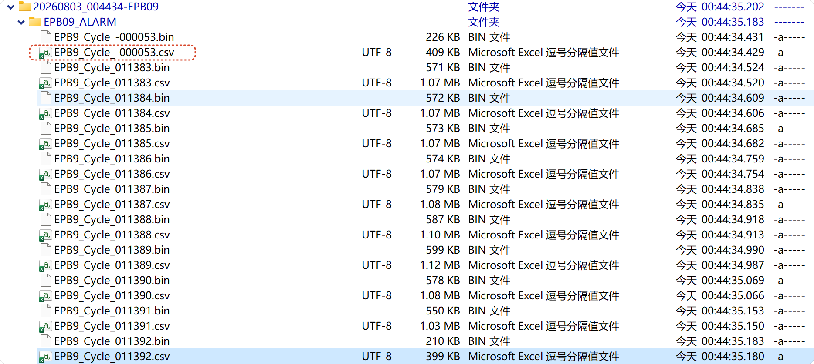
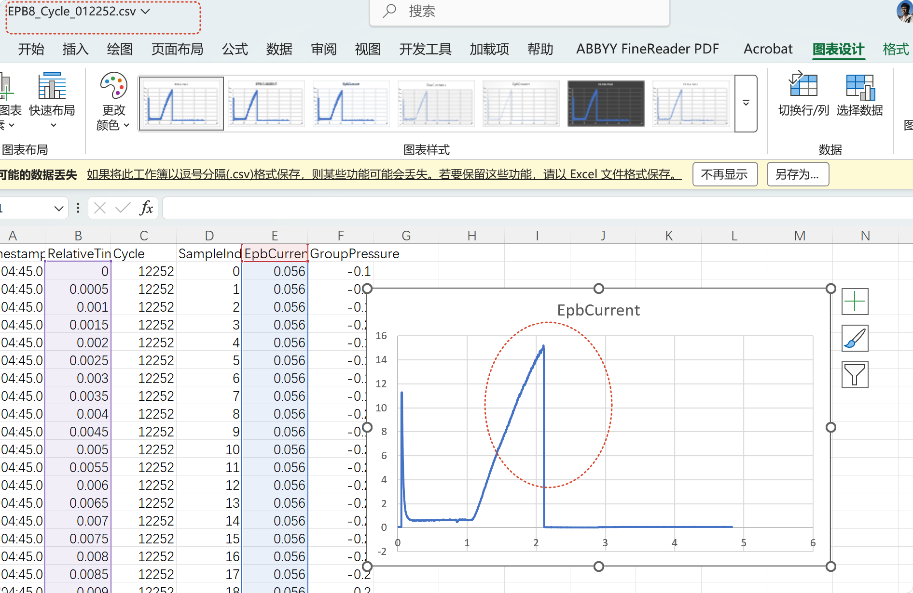

# 10364-009_0731 现场运行日志综合复盘与改进建议

> 数据范围：`D:\EPB_Data\10364-009_0731_20260803_backup` 及当前工作区源码  
> 分析时间：2026-08-03，时间均为现场本地时间（Asia/Shanghai）  
> 适用对象：现场试验、设备、电气与软件开发人员

## 1. 技术摘要

1. **最终“所有卡钳停止”不是四个卡钳在同一时刻发生同一种故障。** EPB10 已于 08-02 03:13:19 因正向电流爬升停滞停止，EPB9 已于 19:04:48 因负载上升后骤降停止；剩余 EPB8、EPB11 于 23:41:30 落入液压组协调竞态，等待统一释压约 62 分钟。00:43:35 的 StopAll 按现场人员确认属于人工停止。

2. **EPB8、EPB11 在 62 分钟等待期间已经执行电机断电。** EPB8 于 23:41:30.786 发出高优先级断电，23:41:30.927 电流降至约 0.078 A；EPB11 于 23:41:32.842 断电，23:41:33.030 电流降至约 0.046 A。因此可以确认控制命令已撤销且电流代理值已清零。但系统没有继电器触点或卡钳负载端电压回读，元数据也记录 `PhysicalOffStatus=NotMeasured`，不能把这一结论扩大为“物理触点已被直接验证断开”。电源 3、4 当时仍保持约 12 V 输出。

3. **23:41～00:43 是否始终保持 70 bar，现有备份无法回答。** 这两个超长周期覆盖了环形缓冲区中的最近圈及自身早期原始样本，只剩液压 DO/AO 命令证据，没有连续压力传感器曲线。软件保持任务可能一直处于活动状态，但“命令保持”不等于“实际高压保持”。

4. **原报告关于“00:52 后液压恢复”的结论需要撤回。** 00:43 后可读取的学习圈压力全部只有约 -0.2～0.4 bar，远低于液压 2 配置的 70 bar。日志中的“建压并保持 70%”、DO 开启及 AO 约 2.11 V 只能证明软件发出了命令。当前 `BuildAndHoldAsync` 不读取实际压力、不等待达到 70 bar、也没有建压超时，所以可以在实际未建压时继续执行。

5. **现场进一步拆检已经确认实际泄漏点：EPB9 卡钳开裂、制动液泄漏。** 日志本身只能证明共享液压 2 没有建立压力，不能从压力值单独识别裂纹位置；现场拆检补齐了物理根因。EPB9 与 EPB8、EPB10、EPB11 共用液压 2，泄漏使该共享回路无法保持压力，因此其他卡钳即使电气动作正常，也无法获得要求的液压工况。

6. **01:00 后 EPB8、EPB11 的“恢复”只能表述为软件重新执行并累计周期。** 该阶段没有足够的压力合格证据，不能据此认定液压功能恢复，也不能把这些圈自动认定为符合试验工况的有效圈。

7. **首要整改不是放宽报警，而是补齐安全闭环和预警证据链。** 必须先建立实际压力合格联锁、液压屏障超时和任何异常先断电的统一路径；同时把单圈峰值超调、单圈电流爬升停滞保存到独立 `WarningSnapshots`，连续 3/5 圈升级硬报警时再保留包含当前报警圈在内的最近 10 圈。

## 2. 本次修订了哪些结论

| 原报告表述 | 本次复核结论 | 修订原因 |
|---|---|---|
| 00:52 后多次出现“启动—建压—停止—回零”，说明液压输出链路恢复 | **不成立。只能证明控制命令被执行；实际压力没有建立** | 00:43 后 40 个可读取学习/告警圈的压力范围仅约 -0.2～0.4 bar；`BuildAndHoldAsync` 没有压力到位判断 |
| 液压硬件永久损坏不受支持 | **日志确认共享液压 2 未建压；现场拆检进一步确认 EPB9 卡钳开裂、制动液泄漏** | 日志不能单独定位裂纹，但现场检查已经找到物理泄漏点；泄漏使共用液压回路无法保持压力 |
| 01:00 后 EPB8、EPB11 恢复连续运行 | **软件循环恢复；液压工况和试验有效性未恢复确认** | 周期完成状态不包含“压力达到 70 bar”的资格判定 |
| 00:43 后启动失败，所以正常循环不建压 | **即使学习或循环被软件判为成功，实际也可能未建压** | 当前实际运行路径将 DO/AO 命令成功误当作建压成功 |

本次修订不改变以下高可信度结论：EPB8/EPB11 的 62 分钟等待由液压协调屏障竞态造成；EPB9、EPB10 在此之前已分别硬停；00:43 StopAll 解除了等待并执行了断电、释压收尾。

## 3. 数据范围、口径与证据优先级

### 3.1 数据范围

- 运行日志：`log\run.log`、`warning.log`、`error.log` 及控制时间线。
- 周期数据：SQLite 索引、环形 BIN、已导出的周期 CSV、`LearningCycles`、`Latest` 与共 13 个 `AlarmSnapshots` 告警目录。
- 配置：备份中的 `Config\TestConfig.xml`，液压 2 为 `ByPressure`，目标 70 bar，安全释压阈值 5 bar、稳定 100 ms、释压超时 5000 ms。
- 源码：液压控制、压力组协调、批量学习、自适应控制、告警快照和 StopAll 路径。
- 两份前序文档：初次日志分析及现场人员提出的进一步问题。
- 现场拆检结论：EPB9 卡钳开裂并发生制动液泄漏，作为 2026-08-03 现场确认信息纳入本报告。

### 3.2 计数口径

“正式完成圈数”来自软件的 `completed` 状态，仅表示程序完成了该圈状态机。由于程序没有把实际压力到位作为进入电控及完成圈的必要条件，**完成圈数不等于压力合格圈数**。尤其是 00:43 后的周期，不能在未补充压力资格证据时作为有效试验圈使用。

### 3.3 证据优先级

1. 原始逐点 CSV/BIN、SQLite 状态和带时间戳的运行日志；
2. 告警元数据、DO/AO 时间线和电源遥测；
3. 与现场时序一致的源码路径；
4. 现场拆检、维修记录及现场人员对操作来源的确认；
5. 无法直接观测且未经现场拆检确认的部分，只给出可能性，不作唯一硬件归因。

当前源码包含 2026-08-03 的后续提交，不能默认与现场运行二进制完全相同。源码只用于解释可复现的机制和提出整改；现场事实仍以备份数据为准。

## 4. 全局运行历程与最终停机链

### 4.1 正式运行概览

| 会话 | 时间范围 | EPB8 | EPB9 | EPB10 | EPB11 | 主要事件 |
|---|---:|---:|---:|---:|---:|---|
| S1 | 07-31 15:50～17:17 | 345 | 345 | 163 | 345 | EPB10 圈 164 硬停，之后人工 StopAll |
| S2 | 07-31 17:19～20:30 | 763 | 763 | 175 | 763 | EPB10 圈 340 再次硬停，之后人工 StopAll |
| S3 | 07-31 20:33～08-02 01:19 | 6903 | 6042 | 425 | 6903 | EPB10 圈 766 硬停；EPB9 圈 7151 超调硬停；其余继续 |
| S4 | 08-02 01:21～01:31 | 39 | 39 | 39 | 24 | EPB11 圈 8036 发生 DAQ 陈旧故障，之后人工 StopAll |
| S5 | 08-02 01:34～08-03 00:43 | 5308 | 4201 | 395 | 5308 | EPB10、EPB9先后硬停；EPB8/11 于23:41进入协调死等；00:43人工停止 |
| S6 | 08-03 00:55～00:56 | 2 | — | — | — | EPB8 软件侧单路验证，人工停止；实际压力未合格 |
| S7 | 08-03 01:00～备份结束 | 1689 | — | — | 1689 | EPB8、EPB11 软件循环继续；压力合格性未确认 |

备份中的累计软件正式完成数：EPB8 为 15049 圈、EPB9 为 11390 圈、EPB10 为 1197 圈、EPB11 为 15032 圈。

### 4.2 最终停机不是一个瞬时事件

| 时间 | 事件 | 对系统的影响 |
|---|---|---|
| 08-02 03:13:19 | EPB10 圈 1201 触发 `ForwardCurrentRiseStalled` | EPB10 停止，其他通道继续 |
| 08-02 19:04:48 | EPB9 圈 11392 触发 `AbnormalLoadRiseDrop` | EPB9 停止，仅剩 EPB8、EPB11 连续运行 |
| 08-02 23:41:30.005 | EPB8 圈 13359 启动，液压 2 发出保持命令 | 压力组登记 EPB8、EPB11 |
| 23:41:30.786～30.927 | EPB8 因快速峰值判定提前断电，电流降至约 0.078 A | EPB8 从 `InFlight` 移除并等待统一释压 |
| 23:41:30.817 | EPB11 圈 13345 到达 800 ms 相位 | EPB11 的启动路径再次把组成员登记，EPB8 被重新加入 |
| 23:41:32.842～33.030 | EPB11 正向完成并断电，电流降至约 0.046 A | EPB11 被移除，但 EPB8 残留；统一释压条件永久不成立 |
| 08-03 00:43:35.932 | 现场人工 StopAll | 取消两个超长周期，关闭电机和液压输出，解除等待 |
| 00:43:36.046 | 释压确认约 0.218 bar | StopAll 收尾完成 |

### 4.3 为什么现有异常处理没有阻止 62 分钟等待

当前协调器在“已经开始执行统一释压”之后，会等待压力降到 5 bar 以下并设置 5 秒超时；自适应 Runner 也能捕获 `HydraulicReleaseTimeoutException` 并断电报警。但本次问题发生在更早的阶段：

1. EPB8 已从 `InFlight` 移除；
2. EPB11 的启动路径又把 EPB8 加回；
3. EPB11 随后移除自己，集合仍剩 EPB8；
4. `InFlight.Count == 0` 永远不成立，因此统一释压根本没有开始；
5. 现有 5 秒释压确认超时没有机会生效，调用方无限等待 `ReleaseCompletion`，直到 StopAll 取消。

根因是压力组成员登记缺少“压力组 + 周期代次”的幂等边界，同时屏障等待本身没有上限。它不是单一卡钳没有发出释放信号，也不是释压后的低压确认超时。

## 5. 四个卡钳的完整历程

### 5.1 EPB8：最终停滞主要是软件竞态，提前切断仍需修复

- 启动初期两次预释放失败：反向空行程没有在预算内确认；多次人工重试后学习成功。
- 正式软件完成 15049 圈，未出现正式硬故障；最终圈 13359 因液压协调等待被 StopAll 封为 `canceled`。
- 23:41:30 日志先以“全速峰值 15.349 A”触发 `ClampReachedFullRatePeak` 并提前断电，但随后完整峰值只有约 1.794 A，两个值严重矛盾。
- 当前自适应逻辑确实允许新鲜的全速峰值一达到目标就立即结束正向，因此提前切断与程序逻辑直接相关；但现有证据不能唯一判断是峰值追踪器未清零、跨圈陈旧峰值、采样时间窗错配，还是日志口径不一致。
- 00:55 后虽然软件能够再次执行周期，但相关学习数据压力最高仅约 0.4 bar，不应表述为完整试验能力已经恢复。

**风险判断：** EPB8 卡钳本体没有持续退化的直接证据；P0 风险是协调器死等和无压力联锁，P1 风险是峰值数据的新鲜度与周期归属。

### 5.2 EPB9：先超调，后出现持续负载建立失败

- 启动阶段即出现 `ForwardLoadRiseNotStarted`，当时仍可能通过重新接线、按下通道按钮或再次学习恢复。
- 08-01 21:44:04，圈 7151 连续 3 圈峰值误差超过 +0.8 A，最终峰值 15.841 A、目标 15 A，触发 `ForwardPeakOvershoot`。
- 08-02 19:04:48，圈 11392 出现 `AbnormalLoadRiseDrop`：峰值约 6.679 A，随后电流降到约 3.954 A，通道停止。
- 00:44、00:46、00:57、00:58 的学习均在约 2.6 秒后因负载仍未建立而失败，失败时电流约 0.661～0.680 A。
- 这些后续失败同时发生在液压实际接近零的背景下。日志分析阶段无法在泵、阀、管路、传感器和卡钳之间唯一定位；现场进一步拆检已经确认 EPB9 卡钳开裂、制动液泄漏，构成此次不能建压的物理根因。

程序已经使用历史峰值误差修正预测提前量，正误差会推动以后更早断电；但本次连续 3 圈仍越过 +0.8 A 警戒线，说明现有适应速度、幅度限制或峰值反馈质量不足。建议第一圈超调即增加有界提前量并记录变化，连续超调才硬停，且每次调整必须由新鲜、同圈的峰值样本驱动。

**现场确认结论：** EPB9 的裂纹和制动液泄漏不是由日志直接识别出的结论，而是现场拆检结果。日志中的共享压力接近零、EPB9 负载建立失败与该结果相互一致。由于 EPB9 接在液压 2 的共享回路上，泄漏会使同组其他卡钳失去合格压力；因此后续 EPB8、EPB11 的软件循环不能视为有效液压试验。

**为什么 EPB9 学习失败会拖住其他正常卡钳：** 批量学习为每个通道创建任务并执行 `Task.WhenAll`；任一任务失败会调用共享的 `CancelActiveLearningPhase()`，共享 CTS 随即取消整个学习阶段。这是“整批同成败”的软件策略，不是其他卡钳也发生了电气故障。建议仅在共享压力、电源或共享 DAQ 故障时扩大到组停；通道自身学习失败应隔离该通道并允许健康通道继续。

### 5.3 EPB10：四次同型退化，连续 5 圈逻辑已经生效

EPB10 软件正式完成 1197 圈，发生 4 次同型硬故障：

| 时间 | 圈号 | 峰值 | 结果 |
|---|---:|---:|---|
| 07-31 16:31:50 | 164 | 14.051 A | `ForwardCurrentRiseStalled` |
| 07-31 18:03:49 | 340 | 13.855 A | `ForwardCurrentRiseStalled` |
| 07-31 22:19:49 | 766 | 14.038 A | `ForwardCurrentRiseStalled` |
| 08-02 03:13:19 | 1201 | 14.138 A | `ForwardCurrentRiseStalled` |

这里的“5次之后报警”是指连续 5 个正式圈满足低目标平台条件，计数达到 `Streak=5/5` 后生成一次硬故障，不是每一个低平台圈都生成一次报警。四个告警目录分别包含 10 个 EPB10 周期文件，且告警圈就是这 10 圈中的最后一圈：155～164、331～340、757～766、1192～1201。

因此两项逻辑均已实现：

- 连续 5 圈确认后才硬停，避免单圈偶发波动直接报警；
- 每次硬故障保留“包含当前告警圈在内的最近 10 圈”。

之所以现场不容易看到，是快照目录没有清单说明“当前告警圈是否计入 10 圈”，也没有把前 4 个低平台圈单独标成告警。建议增加 `snapshot-manifest.json/md`，列明连续计数链、告警圈和每个文件角色。

**风险判断：** 四次故障跨多个会话重复出现且峰值都低于 14.2 A，优先检查卡钳机械传动、摩擦/丝杠、电源组 4 负载压降、继电器触点和电流采样通道，不应按偶发误报处理。

### 5.4 EPB11：一次 DAQ 陈旧保护，最终停滞来自共享协调器

- 软件正式完成 15032 圈。
- 08-02 01:28:09，圈 8036 触发 `DaqSampleStale>100ms`。该保护表示控制决策使用的样本超过 100 ms 未更新；在电机可能带电时影响较大，继续运行会失去过流、夹紧和释放判断依据。
- 该故障后其他通道能够完成收尾，EPB11 被单独停止；全局重启后恢复，说明更像采集线程、调度延迟或时间戳问题，而非持续机械损坏。
- 23:41 的正向动作和断电本身正常，随后与 EPB8 一起被共享液压释放屏障拖住。

DAQ 陈旧不能通过“继续带电等待数据恢复”自适应。合理策略是：第一时间高优先级断电并释压，封存故障上下文；仅在采集服务重启或重置后连续收到一段新鲜、时间戳单调的样本，才允许受控重试一次。若同一采集设备服务多个通道，应根据设备级健康检查决定停一个通道还是停整个 DAQ 组。

## 6. 压力历程重新分析

### 6.1 23:41 前压力曾正常建立

08-02 19:04 的 EPB9 告警快照中，EPB8 圈 12252、EPB9 圈 11392、EPB11 圈 12238 的 `GroupPressure` 峰值均约 78.2 bar，说明至少在该时刻共享液压 2 和压力采集链路能够记录到高于 70 bar 的实际压力。

### 6.2 23:41～00:43 只能确认命令，不能确认实际压力

卡死圈 EPB8 13359、EPB11 13345 各写入约 745 万样本，持续约 3724 秒。超长写入覆盖了环形缓冲区原有位置，导致 StopAll 导出最近 10 圈时校验失败，也无法恢复卡死圈从开始到结束的完整压力曲线。

因此这一小时只能确认：软件发出了液压 2 DO 开启和 AO 70 的保持命令，并直到取消时才执行收尾。不能确认压力实际达到、稳定保持或中途下降。

### 6.3 00:43 后实际没有建压

对 StopAll 后全部可读学习圈重新统计如下：

| 学习批次 | 通道和文件数 | 实际压力范围 |
|---|---|---:|
| 00:44，`367b0c9b…` | EPB8、10、11 各 1 圈；EPB9 告警圈 -53 | 约 -0.1～0.3 bar；EPB9 最高 0.2 bar |
| 00:46，`1536fa68…` | EPB8、9、10、11 各 1 圈 | 约 -0.1～0.3 bar |
| 00:53，`c7772071…` | EPB8 共 10 圈 | 约 -0.2～0.4 bar |
| 00:56，`c4e0a3f3…` | EPB11 共 1 圈 | 约 -0.2～0.3 bar |
| 00:57，`6718baa9…` | EPB9 共 1 圈 | 约 0.1～0.3 bar |
| 00:58，`6cfe6552…` | EPB8、EPB11 各 10 圈 | 约 -0.2～0.4 bar |

00:44:17.895 的日志已经记录液压命令开始和 AO 约 2.11 V，但随后 EPB9 学习圈 -53 在 00:44:29.370～00:44:32.989 的压力只有 -0.1～0.2 bar。这一组相邻证据直接证明“软件命令成功”与“物理压力建立”发生了分离。

### 6.4 为什么程序仍然允许卡钳动作

当前实际协调路径调用 [`HydraulicController.BuildAndHoldAsync`](../../Controller/HydraulicController.cs)。该方法执行：

1. 开启压力 DO；
2. 写入配置值到 AO；
3. 记录“建压并保持”；
4. 等待外部 `Release()` 或取消。

它没有调用压力读取函数，也没有等待实际压力达到 70 bar。配置虽然声明 `Mode=ByPressure`，但该路径没有落实此模式。另一个 `RunOnceAsync` 路径具有压力轮询逻辑，但压力组协调器没有使用它作为电机上电前的资格屏障。

### 6.5 日志诊断边界与现场确认根因

四个卡钳都读取到接近零的共享压力，日志首先把问题范围收敛到共享液压输出链或共享测量链，而不是四个卡钳同时发生独立故障。仅凭日志，候选范围仍包括泵、压力 DO/继电器、阀、AO 输出/转换、管路泄漏、卡钳泄漏、传感器及其采集通道。

现场进一步拆检确认：**EPB9 卡钳开裂并发生制动液泄漏**。这使液压 2 的共享回路无法建立和保持压力，解释了 00:43 后四个通道记录到的接近零压力。该结论的证据来源是现场物理检查，不是软件日志对裂纹位置的直接检测。

后续软件应在“DO/AO 命令有效但实际压力持续未达标”时，提示检查：卡钳壳体或密封开裂、接头及管路泄漏、制动液液位、泵/阀动作和压力传感器。若同时观察到某通道异常电流、机械行程或局部渗漏，应在提示中突出该通道，但不能在缺少物理反馈时由软件直接断言裂纹位置。

## 7. 对进一步问题的逐项答复

### 7.1 事项 1：死等、断电、提前结束和液压保持

1. **是否缺少异常处理：** 有释压开始后的低压确认超时，但缺少 `InFlight` 屏障等待超时、代次幂等和实际建压资格判断，所以本次异常没有被捕获。
2. **卡钳是否断电：** 命令和电流代理证据支持电机已断电；物理继电器状态未直接测量，电源模块仍处于输出状态。
3. **EPB8 为什么在 800 ms 前结束：** 自适应逻辑接收到 15.349 A 的全速峰值后允许立即切断；该值与之后 1.794 A 的完整峰值矛盾，属于程序峰值数据质量/周期归属问题的高概率表现，但尚不能唯一确认是哪一个内部状态未清零。
4. **62 分钟是否保持高压：** 无法验证。软件保持任务可能持续，但实际压力曲线已被覆盖。
5. **更合理的逻辑：** 见第 8 节的压力资格、代次屏障、超时和故障范围设计。

### 7.2 事项 2：StopAll 来源

现场人员确认本批数据中的 StopAll 均为人工操作；旧日志只写“收到停止全部 EPB 请求”，无法仅靠日志区分按钮、报警、启动回滚、关闭程序或其他调用点。

建议将入口改为 `StopAll(StopContext context)`，至少记录：

- `Source`：`ManualUi`、`Alarm`、`Interlock`、`StartupRollback`、`ApplicationClosing`；
- `ReasonCode` 和可读原因；
- 操作者或 UI 控件名；
- `CorrelationId`、请求时间和执行完成时间；
- 每个通道的断电、电流清零、液压关闭和电源关闭结果。

日志应分开记录 `StopRequested`、`FailSafeActionsStarted`、`ChannelStopped`、`PressureReleased` 和 `StopCompleted`，避免把“收到请求”误当作全部动作已完成。

### 7.3 事项 3：学习、自适应和通道隔离

**EPB8 预释放：** 可以增加有限自适应，但不能无限重试。建议先测反向空行程基线和供电状态，允许最多 2 次参数有界的自动重试；仍失败时区分“有电流但机械未释放”和“近零电流/疑似输出开路”，给出针对性提示。

**EPB9 面板按钮提示：** “按钮未按”可以保留为以后同类故障的诊断分支，但不是本次故障的最终原因；本次已经由现场拆检确认是 EPB9 卡钳开裂、制动液泄漏。以后只有在共享压力已合格、程控电源回读正常、连接预检通过，而某一通道正反向命令后电流仍持续接近空载/零电流时，才提示检查该通道按钮、继电器、接插件和线束。若共享压力本身未达标，应优先提示检查卡钳、管路、接头和制动液泄漏，不能先把问题归因于按钮。

**峰值超调：** 程序已有预测提前量和峰值偏差修正，但要增加同圈新鲜度校验、第一圈超调后的有界提前修正、调整量日志和最大/最小断电时机限制。

**为什么健康卡钳不能启动：** 学习任务共享取消源，任一通道失败会取消整个批次。应将通道故障隔离，仅共享压力、电源、DAQ 设备故障触发组停或全停。

**EPB10 最近 10 圈：** 已实现，四个告警目录均验证为包含当前告警圈在内的 10 圈；缺少的是清晰的快照清单和 UI 展示。

**EPB11 DAQ 陈旧：** 影响较大。必须先断电和释压，再允许采集层重置；连续收到新鲜样本后可自动重试一次，同一会话复发则保持停机并升级告警。

### 7.4 事项 5：如何避免无界等待和数据覆盖

- 对每个 Runner 阶段设置最大时长，液压屏障最多等待一个试验周期；超时立即进入统一故障收尾。
- 当前圈设置最大样本数和最大持续时间；达到任一上限，先封存并导出诊断尾窗，禁止继续覆盖历史圈。
- 将“最近 10 个完整圈”放入独立、不可被当前运行圈覆盖的归档区；环形区只承担短时采样缓存。
- 对超长圈保留“起始窗口 + 最近窗口 + 降采样中段摘要”，既控制空间又保留故障前后证据。
- StopAll 和异常停机导出失败时，应生成独立的完整性告警，不能只写普通警告日志。

### 7.5 事项 6：负数圈、重复数据、局部快照和压力

**为什么出现 `-000053`：** `BeginLearningCycle` 有意为学习圈分配负数编号，使其不与正式正数圈冲突，也不参与正式完成计数。这不是圈号倒退或数据损坏。建议在目录和 UI 中直接显示 `Learning-0053`，不要只暴露内部负数。

**为什么后面又出现 11383～11392：** 00:44 的 EPB9 学习告警先封存当前学习圈 -53，再追加最近 10 个正式完成圈。由于 EPB9 自 19:04 后没有新增正式圈，最近 10 圈仍是 11383～11392。对两次快照的 10 个 CSV 和 10 个 BIN 执行 SHA-256 比较，20 个文件全部完全一致。这是当前快照策略的预期结果，不是重复采集。



**其他卡钳最后一圈为什么不完整：** 告警通道会封存明确的报警边界；其他仍运行通道用 `includeRunningCycle=true` 导出报警时刻的当前局部圈。19:04 快照中：

| 文件 | 时间范围 | 时长 | 压力峰值 | 电流峰值 | 含义 |
|---|---|---:|---:|---:|---|
| EPB8 圈 12252 | 19:04:45.002～49.831 | 4.83 s | 78.2 bar | 15.21 A | 报警时刻的运行中局部快照 |
| EPB9 圈 11392 | 19:04:45.802～49.161 | 3.36 s | 78.2 bar | 11.72 A | 完整告警圈及断电尾窗 |
| EPB11 圈 12238 | 19:04:45.802～50.491 | 4.69 s | 78.2 bar | 15.19 A | 报警时刻的运行中局部快照 |

EPB8、EPB11 并没有随 EPB9 一起停止，之后日志显示两者继续运行。局部圈不完整是快照时点造成的，不是数据截断故障。



压力问题的修订结论见第 6 节：00:43 后实际压力未建立，原“液压已恢复”的表述不成立。

## 8. 建议的容错、断电和即时报警逻辑

### 8.1 P0：必须在继续试验前完成

#### A. 实际压力资格屏障

1. 压力组创建唯一 `GenerationId`；
2. 开启 DO、写 AO 后持续读取压力；
3. 只有实际压力达到配置阈值 70 bar，并稳定达到配置时长后，才完成 `PressureQualified`；
4. 所有成员必须等待 `PressureQualified`，未合格禁止电机上电；
5. 建压超时、压力无效或压力在运行中跌破允许范围时，立即高优先级断电、关闭 DO/AO、封存数据并产生共享液压组报警；
6. 每圈记录设定压力、达到阈值时间、稳定时长、峰值、最低值和失败原因。

需要特别清理当前“Bar/百分比/AO 电压”混用：配置名为 `PressureThresholdBar`，日志却写成 `70%`。对外日志必须同时写清 `TargetPressureBar`、`AoCommandPercent` 和 `AoVoltage`，不能用一个数表示三个含义。

#### B. 幂等的压力组代次与屏障超时

- 每个压力组、每一正式/学习周期只登记一次成员集合；成员只能在同一代次中经历一次 `Entered → Released/Failed`。
- 晚到的通道只能加入尚未冻结的新代次，不能把已经释放的成员重新加入旧代次。
- 屏障等待不得超过一个配置试验周期；超时后输出 `HydraulicBarrierTimeout`，记录代次、成员状态和等待时长。
- 超时路径必须先对所有相关电机执行高优先级断电，再强制释放液压；无论快照、日志或数据库写入是否成功，都不能阻塞断电和释压。

#### C. 所有异常统一“先安全、后诊断”

统一顺序应为：

1. 撤销正反向 DO；
2. 用新鲜电流样本确认电流清零；无法确认时按未断电处理并升级告警；
3. 关闭液压 DO/AO并确认压力进入安全区；
4. 封存周期和最近数据；
5. 再执行采集重启、用户提示和可选重试。

建议增加卡钳负载端电压或继电器辅助触点反馈，从“电流代理确认”升级到物理断电确认。

### 8.2 P1：提高可用性和诊断质量

- **故障范围隔离：** 增加 `FaultScope`，区分 `Channel`、`ElectricalGroup`、`HydraulicGroup`、`DaqGroup` 和 `Global`；只有共享资源异常才扩大停机。
- **预释放自适应：** 基于空行程电流、稳定时间和历史成功值有限调整，最多自动重试 2 次；禁止无限学习。
- **DAQ 恢复：** 断电后重置采集，连续新鲜样本通过后只重试一次；重复陈旧则锁定通道或采集组。
- **持久化上限：** 当前圈设置最大时长、最大样本数和磁盘预算；异常超限立即分段封存。
- **硬报警快照清单：** 每个文件标注 `AlarmCycle`、`HistoricalCompletedCycle`、`AuxiliaryRunningPartial` 或 `LearningCycle`，并记录是否完整。
- **停止来源：** 使用结构化 `StopContext`，让日志能区分人工和自动动作。

### 8.3 P1：建立软预警单圈快照与硬报警 10 圈证据链

当前 `WarningRaised` 只写日志并通知 UI，没有保存当前圈原始数据。建议把软预警和硬报警分成两个互不混淆的路径：

软预警的标准目录为：`StoreDir\TestName\WarningSnapshots\EPBxx\<WarningCode>\yyyyMMdd_HHmmssfff-Cyclexxxxxx-StreakNofM\`。

```text
StoreDir\TestName\
├─ WarningSnapshots\
│  └─ EPB09\
│     └─ ForwardPeakOvershootWarning\
│        └─ 20260801_214300123-Cycle007149-Streak1of3\
│           ├─ EPB9_Cycle_007149.csv
│           ├─ EPB9_Cycle_007149.bin
│           ├─ warning-metadata.json
│           └─ checksums.sha256
└─ AlarmSnapshots\
   └─ 20260801_214404-EPB09\
      ├─ EPB09_ALARM\
      │  └─ 当前硬报警圈及之前9个正式完整圈
      ├─ alarm-metadata.json
      └─ warning-chain.json
```

#### A. 软预警快照

第一阶段只纳入两类明确事件：

| 软预警代码 | 单圈触发条件 | 连续硬报警条件 | 软预警保存内容 |
|---|---|---:|---|
| `ForwardPeakOvershootWarning` | 本圈正向实际峰值误差超过平衡带，例如当前配置 +0.8 A | 连续 3 圈 | 当前完整圈 CSV、BIN、元数据和 SHA-256 |
| `ForwardCurrentRiseStallWarning` | 本圈出现 `LowTargetPlateau`，峰值低于合格下限且爬升斜率不足 | 连续 5 圈 | 当前完整圈 CSV、BIN、元数据和 SHA-256 |

- 软预警在当前圈完成反向释放并正式封存后再导出，保证保存的是完整单圈，而不是报警瞬间的局部圈。
- 连续 3 圈超调时，第 1、2 圈分别生成 `Streak1of3`、`Streak2of3` 单圈预警快照；第 3 圈升级为硬报警，由 `AlarmSnapshots` 保存 10 圈，不在 `WarningSnapshots` 重复复制。
- 连续 5 圈爬升停滞时，第 1～4 圈分别保存单圈预警快照；第 5 圈升级硬报警并保存 10 圈。
- 中间出现正常圈时连续计数归零，但已经生成的单圈预警快照继续保留，用于追查间歇性问题。
- 超过立即硬报警上限的单圈峰值，例如命中 `OvershootAlarmDeltaA`，直接进入硬报警 10 圈快照，不先生成软预警副本。

`warning-metadata.json` 至少包含：通道、圈号、预警代码、发生时间、峰值、目标值、峰值误差、斜率、窗口时长、连续计数、确认阈值、样本起止时间、样本数量、完整性、CSV/BIN 文件名、校验值和关联硬报警目录。

#### B. 连续阈值硬报警快照

- 硬报警继续使用现有 `AlarmSnapshots`，固定导出 **当前硬报警圈 + 之前 9 个正式完整圈，共 10 圈**。
- 如果试验开始后尚不足 10 圈，则导出全部可用正式圈，并在 `alarm-metadata.json` 中记录 `RequestedCycles=10`、`ExportedCycles=<实际数量>` 和不足原因。
- 新增 `warning-chain.json`，列出形成连续条件的每个圈号、`StreakNofM`、预警代码及其 `WarningSnapshots` 相对路径；达到阈值的最后一圈标为 `HardAlarmTerminalCycle`。
- 硬报警圈仍按照当前安全顺序先断电、保留断电尾窗、原子封圈，再导出证据；快照写盘失败不得影响断电和释压。

#### C. 并发、去重和容量

- 快照导出必须在控制线程之外执行；控制线程只提交不可变的 `WarningSnapshotRequest`。
- 以 `TestRunId + Channel + CycleNumber + WarningCode` 作为幂等键，同一圈重复回调只能产生一个目录。
- 导出失败写入独立 `snapshot-export-errors.log`，并在 UI 显示“控制已完成、证据保存失败”，不得伪装成控制故障。
- 默认在本次试验生命周期内保留全部软预警单圈快照。后续实现可增加磁盘配额和归档策略；配额清理只能处理已归档的旧软预警快照，不能覆盖或删除硬报警 10 圈证据。
- 完整 CSV/BIN 每圈体积较大，UI 应显示 `WarningSnapshots` 占用空间、预计剩余可保存圈数和磁盘不足预警。

### 8.4 P2：完善自适应可解释性

- 峰值采集增加 `CaptureId`、RunId、圈号、样本起止时间、样本数量、来源和质量标志。
- 周期开始时显式清零峰值追踪器；只有圈号、代次和时间窗匹配的峰值才能参与提前断电。
- 快速峰值与完整峰值矛盾超过容差时，不立即进入释放屏障；先断电并记录 `PeakEvidenceMismatch`。
- 每次预测提前量调整记录旧值、新值、峰值误差和限制原因，便于验证超调自适应是否真正生效。

## 9. 建议接口与结构化日志

本报告只提出接口建议，不修改运行代码。

```csharp
public sealed record StopContext(
    StopSource Source,
    string ReasonCode,
    string Initiator,
    Guid CorrelationId,
    DateTime RequestedUtc);

public sealed record PressureQualification(
    int HydraulicId,
    long GenerationId,
    double TargetBar,
    double ActualBar,
    DateTime? ReachedUtc,
    int StableMs,
    double MinBar,
    double MaxBar,
    string FailureReason);

public sealed record WarningSnapshotRequest(
    Guid TestRunId,
    int Channel,
    int CycleNumber,
    string WarningCode,
    int Streak,
    int ConfirmThreshold,
    DateTime OccurredUtc,
    double PeakCurrentA,
    double TargetCurrentA,
    double PeakErrorA,
    double SlopeAperMs);

public sealed record WarningSnapshotManifest(
    WarningSnapshotRequest Trigger,
    DateTime FirstSampleUtc,
    DateTime LastSampleUtc,
    int SampleCount,
    bool IsCompleteCycle,
    IReadOnlyDictionary<string, string> FileSha256,
    string LinkedAlarmSnapshotPath);

public sealed record WarningSnapshotConfig(
    bool Enabled,
    string RootDirectory,
    bool SaveCsv,
    bool SaveBin,
    int HardAlarmLastNCycles,
    long? SoftWarningQuotaBytes);

public enum FaultScope
{
    Channel,
    ElectricalGroup,
    HydraulicGroup,
    DaqGroup,
    Global
}
```

结构化停止日志至少包含：`Event`、`Source`、`ReasonCode`、`FaultScope`、`Channel/Group`、`GenerationId`、`CorrelationId`、`RequestedUtc`、`MotorOffConfirmed`、`PressureSafeConfirmed` 和 `CompletedUtc`。

快照职责必须保持清晰：

| 类型 | 触发时机 | 保存圈数 | 是否停机 | 主要用途 |
|---|---|---:|---|---|
| `WarningSnapshot` | 单圈软预警且当前圈完整封存后 | 当前 1 圈 | 否 | 观察趋势、自适应效果和间歇性异常 |
| `AlarmSnapshot` | 连续 3/5 圈达到硬报警或命中立即硬上限 | 最近 10 圈，含当前硬报警圈 | 是 | 停机判定、故障复盘和完整证据链 |

硬报警快照清单至少包含：文件名、通道、圈号、学习/正式属性、完整/局部属性、样本时间范围、样本数量、校验哈希及生成原因。软预警快照使用独立的 `WarningSnapshotManifest`，不得复用“报警停机”语义。

## 10. 验证场景与验收标准

1. **EPB8 在 EPB11 的 800 ms 相位前结束：** EPB8 不得被重新加入旧代次；两路必须正常释压或在一个周期内触发屏障超时。
2. **DO/AO 命令成功但传感器保持 0 bar：** 电机不得上电，学习/正式圈不得记为成功，必须生成液压组告警。
3. **压力达到 70 bar 后运行中下降：** 立即断电并释压，告警记录最低压力和下降时间。
4. **释放成员永久缺失：** 超时后完成断电、释压和封存，不允许无限等待或覆盖最近 10 圈。
5. **单通道学习失败：** 故障通道隔离，其他通道在共享资源健康时继续；共享压力故障则整压力组停止。
6. **DAQ 样本超过 100 ms：** 电机先断电；采集恢复并连续新鲜后最多重试一次，复发则锁定并报警。
7. **连续峰值超调 3 圈：** 第 1、2 圈各生成一份完整单圈 `WarningSnapshot`；第 3 圈触发硬报警，`AlarmSnapshots` 导出当前圈和之前 9 圈，并通过 `warning-chain.json` 关联前两份预警。
8. **连续电流爬升停滞 5 圈：** 第 1～4 圈各生成单圈预警快照；第 5 圈产生一次硬报警，硬报警目录合计保存最近 10 圈。
9. **连续条件被正常圈打断：** 连续计数立即清零，之后重新从 `Streak1ofM` 开始；已经保存的历史预警快照不得删除或改写。
10. **同圈重复预警回调：** 相同 `TestRunId + Channel + CycleNumber + WarningCode` 只能生成一个快照目录，元数据与校验文件保持一致。
11. **软预警快照导出失败：** 不阻塞反向释放、下一圈控制或安全停机；UI 和独立错误日志明确显示证据保存失败。
12. **硬报警时不足 10 圈：** 导出全部可用圈，元数据同时记录请求 10 圈、实际圈数和不足原因。
13. **学习圈报警：** UI 显示学习圈身份，快照清单解释负数内部圈号及重复历史圈来源。
14. **其他通道运行中快照：** 文件被标为 `AuxiliaryRunningPartial`，不改变其他通道的运行状态。
15. **所有 StopAll 入口：** 日志能够唯一确定人工按钮、报警、联锁、启动回滚或程序退出来源。
16. **泄漏诊断提示：** 在 DO/AO 命令有效但实际压力持续未达标时，提示检查卡钳、接头、管路和制动液；只有共享压力合格后出现单通道近零电流，才进入按钮、继电器和线束提示分支。

## 11. 结论可信度与未决事项

| 结论 | 可信度 | 说明 |
|---|---|---|
| EPB8/EPB11 卡在液压释放屏障 | 高 | 日志时序、超长 running 圈、取消后行为和源码机制一致 |
| 竞态为 EPB8 释放后被 EPB11 路径重新登记 | 高，代码级推断 | 31 ms 时序窗口与集合逻辑吻合；缺少当时内存中的 `InFlight` 转储 |
| 两路等待期间电机控制命令已撤销、电流代理清零 | 高 | 高优先级断电日志和电流清零记录一致 |
| 物理继电器触点已经断开 | 无法验证 | 没有触点或负载端电压反馈，`PhysicalOffStatus=NotMeasured` |
| 23:41～00:43 实际压力持续为 70 bar | 无法验证 | 卡死圈逐点压力已被环形缓冲覆盖 |
| 00:43 后实际压力没有建立 | 高 | 40 个可读学习/告警圈跨四个通道，最高约 0.4 bar |
| EPB9 卡钳开裂、制动液泄漏导致共享液压 2 无法建压 | 高，现场确认 | 日志证明共享压力异常；裂纹和泄漏位置来自现场拆检，不是日志直接识别 |
| EPB8 提前切断由陈旧峰值造成 | 中 | 快速峰值与完整峰值明显矛盾，但缺少峰值捕获 ID 和内部状态转储 |
| EPB10 存在持续性退化 | 高 | 四个会话重复同型故障，峰值均低于 14.2 A |
| 本次 EPB9 后续失败由面板按钮未按造成 | 已排除 | 现场已确认卡钳开裂和制动液泄漏；按钮提示仅保留为其他同类故障的诊断分支 |

仍需现场补充的关键验证：

- 保存 EPB9 裂纹照片、泄漏位置、制动液损失情况、维修/更换件编号和现场处置时间，形成可审计的拆检记录；
- 更换或修复 EPB9 后，对液压 2 执行保压和泄漏试验，并同步记录 DO、AO 电压、泵/阀状态和独立机械压力表；
- 对同压力组的管路、接头和制动液液位进行检查、补液和排气，确认泄漏没有造成二次污染或残余气体；
- 对 EPB10 做负载状态下电源组 4 电压、电流采样通道和机械机构的同步测量；
- 为峰值追踪器加入 CaptureId 后复现一次 EPB8 的快速峰值/完整峰值矛盾。

## 12. 关键证据索引

- 初次分析：[`10364-009_0731_现场运行日志分析_20260803.md`](10364-009_0731_现场运行日志分析_20260803.md)
- 现场进一步问题：[`对于_10364-009_0731_现场运行日志分析_20260803_的进一步_20260803.md`](对于_10364-009_0731_现场运行日志分析_20260803_的进一步_20260803.md)
- 现场拆检确认（2026-08-03）：EPB9 卡钳开裂、制动液泄漏；本项为现场补充证据，原始日志中没有裂纹图像或维修记录。
- 液压保持实现：[`Controller/HydraulicController.cs`](../../Controller/HydraulicController.cs)
- 压力组协调：[`Controller/HydraulicGroupCoordinator.cs`](../../Controller/HydraulicGroupCoordinator.cs)
- 批量学习与共享取消：[`Controller/EpbManager.BatchStart.cs`](../../Controller/EpbManager.BatchStart.cs)
- 告警快照与 StopAll：[`Controller/EpbManager.cs`](../../Controller/EpbManager.cs)
- 自适应判定：[`Controller/Adaptive/EpbAdaptiveControl.cs`](../../Controller/Adaptive/EpbAdaptiveControl.cs)
- 学习圈和最近圈导出：[`DataOperation/EpbDiskWriter.cs`](../../DataOperation/EpbDiskWriter.cs)
- 原始数据根目录：`D:\EPB_Data\10364-009_0731_20260803_backup`

---

**最终结论：** 现场最终全停由“EPB10、EPB9先后通道硬停 + EPB8、EPB11液压协调死等 + 人工 StopAll”共同形成。00:43 后实际压力始终接近零，现场拆检进一步确认其物理原因是 EPB9 卡钳开裂、制动液泄漏，导致共享液压 2 无法保持压力；程序又因缺少实际压力资格联锁而继续允许学习和循环。整改应先保证“压力合格后才能上电、任何异常立即断电和释压、任何等待都有上限”，并建立“单次软预警保存完整单圈、连续 3/5 圈硬报警保存最近 10 圈”的证据链，再优化自学习体验和报警容错。
