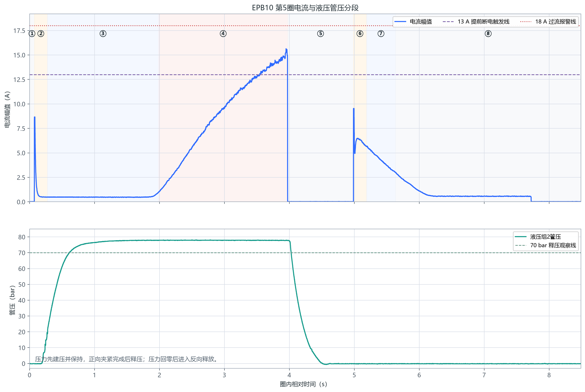
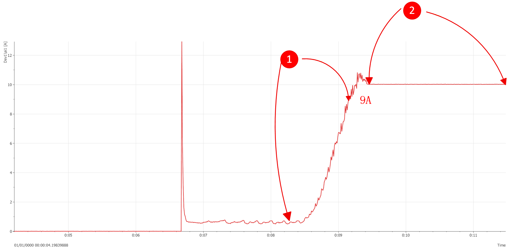
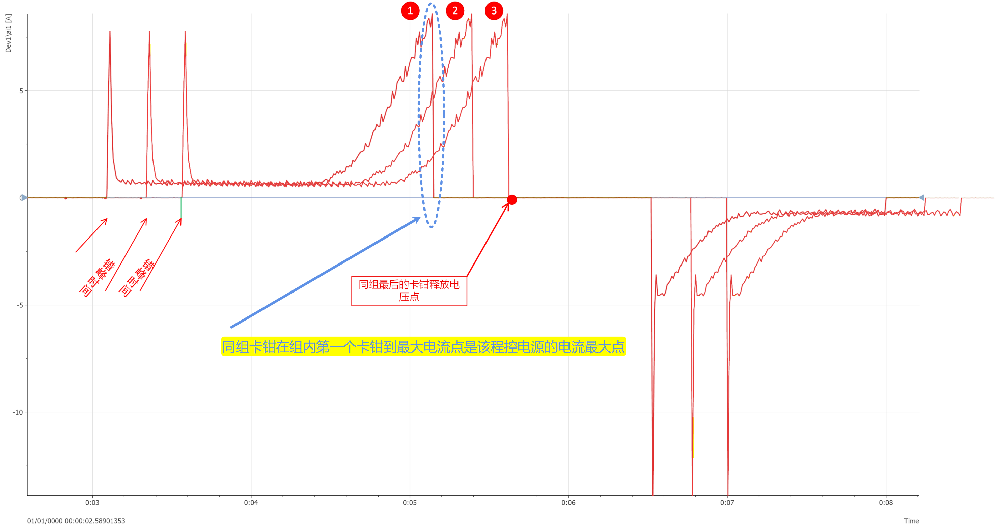

# EPB 控制中可能出现的问题及风险确认

> 日期：2026-07-29  
> 核查范围：当前仓库中的 EPB 正式运行模式、夹紧判据、报警停机、异常快照及电源组控制逻辑。  
> 当前默认控制模式：`LegacyFixedTiming`。

## 总体结论

| 问题 | 风险确认 | 风险等级 | 当前软件表现 |
| --- | --- | --- | --- |
| 1. 非标准电流曲线仍被正常记圈 | **确认存在** | 高 | 主要依据瞬时阈值或局部平台判断成功，没有对完整曲线形态和阶段顺序进行校验 |
| 2. 电源限流造成高电流平台 | **已有部分保护，但仍存在风险** | 高 | 低于触发点的平台通常约 5 秒后超时报警；不是即时识别，且只停止报警通道 |
| 3. 缺少程控电源总电流监控 | **确认存在** | 高 | 当前只采集各卡钳支路电流，没有采集程控电源总电流、输出电压及限流状态 |

---

## 问题 1：非标准曲线是否可能正常记圈且不报警

### 原问题

目前程序中有对各个电流区段的判断，但是没有完整曲线的判断。

是否会造成电流曲线不符合标准，但程序仍正常记圈，且没有报警？



### 结论

**确认存在该风险。**

当前默认模式为 `LegacyFixedTiming`，夹紧成功主要依赖以下局部判据：

1. 单个采样点满足：

   ```text
   当前电流绝对值 + SafetyMarginA >= ForwardA
   ```

   即立即认为达到夹紧判据。

2. 当已具备正向空载电流基线时，约 150 ms 窗口内电流足够平坦，并高于空载电流一定幅度，也可能被认为达到夹紧判据。

3. 当前没有对整条曲线执行完整的阶段顺序和形态校验，例如：

   ```text
   涌流 → 空行程 → 连续爬升 → 夹紧峰值 → 断电 → 反向释放
   ```

当前配置通常为：

```text
ForwardA = 15 A
SafetyMarginA = 2 A
有效提前断电触发点约为 13 A
```

因此，只要异常曲线到达约 13 A 的有效触发点，即使前面的曲线形态、爬升速度、持续时间或阶段顺序异常，也可能被判定为成功。

当前硬报警主要覆盖：

- 正向通电超时仍未达到夹紧判据；
- 峰值超过 `ForwardA + OvershootAlarmDeltaA`；
- 当前 `OvershootAlarmDeltaA = 3 A`，即峰值达到约 18 A 才触发过流报警。

这意味着：**形态异常但最终峰值处于约 13～18 A 的曲线，存在正常完成、正常记圈且没有硬报警的可能。**

### 代码依据

- 默认控制模式：`MTTfTest/App.config`，`EpbControlMode=LegacyFixedTiming`
- 单点阈值成功判据：`Controller/EpbCycleRunner.cs`，`CurrentAboveWaiter.OnSample`
- 局部平台成功判据：`Controller/EpbCycleRunner.cs`，`CurrentAboveWaiter.OnSample`
- 峰值过流报警：`Controller/EpbCycleRunner.cs`，`peak.MaxAmp - _posThrA >= _overshootAlarmDeltaA`
- 过流报警增量：`MTTfTest/Config/AlarmConfig.xml`，`OvershootAlarmDeltaA="3.0"`

### 建议

增加“完整曲线有效性”判据，至少校验：

- 各阶段是否按预期顺序发生；
- 涌流结束后是否进入合理空行程区间；
- 电流是否出现持续、合理的正向爬升；
- 爬升时间是否处于历史正常范围；
- 是否存在突跳、二次启动、异常跌落、长时间平台；
- 夹紧峰值和断电时刻是否合理；
- 反向释放曲线是否完整。

不符合完整曲线规则时，本圈应记为 `warning`、`failed` 或 `alarm`，不能记为普通完成圈。

---

## 问题 2：电流竞争或电源限流造成高电流平台

### 原问题

由于同组电流竞争，或者程控电源最大电流限制，卡钳上电夹紧无法达到设定阈值，出现高电流平台。

当前程序能否即时报警并记录异常数据？如果同组卡钳同时异常，应当如何处理？



### 结论

**当前能够在部分条件下报警并记录异常数据，但不能称为即时保护，且同电源组联动保护不足。**

以图片中的约 10 A 平台为例：

```text
ForwardA = 15 A
SafetyMarginA = 2 A
有效触发点约为 13 A
平台电流约为 10 A
FwdOnLimitMs = 5000 ms
```

约 10 A 不能达到 13 A 有效触发点，因此当前正式运行逻辑通常会：

1. 继续保持正向通电；
2. 最长等待约 5 秒；
3. 超时后产生 `ClampTimeout`；
4. 立即停止并断开该卡钳；
5. 导出最近 10 圈以及当前异常圈；
6. 快照完整时将当前圈记为 `alarm`，否则记为 `failed`；
7. 不会把该超时圈记为普通完成圈。

### 已有保护

- 正向最大等待时间：约 5000 ms；
- 超时产生 `ClampTimeout` 硬报警；
- 报警后对故障通道高优先级断电；
- 保存当前异常圈及最近 10 圈的 CSV/BIN 数据；
- 保存 DO 控制时间线和错峰计划等辅助证据；
- 报警圈不会计为普通完成圈。

### 仍然存在的风险

#### 1. 保护不够及时

对于约 10 A 的异常高电流平台，可能持续通电接近 5 秒后才报警。是否会损伤卡钳，需要结合卡钳允许堵转时间、线束能力和热容量确认，但软件确实存在较长的异常通电暴露窗口。

#### 2. 较高平台可能被误判为成功

如果异常平台达到有效提前断电触发点，例如约 13 A，单点阈值判据可能直接将其当作夹紧成功，而不是识别为电源限流平台。

#### 3. 当前只停止故障通道

当前故障隔离策略明确为：

```text
只停止报警通道，不扩展为同电源组停机
```

如果根因是共享程控电源限流，同组其他卡钳仍会继续运行，并可能依次发生相同异常。

#### 4. 蜂鸣器默认未设置为任意报警即鸣响

当前配置为：

```text
BuzzerOnAnyAlarm = false
```

软件和报警输出链路仍可记录报警，但现场人员不一定能通过蜂鸣器立即获知。

### 代码依据

- 正向最大等待时间：`MTTfTest/Config/TestConfig.xml`，`FwdOnLimitMs=5000`
- 超时判断：`Controller/EpbCycleRunner.cs`，`WaitCurrentAboveAsync`
- 超时报警：`Controller/EpbCycleRunner.cs`，`ClampTimeout`
- 报警停机：`Controller/EpbManager.cs`，`StopChannelOnAlarm`
- 报警快照：`Controller/EpbManager.cs`，`ExportAlarmSnapshotAsync`
- 报警圈封账：`Controller/EpbManager.cs`，`TryFinalizeCurrentCycleAfterSnapshot`
- 单通道故障隔离：`Controller/ElectricalStaggerPlan.cs`，`ChannelFaultIsolationPolicy`
- 蜂鸣器配置：`MTTfTest/Config/AlarmConfig.xml`

### 建议

增加独立于夹紧成功判据的“异常高电流平台保护”：

```text
电流高于空载基线或固定下限
+ 连续平坦达到规定时间
+ 尚未达到正常夹紧完成条件
= 立即判定异常平台
```

建议平台持续时间采用 200～500 ms 量级，并结合实际数据标定，而不是等待完整的 5000 ms 正向超时。

对于同一程控电源供电的通道，建议增加电源组级故障策略：

1. 首个通道识别到疑似电源限流平台；
2. 立即断开该电源组所有正在正向或反向通电的卡钳；
3. 将同组通道统一保存异常快照；
4. 区分“首发通道”和“受电源组联动停止通道”；
5. 禁止同组继续进入下一圈，等待人工确认或自动恢复条件满足。

---

## 问题 3：是否需要监控程控电源的时刻总电流

### 原问题

软件应该对程控电源的时刻电流进行监控、记录日志和异常留档。

例如，同组第一个卡钳到达最大电流时，通常也是该程控电源负载较大的时刻。如果程控电源达到最大电流限制，可能造成后续卡钳无法达到阈值，形成高电流平台，并可能损伤卡钳。



### 结论

**确认当前缺少程控电源级监控。**

仓库中当前具备：

- 12 路卡钳支路电流的 DAQ 采集；
- 电源组配置；
- 组内错峰启动；
- 每路卡钳独立阈值、超时和报警。

但未发现以下程控电源反馈数据的采集与保护逻辑：

- 程控电源输出总电流；
- 程控电源输出电压；
- 恒压/恒流状态；
- 是否进入限流模式；
- 电源保护、过载或故障状态；
- 电源总电流的历史曲线和报警快照。

因此，目前软件无法直接区分：

- 卡钳机械负载异常；
- 单路接线或电机异常；
- 同组电流竞争；
- 程控电源进入恒流限流；
- 电源输出电压因过载下降。

仅凭单路支路电流平台，无法可靠确定根因是卡钳还是共享电源。

### 建议监控项

每台程控电源至少采集：

| 信号 | 用途 |
| --- | --- |
| 输出总电流 | 识别总负载接近或达到电源上限 |
| 输出电压 | 识别限流引起的电压跌落 |
| CV/CC 状态 | 直接判断是否由恒压模式切换为恒流限流模式 |
| 输出开关状态 | 核对软件指令与电源实际输出是否一致 |
| 保护/故障状态 | 识别过流、过温、过压等电源故障 |

建议保存以下关联数据：

```text
统一时间戳
+ 电源总电流
+ 电源输出电压
+ CV/CC/故障状态
+ 同组各卡钳支路电流
+ 各卡钳 DO 指令状态
+ 当前圈号和阶段
```

### 建议报警规则

1. 总电流达到额定上限的一定比例并持续规定时间；
2. 电源进入 CC 限流状态；
3. 输出电压低于设定值并持续规定时间；
4. 支路电流之和与电源总电流偏差超过允许范围；
5. 某一路进入高电流平台，同时电源处于限流状态；
6. 多个同组通道在短时间内出现相同异常。

发生以上异常时，建议按电源组执行联动断电和统一快照。

---

## 建议实施优先级

### P0：优先实施

1. 增加高电流平台的快速硬保护，避免等待 5 秒超时；
2. 增加同电源组联动断电；
3. 接入程控电源总电流、输出电压和 CC/CV 状态；
4. 电源异常时保存电源与全部同组卡钳的统一时间轴快照。

### P1：随后实施

1. 增加完整电流曲线阶段和形态校验；
2. 将异常曲线记为 `warning`、`failed` 或 `alarm`，禁止普通记圈；
3. 增加同组电流和功率预算；
4. 在试验开始前校验电源额定能力是否满足最坏并发工况。

### P2：完善诊断

1. 建立每路卡钳的正常曲线基线；
2. 对爬升时间、空载电流、斜率、峰值和释放时间做统计边界；
3. 增加“卡钳异常”和“共享电源异常”的根因分类；
4. 在界面中显示首发故障、联动停机通道及电源组状态。

---

## 最终判断

1. **问题 1 成立**：当前没有完整曲线校验，异常曲线可能正常记圈且不触发硬报警。
2. **问题 2 部分已有保护，但仍不充分**：约 10 A 平台通常会在约 5 秒后超时报警并保存数据，但不是即时保护；达到有效触发点的平台仍可能误判成功；同电源组也不会联动停止。
3. **问题 3 成立**：当前没有程控电源总电流、输出电压及限流状态监控，无法可靠识别共享电源限流。

卡钳是否一定会因该工况损坏，仍需结合程控电源额定参数、卡钳允许堵转时间、线束压降和热容量验证；但从软件保护完整性来看，以上风险均需要处理。
