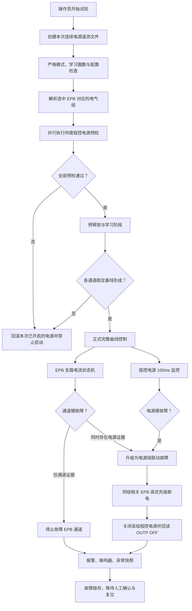
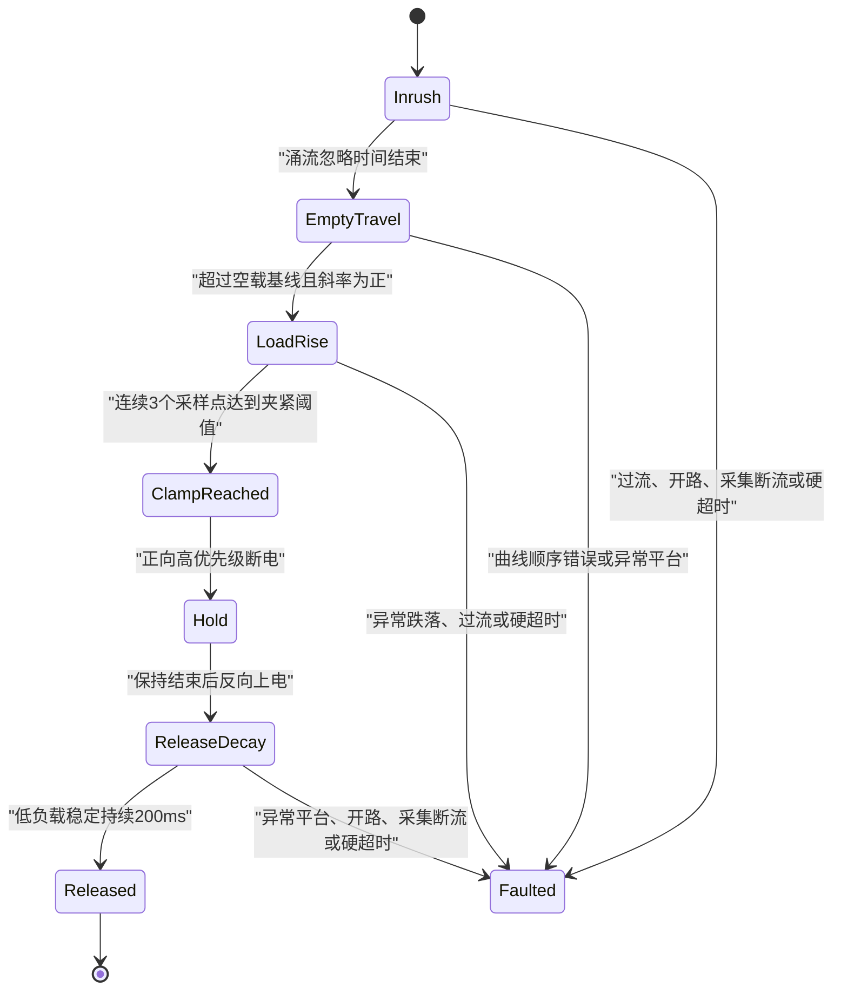

# EPB 精细控制与程控电源联锁实施说明

> 日期：2026-07-30
> 适用项目：EPB 常温疲劳测试台架
> 适用程序：`MTTfTest`
> 文档性质：已落地控制逻辑、配置说明、报警策略与现场操作要求
> 关联风险分析：[2026-07-29_03_epb控制中可能出现的问题.md](2026-07-29_03_epb控制中可能出现的问题.md)

## 1. 实施目标

本次改造针对以下三类高风险问题：

1. 只依靠单点电流阈值判断夹紧，可能把形态异常的曲线记为正常圈；
2. 共享电源限流或同组电流竞争时，单个 EPB 可能长时间处于高电流平台；
3. 程序缺少程控电源总电流、输出电压、CV/CC、保护状态和通信状态监控。

改造后的控制原则是：

```text
启动必须完整预检
+ 正式试验必须使用完整曲线状态机
+ 通道故障优先隔离通道
+ 有程控电源证据时升级为电源组联动故障
+ 所有硬故障立即断开 EPB 输出并保存证据
+ 电源故障锁存，必须人工复位
+ 无法确认安全状态时禁止启动或明确报警
```

## 2. 当前落地状态

| 项目 | 状态 | 说明 |
| --- | --- | --- |
| 四台程控电源通信 | 已落地 | 共用统一的 TCP/SCPI 通信内核 |
| IP 与端口 | 已配置 | `192.168.1.101～104:2268` |
| 电源与 EPB 电气组映射 | 已落地 | 每台电源对应一个三通道电气组 |
| 启动前电源预检 | 已落地 | 身份、输出状态、设定值、保护值、错误队列、回读全部检查 |
| 运行中电源遥测 | 已落地 | 100ms 周期采集电压、电流、功率、CV/CC、保护和状态寄存器 |
| 电源组故障联动 | 已落地 | 有电源证据时停止本次运行中同电气组通道 |
| 连续遥测 CSV | 已落地 | 每次批量运行独立文件，写盘与保护线程解耦 |
| 报警快照 | 已落地 | EPB CSV/BIN、控制时间线、错峰计划和最近电源遥测 |
| 完整电流曲线状态机 | 已落地 | 正向夹紧与反向释放均须满足阶段顺序 |
| 单点阈值直接成功 | 已取消 | 夹紧阈值必须连续三个采样点确认 |
| 快速高电流平台保护 | 已落地 | 不再只等待原有约5秒夹紧超时 |
| 蜂鸣器 | 已启用 | 任意硬报警触发 |
| 电源故障人工复位 | 已落地 | 输出关闭、保护解除、身份有效后才能复位 |
| 旧 EMB 电源入口 | 已退出生产构建 | 菜单、旧配置读取和旧 TCP DLL 依赖已移除或隔离 |
| 现场安全设定值 | **待填写** | 当前故意留空，程序会拒绝启动 |
| 真实台架最终联调 | **待执行** | 自动化与模拟通信测试已通过，仍需现场验证 |

## 3. 硬件与电气组映射

上位机地址为 `192.168.1.100`，四台电源配置如下：

| 电源 | IP | 端口 | 电气组 | 默认覆盖 EPB |
| --- | --- | ---: | ---: | --- |
| 电源1 | `192.168.1.101` | 2268 | 1 | EPB1、EPB2、EPB3 |
| 电源2 | `192.168.1.102` | 2268 | 2 | EPB4、EPB5、EPB6 |
| 电源3 | `192.168.1.103` | 2268 | 3 | EPB7、EPB8、EPB9 |
| 电源4 | `192.168.1.104` | 2268 | 4 | EPB10、EPB11、EPB12 |

实际映射以项目 `TestConfig.xml` 中的 `ElectricalGroup` 为准。程序启动时会校验：

- 电气组1～4必须各出现一次；
- 每个电气组必须且只能绑定一台电源；
- 每个选中 EPB 必须且只能属于一个电气组；
- 配置异常时禁止启动。

## 4. 总体控制架构



## 5. 启动前的失效安全预检

### 5.1 启动条件

正式试验开始前必须同时满足：

1. `PowerSupplyIntegrationRequired=true`；
2. 所有选中通道均使用 `AdaptiveCurrent`；
3. `EpbAdaptiveShadowMode=false`，即状态机直接参与保护；
4. 批量启动参数 `learnCycles >= 5`；
5. 本次学习结束后，每个选中通道至少具有5个完整有效学习圈；
6. 所需电源的安全参数填写完整且关系合法；
7. 电源组不存在未复位的故障锁存。

第1～4项及电源配置、锁存条件不满足时，不会进入预释放或 EPB 上电阶段。

学习完成后仍无法形成第5项要求的稳定基线时，不会进入正式循环，并执行启动异常回滚。

### 5.2 每台电源的完整预检顺序

对于本次选中通道实际需要的每台电源，程序执行：

1. 建立 TCP 连接；
2. 执行 `*IDN?`；
3. 确认设备可识别为可信的 GW Instek PSW；
4. 如果配置了 `ExpectedModel`，核对型号；
5. 如果配置了 `ExpectedSerial`，核对序列号；
6. 读取完整状态快照；
7. 检查启动前 `OUTP` 必须为 `OFF`；
8. 检查保护状态不得处于触发状态；
9. 写入 `VoltageV`；
10. 写入 `CurrentA`；
11. 写入 `OvpV`；
12. 写入 `OcpA`；
13. 重新读取 VSET、ISET、OVP、OCP；
14. 按 `SetpointTolerance` 校验写入与回读一致；
15. 读取设备错误队列，必须为无错误；
16. 执行 `OUTP ON`；
17. 回读确认输出确实为 `ON`；
18. 检查实际输出电压不得低于 `MinimumOutputVoltageV`；
19. 预检通过后才启动该电源组监控。

### 5.3 启动前已经 OUTP ON 的处理

如果发现电源启动前已经为 `OUTP ON`：

- 程序立即拒绝启动；
- 不修改 VSET、ISET、OVP、OCP；
- 不自动关闭操作员或其他系统预先开启的输出；
- 提示现场确认电源状态。

这样可避免带载修改参数，也避免程序在不清楚外部状态时擅自改变电源输出。

### 5.4 多电源预检失败的回滚

四台电源按本次所需电气组并行预检。如果其中一台失败：

- 本次预检过程中已经成功开启的其他电源全部执行 `OUTP OFF`；
- 对关闭结果进行回读；
- 禁止进入 EPB 预释放、学习和正式运行阶段；
- 记录失败原因。

## 6. EPB 完整曲线状态机

### 6.1 状态顺序

一圈正常运行必须依次完成：



只有到达 `Released`，并且正向、反向均无硬故障，本圈才允许记为成功。

### 6.2 学习基线

每路 EPB 独立保存最近最多30个成功样本，统计：

- 正向空行程电流中位数；
- 正向空行程电流 MAD；
- 反向空载电流中位数；
- 反向空载电流 MAD；
- 正向夹紧时间中位数与 MAD；
- 反向释放时间中位数与 MAD。

其中：

```text
MAD = 各样本相对中位数的绝对偏差的中位数
```

基线有效条件：

```text
ValidSampleCount >= 5
```

学习样本必须是正向夹紧和反向释放都完整成功的圈。正向时间、反向时间或空载电流缺失时，不写入模型。

### 6.3 稳定窗口

用于判断空载区和释放区的稳定窗口为150ms，并要求：

- 窗口至少包含5个采样点；
- 首尾时间跨度至少约140ms；
- 窗口电流范围满足：

```text
窗口最大值 - 窗口最小值 <= max(0.15A, 6 × MAD)
```

程序使用中位数与 MAD，降低单点噪声对判断的影响。

### 6.4 正向涌流阶段

正向上电后先进入 `Inrush`：

- 涌流忽略时间来自通道配置；
- 忽略阶段不使用正常负载曲线判断；
- 但三点过流、绝对硬超时等安全保护仍然有效；
- 忽略时间结束后进入 `EmptyTravel`。

### 6.5 空行程阶段

程序在稳定窗口内建立空行程电流基线。

负载上升触发条件为：

```text
LoadRiseThreshold =
    ForwardEmptyCurrentA + max(0.5A, 4 × ForwardEmptyMadA)
```

同时要求最近窗口斜率：

```text
WindowSlope > 0.001 A/ms
```

两个条件同时满足后，状态从 `EmptyTravel` 进入 `LoadRise`。

### 6.6 禁止阈值突跳成功

夹紧电流阈值为：

```text
ClampThreshold = ForwardA - SafetyMarginA
```

如果状态尚未确认进入 `LoadRise`，电流就直接达到 `ClampThreshold`，立即产生：

```text
CurveSequenceInvalid ThresholdBeforeLoadRise
```

该圈判为硬故障，不允许按正常夹紧结束。

这条规则用于拦截：

- 电流突跳；
- 曲线阶段缺失；
- 高平台直接越过阈值；
- 旧逻辑中“单个采样点达到阈值即成功”的误判。

### 6.7 夹紧确认

进入 `LoadRise` 后，必须连续3个采样点满足：

```text
Current >= ClampThreshold
```

才确认：

```text
ClampReachedConfirmed
```

任意一个采样点重新低于阈值，连续计数立即清零。

以当前典型参数为例：

```text
ForwardA = 15A
SafetyMarginA = 2A
ClampThreshold = 13A
```

13A的单点或双点尖峰不会被判定为夹紧成功。

### 6.8 负载上升异常跌落

进入 `LoadRise` 后持续记录本段峰值。如果出现：

```text
LoadRisePeak - Current >= 2A
+ Current < ClampThreshold
+ 持续时间 >= 100ms
```

产生硬故障：

```text
AbnormalLoadRiseDrop
```

用于识别负载上升中断、电压塌陷、接触不良、二次启动或机械负载突然丢失。

### 6.9 三点过流

过流硬阈值为：

```text
OverCurrentLimit = ForwardA + OvershootAlarmDeltaA
```

连续3个采样点超过阈值时产生：

```text
OverCurrent3Samples
```

单点噪声不会直接造成硬停机，但持续过流会立即停机。

### 6.10 开路或输出异常

涌流忽略期结束后，如果：

```text
Current <= 0.10A
+ 持续时间 >= 200ms
```

产生：

```text
OpenCircuitOrOutputFault
```

可能原因包括：

- EPB 回路开路；
- 继电器或 DO 未实际接通；
- 电源输出异常；
- 线束或接插件故障。

### 6.11 异常高电流平台

状态机不会等待完整的原夹紧超时时间才识别高平台。

在涌流忽略时间结束至少200ms后，如果150ms窗口稳定，并持续满足异常高平台条件约200ms，则产生：

```text
AbnormalHighCurrentPlateau
```

正向异常平台阈值为：

```text
max(ForwardEmptyCurrentA + 2A, ForwardA × 50%)
```

且正向平台判断只在尚未进入正常负载上升的 `EmptyTravel` 阶段执行。

这类报警首先视为通道曲线异常；如果同时存在新鲜的程控电源限流、低压、保护或近上限证据，则升级为共享电源组故障。

### 6.12 DAQ 断流

在活动控制阶段：

```text
最后一个快速电流样本距当前时间 > 100ms
```

产生：

```text
DaqSampleStale>100ms
```

采集数据不可信时不继续保持 EPB 通电。

### 6.13 正反向绝对硬时限

正向和反向均具有绝对最大通电时间：

- 超时不再等待；
- 立即判为 `ForwardAbsoluteOnTimeExceeded` 或 `ReverseAbsoluteOnTimeExceeded`；
- 高优先级断开 EPB 输出；
- 本圈不得记为成功。

硬时限来自 Runner 根据周期和通道配置计算的上限。

### 6.14 正向软时限

基线稳定后，正向软时限为：

```text
ForwardSoftLimit =
    ForwardClampMedianMs + max(1000ms, 4 × ForwardClampMadMs)
```

超过软时限时产生 `ForwardSoftLimit`：

- 记录软预警；
- 不立即停止；
- 如果后续正向夹紧和反向释放全部正常，结果为 `SuccessWithWarning`；
- 如果后续发生硬故障，结果仍为 `HardFault`。

### 6.15 反向释放判断

保持结束后进入反向阶段。反向释放低负载阈值为：

```text
ReverseLowLoadThreshold =
    ReverseEmptyCurrentA + max(0.30A, 4 × ReverseEmptyMadA)
```

同时要求：

```text
150ms窗口稳定
+ 窗口范围 <= max(0.15A, 6 × MAD)
+ 连续保持低负载状态 >= 200ms
```

满足后确认：

```text
Released
```

如果反向过程结束但未确认释放，则产生 `ReverseEndedWithoutRelease`，本圈不能成功。

## 7. 圈结果与记圈规则

| 结果 | 条件 | 是否普通成功圈 | 动作 |
| --- | --- | --- | --- |
| `Success` | 正向夹紧、保持、反向释放全部完整，且无预警 | 是 | 保存成功样本并更新基线 |
| `SuccessWithWarning` | 完整成功，但出现正向软时限等软预警 | 否，需保留 warning 属性 | 保存样本、记录预警 |
| `HardFault` | 任一硬故障 | 否 | 立即停机、报警、快照 |
| `Canceled` | 人工停止或取消 | 否 | 断电并安全收尾 |

只有以下完整流程完成才允许成功记圈：

```text
识别空行程
→ 识别连续负载上升
→ 连续3点确认夹紧
→ 正向断电与保持
→ 反向电流衰减
→ 低负载稳定200ms确认释放
```

## 8. 程控电源运行监控

### 8.1 监控周期

默认配置：

| 参数 | 默认值 | 含义 |
| --- | ---: | --- |
| `PollIntervalMs` | 100ms | 电源遥测轮询周期 |
| `TelemetryStaleMs` | 500ms | 通信/遥测中断硬故障时间 |
| `CcTripMs` | 300ms | 持续限流硬故障时间 |
| `LowVoltageTripMs` | 300ms | 持续低压硬故障时间 |
| `NearLimitWarnRatio` | 0.90 | 接近电流设定值预警比例 |

### 8.2 每次采集内容

每台电源采集：

- 连接状态；
- 电源身份；
- 输出开关状态；
- VSET；
- ISET；
- OVP；
- OCP；
- 实际输出电压；
- 实际输出总电流；
- 实际输出功率；
- CV状态；
- CC状态；
- 电压限制状态；
- 电流限制状态；
- 功率限制状态；
- 保护跳闸状态；
- Operation Status；
- Questionable Status；
- 通信或解析错误。

### 8.3 接近电流上限预警

满足以下条件时，遥测标记：

```text
MeasuredCurrent >= CurrentA × NearLimitWarnRatio
```

默认即达到 ISET 的90%。

动作：

- 电源状态区域显示橙色；
- 遥测 CSV 写入 `NearCurrentLimit`；
- 可作为 EPB 高平台是否由共享电源引起的辅助证据；
- 仅接近上限不会单独立即关断电源。

### 8.4 持续限流硬故障

以下任一状态视为限流证据：

- CC；
- CurrentLimited；
- PowerLimited。

持续达到 `CcTripMs`，默认300ms，产生：

```text
SustainedCurrentLimit
```

动作是电源组级联动停机。

### 8.5 持续低压硬故障

满足：

```text
MeasuredVoltage < MinimumOutputVoltageV
+ 持续时间 >= LowVoltageTripMs
```

默认持续300ms后产生：

```text
SustainedLowVoltage
```

### 8.6 输出意外关闭

试验运行中回读到：

```text
OUTP = OFF
```

立即产生：

```text
UnexpectedOutputOff
```

### 8.7 电源保护跳闸

检测到 `ProtectionTripped` 时立即产生：

```text
ProtectionTrip
```

### 8.8 通信或遥测中断

连续无法获得成功遥测，达到 `TelemetryStaleMs`，默认500ms，产生：

```text
TelemetryStale
```

远端主动断开、查询超时或 TCP I/O 异常后，通信对象会立即把自身标记为断开，避免继续显示为在线。

## 9. 通道故障与电源组故障的判别

### 9.1 通道级故障

如果只有某一路 EPB 支路曲线异常，而电源遥测正常：

- 只停止故障通道；
- 同组其他正常通道可继续运行；
- 保存该通道的报警证据。

这避免单个卡钳机械故障不必要地扩大到整个电源组。

### 9.2 电源组级故障

以下情况直接属于电源组硬故障：

- `UnexpectedOutputOff`；
- `ProtectionTrip`；
- `SustainedCurrentLimit`；
- `SustainedLowVoltage`；
- `TelemetryStale`；
- 电源关闭后无法确认 `OUTP OFF`。

此外，EPB 出现 `AbnormalHighCurrentPlateau` 时，如果同一电气组存在以下新鲜电源证据，也升级为 `SharedPowerLimiting`：

- CC；
- CurrentLimited；
- PowerLimited；
- ProtectionTripped；
- 输出开启但电压低于最低允许值；
- 电源总电流达到 ISET 的预警比例；
- 电源遥测已经过期。

### 9.3 联动范围

电源组故障影响范围是：

```text
本次运行中选中的、属于该电气组的 EPB 通道
```

不会无条件扩大到其他三台电源，也不会把未参加本次试验的通道误记为运行故障。

## 10. 硬故障停机顺序

电源组硬故障发生后，执行顺序为：

1. 故障锁存，阻止重复进入相同故障流程；
2. 触发界面故障事件；
3. 对受影响 EPB 停止计时器；
4. 取消当前圈异步任务；
5. 高优先级撤销 EPB 正反向 DO；
6. 请求液压释放；
7. 清理 Runner，阻止采集数据继续驱动旧状态机；
8. 拉起对应通道报警和蜂鸣器；
9. 导出当前异常圈与最近数据；
10. 同组 EPB 均完成高优先级断电后，执行程控电源 `OUTP OFF`；
11. 回读确认电源输出已经关闭；
12. 输出关闭无法确认时产生 `OutputOffUnverified`；
13. 保持故障锁存，等待人工复位。

核心原则：

```text
先撤销卡钳控制输出，再关闭共享程控电源；
任何关闭失败都必须留下明确报警，不能静默认为安全。
```

## 11. 正常停止与程序退出

人工停止、正常完成或程序退出时：

1. 停止批量会话；
2. 停止各通道定时器；
3. 撤销 EPB DO；
4. 请求液压释放；
5. 清理通道运行对象；
6. 如果电气组已无运行通道，关闭对应电源；
7. 全部停止时关闭所有已连接电源；
8. 回读确认 `OUTP OFF`；
9. 最后刷新并关闭连续遥测文件。

窗体关闭时最多等待8秒完成电源关闭确认。如果未能确认全部关闭，界面明确提示：

```text
未能确认全部程控电源已经关闭，请立即检查电源面板和急停回路。
```

## 12. 故障锁存与人工复位

### 12.1 锁存原则

电源组发生硬故障后：

- 同组不得自动重新开启；
- 再次点击开始会被拒绝；
- 不能因为下一次遥测暂时正常就自动清除故障；
- 必须由操作员检查现场后人工复位。

### 12.2 人工复位入口

在主监控界面双击对应电源状态区域：

1. 程序弹出人工确认；
2. 操作员确认后执行复位检查；
3. 检查输出必须为 `OFF`；
4. 检查保护状态必须解除；
5. 检查设备身份仍然可信；
6. 条件全部满足后清除故障锁存。

复位操作不会打开电源。下一次开始仍会重新执行完整预检。

## 13. 界面状态

四个电源状态区域分别显示：

```text
电源编号 + ON/OFF + CV/CC + 输出电压 + 输出总电流
```

颜色含义：

| 颜色 | 含义 |
| --- | --- |
| 深绿色 | 输出开启且当前状态正常 |
| 灰色 | 输出关闭 |
| 橙色 | 接近电流上限或存在非硬故障遥测提示 |
| 红色 | 保护、限流、功率限制或电源硬故障 |

## 14. 遥测、报警和证据留档

### 14.1 连续电源遥测

每次批量运行创建：

```text
{StoreDir}\{TestName}\PowerSupplyTelemetry\
yyyyMMdd_HHmmss_{RunId}.csv
```

主要字段：

```text
Utc
MonotonicTicks
SupplyId
ElectricalGroup
Cycle
Stage
Connected
Output
VSet
ISet
OVP
OCP
VOut
IOut
POut
CV
CC
VoltageLimited
CurrentLimited
PowerLimited
ProtectionTripped
OperationStatus
QuestionableStatus
Error
```

保护线程只负责无阻塞入队，独立后台任务负责磁盘写入，避免磁盘卡顿拖慢100ms电源保护。

### 14.2 报警快照

报警目录位于：

```text
{StoreDir}\{TestName}\AlarmSnapshots
```

报警证据包括：

- 当前异常圈 CSV；
- 当前异常圈 BIN；
- 最近有效圈；
- EPB 快速电流数据；
- DO 控制时间线；
- 电气组错峰计划；
- 当前圈号与报警原因；
- 最近60秒对应电源遥测；
- 电源故障代码和状态快照。

只有当前圈 CSV 和 BIN 证据均存在时，数据库中的该圈才允许最终封为 `alarm`；证据不完整时按 `failed` 处理，避免数据库声称有报警证据但文件缺失。

## 15. 关键故障代码与动作矩阵

| 故障代码 | 来源 | 等级 | 默认动作 |
| --- | --- | --- | --- |
| `ThresholdBeforeLoadRise` | EPB曲线 | 通道硬故障 | 停止该通道；有电源证据时升级 |
| `AbnormalLoadRiseDrop` | EPB曲线 | 通道硬故障 | 停止该通道 |
| `AbnormalHighCurrentPlateau` | EPB曲线 | 通道硬故障 | 停止通道；有电源证据时组级联动 |
| `OverCurrent3Samples` | EPB电流 | 通道硬故障 | 高优先级断电 |
| `OpenCircuitOrOutputFault` | EPB电流 | 通道硬故障 | 高优先级断电 |
| `DaqSampleStale` | DAQ | 通道硬故障 | 高优先级断电 |
| `ForwardAbsoluteOnTimeExceeded` | EPB状态机 | 通道硬故障 | 高优先级断电 |
| `ReverseAbsoluteOnTimeExceeded` | EPB状态机 | 通道硬故障 | 高优先级断电 |
| `SharedPowerLimiting` | EPB+电源证据 | 电源组硬故障 | 同组联动停机 |
| `UnexpectedOutputOff` | 程控电源 | 电源组硬故障 | 同组联动停机 |
| `ProtectionTrip` | 程控电源 | 电源组硬故障 | 同组联动停机 |
| `SustainedCurrentLimit` | 程控电源 | 电源组硬故障 | 同组联动停机 |
| `SustainedLowVoltage` | 程控电源 | 电源组硬故障 | 同组联动停机 |
| `TelemetryStale` | 程控电源通信 | 电源组硬故障 | 同组联动停机 |
| `OutputOffUnverified` | 程控电源关闭 | 最高优先级提示 | 明确提示现场检查面板和急停 |

## 16. 配置说明

配置文件：

```text
MTTfTest\Config\PowerSupplyConfig.xml
```

### 16.1 全局参数

| 参数 | 说明 | 当前默认 |
| --- | --- | ---: |
| `Enabled` | 是否启用电源配置 | `true` |
| `PollIntervalMs` | 遥测轮询周期 | `100` |
| `TelemetryStaleMs` | 遥测中断硬故障时间 | `500` |
| `CcTripMs` | 持续限流硬故障时间 | `300` |
| `LowVoltageTripMs` | 持续低压硬故障时间 | `300` |
| `NearLimitWarnRatio` | 接近ISET预警比例 | `0.90` |

### 16.2 单台电源参数

| 参数 | 必填 | 说明 |
| --- | --- | --- |
| `Id` | 是 | 电源编号1～4 |
| `ElectricalGroupId` | 是 | 绑定电气组1～4 |
| `DisplayName` | 是 | 界面和日志名称 |
| `Host` | 是 | 电源IP |
| `Port` | 是 | TCP端口，当前2268 |
| `Terminator` | 是 | SCPI结束符，当前CRLF |
| `ExpectedModel` | 建议 | 预期型号，不填则只做PSW身份校验 |
| `ExpectedSerial` | 强烈建议 | 预期序列号，防止接错设备 |
| `VoltageV` | **是** | 输出电压设定值 |
| `CurrentA` | **是** | 输出电流限制设定值 |
| `OvpV` | **是** | 过压保护值，必须高于VoltageV |
| `OcpA` | **是** | 过流保护值，必须高于CurrentA |
| `MinimumOutputVoltageV` | **是** | 运行中最低允许输出电压，必须低于VoltageV |
| `SetpointTolerance` | 是 | 写入与回读允许误差 |

### 16.3 配置关系校验

程序拒绝以下配置：

- 四台电源没有全部配置；
- 电源Id或电气组重复；
- IP为空或端口非法；
- VSET、ISET、OVP、OCP任一缺失；
- VSET或ISET不大于0；
- OVP不高于VSET；
- OCP不高于ISET；
- `MinimumOutputVoltageV`不大于0；
- `MinimumOutputVoltageV >= VoltageV`；
- 回读容差不大于0。

## 17. 正式投运前必须完成的现场工作

### 17.1 当前禁止直接投运

当前 `PowerSupplyConfig.xml` 中以下字段故意留空：

```text
VoltageV
CurrentA
OvpV
OcpA
MinimumOutputVoltageV
```

因此程序当前会拒绝正式启动。这是失效安全设计，不是配置遗漏。

### 17.2 参数确认步骤

每台电源必须完成：

1. 核对铭牌型号、额定电压、额定电流和功率；
2. 记录设备序列号并填入 `ExpectedSerial`；
3. 根据 EPB、线束、继电器和保护设计批准 VSET；
4. 根据最大允许并发负载批准 ISET；
5. 设定高于VSET但低于危险电压的OVP；
6. 设定高于ISET但不超过电源、线束和卡钳能力的OCP；
7. 根据正常压降实测确定 `MinimumOutputVoltageV`；
8. 使用调试程序逐台验证写入与回读；
9. 验证 OUTP ON/OFF；
10. 验证 CV/CC 状态读取；
11. 人工制造安全可控的限流工况，验证300ms组级联动；
12. 人工断开通信，验证500ms通信故障；
13. 验证程序退出时四台电源全部关闭；
14. 验证报警快照和连续遥测文件完整。

### 17.3 建议分阶段投运

建议顺序：

```text
单台电源空载
→ 单台电源接假负载
→ 单个EPB低风险工况
→ 同组三通道错峰
→ 四组并行
→ 长周期耐久试验
```

每一阶段均应核对：

- 电源总电流与支路电流趋势；
- 输出电压是否稳定；
- CV/CC状态是否符合预期；
- 夹紧和释放曲线是否完整；
- 报警动作和停机范围是否正确；
- 遥测与报警文件是否可回放。

## 18. 自动化验证

当前自动化结果：

| 测试集 | 结果 |
| --- | --- |
| EPB状态机、错峰、报警证据和电源协调器 | 37/37通过 |
| PSW协议、TCP超时、远端断线与调试器 | 16/16通过 |
| 解决方案Debug构建 | 成功 |

关键覆盖：

- 正常夹紧与释放；
- 未形成负载上升前到达阈值立即停机；
- 夹紧必须连续3个样本确认；
- 单点噪声不误停；
- 三点过流；
- 开路；
- DAQ断流；
- 异常高电流平台；
- 电源安全参数缺失拒绝启动；
- 启动前 OUTP ON 拒绝改参；
- VSET/ISET/OVP/OCP写入回读；
- 只开启所选通道需要的电源组；
- 电源硬故障只联动对应电气组；
- 故障人工复位；
- 远端主动断开后连接状态立即失效。

## 19. 当前边界与后续标定

以下工作不应被文档或软件默认值替代：

1. 卡钳允许堵转时间需要硬件/产品负责人确认；
2. 电源ISET、OCP需要结合最坏并发负载确认；
3. `MinimumOutputVoltageV`需要通过真实线束压降标定；
4. 200ms高平台、300ms限流、300ms低压等时间需要现场数据复核；
5. 支路电流之和与电源总电流的定量偏差报警尚未建立标定阈值；
6. 最坏并发工况的功率预算尚需形成正式计算表；
7. 自动化测试不能替代真实电源、继电器、线束、急停和卡钳联调。

如果现场标定需要调整阈值，应保留：

- 原始曲线；
- 调整依据；
- 批准人；
- 调整前后配置；
- 回归测试结果；
- 现场验证记录。

## 20. 主要代码与配置位置

| 功能 | 文件 |
| --- | --- |
| PSW共享TCP/SCPI通信 | `PowerSupply.Core/PswTcpClient.cs` |
| 电源配置加载和严格校验 | `Config/PowerSupplyConfig.cs` |
| 四电源预检、监控和故障锁存 | `Controller/PowerSupplyCoordinator.cs` |
| 连续遥测后台写盘 | `Controller/PowerSupplyTelemetryCsvRecorder.cs` |
| EPB与电源生命周期联动 | `Controller/EpbManager.cs` |
| 批量启动、学习和正式阶段 | `Controller/EpbManager.BatchStart.cs` |
| 完整曲线状态机 | `Controller/Adaptive/EpbAdaptiveControl.cs` |
| 自适应基线模型 | `Config/EpbAdaptiveProfiles.cs` |
| 正反向完整单圈执行 | `Controller/EpbCycleRunner.Adaptive.cs` |
| 电源状态和人工复位界面 | `MTTfTest/FrmEpbMainMonitor.PowerSupply.cs` |
| 四电源现场参数 | `MTTfTest/Config/PowerSupplyConfig.xml` |
| 正式控制模式开关 | `MTTfTest/App.config` |
| 蜂鸣器和报警配置 | `MTTfTest/Config/AlarmConfig.xml` |
| 自动化验证 | `Tests/AdaptiveControlTests`、`Tests/PowerSupplyDebugger.Tests` |

## 21. 最终运行原则

现场操作和软件维护应遵守：

```text
没有完整配置，不启动；
没有可靠身份，不写电源；
启动前已经带输出，不改参数；
没有完整曲线，不记正常圈；
没有连续确认，不判夹紧；
没有完整释放，不判成功；
没有新鲜遥测，不继续运行；
有共享电源证据，同组联动停机；
关闭结果未确认，必须明确报警；
故障未人工确认，不自动恢复。
```
