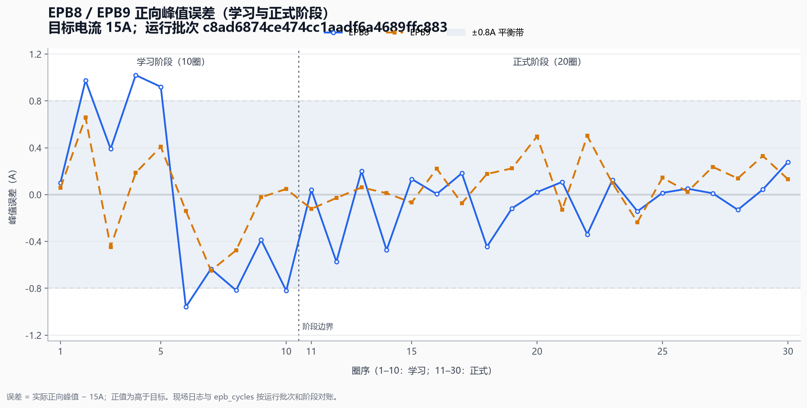

# V2.2.0.0 现场测试分析

## 技术结论

- 本报告以运行批次 `c8ad6874ce474cc1aadf6a4689ffc883` 为分析边界。EPB8、EPB9 正式阶段各 20 圈均为 `completed`，40 圈峰值误差全部位于 `±0.8A`；正式阶段绝对误差 P90 分别为 `0.448A`、`0.347A`。现有正式峰值控制算法满足本批次验收，不调整偏差补偿、软预警带、连续 3 圈确认和 `+3A` 立即硬保护。
- 现场 7 条警告中，6 条是 EPB8 学习阶段峰值收敛警告，未延续到正式阶段；EPB9 预释放警告是可复现的逻辑缺陷。根因是预释放使用全新反向状态机却未传入 15A 正向目标，使高平台阈值退化为 `5A`，将 `6.502A` 正常卸载平台误判为故障。
- 代码已修复：预释放显式传入通道正向目标，反向高平台阈值按 `max(RevDecayLimitA + 2A, ForwardTarget × 60%)` 计算，本项目为 `9A`；只有确认进入空行程后才保持 100ms。任一通道未确认释放时，全部所选通道断电、关闭程控电源并抛出启动失败，学习和正式阶段不会继续。
- 日志已统一为进程级单写入源。项目目录下 `log/run.log`、`warning.log`、`error.log` 是唯一权威持久化日志；程序目录不再生成三类日志快照副本。日志按 UTF-8、时间正序、单行 TSV 持久化，并具备早期缓冲、耐久 Flush、每日/50MB 轮转、30 天归档清理和写盘失败降级重试。
- 软件自动验收已完成：自适应与控制测试 `62/62`，落盘测试 `8/8`，主程序 Debug 构建零错误。台架后复测尚未在本次代码会话中执行，不能用整改前的 20 圈结果替代；台架验收项列于文末。

## 峰值误差显示学习收敛、正式阶段稳定

下图按同一运行批次对齐 EPB8、EPB9 的 10 圈学习和 20 圈正式记录。EPB8 的 6 条越带记录全部集中在学习阶段；进入正式阶段后，两通道共 40 圈均落入 `±0.8A` 平衡带。



### 30 圈峰值统计

误差定义为“实际正向峰值 − 15A”。P90 为绝对误差的 90 分位数。

| 通道 | 阶段 | 圈数 | 完成状态 | 误差范围（A） | 平均误差（A） | MAE（A） | 绝对误差 P90（A） | `±0.8A` 内 |
|---|---:|---:|---|---:|---:|---:|---:|---:|
| EPB8 | 学习 | 10 | 学习记录完整 | `-0.959 ～ +1.020` | `-0.021` | `0.702` | `0.980` | `4/10` |
| EPB8 | 正式 | 20 | `20/20 completed` | `-0.573 ～ +0.278` | `-0.050` | `0.172` | `0.448` | `20/20` |
| EPB8 | 全部 | 30 | 阶段可对账 | `-0.959 ～ +1.020` | `-0.041` | `0.349` | `0.924` | `24/30` |
| EPB9 | 学习 | 10 | 学习记录完整 | `-0.649 ～ +0.658` | `-0.038` | `0.309` | `0.650` | `10/10` |
| EPB9 | 正式 | 20 | `20/20 completed` | `-0.235 ～ +0.501` | `+0.107` | `0.173` | `0.347` | `20/20` |
| EPB9 | 全部 | 30 | 阶段可对账 | `-0.649 ～ +0.658` | `+0.059` | `0.218` | `0.497` | `30/30` |

EPB8 学习阶段存在正负双向越带，随后正式阶段误差明显收敛；这与自适应模型的学习目的相符。正式阶段没有连续越带或立即硬保护证据，因此本次不修改正式峰值控制参数。

## 分析范围、数据与指标定义

- 远程程序及现场日志：`\\wj-epb\debug\2.1.0.1`
- 试验数据：`\\wj-epb\EPB_Data\10364-009_V2.1.0.1_1`
- 控制边界：运行批次 `c8ad6874ce474cc1aadf6a4689ffc883`
- 分析日期与时区：2026-07-30，现场机器本地时间（Asia/Shanghai）
- 学习阶段：每通道 10 圈，用于模型收敛，不作为正式耐久结果
- 正式阶段：每通道 20 圈，以数据库 `epb_cycles.status='completed'` 为完成依据
- 峰值误差：日志/数据库记录的正向实际峰值减 15A 目标值
- 平衡带：`±0.8A`，属于软预警和模型修正范围，不等同于硬故障

远程数据库、CSV、BIN、遥测和历史日志仅做读取与核对，本次整改没有删除、改写或迁移任何现场历史数据。

## 数据库、文件与遥测证据完整

### SQLite 与圈记录

- SQLite 完整性检查结果为 `ok`。
- EPB8 正式圈号为 1～20，20 条均为 `completed`。
- EPB9 正式圈号为 1～20，20 条均为 `completed`。
- 未发现正式圈号缺失、重复或遗留 `running` 状态。

### CSV/BIN 配对

- EPB8、EPB9 各核对最近 10 圈（正式圈 11～20），每圈均同时存在 CSV 与 BIN，共 20 组配对。
- 文件圈号、时间顺序与数据库一致，没有发现只有 CSV 或只有 BIN 的孤立圈文件。
- 本次未修改 CSV/BIN 格式，也未改变历史文件。

### 程控电源遥测

- 共核对 4,200 条遥测。
- `Connected` 全程有效；未发现通信错误、限流、限压、限功率、保护或设备错误事件。
- 带载阶段最低输出电压为 `11.993V`，没有形成试验欠压证据。
- 全量最小值 `7.565V / -1.391A` 只出现 1 条，发生在输出关闭后的 `Preflight/Stopped` 停机瞬态。它不属于带载区间，不能作为正式试验欠压依据。

## 7 条警告的对账与风险分级

程序目录和项目目录的警告日志在格式及排序上不同，但将编号、时间格式和展示顺序规范化后，7 条警告逐条一致。原程序目录 `RunLog.txt` 是 UI 队列的倒序快照，项目 `run.log` 是持续追加的正序时间线，因此二者不应按字节一致判断。

| 警告类型 | 数量 | 阶段 | 影响 | 风险 |
|---|---:|---|---|---|
| EPB8 正向峰值高于 `+0.8A` | 3 | 学习 | 模型在后续圈提前修正；正式阶段未复现 | 低 |
| EPB8 正向峰值低于 `-0.8A` | 3 | 学习 | 模型在后续圈缩短提前量；正式阶段未复现 | 低 |
| EPB9 预释放 `6.502A > 5A` | 1 | 学习前 | 正常卸载平台被误判，旧逻辑仍继续启动 | 高，已修复 |

6 条峰值警告没有影响 20 圈正式完成，也没有触发连续 3 圈硬故障。预释放警告则暴露出“安全检查失败后仍继续”的控制风险，必须通过代码整改，而不能只调整日志级别。

## 预释放安全整改

### 根因与阈值

正式反向释放发生在正向夹紧之后，状态机已持有 15A 正向目标，所以高平台阈值为 `max(3A + 2A, 15A × 60%) = 9A`。预释放原先创建全新状态机，正向参考值为 0，阈值退化为 `5A`，从而误报现场 `6.502A` 平台。

整改后的反向状态机入口增加可选正向目标参考值：

- 正式反向调用不传新参数，保持接口和现有行为兼容。
- 预释放必须显式传入通道 `_posThrA`。
- 3000ms 检测预算和正式反向的鲁棒窗口保持不变。
- 只有 `ReleaseCompleted` 明确确认空行程后，才执行 100ms 保持。
- 未确认释放、检测硬故障或异常均返回失败，不再“记录警告后继续”。

### 批量启动安全门

批量预释放汇总所有通道结果。任一通道失败时：

1. 对全部所选通道再次下发断电；
2. 关闭全部程控电源并结束遥测记录；
3. 记录启动失败；
4. 抛出 `InvalidOperationException`；
5. 由现有批量启动异常回滚再次停止通道并确认程控电源关闭。

因此失败不会进入学习阶段，也不会创建正式阶段定时器。峰值偏差补偿、`±0.8A` 软预警带、连续 3 圈确认和 `+3A` 立即硬保护均未修改。

## 项目日志成为唯一权威

### 持久化位置与格式

所有 `FormLoggerAdapter` 共用一个进程级日志中心，不再分别打开同一文件。唯一活动文件为：

- `项目目录/log/run.log`
- `项目目录/log/warning.log`
- `项目目录/log/error.log`

日志按钮先 Flush，然后直接打开对应项目文件，不再在程序目录生成 `RunLog.txt`、`WarnLog.txt`、`ErrorLog.txt` 快照。已有远程日志保留原样。

每个事件使用 UTF-8 无 BOM、时间正序、单物理行 TSV：

```text
时间戳<TAB>级别<TAB>分类<TAB>消息
```

消息及分类中的反斜杠、回车、换行和制表符分别转义，避免一条事件占多行或破坏列结构。

### 缓冲、Flush、轮转与降级

- 项目未确定前，日志进入最多 10,000 条的进程内有界缓冲；项目加载后按原时间和原顺序补写。
- 普通日志逐条追加并自动刷新。
- 警告、错误、报警、通道完成、停止和程序退出执行耐久 Flush。
- 本地日期变化或单文件写入将超过 50MB 时轮转，归档名为 `run.20260730.001.log` 等。
- 只清理项目 `log` 目录内匹配三类归档命名且超过 30 天的文件；活动日志、`ui-info.log` 和其他文件不受影响。
- 写入、轮转或 Flush 失败不会向控制链路抛异常。记录保留在有界内存中，界面最多每分钟提示一次，下次写入自动按原顺序重试。

### 容量依据

以本批次活跃试验窗口估算，现场日志增长约 `30.7MB/天`，30 天约 `0.9GB`。50MB 单文件上限可避免编辑器打开超大活动文件；每日轮转便于按日期追溯；30 天清理控制长期磁盘占用，同时不压缩纯文本，便于现场直接检查。

## 自动测试与构建结果

| 验收项 | 结果 |
|---|---|
| `6.5A` 初始反向平台、15A 目标不误报 | 通过 |
| 持续超过 `9A` 仍触发高平台保护 | 通过 |
| 预释放失败阻止学习阶段 | 通过 |
| 现场 EPB8/EPB9 反向曲线回放 | 通过 |
| 日志规范格式、转义、UTF-8 | 通过 |
| 多调用方单写入源、早期缓冲补写 | 通过 |
| 每日与容量轮转、30 天精确清理 | 通过 |
| Flush、写盘失败内存降级和顺序重试 | 通过 |
| 自适应与控制测试 | `62/62` |
| 落盘测试 | `8/8` |
| 主程序 Debug 构建 | 成功，0 编译错误 |

现有架构警告单独保留，主要是 NI x86 引用与 MSIL 项目的处理器架构不一致；本次没有为消除警告而改变目标平台或硬件依赖。

## 方法、限制与稳健性检查

- 峰值统计同时核对日志中的圈完成事件和 SQLite 圈表，避免仅凭 UI 文本推断。
- 警告对账先规范化程序快照的倒序编号格式，再与项目日志逐事件比较；没有把格式差异误判为事件差异。
- 遥测最低电压按“带载输出开启”与“停机输出关闭”分层，避免把单条停机瞬态解释为试验欠压。
- 远程目录在试验结束后仍有后续 UI 停止记录，因此所有结论严格绑定运行批次和试验窗口，不把后续操作混入本批次。
- 当前结论属于描述性现场分析和软件回归，不构成整改后台架耐久验证。预释放安全门和日志轮转的自动测试已经覆盖，但真实硬件时序仍需台架确认。

## 台架复测与发布前验收

本次代码会话未连接台架，以下项目仍是发布前必须完成的硬件验收：

1. EPB8、EPB9 短测中，预释放须在 3000ms 内记录明确的反向空行程确认，随后才保持 100ms。
2. 模拟单通道未释放，确认全部所选通道断电、程控电源关闭，且学习圈号不增加。
3. 随后每通道运行 20～50 圈，确认正式峰值全部处于 `±0.8A`；如出现越带，按软预警、连续确认和立即保护三层规则分类。
4. 核对程序目录不再新增三类日志快照；项目日志覆盖启动、学习、正式圈、完成、停止和异常的完整时间线。
5. 跨日或使用小阈值验证轮转后，确认活动日志继续写入、归档可读且 `ui-info.log` 未被清理。

台架项目全部通过后，V2.1.0.1 才可标记为“整改后现场验收完成”。如只依据当前软件和既有现场数据，建议状态为“软件整改完成，待台架复测”。

## 后续关注

- 首次台架复测若预释放仍不能确认空行程，应优先检查通道电流方向、采样新鲜度和机械释放状态，不应降低 9A 高平台保护阈值来规避。
- 现场运行 7 天后复核归档大小和实际日增长量；若显著高于 `30.7MB/天`，应先定位异常高频事件，而不是直接放宽单文件上限。
- 保留本报告中的运行批次、图表脚本和自动测试结果，作为后续版本比较基线。
