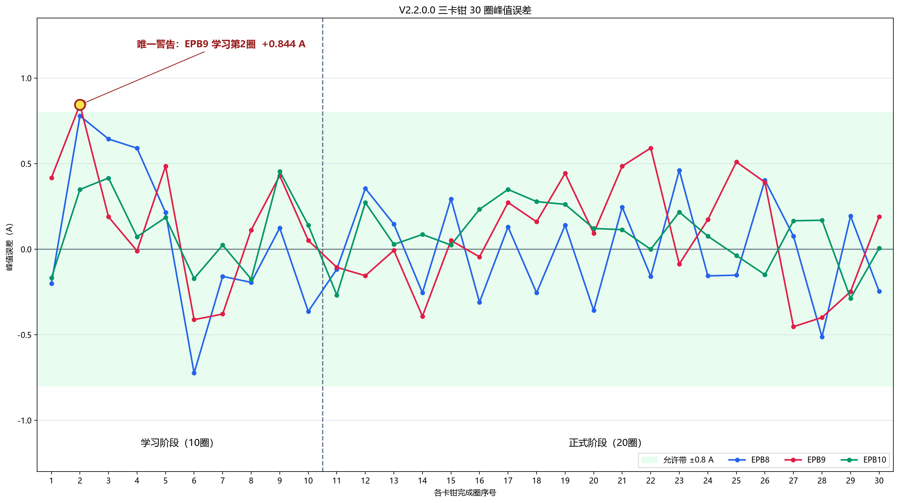
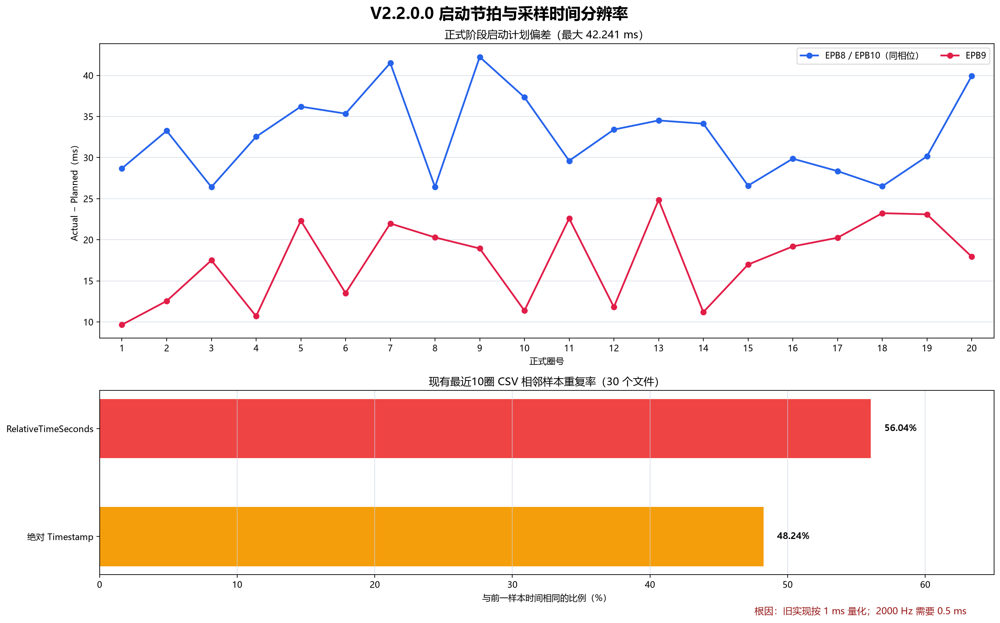

# V2.2.0.0 版本测试分析与整改报告

> 分析日期：2026-07-30<br>
> 程序版本：`\\wj-epb\debug\2.2.0.0`（只读核查，不部署）<br>
> 现场数据：`\\wj-epb\EPB_Data\10364-009_V2.2.0.0_1`<br>
> 本地镜像：`D:\EPB_Data\10364-009_V2.2.0.0_1`

## 1. 结论

本次 EPB8、EPB9、EPB10 试验结果有效：SQLite 完整性为 `ok`，3 个卡钳各完成 20 个正式圈，共 60 圈均为 `completed`；正式阶段峰值误差全部位于 `±0.8 A`，电源无通信、限流或保护事件。

唯一警告发生在 EPB9 学习第 2 圈，峰值 `15.844 A`、相对目标 `+0.844 A`。同一圈的“控流观测”和“单圈完成”日志均记录 `+0.844 A`，内容一致，且该圈最终为 `SuccessWithWarning`。由于保留策略只导出最新 10 个正式圈，学习第 2 圈的 CSV/BIN 已不在 `Latest` 中，因此不能再用保留文件做第三方逐样本复算；最近 10 个正式圈的 CSV 峰值则与日志逐圈一致。

界面显示“4 min”不是调度少跑：正式阶段采用每 15 秒启动一圈的墙钟节拍，20 个启动点之间只有 19 个间隔，即 `19 × 15 = 285 秒`；第 20 圈动作结束后立即停止，总历时约 `293.6～294.5 秒`。原界面只显示整分钟并向下截断，因此 `4分49秒～4分53秒` 均显示为 `4 min`。本次保留 15 秒启动节拍，并把显示扩展到秒。

发现一个需要整改的数据质量问题：旧版以 1 ms 粒度生成/导出时间戳，而采样率为 2000 Hz（理论间隔 0.5 ms），导致最近 30 个 CSV 中约 `48.24%` 的绝对时间戳、`56.04%` 的相对时间戳与前一样本重复。电流数值和圈级峰值未因此失真，但原始时间轴不能真实表达 2 kHz 分辨率。本次已改为 ticks 计算并输出 7 位小数秒。

## 2. 需求范围与完成状态

| 需求 | 处理结果 |
|---|---|
| 核对唯一警告与原始证据 | 已核对；两条独立圈级日志一致，历史学习圈原始文件因保留策略已清理 |
| 核对 15 秒 × 20 圈与界面 4 分钟 | 调度正确；解释 19 个启动间隔和末圈完成时间，并改为秒级显示 |
| 修改名称立即创建新项目 | 已实现：失焦立即创建，候选配置保存并重新解析成功后才切换 |
| 确认重置是否影响旧项目 | 已整改：确认框显示项目名和完整路径，只操作当前项目及其 `index.db` |
| 设置→电源组→曲线单向同步 | 已实现；曲线手动变化不反写电源组或设置 |
| 默认显示已启动的最小 EPB，完成后自动切换 | 已实现；其他通道完成不抢占，全完成保留最后一项 |
| 分析 3 个卡钳、2 组电源 | 已完成，见第 3～6 节 |
| 修复 2 kHz 时间戳精度 | 已实现并加入自动测试 |

## 3. 三卡钳控制结果

### 3.1 峰值误差



每个卡钳共 30 个“自适应单圈完成”记录：前 10 圈为学习阶段，后 20 圈为正式阶段。

| 卡钳 | 正式圈数 | 最小误差 | 最大误差 | 平均误差 | MAE | `±0.8 A` 内 |
|---|---:|---:|---:|---:|---:|---:|
| EPB8 | 20 | `-0.512 A` | `+0.461 A` | `-0.004 A` | `0.248 A` | 20/20 |
| EPB9 | 20 | `-0.453 A` | `+0.591 A` | `+0.073 A` | `0.263 A` | 20/20 |
| EPB10 | 20 | `-0.287 A` | `+0.349 A` | `+0.083 A` | `0.157 A` | 20/20 |

EPB10 的正式阶段误差最小；EPB8、EPB9 的 MAE 接近，均没有连续超带或硬故障。唯一一次超带出现在 EPB9 学习第 2 圈：

```text
18:04:03.065  控流观测：PeakError=+0.844A
18:04:03.067  软预警：Peak=15.844A，Target=15.000A，Error=+0.844A，连续=1/3
18:04:09.711  单圈完成：Peak=15.844A，Error=+0.844A，结果=SuccessWithWarning
```

它没有达到连续 3 圈硬故障条件，模型在下一圈调整断电提前量，后续正式 20 圈全部回到允许带内。

### 3.2 数据库与文件一致性

| 检查项 | 结果 |
|---|---|
| `PRAGMA integrity_check` | `ok` |
| `epb_cycles` | 60 行 |
| EPB8 / EPB9 / EPB10 | 各 20 圈，圈号 1～20 |
| 圈状态 | 60/60 `completed` |
| 最新文件 | 每个 EPB 的正式圈 11～20，共 30 组 CSV/BIN |
| CSV/BIN 配对 | 30/30 完整 |
| CSV `Cycle` / `SampleIndex` | 圈号正确，样本序号连续 |
| CSV 峰值与日志 | 最近 10 圈逐圈匹配，精确到 `0.001 A` |
| `error.log` | 无；本次没有错误级事件 |

数据库首圈开始到第 20 圈结束的持续时间为：

| 卡钳 | 首圈开始 | 第20圈结束 | 持续时间 |
|---|---|---|---:|
| EPB8 | 18:06:15.0287 | 18:11:08.5900 | `293.561 s` |
| EPB9 | 18:06:15.8097 | 18:11:10.3035 | `294.494 s` |
| EPB10 | 18:06:15.0287 | 18:11:09.2509 | `294.222 s` |

## 4. 15 秒节拍与运行时间



正式阶段每个 EPB 均有 20 个计划启动记录。相邻实际启动间隔均值：

| 卡钳 | 平均启动间隔 | 首末启动点跨度 | 最大计划偏差 |
|---|---:|---:|---:|
| EPB8 | `15.000632 s` | 约 `285.012 s` | `42.241 ms` |
| EPB9 | `15.000421 s` | 约 `285.008 s` | `24.852 ms` |
| EPB10 | `15.000579 s` | 约 `285.011 s` | `42.241 ms` |

EPB8 与 EPB10 属于不同电气组但相位同为 0 ms，所以图中的启动偏差曲线重合；EPB9 在组内错峰 800 ms。最大偏差约 42 ms，相对 15 秒周期为约 `0.28%`，没有累积追赶或漏圈。

项目 XML 保存的运行时间为：

- EPB8：`00D 00H 04M 49S`
- EPB9：`00D 00H 04M 51S`
- EPB10：`00D 00H 04M 53S`

20 圈的第一个启动点记为 `t=0`，第 20 个启动点位于 `t=285 s`；末圈再运行约 8～9 秒后结束。旧控件使用 `FormatDHM`，只显示天、小时、分钟，因此向下显示为 4 分钟。整改后使用 `FormatDHMS`，不改变调度、错峰和末圈停止语义。

## 5. 两组电源

电源 3 对应电气组 3（EPB8、EPB9），电源 4 对应电气组 4（EPB10）。带载口径为 `Output=True` 且 `|IOut| ≥ 1 A`。

| 指标 | 电源3 / 组3 | 电源4 / 组4 |
|---|---:|---:|
| 遥测行数 | 4,202 | 4,191 |
| 带载最低电压 | `11.993 V` | `11.989 V` |
| 最大输出电流 | `26.728 A` | `15.206 A` |
| Connected | 全程 `True` | 全程 `True` |
| 限压 / 限流 / 限功率 | 0 / 0 / 0 | 0 / 0 / 0 |
| 保护触发 | 0 | 0 |
| Error 字段 | 0 | 0 |

组 3 同时服务两个错峰卡钳，因此最大电流高于组 4，符合接线与调度关系。停机后 `Output=False` 的衰减瞬态出现约 `7.7 V` 和约 `-1.1 A` 的回读，不属于带载供电，也没有触发保护；统计最低带载电压时已排除该状态。

## 6. 原始数据精度

当前 `Latest` 的 30 个 CSV 文件结构、样本序号、电流峰值都可信，但时间列存在 1 ms 量化：

| 时间列 | 与前一样本重复率 | 期望 |
|---|---:|---:|
| `Timestamp` | `48.24%` | 2000 Hz 下不应重复 |
| `RelativeTimeSeconds` | `56.04%` | 应以 `0.0005 s` 递增 |

根因有三处：

1. 主机时间纠偏使用 `Stopwatch.ElapsedMilliseconds`，先丢失亚毫秒信息。
2. 批内时间使用 `.NET Framework DateTime.AddSeconds`，该实现按毫秒舍入。
3. CSV 的绝对时间只输出 3 位小数秒。

整改后：

- 每次 `Start()` 都重建 Stopwatch 与墙钟的时基，不继承上次采集起点。
- Stopwatch 计数和批内样本偏移统一换算为 `DateTime ticks`。
- 2000 Hz 的相邻样本严格递增 `5000 ticks = 0.5 ms`。
- CSV 列结构不变；绝对时间输出 7 位小数秒，相对时间输出 7 位小数。

注意：图中的重复率描述的是整改前现场数据。新算法已通过自动测试，仍需下一次台架采集验证真实 NI 回调链路。

## 7. 项目与界面整改

### 7.1 新项目和重置

- 输入不存在的项目名并失焦后立即创建，不再等到“保存”按钮。
- 创建时先在存储根目录生成临时候选 XML，写入、重新加载校验成功后才发布到新项目并切换 `_cfg.Test`。
- 新项目保留周期、目标次数、自学习圈数、各通道控制参数和液压参数；12 路 `Enabled=False`，圈数、时间、状态全部清零。
- 目标项目目录已存在但没有有效 `Config\TestConfig.xml` 时阻止创建，避免覆盖残留数据。
- 创建期间禁用保存、目录选择、重置、项目名和存储路径输入，防止失焦与按钮竞态。
- 重置确认框显示当前项目名和完整根目录；即使文本框存在未完成编辑，也强制使用确认时的当前项目身份。
- 重置只保存当前项目配置并删除当前项目根目录的 `index.db`；上一个项目的 XML 和数据库不进入写路径。

### 7.2 勾选链路

监视界面恢复 UI 历史状态后，再以项目 `EpbRecord.Enabled` 覆盖 EPB1～12：

```text
试验设置 EpbRecord.Enabled
        ↓
监视界面电源组 ChkEpb1…ChkEpb12
        ↓
实时曲线 CheckEpbA1…CheckEpbA12
```

电源组变化即时更新对应曲线；曲线的 `CheckedChanged` 只负责曲线显示和 UI 状态保存，不修改电源组；电源组也不回写试验设置。设置页和监视页仍保持互斥，所以设置状态在保存后、下次打开监视页时立即应用。

### 7.3 进度摘要

- 首次进入监视界面，优先选择 `RunCount>0` 或状态非 `NotStarted` 的最小通道；没有已启动通道时选择最小启用通道。
- 仅当当前显示通道达到 100% 时，才切换到编号最小的“已启用、已启动、未完成”通道。
- 非当前通道完成不会抢占用户选择。
- 全部完成后保留最后显示项。

## 8. 代码与自动验证

主要变更：

| 文件 | 变更 |
|---|---|
| `IO.NI/HighResolutionSampleClock.cs` | 新增 Stopwatch/ticks 和 2 kHz 批内时间算法 |
| `IO.NI/TwoDeviceAiAcquirer.cs` | 每次启动重置时基，主机纠偏和样本时间改用 ticks |
| `DataOperation/EpbDiskWriter.cs` | CSV 绝对/相对时间扩展到 7 位小数 |
| `Config/EpbProjectPolicies.cs` | 新项目初始化与进度选择纯逻辑 |
| `Config/ConfigLoader.cs` | 暂存、校验、原子发布新项目配置 |
| `Config/EpbTestRecord.cs` | 新增 `FormatDHMS`，保留 `FormatDHM` |
| `MTTfTest/FrmTestSetting.cs` | 失焦创建、残留目录保护、忙碌互斥和安全重置 |
| `MTTfTest/FrmEpbMainMonitor.cs` | 单向勾选、初始选择和完成后自动切换 |

自动验证结果：

| 验证项 | 结果 |
|---|---|
| `AdaptiveControlTests` | `69/69 PASS` |
| `EpbDiskWriterTests` | `9/9 PASS` |
| 主程序 `Debug|AnyCPU` | 编译成功，0 error |
| 2000 Hz 批内时间 | 20 点严格按 5000 ticks 递增，绝对时间不重复 |
| 2000 Hz CSV | 相对时间严格为 `0.0000000, 0.0005000, ...` |
| 采集重启 | 新墙钟/Stopwatch 起点，不继承上一会话 |
| 新项目隔离 | 12 路未勾选且清零，旧项目 XML/`index.db` 字节不变 |
| 进度选择 | 初始、完成后切换、非当前不抢占、全完成保持均通过 |
| DHMS | 不足一分钟、4分49秒、跨小时、跨天均通过 |

构建仍有既有基线警告：NI DAQmx x86 与项目 MSIL 架构不一致、`EntityFramework` 引用未解析，以及旧控件类型冲突/未使用字段；本次没有新增编译错误。这些警告不属于 V2.2.0.0 整改范围，但 NI 架构警告应在后续部署配置中单独收敛。

## 9. 台架复测清单

代码和无硬件自动测试已完成；以下项目必须在台架复测后才能关闭：

1. 新建项目后确认 12 路全部未勾选、进度为 0，旧项目 XML 和 `index.db` 的修改时间不变。
2. 在设置页勾选 EPB8/9/10，打开监视页后确认电源组和三条实时曲线一致；手动取消曲线后确认电源组不变。
3. 启动 EPB8/9/10，确认摘要默认 EPB8；EPB8 完成后自动转 EPB9，其他通道先完成时不抢占。
4. 正式运行 20 圈，确认启动点仍按 15 秒墙钟节拍，末圈完成后立即停止。
5. 检查新 CSV：相邻 `Timestamp` 不重复，`RelativeTimeSeconds` 以 `0.0005 s` 递增。
6. 再次核对日志峰值、SQLite 圈数、CSV/BIN 配对和电源遥测。

## 10. 复现图表

绘图脚本：

```powershell
python docs\01_Inboxes\assets\plot_v2_2_0_0_analysis.py `
  --data-root D:\EPB_Data\10364-009_V2.2.0.0_1 `
  --output-dir docs\01_Inboxes\assets
```

输出：

- `assets/v2_2_0_0_peak_error_30cycles.png`
- `assets/v2_2_0_0_timing_precision.png`

证据来源为 `log\run.log`、`log\warning.log`、`Config\TestConfig.xml`、`index.db`、`Latest\EPB8/9/10` 和 `PowerSupplyTelemetry`。历史现场目录和远程程序目录在本任务中均保持只读。
