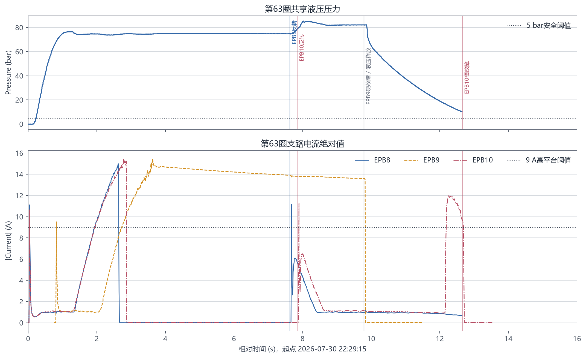
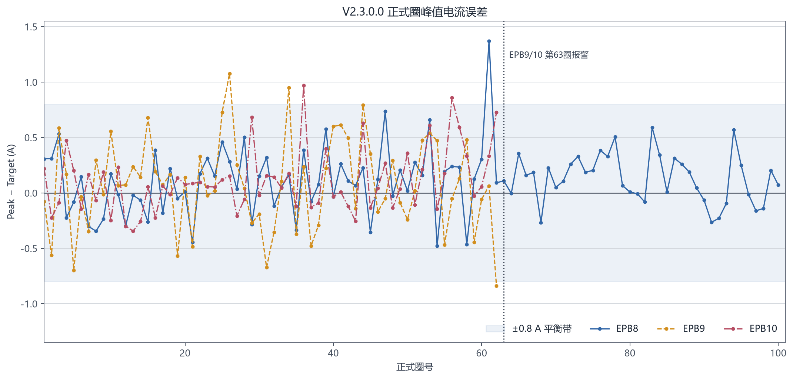

# V2.3.0.0 版本测试分析与整改报告

## 技术结论

本次报警不能忽略，也不应把两条硬故障改为“连续多圈才正式报警”。

- **EPB9 的报警是真实保护动作。** 第 63 正式圈正向电流长期停留在约 13.6A，未达到 15A 目标，持续上电 9.014s 后触发 `ForwardAbsoluteOnTimeExceeded`。继续重试会增加电机、卡钳和样件的热/机械风险。
- **EPB10 的检测逻辑有效，但触发条件来自共享液压时序缺陷。** EPB10 在液压仍约 79bar 时开始反转，液压释放前持续承载；随后形成 11.020A 中值高平台，正确触发 `AbnormalHighCurrentPlateau`。
- **应修复液压协同，而不是降低保护灵敏度。** 旧逻辑中，非最后成员调用液压释放后立即返回；`await HydraulicMarkReleaseAsync` 实际只代表“成员已登记释放”，不代表“液压已经降到安全压力”。
- **另发现两项独立缺陷。** EPB10 报警后电源组 4 保持输出约 8h42m56s；报警圈数据库样本数与 CSV/BIN 证据边界不一致。

已在本地源码中完成液压释放屏障、报警电源收尾、报警圈原子封存和日志轮转重试修复。自动化测试与构建已通过，但尚未在真实台架执行修改后的 100 圈复测，因此不能把软件验证替代为硬件验收。

## 第 63 圈故障链证明共享液压是 EPB10 的诱因

关键时间线如下，时间均为 2026-07-30 本地时间：

| 时间 | 通道/系统 | 事件 | 证据含义 |
|---|---|---|---|
| 22:29:15.036 | EPB8 | 正向开始 | 第 63 圈 |
| 22:29:15.813 | EPB9 | 正向开始 | 错峰 800ms |
| 22:29:17.655 | EPB8 | 达到夹紧并断电 | 进入 5s 保持 |
| 22:29:17.871 | EPB10 | 达到夹紧并断电 | 进入 5s 保持 |
| 22:29:22.666 | EPB8 | 开始反转 | 此时共享压力约 75bar |
| 22:29:22.884 | EPB10 | 开始反转 | 此时共享压力约 79bar |
| 22:29:24.827 | EPB9 | 正向绝对上电超时 | 电流约 13.6A，已上电约 9.014s |
| 22:29:24.838 | 液压 2 | 执行统一释放 | EPB8/10 已分别反转约 2.17s/1.95s |
| 22:29:27.649 | EPB8 | 反转结束 | 反转耗时 4982ms，接近 5000ms 保护上限 |
| 22:29:27.697 | EPB10 | 高电流平台硬故障 | 中值 11.020A，高于 9.000A 阈值 |

下图把三路电流、共享液压压力和关键控制事件放在同一时间轴。反转竖线出现在液压释放竖线之前；EPB10 的高平台发生在带压反转之后。



液压释放命令发出后，实测压力下降到不同阈值的耗时为：

| 压力阈值 | 相对释放命令耗时 |
|---:|---:|
| ≤50bar | 0.677s |
| ≤30bar | 1.567s |
| ≤20bar | 2.140s |
| ≤10bar | 2.853s |
| ≤5bar | 3.331s |
| ≤3bar | 3.640s |

因此只等待液压 DO/AO 的“释放命令已发送”仍不足以保证安全，反转必须等待压力实测低于安全阈值并保持稳定。

## 报警策略不应放宽

当前保护分为两类，处理方式应继续区分：

1. **峰值精度偏差**
   - 单圈超过 ±0.8A 只产生软预警并修正模型。
   - 连续 3 圈超出正向平衡带才升级硬故障。
   - 正向立即超过目标 +3.0A 时直接硬故障。
2. **设备/样件安全故障**
   - 正向绝对上电超限、开路、过流、DAQ 断流、高电流平台等均立即硬停机。
   - 此类条件继续运行一圈才确认，可能把单次异常扩大为重复热冲击或机械损伤。

EPB9 属于第二类。EPB10 的高平台也属于第二类；本次整改消除造成高平台的带压反转条件，但保留检测阈值和立即断电动作。

## 正式圈控制精度总体稳定，EPB9 波动相对较大

统计仅包含日志中存在“正式阶段启动”且随后正常完成的正式圈；学习圈和第 63 圈报警半圈不计入精度分母。

| 通道 | 完成正式圈 | Success | SuccessWithWarning | 误差均值 | MAE | P95 绝对误差 | ±0.8A 内 |
|---|---:|---:|---:|---:|---:|---:|---:|
| EPB8 | 100 | 98 | 2 | +0.114A | 0.235A | 0.570A | 99/100 |
| EPB9 | 62 | 59 | 3 | +0.075A | 0.333A | 0.790A | 59/62 |
| EPB10 | 62 | 60 | 2 | +0.108A | 0.221A | 0.680A | 60/62 |

EPB9 的 MAE 和 P95 绝对误差均高于 EPB8/10，而且第 62 圈已出现 -0.839A 欠调软预警；下一圈无法达到目标与这一近期趋势方向一致，但现有证据不足以把原因唯一归结为卡钳、样件、线束或机构温升，台架复测时应重点检查 EPB9 支路。

误差图显示超出 ±0.8A 的点均为孤立点，没有连续 3 圈超调；现有峰值连续确认策略工作正常。



时长异常也支持共享液压扰动：

- EPB8 第 63 圈反向耗时 4982ms，接近 5000ms 上限。
- EPB8 第 64 圈正向耗时 5745ms，是其本次 100 个正式圈中的最大值。
- EPB9 第 63 圈正向持续 9014ms 后硬停。
- EPB10 第 63 圈反向持续约 4811ms 后形成 11.020A 高平台。

## warning.log 不会单独中断试验，但包含有用的先兆

`warning.log` 共识别出：

| 类型 | 数量 | 影响 |
|---|---:|---|
| 控流观测无效、模型未更新 | 3 | `Slope=0` 时安全跳过，不污染预测模型 |
| 单圈峰值超调软预警 | 6 | 不停机；更新连续计数与下一圈提前量 |
| 单圈欠调软预警 | 1 | 不停机；EPB9 第 62 圈 -0.839A，是第 63 圈前的先兆 |
| 正向软时限 | 2 | 不停机；EPB9 第 63 圈和 EPB8 第 64 圈 |
| 峰值捕获取消 | 1 | EPB9 硬故障断电后的派生记录 |
| 硬故障记录 | 2 | EPB9/10 的主故障结果 |
| 报警快照完成 | 2 | 硬故障后的证据导出结果 |

结论是：软预警设计本身未造成停机；`warning.log` 中的 EPB9 欠调和软时限具有诊断价值。硬故障、Timer 返回失败和快照导出是同一故障链的不同记录，不应重复计为多个独立故障。

## 数据质量可用于诊断，但旧报警圈证据边界不一致

### SQLite 与圈数

- `PRAGMA integrity_check` 返回 `ok`。
- `epb_cycles` 共 226 行，没有重复 `(epb_id, cycle_number)`。
- EPB8：100 个 `completed`。
- EPB9：62 个 `completed`、1 个 `alarm`。
- EPB10：62 个 `completed`、1 个 `alarm`。

### CSV/BIN

- 全量检查 AlarmSnapshots 下 50 对 CSV/BIN，CSV 行数均与 BIN 的 32 字节记录数相等。
- 抽查第 63 圈时间戳为 0.5ms 分辨率，样本序号连续，采集轨迹无足以解释报警的长间断。
- 但数据库和报警文件对同一报警圈的截止边界不同：

| 通道 | SQLite `sample_count` | 报警 BIN 记录数 | 数据库多记 |
|---|---:|---:|---:|
| EPB9 第63圈 | 23080 | 21460 | 1620 |
| EPB10 第63圈 | 28740 | 27080 | 1660 |

旧流程先导出仍在写入的 running 圈，再读取更晚的实时计数封数据库，所以数据库多记了导出结束后的样本。文件对本身完整，但 SQLite 不能准确描述对应证据文件。

### 程控电源遥测

- 电源组 3：15181 条；电源组 4：294815 条。
- 未发现掉线、CC、低压/电流/功率限制、保护跳闸或 Error 字段。
- 因此 EPB9/10 报警不支持“程控电源限流或通信中断”解释。
- EPB10 于 22:29:27 报警后，电源组 4 一直保持 `Output=True`，直到次日 07:12:23 执行 StopAll，持续约 8h42m56s。这是报警收尾遗漏，不是报警根因，但属于安全和能耗问题。

## 已实施的软件整改

### 液压释放变为全组共享的安全屏障

- 每个液压轮次建立独立代际和共享 `TaskCompletionSource`。
- 非最后成员到达释放点后等待同一完成任务，不再提前进入反转。
- 最后成员或故障成员退出后执行实际释压。
- 默认等待压力 ≤5bar 且连续稳定 100ms；最长 5000ms。
- 压力无法读取或超时，返回明确的 `AdaptiveHardFault HydraulicReleaseTimeout`，立即断电并阻止反转。
- 新轮次进入时若上一轮仍在释压，必须等待上一轮完成，避免代际串扰。

新增兼容旧配置的液压参数：

```xml
<ReleaseSafePressureBar>5</ReleaseSafePressureBar>
<ReleaseStableMs>100</ReleaseStableMs>
<ReleaseTimeoutMs>5000</ReleaseTimeoutMs>
```

### 报警后关闭已空闲的电源组

`StopChannelOnAlarm` 完成通道计时器、Runner 和液压参与者清理后，调用与正常停机相同的电源组关闭路径。只有当组内无其他运行计时器或液压参与成员时才关闭该组；其他组和仍在运行的兄弟通道不受影响。最后一个活动组关闭后停止遥测记录。

### 报警圈原子封存

- 报警立即断电，后台继续保留默认 1000ms 的电流/压力尾部；证据延迟不延迟保护动作。
- `IEpbCycleRecorder` 新增 `SealAndExportAlarmCycle`。
- 在单通道锁内冻结样本边界、原子写入 CSV/BIN，并逐条校验：
  - BIN 长度必须为 32 字节记录的整数倍；
  - CSV/BIN 数量一致；
  - 圈号一致；
  - 样本序号从 0 连续；
  - BIN 时间戳不回退。
- 校验通过才写 `status='alarm'`；失败写 `failed`。
- SQLite 的 `sample_count` 和 `end_time`使用导出证据数量与末样本时间。
- 报警元数据升级为 schema 4，记录证据样本数、首末时间、校验错误、终态断电命令和电流代理确认，并保留报警前最后一条 `Action=HardFault` 判定，避免被故障后的空判定覆盖。
- `physicalOffStatus` 继续为 `NotMeasured`；电流下降只能支持“负载电流已消失”，不能证明继电器触点的物理状态。

### 正反向失速改为200ms趋势确认后即时断电

- 正向进入 `LoadRise` 后，连续200ms上升斜率不高于 `0.001A/ms` 且仍低于目标，触发 `ForwardCurrentRiseStalled`。
- 正向未形成负载上升时，按通道历史夹紧时间与默认3000ms上限触发 `ForwardLoadRiseNotStarted`。
- 反向稳定进入≤3A释放带满200ms后立即断电；3～9A平台超过模型正常时限且连续200ms无有效下降时触发 `ReverseCurrentDecayStalled`。
- ≥9A高平台、正向9秒及反向5秒绝对上电保护继续保留。
- 终态处理顺序调整为“高优先级断电→诊断→等待器→报警/快照”，诊断订阅者不能延迟断电。
- DO关闭失败、断电100ms后电流仍高于0.1A或电流无法读取时，立即停止同组通道并关闭对应程控电源。

### 日志跨日轮转重试

基线测试稳定复现“文件首次被占用导致跨日轮转失败后，解除占用仍不生成前一天归档”。修复后保留原 `ContentDate`，重试时先按原内容日期归档，再按原顺序重放内存队列。

## 验证结果

### 自动化测试

- `Tests/AdaptiveControlTests`：**77/77 PASS**
  - 新增非末成员等待全组低压确认；
  - 新增液压释放超时稳定故障码；
  - 新增空闲电源组作用域；
  - 更新报警元数据 schema 4、终态断电代理证据和 HardFault 选择；
  - 新增EPB9型正向平台、EPB10型反向释放、3～9A反向失速及断电优先级验证；
  - 原有绝对上电、高平台、过流、开路、DAQ 断流等保护测试保持通过；
  - 原先失败的跨日轮转重试测试通过。
- `Tests/EpbDiskWriterTests`：**11/11 PASS**
  - 新增报警圈原子封存与数据库边界一致；
  - 新增 CSV/BIN 数量不一致拒绝。

### 构建

`TfTest.sln` 的 `Debug|Any CPU` 完整构建成功，包括 MTTfTest、Controller、DataOperation、两个控制台测试项目和 PowerSupplyDebugger。

构建仍有仓库既有警告：

- NI DAQmx x86 引用与部分 MSIL 目标架构不一致；
- MTTfTest 与 ZlgCanComm 存在部分同名 UI 类型警告；
- 若干未使用字段/变量警告。

这些警告未由本次变更引入，也未阻断构建；在正式发布前仍建议单独清理目标架构配置。

## 方法与可重复分析

分析脚本：

```powershell
C:\Users\19812\.cache\codex-runtimes\codex-primary-runtime\dependencies\python\python.exe `
  docs\01_Inboxes\assets\plot_v2_3_0_0_analysis.py
```

脚本只读访问现场目录，完成：

- 正式圈开始/完成日志配对；
- 峰值误差、MAE、P95 和时长统计；
- SQLite 完整性、重复键和状态检查；
- 50 对报警 CSV/BIN 数量复核；
- 报警证据与数据库边界比对；
- warning.log 分类；
- 电源遥测异常标志与输出关闭时间检查；
- 两张报告图片和 JSON 摘要生成。

输出文件：

- `assets/v2_3_0_0_analysis_summary.json`
- `assets/v2_3_0_0_peak_error_cycles.png`
- `assets/v2_3_0_0_cycle63_fault_timeline.png`

## 限制与不确定性

- 本次分析是描述性和故障诊断，不证明 EPB9 未达到目标的唯一物理原因。
- 软件整改已通过无硬件测试，但没有修改、部署或运行远端 `\\wj-epb\debug\2.3.0.0` 程序。
- 未执行修改后真实液压、卡钳和程控电源的台架复测。
- 电流轨迹可支持断电动作有效，但 `physicalOffStatus` 没有独立触点反馈，不能宣称物理触点已断开。

## 台架复测步骤与验收

1. 部署经审核的整改版本，保留现有硬故障阈值。
2. 只选择 EPB8/9/10，先完成学习阶段，再运行 100 个正式圈。
3. 同步记录：
   - 每通道正向、反向 DO 时间；
   - 液压释放命令与压力曲线；
   - 电源组输出状态及关闭回读；
   - CSV/BIN、alarm-metadata.json 和 SQLite 圈记录。
4. 人为让一条通道延迟到达释放点，验证其他通道不会在压力 >5bar 时反转。
5. 模拟压力不下降，验证 5000ms 后触发 `HydraulicReleaseTimeout`，且无反转命令。
6. 触发单通道硬故障，验证：
   - 故障通道立即断电；
   - 仍有兄弟通道运行时不关闭共享电源；
   - 组内全部停止后关闭电源且回读成功；
   - DB、CSV、BIN 样本数一致。

验收记录：

| 项目 | 标准 | 结果 |
|---|---|---|
| 带压反转 | 所有反转开始前压力 ≤5bar 且稳定 ≥100ms | 待台架 |
| 释压超时 | 5000ms 内未达阈值则硬故障、无反转 | 待台架 |
| 原有硬保护 | 绝对上电/高平台等仍立即断电 | 自动化通过，待台架 |
| 电源组关闭 | 组内无活动通道后关闭并回读 | 自动化逻辑通过，待台架 |
| 报警证据 | DB/CSV/BIN 样本数与末时间一致 | 自动化通过，待台架 |
| 100 圈完成 | EPB8/9/10 均完成目标圈数或留下真实硬故障证据 | 待台架 |
| 峰值稳定性 | 无连续 3 圈正向误差 >+0.8A，无单圈 >+3.0A | 待台架 |

## 后续问题

- 若整改后 EPB9 仍出现正向长时间达不到 15A，应对比更换卡钳/样件、线束压降、机构温升和同压力下的电流上升斜率。
- 若现场要求把安全压力从 5bar 调整为其他值，应由液压/样件安全规范给出上限，不能仅根据本次曲线经验放宽。
- 正式 100000 次耐久试验开始前，应先完成上述 100 圈台架复测并归档原子报警证据。

## 数据来源

- 程序及现场日志：`\\wj-epb\debug\2.3.0.0`
- 测试数据：`\\wj-epb\EPB_Data\10364-009_V2.3.0.0_2`
- 主运行日志：`log\run.20260730.001.log`
- 报警日志：`log\warning.log`、`log\error.log`
- 圈索引：`index.db`
- 报警证据：`AlarmSnapshots`
- 电源遥测：`PowerSupplyTelemetry\20260730_221101_cd9eb11b6ed045cdaa4746b5f3f6805c.csv`
