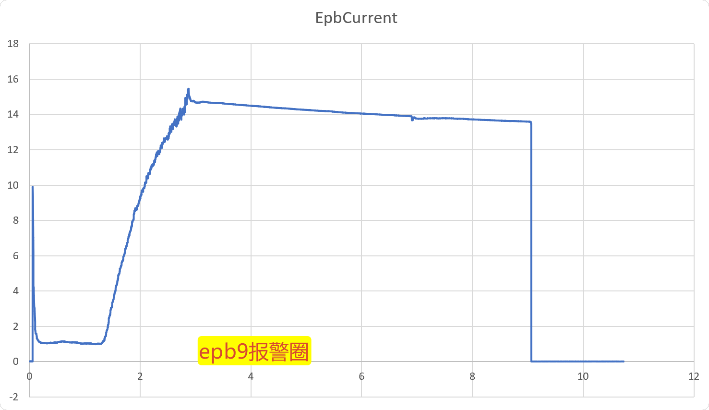
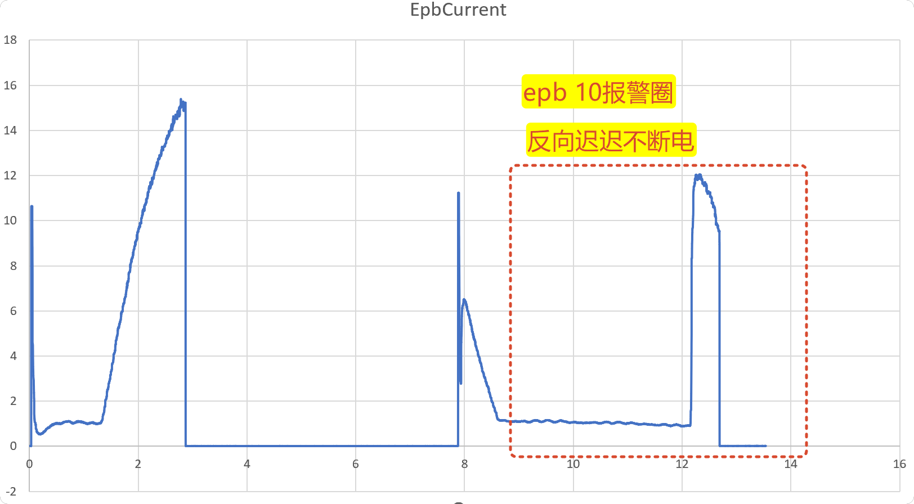

# EPB9/EPB10 长时间上电报警整改说明





## 结论

文档中的两个问题都属于可能造成卡钳堵转、发热或损坏的严重安全缺陷。

- 原版本不能满足要求：EPB9 正向未达目标后主要依赖约9秒绝对上电保护；EPB10 对低于9A但长期不下降的反向平台缺少提前硬停判据。
- 本地源码已经完成针对性整改，9秒正向和5秒反向绝对时限继续保留，但只作为最后一道保护，不再作为失速后的主要断电条件。
- 自动化软件测试已经通过；尚未部署到现场，也没有完成示波器或台架实测，因此不能宣称真实继电器、卡钳和程控电源的物理响应已经验收。

## 已实施的即时保护

### 正向

- 进入负载上升阶段后，对连续200ms电流窗口计算线性斜率。
- 电流仍低于目标且斜率不高于 `0.001A/ms`，立即产生
  `ForwardCurrentRiseStalled` 硬故障。
- 若一直未形成有效负载上升，则按通道历史夹紧时间
  `Median + max(300ms, 4×MAD)` 判定，并受默认3000ms安全上限约束；
  超限产生 `ForwardLoadRiseNotStarted`。
- EPB9型13～14A平台回归测试在完整200ms窗口后硬停，不再等待9秒。

### 反向

- 配置的 `RevDecayLimitA=3A` 是释放判定的最低允许带宽，历史模型不能把释放阈值收得比3A更严。
- 电流稳定进入释放带并覆盖200ms后立即认定释放完成并断电，不再追加第二个200ms等待。
- 大于等于9A的稳定平台保留200ms硬故障保护。
- 3～9A平台超过通道历史正常释放期限后，如果连续200ms下降斜率不足
  `0.001A/ms`，产生 `ReverseCurrentDecayStalled` 并断电。
- EPB10型约1A低电流平台会被正常识别为已经释放，不允许继续上电到后续高电流峰值。

## 断电执行顺序与联锁

状态机确认夹紧、释放或硬故障后，在同一个采样回调内按以下顺序执行：

1. 原子锁存终态；
2. 调用 `CommandOffHighPriority`；
3. 发布诊断事件；
4. 完成Runner等待器；
5. 触发报警、日志和快照。

诊断订阅者即使阻塞，也不能排在断电动作之前。当前采集配置为2000Hz、每批20点，趋势条件满足后在下一批回调内发出DO命令；高优先级Worker等待最多30ms，随后退化为当前线程直写。

如果DO关闭返回失败，立即停止并关闭同一电气组的全部通道和程控电源。DO返回成功后继续观察100ms电流尾部；若电流仍高于0.1A，或电流无法读取，同样触发组级失效安全联锁。

报警元数据升级为 schema 4，记录断电命令结果、命令耗时、电流代理确认结果和阈值。`physicalOffStatus` 仍保持 `NotMeasured`：电流消失是电气代理证据，不等于继电器触点物理回读。

## 配置默认值

```xml
<ForwardProgressConfirmMs>200</ForwardProgressConfirmMs>
<ForwardMinimumRiseSlopeAperMs>0.001</ForwardMinimumRiseSlopeAperMs>
<ForwardProgressDeadlineMs>3000</ForwardProgressDeadlineMs>
<ReverseProgressConfirmMs>200</ReverseProgressConfirmMs>
<ReverseMinimumDecaySlopeAperMs>0.001</ReverseMinimumDecaySlopeAperMs>
<ReverseProgressDeadlineMs>2500</ReverseProgressDeadlineMs>
<OffCurrentClearThresholdA>0.1</OffCurrentClearThresholdA>
<OffCurrentClearTimeoutMs>100</OffCurrentClearTimeoutMs>
```

旧项目XML不包含这些节点时自动使用上述默认值；设置界面、XML读取和保存均已支持这些字段。

## 当前验证状态

- `Tests/AdaptiveControlTests`：77/77通过。
- 已覆盖EPB9型正向平台、EPB10型低电流释放、3～9A反向停滞、9A高平台、绝对时限、DAQ断流、开路、断电优先顺序、DO失败及电流未清零联锁。
- 台架验收仍需测量“判定时间—DO写入—支路电流消失”的真实时间差，并确认组级程控电源关闭回读。
