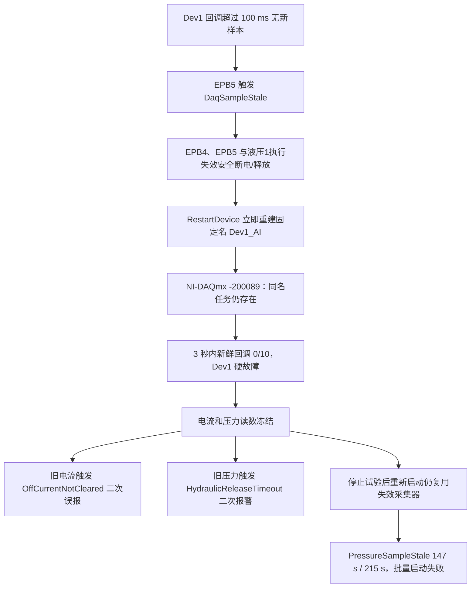

# 10358-029 16:27 报警、停止后无法重新启动及其他告警分析

## 1. 结论摘要

分析数据：`\\wj-epb\EPB_Data\10358-029_1644_backup` 
主要时段：北京时间 `2026-08-04 15:44:41～16:32:29` 
对应运行：`RunId=12bd91f9d1f34710a54a6d71bf4f344c`，以及两次失败的重新启动。

本次“报警后停止，再点启动无法启动”的主因已经确认：

1. `16:27:33`，Dev1 采集回调超过 `100 ms` 没有新数据，EPB5 首先触发 `DaqSampleStale>100ms`。程序按设计给 Dev1 所属 EPB4、EPB5 断电并尝试自动重建采集任务。
2. 自动恢复代码停止并释放旧任务后，立即用固定名称 `Dev1_AI` 创建新任务；NI-DAQmx 返回 `-200089 Task name specified conflicts with an existing task name`。说明旧任务在驱动中仍占用该名称，或停止/释放失败而异常被代码吞掉。新任务没有建立，3 秒内新鲜回调为 `0/10`，Dev1 被判定为恢复失败。
3. 用户在 `16:29:30` 停止试验后，分别于 `16:29:55`、`16:31:03` 两次点击重新启动。日志中没有第二次“AI 采集启动”记录，说明这是**重新启动试验，不是重新初始化采集器**。启动按钮只重新启动 EPB 批次，不会重建已经失效的 Dev1 采集器。
4. Dev1 的压力值因此一直冻结在 `69.390 bar`。第一次重启时样本已陈旧 `147250.2 ms`，第二次已陈旧 `215052.9 ms`。液压建压保护正确拒绝使用旧压力样本，所以 EPB4、EPB5 所在液压组无法通过启动资格，整个批量启动失败。

同时确认：

- `16:27:34` 的“EPB4/EPB5 断电后电流未清零”是**陈旧 DAQ 数值造成的二次误判，不是持续大电流的可靠证据**。独立的组2程控电源遥测显示，EPB5 断电后约 `194 ms`，组总电流已经回到 `0 A`；程序在约一秒后仍读到 `8.941 A / 13.414 A`，这些值已冻结。
- `HydraulicReleaseTimeout LastPressure=69.390bar` 同样是 Dev1 旧压力值造成的二次报警。它只能说明程序无法用有效传感器数据确认释压，不能证明液压实际仍保持 `69.390 bar`，更不能据此判断泄漏或制动液不足。
- 安全动作总体有效：EPB4、EPB5 的 DO 断电命令返回成功，组2程控电源随后关闭；Dev2 上的 EPB8、9、10、11 仍继续运行，直至操作员停止。

根因置信度：

| 结论 | 置信度 |
|---|---|
| 停止后无法重新启动由 Dev1 采集未恢复、压力样本持续陈旧造成 | 高 |
| Dev1 自动恢复失败的直接原因是同名 DAQ 任务冲突 `-200089` | 高 |
| “断电后仍有 8.941/13.414 A”是冻结旧值，不是真实持续电流 | 高 |
| `69.390 bar` 是冻结旧压力，不能代表实际未释压 | 高 |
| 最初一次超过 100 ms 的回调间断由 CPU 调度、NI 驱动还是硬件链路引起 | 现有数据不能唯一确定 |

## 2. 故障链

## 3. 关键时间线

| 时间 | 事件 | 证据与判断 |
|---|---|---|
| 15:44:41.796 | AI 采集启动 | `Dev1[7] Dev2[8] Fs=2000Hz N=20`；整个数据中仅此一次采集器初始化 |
| 15:45:00.749 | 启动 EPB4、5、8、9、10、11 | 自学习 10 圈，之后进入正式运行 |
| 16:24:04～16:24:11 | 两台 DAQ 后台队列严重积压 | Dev1 最大 `681` 批、`3403.9 ms`；Dev2 最大 `630` 批、`3148.9 ms`，说明应用数据处理存在明显拥塞 |
| 16:27:30.847 | 液压1正常建压合格 | 实际 `70.355 bar`，此时 Dev1 尚有有效数据 |
| 16:27:33.200 | EPB4 正向断电 | `ClampReachedPredicted`，DO 返回成功 |
| 16:27:33.467 | EPB5 因采样陈旧断电 | `Reason=DaqSampleStale>100ms`，DO 返回成功 |
| 16:27:33.479 | Dev1 自动安全恢复开始 | 影响通道 `[4,5]` |
| 16:27:33.662 | 独立程控电源组2电流为 `0 A` | 比 EPB5 断电晚约 `194 ms`，证明组电流已经清零 |
| 16:27:34.211～34.472 | 报“断电后电流未清零” | 程序仍显示 EPB4=`8.941 A`、EPB5=`13.414 A`；与独立电源遥测矛盾，属于旧 DAQ 数值 |
| 16:27:34.421 | 程控电源组2输出关闭 | 安全联锁完成 |
| 16:27:34.535 | Dev1 重建失败 | `Task name ... Dev1_AI` 冲突，状态码 `-200089` |
| 16:27:37.542～37.547 | Dev1 恢复失败，EPB4/5 硬故障 | 3 秒内新鲜样本 `0/10`；报警快照导出 |
| 16:27:38.492 | 液压1释压确认超时 | 程序仍读冻结值 `69.390 bar`；不能证明实际压力未释放 |
| 16:27:38.691～38.700 | 6 条未观察任务异常 | 都是同一个液压1释压超时从多个异步任务传播，并非 6 个独立故障 |
| 16:29:30.486 | 操作员停止试验 | Dev2 其他通道在此前仍继续运行 |
| 16:29:55.693 | 第一次重新启动试验 | 电源接管正常，随后等待液压1资格 |
| 16:30:01.710～11.172 | 第一次启动失败 | 压力仍为 `69.390 bar`，样本年龄 `147250.2 ms`；启动保护拒绝继续 |
| 16:31:03.487 | 第二次重新启动试验 | 仍未重建 Dev1 采集器 |
| 16:31:09.516～19.068 | 第二次启动失败 | 同一冻结压力，样本年龄增至 `215052.9 ms` |
| 16:32:00.862 | 再次停止试验 | 随后关闭窗体；备份数据未包含关闭后新的进程启动记录 |

## 4. 为什么停止后再启动仍然失败

### 4.1 “停止试验”没有重启采集器

`MTTfTest/FrmEpbMainMonitor.cs` 中：

- 监控窗体初始化时在约第 `1120` 行调用 `twoDeviceAiAcquirer.Start()`；
- `BtnStop_Click` 在约第 `2482～2484` 行只取消批次并调用 `_epb.StopAll()`；
- 再次点击启动时在约第 `2402` 行直接调用 `StartBatchSynchronizedWithResultAsync()`，没有检查或重启 Dev1 采集器；
- 只有关闭窗体时，约第 `2547～2557` 行才停止并释放采集器。

因此，一旦运行中的 Dev1 自动恢复失败，简单“停止试验→开始试验”会继续使用同一个失效采集器。日志中的两次重新启动都没有新的 `AI 采集启动`，与源码行为完全一致。

### 4.2 液压值虽然在允许范围内，但样本无效

启动目标为 `70 bar`，允许范围为 `60～80 bar`。冻结值 `69.390 bar` 从数值上看合格，但 `Controller/HydraulicController.cs:185～255` 同时要求压力样本年龄不超过配置上限。两次重启均因 `PressureSampleStale` 失败：

| 尝试 | 日志压力 | 样本年龄 | 结果 |
|---|---:|---:|---|
| 16:29:55 启动 | 69.390 bar | 147250.2 ms | 5 秒后 `HydraulicBuildTimeout` |
| 16:31:03 启动 | 69.390 bar | 215052.9 ms | 5 秒后 `HydraulicBuildTimeout` |

样本年龄增加量 `67802.7 ms`，与两次失败时间间隔约 `67.8 s` 一致，进一步证明该压力值一直没有更新。

## 5. Dev1 自动恢复失败的代码原因

直接代码位于 `IO.NI/TwoDeviceAiAcquirer.cs`：

1. `RecoverForEpbAsync` 在约第 `800` 行调用 `RestartDevice(device)`；
2. `RestartDevice` 在约第 `1708～1726` 行依次 `Stop()`、`Dispose()` 旧任务，但两个异常都被空 `catch` 吞掉；
3. 随后第 `1730` 行立即用固定名称 `Dev1_AI` 创建任务；
4. 旧异步 `BeginReadMultiSample` 回调是否完全退出、旧任务是否已从 NI 驱动注销，没有确认；
5. 新建失败只写日志，`RestartDevice` 返回 `void`，上层只能继续等 3 秒新鲜回调，最后得到泛化的 `DaqRecoveryFreshnessTimeout`。

这段实现存在三个确定缺陷：

- 释放失败被静默忽略，无法知道是 `Stop` 还是 `Dispose` 没有完成；
- 未等待旧异步读回调退出，就复用固定任务名；
- 重建方法不把创建失败返回给恢复状态机，现场先看到“恢复超时”，而真正的 `-200089` 只在开发日志中。

最初的 `>100 ms` 回调间断仍需进一步复现。其可能来源包括 NI 驱动/USB 链路短暂停顿、线程调度或应用负载；现有数据只能确认它是触发点，不能唯一锁定硬件或操作系统原因。`16:24` 两台设备同时出现数秒级后台积压，是明显的系统负载风险，但后台队列与回调新鲜度是两条不同链路，不能直接断言该积压必然导致 `16:27` 的回调停止。

## 6. “断电后电流未清零”为什么是二次误报

### 6.1 独立电源遥测

组2程控电源文件：

`PowerSupplyTelemetry/20260804_154500_12bd91f9d1f34710a54a6d71bf4f344c.csv`

| UTC（北京时间减 8 小时） | 组2 IOut | 状态 |
|---|---:|---|
| 08:27:33.226 | 27.713 A | EPB4/5 动作中 |
| 08:27:33.336 | 15.985 A | 电流下降 |
| 08:27:33.442 | 13.933 A | 电流下降 |
| 08:27:33.552 | 11.059 A | 电流下降 |
| 08:27:33.662 | 0.000 A | 已清零 |
| 08:27:33.766～34.311 | 0.000 A | 持续清零 |
| 08:27:34.421 | 输出关闭 | 组2联锁完成 |

EPB5 的最后断电命令在 `08:27:33.467`，所以电源组总电流约 `194 ms` 后已到零，明显小于程序配置的 `1000 ms` 清零等待。

### 6.2 代码没有校验电流样本是否新鲜

`Controller/EpbCycleRunner.Adaptive.cs:515～528` 的 `PollOffCurrentUntilClearAsync` 只反复读取 `_readCurrent(_channel)` 并比较 `0.1 A` 阈值，没有同时检查该值的 DAQ 时间戳。Dev1 已停止更新后，轮询一秒只是在重复读取旧值，于是错误升级为 `OffCurrentNotCleared`，并触发组2电源联锁。

联锁动作本身是安全的，但故障分类不准确。正确分类应是“DAQ 已失效，无法用支路电流确认断电”；此时应优先使用独立程控电源组电流作为补充证据，而不是把冻结值表述为真实持续电流。

## 7. 液压报警的真实含义

`Controller/HydraulicGroupCoordinator.cs:830～893` 的 `WaitForSafePressureAsync` 只读取一个 `double` 压力值，并判断是否低于 `5 bar`，没有检查样本时间戳。因此 Dev1 失效后，它持续读到 `69.390 bar`，5 秒后报告 `HydraulicReleaseTimeout`。

应将结论限定为：

- 已执行液压 DO 关闭和 AO 回零命令；
- 因 Dev1 压力传感器数据不再更新，软件无法确认实际压力是否降到安全值；
- 当前证据不能证明实际仍有 `69.390 bar`，也不能据此诊断泄漏、制动液不足或卡钳开裂；
- UI 在 `16:27:38.496` 给出的“压力不足，请检查制动液液位及泄漏”等提示与本次故障不匹配，应改为“压力采样失效，释压状态无法确认”。

## 8. 其他报警和警告

### 8.1 DAQ 后台处理积压：严重性能风险

全时段共 `49` 条：Dev1 `31` 条，Dev2 `18` 条。

| 设备 | 最大队列深度 | 最大最老批次年龄 | 时间 |
|---|---:|---:|---|
| Dev1 | 681 | 3403.9 ms | 16:24:11.464 |
| Dev2 | 630 | 3148.9 ms | 16:24:10.307 |

两台设备几乎同时积压，指向应用共享处理链的拥塞，而不是单一传感器。源码中两台设备共用一个 `_queue` 和一个 `ProcessLoop` 工作任务；工程值换算、滤波、落盘批次和订阅回调都在此链路上完成。虽然压力新鲜度已经在快速回调路径刷新，但数秒级积压仍会导致完整峰值证据、落盘和 UI 严重滞后。

处理优先级：高。应拆分或隔离高耗时处理、设置有界队列/背压、记录每阶段耗时，并对持续积压进行主动降载，不能只打印警告。

### 8.2 峰值证据偏差：13 次，未达到硬报警

按通道统计：EPB4 `4` 次、EPB5 `5` 次、EPB8 `1` 次、EPB10 `2` 次、EPB11 `1` 次。最大连续次数为 EPB5 的 `2/3`，没有达到 `3/3` 硬报警条件。

值得重点复核的事件：

- EPB4 `16:24:33`：快速峰值 `14.916 A`，完整峰值 `16.267 A`，差 `1.351 A`；同圈还记录过冲 `+1.267 A`。
- EPB5 在多个时段反复出现，最高连续 `2/3`，说明快速控制值与完整数据峰值的差异并非完全偶发。
- 该类偏差与后台证据滞后、断电后电流继续下降/上升的统计窗口差异有关；不能简单解释为两个传感器冲突。

处理优先级：中高。保留现有连续确认，但应继续统一快速峰值与完整峰值的时间窗口，并将“处理滞后”和“断电后真实续升”分成不同故障码。

### 8.3 正向峰值过冲：9 次，未达到硬报警

EPB5 `5` 次、EPB4 `2` 次、EPB10 `2` 次。最大连续次数为 EPB5 的 `2/5`，均未达到 `5/5` 硬报警。

最高值为 EPB4 `16.267 A`，目标 `15.000 A`，偏差 `+1.267 A`。程序本圈继续完成释放并修正下一圈断电点，符合当前容错策略，但该圈应结合 EPB4 继电器输出端电压和原始电流曲线复核。

### 8.4 EPB10 长期近目标平台/控流观测无效

全时段：

- `ClampReachedNearTargetPlateau` 共 `51` 次，其中 EPB10 `48` 次；
- “控流观测无效，未更新预测模型”共 `63` 次，其中 EPB10 `55` 次；
- EPB10 低于合格下限的平台停滞 `6` 次，最大连续 `2/5`；
- EPB10 另有一次完整峰值 `13.907 A`，低于目标 `1.093 A`。

这不是本次无法启动的原因，但高度集中在 EPB10，说明该通道多数圈在约 `14.0～14.8 A` 附近进入低斜率平台，导致预测模型频繁拒绝学习。EPB11 与 EPB10 共用电源组4而没有同等频率，故更像 EPB10 通道自身的卡钳负载、继电器/线束压降、电流标定或模型参数问题，而不是整个组4程控电源故障。

处理优先级：中。建议单独对 EPB10 做空载电流、夹紧电流、负载端电压、继电器压降和电流通道标定复核，再决定是否调整 `14.2 A` 合格下限或斜率阈值。

### 8.5 完整峰值处理滞后：3 次

- EPB10 两次，均约 `140 ms`；
- EPB9 一次，约 `130 ms`；
- 允许值为 `100 ms`。

程序正确地把这些圈排除在峰值证据连续计数之外。它们是第 8.1 节后台处理积压的直接表现，不是卡钳硬件报警。

### 8.6 软预警快照导出失败：3 次

`15:46:17` 的 EPB8，以及 `15:46:48` 的 EPB10 两条预警发生在学习阶段，当时没有正数正式圈号。`EpbManager.WarningSnapshots.cs:33～36` 明确拒绝没有有效正式圈号的预警快照，因此未保存证据。

不影响安全控制，但形成证据缺口。学习圈本身有负圈号，建议快照系统支持学习圈号，或将学习阶段预警保存到独立目录，而不是作为 ERROR 记录后丢弃。

### 8.7 UI 配置保存异常：1 次

`15:55:24.156`，勾选框状态保存时 `File.Replace` 连续三次失败，原因是目标 UI 配置文件被其他进程或句柄占用。原配置文件按代码设计被保留，之后试验持续运行约 32 分钟，因此它与 `16:27` 主故障没有因果关系。

改进建议：保存操作做防抖；延长并采用退避重试；记录具体路径和占用进程；UI 事件中捕获并显示非致命警告，避免进入 `Application.ThreadException`。

### 8.8 大量 `HydraulicForceRelease`：365 条

这些记录大多数是每圈结束时的正常 DO 关闭、AO 回零动作，不是 365 次液压故障。当前全部按 WARN 写入，显著放大日志噪声。建议正常释放降为 INFO，只有命令失败、压力无法确认或异常强制释放才记录 WARN/ERROR。

### 8.9 未观察任务异常：6 条重复

`16:27:38.691～38.700` 的六条 `TaskScheduler.UnobservedTaskException` 都源于同一个 `HydraulicReleaseTimeout`。代码中有多处 `_ = HydraulicMarkReleaseAsync(...)` 弃置异步任务，异常最终由终结器线程统一报告。

这不会说明又发生了六次物理故障，但会掩盖真正异常并增加不确定性。所有安全相关 fire-and-forget 任务都应通过统一观察器记录、关联 `CorrelationId` 并消费异常。

## 9. 报警快照完整性

`AlarmSnapshots/20260804_162738-EPB04` 已保存 EPB4 报警圈及前 9 圈，元数据完整，原因是：

`DaqGroupHardFault Device=Dev1 RecoveryFailed=DaqRecoveryFreshnessTimeout`

元数据同时记录电气组成员 `[4,5]`，但目录中没有 EPB5 独立报警圈文件。日志确实为 EPB4、EPB5 各发出一次硬报警。若这是组级报警去重策略，应在快照清单中明确写明“EPB5 被 EPB4 组级快照覆盖”；否则应补充同组兄弟通道的报警圈证据，避免现场误以为只影响 EPB4。

## 10. 现场恢复建议

在软件修复前，出现 `DAQ恢复失败` 后不要连续点击“开始试验”。建议：

1. 停止全部 EPB，确认各通道继电器断开、程控电源输出关闭，并通过机械/独立仪表确认液压已释放。
2. 完全关闭 EPB 监控窗体和程序，确认原进程已经退出；仅点击“停止试验”不足以重建采集器。
3. 在 NI MAX 中确认 Dev1 在线并复位 Dev1；如仍异常，再检查 USB/机箱供电和物理连接。
4. 重新打开程序后，先确认日志出现新的 `AI 采集启动`，并观察 Pressure_1 与 EPB4/EPB5 电流实时变化，不能停留在 `69.390 / 5.369 / 13.414` 等旧值。
5. 先做 Dev1 空载采集和单通道短周期试验，确认连续回调、压力新鲜度与断电回零正常，再恢复六通道批量运行。

如果完全退出程序后仍报 `Dev1_AI -200089`，说明旧进程未退出或 NI 驱动中的任务仍未释放，需要结束残留进程并重置 Dev1；不应通过反复点击启动绕过。

## 11. 软件整改优先级

### P0：必须先修复

1. **重写 Dev1/Dev2 恢复状态机**：停止挂新读、等待当前回调退出、记录 Stop/Dispose 每一步结果、确认旧任务释放后再创建；新任务采用代次或唯一名称，并忽略旧代次的迟到回调。
2. **恢复方法返回真实失败**：`RestartDevice` 改为返回结果/异常，`-200089` 直接上报为 `DaqTaskRecreateFailed`，不要再等待 3 秒后只显示泛化超时。
3. **启动前 DAQ 预检**：在接管程控电源、打开液压前检查 Dev1/Dev2 新鲜回调；失效时直接阻止启动，并提供“重建采集器”或明确要求重启程序。
4. **所有安全判据带样本新鲜度**：断电电流轮询和释压确认都必须同时验证值与时间戳；陈旧时标记“无法确认”，禁止当作真实大电流或真实高压力。
5. **观察全部安全异步任务**：消除 `_ = Task` 未观察异常，保证异常只上报一次并带关联 ID。

### P1：尽快处理

1. 将程控电源 IOut 作为组级独立断电佐证；DAQ 失效时区分“支路电流不可用”和“组电流未清零”。
2. 拆分两台 DAQ 的后台处理队列，或至少对高耗时落盘/UI 订阅做隔离，避免一个共享 worker 出现数秒积压。
3. 统一峰值证据统计窗口，分别报告后台滞后、断电后续升和真实传感器差异。
4. 修正液压释压 UI 文案，样本陈旧时不再提示泄漏/制动液不足。
5. 明确 Dev1 组级报警快照对 EPB4/EPB5 的覆盖关系。

### P2：降低噪声和改善证据

1. 正常 `HydraulicForceRelease` 降为 INFO。
2. 支持学习阶段负圈号的软预警快照。
3. UI 配置保存增加防抖、退避重试和占用诊断。
4. 对 EPB10 做通道专项检查，避免近目标平台和无效控流观测长期刷屏。

## 12. 最终判断

本次不是“液压压力真的建不上去”，也不是“EPB4/5 断电后仍长期带着 8～13 A 电流”。核心是：

> Dev1 短时断流触发自动恢复，但旧 NI 任务未被可靠释放；固定名称 `Dev1_AI` 重建冲突，导致 Dev1 永久失去新数据。停止试验没有重启采集器，所以后续两次启动都因旧压力样本被安全保护拒绝。

从安全结果看，电机与电源断电动作有效；从诊断质量看，陈旧样本仍被用于“电流未清零”和“释压超时”判定，造成了误导性的二次报警。修复重点应放在 DAQ 生命周期管理、启动前采集健康检查、所有安全测量的新鲜度校验，而不是放宽液压或电流阈值。

## 13. 软件整改实施记录（2026-08-04）

已按本报告完成以下代码整改：

1. DAQ 任务改用代次唯一名称；回调携带不可变任务/Reader/代次，旧代次迟到回调只做释放，不再写快照、入队或重新挂读。
2. Stop/Dispose 异常不再静默吞掉；旧回调有界等待退出；任务创建失败直接返回 `DaqTaskRecreateFailed`，不再伪装成单纯新鲜度超时。
3. 批量和单通道启动均在使能程控电源与液压前验证连续新鲜回调；失效时自动重建，仍失败则以 `DaqStartPreflightFailed` 拒绝启动。
4. 断电电流确认同时校验 DAQ 新鲜度；陈旧时分类为 `OffCurrentUnverifiableDaqStale`，并附加新鲜程控电源组电流作为独立佐证，不再报告冻结支路电流真实未清零。
5. 液压释压确认改用 `PressureSample`；陈旧、无效或无样本均不能通过低压稳定确认，UI 文案改为“压力采样过期，无法确认释压状态”。
6. 安全 fire-and-forget 液压任务统一观察并按同一异常在 10 秒窗口去重，消除终结器线程上的重复未观察异常。
7. Dev1/Dev2 拆为独立队列和处理 worker，使用信号唤醒替代 1 ms 轮询；通道排序缓存一次，动态零点每通道只查询一次；重启后旧代次积压批次直接丢弃，避免数据倒灌。
8. 正常 `HydraulicForceRelease` 从 WARN 降为 INFO；学习阶段负圈号可保存软预警快照；组级报警清单明确记录受影响通道并导出兄弟通道辅助证据。
9. UI 勾选配置保存增加 300 ms 防抖、后台保存、5 次指数退避和失败路径诊断；失败保留原文件且不再进入 UI 未处理异常。

验证结果：

- `TfTest.sln` Debug/x86 全量构建成功；
- 自适应与安全回归测试 `123/123` 通过；
- 落盘回归测试 `17/17` 通过；
- 程控电源调试器测试 `17/17` 通过。

尚需现场验证：使用真实 Dev1/Dev2 做断线—自动恢复—停止—再次启动试验，确认 NI 驱动释放时序与 USB/机箱硬件稳定性。EPB10 的近目标平台集中问题仍属于通道专项检查项，不应在缺少标定与负载端电压证据时通过放宽阈值处理。
