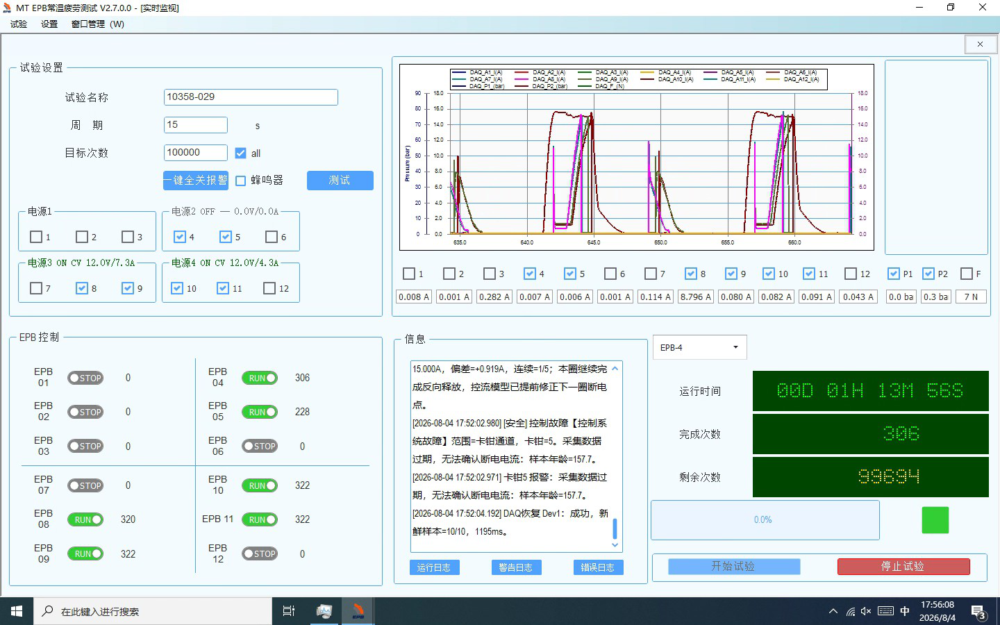
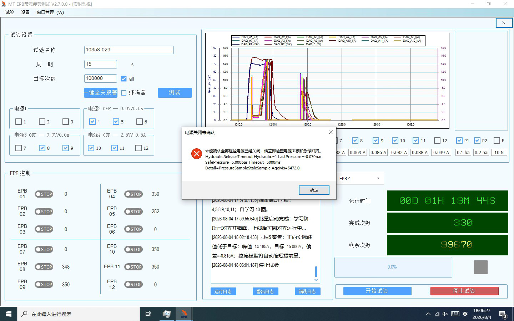

# 10358-029 最新程序错峰失效、报警停机界面与退出流程分析

## 一、结论

数据来源：

- `\\wj-epb\EPB_Data\10358-029_1742_backup`：用于分析 `17:29～17:42` 正式运行错峰和首次退出收尾；
- `\\wj-epb\EPB_Data\10358-029_1806_backup`：用于核对图1的 `17:52` 报警停机、图2的 `18:06` 关闭界面弹窗，以及后续运行日志；
- 现场截图图1、图2：已随本报告保存为本地证据图片。

本次重点分析的最新会话为 `2026-08-04 17:29:37～17:42:15`，运行 ID 为
`c71a72860e7c4c38b08c74b10bc0a16e`，选择 EPB4、5、8、9、10、11，周期为
`15,000 ms`，同电源组配置错峰为 `800 ms`。

**现场观察属实：启动定位和学习阶段有错峰，但进入正式运行后，正向上电错峰全部失效。**

- 启动定位：3 组实测间隔为 `773～775 ms`；
- 10 圈学习：30 个同组配对实测间隔为 `775～809 ms`，中位数 `796 ms`；
- 39 圈正式运行：117 个同组配对全部只有 `0～7 ms`，中位数 `1 ms`，没有一组达到目标 `800 ms`。

直接原因不是现场 XML 配置漏部署，也不是程控电源限流，而是正式阶段的代码时序：

1. `0 ms` 和 `800 ms` 两个通道的计时器回调按计划先后进入；
2. 两个回调随后等待同一个液压组、同一个正式圈代次的压力资格任务；
3. 本次液压建压通常在零相位后约 `0.82～0.94 s` 才完成，晚于 `800 ms` 相位；
4. 压力资格任务一完成，两个已到达的通道同时从同一个 `await` 后继续执行，立即发出正向 DO 命令；
5. 正式阶段没有像学习阶段那样，在液压资格完成后把整套 `0/800 ms` 相位共同滚动到未来。

因此，当前程序错开的是“计时器回调进入时间”，不是最终的“电机 DO 上电时间”。液压资格屏障把原有相位重新汇合了。

新增两项现场现象也已确认：

1. **图1是“Dev1 采集回调中断触发安全停机，同时左侧卡钳状态仍显示 RUN”。** EPB4、EPB5 不是分别发生了机械故障：两路共用 Dev1，`17:52:02` 同时因 `DaqSampleStale>100ms` 停机。EPB5 报警圈在 `17:52:02.839～17:52:03.999` 存在约 `1.160 s` 的采样空洞；程序立即发送两路断电命令、关闭电源组2并恢复 DAQ。`index.db` 将 EPB4 第309圈记为 `failed`、EPB5 第232圈记为 `alarm`，两路之后没有再开始正式圈；截图中的绿色 `RUN` 因此不代表真实控制状态。
2. **图2是窗口关闭顺序导致的重复收尾误失败。** `18:06:01` 的人工停止已经确认两组压力安全，并确认电源组2、3、4全部关闭；`18:06:13` 关闭监控窗口时，原有 `FormClosing` 处理先停掉并释放 DAQ，后挂接的程控电源安全处理才再次执行 `StopAllAsync`，因压力样本不再刷新而在5秒后抛出 `PressureSampleStaleSample AgeMs=5472.0`。本次不是电源实际仍开着，但当前代码顺序在“未先人工停止、直接关闭窗口”时存在真实的安全确认短路风险。

界面必须把每个已启动卡钳的控制状态作为一等状态显示：至少区分“运行、软预警、报警停机、同组联锁停机、人工停止、正常完成”；报警和联锁停机必须红色锁存并显示原因与时间，不能继续显示绿色 `RUN`，也不能只依赖中间日志框供操作员查找。

**该报警可以解决，但不能靠调大或取消 `100 ms` 安全阈值。** 应保留“数据失真时先断电”的安全行为，重点解决 Dev1 回调停顿：缩短采集回调、按设备隔离后台队列/工作线程、降低持续分配与GC压力、串行且代次隔离地恢复DAQ，并把回调间隔、`EndRead`耗时、队列等待和恢复过程写入报警快照。若软件整改后仍只在 Dev1 出现停顿，再转向检查 Dev1 板卡、驱动、总线/USB连接及供电。

## 二、关键现场证据

### 2.1 配置正确，不是 `StaggerMs` 未生效

备份中的 `Config/TestConfig.xml` 为：

| 电气组 | 现场通道 | `StaggerMs` |
|---|---|---:|
| Group 2 | EPB4、5、6 | 800 ms |
| Group 3 | EPB7、8、9 | 800 ms |
| Group 4 | EPB10、11、12 | 800 ms |

运行日志在 `17:29:48.928～17:29:48.929` 也明确输出了本批次不可变计划：

- Group 2：EPB4=`0 ms`，EPB5=`800 ms`；
- Group 3：EPB8=`0 ms`，EPB9=`800 ms`；
- Group 4：EPB10=`0 ms`，EPB11=`800 ms`。

所以配置加载和错峰计划生成均正常。

### 2.2 启动定位与学习阶段的错峰正常

| 阶段 | 同组配对数 | 实测间隔范围 | 中位数 | 结论 |
|---|---:|---:|---:|---|
| 启动定位 | 3 | 773～775 ms | 773 ms | 正常 |
| 10 圈学习 | 30 | 775～809 ms | 796 ms | 正常 |

这证明 DO 控制器、Windows 调度精度、配置解析和错峰计划本身都具备实现约 `800 ms` 间隔的能力。

### 2.3 正式阶段的错峰全部失效

| 电气组 | 通道对 | 正式圈配对数 | 实测范围 | 中位数 | `<50 ms` 数量 |
|---|---|---:|---:|---:|---:|
| Group 2 | EPB4 → EPB5 | 39 | 0～7 ms | 1 ms | 39/39 |
| Group 3 | EPB8 → EPB9 | 39 | 0～7 ms | 1 ms | 39/39 |
| Group 4 | EPB10 → EPB11 | 39 | 1～7 ms | 2 ms | 39/39 |
| 合计 | 3 组 | 117 | 0～7 ms | 1 ms | 117/117 |

以最后一圈 `17:42:00` 为例：

| 事件 | 计划相位 | 事件时间 | 相对计划偏差 |
|---|---:|---:|---:|
| EPB4 正向计时器回调 | 0 ms | 17:42:00.027 | +27 ms |
| EPB5 正向计时器回调 | 800 ms | 17:42:00.826 | +26 ms |
| 液压组 1 达标 | — | 17:42:00.857 | — |
| EPB4 正向 DO | 0 ms | 17:42:00.857806 | +857.807 ms |
| EPB5 正向 DO | 800 ms | 17:42:00.859309 | +59.309 ms |

EPB4 与 EPB5 的计时器回调相差约 `799 ms`，但两个回调都要等待液压达标；液压在第二相位到达后才达标，最终两路正向 DO 只相差约 `1.50 ms`。

同一圈另外两组也一样：

- EPB8 → EPB9：约 `1.51 ms`；
- EPB10 → EPB11：约 `3.50 ms`。

## 三、源码根因

### 3.1 正式阶段先按相位进入回调，随后等待共享液压资格

正式阶段在
[EpbManager.BatchStart.cs](../../Controller/EpbManager.BatchStart.cs#L428)
中为各通道建立计时器。回调开始时计算并记录 `PlannedUtc`，但这还不是实际 DO 上电时刻。

随后代码在
[EpbManager.BatchStart.cs](../../Controller/EpbManager.BatchStart.cs#L454)
按“批次 + 压力组 + Formal + phaseSlot”构造液压代次，并在
[EpbManager.BatchStart.cs](../../Controller/EpbManager.BatchStart.cs#L460)
等待 `HydraulicEnterAtGroupAnchorAsync(...)`。

同一压力组内的 `0 ms` 和 `800 ms` 通道计算出的 `phaseSlot` 相同，因此使用同一个
`HydraulicGenerationKey`。协调器在
[HydraulicGroupCoordinator.cs](../../Controller/HydraulicGroupCoordinator.cs#L315)
按该 key 复用同一个 `GenerationState`，并在
[HydraulicGroupCoordinator.cs](../../Controller/HydraulicGroupCoordinator.cs#L321)
让所有调用共同等待同一个初始化任务。实际建压及稳定资格确认见
[HydraulicGroupCoordinator.cs](../../Controller/HydraulicGroupCoordinator.cs#L417)。

当液压资格在 `800 ms` 相位之后才完成时，两路等待者同时恢复，随后进入
`RunOneAlignedAsync(...)`，导致正向 DO 同刻发出。

### 3.2 学习阶段已有正确处理，正式阶段没有复用

学习阶段先等待整组液压锚点，然后在
[EpbManager.BatchStart.cs](../../Controller/EpbManager.BatchStart.cs#L739)
之后调用 `RollForwardToFuture(...)`，把已经过期的整套相位推进到未来，再分别等待
`0/800 ms` 的实际电机启动时刻。因此学习阶段的现场实测为 `775～809 ms`。

启动定位也明确在液压资格确认后才创建未来锚点，见
[EpbManager.cs](../../Controller/EpbManager.cs#L2069) 和
[EpbManager.cs](../../Controller/EpbManager.cs#L2080)。代码注释已经准确描述了本次正式阶段发生的问题：
若在液压资格前创建锚点，`0/800 ms` 相位都可能过期并被同刻放行。

正式阶段缺少等价的“资格后共同平移相位”步骤，形成了三个阶段行为不一致。

### 3.3 为什么现有测试没有挡住

现有测试覆盖了错峰计划、相位计算和 `ElectricalStaggerExecutor` 的独立行为，但没有覆盖以下组合场景：

> 正式阶段两个相位回调先后到达，同组液压资格在 `800 ms` 之后完成，随后检查真实 Forward DO 时间差。

测试验证了回调相位，没有验证液压屏障之后的最终执行器时序。

## 四、同批日志中的其他问题

### 4.1 最新会话没有硬故障，数据落盘完整

`index.db` 中，`17:29:37` 之后共有 `294` 圈记录：

- 60 圈学习记录，状态全部为 `learning_completed`；
- 234 圈正式记录，状态全部为 `completed`；
- 每个通道均为 10 圈学习 + 39 圈正式；
- 无 `running`、`failed`、`alarm`、零样本或未封圈记录。

运行结果日志共有 294 条：`293` 条 `Success`，`1` 条 `SuccessWithWarning`，没有硬故障结果。

六路完整数据峰值统计如下：

| 通道 | 圈数 | 峰值中位数 | 峰值范围 | 绝对偏差 >1 A |
|---|---:|---:|---:|---:|
| EPB4 | 49 | 15.167 A | 14.388～15.495 A | 0 |
| EPB5 | 49 | 15.128 A | 14.597～15.617 A | 0 |
| EPB8 | 49 | 15.011 A | 14.700～15.445 A | 0 |
| EPB9 | 49 | 15.041 A | 14.675～15.616 A | 0 |
| EPB10 | 49 | 15.047 A | 14.344～15.792 A | 0 |
| EPB11 | 49 | 15.082 A | 14.603～15.699 A | 0 |

### 4.2 程控电源没有限流或保护，但这不能证明错峰可取消

最新遥测文件共 `20,464` 条记录。三台相关电源全部保持连接，且：

| 电气组 | 带载最低电压 | 最大输出电流 | CC/限流/保护/通信错误 |
|---|---:|---:|---:|
| Group 2 | 11.984 V | 28.774 A | 0 |
| Group 3 | 11.993 V | 27.150 A | 0 |
| Group 4 | 11.991 V | 28.291 A | 0 |

因此，本次没有证据支持“电源故障导致错峰消失”；相反，是软件先让两路同时上电，电源本次恰好仍有余量。遥测约为低频状态采样，也不能排除更短的启动瞬态。错峰是设计保护，不能因为本次未触发 45 A 限流而取消。

### 4.3 DAQ 后台有轻度积压，需要继续观察

最新会话出现 7 条 DAQ 后台积压警告：

- QueueDepth=`10～11`；
- OldestBatchAge=`108.8～121.6 ms`；
- Dev1、Dev2 均出现；
- 未发展为 `DaqSampleStale`、DAQ 恢复或硬故障，全部圈仍完整落盘。

仅看 `17:29` 会话时可列为 P2 观察项；结合 `17:52` Dev1硬停机和后续最大 `208.7 ms` 的积压证据，应提升为 P1 稳定性问题。建议检查完整数据处理、快照计算、落盘、UI通知和GC耗时，并做两设备隔离压力测试。

### 4.4 EPB10 有一次峰值证据偏差软预警

`17:40:48.868`，EPB10 第 287 圈出现一次 `PeakEvidenceMismatchWarning`：

- 快速峰值 `14.514 A`；
- 完整数据峰值 `15.551 A`；
- 差值约 `1.037 A`，超过 `1.000 A` 容差；
- 连续计数 `1/3`，没有升级为硬故障；
- CSV、BIN、metadata 和 SHA256 校验文件均已成功保存。

同会话还出现一次 EPB5 控流观测无效（`Slope=0`），程序按设计没有更新该次预测模型。两项都未形成持续性异常，但建议在下一次复测中关注是否重复集中在同一通道。

### 4.5 图1：EPB4、EPB5 已停机，绿色 `RUN` 是错误界面状态

图1时间为 `17:56:08` 左右。完整事件链如下：

| 时间 | 事实证据 | 判定 |
|---|---|---|
| 17:52:00.847～00.849 | EPB4、EPB5 发出 Forward DO；两路实际仅相差约 `0.99 ms` | 同时上电问题仍存在 |
| 17:52:02.954～02.955 | 两路均执行高优先级全关；末次电流分别为 `11.452 A`、`10.690 A`，样本年龄约 `157 ms` | DAQ 数据已超过 `100 ms` 安全阈值，无法用支路采样确认断电 |
| 17:52:02.958 | 电源组2触发失效安全联锁，`Source=EPB4`，受影响成员 `[4,5,6]` | 同组运行资源被统一撤销 |
| 17:52:02.966 | EPB5 上报硬故障并触发报警快照 | EPB5 是界面收到的报警通道 |
| 17:52:03.166～03.255 | 电源组2两条关闭路径均记录“已关闭” | 电源组输出已经关闭 |
| 17:52:04.166 | Dev1 DAQ 恢复成功，`10/10` 个新鲜回调，耗时 `1195 ms` | DAQ 停顿是暂态，但停机锁存是正确安全行为 |
| 17:52:08.752 | EPB5 报警快照导出成功 | 故障证据完整保存 |
| 17:52～17:56 | EPB4、EPB5 不再开始新正式圈；EPB8、9、10、11继续到人工停止 | EPB4、EPB5 实际已经退出运行 |

`index.db` 也与日志一致：EPB4 第309圈为 `failed`，EPB5 第232圈为 `alarm`；其余四路在同一会话完成36个正式圈，而 EPB4、EPB5 都只完成16个正式圈后停止。

所以图1包含两个不同层次的问题：

1. **控制动作本身正确。** 数据陈旧时先断 DO，再关闭共享电源组，符合失效安全原则；不能为了消除报警而放宽或绕过 `100 ms` 阈值。
2. **界面表达错误。** EPB4、EPB5 左侧仍保持绿色 `RUN`，操作员无法一眼判断已启动卡钳是否因报警退出。

本次能确定 Dev1 出现了约 `157 ms` 的样本中断，但仅凭现有日志不能进一步证明中断来自 NI 驱动、采集回调调度、后台处理积压或硬件链路。事发前日志曾出现 Dev1 `QueueDepth=9 / OldestBatchAge=100.8 ms`，说明采集处理裕量偏小；这是相关信号，不足以单独作为根因。后续应记录每个设备的硬件读取间隔、回调排队时间、后台处理时间和线程池延迟，才能把 DAQ 暂停定位到具体层级。

#### 4.5.1 EPB4、EPB5报警的直接原因

两路报警实际来自**同一个 Dev1 采集中断事件**，不是两只卡钳同时出现独立故障：

1. 现场配置为 `2000 Hz`、每批20点，正常应约每 `10 ms` 收到一次 Dev1 回调；
2. EPB5 控制决策最后一个正常样本时间为 `17:52:02.8394158`；
3. `17:52:02.9559237` 看门狗确认超过 `100 ms` 未收到新样本，生成 `DaqSampleStale>100ms` 硬故障；
4. 报警日志使用回调到达的单调时钟计算样本年龄，记录 EPB4=`157.0 ms`、EPB5=`157.7 ms`；数据时间与回调到达时间语义不同，所以与上面的 `116.5 ms` 控制决策间隔不要求完全相等；
5. EPB5 报警圈 CSV 的相邻样本在 `17:52:02.8394158` 到 `17:52:03.9990827` 之间直接跳过 `1159.667 ms`，证明最终留存数据确有约 `1.160 s` 空洞，不是单纯界面刷新慢；
6. Dev1 于 `17:52:04.166` 取得连续 `10/10` 个新鲜回调并恢复，整个恢复耗时 `1195 ms`。

EPB4首先抢到电源组2的失效安全联锁，日志记为 `Source=EPB4`；EPB5随后抢到通道报警锁存并成功导出报警快照。因此数据库表现为 EPB4第309圈=`failed`、EPB5第232圈=`alarm`。这是并发先后顺序造成的记录差异，不表示 EPB5故障更严重，也不表示EPB4没有报警停机。

可以排除或基本排除的方向：

| 候选原因 | 现场证据 | 判断 |
|---|---|---|
| EPB4、EPB5机械卡滞 | 两路同一时刻因同一个Dev1新鲜度失败；没有 `Stall`、开路或异常平台硬故障 | 基本排除 |
| 程控电源过流/保护 | 触发时组电流 `23.322 A`，遥测新鲜 `60.8 ms`、输出开启，未记录CC/限流/保护 | 排除为本次触发原因 |
| 电流达到目标后的正常断电 | 触发时两路仍处于 `LoadRise`，支路末值约 `11.452 A`、`10.690 A`，故障码明确为 `DaqSampleStale` | 排除 |
| Dev1数据链路暂时中断 | 两路均映射Dev1、同时陈旧，恢复后两路下一次试验可正常运行 | 已证实为直接原因 |

#### 4.5.2 更底层原因：现有数据只能分级判断，不能唯一归因

**已证实：** Dev1控制用回调至少一次超过 `100 ms` 没有更新，并在自动恢复期间形成约 `1.160 s` 的留存数据空洞。

**高相关的软件薄弱点：** 现场采用 `2000 Hz / 20点` 的 `10 ms` 批周期；采集回调除了 `EndRead`、重新挂读和快速值更新，还执行配置筛选、批内转换、事件通知。`16:28` 的V2.7发布提交 `ecfa509` 中，Dev1、Dev2后台工程值换算、滤波、峰值、落盘和UI通知共用一个处理队列/工作线程。现场多次出现后台积压，最大达到 `QueueDepth=21 / OldestBatchAge=208.7 ms`。后台积压不等同于回调陈旧，但它说明CPU、线程调度、内存分配/GC和下游处理的实时裕量不足，可能放大回调抖动。

**仍未确认：** 是 NI/DAQmx 驱动或Dev1板卡/总线没有及时完成读取，还是 Windows线程池调度、GC暂停或某个回调订阅者占用造成延迟。`App.config` 中 `DaqCallbackTimingLog=off`，现场没有保存事发点的回调间隔、`EndReadMultiSample`耗时、驱动缓冲状态、GC暂停和线程池可用线程数，因此不能把最底层原因写死为硬件或某一段代码。

当前仓库未提交工作区已经出现一组针对性改造，包括：Dev1/Dev2独立队列和后台工作线程、预计算设备通道表、DAQ任务唯一代次/名称、旧回调隔离以及串行恢复。备份没有保存现场EXE哈希或完整源码快照，日志中又包含部分工作区新增行为，因此无法仅凭版本标题确认现场二进制究竟包含了哪些未提交改造。上述方向与本次故障一致，但不能据此判定问题已经解决；必须记录部署包哈希并通过故障注入和长时间现场压力测试。

#### 4.5.3 能否解决及推荐方案

可以解决。目标不是“让报警不出现”，而是同时做到：正常负载下不再发生Dev1回调中断；确有采集故障时仍能立即安全断电并给出完整证据。

软件整改顺序：

1. **保持安全阈值和停机动作。** 电机带电期间超过 `100 ms` 没有可信电流样本，仍应立即关闭DO和同组程控电源；不得简单放宽阈值、忽略陈旧样本或用冻结的末值继续控制。
2. **把DAQ回调缩到最小。** 回调入口立即记录独立“到达心跳”；完成 `EndRead` 后只做必要的快速值更新、入队和下一次挂读。配置筛选、滤波、峰值统计、CSV/BIN生成、UI通知和普通日志全部移出采集关键路径。
3. **Dev1、Dev2完全隔离。** 每个设备使用独立有界队列、信号和工作线程；任一设备落盘或UI处理变慢，不得拖住另一设备。队列满时必须有明确丢弃/停机策略和计数，不能无限积压。
4. **降低持续分配和GC压力。** 设备通道映射预计算，复用批处理缓冲区；记录每分钟分配量、GC暂停和最长暂停时间。
5. **恢复流程单实例、代次隔离。** 同一设备只允许一个恢复任务；旧DAQ任务、旧回调和旧队列批次不能在新任务启动后倒灌。任务名必须包含唯一代次，避免重建名称冲突。
6. **按设备发布一次故障，再映射到通道。** Dev1陈旧时生成一个设备级故障关联号，再把EPB4、EPB5标记为“报警/联锁停机”，避免两个通道竞争后一个记 `failed`、一个记 `alarm`，并为界面提供一致状态。
7. **打开低流量异常诊断。** 现场默认使用 `DaqCallbackTimingLog=anomaly`，报警快照至少保存故障前后60秒的：回调间隔、`EndRead`耗时、批大小、驱动/硬件状态、队列深度与等待时间、后台单批处理耗时、GC暂停、线程池余量和恢复代次。
8. **软件整改后再查硬件。** 若压力测试仍稳定复现为“仅Dev1中断”，检查Dev1板卡、NI驱动版本、连接线、USB/总线端口、外部供电、接地和Windows节能策略；可与Dev2交换板卡/端口做A/B验证，但不得在未记录诊断指标时直接判定板卡损坏。

验收条件：

1. 六路配置连续运行至少 `500` 个正式圈，Dev1、Dev2均无 `DaqSampleStale`、无自动重建、无缺批；
2. 期望回调周期约 `10 ms`，建议 `P99.9 ≤ 30 ms`、单次最大值 `<80 ms`，且绝不达到 `100 ms` 停机阈值；阈值最终应以现场测量和安全评审确认；
3. 人工给落盘或UI处理注入 `200 ms` 延迟，DAQ回调新鲜度和另一设备不得受影响；
4. 人工阻断Dev1超过 `100 ms`，EPB4、EPB5必须立即断电并分别显示报警/联锁停机，EPB8、9、10、11不被Dev1后台任务拖停；
5. Dev1恢复后必须取得连续新鲜回调，但已报警卡钳不得自动重新上电；
6. 报警快照能够回答“最后正常回调何时、`EndRead`是否阻塞、队列是否积压、是否发生GC、恢复重建了哪一代任务”，不再只留下 `AgeMs`。

### 4.6 图1界面根因：状态记录更新了，左侧运行控件和同组成员没有更新

`FrmEpbMainMonitor` 收到 `ChannelAlarmRaised` 后，只执行：

- `EpbTestRecord.SetAlarm()`；
- 刷新当前下拉框选中通道的右侧汇总；
- 向中间信息框写一条日志。

相关代码见
[FrmEpbMainMonitor.cs](../../MTTfTest/FrmEpbMainMonitor.cs#L1356)。该处理没有更新
`EpbGroup[channel - 1].CtrlRunning`，也没有为卡钳状态卡设置“报警停机”样式，因此启动时留下的绿色 `RUN` 会继续显示。

共享电源组紧急关闭时，管理器会停止同组成员的 Timer/Runner、逐路关闭 DO 并关闭电源，见
[EpbManager.cs](../../Controller/EpbManager.cs#L1839)。但这条路径没有发布“通道运行状态已变更”事件；只有最终赢得通道报警锁存的通道会走 `ChannelAlarmRaised`。因此，同组被联锁停止但不是主报警源的成员更容易在界面上继续显示 `RUN`。

`ControlFaultRaised` 在界面中也只调用 `PostSafetyStatus(...)` 写文本，见
[FrmEpbMainMonitor.PowerSupply.cs](../../MTTfTest/FrmEpbMainMonitor.PowerSupply.cs#L65)，没有驱动左侧12路卡钳的状态机。此前“右侧详情刷新”修复解决的是详情区同步，不等于解决本次左侧卡钳运行/停机状态同步。

### 4.7 图2：退出阶段有“压力已经安全，但样本陈旧”的重复收尾误失败

`18:06` 这次现场数据可以确认，弹窗出现前电源已经安全关闭：

- `18:06:01.291`：液压1为 `0.051 bar`、液压2为 `-0.076 bar`，均完成连续安全压力确认；
- `18:06:01.394～01.395`：电源组2、3、4全部记录“已关闭”；
- `18:06:01.395`：人工 `StopAll` 记录“安全收尾完成”；
- `18:06:13.418`：关闭监控窗口又启动一次 `ApplicationClosing StopAll`；
- `18:06:18.438`：液压1最后值 `-0.070 bar`，低于 `5 bar`，但样本已陈旧 `5472 ms`，等待5秒后抛出 `HydraulicReleaseTimeout`，形成图2弹窗；
- `18:06:40` 再次关闭窗口又重复一次收尾，`18:06:45` 以样本年龄 `32173.8 ms` 再次失败。

源码中的处理顺序与日志完全一致：

1. 设计器注册的 `FrmEpbMainMonitor_FormClosing(...)` 先执行，并在
   [FrmEpbMainMonitor.cs](../../MTTfTest/FrmEpbMainMonitor.cs#L2530)
   解绑、停止并释放 `TwoDeviceAiAcquirer`；
2. 后来在 `OnShown(...)` 动态注册的 `ClosePowerSuppliesBeforeExit(...)` 才执行，见
   [FrmEpbMainMonitor.PowerSupply.cs](../../MTTfTest/FrmEpbMainMonitor.PowerSupply.cs#L21)；
3. 后者同步等待 `StopAllAsync(...)`，而
   [EpbManager.cs](../../Controller/EpbManager.cs#L1722)
   先等待全部液压安全确认，成功后才调用 `DisableAllAsync(...)`；
4. DAQ 已停止，压力不可能再变成“新鲜样本”，于是必然等待到5秒超时；异常消息随后被直接包装成“电源关闭未确认”。

因此，本次图2是**错误的收尾顺序和错误的提示归因**，不是本次现场确有电源未关。但这不是纯粹的弹窗噪声：若操作员没有先点“停止试验”而直接关闭窗口，压力陈旧异常会短路后面的 `DisableAllAsync(...)`，程序可能无法完成程控电源关闭确认。

同一类问题在 `17:42` 数据中也出现过：人工停止已经先确认压力与电源安全，之后关闭主窗体又因 DAQ 不再更新而重复记录 `HydraulicReleaseTimeout`。

`17:42` 的人工停止在 `17:42:15.883` 已明确完成安全收尾：

- 两组压力分别约 `-0.011 bar`、`-0.163 bar`；
- 两组均完成连续安全压力确认；
- 三台相关程控电源均关闭。

之后关闭主窗体时，又在 `17:42:29` 和 `17:42:52` 两次执行 `ApplicationClosing` 收尾。此时 DAQ 已停止更新，液压组 1 最后读值为 `-0.019 bar`，物理数值明显低于 `5 bar` 安全阈值，但样本年龄分别为 `5.365 s` 和 `28.055 s`，程序把“样本陈旧”与“压力不安全”合并处理，分别等待 5 秒后记录 `HydraulicReleaseTimeout`。

相关路径见
[HydraulicGroupCoordinator.cs](../../Controller/HydraulicGroupCoordinator.cs#L868)：只有样本新鲜且数值低于阈值才算安全；超时后在
[HydraulicGroupCoordinator.cs](../../Controller/HydraulicGroupCoordinator.cs#L897)
抛出异常。`CompleteStopSafetyAsync(...)` 又在液压确认完成之后才关闭程控电源，见
[EpbManager.cs](../../Controller/EpbManager.cs#L1726)。

这是一个独立的退出流程问题：两次现场均因为人工停止已经先关闭电源，没有造成实际带电；但若直接退出且 DAQ 已经停止，陈旧压力样本可能阻断后续 `DisableAllAsync(...)`，不应只当作日志噪声。

建议：

1. 关闭阶段保持压力采集到安全确认完成；或在 DAQ 已停止时使用独立可用的压力读取/明确的降级安全策略；
2. 电机 DO 和程控电源关闭应先执行并独立确认，不能因压力新鲜度校验失败而跳过；
3. `ApplicationClosing` 收尾应幂等，避免已完成人工 StopAll 后重复执行耗时失败流程；
4. 日志应区分“实际压力高于阈值”和“无法取得新鲜压力证据”。

### 4.8 `18:06` 备份中的其他运行问题

`17:57:07～18:06:01` 的第二次运行没有硬故障：六路各完成10圈学习和24个正式圈，人工停止时全部已封圈。仍有以下观察项：

- 8条 DAQ 后台积压：最大 `QueueDepth=14`、`OldestBatchAge=149.3 ms`，Dev1、Dev2 均出现；结合前一次会话的 `157 ms` 硬停机，应由普通观察项提升为重点复测项；
- EPB5 一次软预警：峰值 `14.185 A`，比 `15.000 A` 目标低 `0.815 A`，程序按设计自动缩短提前量，没有升级为硬故障；
- EPB10 一次控流观测无效：`Slope=0`，程序按设计跳过该次模型更新；
- 第一次会话报警后出现3条“液压释放重复或代次不匹配”，是并发故障清理路径重复释放同一液压代次的次生告警，未造成压力保持或继续上电，但应做幂等化以减少报警时的干扰日志；
- `17:54:16` Dev2 后台积压曾达到 `QueueDepth=21 / OldestBatchAge=208.7 ms`，虽然未触发 Dev2 硬停机，也说明当前后台处理峰值仍可能超过 `100 ms`。

### 4.9 备份中的 16:27 故障属于前一会话

同一备份还包含 `16:27` 的 Dev1 DAQ 陈旧、重建任务名冲突、EPB4/5 硬故障和液压释压超时，以及 `16:29/16:31` 两次启动失败。这些事件发生在本次 `17:29` 重启会话之前，不是正式错峰失效的派生结果。详细复盘已见：

[2026-08-04_05_10358-029_16点27报警与重启失败分析.md](2026-08-04_05_10358-029_16点27报警与重启失败分析.md)。

`snapshot-export-errors.log` 只有 `15:46` 的三条旧记录。`17:29` 会话没有新增硬报警快照；`17:52` 的 EPB5 硬报警快照已完整导出，未出现快照导出失败。

## 五、整改建议与验收条件

### P0：把正式阶段的错峰施加到真实 DO 上电点

正式阶段应与启动定位、学习阶段采用一致语义：

1. 先取得该压力组本圈的液压资格；
2. 为同一电气组生成一个共享的未来有效锚点；
3. 整组共同平移，保持 `0/800 ms` 的相对相位；
4. `MarkElectricalPhaseDue(...)` 和日志中的 `PlannedUtc` 应记录最终 DO 计划时刻，而不是液压屏障之前的旧时刻；
5. 不允许每个通道在共享屏障后各自直接继续运行。

若仍要求严格锁定 15 秒墙钟边界，液压建压应在零相位前提前启动并完成资格确认；若资格晚到，则本圈应整组延期或按明确策略跳过，不能把两个过期相位同时补发。

### P0：增加组合时序测试

至少新增以下测试：

1. 正式圈液压在 `950 ms` 才达标，断言同电源组 Forward DO 间隔仍为 `800 ms ± 50 ms`；
2. 液压在 `0～800 ms` 之间达标，断言相位 0 与相位 800 不会在达标时刻同时补发；
3. 多压力组可以并行，但同电源组保持相位；
4. 连续多圈不积累相位漂移；
5. 日志的 `PhaseDueUtc`、`PhaseDeviationMs` 与真实 DO 时间一致；
6. 液压资格失败时不得发出任何 Forward DO。

### P0：增加“卡钳真实运行状态”总览，报警停机必须一眼可见

现有绿色 `RUN/STOP` 切换控件混合了“操作指令”和“实际控制状态”，不能继续作为唯一状态来源。建议在每个 EPB 卡钳区域增加独立、只读、由控制层事件驱动的状态徽标；按钮是否被按下不能代表 Timer/Runner、电源和故障锁存的真实状态。

每个已选择并启动的卡钳至少应支持以下显示状态：

| 状态 | 建议颜色 | 必须显示的信息 | 状态保持规则 |
|---|---|---|---|
| 启动中/学习中 | 蓝色 | 当前阶段、已完成学习圈 | 进入正式运行后切换 |
| 运行 | 绿色 | 完成圈数、当前阶段 | 只有控制层确认 Timer/Runner 活跃时显示 |
| 软预警运行 | 黄色/橙色 | 简短原因、发生时间、连续次数 | 预警解除后可回到运行，历史仍可查 |
| 报警停机 | 红色 | 故障源、简短原因、停机时间、故障码 | **锁存**；DAQ恢复也不得自动变回运行 |
| 同组联锁停机 | 红橙色 | “受 EPBx / 电源组n 联锁停止”、时间 | **锁存**；与主故障源明确区分 |
| 人工停止 | 灰色 | 停止时间 | 新一轮启动后更新 |
| 正常完成 | 蓝绿或深绿色 | 完成时间、最终圈数 | 保持到下一轮启动 |

页面上方或 EPB 控制区标题旁还应提供汇总，例如：

> 运行 4 ｜ 软预警 0 ｜ 报警停机 1 ｜ 联锁停机 1 ｜ 已完成 0

按图1事件，界面应至少显示：EPB5=`报警停机`，EPB4=`故障/电源组2联锁停机`，其余 EPB8、9、10、11=`运行`；不能出现 EPB4、EPB5 仍为绿色 `RUN`。EPB6虽属于受影响电源组但本轮未启动，应保持“未启用”，电源组2标题单独显示联锁锁存，避免把未启动通道误报为运行故障。

实现上应由控制层发布统一的通道状态事件，例如包含：`Channel`、`State`、`ReasonCode`、`ReasonText`、`SourceChannel`、`AffectedChannels`、`TimestampUtc`、`CorrelationId`。以下路径都必须逐通道发布最终状态，而不是只写日志：

1. 单通道硬故障；
2. 电源组联锁关闭；
3. DAQ组故障；
4. 液压组故障；
5. 人工停止；
6. 正常完成；
7. 新一轮启动/人工复位。

界面验收条件：

1. 故障或联锁发生后 `500 ms` 内，所有已启动受影响通道退出绿色 `RUN`；
2. 主故障通道和被联动停机通道使用不同文案，操作员无需阅读日志即可分辨；
3. 状态卡直接显示本地化短原因和时间，点击或悬停可查看完整故障文本与关联号；
4. DAQ恢复成功只更新“采集已恢复”，不得清除卡钳报警停机锁存；
5. 只有人工确认/复位且电源输出关闭、保护解除、启动前检查重新通过后，才允许进入下一轮“启动中”；
6. 左侧状态、右侧详情、顶部汇总和 `index.db` 最终状态必须一致；
7. 对图1场景做自动化 UI/状态事件测试：EPB4不得显示运行，EPB5必须显示报警停机，运行汇总必须只计 EPB8、9、10、11。

### P1：修复退出收尾对陈旧压力样本的处理顺序

必须保证即便压力读数陈旧，电机 DO 全关和程控电源 Disable 仍会被执行、回读并记录；压力资格失败应作为另一条未确认项汇总，不能短路电源关闭。关闭流程还应满足：

1. 只保留一个统一的关闭协调器；先冻结新启动，再提交电机全关、液压释压和电源关闭，分别收集确认结果；
2. 在压力安全确认结束前保持 DAQ 采集，不得由更早的 `FormClosing` 处理先释放采集器；
3. 整个关闭动作幂等并有统一重入保护，人工 StopAll 已成功时不再重复等待陈旧压力；
4. 弹窗按实际结果分项显示“电机 DO”“程控电源”“压力证据”，不能因压力样本陈旧就统一提示“电源关闭未确认”；
5. 增加两条回归测试：人工停止成功后关闭窗口不再弹错；未先人工停止直接关闭窗口也必须先完成电源关闭回读，再允许释放 DAQ。

### P1：定位 DAQ 暂停并复测积压、峰值证据

修复后分两层验证：错峰功能至少运行40个正式圈；DAQ稳定性按4.5.3要求至少运行500个正式圈。记录：

- 117 个以上同组 Forward DO 配对的间隔统计；
- DAQ QueueDepth 和 OldestBatchAge；
- Dev1、Dev2 的硬件读取间隔、回调排队时间、后台处理耗时和线程池延迟，明确 `157 ms` 暂停发生在哪一层；
- 部署EXE、PDB和配置文件哈希，保证现场程序与被审核源码一一对应；
- EPB10 `PeakEvidenceMismatchWarning` 是否重复；
- 三台电源的最大电流、最低带载电压、CC/限流/保护状态；
- `index.db` 是否全部封圈，无 `running/failed/alarm` 残留。

## 六、现场建议

在正式错峰、报警停机状态总览和关闭流程修复并通过上述测试前，不建议继续长时间无人值守运行。若必须进行短时受控验证，应限制圈数、现场监护，并持续观察三台程控电源的输出电流、CC/限流/保护状态和 DAQ 积压；发现信息框报警或某电源组意外关闭时，应立即核对对应卡钳是否已经退出运行，不能以左侧绿色 `RUN` 作为唯一依据。也不能把本次“最大约 29 A、没有触发 45 A 限流”视为错峰保护可以取消的依据。

## 七、分析边界

- 本报告以备份日志、配置、遥测、`index.db`、现场截图和当前仓库源码为证据。
- 仓库发布提交显示 V2.7.0 于 `16:28` 生成，现场截图标题显示 `V2.7.0.0`；备份日志本身没有单独输出 EXE 文件版本号，因此版本对应关系同时依赖发布记录、截图和现场“最新程序已部署”的前提。
- 程控电源遥测能证明记录采样点未限流或保护，不能替代更高频的启动瞬态测量。
- `17:52` 的直接触发条件可以确定为 Dev1 样本陈旧；现有日志不足以把底层原因唯一归因到 NI 驱动、采集线程、后台处理或硬件链路。
- 本轮已完成源码整改、自动测试和本文档更新；未执行现场部署，也未在真实 NI DAQ、程控电源和六路卡钳上完成500圈验收，不能据此宣称现场验收完成。

## 八、2026-08-04 源码整改落实记录

### 8.1 已完成的正式运行错峰修复

正式阶段不再把计时器回调时刻误当成最终DO计划时刻：

1. 同一液压正式圈资格任务返回共享的 `HydraulicCycleLease`，资格完成时只生成一个未来执行锚点；
2. 所有通道在共享液压资格后，按“共享锚点 + 电气相位”重新等待，过期的 `0/800 ms` 相位不会同时补发；
3. 每个压力组按最大电气相位计算统一截止时间，资格过晚时整组滚动到下一墙钟周期；
4. `MarkElectricalPhaseDue`、`PlannedUtc` 和偏差日志现在记录液压资格后的最终DO计划时刻；
5. 液压资格失败、DAQ恢复未完成、取消令牌触发或通道已停机锁存时，Forward DO不会执行。

主要修改文件：

- `Controller/HydraulicGroupCoordinator.cs`
- `Controller/ElectricalStaggerPlan.cs`
- `Controller/EpbManager.BatchStart.cs`

### 8.2 已完成的DAQ稳定性和故障证据整改

1. Dev1、Dev2继续使用独立后台队列和独立工作线程，并增加独立控制样本队列；UI、原始批订阅、工程值换算、滤波、峰值、落盘和普通日志均不再由DAQ回调直接执行；
2. 每台设备的完整后台队列为64批有界队列，控制队列为16批；任一队列满载会发布设备级硬故障并停机，不静默丢数据；
3. 诊断区分“回调入口心跳”和“有效控制样本已提交心跳”，`100 ms`安全新鲜度只读取后者；
4. `DaqCallbackTimingLog`默认改为`anomaly`，保留约60秒的设备诊断环，记录回调间隔、`EndRead`、重新挂读、批大小、代次、队列深度、排队/处理耗时、GC次数、托管内存和线程池余量；
5. 报警快照新增 `daq_timing.csv`、`daq_runtime.csv`；
6. 第一次带电期间出现 `DaqSampleStale>100ms` 即生成一次设备级关联故障，锁存全部实际运行的受影响通道；DAQ可在后台恢复，但恢复成功只发布采集消息，不会自动重新上电；
7. 同一设备恢复继续采用单实例串行门、唯一代次和旧回调/旧批拒绝机制；
8. 现场采样率仍为 `2000 Hz`、每批20点，安全阈值仍为 `100 ms`，没有放宽。

主要修改文件：

- `IO.NI/TwoDeviceAiAcquirer.cs`
- `Controller/EpbManager.cs`
- `MTTfTest/App.config`

### 8.3 已完成的12路卡钳真实状态总览

控制层新增 `ChannelRuntimeState`、`ChannelRuntimeStateChangedEvent` 和锁存状态存储。状态事件包含通道、状态、原因码、完整原因、故障源通道、受影响通道、UTC时间、关联号和运行ID。

界面利用四个EPB表格原空闲第4列，为12只卡钳动态增加只读状态徽标；颜色和语义如下：

| 状态 | 显示颜色/行为 |
|---|---|
| 启动中、学习中 | 蓝色 |
| 运行 | 绿色 |
| 软预警运行 | 橙色，预警解除后可回到运行 |
| 报警停机、启动受阻 | 红色并锁存 |
| 联锁停机 | 红橙色并锁存，显示故障源 |
| 人工停止、暂停、未启用 | 灰色 |
| 正常完成 | 蓝绿色 |

徽标显示本地时间和短原因，悬停显示完整原因、故障源和关联号；EPB控制区标题实时汇总运行、预警、报警、联锁和完成数量。报警或联锁后原绿色RUN同步关闭，电源组标题显示“联锁锁存”。未参与本轮的同组成员保持“未启用”。同一控制层事件还映射 `EpbTestRecord` 状态，消除控制层已停机但左侧仍为RUN的矛盾。

按图1的状态事件测试，EPB5显示“报警停机”，EPB4显示“联锁停机”，二者共享同一关联号并保留EPB5故障源；EPB8、9、10、11不受Dev1状态事件影响，继续显示运行。实际故障源以首个取得设备级故障锁存的运行通道为准。

主要修改文件：

- `Controller/ChannelRuntimeState.cs`
- `Controller/EpbManager.cs`
- `Config/EpbTestRecord.cs`
- `MTTfTest/FrmEpbMainMonitor.PowerSupply.cs`

### 8.4 已完成的安全停止和窗口关闭整改

`StopAllAsync`现在是按当前运行代次缓存的单一幂等安全收尾任务，并返回 `StopSafetyResult`，分别记录：

- 电机高优先级DO全关命令；
- 程控电源Disable及回读；
- 液压释放及压力安全证据。

处理顺序已经调整为：冻结新启动并取消学习/Timer/Runner → 对活动通道发送高优先级DO全关 → 并行执行液压释放/压力确认和程控电源关闭/回读 → 汇总三项结果 → 满足退出策略后才停止并释放DAQ。

原先两个 `FormClosing` 路径已经合并。首次关闭会取消本次窗口退出、异步等待安全收尾；确认后重入关闭并释放资源。人工停止已成功时复用同一结果，不重复等待陈旧压力。若电机DO或程控电源任一项未确认，窗口保持打开并只显示真实未确认项；若二者均确认、只有压力证据因采样陈旧而未确认，则按现场已选策略写醒目警告、不弹窗并继续退出。

主要修改文件：

- `Controller/ChannelRuntimeState.cs`（`StopSafetyResult`）
- `Controller/EpbManager.cs`
- `MTTfTest/FrmEpbMainMonitor.cs`
- `MTTfTest/FrmEpbMainMonitor.PowerSupply.cs`

### 8.5 自动测试与编译结果

执行日期：`2026-08-04`。

| 项目 | 结果 |
|---|---:|
| 完整解决方案 `TfTest.sln` Debug编译 | 成功，0错误 |
| `AdaptiveControlTests.exe` | `131/131` 通过 |
| `EpbDiskWriterTests.exe` | `17/17` 通过 |
| `PowerSupplyDebugger.Tests` | `17/17` 通过 |
| `git diff --check` | 通过，无空白错误 |

新增回归覆盖包括：液压资格在950ms完成后仍保持800ms相位、资格在第二相位前完成时不同时补发、连续500个模拟正式圈无累积漂移、EPB5报警/EPB4联锁状态、DAQ恢复不解除报警、新运行启动入口复位旧锁存、Dev1/Dev2有界队列容量互不影响，以及仅压力证据缺失时的退出策略。

编译仍保留仓库既有警告基线：NI DAQmx引用为x86而部分项目为MSIL、EntityFramework引用解析警告、MTTfTest内既有重复类型/未使用字段警告；本次整改没有新增编译错误。异步关闭引入的未等待任务警告已显式处理。

本地Debug验证产物SHA256如下，仅用于本次自动测试追溯，**不是现场发布包**：

| 文件 | SHA256 |
|---|---|
| `MTTfTest/bin/Debug/MTTFTest.exe` | `0140C779DEB472C6F4B3954235121630AD0CD1AD480FECE56D9F487137513F23` |
| `Controller/bin/Debug/Controller.dll` | `D627AE785C4564757BBA1072933D3AC3C1C48E535F27A420241B314A16DE2B8D` |
| `IO.NI/bin/Debug/IO.NI.dll` | `2689A3B45BAE6D484244D714570062BDF415A0C58740A5B5487C6E1892F7F0B5` |

### 8.6 现场部署与验收边界

本次没有执行现场部署。正式发布时必须对Release目录内至少以下文件重新计算并记录SHA256：主程序EXE、`Controller.dll`、`IO.NI.dll`、PDB、`App.config`/程序配置、项目 `TestConfig.xml`；现场回传同一组哈希后才能证明运行二进制与本次审核源码一致。

仍需现场完成：

1. 六路 EPB4、5、8、9、10、11 连续500个正式圈压力测试；
2. 核对每组实际Forward DO间隔为目标800ms且无累积漂移；
3. 核对Dev1/Dev2回调、有效样本、队列和GC诊断，无 `DaqSampleStale`、无缺批；
4. 注入200ms落盘/UI延迟，确认另一设备和控制新鲜度不受影响；
5. 人工阻断Dev1超过100ms，确认故障源/联锁成员在500ms内退出RUN、DAQ恢复后仍保持停机锁存；
6. 分别验证人工停止后关闭、直接关闭、仅压力证据陈旧、电源关闭未确认四种退出场景。

未完成上述真实NI硬件、程控电源和六路卡钳验证前，结论只能写为“源码整改和自动测试完成”，不能写为“现场验收完成”。
