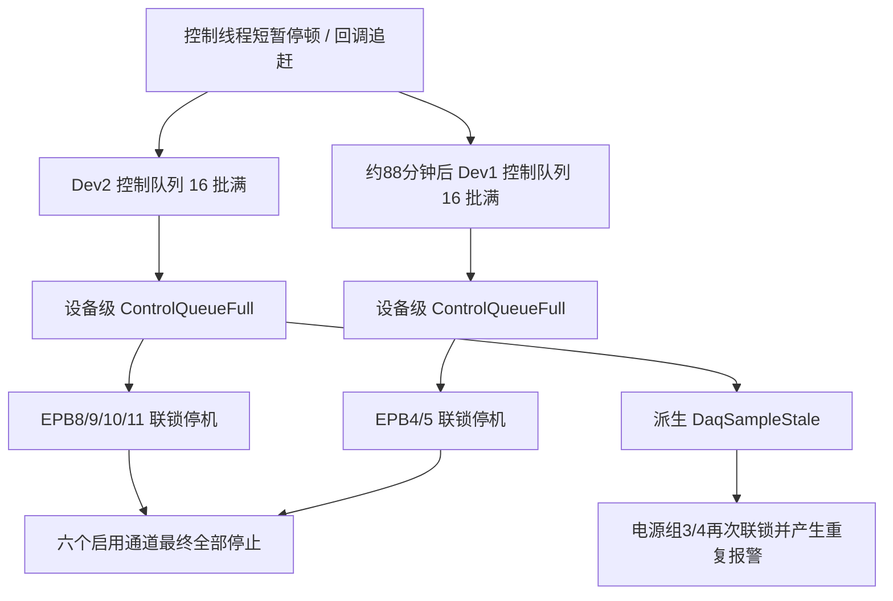

# 10358-029（2）最新版本全部报警停机原因与落地方案

## 1. 结论

分析对象：`\\wj-epb\EPB_Data\10358-029 (2)`，重点分析北京时间 `2026-08-04 23:51` 启动后至 `2026-08-05 01:56` 的最新一轮运行。

本轮“六个 EPB 最后全部报警停机”不是六只卡钳同时发生机械、电气或液压故障，而是两次 **DAQ 设备级控制数据链故障** 先后覆盖了全部六个启用通道：

1. `2026-08-05 00:28:20`，Dev2 的 16 批实时控制队列打满，触发 `ControlQueueFull`，设备级联锁停掉 EPB8、9、10、11。
2. `2026-08-05 01:56:05`，Dev1 的同一控制队列打满，触发 `ControlQueueFull`，设备级联锁停掉 EPB4、5。
3. Dev2 事故中又派生出一次 `DaqSampleStale>100ms`，并使用了新的关联号，进一步触发电源组 3、4 联锁。因此现场/UI 看起来像多只卡钳分别报警，实际是同一个 Dev2 控制链事故被重复升级和扇出。
4. `01:56` 后六个通道均已退出运行；`06:41:56` 是主窗体关闭时的 `ApplicationClosing` 全部停止请求，不是第三次运行报警。

**直接触发原因已经确定：`ControlQueueFull`。** 代码中的控制队列容量固定为 16 批；当前配置为 2 kHz、20 点/批，即正常每批约 10 ms。16 批仅相当于约 160 ms 的控制数据缓冲。一旦控制消费线程因 GC、调度或同步处理停顿约百毫秒，DAQ 回调恢复后会突发补交批次，队列很容易达到硬容量并立即锁存整台设备。

**高置信度的软件根因是控制热路径持续高分配、长寿命诊断对象过多，加上控制消费者运行在线程池且会同步执行状态计算、诊断发布、日志和断电副作用，导致短暂停顿击穿浅队列。** 最新快照显示，故障附近 19.125 秒内发生 Gen0/Gen1/Gen2 GC 分别 `176/106/36` 次，其中 Gen2 达 `1.88 次/秒`，远高于长时间实时控制程序可接受水平。线程池仍有至少 2039 个工作线程可用，故不是线程池数量耗尽。

2.9.0 的最新修复主要解耦了工程处理、写盘和 SQLite 持久化。本次故障前，后台处理队列年龄 P99 仅 `3.490 ms`、最大 `5.180 ms`，持久化等待 P99 `0.478 ms`、最大 `6.099 ms`，说明该修复方向有效，但 **没有解决独立的实时控制队列及其 GC/热路径分配问题**。

不要通过单纯增大队列、放宽 `100 ms` 新鲜度阈值、关闭报警或自动复位来“解决”。这些做法会允许系统继续使用过期控制数据，可能在电机带电时延迟过流和断电判断。

## 2. 结论可信度

| 结论 | 可信度 | 依据 |
|---|---|---|
| 六路不是六个独立硬件故障 | 高 | 两个设备级故障的 `Affected` 集合正好覆盖 4 路和 2 路；各通道故障前多圈正常完成 |
| 直接触发条件为 `ControlQueueFull` | 高 | `error.log`、报警元数据和源码入队逻辑一致 |
| 2.9.0 的持久化/后台处理链不是本次直接瓶颈 | 高 | 故障前 15 秒后台处理和持久化 P99/最大耗时均远低于 10 ms 批周期，后台队列深度最大仅 2 |
| 控制消费者经历了百毫秒级失去服务/积压 | 高 | 16 批控制队列已满；Dev2 随后记录样本年龄 `106.2/107.1 ms`；回调存在追赶式突发 |
| 高频分配与全代 GC 是控制线程停顿的主要软件来源 | 中高 | 故障附近 Gen2 `1.88 次/秒`；代码存在多个每批、每通道、每决策分配与 60 秒对象保留点 |
| 某一次队列满完全由某个具体 Gen2 暂停造成 | 中 | 当前只记录 GC 次数，没有记录每次 GC 的开始、结束和暂停时长；需要 ETW/PerfView 复核 |
| DAQ 采集卡本身完全断流或六只卡钳同时损坏 | 低/已排除为主因 | 回调和原始数据仍持续，故障码不是 DAQmx 硬件异常、过流或液压低压；恢复能很快收到新鲜回调 |

## 3. 最新一轮事件时间线

最新运行的 RunId 为 `5758ac08555e42e7be7de894d669252a`。日志没有保存可执行文件哈希或 Git commit，无法仅凭现场数据绝对证明二进制版本；但程序启动时间晚于仓库 `2.9.0` 发布提交，且日志包含 2.9.0 新增的持久化状态和控制队列逻辑。

| 北京时间 | 事件 | 判断 |
|---|---|---|
| 08-04 23:51:20 | 程序启动 AI：Dev1 7 路、Dev2 8 路，`Fs=2000 Hz`、`N=20` | 每设备约 100 批/秒 |
| 08-04 23:51:27 | 创建最新运行，六路正式运行 | RunId=`5758...252a` |
| 08-05 00:28:17～20 | EPB8/9/10/11 正向阶段运行 | 故障前电流控制仍在执行 |
| 00:28:20.257 | `Device=Dev2 ... DAQ后台有界队列已满` | 首发直接故障为 `ControlQueueFull` |
| 00:28:20.268 | Dev2 设备级硬故障锁存 | `TriggerEPB=8 Affected=[8,9,10,11]` |
| 00:28:20.271～274 | 电源组 4、3 因无法确认断电电流触发联锁 | 故障时输出仍开，执行失效安全停电是正确行为 |
| 00:28:20.276 | 又锁存 `DaqSampleStale>100ms` | 使用了不同关联号，是同一事故的派生/重复报警 |
| 00:28:20.613 | Dev2 连续取得 10/10 新鲜回调，274 ms 内恢复 | 采集恢复，但报警锁存不自动上电，符合安全策略 |
| 00:28 之后 | EPB4、5 继续运行，EPB8～11保持停机 | 说明不是全进程同时崩溃，也不是两张卡同时断流 |
| 01:56:05.855 | `Device=Dev1 ... DAQ后台有界队列已满` | 第二次首发故障仍为 `ControlQueueFull` |
| 01:56:05.857 | Dev1 设备级硬故障锁存 | `TriggerEPB=4 Affected=[4,5]` |
| 01:56:05.859～873 | EPB4、5 Timer/Runner 停止并发送高优先级全关 | 正确的设备级安全停机 |
| 01:56:05.989 | 电源组 2 关闭 | 六个启用通道至此全部停止 |
| 06:41:56 | 主窗体关闭，执行 `StopAll Source=ApplicationClosing` | 不是运行中第三次报警 |

## 4. “全部报警”的真实含义



最后一圈数据库状态进一步证明了设备级扇出：

| 通道 | 最后一圈开始 | 最后一圈状态 | 解释 |
|---|---|---|---|
| EPB8 | 00:28:17.276 | `failed` | Dev2 设备故障关联停止 |
| EPB9 | 00:28:18.079 | `failed` | Dev2 设备故障/电源组联锁 |
| EPB10 | 00:28:17.276 | `failed` | Dev2 设备故障关联停止 |
| EPB11 | 00:28:18.079 | `failed` | 派生 `DaqSampleStale` 首先被本通道看门狗命中 |
| EPB4 | 01:56:02.199 | `alarm` | Dev1 设备故障的主报警通道 |
| EPB5 | 01:56:02.998 | `failed` | Dev1 同设备关联停止 |

因此，UI 上应表达为两个事故：

- Dev2 控制采集链故障：1 个主报警，EPB8/9/10/11 为同关联号的设备联锁停机；
- Dev1 控制采集链故障：1 个主报警，EPB4/5 为同关联号的设备联锁停机。

当前显示成多只卡钳分别报警，是事故去重和故障归属表达仍有缺陷，不代表各卡钳都坏了。

## 5. 为什么最新版本仍会报警

### 5.1 2.9.0 修的是后台/写盘队列，不是控制队列

当前数据链实际有三层：

1. DAQ 回调和快速工程值换算；
2. 实时控制队列 `_controlQueueDev1/_controlQueueDev2`，固定容量 16；
3. 工程处理、写盘和 SQLite 持久化队列。

2.9.0 增加 `DaqPersistenceCoordinator`，重点解决第 3 层的同步写盘、SQLite 和恢复问题。`ControlQueueFull` 明确被保留为“立即锁存、不自动恢复”的故障。换言之，最新版本使写盘链更健康，但第 2 层仍保留了较浅的 16 批队列、线程池消费者和高分配控制热路径。

### 5.2 故障前后台处理与持久化是健康的

从 EPB4 报警快照 `daq_timing.csv` 取故障前 15 秒，共有 1501 个 Dev1 回调批次：

| 指标 | 结果 |
|---|---:|
| DAQ 回调平均批间隔 | 9.999 ms |
| 后台处理队列年龄 P99 / 最大 | 3.490 / 5.180 ms |
| 单批后台处理耗时 P99 / 最大 | 4.411 / 5.919 ms |
| 持久化等待 P99 / 最大 | 0.478 / 6.099 ms |
| 后台处理队列观测最大深度 | 2 |

这些数值均未接近后台处理队列 64 批或持久化队列 256 批的硬容量。故障码也明确是 `ControlQueueFull`，不是 `BackgroundQueueFull` 或 `DaqPersistenceLag`。

### 5.3 控制队列只有约 160 ms 缓冲，而且消费者不是专用实时线程

源码现状：

- `IO.NI/TwoDeviceAiAcquirer.cs:250-261`：每台设备一个控制队列，容量常量为 16；
- `IO.NI/TwoDeviceAiAcquirer.cs:782-785`：控制消费者通过 `Task.Run` 在线程池执行；
- `IO.NI/TwoDeviceAiAcquirer.cs:1711-1744`：消费者逐批同步调用 `OnFastEpbCurrent`；
- `IO.NI/TwoDeviceAiAcquirer.cs:2385-2397`：达到 16 批立即发布 `ControlQueueFull`；
- `Controller/EpbManager.cs:610-617`：订阅者同步进入 Runner 的 `FeedCurrentSample`；
- `Controller/EpbCycleRunner.Adaptive.cs:251-306`：样本处理继续执行峰值窥视、状态机、诊断发布和安全动作。

回调统计还显示明显的追赶式节拍：回调间隔中位数约 `15.385 ms`，但平均仍是 `9.999 ms`；部分相邻回调间隔低于 `0.2 ms`。这表示 Windows/驱动会将已经缓冲的批次成组交付。稳态平均吞吐足够并不能保证 16 批浅队列在短暂停顿后不被突发流量打满。

### 5.4 控制热路径存在可确认的分配风暴

故障附近 `daq_runtime.csv` 的进程级统计：

| 19.125 秒窗口 | 次数 | 每秒 |
|---|---:|---:|
| Gen0 GC | 176 | 9.20 |
| Gen1 GC | 106 | 5.54 |
| Gen2 GC | 36 | 1.88 |
| 托管内存范围 | 45.4～99.5 MB | — |
| 最低可用工作线程 | 2039 | — |

Gen2 接近每秒 2 次是明显异常。控制热路径可见的主要分配点包括：

1. `TwoDeviceAiAcquirer` 每个 DAQ 批次创建 `List<FastControlSample>`、`ToArray()`、`FastControlBatch`；每个通道的尾部中值还创建小数组。
2. `TryLogDaqCallbackTiming` 即使配置为 `anomaly`，仍对每个回调创建并保存一个 `DaqTimingRecord`，且为 `Detail` 构造字符串；后台处理、持久化又各建一条记录。两台设备合计约 600 条诊断对象/秒。
3. `EpbAdaptiveCurrentStateMachine` 的窗口统计在样本热路径中反复使用 `Where/Select/OrderBy/ToArray`，一次判断可能创建多组数组。
4. `PublishAdaptiveTrace` 对每个控制样本创建 `AdaptiveDecisionTraceEvent`；`AdaptiveDecisionTraceBuffer.Append` 又 `Clone()` 一次，并将对象保留 60 秒，最大 72,000 条。
5. 每个样本还创建一个 `EpbAdaptiveDecision` 引用对象；高频对象和 60 秒保留对象共同促进对象晋升到 Gen1/Gen2。

这组代码结构与现场 GC 统计完全一致。GC 是进程级停顿，专用线程也会被停；GC/调度恢复后 DAQ 回调追赶缓冲数据，而控制消费者需要同时处理积压决策，16 批容量最终被击穿。

### 5.5 当前新鲜度语义还有一个设计缺口

`MarkValidSampleCommitted` 当前在“控制批成功入队”后更新，而不是在“控制批完成消费并送入状态机”后更新。这会把“数据已经排队”等价成“控制已经处理到该数据”。当控制消费者卡住但队列尚未满时，设备新鲜度仍可能显示正常；只有队列满、后续入队失败后，新鲜度才开始明显变旧。

应拆成三个独立时间：

- `LastDaqCallbackTick`：硬件/驱动是否仍在交付；
- `LastControlEnqueueTick`：回调到控制队列是否成功；
- `LastControlProcessedTick` 和 `ProcessedSampleUtc`：控制状态机真正处理到了哪里。

安全判定必须使用第三个时间和最老待处理批次年龄，不能仅用入队时刻。

### 5.6 诊断数据本身存在缺口

1. `PublishQueueFullFault` 无论哪种队列满，都将诊断 `QueueDepth` 写成 `_processingQueueCapacity`（当前为 64）。因此 EPB4 快照中的 HardFault 行显示 64，并不代表控制队列容量是 64；真实控制容量仍是 16。
2. 当前没有记录控制队列实时深度、最老批次年龄、控制单批耗时和最长订阅者耗时，无法把某一次暂停精确定位到 GC、状态机、日志、DO 或 OS 调度。
3. Dev2 在 00:28 的报警快照未完整生成；`warning.log` 明确记录 EPB8/9/10/11 快照不完整，且没有对应的 `IncidentSnapshots` 目录。这使第一次事故缺少与 Dev1 同等粒度的 GC/控制队列证据。
4. 日志没有记录产品版本、程序集哈希和 Git commit，现场数据无法独立证明运行二进制。

这些缺口不影响“直接故障为控制队列满”的结论，但影响对单次暂停来源的最终归责。

## 6. 可落地整改方案

### 6.1 P0：先改控制热路径，再进行下一次六路长跑

#### A. 将控制消费者改为专用、预分配、可观测的数据通道

修改 `IO.NI/TwoDeviceAiAcquirer.cs`：

1. 每台设备使用一个预分配的 SPSC 环形缓冲，槽位内直接存固定结构，不再每批 `new List`、`ToArray`、`new FastControlBatch`。
2. 每台设备使用专用后台线程，设置明确名称和 `ThreadPriority.AboveNormal`，不要依赖线程池异步续体。
3. 每次唤醒后连续 drain 队列，直到为空，减少 Semaphore/调度开销。
4. 环形容量可以设为 64 批用于保留追赶证据，但**安全停机不以“64 批满”为第一条件**：
   - 任一受影响通道带电时，最老未处理控制批年龄达到 50 ms 先发内部预警；
   - 达到 80～100 ms 立即执行失效安全停机；
   - 全部通道断电时允许丢弃旧控制批并从最新批重新同步，避免无负载状态因历史积压报警。
5. 每秒及异常时记录真实的 `ControlQueueDepth`、`OldestControlBatchAgeMs`、`ControlBatchProcessMs`、`SubscriberMaxMs`、`ProcessedSampleUtc`。
6. Stop/Start/Recovery 时按 generation 原子清空对应控制环和计数，旧代次数据不得占用新代次容量。

这样做的目的不是“把报警推迟到 64 批”，而是消除正常运行时的调度脆弱性，并在控制真正落后 100 ms 前按数据年龄执行安全动作。

#### B. 把安全动作放到分配和日志之前

当前 `PublishQueueFullFault` 先追加诊断，再写日志，再同步触发设备故障事件。EPB4 快照的 HardFault 时间为 `01:56:05.724`，而 `error.log` 真正写出首条故障为 `01:56:05.855`，中间约 131 ms。无论这段差值来自线程暂停还是诊断执行，安全顺序都不应让诊断先于执行器。

调整顺序：

1. 原子锁存故障；
2. 直接进入无分配的高优先级关断路径，关闭相关 EPB 输出/必要时关闭电源组；
3. 记录最小固定结构的事故时间戳；
4. 再在非实时线程完成日志、UI、快照和数据库封圈。

正常 DO 命令可以保留同步确认，但日志、UI、快照、`FlushPersistentLog` 和对象图构造禁止在控制消费线程或 DAQ 回调线程执行。若 DO 命令本身超过 20～50 ms，应由独立安全监督器直接升级电源组联锁。

#### C. 消除每样本/每批分配

修改以下位置：

- `IO.NI/TwoDeviceAiAcquirer.cs`
  - 尾部中值改为固定小缓冲/手写 5～9 点选择，不再每通道 `new double[]`；
  - 控制批改为预分配结构环；
  - DAQ 诊断改为固定结构循环缓冲和 1 秒聚合，不再每批构造对象和字符串。
- `Controller/Adaptive/EpbAdaptiveControl.cs`
  - 用固定环形窗口替代 `Queue + LINQ + ToArray + OrderBy`；
  - 中位数/MAD 使用 Runner 私有可复用 scratch buffer；
  - 线性斜率在一次循环内计算，不创建 `samples[]` 和 `times[]`；
  - 将无动作决策改为值类型或复用状态，避免每样本 `new EpbAdaptiveDecision`。
- `Controller/EpbCycleRunner.Adaptive.cs` 与 `Controller/Adaptive/AdaptiveDecisionTrace.cs`
  - 状态变化、软预警、断电、硬故障保持全量记录；
  - 普通无动作样本降采样到 20～50 Hz，原始 2 kHz 数据继续由 DAQ 文件保存；
  - 用预分配结构环保存最近 60 秒，不再 `new event + Clone()` 两次；
  - 报警导出时才复制需要的时间窗。

目标是六路运行稳态控制热路径接近零分配，并使 Gen2 GC 从当前 `1.88 次/秒` 降到至少每分钟少于 1 次；最终以 ETW 测得的暂停时长为准。

### 6.2 P0：统一设备事故，避免一个故障显示为多只卡钳分别报警

修改 `Controller/EpbManager.cs`：

1. 为每台设备维护 `DaqIncidentLatch`，包含 `Generation`、`PrimaryCode`、`CorrelationId`、`FirstSeenUtc` 和 `AffectedChannels`。
2. `ControlQueueFull`、`DaqSampleStale`、断电电流不可确认、电源组联锁若属于同设备、同 generation、同一锁存窗口，必须复用同一个关联号。
3. 故障优先级建议：`ControlQueueFull/CallbackStale` 为根故障；`DaqSampleStale`、`OffCurrentUnverifiableDaqStale` 为派生安全动作，只追加到同一事故，不再次创建主报警。
4. 每个事故只选择一个主报警通道；其余通道状态显示“设备级联锁停机”，不得显示为各自独立机械故障。
5. 报警蜂鸣器和报警快照只触发一次；所有受影响通道仍必须立即安全断电。

### 6.3 P0：修复诊断真实性和事故快照

1. `PublishQueueFullFault` 必须写真实的队列类型、容量、实际深度、最老年龄和最近成功消费时刻；禁止再把控制队列满记录成 `QueueDepth=64`。
2. `ControlQueueFull` 必须生成 `IncidentSnapshots`，即使正常圈文件尚未封口，也至少保存：
   - 事故 JSON；
   - 前后 30～60 秒控制队列指标；
   - GC 暂停/分配率；
   - 回调、处理、控制消费和 DO 时序；
   - 当前运行通道、带电状态、主报警和派生动作。
3. 快照失败不能静默；应生成最小 `snapshot-failure.json`，写明失败阶段和异常。
4. 启动日志和快照写入产品版本、程序集文件哈希、Git commit、配置哈希和进程位数。

### 6.4 P1：增加 GC 与线程暂停的最终证据

在下一版现场验证中启用 ETW/PerfView 或等效进程内 EventListener，至少记录：

- 每次 GC 的 generation、原因、开始/结束和 pause duration；
- Allocation rate、LOH size、promoted bytes；
- 控制线程运行/等待时间和最长连续未运行时长；
- DAQ 回调追赶批数；
- DO 调用耗时；
- 控制订阅者单次最大耗时。

有这些数据后，可以把“高频 GC 是主要来源”从中高置信度提升为逐次事故的直接证据，并继续处理剩余的 OS/驱动抖动。

### 6.5 P1：硬实时安全边界下沉

Windows + .NET Framework 只能提供软实时控制，无法保证永远没有 100 ms 级进程暂停。若 100 ms 内必须无条件断电，应将最终过流/持续通电保护下沉到独立硬件、PLC、继电器或程控电源保护，而不是只依赖托管进程：

- 软件继续负责自适应目标、诊断和正常断电；
- 独立硬件监督最大电流、最大通电时间和控制心跳；
- 软件心跳超时或电流越界时直接切断对应电源组；
- 软件恢复不得自动解除硬件安全锁存，必须经过受控确认。

## 7. 临时运行策略

在 P0 修复完成前，不建议继续无人值守六路长跑。可用于短时验证的措施只有：

1. 每轮运行前重启应用，减少长寿命对象和累计 GC 压力；
2. 先按设备分组验证：Dev1 两路、Dev2 四路分别运行，降低控制与诊断对象产生率；
3. 每 10 秒监控控制队列真实深度和 GC 次数；当前版本没有该指标，需先做最小诊断补丁；
4. 保留 `ControlQueueFull`、`DaqSampleStale` 和设备级停机，不允许关闭或自动复位；
5. 操作员确认电源输出、继电器和液压安全后才允许重新启动。

这些措施只能降低复现概率，不能作为最终验收方案。

明确禁止：

- 只把 `ControlQueueCapacity` 从 16 改成 64/128；
- 把 `DaqSampleStale` 从 100 ms 放宽到 500 ms 或更长；
- 队列满时静默丢批并继续带电；
- DAQ恢复后自动重新给已报警通道上电；
- 用“六个通道报警”作为更换六只卡钳的依据。

## 8. 实施顺序与工期建议

| 阶段 | 工作内容 | 建议产物 | 完成门槛 |
|---|---|---|---|
| P0-1 | 补真实控制队列/GC指标，修故障快照和版本哈希 | 诊断补丁 | 可在一次事故中看到深度、年龄、消费耗时、GC暂停 |
| P0-2 | 控制队列改为预分配环 + 专用线程 + 年龄保护 | 控制链补丁 | 模拟 100 Hz 双设备突发时无静默丢批，年龄超限能安全停机 |
| P0-3 | 消除状态机、DAQ诊断、决策轨迹热路径分配 | 性能补丁 | 六路稳态 Gen2 少于 1 次/分钟，控制队列 P99 深度不高于 1 |
| P0-4 | 统一设备事故关联号和主/从报警语义 | 报警补丁 | 一次设备故障只有 1 个主报警，其余为同关联号联锁 |
| P1 | ETW、故障注入、硬件安全边界评估 | 验证报告 | 能逐次证明最长暂停来源并覆盖 50/100/500 ms 注入 |

## 9. 验收方案

### 9.1 自动化与故障注入

1. 6 路、2 kHz、20 点/批模拟运行至少 4 小时；禁止用无 GC 压力的简单空循环代替真实状态机、诊断和封圈。
2. 分别注入控制消费者暂停 20、50、80、120、500 ms：
   - 20/50 ms 可追赶，不能丢批或误报警；
   - 80 ms 进入预警并保留完整证据；
   - 达到项目确定的 80～100 ms 带电安全上限时，必须优先断电并只生成一个设备事故；
   - 断电状态下允许清理旧批并恢复，不得自动给报警通道上电。
3. 强制 Gen2 GC、SQLite busy、磁盘延迟、UI线程卡顿、日志写入延迟，验证只有真正影响控制年龄的故障才触发控制停机。
4. 验证 Dev1、Dev2 独立：单设备注入不得停掉另一设备。
5. 验证 generation 切换：旧队列、旧回调、旧快照不得进入新运行。

### 9.2 台架长跑闸门

六路正式运行至少 4 小时且不少于 1000 个完整圈，全部满足：

| 指标 | 验收值 |
|---|---:|
| `ControlQueueFull` | 0 |
| `DaqSampleStale` | 0（未注入时） |
| 控制队列深度 P99 | ≤1 批 |
| 控制队列最大深度 | ≤4 批 |
| 最老控制批年龄 P99 | <20 ms |
| 最老控制批年龄最大 | <50 ms |
| Gen2 GC | <1 次/分钟，且无持续上升趋势 |
| GC pause P99 / 最大 | <20 / 50 ms |
| 后台处理队列年龄 P99 / 最大 | <50 / 100 ms |
| 正式圈静默丢批 | 0 |
| 事故关联正确性 | 1 个根故障 = 1 个关联号 + 1 个主报警 |
| 快照完整率 | 100% 或具有最小失败快照 |

建议分级执行：30 分钟无负载采集 → 2 小时 Dev1/Dev2 分组 → 4 小时六路 → 故障注入 → 现场无人值守准入。

## 10. 需要修改的主要文件

| 文件 | 修改重点 |
|---|---|
| `IO.NI/TwoDeviceAiAcquirer.cs` | 预分配控制环、专用线程、控制消费新鲜度、零分配诊断、真实队列证据、安全动作优先级 |
| `Controller/Adaptive/EpbAdaptiveControl.cs` | 固定窗口、无 LINQ 热路径、复用统计缓冲、减少决策对象 |
| `Controller/EpbCycleRunner.Adaptive.cs` | 控制决策与日志/轨迹解耦，安全动作先行 |
| `Controller/Adaptive/AdaptiveDecisionTrace.cs` | 预分配结构环、普通样本降采样、动作全量记录 |
| `Controller/EpbManager.cs` | 设备事故去重、统一关联号、主报警/联锁状态、快照补偿 |
| `MTTfTest/App.config` | 明确控制队列预警/年龄阈值、诊断模式和版本审计开关 |
| `Tests/AdaptiveControlTests` | 队列突发、年龄保护、generation、事故去重、分配与长跑回归 |

## 11. 最终判断

本次需要修的不是卡钳参数、目标电流或液压阈值，而是 **实时控制数据通道的确定性和内存分配行为**。

2.9.0 已经证明后台处理/持久化解耦有效，但控制队列仍是一个 16 批、线程池消费、热路径高分配的独立薄弱点。只要长跑时间足够，任何一次百毫秒级 GC/调度停顿都可能先打掉 Dev2，再打掉 Dev1，最终表现为“全部报警”。

落地修复必须同时完成四件事：

1. 控制通道预分配和专用执行；
2. 热路径去分配、降低 Gen2 GC；
3. 按“控制实际处理年龄”而不是“成功入队时间”执行安全保护；
4. 一个设备事故只形成一个主报警和一个关联号。

在完成 P0 修复并通过四小时六路长跑与故障注入前，不应恢复无人值守运行。

## 12. 证据来源

- `\\wj-epb\EPB_Data\10358-029 (2)\log\error.log`
- `\\wj-epb\EPB_Data\10358-029 (2)\log\warning.log`
- `\\wj-epb\EPB_Data\10358-029 (2)\log\run.log`
- `\\wj-epb\EPB_Data\10358-029 (2)\log\run.20260804.001.log`
- `\\wj-epb\EPB_Data\10358-029 (2)\log\ui-info.log`
- `\\wj-epb\EPB_Data\10358-029 (2)\index.db`
- `\\wj-epb\EPB_Data\10358-029 (2)\AlarmSnapshots\20260805_015606-EPB04\alarm-metadata.json`
- `\\wj-epb\EPB_Data\10358-029 (2)\AlarmSnapshots\20260805_015606-EPB04\daq_timing.csv`
- `\\wj-epb\EPB_Data\10358-029 (2)\AlarmSnapshots\20260805_015606-EPB04\daq_runtime.csv`
- 当前仓库 `2.9.0` 代码，发布提交 `78b3328`；控制队列主要逻辑由 `a80aeb7` 引入

## 13. V2.10.0 实施结果（2026-08-05）

### 13.1 实施结论

本文件提出的 P0 软件整改已落实到代码，产品版本已升级为 `V2.10.0`，程序集版本和文件版本均为 `2.10.0.0`。现有控制算法、安全阈值、DAQ 采样配置、`OnFastEpbCurrent` 接口、数据库结构和项目 XML 均未放宽或迁移。

本次修复不是单纯把控制队列从 16 批扩到 64 批。新的安全边界为：

- 最老控制批达到 `50 ms`：生成限频内部预警并保留诊断证据；
- 带电状态达到 `100 ms`：锁存一次 `ControlLatencyExceeded`，同步执行设备级高优先级断电；
- 真实达到 64 批：锁存一次 `ControlQueueFull`，不得覆盖或静默丢批；
- 设备完全断电时积压：丢弃历史批，只保留最新批重新同步，不发布主报警，也不自动上电。

因此，V2.10.0 同时降低了控制链发生百毫秒积压的概率，并保留了积压真正超过安全边界时的失效安全停机。

### 13.2 已完成的代码整改

| 范围 | 实际完成内容 | 状态 |
|---|---|---|
| 实时控制通道 | Dev1/Dev2 各自使用容量 64 的预分配 SPSC 控制环；槽位预分配；消费者改为命名 `AboveNormal` 后台线程并持续 drain 到空 | 已完成 |
| 回调热路径 | 尾部代表值使用最大 9 点栈缓冲和插入排序；移除控制批 `List`、`ToArray` 和逐批对象 | 已完成 |
| 控制新鲜度 | 分离 Callback、Enqueue、Processed 三组单调时钟和年龄；安全判断使用 Processed；旧字段映射到 Processed 保持兼容 | 已完成 |
| 年龄保护 | 50 ms 预警、100 ms 带电硬停、断电积压重同步、64 批真实满环硬故障 | 已完成 |
| generation | Start、Stop、Recovery、显式新运行均清理控制环和故障锁存；控制线程拒绝旧 generation 批次 | 已完成 |
| 带电状态 | DO 成功 Forward/Reverse 后原子置位，Off/OffHighPriority 成功后清位；断电失败保持带电；状态读取异常按带电处理 | 已完成 |
| 安全顺序 | DAQ 故障按“原子锁存 → 同步安全处理 → 诊断入环 → 后台事故归并/日志/UI/快照”执行；设备故障先取消并逐路高优先级断电 | 已完成 |
| 自适应状态机 | 350 ms 样本窗口改为固定 1024 环；中位数、MAD、分位数复用缓冲；斜率单循环计算；删除热路径 LINQ/`ToArray` | 已完成 |
| 决策与峰值 | Runner 复用无动作决策，仅动作交付时复制兼容对象；新增无分配 `TryPeekEpbCurrentPeak` | 已完成 |
| 工程处理滤波 | 工程值改为原地换算；因果中值滤波改为预分配工作区并原地处理，去掉每批两份二维大数组 | 已完成 |
| 自适应轨迹 | 普通样本 25 Hz，状态变化/预警/断电/硬故障全量；每通道 60 秒预分配结构环，导出时才创建兼容对象和 CSV | 已完成 |
| DAQ 诊断 | Callback、Processing、Persistence、Control 写入预分配结构诊断环；持久化使用值参数回调；CSV 在旧列后追加控制指标 | 已完成 |
| 设备事故 | 新增按运行和设备锁存的 `DaqIncidentLatch`；同一事故复用关联号，只发布一次主报警、蜂鸣和主快照；高优先级后续证据仅更新元数据 | 已完成 |
| 事故快照 | 无活动圈也创建 `IncidentSnapshots`；包含 `incident.json`、`daq_timing.csv`、`daq_runtime.csv`、`build-identity.json`；失败时多路径写 `snapshot-failure.json` | 已完成 |
| 发布配置 | 固定 `64/50/100/25` 四项默认配置；非法值安全回退；Release 构建会清理陈旧中间 config，防止新参数从最终 EXE.config 丢失 | 已完成 |

新增或重点修改的实现文件包括：

- `IO.NI/ControlBatchRing.cs`
- `IO.NI/DaqDiagnosticRing.cs`
- `IO.NI/TwoDeviceAiAcquirer.cs`
- `DataOperation/ClsDataFilter.cs`
- `Controller/Adaptive/EpbAdaptiveControl.cs`
- `Controller/Adaptive/AdaptiveDecisionTrace.cs`
- `Controller/EpbCycleRunner.Adaptive.cs`
- `Controller/DaqIncidentLatch.cs`
- `Controller/RuntimeBuildIdentity.cs`
- `Controller/EpbManager.cs`
- `Controller/EpbManager.WarningSnapshots.cs`
- `Controller/DoControlTrace.cs`
- `MTTfTest/App.config`
- `MTTfTest/Properties/AssemblyInfo.cs`
- `Tests/AdaptiveControlTests/DaqRealtimeControlTests.cs`

### 13.3 接口和诊断结果

已新增并保持兼容的接口/证据：

- `DaqControlSnapshot` 为只读快照，提供设备、真实队列类型、generation、容量、深度、最老年龄、最近处理耗时、订阅者最大耗时和已处理样本时间；
- `GetControlSnapshot(device)`、控制活动状态注册和新运行安全锁存复位接口；
- `DaqFreshnessSnapshot` 新增 Callback/Enqueue/Processed 时间与年龄，旧 `LastArrivalMonotonicTicks` 映射到 Processed；
- `DaqDeviceFault` 保留原属性并增加 `QueueKind`、`QueueType`、真实容量/深度/年龄、最近处理样本时间和 generation；
- `daq_timing.csv` 保留原前置列顺序，在末尾追加 `ControlQueueCapacity`、`SubscriberMaxMs`、`ProcessedSampleUtc`、`DriftMs`；
- `OnFastEpbCurrent` 签名未改变。

最终 Release 配置已确认包含：

```xml
<add key="DaqControlQueueCapacity" value="64" />
<add key="DaqControlWarningAgeMs" value="50" />
<add key="DaqControlHardFaultAgeMs" value="100" />
<add key="AdaptiveTraceNormalRateHz" value="25" />
```

### 13.4 自动测试和构建结果

原有 `134/134` 测试全部保留，并增加 10 项实时控制专项回归，最终结果为：

| 验证项 | 结果 |
|---|---|
| `AdaptiveControlTests` Debug 构建与完整测试 | 通过，`144/144` |
| `AdaptiveControlTests` Release 构建与完整测试 | 通过，`144/144` |
| 主程序 Debug 构建 | 通过 |
| 主程序 Release 构建 | 通过 |
| 控制环 FIFO、64 批容量、并发可见性、generation、双设备隔离 | 通过 |
| 20/50/80/120/500 ms 带电和断电策略 | 通过 |
| 同设备事故关联、优先级升级、单快照、新运行复位、跨设备隔离 | 通过 |
| 断电先于日志/UI/快照发布 | 通过 |
| 100,000 个稳态自适应样本预热后无持续托管分配 | 通过 |
| 因果中值滤波跨批结果和原地热循环分配 | 通过 |
| 普通轨迹不超过 25 Hz、动作轨迹不丢失 | 通过 |
| 控制诊断容量真实记录为 64 | 通过 |
| 版本、哈希、进程位数和 Git 状态字段 | 通过 |

构建中仍存在仓库原有的 NI DAQmx 架构提示、UI 类型重复定义和未使用字段等警告，但没有新增编译错误，Debug/Release 产物均成功生成。本次未扩大范围清理这些与事故整改无直接关系的历史警告。

### 13.5 发布身份

最终 Release 产物：`MTTfTest/bin/Release/MTTFTest.exe`。

| 项目 | 值 |
|---|---|
| 产品版本 | `2.10.0`（窗口显示 `V2.10.0`） |
| 程序集版本 | `2.10.0.0` |
| 文件版本 | `2.10.0.0` |
| EXE SHA-256 | `be7a7117431b28a02aef872686b57233750833aa6d5ae3039ee7f020ea5bb8c3` |
| EXE.config SHA-256 | `334dcf9303247edfd06f5a1bf53bf37383db65e999e005c2d97d3aba73221783` |
| 当前 Git 基线 | `78b332891dca7adec0c8f5b471bbf446329dc8e7` |
| 工作树状态 | `dirty`（本次 V2.10.0 改动尚未提交） |

运行时 `build-identity.json` 会重新计算实际部署 EXE/EXE.config 哈希，并记录进程位数、Git commit 和 dirty 状态；无法取得 Git 信息时明确写入 `unknown`，不阻止运行或快照。

### 13.6 尚未完成的现场准入项

自动测试通过不等同于无人值守准入。以下项目需要在实际 NI DAQ、DO、电源、液压和六路负载环境继续执行，本次本地代码工作无法代替：

1. 30 分钟无负载采集；
2. Dev1、Dev2 分组各 2 小时；
3. 六路至少 4 小时且不少于 1000 圈；
4. 在真实运行链注入强制 Gen2 GC、磁盘延迟、SQLite busy 和 UI 阻塞；
5. 核验 `ControlQueueFull=0`、未注入时 `DaqSampleStale=0`、深度 P99≤1/最大≤4、最老年龄 P99<20 ms/最大<50 ms、Gen2<1 次/分钟；
6. 人工触发一个设备根故障，确认只有一个关联号、一个主报警、一个蜂鸣和一个主快照，且快照文件完整。

只有上述台架闸门全部通过，V2.10.0 才可恢复六路无人值守长跑。P1 的 ETW 长期采集和独立 PLC/硬件保护不在本次代码版本内，仍按本文件第 6.4、6.5 节保留为后续工作。

## 14. V2.10.1 项目选择跨版本持久化

### 14.1 问题与处理结果

原项目选择依赖程序安装目录内的默认配置。软件更新时 EXE.config 会随版本一起更新，因此用户每次升级后可能重新落到默认项目。V2.10.1 将“最后一次成功打开的项目”从程序级配置中分离，保存到：

`%LocalAppData%\Wanxiang\EPBTest\user-state.json`

该文件只记录项目根目录所需的 `StoreDir`、`TestName`、格式版本和保存时间，不复制控制参数、安全阈值或项目 XML。软件升级覆盖 EXE 和 EXE.config 时不会覆盖此文件，因此不会把旧项目控制配置带入新程序，也不会让项目选择受到程序级安全配置更新影响。

### 14.2 恢复与回退规则

1. 启动时优先读取用户状态，并验证目标项目的 `Config\TestConfig.xml` 可用后才加载；
2. 用户成功新建、切换或保存项目后，原子更新用户状态；
3. 已记录项目临时离线、被移动或配置损坏时，程序明确提示并回退默认项目，但保留原选择，不因一次磁盘不可用而覆盖；
4. 首次安装且尚无用户状态时，使用 `InitialProjectPath=D:\EPB_Data\10358-029` 引导；只有该项目在实际电脑上成功验证并加载后，才写入用户状态；
5. 后续即使新版 EXE.config 仍带默认项目，已有的有效用户状态始终优先。

当前开发环境中 `D:\EPB_Data\10358-029` 不存在，因此本次未在开发机 LocalAppData 中写入伪造状态。实际运行电脑存在该路径时，首次启动会自动完成引导和持久化。

### 14.3 验证与发布身份

| 项目 | 结果 |
|---|---|
| 主程序 Debug / Release 构建 | 通过 |
| AdaptiveControlTests Debug | `145/145` 通过 |
| AdaptiveControlTests Release | `145/145` 通过 |
| 项目恢复、项目缺失保留状态、首次引导测试 | 通过 |
| 产品版本 | `2.10.1`（窗口显示 `V2.10.1`） |
| 程序集/文件版本 | `2.10.1.0` |
| Release EXE SHA-256 | `EA10A4DE68EC58C1008DD90C92481E9D060835792060A4B7E55579CC4B0C6034` |
| Release EXE.config SHA-256 | `DE94A3D8CB67DA6B5E046B72D644798D576A5613E20236D0419897F260C8641F` |

NI DAQmx 的 MSIL/x86 架构提示仍为既有构建警告；本次功能没有新增编译错误。V2.10.1 仅增加项目选择持久化，不改变 V2.10.0 的控制算法、安全阈值、DAQ 配置和现场准入条件。

## 15. V2.10.1 09:08 备份“启动后全部报警”专项复盘

### 15.1 复盘范围与结论

本节针对现场最新备份独立复盘，与第 1～13 节中旧备份的 `ControlQueueFull` 事故不是同一次故障。

| 项目 | 内容 |
|---|---|
| 备份路径 | `\\wj-epb\EPB_Data\10358-029_V2.10.1_0908` |
| 软件版本 | V2.10.1 |
| 第一次运行 | `eabc1f5230e44a1c9de01e544207db37`，约 09:01 |
| 第二次运行 | `c2f9eea6272f45d3bedacbbee8ca18f0`，约 09:02 |
| 实际加载项目 | `D:\EPB_Data\10358-029` |
| 启用通道 | EPB4、EPB5、EPB8、EPB9、EPB10、EPB11 |
| 控制模式 | `AdaptiveCurrent`，目标 15 A，硬过流判定线 18 A |

**结论：V2.10.1 本次停机是快速控制数据链路误报，不是六路负载同时真实过流，也不是旧版控制队列积压复发。**

快速链路在启动定位和学习阶段产生 27～96 A 的不可信电流值；同一时段落盘的 2 kHz 全速率数据和电源输出电流均未出现相同幅值。与此同时，DAQ 合成样本时间比实际回调时间领先约 0.50～0.53 秒，而自适应控制把该合成时间换算成 `Stopwatch` 时间参与状态判断，导致 100 ms 浪涌忽略窗口被直接跨过。安全状态机依据这些不可信输入按设计断电、隔离通道；断电动作本身正确，错误发生在控制输入的可信度和故障确认链。

### 15.2 两次运行发生了什么

第一次运行中，EPB9、EPB11先出现 `AbnormalLoadRiseDrop`，随后 EPB5、EPB8、EPB4被判过流，EPB10被判负载上升后异常回落，最终六路全部隔离。

第二次运行的故障更容易定位：

1. 启动定位阶段 EPB9 被判定 95.873 A，EPB11 被判定 87.758 A；
2. 自适应学习阶段 EPB8 被判定 62.333 A，EPB10 被判定 27.426 A；
3. EPB4、EPB5进入 `LoadRise` 后又快速回落，触发 `AbnormalLoadRiseDrop`；
4. 六路均进入安全隔离，批量启动失败。

这不是“程序窗口一打开就报警”。日志显示程序先成功加载项目，随后操作进入启动定位/学习流程，报警发生在输出动作后的快速采样判定阶段。V2.10.1 的项目恢复功能加载了预期的 `D:\EPB_Data\10358-029`，没有证据表明项目路径恢复是本次原因。

### 15.3 快速报警值与独立证据不一致

第二次运行中，可将报警快照里的快速控制值与同一事故目录内的 2 kHz 全速率数据、电源连续遥测直接对照：

| 通道 | 快速链路报警值/现象 | 同事故 2 kHz 全速率最大值 | 同时段电源电流 | 判定 |
|---|---:|---:|---:|---|
| EPB9 | 95.873 A，启动定位过流 | 未记录到同幅值 | 所在电源约 14.09 A | 快速值不可信 |
| EPB11 | 87.758 A，启动定位过流 | 未记录到同幅值 | 所在电源约 15.53 A | 快速值不可信 |
| EPB8 | 62.333 A，学习过流 | 14.780 A | 所在电源最大约 14.284 A | 不是实际 62 A |
| EPB10 | 27.426 A，学习过流 | 15.143 A | 所在电源最大约 17.473 A | 不是实际 27 A |
| EPB4 | 负载上升后回落 | 11.547 A | 所在组电源最大约 18.246 A | 快速波形触发了状态误判 |
| EPB5 | 负载上升后回落 | 11.068 A | 所在组电源最大约 18.246 A | 快速波形触发了状态误判 |

关键原始证据包括：

- `AlarmSnapshots\20260805_090214_660-EPB09-StartupPositioning\startup-current.csv`：快速值在约 45 ms 内由约 13 A依次跳到 40.761、71.107、95.873 A；
- EPB8 的事故全速率文件 `EPB8_Cycle_-000192.csv` 共 15,920 个样本，最大值 14.780 A，超过 18 A 的样本数为 0；
- EPB10 对应全速率文件共 18,240 个样本，最大值 15.143 A，超过 18 A 的样本数为 0；
- `PowerSupplyTelemetry\20260805_090209_c2f9eea6272f45d3bedacbbee8ca18f0.csv` 在 EPB9/EPB11 报警时没有记录到 88～96 A 的电源输出。

95.873 A按当前 10 A/V 的电流变换斜率约等于 9.59 V，已接近模拟输入量程上沿。结合电源遥测和全速率记录，更符合“窄脉冲/采集瞬态进入快速支路，或快速支路并发处理异常”的特征，不符合真实电机持续过流。由于当前快照没有保存 DAQ 回调最后若干点的原始电压，尚不能仅凭备份在“现场电气尖峰”和“软件并发污染”之间做唯一归因；但可以确定报警所使用的 27～96 A 不是可信的实际负载电流。

### 15.4 根因链

#### 根因一：V2.10 快速控制环的 SPSC 前提没有被采集回调保证

`IO.NI\ControlBatchRing.cs` 明确把控制环实现为单生产者/单消费者（SPSC）。但 `IO.NI\TwoDeviceAiAcquirer.cs` 的回调先在约第 1697 行调用 `BeginReadMultiSample` 重新挂起下一次读取，随后才在约第 1769～1812 行执行快速代表值计算、`FastFilter.Update` 和 `EnqueueForControl`。

如果 NI 驱动在上一回调的后处理尚未结束时触发下一回调，同一设备就会同时出现多个生产者：

- 多个回调并发写入只支持单生产者的 `ControlBatchRing`；
- 多个回调并发更新同一个参数的 `FastFilter.State`；
- 快速批次的先后顺序、滤波状态和发布序号不再有代码级保证。

`FastFilter` 虽然用 `ConcurrentDictionary` 查找状态，但状态内部的环形窗、`Count`、`Head`、EWMA 值和 `LastTs` 都是无锁读写，因此类注释中的“线程安全”在同一 key 并发调用时并不成立。

这是从 V2.10 控制队列改为预分配 SPSC 环之后必须满足、但当前代码没有显式满足的并发契约。它是高置信度的软件设计缺陷，也是新版相比旧链路最需要优先整改的回归点。

#### 根因二：合成样本时间领先真实时间约 0.52 秒

两次运行的错误日志持续记录约 `-500～-530 ms` 的样本时间漂移。第二次运行的 `daq_timing.csv` 中，Dev2 在约 21.146 秒内收到 2,116 次回调，平均回调间隔约 9.998 ms，说明吞吐量基本正常；但样本时间漂移平均约 `-519.895 ms`，范围约 `-534.804～-496.739 ms`。这不是控制队列等待 0.52 秒，而是合成的批尾时间跑到了主机到达时间之前约半秒的未来。

`IO.NI\HighResolutionSampleClock.cs` 的 `AdvanceBatchEnd` 保证新批尾不早于“上批尾 + 本批时长”，又允许主机时间只向前纠偏。启动时一旦发生积压批次快速补读，时间轴会按每批 10 ms持续向未来推进，形成约半秒领先且无法自行向后修正。

`Controller\EpbManager.cs` 约第 623～625 行随后把该 `DateTime` 通过 `ToStopwatchTicks` 映射为控制时钟，并传给 `FeedCurrentSample`。因此自适应控制看到的动作后经过时间会被虚增约 500 ms：项目配置中的 100 ms `PeakIgnoreMs` 已经失效，启动浪涌或瞬态可以直接参与 `LoadRise`、掉载和超时判断。

该时间问题主要放大学习阶段的 `AbnormalLoadRiseDrop` 和过流误判。启动定位模块自身用实际 `Stopwatch` 轮询，因此 EPB9/EPB11 的 88～96 A 启动定位误报不能只用时间戳解释，仍应归入快速电流源不可信问题。

#### 根因三：硬故障只依赖快速值，缺少独立可信度确认

`EpbAdaptiveControl` 当前连续 3 个快速样本达到 18 A 即硬故障；进入 `LoadRise` 后峰值下降 2 A且持续 100 ms 即 `AbnormalLoadRiseDrop`。启动定位也只按连续快速轮询值确认过流。

这些规则对真实故障应当快速断电，但当前没有在报警归因时核对：

- 2 kHz 全速率峰值是否同步达到阈值；
- 电源输出或硬件 OCP 是否支持真实过流；
- 快速值是否超出物理变化率、ADC 量程和电源能力；
- 该样本是否来自未来时间或并发次序异常的批次。

所以本次安全链对错误输入做出了正确的“立即断电”响应，却把快速支路异常记录成了真实通道过流/掉载，并将全部通道隔离。

### 15.5 排除项

| 排除项 | 证据 |
|---|---|
| 旧版 `ControlQueueFull` 再次发生 | 本次控制队列深度通常为 0～1，没有 `ControlQueueFull` 事故；持久化队列偶发约 110 ms 延迟不在硬实时控制链 |
| 六路机械/电机同时真实过流 | 2 kHz 全速率数据和电源遥测均不支持 27～96 A；多个独立通道同时失效的概率也与数据不符 |
| V2.10.1 项目恢复加载错误目录 | 日志明确加载 `D:\EPB_Data\10358-029`，控制目标和配置可正常解析 |
| 仅提高 18 A阈值即可解决 | 最大误报达到 95.873 A，简单提高阈值会破坏真实安全边界，且不能解决时间和并发问题 |

### 15.6 落地解决方案

#### P0-1：让每台设备真正只有一个快速控制生产者

推荐保留预分配 SPSC 环，但必须在代码上建立单生产者保证：

1. 每台设备的回调先完成快速代表值计算、滤波和控制环入队，再 re-arm 下一批；或给每台设备增加严格的 producer gate，使 re-arm 后的回调不能与前一批快速处理重叠；
2. 在 Debug、测试和诊断版本中记录生产者线程 ID 与回调重入计数，一旦同设备并发生产立即触发内部不变量报警；
3. 如果 NI 回调模型无法保证串行，则把环改为经过验证的 MPSC 实现，不能继续依赖 SPSC 假设；
4. 批次发布必须包含单调递增的设备序号，消费端验证无重复、无倒序、无跨 generation 混入。

#### P0-2：把有状态快速滤波移到单线程控制消费者

首选方案是 DAQ 回调只打包固定容量的原始/工程代表值，由每台设备唯一的控制消费线程顺序执行 `FastFilter.Update` 和状态机。若暂时不能迁移，至少要给每个状态加锁或按设备串行化，确保同一参数的 `Win`、`Head`、`Count`、`Y`、`LastTs` 不会并发修改。

#### P0-3：控制状态机只使用真实单调时钟

控制批次中直接携带回调到达或入队时的 `Stopwatch.GetTimestamp()`，并把该单调 tick 传给 `FeedCurrentSample`。禁止再把合成的 `DateTime` 通过 `ToStopwatchTicks` 反向映射成控制时钟。

- `DateTime` 继续用于日志、CSV 和样本展示；
- `Stopwatch` tick 专用于浪涌忽略、持续时间、看门狗和超时；
- 同一控制阶段的 tick 必须单调且不得领先实际 `Stopwatch.GetTimestamp()`；
- 启动补读的历史批次可以保留历史样本时间，但不能让它改变当前执行器动作后的真实经过时间。

#### P0-4：修复批次时间轴的“未来时间”不变量

`AdvanceBatchEnd`/`DeviceBatchTimestampCoordinator` 应为启动补读建立正确时间原点或回填历史批次，不能靠不断执行“上一批尾 + 批时长”把数据推到未来。增加强制诊断：

- `ProcessedSampleUtc - CallbackArrivalUtc` 超过一个批次时长即记录异常；
- 超过 20 ms 时不得将该样本时间用于控制；
- `daq_timing.csv` 同时保留 callback、enqueue、processed 和 synthetic sample time，明确区分队列延迟与时间轴偏差。

#### P0-5：断电响应与故障归因分层

真实过流的断电不能为了等待软件二次确认而延迟。建议保持快速硬件/软件断电路径，同时把事故分类分为：

1. **立即保护**：快速值越界立即撤销 DO，必要时由电源 OCP/独立硬件保护承担最终边界；
2. **可信归因**：用原始 ADC 尾部、2 kHz 全速率峰值、电源遥测、量程合理性和时间戳有效性确认“真实过流”还是“采集链异常”；
3. **隔离策略**：输入证据冲突时标记 `FastPathSignalInvalid`，禁止自动继续，但不要把通道永久归类为真实电机过流。

这样既不牺牲保护响应时间，也能避免本次六路被错误诊断为负载故障。

#### P0-6：补齐原始证据

每次快速硬故障前后至少保存：物理通道、批次序号、generation、生产者线程 ID、回调重入计数、最后 20 个原始电压点、尾部中值输入、工程值、`FastFilter` 输出、环写入序号、callback/enqueue 单调 tick、合成样本时间及其相对主机的偏差。没有这些数据时，只能确定快速报警值失真，无法进一步唯一定位是现场窄脉冲、量程饱和、通道映射还是并发污染。

### 15.7 回归测试与现场准入

代码修复后至少增加以下自动测试：

1. 人为重叠触发同设备 DAQ 回调，验证无并发生产、批次严格 FIFO、滤波状态可重复；
2. 向样本 `DateTime` 注入未来 500 ms，验证浪涌窗口和控制 elapsed 仍只由真实单调 tick 决定；
3. 注入单点、两点、三点 ADC 尖峰，验证立即保护、全速率证据保存和最终故障分类符合设计；
4. 连续重复两次“启动定位 + 10 圈学习”，验证 generation、滤波状态和序号不会跨运行残留；
5. 对快速值、2 kHz 全速率峰值和电源遥测建立一致性测试；
6. 为 SPSC 环增加“同一设备只能有一个 producer”的运行时断言和压力测试。

现场恢复最新版前建议执行：

| 阶段 | 验收条件 |
|---|---|
| 无输出采集 30 分钟 | 回调不重入；控制环无倒序/重复；合成样本时间不领先主机超过 20 ms |
| 单设备组 2 小时 | 无 `FastPathSignalInvalid`；快速峰值与全速率峰值差异在经标定的容差内 |
| 六路启动/学习重复测试 | 至少连续 20 次启动成功，无无依据的 18 A以上快速值 |
| 六路长跑 4 小时 | `ControlQueueFull=0`，无样本未来时间，无误隔离，事故证据完整 |

### 15.8 当前临时运行建议

在上述 P0 修复和台架准入完成前，现场继续使用已验证可运行的 V2.9.0 临时版本。不要通过关闭过流保护、取消通道隔离或简单提高 18 A阈值来运行 V2.10.1。当前代码仓库已切回最新开发版本用于定位和后续修复，但“切回最新代码”不代表该版本已经具备现场重新上线条件。

## 16. V2.10.2 算法整改实施结果

### 16.1 实施结论

第 15 节列出的快速控制链路 P0 软件整改已经在当前本地分支完成。整改没有修改 18 A硬过流边界、连续三样本规则、通道隔离和人工复位要求，也没有用放宽阈值规避 09:08 的误报警。快速值越界时仍先执行高优先级断电；最终报警在最多 100 ms 的 2 kHz 证据封口后统一归因为 `ConfirmedOverCurrent`、`FastPathSignalInvalid` 或 `FastPathEvidenceUnavailable`。

本节只确认代码实现、自动测试和本机构建结果。NI DAQ、程控电源、卡钳负载和长时间运行条件无法由本地环境替代，因此 V2.10.2 **尚未获得现场上线准入**；第 16.6 节全部通过前，现场仍应继续使用 V2.9.0。

### 16.2 DAQ 生产、时间轴和滤波整改

1. 每台 DAQ 增加独立 `DaqCallbackProducerGate`。回调完成 `EndRead`、来源批次编号、无状态快速代表值计算和控制环入队后才清门并 re-arm；生产区重入时拒绝该批并发布 `ControlProducerReentry` 设备故障，原因同时归类为 `FastPathSignalInvalid`。
2. `FastFilter` 已从 DAQ 回调迁到 Dev1/Dev2 各自唯一的高优先级控制线程。两台设备使用独立实例，generation 切换或新运行安全复位时清空窗口、EWMA 和单调 tick；稳态排序临时区改为预分配复用。
3. 控制批新增 generation、设备来源序号、回调进入 tick、入环 tick、采样 UTC、回调 UTC、采样领先量、生产者线程 ID、逐通道质量标志和原始尾部 20 点电压。消费端拒绝重复、倒序、带电期间序号缺口、跨 generation 和非递增单调 tick。
4. 状态机不再执行 `DateTime → Stopwatch` 反向换算。浪涌忽略、掉载持续、阈值连续点和看门狗全部使用回调进入时取得的真实 `Stopwatch` tick；`SampleUtc` 只用于落盘和诊断。
5. 每台 DAQ 在 `Task.Start()` 前取得独立 UTC/单调时间原点，采样时间只按累计样本数和采样率推进。新增程序级 `DaqSampleFutureToleranceMs=20`；样本时间领先回调超过 20 ms 时不进入正常控制和周期数据，并以 `DaqSampleTimelineFuture`/`FastPathSignalInvalid` 执行 DAQ 组失效安全停机。
6. 快速质量标志按通道保存，单个通道的非有限值或接近 ADC 量程证据不会污染同设备其他通道的质量结论。无效控制质量在带电状态直接形成 `FastPathSignalInvalid`，不会继续参与 `AbnormalLoadRiseDrop`。

### 16.3 启动定位、保护归因和诊断产物

1. 新增结构化 `FastEpbCurrentSample`/`FastCurrentSnapshot` 接口，包含 Channel、CurrentA、RepresentativeA、CaptureMonotonicTicks、SampleUtc、Generation、BatchSequence 和 QualityFlags；控制器与启动定位已切换到新接口，旧 `OnFastEpbCurrent`、`ReadCurrentFast` 继续保留兼容。
2. 启动定位按批次序号和 100 ms 新鲜度读取快照；同一批次被轮询多次只计一次，不再把冻结值累计成连续三点。质量异常时先断电并归类 `FastPathSignalInvalid`。
3. 正向正式循环和启动定位均在下达输出命令前启动 2 kHz 峰值捕获。快速过流先断电，再等待最多 100 ms 让全速率数据封口；证据新鲜度使用“最后一个实际纳入样本”的时间，而不是人为封口时间。捕获开始前积压的旧样本不会混入本次输出证据，反向证据按电流绝对值统计。
4. 全速率峰值达到 18 A时记 `ConfirmedOverCurrent`；全速率低于 18 A且与快速峰值偏差超过既有 1 A容差时记 `FastPathSignalInvalid`；证据缺失、无样本或年龄超过既有 100 ms时记 `FastPathEvidenceUnavailable`。电源遥测仍只作辅助证据，不能否决达到阈值的全速率过流。
5. 每个 EPB 预分配约 5 秒的快速证据环。启动定位和正式循环报警目录新增 `fast-current-evidence.csv`，记录批次、generation、生产者线程、代表值、滤波值、回调/入环 tick、采样/回调时间、领先量、质量标志及原始尾部 20 点电压。
6. `daq_timing.csv` 在原有列末尾追加 `BatchSequence`、`ProducerThreadId`、`ProducerReentryCount`、`SampleLeadMs` 和 `QualityFlags`，旧列顺序保持不变。

### 16.4 自动测试与本机构建

| 验证项 | 结果 |
|---|---|
| AdaptiveControlTests Debug | `154/154` 通过 |
| AdaptiveControlTests Release | `154/154` 通过 |
| 主程序 Debug 构建 | 通过 |
| 主程序 Release 构建 | 通过 |
| 重叠 producer gate 压力 | 8 线程共 8,000 次重叠进入全部拒绝，重入计数一致 |
| SPSC/批次身份 | FIFO、容量、generation 隔离通过；重复、倒序、序号缺口和非递增 tick 被识别/拒绝 |
| 滤波隔离与复位 | Dev1/Dev2 隔离、复位后不继承历史通过 |
| 单调时间隔离 | 注入未来 500 ms 的 `SampleUtc` 后，控制 elapsed 仍为实际 50 ms且仍处于 100 ms 浪涌窗口 |
| 启动快照去重 | 同一批次多次轮询不累计，三个独立批次才触发连续三点 |
| 尖峰和断电顺序 | 单点噪声、连续三点过流、终态断电先于诊断发布等既有回归通过；两点不会提前达到三点规则 |
| 09:08 事故特征 | 62.333/95.873 A快速值与 14.780/15.530 A全速率证据冲突时均归类 `FastPathSignalInvalid` |
| 真实/缺失/陈旧证据 | 20 A快速值 + 18.5 A全速率峰值归类 `ConfirmedOverCurrent`；缺失或 101 ms陈旧证据归类 `FastPathEvidenceUnavailable` |
| 热路径分配 | 快速滤波预热后 100,000 次稳态更新的持续托管分配检查通过 |

主程序使用 Visual Studio .NET Framework MSBuild 18.8.2 构建。编译仍有仓库既存的 NI DAQmx MSIL/x86 架构提示、重复 UI 类型和未使用字段警告，本次没有新增编译错误。

### 16.5 版本和 Release 产物哈希

| 项目 | 值 |
|---|---|
| 产品版本 | `2.10.2`（窗口显示 `V2.10.2`） |
| 程序集/文件版本 | `2.10.2.0` |
| Release `MTTFTest.exe` SHA-256 | `6CB52A0534197BD72ADBD7A933E2F4BAD2FB666EADEFBADF92AF6C99C111AACF` |
| Release `MTTFTest.exe.config` SHA-256 | `59C9958171D2C8C041B22C9C5986BDEEC951DC888E523B51A5EA5F9E5F344DD2` |
| Release `Controller.dll` SHA-256 | `AF7AA94FEF055DFA6B7E7375B6AA25E959360C2C22805BAC27C945332D67DF92` |
| Release `IO.NI.dll` SHA-256 | `9C9C7086B81743ADB31D962C7C90F21963F638136394D6A90EA76DE68FBF594B` |

### 16.6 仍待执行的现场准入

以下项目本地无法替代，当前状态均为**待执行**：

| 阶段 | 准入条件 | 当前状态 |
|---|---|---|
| 无输出采集 30 分钟 | 无回调重入、重复/倒序、时间领先超过 20 ms | 待现场执行 |
| 单设备组 2 小时 | 无 `FastPathSignalInvalid`，快速与全速率峰值偏差处于标定容差内 | 待现场执行 |
| 六路连续启动 | 至少连续 20 次启动成功，证据目录完整 | 待现场执行 |
| 六路长跑 4 小时 | `ControlQueueFull=0`、无未来样本时间、无误隔离 | 待现场执行 |

只有上述四项全部通过、现场负责人审核 `daq_timing.csv` 与 `fast-current-evidence.csv` 后，V2.10.2 才能替代 V2.9.0 进入现场运行。
