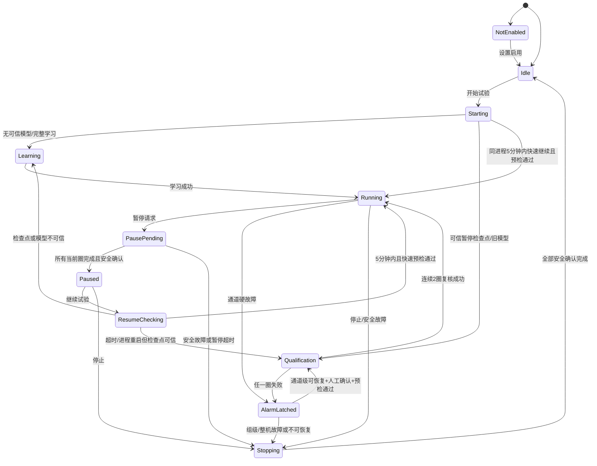

# 关于试验的开始、暂停、停止的逻辑优化；

目前界面实际起控制左右的只有“开始试验”、“停止试验”；

单卡钳的“RUN”和“STOP” 只起到了指示的作用；

我的想法：

 1）“试验设置 ”中的卡钳启用状态，直接决定了，具体卡钳的“RUN/STOP”的启禁用状态；

2） 卡钳在报警停下后，用户可以直接去点击“RUN”让卡钳在即时运转起来，而且不必要进行10圈的自学习，最好可以在1至2圈内和同组的卡钳协同起来，因为之前的自学习参数还在。

> [!CAUTION]
>
> 这是我自己的想法，如果有问题，你可以修改、完善或补充； 

3）目前试验中没有暂停的功能，因为可能出现台架在运行中想临时停止的情况，这时候，需要暂停，而不是停止，停止之后又需要完整的10圈自学习，而且停止是立马停；

我希望暂停的功能，就是在点击后，各个卡钳能完整跑完当前圈，之后再停止；数据也需要快照10圈；

然后再继续开始的话分两种情况：

​	A） 暂停之后，软件没有退出且在5分钟内，再次点击开始，那么认为卡钳状态没有大的变化，可以即时进入下一正式圈的测试；

​	B）暂停之后，软件有退出，在重新启动，那么我认为也只需要进行1至2圈自测，即可沿用上次自学习的参数进入正式试验；

---

## 方案评审结论（已确认并实施：V2.10.2.7）

评审日期：2026-08-05

整体方向是合理的，但原方案中有两处不能直接按字面实现：

1. **报警停机后不能不区分故障类型，直接点击 RUN 恢复。**报警停机当前会立即断电、退出液压参与集合、移除定时器和运行器，并保留报警/联锁锁存。若 UI 直接把 RUN 置为绿色，并不代表控制对象、电源、液压、DAQ 和错峰关系已经安全重建。
2. **软件退出后不能无条件只跑 1～2 圈。**项目虽然保存了自学习模型，但还必须确认项目配置、卡钳通道、模型版本、安全策略、程序版本及上次退出方式均匹配。缺少或不匹配时，1～2 圈不足以建立当前模型要求的稳定基线；现有模型的稳定门槛是至少 5 个有效样本。

因此建议保留你的使用目标，但改成“**有条件快速恢复 + 两圈资格复核 + 不满足条件自动回退完整学习**”。这是安全边界上的实质调整，需要确认后再开始编程和提升版本。

## 一、建议的按钮职责

| 控件 | 建议职责 | 说明 |
|---|---|---|
| 开始试验 | 新批次启动，或已暂停批次的继续入口 | 根据暂停检查点自动选择快速继续、两圈资格复核或完整学习 |
| 暂停试验（和开始试验结合，共用一个按钮） | 正常、有序暂停 | 禁止新圈启动；所有已进入当前圈的卡钳跑完并封圈后再停 |
| 停止试验 | 立即安全停止 | 取消当前圈，立即断电、释压、关闭电源并完成停机确认；不能与暂停混用 |
| 单卡钳 RUN/STOP | 显示状态，并在允许状态下作为“恢复/暂停该通道”的操作入口 | 不能绕过报警确认、预检和组协调；禁用通道保持不可点击 |
| 一键全关报警 | 仅关闭声光报警输出 | 不解除控制层硬故障或电源/液压联锁 |

“停止”必须继续保持立即动作。任何过流、失压、DAQ 失效、电源保护或其他安全故障，也必须抢占“正常暂停”，立即进入安全停止，不能为了跑完整圈而延迟断电。

## 二、试验设置与单卡钳 RUN/STOP

原设想第 1 条合理，建议补充以下规则：

1. `EpbTestRecord.Enabled=false`：对应 RUN/STOP 控件禁用，显示“未启用”，不能参加批次、单通道恢复或中途加入。
2. `Enabled=true`：控件允许根据运行状态执行操作，但不是始终可点击。
3. 试验运行期间锁定“试验设置”中的启用状态。若要新增/移除卡钳，必须先暂停或停止，防止运行中改变液压参与者和电气错峰计划。
4. 程序通过状态事件更新 RUN/STOP；用户点击只提交“操作请求”，不能先改变颜色再执行控制。请求失败时维持原状态并显示具体阻止原因。
5. 正在运行时点击单卡钳 STOP，建议解释为“该通道有序暂停”：完成当前圈后退出；若需要立即停机，使用全局“停止试验”。

## 三、报警卡钳恢复与重新入组

### 3.1 不能直接恢复的情况

以下状态禁止单卡钳点击 RUN 恢复：

- 程控电源保护、共享电源持续限流或同电源组联锁；
- 液压失压、建压/释压失败或液压组联锁；
- DAQ 硬件故障、控制证据不可用或整机系统故障；
- 断电命令或断电电流清零未确认；
- 同一故障在短时间/少量圈数内重复出现，已达到重复故障锁存阈值；
- 用户尚未确认现场已排除卡钳、线束、端子、继电器等物理问题。

这些情况必须先解除对应电源组、液压组或整机联锁；必要时完整停止并重新开始。

### 3.2 允许恢复的通道级情况

仅当故障被分类为“通道级、可恢复”，并同时满足下列门禁时，RUN 才可点击：

1. 用户已查看明确的故障原因并执行“确认并尝试恢复”；
2. 卡钳输出已关闭，电流已回零；
3. DAQ 新鲜、时间轴稳定、持久化队列健康；
4. 对应程控电源无保护、回读新鲜且输出处于可控关闭状态；
5. 对应液压组压力/释压状态可信；
6. 当前项目配置、通道身份和已保存模型均有效；
7. 同组其他卡钳仍处于可协调状态。

恢复流程建议为：

`人工确认 → 启动前安全预检 → 启动定位/预释放 → 2 圈资格复核 → 在下一个未来组锚点按原错峰相位重新入组`

两圈资格复核不重新训练整个模型，也不计入正式目标次数；它只验证当前空行程电流、夹紧时间、释放时间、峰值和完整波形是否仍落在旧模型的允许范围。任一圈失败立即重新锁存，不能继续正式试验。

重新入组时必须沿用本批次最初的电气组和相位分配，不能因为少了/增加一个卡钳而给仍在运行的卡钳重新编号，否则会改变共享电源的上电节拍。

## 四、正常暂停

### 4.1 建议状态

建议增加以下批次/通道状态：

- `PausePending`：已收到暂停请求，禁止任何新圈进入；已开始的圈继续完成；
- `Paused`：当前圈已封存、输出关闭、液压已释压、写盘队列已排空；
- `ResumeChecking`：继续试验前执行安全和检查点校验；
- `Qualification`：退出软件后或通道报警恢复时执行两圈资格复核；
- `Stopping`：立即停止过程中，尚未完成全部安全确认。

当前定时器的暂停门只在每个循环顶部检查。若某个回调已经越过暂停门、正在等待未来相位，单纯调用 `timer.Pause()` 仍可能启动下一圈。因此实现时必须在“正式圈 BeginCycle/建压之前”再检查一次批次暂停代次，确保点击暂停之后没有新圈越过边界。

### 4.2 完整暂停流程

1. 原子锁存批次 `PausePending`，记录请求时间与暂停代次；
2. 阻止尚未开始的通道进入新圈；
3. 已开始的通道继续完成正向夹紧、保持、反向释放并正常封圈；
4. 等待所有参与通道到达圈边界；
5. 再次确认所有电机 DO 关闭、电流回零、液压安全释放、程控电源关闭；
6. 等待 DAQ 持久化队列排空；
7. 每个参与通道导出最近 10 个已完成正式圈的 CSV/BIN 快照；不足 10 圈时导出全部已有圈；
8. 原子写入暂停检查点后进入 `Paused`。

暂停等待必须有超时。若某通道不能在“本圈剩余安全上限 + 停机确认裕量”内结束，流程升级为立即安全停止并明确指出超时通道，不能无限等待。

## 五、继续试验的三条路径

### A. 同一进程、暂停后 5 分钟内继续

保留原设想，但“即时进入下一正式圈”应理解为：通过快速预检后，在**下一个未来组锚点**恢复，而不是点击瞬间随意上电。

快速继续条件：

- 软件进程未退出，暂停检查点完整；
- 暂停时间不超过 5 分钟（建议做成配置项，默认 5 分钟）；
- 项目配置、启用通道和错峰计划未变化；
- 没有报警、联锁或未确认停机项；
- DAQ、电源和压力预检通过；
- 原自学习模型仍在内存且稳定。

全部满足时跳过学习和资格复核，直接从下一正式圈继续，累计次数不清零。

### B. 同一进程但超过 5 分钟，或软件正常退出后重启

可以沿用旧模型，但不能无条件直接进入正式圈。建议执行 2 圈资格复核，只有两圈都通过才继续正式试验。

重启后可走两圈资格复核的条件：

- 上一次确实完成了“正常暂停”，而不是停电、崩溃、强制退出或报警停机；
- 暂停检查点、项目名称、配置哈希、选中通道和最后正式圈号一致；
- 自学习模型文件存在、格式正确、`ModelVersion` 匹配且 `ValidSampleCount >= 5`；
- 程序版本和安全策略版本兼容；
- 用户确认暂停期间没有更换卡钳、线束、电源通道或修改台架；
- 启动前 DAQ、电源、液压、断电电流检查全部通过。

两圈均通过后沿用旧模型继续；任一圈不通过则该通道不进入正式试验，并提示选择“检查硬件后重试”或“执行完整学习”。

### C. 检查点或模型不可信

以下任一情况自动回退到完整学习：

- 没有正常暂停检查点或检查点损坏；
- 非正常退出、报警停机或系统故障重启；
- 项目/启用通道/关键控制配置发生变化；
- 模型不存在、不稳定、版本不兼容或数值非法；
- 程序安全策略发生不兼容变化；
- 用户确认更换过卡钳、线束、继电器或电源通道；
- 两圈资格复核失败。

完整学习使用项目配置的 `LearnCycle`，并继续遵守现有“至少 5 圈”的安全下限；当前项目配置为 10 圈。

## 六、暂停检查点建议字段

检查点应原子写盘，至少包含：

- 项目路径、试验名称、配置哈希；
- 批次号、暂停代次、暂停时间、暂停原因；
- 启用通道、原始电气组/相位分配、液压组；
- 每通道最后提交的正式圈号和累计完成数；
- 每通道运行状态、是否存在报警/联锁；
- 模型版本、有效样本数、模型文件哈希和更新时间；
- 程序版本、安全策略版本；
- 电机断电、电流回零、电源关闭、压力安全、DAQ 队列排空的分项确认结果；
- 最近 10 圈快照目录及导出结果。

只有检查点的所有安全确认项为真，才能标记为 `GracefulPaused` 并允许快速继续。

## 七、推荐状态机

## 八、需要确认的实施口径

建议按以下口径实施：

1. “开始试验”与“暂停/继续试验”复用同一个按钮，按钮依次显示“开始试验 / 暂停试验 / 继续试验”；“停止试验”继续保持立即安全停止；
2. 启用状态决定单卡钳控件是否可操作，但运行中禁止修改启用通道；
3. 单卡钳 STOP 表示完成当前圈后暂停该通道；
4. 报警后的 RUN 只允许通道级可恢复故障，并必须经过人工确认、完整预检和 2 圈资格复核；组级/整机联锁禁止单通道恢复；
5. 同进程暂停不超过 5 分钟：快速预检后直接从下一未来锚点继续；
6. 超过 5 分钟或正常暂停后重启：旧模型可信时做 2 圈资格复核；
7. 非正常退出、报警停机、配置/硬件/模型不可信：自动回退完整学习（至少 5 圈，当前配置 10 圈）；
8. 暂停完成后为每个参与通道导出最近 10 个已完成正式圈，不把资格复核圈计入正式目标次数。

> **确认记录（2026-08-05）：**已确认按推荐方案实施；补充要求为暂停与开始复用同一个按钮。

## 九、软件实施结果（V2.10.2.7）

### 1. 全局开始/暂停/继续复用按钮

- 空闲状态显示“开始试验”；
- 正式运行状态显示“暂停试验”；
- `PausePending` 显示“正在暂停…”，按钮暂时禁用，防止重复请求；
- 安全暂停完成后显示“继续试验”；
- 恢复预检或资格复核期间显示“正在恢复…”，按钮暂时禁用；
- 原“停止试验”保持立即安全停止，不与暂停逻辑复用。

### 2. 优雅暂停安全边界

`HighPrecisionTimer` 新增“当前圈结束后暂停”原语，并用原子状态消除了以下竞态：暂停请求已经发出，但定时器已经越过暂停门、正在等待下一圈计划时刻。现在只有成功取得“圈执行权”才允许进入下一圈。

批次暂停顺序已经实现为：

1. 同时锁住全部通道的下一圈；
2. 等待所有在途正式圈自然结束并完成封圈；
3. 再次发送电机高优先级 OFF；
4. 强制释放相关液压组并等待安全压力；
5. 等待 DAQ 持久化队列排空；
6. 每个暂停通道导出最近 10 个已完成正式圈；
7. 原子保存正常暂停检查点；
8. 任一步骤超时或遇到并发报警，自动升级为立即安全停止。

### 3. 同进程继续

- 暂停不超过 5 分钟：重新检查 DAQ、严格曲线模式、稳定模型和程控电源状态，然后从所有通道共享的下一个未来 UTC 周期锚点继续；
- 暂停超过 5 分钟：先执行 2 圈资格复核，再从未来统一锚点继续；
- 资格复核圈使用负圈号证据目录封存，不增加正式目标完成数；
- 预检或资格复核失败时保持安全暂停，不允许带故障恢复。

### 4. 软件重启后的继续

正常暂停检查点增加并校验以下内容：

- 项目、选中通道和剩余正式圈数；
- 项目/设备配置 SHA-256；
- EXE SHA-256、程序集版本；
- 程序安全配置 SHA-256；
- 自适应模型 SHA-256；
- 暂停 UTC 时间；
- 电机关闭、压力安全、DAQ 排空和最近 10 圈导出确认。

程序重启后，仅当检查点不超过 7 天且以上身份全部一致时，实时监视界面才显示“继续试验”。点击后先完成启动定位和 2 圈资格复核；检查点不可信或资格复核失败时撤销检查点，下一次“开始试验”自动回退完整学习（至少 5 圈，采用当前项目配置圈数）。

### 5. 单卡钳 RUN/STOP

- 测试设置中的 `Enabled` 决定通道控件是否具备操作资格；运行会话中锁定参与通道勾选，防止相位计划被中途修改；
- 运行通道点击 STOP：完成当前圈后退出后续液压代次，安全关断并保存最近 10 圈；
- 暂停通道点击 RUN：执行恢复预检，超过 5 分钟时增加 2 圈资格复核，再从未来锚点加入；
- UI 点击后立即恢复为控制层真实状态，最终颜色和 RUN/STOP 由状态事件回写，不做乐观切换。

### 6. 报警后的受控恢复

仅 `AffectedChannels` 为单通道，且故障码不属于 DAQ、程控电源、液压、共享资源、联锁、断电电流未清零、过流证据、持久化或系统故障时，RUN 才可操作。流程为：

1. 操作员二次确认故障原因已经排除；
2. 重新执行 DAQ、严格曲线、稳定模型和程控电源预检；
3. 重新执行启动定位；
4. 执行 2 圈资格复核；
5. 使用原错峰计划，从下一未来正式槽重新加入；
6. 全部成功后才清除该通道声光报警；任一步失败继续保持报警锁存。

组级、整机级以及上述共享资源故障禁止单通道 RUN，必须按原安全联锁流程处理。

### 7. 验证记录

- `AdaptiveControlTests` 新增：优雅暂停等待当前圈、计划等待窗口暂停竞态、重复暂停幂等、未来锚点恢复、5 分钟边界和报警恢复分类测试；
- Debug、Release 主程序全量构建通过，生成的 EXE 文件版本与产品版本均为 `2.10.2.7`；
- `AdaptiveControlTests` 在 Debug、Release 下均通过 `183/183`；
- `EpbDiskWriterTests` 通过 `21/21`，`PowerSupplyDebugger.Tests` 通过 `17/17`；
- `Tools/Build-Release.ps1` 按设计拒绝脏工作区，因此本次只验证 Release 构建与产物版本，未生成正式发布清单/发布包；提交变更后可在干净工作区执行正式打包。

