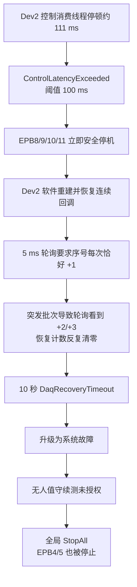

# 10358-029 V2.10.2.7 全部停止根因分析

> 分析对象：`\\wj-epb\EPB_Data\10358-029_V2.10.2.7_0806_0549`  
> 故障时间：2026-08-06 01:30:34～01:30:49（北京时间）  
> 结论日期：2026-08-06

## 执行摘要

本次“全部停止”不是液压压力真实不足、EPB 过流、电源故障，也不是程序崩溃。

故障链路为：

1. **Dev2 的控制消费线程出现约 111 ms 的处理滞后**，超过 `DaqControlHardFaultAgeMs=100` 的安全阈值，触发 `ControlLatencyExceeded`。
2. Dev2 对应的 EPB8、EPB9、EPB10、EPB11 立即进入安全停机。此时日志中的 `HydraulicPressureLost/StaleSample` 表示“压力样本过期”，不是压力低于下限；实际记录值为 75.541 bar，高于 65 bar 下限。
3. Dev2 随后已完成重建并持续产生连续的新数据，但**自动恢复校验代码要求每次 5 ms 轮询时序号必须恰好 `+1`**。现场 DAQ 数据按批突发到达，轮询经常一次看到 `+2/+3`，代码便清零恢复计数，最终在 10 秒后误判为 `DaqRecoveryTimeout`。
4. 恢复失败升级为系统故障；由于现场“无人值守续测”未授权，系统按既定安全策略执行 `StopAll`，把仍在运行的 EPB4、EPB5 一并停止。因此用户看到的是“后期全部停止”。

**直接原因已确认；恢复校验逻辑缺陷已确认。** 最初 111 ms 控制线程停顿的最强关联证据是现场持续的高频 GC/分配压力，但由于 GC ETW 跟踪无管理员权限而未采集到单次暂停明细，尚不能把这 111 ms 唯一归因于 GC；同步订阅者阻塞、锁等待或操作系统调度停顿仍是次要候选。

## 已实施解决方案（当前工作区）

目标已经明确为：**软件问题允许跳过当前一圈或多圈进行自维护；健康设备持续运行；只有独立证据确认硬件确实故障时才报警停机。**

100 ms 硬阈值没有调大。110.908 ms 相当于约 11 个 10 ms 控制批次未推进，带电时的电流和压力数据已经不能作为可靠安全证据。新的处理方式不是继续使用陈旧数据，而是：

1. 只暂停并断电受影响的 DAQ 设备组；健康 DAQ 组保持运行；
2. 确认本组已经断电后，丢弃积压的旧控制批次，只保留最新批次并重置快速滤波；
3. 每次无人值守重试前都重新确认整组断电；若 DO 断电尚未确认，只重试断电，绝不丢数据、重建 DAQ 或重新上电；
4. 先用最新数据验证连续 10 批。轮询一次跨过 `+2/+3/+N` 个序号时，只要控制消费者确认中间没有真实缺号，就按实际序号增量累计；
5. 500 ms 内验证成功便直接从下一完整圈恢复，不 Stop/Start DAQ；
6. 数据仍不新鲜、时钟异常或连续性确有问题时，自动重建 DAQ；
7. 重建仍失败时按 1/2/5/10/30 秒有界退避持续自维护，不升级为全局 `SystemFault`，也不触发 `StopAll`；
8. DAQ 映射异常、单源过流但没有新鲜 PSU 独立证据、单通道落盘证据无效等未确认问题，只隔离受影响通道，不再进入应用级无人值守 `StopAll`；
9. 只有至少两次独立硬件探测都确认设备缺失/自检失败，才锁存对应设备组的硬件报警；
10. 恢复关键窗口只保存轻量阶段 JSON，完整诊断和最近圈证据只在恢复成功或硬件确认终态串行导出，避免快照自身制造 GC/IO 风暴。

对应代码：

- `IO.NI/ControlBatchRing.cs`：突发批次恢复验证器，使用连续性计数区分“轮询跨批”和“真实缺号”；
- `IO.NI/TwoDeviceAiAcquirer.cs`：断电后丢旧追新、快速重同步、连续性诊断；
- `Controller/EpbManager.cs`：控制积压先快速重同步，软件失败持续自维护，健康 DAQ 组不停止；
- `Controller/EpbManager.DaqRecoveryState.cs`：未确认软件故障只做通道隔离，不发布会触发全局重启的 `SystemFaultRaised`；
- `Controller/DaqRecoveryTerminalGate.cs`：只有双份独立硬件证据才进入硬件报警；
- `Controller/EpbManager.WarningSnapshots.cs`：恢复期间轻快照，终态才导出完整证据；
- `Tests/AdaptiveControlTests/DaqRealtimeControlTests.cs`：突发序号、真实缺号、快速重同步、自维护退避和硬件证据门槛测试。

当前验证结果：

- `AdaptiveControlTests`：188/188 通过；
- `MTTfTest.csproj` Debug/AnyCPU：编译通过；
- 仍需在现场硬件上完成 20 次故障注入和不少于 4 小时的六通道长稳准入，软件测试不能替代真实 NI、DO、液压和电源联调。

## 1. 运行概况

程序约在 22:11:35 开始正式试验，六个通道在故障前持续正常运行约 3 小时 19 分钟。

| 通道 | 故障前完成的正式循环 | 最后一圈状态 | 最后停止原因 |
|---|---:|---|---|
| EPB4 | 789 | canceled | Dev2 恢复超时后触发全局 `StopAll` |
| EPB5 | 789 | canceled | Dev2 恢复超时后触发全局 `StopAll` |
| EPB8 | 788 | failed | Dev2 `ControlLatencyExceeded` 后数据陈旧 |
| EPB9 | 788 | failed | Dev2 `ControlLatencyExceeded`，断电电流因数据陈旧无法确认 |
| EPB10 | 788 | failed | Dev2 `ControlLatencyExceeded` 后数据陈旧 |
| EPB11 | 788 | failed | Dev2 `ControlLatencyExceeded` 后数据陈旧 |

循环数量来自 `index.db` 的 `epb_cycles` 表。学习圈未计入上述正式循环。

这解释了“刚开始都正常”：故障并非配置一加载就必现，而是在长时间运行后出现了一次控制消费超时；随后恢复判定缺陷把一个可恢复的瞬态问题升级成了全局停机。

## 2. 故障时间线

| 北京时间 | 事件 | 证据与含义 |
|---|---|---|
| 01:30:30～01:30:31 | 六个通道开始下一正式循环 | 停机前所有通道仍在正常工作 |
| 01:30:34.067 | Dev2 控制延迟预警 | 控制环深度 7/64，最老数据 63.0 ms |
| 01:30:34.117 | Dev2 触发软件故障 | 深度 12/64，最老数据 110.908 ms，故障码 `ControlLatencyExceeded` |
| 01:30:34.273 | 液压 2 样本陈旧 | 实际压力 75.541 bar、下限 65 bar，样本年龄 211.1 ms；不是实际掉压 |
| 01:30:34.291～01:30:34.349 | EPB8/9/10/11 安全停机 | EPB9 最后电流 14.607 A，但样本陈旧，无法确认已断流，因此联锁关闭电源组 |
| 01:30:34.442 | Dev2 开始软件自动恢复 | 受影响通道为 `[8,9,10,11]` |
| 01:30:34.532～01:30:34.554 | Dev2 重建完成并重新产生数据 | 新代次 Generation 6 开始回调 |
| 01:30:37～01:30:43 | 重建后数据流基本稳定 | 每秒约 99～101 个回调；捕获序号连续，无真实丢号 |
| 01:30:44.549 | 自动恢复 10 秒超时 | 恢复结果仍为 0 个已验证新批次 |
| 01:30:48.368 | 升级系统故障 | 无人值守恢复协调器请求保持安全停机 |
| 01:30:48.392～01:30:48.405 | EPB4、EPB5 被取消 | 两个 Dev1 通道此前仍在继续运行，此时因全局 `StopAll` 停止 |
| 01:30:49.107 | 全局安全状态确认 | Motor DO、电源和压力均已关闭/释放 |

`run.log` 在此后仍持续记录 DAQ 心跳和回调，直至约 05:50 关闭程序。这证明是“试验执行停止”，不是应用进程或 DAQ 服务崩溃。

## 3. 根因链路



### 3.1 已确认的首个触发点：控制消费延迟超过 100 ms

`IncidentSnapshots/.../daq_timing.csv` 显示：

- 01:30:34.067：`ControlLatencyWarning`，深度 7/64，队列年龄 63.041 ms；
- 01:30:34.117：`SoftwareFault`，深度 12/64，队列年龄 110.908 ms；
- 故障前 DAQ 回调仍在入队，因此表现为控制消费者未及时排空队列，而不是 DAQ 卡先断开；
- 队列没有满，直接故障码是 `ControlLatencyExceeded`，不是 `ControlQueueFull`。

源码对应：

- `IO.NI/TwoDeviceAiAcquirer.cs:2789-2827`：控制队列最老数据达到硬故障阈值时发布 `ControlLatencyExceeded`；
- `MTTfTest/App.config`：预警阈值 50 ms，硬故障阈值 100 ms；
- 控制消费线程是独立的 `AboveNormal` 线程，因此本次不是普通线程池耗尽。

### 3.2 已确认的放大因素：恢复校验会把正常突发数据误判为不连续

`IO.NI/TwoDeviceAiAcquirer.cs:1948-1993` 的恢复循环每 5 ms 获取一次快照，并要求：

```text
snapshot.LastProcessedSequence == lastSequenceAfterRecovery + 1
```

不满足时便把 `freshCount` 和首个验证序号清零。

现场重建后的证据与这段逻辑冲突：

- 捕获到 999 个不同序号，从 1197427 到 1198425，范围内连续、没有缺号；
- 01:30:37～01:30:43 基本保持约 100 回调/秒；
- 998 个相邻间隔中有 432 个小于 5 ms，说明多个批次会在一次 5 ms 轮询之间到达；
- 因而轮询可能从序号 N 直接看到 N+2 或 N+3。数据并未丢失，但恢复代码会按“不等于 N+1”清零；
- 事故快照中的 `FirstVerifiedSequence=0`、`LastVerifiedSequence=0` 与这一误判完全一致。

因此，**10 秒恢复超时不是“Dev2 10 秒都没有恢复数据”，而是恢复判定器没有承认已经恢复的数据。**

### 3.3 为什么最终连 EPB4、EPB5 也停了

EPB4、EPB5 属于 Dev1，在 Dev2 四个通道于 01:30:34 停止后仍继续运行，并在 01:30:45～01:30:46 开始下一圈。这说明“六通道同时因同一硬件故障停止”并不成立。

到 01:30:48，Dev2 恢复超时被升级为系统故障。`MTTfTest/UnattendedRecovery.cs:137-150` 在检查点未 `Armed` 时返回“无人值守续测未授权”；`RestartAsync` 随即执行 `SafeStopOnlyAsync`，最终调用全局 `StopAll`。EPB4、EPB5 的最后一圈因此被取消。

该行为符合当前安全设计，但它让一个 Dev2 的瞬态软件故障扩大为所有通道停止。

## 4. 最初 111 ms 停顿的促成因素

### 4.1 最强证据：持续的 GC/分配压力

事故快照 `daq_runtime.csv` 显示故障前约 19.1 秒内：

- Gen0 GC 增加约 87 次；
- Gen1 GC 增加约 82 次；
- Gen2 GC 增加约 58 次，约 3 次/秒；
- 托管内存约在 75～115 MB 间反复波动；
- 可用工作线程仍约 1014～1018，不支持“线程池耗尽”的解释。

故障发生后，事故快照导出又造成更明显的分配洪峰，并在恢复窗口内出现约 865 ms 的回调间隔，随后以突发方式追赶。这会进一步恶化恢复时序，但它发生在首个 `ControlLatencyExceeded` 之后，不能倒推为首个触发点。

综合判断：**高频 GC/分配压力是首个 111 ms 停顿最可能的促成因素，置信度中高；但不是已被单一证据锁定的唯一根因。**

### 4.2 仍需保留的候选

控制线程每批还会同步执行快速滤波、证据追加和电流订阅回调。当前耗时指标只会在订阅者返回后记录；如果某次订阅者、锁或系统调度恰好停住，故障瞬间不会留下完整的订阅者耗时。因此仍应保留以下候选：

- 同步订阅者或共享锁短时阻塞；
- 操作系统对专用控制线程的瞬时调度延迟；
- GC 暂停与上述因素叠加。

事故采集尝试启动 ETW GC 跟踪时得到 `UnauthorizedAccessException: Access Denied`，缺少精确的单次 GC Pause 证据，所以不应把 GC 写成 100% 已证实的唯一原因。

## 5. 已排除项

| 可疑项 | 判断 | 依据 |
|---|---|---|
| 液压真实掉压 | 排除 | 记录压力 75.541 bar，高于 65 bar 下限；故障原因是 `StaleSample` |
| EPB 真实硬过流 | 排除 | EPB9 最后电流 14.607 A、电源读数约 15.155 A，未达到 18 A 硬过流；问题是样本陈旧、无法确认断流 |
| 电源本体故障 | 排除 | 故障前遥测新鲜、输出正常；之后是联锁主动关闭电源组 |
| DAQ 卡硬断开 | 不支持 | 故障前仍在回调；软件重建后序号连续且约 100 回调/秒 |
| 控制队列满 | 排除 | 故障时仅 12/64，故障码为 `ControlLatencyExceeded` |
| 程序崩溃 | 排除 | 全局停机后日志仍持续记录 DAQ 回调数小时 |
| 六通道同时发生独立故障 | 排除 | EPB4/5 在 Dev2 停止后仍继续运行约 14 秒，最终因 `StopAll` 被取消 |

## 6. 根因分级与置信度

| 层级 | 结论 | 置信度 |
|---|---|---|
| 直接触发 | Dev2 控制消费延迟 110.908 ms，越过 100 ms 硬故障阈值 | 高，日志与事故 CSV 直接记录 |
| 恢复失败 | 5 ms 轮询要求序号逐次 `+1`，与突发到达模型不兼容，导致连续数据被误判 | 高，源码与现场连续序号相互印证 |
| 全部停止 | 恢复超时升级系统故障；无人值守续测未授权，执行全局 `StopAll` | 高，日志与源码直接记录 |
| 首次停顿促因 | 高频 GC/分配压力导致或促成控制线程长暂停 | 中高，运行时计数强相关，但缺少 ETW 单次暂停证据 |
| 其他促因 | 同步回调、锁等待或 OS 调度停顿 | 中低，架构上可能，现场证据不足 |

## 7. 整改实施与后续建议

### P0（已实施）：修复恢复判定器

已取消“外部 5 ms 轮询必须观察到每一个 `+1` 序号”的错误假设。当前实现：

1. 控制消费者保存连续性故障计数及最后故障序号；
2. 恢复器看到 `currentSequence > lastSequence` 且连续性计数不变时，按序号增量累计；
3. 连续性计数变化、样本陈旧、代次变化或序号倒退时重新建立干净窗口；
4. 已增加同一次轮询跨过 `+2/+3/+N` 和真实缺号的自动化测试。

验收标准：注入 20 次 Dev2 软件重建，包含成对、成组三连发以及追赶突发；只要序号连续、数据新鲜，必须在 10 秒内恢复，不能出现 `FirstVerifiedSequence=0`。

### P0（已实施）：将事故快照导出移出恢复关键路径

`ExportDaqIncidentSnapshotAsync` 原先虽然以异步方式启动，但调用时会先同步复制完整诊断环，而且多个阶段重复导出最近圈。当前已改为：

- 恢复阶段只冻结标量状态并后台写轻量 JSON；
- 完整诊断与最近 10 圈只在 `90-recovered` 或 `90-hardware-confirmed` 终态导出；
- 所有 DAQ 事故快照通过单一信号量串行化，禁止并发重型导出。

验收标准：开启完整事故留证时，恢复数据回调不得因快照导出新增超过 100 ms 的停顿。

### P0：继续降低长时间运行中的分配和 Gen2 GC

- 对控制路径、持久化路径、诊断采样和字符串日志做分配剖析；
- 优先处理每批分配、频繁大对象、无界历史集合及同步日志格式化；
- 增加进程级 GC Pause、分代次数、分配速率、控制线程最后完成时间及当前执行阶段的常驻遥测；
- 以管理员权限或可用的 EventPipe/ETW 方案补齐 GC 暂停证据。

验收建议：六通道连续运行不少于 4 小时；无 `ControlLatencyExceeded`，Gen2 GC 频率显著低于本次现场约 3 次/秒，并将目标收敛到低于 1 次/分钟。

### P1：改进控制线程卡顿定位

- 在进入同步订阅者、锁、滤波和证据追加之前先记录阶段与开始时间；
- 由独立看门狗记录“控制线程正在何处”，避免只有调用返回后才知道耗时；
- 事故快照中增加最近 N 批的入队、出队、订阅开始/结束和 GC Pause 时间线。

### P1（已实施软件故障策略）：无人值守连续运行

DAQ 软件故障不再借用应用级无人值守重启链路：

- 受影响组安全断电后自动丢旧追新或重建，成功后从下一完整圈恢复；
- 软件恢复失败保持 `Recovering`，后台持续退避重试，不进入物理报警、蜂鸣器或全局 `StopAll`；
- 健康 DAQ 组不受影响，继续按原周期运行；
- 应用崩溃、共享资源系统故障等真正的应用级故障仍保留原无人值守授权和安全重启策略。

### 不建议

- 不建议简单把 100 ms 硬故障阈值调大；这会掩盖陈旧控制数据，降低安全性；
- 不建议关闭压力、电流或电源联锁；这些联锁在数据不可信时执行安全断电是正确的；
- 不建议在通道仍带电时静默丢弃旧批次；被跳过的数据中可能包含过流峰值；
- 不建议只增加恢复超时时间。现场判定条件本身错误，延长到 30 秒仍可能一直清零。

## 8. 复测清单

1. **恢复算法单测**：轮询跨越连续 `+2/+3/+N` 序号时能够累计，不把连续流误判为丢批。
2. **故障注入**：Dev2 主动触发 20 次重建，验证每次恢复时长、序号连续性及通道恢复边界。
3. **快照压力测试**：在恢复窗口内启用完整事故快照，确认无超过 100 ms 的新增停顿。
4. **六通道长稳测试**：先空载 30 分钟，再正式六通道至少 4 小时，监控控制队列年龄、GC Pause、Gen2 GC、磁盘落盘延迟。
5. **安全策略测试**：验证软件故障只进入自维护且健康组继续；模拟两份独立设备缺失证据时，对应组才进入硬件报警。
6. **现场准入**：只有在长稳测试和 20 次恢复注入全部通过后，才替换现场版本。

## 9. 证据来源与限制

主要证据：

- `log/run.log`、`log/error.log`、`log/warning.log`；
- `index.db` 的 `epb_cycles` 表；
- `IncidentSnapshots/20260806_013034_329-Dev2-52d1b8c987054ba6a708e8309f23e1a5/` 下的 `incident.json`、`daq_timing.csv`、`daq_runtime.csv`；
- 当前仓库中的 `IO.NI/TwoDeviceAiAcquirer.cs`、`Controller/EpbManager.cs`、`MTTfTest/UnattendedRecovery.cs` 和 `MTTfTest/App.config`。

限制：

- 数据目录名及仓库版本号均指向 V2.10.2.7，但现场快照未包含可独立核对的运行二进制哈希，因此无法只凭该目录证明实际运行文件与当前源码逐字节一致；
- ETW GC 跟踪因权限不足未启动，所以首个 111 ms 停顿的内部耗时只能定位到“控制消费未推进”，不能精确到某一次 GC、某个订阅者或某把锁；
- 上述限制不影响对“恢复校验误判”和“最终 StopAll 链路”的确认。

## 最终结论

这次全部停止包含两个层次：**一次真实的 Dev2 控制时序超限**，以及**一次错误的自动恢复失败判定**。前者首先让四个 Dev2 通道安全停机；后者把已经重新产生连续数据的 Dev2 判成 10 秒恢复失败，再叠加“无人值守续测未授权”的安全策略，最终停止了仍正常运行的 Dev1 两个通道。

当前工作区已经把处理策略改成：**带电时保持 100 ms 安全边界；断电后允许跳过旧圈/旧批追到最新；软件问题持续自维护且不停止健康组；只有双份独立证据确认硬件故障才报警停机。** 恢复判定器和恢复窗口快照分配问题也已修复。下一步必须完成现场 20 次故障注入和至少 4 小时六通道长稳准入；单纯调大超时或安全阈值不能解决根因。
