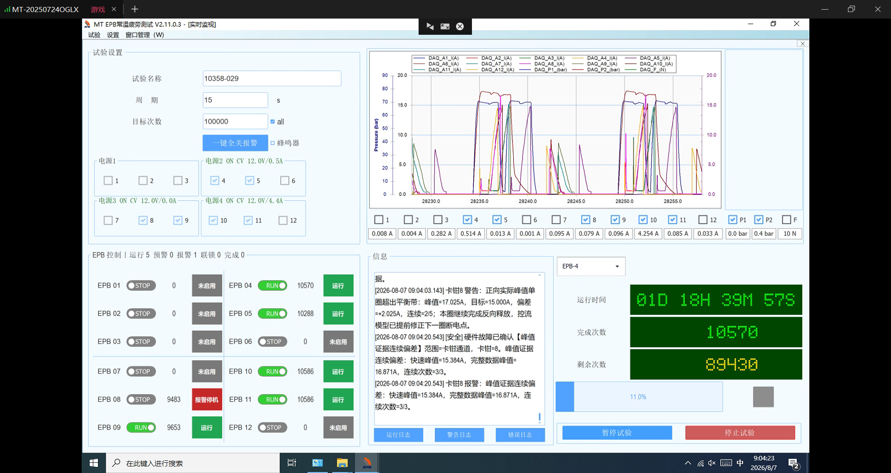
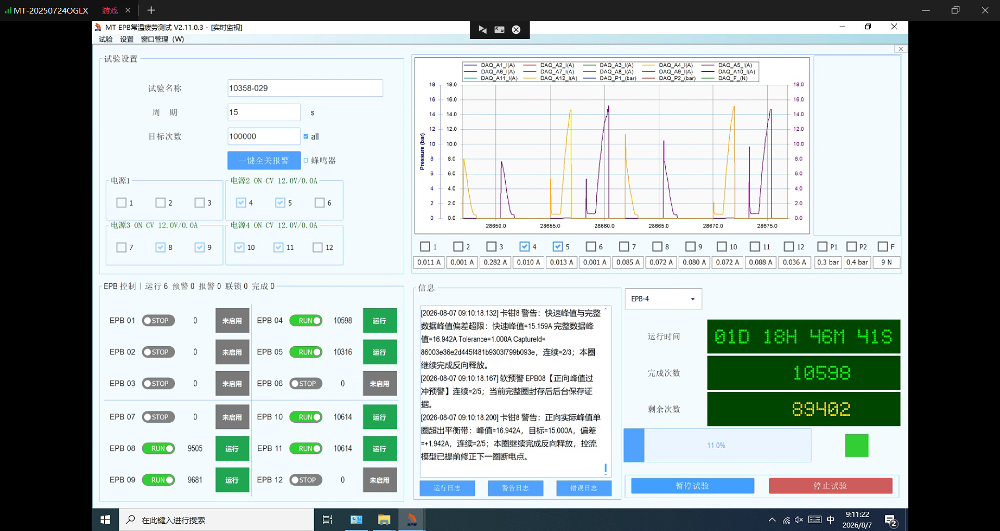
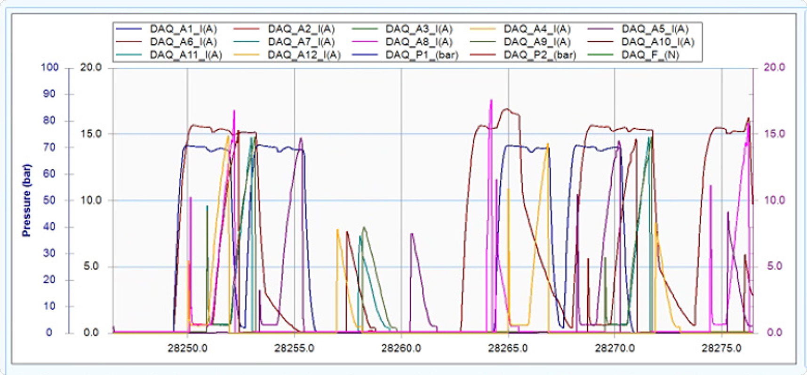
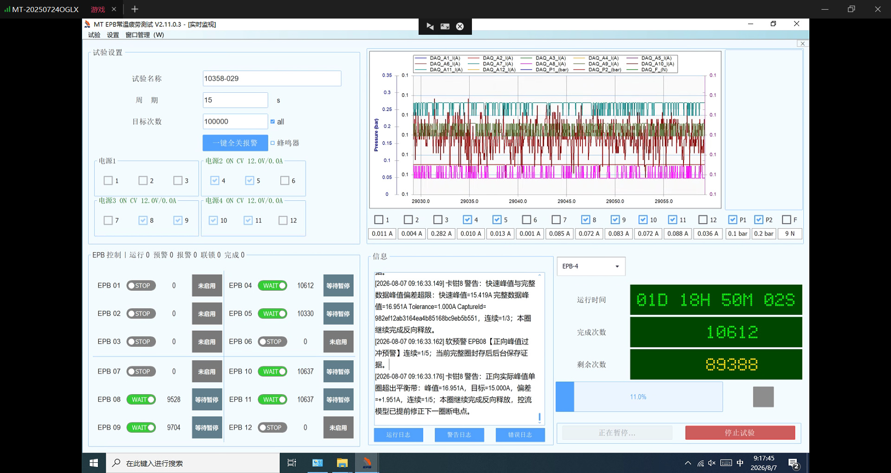
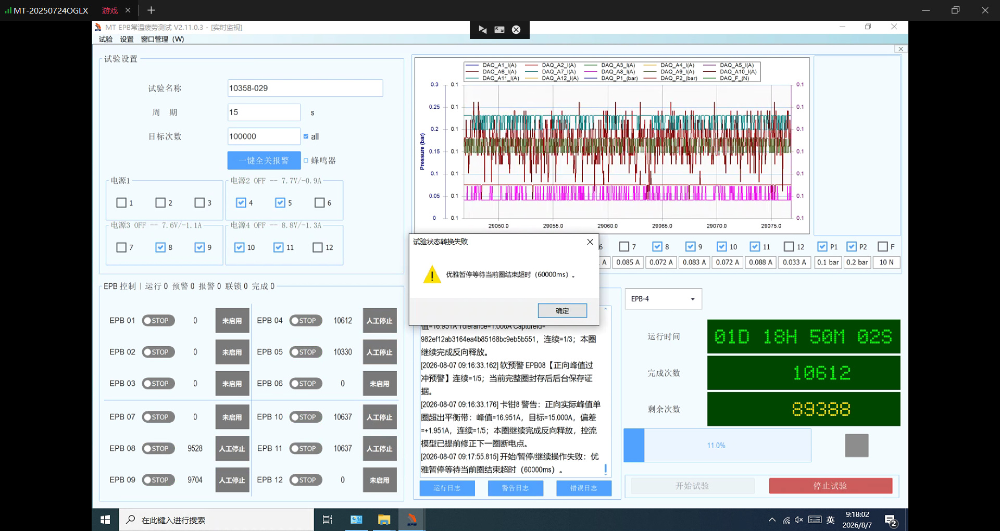

# V2.11.0.3 现场问题确认与处理建议（10358-029，2026-08-07）

## 结论

本次日志确认：**V2.11.0.3 仍存在“实际已安全停机，但界面继续显示 RUN、次数和曲线不再变化”的状态一致性问题。**

- 直接异常发生在 **2026-08-07 09:14:45**。Dev1 所属的 EPB4、EPB5 和压力 1 被安全切断，此后不再产生正式圈；Dev2 所属的 EPB8、EPB9、EPB10、EPB11 仍继续运行。
- 安全结果是正确的：EPB4、EPB5 已断电，压力 1 已卸压；不是卡钳持续带电。
- 控制状态和可观测性是错误的：界面仍显示 EPB4、EPB5 为 `RUN`，没有进入“恢复中/故障停机”，也没有故障日志、恢复日志或事故快照。
- 手动“暂停试验”失败是上述异常的**次生问题**。一个 Dev1 定时圈（第 461 圈）没有退出，优雅暂停等待 60 秒后超时，并按设计升级为全局安全停止。
- 09:18:16 手动停止后重新开始，Dev1 DAQ 回调恢复，健康检查和压力 1 建压均通过，说明重开完成了有效清场。

因此，本问题不应归类为单纯的曲线显示问题；核心是：**Dev1 故障的同步安全动作已经执行，但后台故障发布/自恢复状态机没有接续，同时仍有一个在途圈未被取消。**

## 分项确认

| 项目 | V2.11.0.3 结论 | 说明 |
| --- | --- | --- |
| 报警通道恢复后是否撤销灯和蜂鸣器 | 代码路径已覆盖，现场仍需做一次物理 I/O 回归 | 同一批次内，通道经人工确认、预检和资格复核成功后，会清除该通道报警灯；只有全部报警都解除后蜂鸣器才会关闭。本次截图能确认界面从“报警 1”回到“报警 0”，但不能替代物理灯和蜂鸣器验证。 |
| “电流曲线越来越乱” | 截图本身不能证明控制失稳 | 09:09 截图同时勾选多路电流和两路压力，叠图会显得杂乱；09:13 只保留 EPB4、EPB5 后曲线仍有规律，次数也在增长。真正冻结从 09:14:45 开始。 |
| EPB4、EPB5 显示运行但不再动作 | **确认仍存在** | Dev1 安全断电后，界面状态没有同步为恢复中或停机。 |
| 手动暂停失败 | **确认仍存在，且是次生故障** | 仍有一个第 461 圈工作未退出，批次优雅暂停的 `Task.WhenAll` 一直不能完成，60 秒后超时。 |
| 手动停止、重开 | 有效 | StopAll 完成安全清场；重开后 Dev1 回调、DAQ 健康检查、压力 1 建压恢复正常。 |

## 问题 1：报警恢复后灯和蜂鸣器是否会撤销

### 结论

按当前工作区源码的设计，**会撤销，但必须满足“恢复已经成功”这个条件**：

1. 报警通道经过操作员确认故障已排除；
2. DAQ、电源、机械释放和资格复核通过；
3. 通道重新加入正式运行；
4. 随后清除该通道的报警锁存，并显式发送指示灯 `OFF`；若串口写失败，会在同一运行代次内继续重试；
5. 蜂鸣器按全局活动报警集合控制，**只有没有其他活动报警时才关闭**。蜂鸣器禁用时本来就不会鸣叫。

相关实现位于：

- `Controller/EpbManager.PauseResume.cs`：`ClearAlarmIndicatorAfterRecoveryBestEffort`；
- `Controller/Alarm/AlarmManager.cs`：`SetAlarmAsync`、`RefreshBuzzerAsync`；
- 新试验开始前还会调用 `ClearAllAsync`，本次 `ui-info.log` 在 **09:18:16.131** 记录了“开始新试验前已自动复位上次声光报警”。

现场截图也表现为 09:04 的“报警 1”在恢复后变为 09:11 的“报警 0”：

仍需补一项黑盒验收：人为制造单通道报警，观察同一批次恢复后该通道实体灯熄灭，并确认在“另一个通道仍报警”时蜂鸣器不会被错误关闭。

## 问题 2：曲线变乱与 EPB4、EPB5 最终冻结

### 冻结前的曲线

09:09 的图同时显示多路电流和 P1/P2，电流上升、释放、压力平台和卸压过程叠在一起，视觉上较乱：

09:13 只显示 EPB4、EPB5 时，电流波形仍按周期出现；加入 P1 后也能看到对应的建压平台。两张图之间 EPB4/EPB5 次数均增加 1，说明此时尚未冻结：

日志在冻结前最后确认：

- EPB4 正式圈 `Cycle=10655` 于 09:14:30.745 开始，于 09:14:38.870 完成；
- EPB5 正式圈 `Cycle=10376` 于 09:14:34.060 开始，于 09:14:42.359 完成；
- Dev1 最后一条周期性 DAQ 回调节拍记录在 09:14:38.174。

因此，“早期叠图杂乱”和“最后完全不变化”应分开处理：前者主要是显示可读性问题，后者是实际控制组停止。

## 事故时间线

日志目录：`\\wj-epb\EPB_Data\10358-029_V2.11.0.3_0807_0924`

原批次：`RunId=5d627bedb63c4628af83957eb9fa47f5`

| 时间 | 事实 | 判定 |
| --- | --- | --- |
| 09:14:38.174 | Dev1 最后一条 DAQ 回调节拍；Dev2 后续仍每约 10 秒记录节拍。 | 异常范围被限定在 Dev1。 |
| 09:14:38.870 | EPB4 的 `Cycle=10655` 正常完成。 | EPB4 最后一圈完成。 |
| 09:14:42.359 | EPB5 的 `Cycle=10376` 正常完成。 | EPB5 最后一圈完成。 |
| 09:14:45.018～09:14:45.019 | 压力 1 启动并下发 70 bar。 | Dev1 新一圈进入液压资格阶段。 |
| 09:14:45.349～09:14:45.354 | 两个定时器被暂停，EPB4 全关，压力 1 两次停止/AO 清零/强制卸压；一个第 461 圈记录“随暂停/恢复切换取消”。 | 与 Dev1 的同步安全优先路径完全吻合。 |
| 09:14:45 之后 | 无 Dev1 回调节拍、无 EPB4/5 正式圈、无压力 1 周期；但 Dev2 四个通道继续运行。 | EPB4/5 实际停止。 |
| 09:14:45 之后 | 未出现对应故障码、`Recovering` 状态、DAQ 自动恢复记录或事故快照。 | 安全动作之后的故障发布/恢复接续丢失。触发故障码因此无法从现有日志还原。 |
| 09:16:10 截图 | EPB4/5 仍显示 `RUN`，次数为 10612/10330，但曲线、压力和次数不再变化。 | UI 与实际执行状态不一致。 |
| 09:16:50.763 | 收到批次暂停请求，六通道进入 `PausePending`；六个定时器均记录“请求在当前圈结束后暂停”。 | 人工暂停开始。 |
| 09:16:52～09:16:55 | EPB8/9/10/11 完成各自在途圈并暂停；现场截图中的次数相应继续增加。 | Dev2 优雅暂停正常。 |
| 09:17:45 截图 | 六通道均显示“等待暂停”；EPB4/5 次数仍为 10612/10330。 | 暂停被 Dev1 未退出的在途圈卡住。 |
| 09:17:50.791 | 优雅暂停等待 60000 ms 超时，状态转为 `Stopping`。 | 暂停失败被确认。 |
| 09:17:50.792 起 | 自动调用 StopAll，移除各通道 Timer/Runner，全部 EPB、压力和电源组关闭。停止时又出现一条“周期 461 随定时器停止请求取消”。 | 证明此前至少还有一个 Dev1 第 461 圈一直未退出；安全停止成功。 |
| 09:18:16.096 | 重新开始清场完成。 | 旧批次状态被抛弃。 |
| 09:18:16.699～09:18:16.762 | Dev1 DAQ 回调重新出现，DAQ 启动健康检查通过。 | 重建恢复数据链。 |
| 09:18:18.762 | 压力 1 达到 70.361 bar并通过资格检查。 | Dev1 控制组恢复正常。 |

### 现场最终状态

EPB4、EPB5 保持 `RUN`，但电流、压力和次数均已冻结：

人工暂停后，Dev2 通道完成在途圈，EPB4、EPB5 仍不变化：

60 秒后优雅暂停超时并升级为安全停止：

截图时间、UI 日志落盘时间和 `run.log` 控制动作时间存在数秒差异；本分析以 `run.log` 的控制动作时间为主。

## 根因分析

### 已确认的直接原因

1. Dev1 发生数据链/控制链故障后，`DeviceFaultDetected` 的同步安全处理已经运行：暂停 Dev1 定时器、取消圈令牌、关闭 EPB 输出并释放压力。
2. 随后的故障发布没有进入 `EpbManager` 的完整事故归并和 DAQ 自恢复状态机。否则日志中应当出现故障码、关联 ID、`Recovering` 状态、恢复过程和事故快照；本次均缺失。
3. Dev1 的两个共享液压圈中至少有一个没有响应第一次圈取消，一直保持在途；直到 StopAll 取消定时器本身时才退出。这使后续优雅暂停无法收齐全部完成信号。
4. UI 仍以批次/Timer 对象存在作为“运行”依据，没有用 DAQ 新鲜度、最后完成圈时间和 Timer 实际暂停状态校验，因此形成“假 RUN”。

### 高概率的软件缺口

当前采集代码的故障处理被拆成两段：

- `DeviceFaultDetected` 同步执行安全动作；
- `Task.Run` 后台触发 `DeviceFaultPublicationRequested`，再记录故障和启动恢复。

本次只留下第一段的动作，第二段没有任何日志或快照。由此判断，**以一次无持久化、无确认的 `Task.Run` 作为故障状态机唯一入口存在丢发布窗口**。具体原始故障可能是控制队列/控制时序不变量或 DAQ 回调异常，但承载故障码的后台发布本身丢失，现有日志不能进一步确定，不能武断归因于某一个硬件或某一个队列。

## 对应解决方案

### P0：必须修复

1. **把“安全断电”和“状态机接管”合并为不可分割的故障接收步骤。** 同步安全回调内先创建并锁存事故上下文，立即把受影响通道发布为 `Recovering`，再执行断电。日志、快照导出等重活可以后台执行，但“开始恢复”不能只依赖一次 `Task.Run`。
2. **为故障发布建立可靠队列和兜底。** 队列入队必须有返回值；入队失败或后台消费者未确认时，`EpbManager` 直接启动同一关联 ID 的恢复流程。去重应按 `RunId + Device + Generation + FaultCode` 完成，避免兜底造成重复恢复。
3. **增加独立的新鲜度看门狗。** 批次运行且某 DAQ 组存在活动通道时，若回调/控制样本超过阈值未更新，并且没有活动恢复上下文，则主动合成 `DaqCallbackStale` 事故。看门狗不能依赖 DAQ 回调自身触发。
4. **修复共享液压圈的取消传播。** 安全暂停某 DAQ 组时，必须使该液压代次的所有等待者在有界时间内同时退出；每个等待点都应观察“圈取消 + Timer Stop + 批次停止”组合令牌。若 1～2 秒内仍有工作未退出，执行受影响液压组的 Stop→Start 等价清场，并记录通道、圈号、阶段和等待对象。
5. **消除假 RUN。** UI 状态以 `ChannelRuntimeState` 为唯一业务状态源，并叠加以下不变量校验：Timer 已暂停、DAQ 样本过期、两个周期内无完成圈，任一成立都不得继续显示绿色 `RUN`，应显示“恢复中”或“异常停机”，同时展示最后样本时间和最后完成圈时间。

### P1：暂停、诊断和显示改进

1. 优雅暂停前先识别已经处于 `Recovering`、内部暂停或圈超时的通道；存在不一致时不要盲等完整 60 秒，应立即转受影响组清场或全局安全停止。
2. `PauseAfterCurrentCycleAsync` 和批次聚合器增加可观测状态；超时信息至少包含 `PendingChannels`、Timer 实例、`CycleState`、当前圈号、当前阶段和已等待时长。本次消息应能直接指出类似 `Pending=[EPB5], Cycle=461, Stage=HydraulicQualification`，而不是只报“等待当前圈结束超时”。
3. 每次同步安全动作先写一条不可丢的简短日志：`FaultAccepted/Device/Generation/Code/CorrelationId`；随后每个状态转换和恢复终态使用同一个关联 ID。即使快照线程失败，也必须保留最小事故证据。
4. 曲线默认只勾选当前关注电气组；压力和电流支持分面显示，并在曲线右侧显示各信号“最后更新时间”。数据过期后曲线变灰或画出断线，避免把冻结曲线误认为实时曲线。

### P2：恢复策略

1. Dev1 重建后必须确认新 Generation、连续新鲜回调、队列深度/年龄达标，并完成两圈资格复核，才允许 EPB4/5 从未来公共节律槽重新加入。
2. 被故障中断的圈不得计入正式次数；恢复后不得补跑旧时间槽或追赶执行。
3. 受影响组恢复超过硬时限时，执行该液压组 Stop→Start 等价清场；只有无法确认安全边界或跨组共享资源失控时才升级全局 StopAll。

## 验收标准

1. 人工注入 Dev1 的 `ControlQueueFull`、`DaqCallbackException` 和“回调停止但线程未异常”三类故障。
2. 故障发生后 100 ms 级完成 EPB4/5 断电；UI 在 1 秒内从 `RUN` 切换为“恢复中/异常停机”，不得保持绿色运行。
3. 每次故障都有完整的 `FaultAccepted → SafetyCutoff → Recovering → Recovered/Failed` 关联链和事故快照；故意阻塞后台发布线程时仍不能丢失恢复入口。
4. 两个 Dev1 Timer 工作均在故障取消后 2 秒内退出；若未退出，日志能明确指出通道、圈号和阶段并触发组级清场。
5. 在上述故障期间点击“暂停”，不得再次出现只有 60000 ms 总超时而没有 Pending 通道的提示。
6. Dev1 恢复后，EPB4/5 只在 DAQ 新鲜度、压力资格和两圈资格复核全部通过后重新加入；中断圈不增加正式次数。
7. 单通道报警恢复后，该通道实体指示灯熄灭；还有其他报警时蜂鸣器保持，最后一个报警解除后蜂鸣器关闭；串口写入失败时能看到重试并最终收敛。
8. 连续运行至少 2 小时，模拟本次时间线后不再出现“曲线/压力/次数冻结但 UI 仍为 RUN”。

## 风险判断

本次安全输出最终处于断电、卸压状态，因此没有证据表明 EPB4/5 在冻结后继续带电。主要风险是：

- 无人值守耐久试验静默停止，造成时间和数据损失；
- UI 错误显示运行，操作员无法及时判断故障；
- 故障码和快照丢失，后续无法精确归因；
- 正常的手动暂停被一个遗留在途圈拖成 60 秒超时。

在 P0 项完成并通过故障注入验收前，不建议把“界面仍显示 RUN”作为设备实际运行的充分证据。
