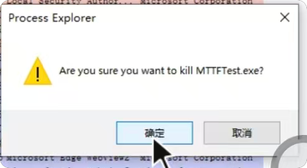

# V2.12.0.30 运行解锁、正常退出与异常停机后重启落地文档

> 来源：V2.12.0.29 现场问题单  
> 实施日期：2026-08-11  
> 落地版本：V2.12.0.30  
> 当前状态：代码已完成，Release 构建及无硬件自动化验证通过；现场硬件验收待执行

> **后续状态（2026-08-11）：** 本文只解决操作解锁，不解决运行中 DAQ 停更和恢复死循环。根因由 V2.12.0.31 承接，详见[无人值守失效复盘及整改验收](../02_Issues/2026-08-11_10358-029_V2.12.0.24与V2.12.0.29无人值守失效复盘及V2.12.0.31整改验收.md)。

## 1. 落地结论

V2.12.0.30 已完成三项操作解锁：

1. Visual Studio 2022 直接生成的 `MTTfTest\bin\Release` 可以运行并开始试验，不再要求从 `artifacts\vs2022` 独立候选目录启动；
2. 操作员明确点击“停止试验”后，再关闭“实时监视”窗口时，上一批次的写盘、压力证据或逻辑清场异常只记录日志，不再弹框阻止关闭；
3. 异常停机后，操作员先点击“停止试验”、再点击“开始试验”，上一批次的压力证据、写盘、数据连续性和逻辑清场未确认项不再阻止新批次启动，新批次改为重新执行实时预检和完整学习。

电机断能命令和程控电源关闭确认仍是同进程重新开始的最低条件。这两项属于真实带电风险，不归入“上一批次历史检查”。

## 2. 问题与修改映射

| 原问题 | V2.12.0.29 行为 | V2.12.0.30 行为 | 主要落点 |
|---|---|---|---|
| VS Release 不能直接运行 | `PackageMutableConfigSetMismatch` 等包校验结果直接拒绝开始 | 包校验保留为发布诊断，不再作为开始许可门禁 | `FrmEpbMainMonitor.BatchGuard.cs`、`MTTfTest.csproj` |
| 停止后点“×”仍不能退出 | 电机/电源回读、压力证据或最后写盘任一未确认均可能弹框并保持窗口 | 已显式停止或控制层已空闲时，异常只写日志，继续释放资源并退出 | `FrmEpbMainMonitor.cs` |
| 异常停机后停止再开始仍失败 | `CanRestartInProcess` 要求物理安全、压力、写盘、数据连续性、逻辑清场全部通过 | 显式停止后只要求电机断能和电源关闭确认；其余旧批次结果不再阻止完整学习启动 | `FrmEpbMainMonitor.cs`、`FrmEpbMainMonitor.BatchGuard.cs`、`EpbManager.BatchStart.cs` |

## 3. 操作员标准流程

### 3.1 从 Visual Studio 2022 直接生成并运行

1. 配置选择 `Release | Any CPU`；
2. 生成 `MTTfTest` 项目或整个 `TfTest.sln`；
3. 直接运行：

   ```text
   D:\Github\wanxiang\EPBTest\MTTfTest\bin\Release\MTTFTest.exe
   ```

4. 不需要复制到 `artifacts\vs2022`，也不需要 `build-identity.json` 或 `SHA256SUMS.txt` 才能开始试验；
5. 若需要正式归档发布，仍可使用 `Tools\Build-Release.ps1` 和 `Tools\Verify-Release.ps1` 生成、核验正式包；正式发布能力没有删除。

### 3.2 异常停机后重新开始

1. 点击“停止试验”；
2. 等待“停止试验”按钮恢复可点击，并观察日志出现以下任一结果：
   - `停止试验完成；可以关闭软件或重新开始。`
   - `停止试验已执行；未确认项已记录，不阻止关闭软件或下一次完整学习启动。`
3. 点击“开始试验”；
4. 程序丢弃上一批次的软件恢复状态，重新执行 DAQ、电源、液压实时预检和完整学习；
5. 新批次建立后，显式停止标记自动清除。

停止流程执行期间，“开始试验”按钮暂时禁用，避免旧暂停检查点与新批次并发。

### 3.3 停止后正常关闭软件

1. 先点击“停止试验”；
2. 等待停止按钮恢复；
3. 点击“实时监视”窗口右上角“×”；
4. 即使最后写盘、压力证据或旧逻辑清场未确认，程序也只记录 `[关闭警告]`，不再弹框阻止退出；
5. 若试验仍处于活动状态且操作员未先点击停止，原有电机/电源安全关闭保护仍生效。

原现场弹框截图保留如下：



## 4. 实现细节

### 4.1 取消包身份硬门禁

- 删除开始按钮入口中对 `ReleasePackageVerifier.VerifyCurrent(...)` 结果的抛异常逻辑；
- 删除普通 Release 构建后的 `RemoveStaleReleasePackageIdentity` 和 `SealVs2022ReleaseCandidate` 目标；
- `ReleasePackageVerifier`、运行身份信息和正式发布核验脚本继续保留，用于诊断和正式归档，不影响普通 VS Release 运行。

### 4.2 显式停止成为操作许可

- “停止试验”改为异步等待 `StopAllAsync(...)`，不再只发起后台停止后立即返回；
- 停止请求发出时立即清除旧暂停恢复检查点；
- 停止期间锁定开始按钮，避免停止与启动重叠；
- 即使停止收尾报告历史异常，操作员的显式停止意图仍保留，供关闭和下一次启动使用。

### 4.3 重启门禁分层

显式停止后可以丢弃的旧批次结果：

- 压力安全证据缺失或陈旧；
- 最后一批 Raw/SQLite 写盘边界未确认；
- 已记录的 DAQ 数据连续性问题；
- 旧恢复任务、活动圈终态等逻辑清场诊断未完全确认。

仍保留的最低条件：

- 电机断能命令已成功提交；
- 程控电源关闭已确认。

新批次仍重新检查：

- 当前 DAQ 是否可用；
- 当前程控电源是否可配置、可回读；
- 当前液压组是否可重建并达到启动条件；
- 当前配置和选中通道是否合法；
- 完整学习至少形成 5 个有效学习圈。

## 5. 验证结果

### 5.1 已完成的自动验证

| 项目 | 结果 |
|---|---|
| `AdaptiveControlTests` Release 编译 | 通过，0 error |
| 无硬件自动化测试 | `PASS 374/374` |
| 显式停止后的历史检查放宽策略 | 通过；只在电机断能和电源关闭均确认时允许放宽 |
| 主程序 `Release | Any CPU` 构建 | 通过，0 error |
| 直接 Release 产物 | `MTTfTest\bin\Release\MTTFTest.exe` |
| 文件版本 / 产品版本 | `2.12.0.30 / 2.12.0.30` |
| VS 候选自动封装目标 | 已移除 |
| 原包门禁提示文本 | 主程序源码中已无匹配 |

构建中仍存在项目原有的未使用字段/变量警告，本次没有新增编译错误。

### 5.2 现场硬件验收清单

以下项目必须在设备空闲、人员可观察电机和电源输出的条件下执行：

1. 从 `MTTfTest\bin\Release\MTTFTest.exe` 启动，确认不再出现 `PackageMutableConfigSetMismatch` 拒绝开始；
2. 正常开始后点击停止，等待按钮恢复，再点击“×”，确认窗口直接关闭且无阻挡弹框；
3. 制造或等待一次可复现的软件异常停机，点击停止，再点击开始，确认进入新的实时预检和完整学习；
4. 检查新运行日志中存在新的 RunId，旧恢复任务不得继续控制新运行；
5. 在程控电源关闭回读确实失败的情况下验证：软件不得直接开始新批次，应保留错误并要求处理真实硬件问题；
6. 检查停止前最后一圈数据：允许最后未闭合圈被标记为失败/作废，但不得计入成功圈数。

## 6. 验收判定

满足以下条件即可接受 V2.12.0.30：

- VS2022 普通 Release 可直接启动并开始试验；
- 显式停止后关闭窗口不再被历史状态弹框阻挡；
- 显式停止后重新开始不再被上一批次的写盘、连续性、压力证据或逻辑状态拒绝；
- 新批次依然执行实时硬件预检和完整学习；
- 自动化测试保持 374/374，通过 Release 构建；
- 现场检查确认没有旧 Run 对新 Run 的迟到控制。

## 7. 回退方式

如现场发现 V2.12.0.30 存在新的控制异常：

1. 点击“停止试验”；
2. 关闭程序；
3. 备份 V2.12.0.30 的运行日志、项目日志和当次数据目录；
4. 恢复上一完整版本目录，不要只覆盖 EXE；
5. 重新启动前确认 12 路电机输出和 4 组程控电源均处于关闭状态。

本次修改没有处理“异常停机本身”的根因；它解决的是异常停机后的操作恢复、正常退出和普通 Release 运行限制。异常停机根因应使用现场日志和对应 RunId 另行闭环。
