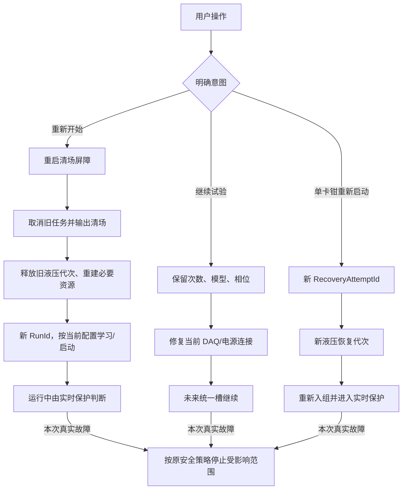

# V2.10.2.7 重启、单卡钳重启与暂停继续受阻根因及整改方案

> 分析日期：2026-08-06  
> 分析对象：MT EPB 常温疲劳测试 V2.10.2.7，试验 `10358-029`  
> 用户目标：重新开始就是重新开始；清掉旧会话造成的阻碍，尽全力恢复运行，真正进入测试后再次出现实时故障再按既有保护停机。  
> 本文状态：**整改方案，等待评审；本次未修改运行代码。**

## 一、评审结论

用户提出的方向正确，V2.10.2.7 当前的启动/恢复逻辑确实设置了过多的“历史状态门禁”，并且其中至少有三项不是现场硬件故障，而是确定的软件状态或判定缺陷：

1. **单卡钳重启确定被旧液压代次挡住。**EPB4 的旧预释放代次冻结成员为 `[4,5]`，单卡钳重启请求成员为 `[4]`，代码复用同一 `Run/液压组/PreRelease/0` 键，因而稳定抛出 `Hydraulic generation members are immutable`。这不是 EPB4 又发生了一次测试故障，而是重启流程没有建立新的液压代次。
2. **新试验继承了旧试验的瞬态报警连续计数。**EPB4 首次累计到 `5/5` 后，后续两个新批次直接记录为 `6/5`、`7/5`。稳定模型参数可以复用，但“连续几圈异常”必须属于当前运行代次；否则新试验第一圈就会被上一次的计数停掉。
3. **DAQ 启动健康检查会把正常的批量回调误判成不连续。**代码每 5 ms 轮询一次，却要求本次看到的序号必须恰好等于上次 `+1`。只要两次轮询之间到了 2～N 个连续批次，就会清零计数并最终报 `DaqRecoveryFreshnessTimeout`。同一缺陷既造成过 01:30 的自动恢复失败，也直接造成 05:56、06:04、06:10 的启动受阻。
4. **电源软件锁存会继承上一次回滚中的取消异常。**启动回滚和 StopAll/通道清理可能重复关闭同一电源；后来的 OFF 操作会取消前一个操作，`OperationCanceledException` 又被当成 `OutputOffUnverified` 锁存。下一次启动在读取当前电源状态前就先因旧锁存被拒绝。
5. **暂停只等待了一条持久化链，没有把 Raw 发布/Raw 写盘链纳入同一个暂停边界。**两次“安全暂停”之后都紧接着发生 Raw 队列满、DAQ 重建和恢复失败。当前代码可以在另一条 Raw 队列已经异常时仍宣布批次 `Paused`。
6. **暂停/恢复检查点还有一个确定的时间解析异常。**`DateTimeStyles.RoundtripKind | DateTimeStyles.AdjustToUniversal` 是 .NET 明确禁止的组合，现场在 05:56 直接抛出了 `ArgumentException`。

同时需要保留一个事实：EPB4 在学习过程中出现的约 11.1～11.5 A 上升停滞是本次真实采样。05:53 首次试验确实连续累计到 5 圈，停止 EPB4 合理；但后续新批次继承为 `6/5`、`7/5`，因此一次新低峰就被立即升级为硬停机，不符合“新试验重新计数”。用户确认后再次点击 RUN 时，程序又没有让 EPB4 真正进入重试，而是先被旧液压成员集合拒绝。

因此整改原则应改为：

> **历史问题留证不留门；用户明确“重新开始”后，程序主动取消旧任务、输出清场、释放旧资源、重建 DAQ、复核当前电源，再创建全新的运行代次。只有本次重建后仍存在的实时不可控故障才阻止上电。进入测试以后，现有电流、压力、电源和 DAQ 安全保护全部保留。**

## 二、证据范围与统计

### 2.1 数据来源

- 用户指定的新日志备份：`\\wj-epb\EPB_Data\10358-029-_V2.10.2.7_0806_0559`
- 06:04 以后仍在写入的活动目录：`\\wj-epb\EPB_Data\10358-029`
- 首次全部停止的备份：`\\wj-epb\EPB_Data\10358-029_V2.10.2.7_0806_0549`
- 用户提供的 6 张现场截图
- 当前工作区源码。现场堆栈中的 `EpbManager.BatchStart.cs:165/409` 与当前源码对应，说明启动预检链路可直接对照。

目录名和界面均显示 V2.10.2.7，但现场包没有独立保存 EXE 哈希；因此本文对“现场二进制与当前工作区逐字节一致”不作无证据保证。日志中的方法名、行号和实际行为与当前相关源码一致，不影响下述根因判断。

### 2.2 合并两段新日志后的结果

| 指标 | 次数 | 说明 |
|---|---:|---|
| 用户发起批量启动 | 9 | 05:52～06:16 |
| 明确批量启动失败 | 5 | 3 次 DAQ，1 次低电压，1 次旧电源锁存 |
| 部分启动 | 3 | EPB4 被隔离，其他 5 个通道运行 |
| 六通道完整启动 | 1 | 06:16:37 发起，06:18:36 完成 |
| EPB4 单通道 RUN 失败 | 7 | 7 次均为同一个液压成员不可变异常 |
| 安全暂停完成 | 2 | 05:55、06:15 |
| 暂停后 DAQ 恢复失败提示 | 6 | 两个暂停窗口均出现 |

同一台架在 06:16:37 再次启动后，06:18:36 六通道全部进入正式运行，日志至少持续到 06:55。这证明此前多次“启动受阻”不能解释为设备一直不具备启动条件；软件清理/判定状态对结果有决定性影响。

## 三、现场时间线

| 时间 | 用户动作/系统事件 | 判断 |
|---|---|---|
| 05:52:32 | 启动 4、5、8、9、10、11，执行 10 圈学习 | 启动入口正常进入实际测试 |
| 05:53:27 | EPB4 连续 5 圈正向电流上升停滞，峰值 11.145 A，低于 14.2 A 下限 | **真实的本次通道故障**，隔离 EPB4 合理 |
| 05:54:19、05:54:58、05:55:16 | 三次点击 EPB4 RUN | 均在测试前被旧液压代次 `[4,5] → [4]` 拒绝 |
| 05:55:28～05:55:33 | 请求暂停，界面提示安全暂停完成 | 表面成功 |
| 05:55:59～05:56:20 | Raw/持久化队列异常、DAQ 重建、Dev1/Dev2 恢复失败；检查点时间解析异常 | 暂停边界没有真正覆盖全部后台链路 |
| 05:56:43 | 用户停止 | StopAll 分项确认成功 |
| 05:56:45 | 立即重新开始 | Dev1 `Fresh=1/3`、Dev2 `Fresh=0/3`，被启动健康检查拒绝 |
| 06:04:43 | 重新打开软件后开始 | Dev2 `Fresh=0/3`，再次被拒绝 |
| 06:05:48 | 再次开始 | DAQ 已通过；电源 3 开启后第一次回读 5.856 V，被立即判失败 |
| 06:05:57 | 启动回滚 | 电源 4 关闭操作得到“已取消一个任务”，软件锁存故障 |
| 06:06:18 | 再次开始 | DAQ 已通过，但在读取本次电源状态前被“电源组4故障已锁存”拒绝 |
| 06:07:12 | 再次开始 | 成功进入学习；EPB4 本次低峰被旧连续计数记成 `6/5`，立即隔离 |
| 06:08:17、06:09:29、06:10:09 | 三次点击 EPB4 RUN | 仍全部被旧液压代次拒绝 |
| 06:10:27 | 用户停止 | StopAll 分项确认成功 |
| 06:10:47 | 重新开始 | Dev1 `Fresh=0/3`，再次被 DAQ 健康检查拒绝 |
| 06:11:24 | 关闭并重新打开软件 | 关闭时 StopAll 三项均确认 |
| 06:11:54 | 再次开始 | 启动成功；EPB4 本次低峰又被旧连续计数记成 `7/5`，立即隔离 |
| 06:14:44 | 点击 EPB4 RUN | 第 7 次被旧液压成员集合拒绝 |
| 06:15:15～06:15:30 | 第二次暂停 | 又出现 Raw 队列满、DAQ 恢复与电源遥测陈旧，随后 Dev1/Dev2 恢复失败 |
| 06:16:04 | 用户停止 | StopAll 三项确认成功 |
| 06:16:37～06:18:36 | 再次重新开始 | DAQ、电源、学习全部完成，六通道进入正式运行 |

## 四、现有逻辑为什么会过度阻碍

### 4.1 单卡钳重启复用了不允许改变成员的旧代次

`HydraulicGroupCoordinator.EnterGenerationAsync` 使用 `HydraulicGenerationKey` 在 `_generations` 中 `GetOrAdd` 状态，并要求同一键的成员永久相同：

- 原批次预释放键：`RunId/液压组1/PreRelease/0`
- 原成员：`[4,5]`
- EPB4 报警后恢复仍调用 `PreReleaseBatchWithPlanAsync(new[] { 4 }, ...)`
- 恢复请求成员：`[4]`

同一 Key 的成员不同，代码必然抛出异常。`_generations` 在成功、失败和 ForceRelease 后都没有删除已结束状态；报警恢复也没有使用新的 `Recovery` 代次键。因此用户重试多少次，结果都相同。

这条链路涉及：

- `Controller/HydraulicGroupCoordinator.cs`：`EnterGenerationAsync`、`ForceReleaseAsync`、`CompleteGenerationReleaseAsync`、`FailGenerationAsync`
- `Controller/EpbManager.PauseResume.cs`：`ResumeAlarmStoppedChannelAsync`
- `Controller/EpbManager.cs`：液压参与者集合

### 4.2 瞬态报警 streak 被错误持久化到新运行

现场顺序很清楚：

- 05:53:27：EPB4 `ForwardCurrentRiseStalled` 为 `5/5`；
- 06:07:28：新批次第一次确认低峰时直接为 `6/5`；
- 06:12:09：再次新批次时直接为 `7/5`。

`Config/EpbAdaptiveProfiles.cs` 把 `ConsecutiveForwardStallCount`、`ConsecutiveForwardOvershootCount`、`ConsecutivePeakEvidenceMismatchCount` 等连续计数与稳定模型一起保存/复制；`_alarmStopLatch.BeginRun(channel)` 只重置停机锁存，没有重置这些模型内的瞬态计数。

需要明确分层：

- 可跨暂停/继续复用：稳定峰值、时长、断电点、有效样本统计等模型参数；
- 只属于当前运行代次：连续低峰、连续超调、连续证据偏差等 streak；
- Fresh Start 和单卡钳“重新启动”必须把瞬态 streak 清零；
- 同一会话的正常暂停/继续可以保留 streak。

### 4.3 DAQ“连续新鲜”算法观察错了对象

`IO.NI/TwoDeviceAiAcquirer.cs` 的三段健康/恢复逻辑都存在相同条件：

```text
next.LastProcessedSequence == lastSequence + 1
```

轮询间隔是 5 ms，但 DAQ 回调与后台处理可能在两次轮询之间推进多个连续序号。观察者从 N 看到 N+2，只能证明“观察者错过了中间快照”，不能证明生产者丢了 N+1。当前代码却清零 `freshCount`，最终返回 `DaqRecoveryFreshnessTimeout`。

受影响位置：

- 已经新鲜时的快速复核：约 1861～1898 行
- 重建后的恢复复核：约 1948～1993 行
- 启动前健康检查：约 2045～2080 行

`EpbManager.EnsureDaqReadyBeforeStartAsync` 要求 3 个新鲜回调、最大年龄 100 ms、总超时 3 s。这个门槛本身不算高，真正的问题是计数算法把正常 `+N` 推进当成失败。

### 4.4 “重新开始”没有统一的清场事务

现在的批量启动只清理了部分内存状态：

- 新建 `_activeBatchId`
- 清 `_emergencyPowerGroupLatch`
- 清 DAQ 恢复尝试次数
- 启动失败后对每个通道 Stop，再调用一次 StopAll

但“停止正在结束”“通道收尾”“电源回滚”“DAQ 自恢复”“液压代次”分别有自己的异步任务。`EndBatchSession` 在 StopAll 前段就把批次标记为空闲，用户很快再次点击开始时，旧清理任务仍可能继续操作同一资源。

这里缺少的不是更多拒绝条件，而是一个统一的 **Restart Barrier（重启清场屏障）**：用户点击重新开始后，由程序等待/取消旧任务并主动修复状态，完成后自动继续启动，而不是逐项弹出“不能开始”。

### 4.5 电源把软件取消当成了当前硬件故障

`PowerSupplyCoordinator` 有三处会放大重启困难：

1. `PrepareAndEnableAsync` 先检查 `_faultedGroups`，发现旧锁存立即抛错，尚未读取本次实时状态。
2. `DisableGroupAsync` 先取消该组当前操作；关闭过程中任何异常（包括取消）都会触发 `OutputOffUnverified` 并写入故障锁存。多个回滚/StopAll 同时请求 OFF 时，安全方向一致的两个 OFF 也会互相取消。
3. 输出 ON 后只读一次快照，5.856 V 立即低于 6.000 V 就失败；运行监控对低电压使用持续时间判定，启动阶段反而没有上升稳定窗口。

现场 06:05:51 已有电源 2、4 接管成功，电源 3 单次低电压导致整批回滚；随后电源 4 的 OFF 被取消并形成锁存，06:06 又被历史锁存阻止。06:06:16 的 StopAll 已确认电源关闭，06:07:16 三个电源又都成功接管，支持“旧软件锁存不应继续作为新启动门禁”的结论。

### 4.6 暂停完成条件没有覆盖完整的数据链

`CompletePauseSafetyBoundaryAsync` 当前依次做：

1. 电机高优先级 OFF；
2. 液压释放；
3. `_persistence.DrainAsync(10000)`；
4. `Recorder.FlushRecent(channel, 10)`。

但实时 Raw 数据还有另一条明确的链路：

`TwoDeviceAiAcquirer._rawPublicationQueue → OwnedRawBatchReady → _daqDev1/_daqDev2.EnqueueRawData`

暂停边界没有等待 `_rawPublicationQueue`、其 in-flight 订阅，也没有等待 `_daqDev1/_daqDev2` 自身的 Raw 写盘队列。现场两次暂停都在这一窗口触发 `RawPersistenceQueueFull`，随后软件把“后台写盘队列满”升级成 DAQ 硬件重建；而 DAQ 重建又遇到错误的新鲜度算法，最终变成恢复失败。

从现有证据可以确认“暂停边界漏掉了第二条队列”；Raw 队列为何在该秒达到上限，还需整改后的队列水位测试进一步量化，不能无证据只归因于单个函数。

### 4.7 检查点时间解析会直接抛异常

`MTTfTest/UnattendedRecovery.cs` 当前使用：

```csharp
DateTimeStyles.RoundtripKind | DateTimeStyles.AdjustToUniversal
```

该组合不合法，现场 05:56:00 已按这行代码抛出 `ArgumentException`。这会打断暂停检查点/恢复协调流程，是独立的确定缺陷。

## 五、重新定义三种用户意图

必须在产品语义上把三种操作分开，不能再让一个“开始”入口根据大量旧状态猜测用户意图。

| 用户入口 | 语义 | 保留内容 | 必须丢弃/重建的内容 |
|---|---|---|---|
| 重新开始 | 新试验、新会话 | 历史数据、报警证据；项目配置；按配置决定是否重新学习 | 旧运行 ID、旧取消源、旧定时器、旧液压代次、旧参与者集合、旧恢复任务、软件故障锁存、暂停检查点 |
| 继续试验 | 延续一次明确的正常暂停 | 正式次数、稳定模型、原错峰计划、通道集合 | 暂停期间失效的 DAQ/连接对象；已结束的液压代次 |
| 单卡钳重新启动 | 当前批次中让一个已停通道重新入组 | 该通道剩余次数、可用的稳定模型、原电气相位 | 该通道旧报警代次、旧液压预释放键、旧 Runner/Timer/停止源 |

建议按钮文案直接表达意图：

- 空闲/停止后：`重新开始`
- 正常暂停后：`继续试验`
- 通道报警停机后：`重新启动`
- 运行中：`暂停试验`
- `停止试验` 始终保留为立即安全停止

检查点、哈希、5 分钟等条件只用于决定“能否沿用旧模型继续”，**不能阻止用户重新开始**。如果继续条件不满足，界面应自动提示“旧检查点不可沿用，已转为重新开始并执行完整学习”，而不是让用户停在错误弹框中。

## 六、建议的目标状态机



## 七、具体代码整改方案

### P0-1：增加统一重启清场屏障

建议新增 `EpbManager.Restart.cs`，提供唯一入口：

```csharp
Task<RestartResult> RestartFreshAsync(RestartRequest request, CancellationToken token);
```

所有全局重新开始都按以下顺序执行，UI 不需要用户逐项处理：

1. 取得 `_lifecycleGate`。若上一条停止/暂停/启动仍在进行，显示“正在清理并重新开始”，等待它退出，不弹“已有试验”错误。
2. 增加全局 `LifecycleEpoch`；取消并等待旧批量启动、通道恢复、DAQ 恢复、暂停和资格圈任务。旧任务醒来后必须检查 epoch，禁止再提交状态。
3. 对所有已知通道发送高优先级 OFF；同一电源组的多个 OFF 请求合并为一个操作。
4. 强制释放两个液压组并确认安全压力；结束旧运行的全部液压代次。
5. 关闭需要关闭的程控电源，并用一次最终、不可被同方向 OFF 取消的短超时回读确认。
6. 排空或按明确 cutoff 丢弃旧会话尚未写入的新数据；旧数据保留故障留证，不允许进入新试验圈。
7. 清理旧 Timer、Runner、停止源、暂停源、参与者集合、运行上下文、软件报警锁存、瞬态 streak 和暂停检查点；稳定模型数据按新试验配置决定是否保留或重新学习。
8. 为本次操作创建新的 RunId、CancellationTokenSource 和错峰计划。
9. 主动执行一次 DAQ/电源资源准备；准备完成后自动继续启动，不要求用户再点一次。

`StopAllAsync` 仍负责安全停机，但“重新开始”不能只依赖上一次 StopAll 是否恰好完整收尾。重启屏障必须幂等地再次执行必要清场。

### P0-2：修复 DAQ 新鲜度判定

不能再用低频轮询观察值是否逐次 `+1`。建议在 DAQ 生产/控制消费侧维护：

- 当前 generation；
- 最后处理序号；
- generation 内累计处理批次数；
- generation 内真实缺号计数；
- 最后回调和最后控制处理的单调时间。

健康检查记录起始快照，之后满足以下条件即可累计进度：

```text
generation 不变
LastProcessedSequence > 起始 LastProcessedSequence
ProcessedBatchCount 增加
SequenceGapCount 未增加
最后控制样本年龄在允许范围内
```

如果一次轮询从 N 看到 N+3，并且生产侧缺号计数不变，应累计 3 个新批次，而不是清零。需要统一替换 `TwoDeviceAiAcquirer.cs` 中约 1868、1956、2061 行的三套重复逻辑，最好抽成一个 `VerifyFreshProgressAsync`，避免以后修一处漏两处。

显式重新开始时的 DAQ 策略：

1. 先观察当前 generation 的实时进度，健康则立即通过；
2. 不健康时自动 Stop/Start 对应设备一次；
3. 新 generation 有实时控制进度则通过；
4. 只有设备创建失败、物理设备缺失或重建后完全没有控制样本，才阻止上电。

### P0-3：让单卡钳重启使用全新恢复代次

`ResumeAlarmStoppedChannelAsync` 不得再调用会复用 `PreRelease/0` 的旧路径。建议：

1. 每次点击“重新启动”生成唯一 `RecoveryAttemptId` 或单调递增的 `RecoverySlot`；
2. 使用 `HydraulicPhaseKind.Recovery`，键至少包含 `RunId/RecoveryAttemptId/液压组`；
3. 该恢复定位的成员就是本次真正参与定位的通道，EPB4 单通道为 `[4]`；
4. 定位结束后从当前批次下一个未来正式槽重新加入，正式圈继续按当前运行通道快照协调；
5. `CompleteGenerationReleaseAsync`、`FailGenerationAsync` 和 `ForceReleaseAsync` 完成后，用 Key+State 实例条件删除 `_generations` 项；
6. 增加 `RetireRun(Guid runId)`，StopAll/重新开始时清除旧 Run 的全部已完成与未完成代次。

原“成员冻结”约束在一个正在执行的代次内仍然保留；整改的是代次生命周期和恢复键，不是允许在同一次建压过程中随意改成员。

EPB4 若重新进入测试后仍出现 11 A 上升停滞，现有连续故障保护应再次停止 EPB4；这正是“真的在测试过程中报错再停止”。

### P0-4：稳定模型与瞬态报警计数分离

修改 `Config/EpbAdaptiveProfiles.cs` 和 Runner 初始化逻辑：

1. 为模型增加 `ResetTransientEvidence()`，统一清零连续低峰、连续超调、连续快慢峰偏差以及其他仅用于当前 Run 判定的 streak。
2. Fresh Start 在创建新 RunId 后、进入第一圈前，对选中通道调用一次；单卡钳“重新启动”对该通道调用一次。
3. 正常暂停/继续不调用，避免把同一试验的连续证据人为截断。
4. 从磁盘加载旧模型时默认不加载旧版 schema 中的瞬态 streak；旧字段可以保留用于历史兼容，但不能成为新 Run 的活动计数。
5. 日志同时记录 `ModelReused=true/false` 与 `TransientStreaksReset=true`，避免“沿用模型”被误解为“沿用上次报警次数”。

### P0-5：电源按当前物理状态自动解除软件锁存

修改 `PowerSupplyCoordinator`：

1. `PrepareAndEnableAsync` 遇到 `_faultedGroups` 时，不先抛错；先执行 `ProbeAndResetForExplicitRestartAsync(group)`。
2. 如果实时回读为 OUTP OFF、无硬件 Protection Trip、设备身份正确，则自动清除软件锁存并继续预检。
3. 如果硬件保护仍为触发状态，才阻止本次启动并提示真实保护位。
4. 多个 OFF 请求必须合并：已有 OFF 在执行时，后来的 OFF 等待同一个任务，不得取消同方向安全操作。
5. 只有最终回读仍 ON、通信完全不可达或硬件保护触发，才产生 `OutputOffUnverified`；单纯 `OperationCanceledException` 不得直接锁存。
6. OUTP ON 后增加稳定窗口。先等待电压上升，要求在例如 1～2 s 内达到下限并连续 3 个样本稳定；5.856 V 后继续上升到 12 V 应通过，持续低于 6 V 才失败。
7. 启动回滚只由一个 owner 关闭本次已经开启的组；通道收尾和 StopAll 加入该任务，不重复互相取消。

稳定时间应来自配置并通过现场电源实测确定，不能简单取消低压、过流或 Protection Trip 保护。

### P0-6：把两条 Raw/持久化链纳入暂停边界

新增统一接口，例如：

```csharp
Task<PersistenceBoundaryResult> QuiesceAtCutoffAsync(
    DateTime cutoffUtc,
    CancellationToken token);
```

优雅暂停顺序改为：

1. 原子禁止所有通道取得下一圈执行权；
2. 已开始的正式圈自然完成并封圈；
3. 记录统一 cutoff UTC/sequence；cutoff 之后不再接纳为本次试验数据，但 DAQ 控制采样可继续用于安全监测；
4. 电机 OFF、液压释放；
5. 同时等待以下对象排空：
   - `DaqPersistenceCoordinator` 的 Dev1/Dev2 队列与 in-flight；
   - `TwoDeviceAiAcquirer._rawPublicationQueue` 与 `_rawPublicationInFlight`；
   - `_daqDev1/_daqDev2` Raw 写盘队列与 in-flight；
6. 排空后再导出最近 10 个完整圈；导出采用有界并发或顺序执行，不与恢复关键路径争抢磁盘和内存；
7. 最后写原子暂停检查点，所有步骤成功后才发布 `BatchPauseState.Paused`。

“用户主动暂停并正在排空”必须与“运行中队列意外满”区分。主动暂停期间不得因为队列正在正常下降就启动 DAQ 硬件重建；若排空超时，应保持输出安全并明确提示存储异常，不能一边宣布暂停成功一边进行 DAQ 恢复。

### P0-7：简化继续试验

同进程正常暂停后的继续不再使用“5 分钟”作为硬门：

1. 保留原模型、正式次数、相位计划和通道集合；
2. 自动恢复两条持久化链的 admission；
3. DAQ 不健康时按修正后的算法自动重建；
4. 电源输出若已关闭，则按当前物理状态自动准备和开启；若仍开启则实时复核；
5. 为未来圈建立新的液压正式代次，从下一个统一未来槽继续；
6. 第一圈开始以后仍使用完整的实时安全保护。

进程退出后的继续可以保留 1～2 圈资格复核，但它只是“是否沿用旧模型”的选择：

- 检查点可信：自动执行 1～2 圈后继续；
- 检查点不可信：自动转为重新开始/完整学习；
- 两种情况都不应让用户卡在“禁止启动”。

### P0-8：修复检查点 UTC 解析

建议改为 `DateTimeOffset.TryParse`：

```csharp
DateTimeOffset.TryParse(
    value,
    CultureInfo.InvariantCulture,
    DateTimeStyles.RoundtripKind,
    out var timestamp);
utc = timestamp.UtcDateTime;
```

不要再组合 `RoundtripKind` 与 `AdjustToUniversal`。

### P1：UI 与日志只展示一个可行动结论

启动/恢复期间不要连续弹出多个底层异常。界面固定显示：

- `正在清理旧试验…`
- `正在重建采集…`
- `正在准备电源…`
- `正在启动卡钳…`
- `已开始` 或唯一的最终失败原因

旧报警可在详情和日志中查看，但按钮主状态由本次 `RestartAttemptId` 决定。旧 epoch 的异步事件不得覆盖新一次启动的 UI。

建议为每次重启记录一行汇总：

```text
RestartAttempt=<id> Intent=FreshStart
Cleanup=OK Daq=Rebuilt/OK Power=Reset/OK Hydraulic=Retired/OK
StartedChannels=[...] ElapsedMs=...
```

## 八、允许阻止启动的最小条件

“尽全力重启”不等于取消实时安全保护。建议只保留以下当前时刻、不可替代的硬门：

| 硬门 | 为什么必须保留 | 处理方式 |
|---|---|---|
| 当前配置无效或通道没有必要映射 | 程序不知道控制哪个 I/O | 明确提示配置项，不继承旧运行状态 |
| DAQ 设备无法创建，强制重建后完全没有控制样本 | 无法监测电流/压力，进入测试也无法及时保护 | 自动重建一次；仍无数据才阻止 |
| 电源不可通信、当前硬件保护仍触发或输出命令无法得到最终回读 | 无法证明供电可控 | 自动连接、清软件锁存、重试；真实硬件问题才阻止 |
| 重新上电前无法让电机 OFF 或液压回到安全状态 | 可能在未知带载状态再次动作 | 自动重复安全清场；仍不可确认才阻止 |

以下内容不得阻止“重新开始”：

- 上一次通道报警；
- 上一次 DAQ 恢复失败；
- 上一次软件电源锁存；
- 旧暂停检查点或哈希不匹配；
- 旧液压 generation 成员集合；
- 旧 Timer/Runner/取消源；
- “暂停超过 5 分钟”；
- 旧模型不可用。旧模型不可用只意味着按配置重新学习。

## 九、文件级改动清单

| 文件 | 需要修改的重点 |
|---|---|
| `Controller/EpbManager.BatchStart.cs` | 新启动统一走 Restart Barrier；预检失败不遗留旧批次；检查点不可信自动转完整学习 |
| `Controller/EpbManager.cs` | Start/Stop/Pause/Resume 共用生命周期 gate/epoch；StopAll 与马上重启可串行衔接；清理运行上下文 |
| `Controller/EpbManager.PauseResume.cs` | 单卡钳恢复改为唯一 Recovery 代次；简化继续；暂停等待全部数据链 |
| `Controller/HydraulicGroupCoordinator.cs` | 完成后移除 generation；增加 RetireRun；恢复键唯一；保持单代次成员冻结 |
| `Config/EpbAdaptiveProfiles.cs`、`Controller/EpbCycleRunner.Adaptive.cs` | 稳定模型与当前 Run 的瞬态 streak 分离；Fresh Start/单卡钳重启清零 streak |
| `IO.NI/TwoDeviceAiAcquirer.cs` | 三处 `sequence == last + 1` 统一改为生产侧连续性/进度验证；提供 Raw publication 排空状态 |
| `Controller/DaqPersistenceCoordinator.cs` | cutoff/quiesce/resume 明确化；提供可聚合的排空结果 |
| Raw 写盘对象及其调用位置 | 暴露 Dev1/Dev2 队列和 in-flight 排空；主动暂停不触发硬件恢复 |
| `Controller/PowerSupplyCoordinator.cs` | 当前状态自动解软件锁存；OFF 合并；取消不直接锁存；上电稳定窗口 |
| `MTTfTest/UnattendedRecovery.cs` | 修复 UTC 解析；检查点失败自动降级为 fresh start |
| `MTTfTest/FrmEpbMainMonitor.BatchGuard.cs` | 明确“重新开始/继续试验”；等待自动清理，不让用户重复点 |
| `MTTfTest/FrmEpbMainMonitor.PauseResume.cs` | 单通道按钮使用 RestartAttempt；最终状态只接受当前 epoch |

## 十、必须补充的自动化测试

### 10.1 DAQ

1. 轮询分别看到 `N→N+1`、`N→N+2`、`N→N+3`、`N→N+20`，生产侧无缺号时全部通过。
2. 生产侧真实缺号计数增加时必须失败。
3. Dev1/Dev2 各强制重建 20 次，健康设备 20/20 在超时内恢复，不出现 `Fresh=0/3`。
4. 旧恢复任务晚于新 RestartAttempt 返回时，结果必须被 epoch 丢弃。

### 10.2 单卡钳重启

1. EPB4/5 原预释放成员 `[4,5]`，EPB4 报警后连续执行 20 次重新启动尝试，不得再出现 `members are immutable`。
2. EPB4 重启期间 EPB5 正常运行，EPB5 不被重新编号、不被停止。
3. EPB4 恢复后的第一圈再次出现真实上升停滞时，只停止 EPB4并留下新证据。
4. 成功、失败和 StopAll 后 `_generations` 不保留已结束 Run 的项目。
5. 加载一个 `ConsecutiveForwardStallCount=5` 的旧模型后执行单卡钳重新启动，稳定参数保留，但新 Run 的 streak 必须从 0 开始；重新测试连续 5 次异常后才能再次硬停机。

### 10.3 停止后立即重新开始

对学习中、正式运行中、暂停中、DAQ 恢复中、启动回滚中五种状态分别执行 20 次：

`停止 → 1 秒内重新开始`

要求：

- 不提示“已有批次”“故障已锁存，必须人工复位”“已取消一个任务”；
- UI 自动等待清场并继续本次启动；
- 健康硬件下 10 秒内进入学习/启动定位；
- 旧任务不覆盖新 Run 的状态。

### 10.4 电源

1. 模拟电压 `5.856 → 8 → 12 V` 在稳定窗口内上升，启动通过。
2. 持续低于 6 V 超过配置时间，启动失败。
3. 三个并发 OFF 请求合并为一次操作，不互相取消、不产生软件锁存。
4. 旧 `OutputOffUnverified` 锁存存在，但本次回读为 OFF 且无保护，自动清锁并启动。
5. 硬件 Protection Trip 仍在时必须阻止启动。

### 10.5 暂停与继续

1. Raw 和持久化队列分别预填至 70%，点击暂停后两条链均排空，才发布 `Paused`。
2. 暂停期间不得出现 `RawPersistenceQueueFull → DAQ重建` 链。
3. 最近 10 圈导出完整，暂停前最后一圈只记一次。
4. 同进程暂停 1 分钟、10 分钟、60 分钟均可一次点击继续；次数和模型不清零。
5. 软件重启后检查点有效则执行 1～2 圈复核；无效则自动完整学习，不显示“禁止启动”。
6. Fresh Start 清零瞬态 streak；同一 Run 的暂停/继续保留 streak，两种语义不得混淆。

## 十一、现场验收标准

建议下一候选版本至少完成以下验收后再替换现场：

1. 六通道进行不少于 30 轮“开始—停止—立即重新开始”，健康硬件条件下成功率 30/30。
2. EPB4 人工故障注入并解除 10 次，每次单卡钳重新启动都能真正进入定位/试验，不出现旧成员异常。
3. 两条 DAQ 各软件重建 20 次，连续批次场景恢复成功率 20/20。
4. 六通道连续运行至少 4 小时，期间执行暂停/继续 10 次，无 Raw 队列满、无错误 DAQ 恢复、无次数倒退或重复记账。
5. 断开 DAQ、保持电源保护触发、阻断电源通信、模拟压力无法安全回零，四类真实不可控故障仍能阻止启动并给出唯一明确原因。
6. 所有旧报警和清场结果保留在日志/快照中，但不再显示为新 Run 的活动状态。

## 十二、实施顺序与交付物

建议按以下顺序实施，避免只修表象：

1. **第一批 P0：**DAQ 新鲜度算法、单卡钳 Recovery 代次、generation 生命周期、瞬态 streak 清理、UTC 解析。
2. **第二批 P0：**Restart Barrier、Stop/Start epoch、程控电源 OFF 合并与自动清锁。
3. **第三批 P0：**暂停的双数据链 quiesce/drain、继续试验简化。
4. **P1：**按钮文案、单一进度提示、RestartAttempt 汇总日志和诊断快照。
5. 补齐自动化测试、仿真压力测试、现场硬件验收记录，再提升版本并打包。

每一批交付应包含：代码 diff、自动化测试结果、现场复测日志、失败注入记录和版本号，不应仅修改阈值或延长超时。

## 十三、不建议采用的处理

- 不建议只把 DAQ 3 s/10 s 超时调长；判定算法错误时，延长时间仍会反复清零。
- 不建议删除电流、压力、硬件保护和断电确认；这些是进入测试后的必要保护。
- 不建议允许同一个正在执行的液压代次随意改变成员；应建立新代次并正确回收旧代次。
- 不建议要求用户反复关闭软件、手工双击电源组复位或多次点击开始；这些动作只是在偶然等待旧任务退出。
- 不建议把暂停等同于停止；暂停应保存会话，停止后的重新开始应丢掉会话状态。
- 不建议继续用旧报警状态决定新 Run 的 UI；新 Run 只接受当前 RestartAttempt/epoch 的状态事件。

## 最终建议

批准以下产品口径后再实施代码：

1. **重新开始：**旧问题只留证，程序自动清场并建立全新 Run；模型不可用就重新学习，不阻止开始。
2. **继续试验：**保留次数、模型和相位，自动修复当前资源后继续，不再用 5 分钟作为硬门。
3. **单卡钳重新启动：**每次建立唯一恢复代次，让卡钳真正进入重试；本次测试再报错才重新停止。
4. **最小安全门：**只保留本次重建后仍存在的配置不可用、DAQ 完全无控制样本、电源真实不可控/硬件保护、输出或压力无法安全清场。

这套方案没有降低测试过程中的保护强度，整改的是“开始之前被旧状态反复拒绝”的问题。它把用户反复尝试的动作变成一次明确请求：**点一次重新开始，软件负责把能够自动恢复的都恢复；确实不能安全控制时，才给出一个最终失败原因。**
