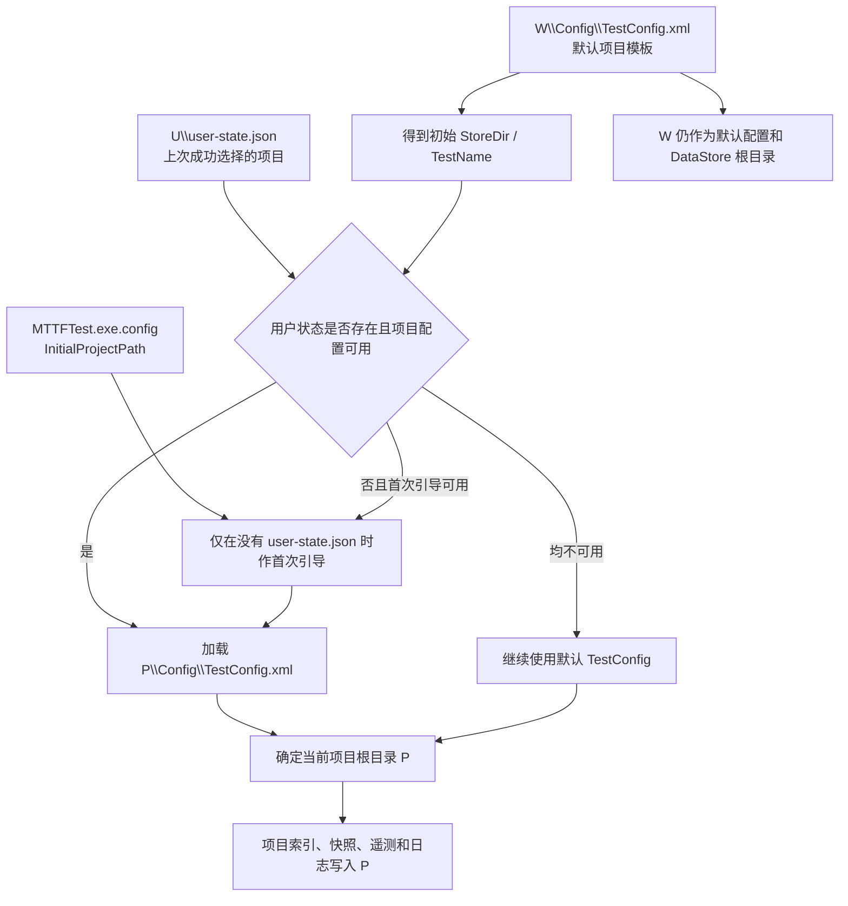
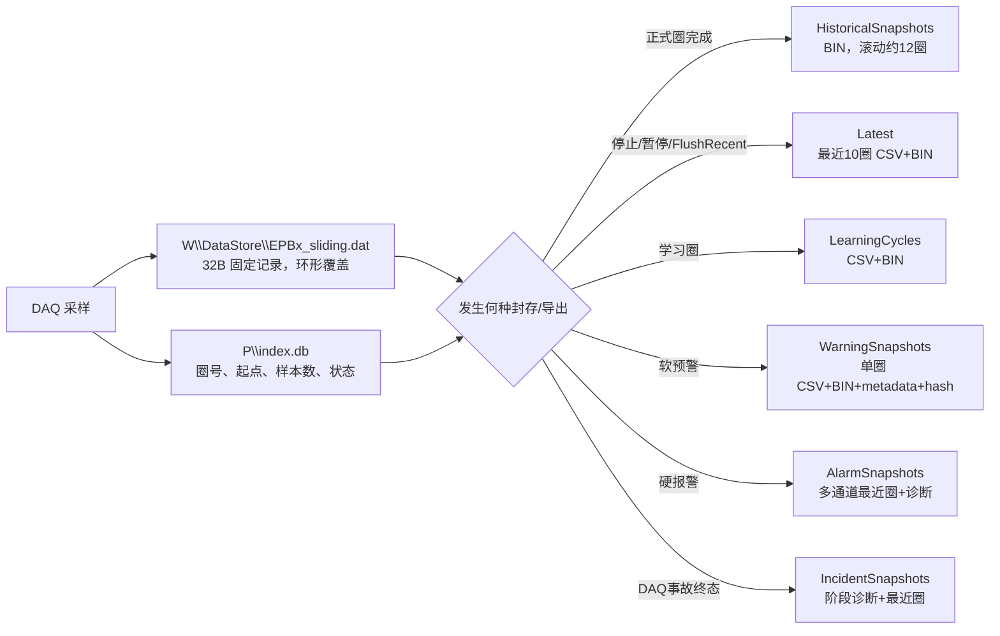

# 当前程序数据存储路径详细说明

> 文档日期：2026-08-07  
> 适用范围：当前 `EPBTest / MTTFTest` 代码分支  
> 文档目的：说明当前程序实际使用的配置、原始环形数据、索引、圈快照、报警证据、事故证据、遥测、日志、用户状态和异常回退路径。本文只描述当前实现，不代表后续目录整改方案。

## Technical Summary

当前程序的数据并不全部写在一个目录，而是分散在四类根位置：

1. **程序工作目录 `W`**：保存默认配置和 12 路固定大小的环形 `.dat` 文件；
2. **当前项目目录 `P`**：保存项目配置、`index.db`、Latest、学习圈、各类快照、遥测和项目日志；
3. **Windows 用户状态目录 `U`**：保存“最后选择的项目”和无人值守恢复检查点；
4. **临时/程序目录回退区**：只在 Incident 快照写入项目目录失败时使用。

最需要注意的是：

- 当前项目根目录为 `P = StoreDir\TestName`；
- 环形原始文件却固定写入 `W\DataStore`；
- **切换项目只会切换 `P`，不会切换 `W\DataStore`**；
- 项目导出的 CSV/BIN 由 `index.db` 中的圈边界从本机环形 `.dat` 读取生成；
- 程序启动时，最终项目可能被用户状态文件覆盖，因此不能只看软件目录里的默认 `TestConfig.xml` 判断当前项目。

## 1. 路径变量定义

本文使用以下缩写：

| 缩写 | 含义 | 当前代码来源 |
|---|---|---|
| `W` | 程序当前工作目录，即 `Environment.CurrentDirectory` | 启动方式、快捷方式“起始位置”或进程工作目录决定 |
| `S` | 数据存储根目录，即 `TestConfig.StoreDir` | 默认或当前项目 `TestConfig.xml` |
| `T` | 当前项目/试验名称，即 `TestConfig.TestName` | 默认或当前项目 `TestConfig.xml` |
| `P` | 当前项目根目录，`P = S\T` | `ConfigLoader.GetProjectRootDir()` |
| `C` | 项目配置目录，`C = P\Config` | `ConfigLoader.GetProjectConfigDir()` |
| `U` | `%LOCALAPPDATA%\Wanxiang\EPBTest` | Windows 当前用户的本地应用数据目录 |
| `TMP` | `%TEMP%` | `Path.GetTempPath()` |
| `B` | 程序 EXE 所在目录 | `AppDomain.CurrentDomain.BaseDirectory` |

如果现场配置为：

```text
StoreDir = \\wj-epb\EPB_Data
TestName = 10358-029_V2.11.0.3_0807_1111
```

则：

```text
P = \\wj-epb\EPB_Data\10358-029_V2.11.0.3_0807_1111
```

仓库内默认模板当前写的是：

```text
StoreDir = D:\EPB_Data
TestName = EPB_Fatigue
```

但该默认值可能在程序启动时被上次项目选择覆盖。

## 2. 启动时如何确定当前项目



启动顺序如下：

1. 从 `W\Config` 加载 `AOConfig.xml`、`DOConfig.xml`、`TestConfig.xml` 和 `UiConfig.xml`；
2. 主程序尝试读取 `U\user-state.json`；
3. 如果用户状态文件不存在，才使用 `MTTFTest.exe.config` 中的 `InitialProjectPath` 作为首次引导；
4. 只有目标项目的 `P\Config\TestConfig.xml` 存在并可解析时，才恢复该项目；
5. 最终使用的项目配置替换内存中的默认 `TestConfig`；
6. 程序把 `ConfigLoader.CurrentProjectRootDir` 设置为 `P`，项目日志随后开始写入 `P\log`；
7. 如果项目第一次使用，程序会创建 `P\Config\TestConfig.xml`，并将 12 路运行进度清零但保留目标次数。

当前 `MTTFTest.exe.config` 中的首次引导值为：

```text
D:\EPB_Data\10358-029
```

该值不是每次启动都强制使用；一旦 `user-state.json` 已成功保存，后续优先恢复用户状态中的项目。

## 3. 当前完整目录结构

下面是当前代码可能形成的完整结构。并非每个项目都会同时出现所有目录；部分目录只在对应事件发生后创建。

```text
W\
├─ Config\
│  ├─ AOConfig.xml
│  ├─ DOConfig.xml
│  ├─ TestConfig.xml
│  ├─ UiConfig.xml
│  ├─ AlarmConfig.xml
│  └─ PowerSupplyConfig.xml
├─ DataStore\
│  ├─ EPB1_sliding.dat
│  ├─ EPB2_sliding.dat
│  ├─ ...
│  └─ EPB12_sliding.dat
└─ ProjectLogs\log\ui-info.log          # P 无效时的 UI 日志回退

P\
├─ Config\
│  ├─ TestConfig.xml
│  ├─ TestConfig.xml.bak                 # 原子替换/记录保存时可能生成
│  ├─ EpbAdaptiveProfiles.xml
│  ├─ EpbAdaptiveProfiles.xml.bak
│  ├─ EpbProgramSafetyEffective.xml
│  └─ TestConfig.before-*.xml            # 人工或专项变更备份，不是统一自动规则
├─ index.db
├─ index.db-wal                          # SQLite 打开期间可能存在
├─ index.db-shm                          # SQLite 打开期间可能存在
├─ Latest\
│  └─ EPB{通道}\{yyyyMMdd_HHmmss_fff}-{六位序号}\
│     ├─ EPB{通道}_Cycle_{六位圈号}.csv
│     └─ EPB{通道}_Cycle_{六位圈号}.bin
├─ HistoricalSnapshots\
│  └─ EPB{两位通道}\Cycle_{六位圈号}\
│     └─ EPB{通道}_Cycle_{六位圈号}.bin
├─ LearningCycles\
│  └─ {RunId 32位GUID}\EPB{两位通道}\Learning_{四位序号}\
│     ├─ EPB{通道}_Cycle_{负数内部圈号}.csv
│     └─ EPB{通道}_Cycle_{负数内部圈号}.bin
├─ WarningSnapshots\
│  ├─ EPB{两位通道}\{FaultCode}\{时间-Cycle-Streak}\
│  │  ├─ EPB{通道}_Cycle_{六位圈号}.csv
│  │  ├─ EPB{通道}_Cycle_{六位圈号}.bin
│  │  ├─ warning-metadata.json
│  │  └─ checksums.sha256
│  └─ Archive\
│     ├─ {事件名-GUID}.zip
│     └─ {事件名-GUID}.zip.sha256
├─ AlarmSnapshots\
│  └─ {yyyyMMdd_HHmmss}-EPB{两位通道}\
│     ├─ EPB{两位通道}_ALARM\
│     ├─ EPB{其他运行通道}\
│     ├─ alarm-metadata.json
│     ├─ snapshot-manifest.json
│     ├─ warning-chain.json               # 有关联软预警链时生成
│     ├─ daq_timing.csv
│     ├─ daq_runtime.csv
│     ├─ fast-current-evidence.csv
│     ├─ power-supply-telemetry.csv
│     └─ 其他控制/诊断证据文件
├─ IncidentSnapshots\
│  └─ {yyyyMMdd_HHmmss_fff}-{Dev1或Dev2}-{CorrelationId}\
│     ├─ 00-trigger-001-{HHmmss_fff}\
│     ├─ 10-cutoff-002-{HHmmss_fff}\
│     ├─ 20-rebuild-003-{HHmmss_fff}\
│     ├─ 30-validate-004-{HHmmss_fff}\
│     └─ 90-recovered或90-terminal-...\
│        ├─ incident.json
│        ├─ daq_timing.csv
│        ├─ daq_runtime.csv
│        ├─ build-identity.json            # 部分终态路径生成
│        └─ EPB{两位通道}\最近10圈CSV+BIN
├─ PowerSupplyTelemetry\
│  └─ {yyyyMMdd_HHmmss}_{RunId}.csv
├─ log\
│  ├─ run.log
│  ├─ warning.log
│  ├─ error.log
│  ├─ ui-info.log
│  └─ {run|warning|error}.{yyyyMMdd}.{三位序号}.log
├─ Archive\EPB{通道}\{yyyyMMdd_HHmmss}\  # 旧保留接口被调用时才可能产生
├─ snapshot-export-errors.log
└─ 各导出子目录\export_errors.txt         # 单圈导出局部失败时产生

U\
├─ user-state.json
└─ unattended-run-checkpoint.json
```

## 4. 路径总表

| 路径 | 数据内容 | 创建/写入时机 | 项目切换是否改变 | 当前保留行为 |
|---|---|---|---|---|
| `W\Config` | 程序默认、硬件、报警、电源和 UI 配置 | 程序启动、设置保存、标定保存 | 否 | 配置覆盖时部分文件生成 `.bak` |
| `P\Config` | 项目 TestConfig、运行进度、自适应模型、有效安全策略快照 | 创建/加载项目、运行、模型更新 | 是 | TestConfig/模型原子保存，可能保留 `.bak` |
| `W\DataStore` | 12 路固定环形原始记录 | 主监控窗初始化时立即创建/调整大小 | **否** | 每文件固定 100 MiB，环形覆盖旧记录 |
| `P\index.db` | 圈号、时间、环形起点、样本数和状态 | 每圈开始、完成、报警、作废时 | 是 | 当前主流程未自动收敛到最近 10 圈 |
| `P\Latest` | 某通道最近 10 个完整圈的 CSV+BIN | 停止、暂停、故障或上层调用 FlushRecent 时 | 是 | 每次创建新目录，当前没有目录数量上限 |
| `P\HistoricalSnapshots` | 每个正式完成圈的 BIN 滚动副本 | 正式圈可靠封存后后台创建 | 是 | 每通道保留 `max(3, N+2)`；当前 N=10，即约 12 圈 |
| `P\LearningCycles` | 学习圈 CSV+BIN | 每个学习圈封存时 | 是 | 按 RunId 分目录；当前没有跨运行清理 |
| `P\WarningSnapshots` | 单圈软预警 CSV/BIN、元数据和哈希 | 预警所在圈封存后后台创建 | 是 | 当前 `SoftWarningQuotaMb=0`，等于不执行配额归档 |
| `P\AlarmSnapshots` | 硬报警圈、辅助通道最近圈、DAQ/DO/电源诊断 | 硬报警、启动定位故障等 | 是 | 当前没有总量、数量或天数清理 |
| `P\IncidentSnapshots` | DAQ 软件恢复/硬故障各阶段诊断，终态可能含完整圈 | DAQ 事故状态转换时 | 是 | 当前没有自动清理 |
| `P\PowerSupplyTelemetry` | 试验运行期间连续程控电源遥测 | 一次运行开始至电源全部关闭 | 是 | 每次运行新建 CSV；当前没有轮转或清理 |
| `P\log\run.log` | Info 级项目运行日志 | 程序运行期间 | 是 | 按天或 50 MiB 轮转；归档日志保留 30 天 |
| `P\log\warning.log` | Warning 级项目日志 | 产生警告时立即持久刷新 | 是 | 按天或 50 MiB 轮转；归档日志保留 30 天 |
| `P\log\error.log` | Error 级项目日志 | 产生错误时立即持久刷新 | 是 | 按天或 50 MiB 轮转；归档日志保留 30 天 |
| `P\log\ui-info.log` | 主界面信息框文本 | UI 文本变化时异步追加/重写 | 是 | 独立实现，当前没有 50 MiB 轮转和 30 天清理 |
| `P\snapshot-export-errors.log` | 快照导出失败摘要 | Warning/Incident 等快照写入失败时 | 是 | 追加写入，当前没有轮转 |
| `U\user-state.json` | 最后一次成功项目的 StoreDir/TestName | 项目创建、切换或保存成功后 | 与 Windows 用户绑定 | 原子替换，保留一个当前状态 |
| `U\unattended-run-checkpoint.json` | 无人值守恢复、正常暂停和剩余圈数 | 正式运行授权、圈提交、暂停和故障恢复时 | 与 Windows 用户绑定 | 单文件原子更新，不属于项目证据目录 |

## 5. 程序工作目录 `W`

### 5.1 默认配置目录 `W\Config`

程序从当前工作目录而不是固定的 EXE 目录读取默认配置：

```text
W\Config\AOConfig.xml
W\Config\DOConfig.xml
W\Config\TestConfig.xml
W\Config\UiConfig.xml
W\Config\AlarmConfig.xml
W\Config\PowerSupplyConfig.xml
```

其中：

- `AOConfig.xml`：模拟量输出和压力标定；
- `DOConfig.xml`：EPB、电磁阀和数字输出映射；
- `TestConfig.xml`：默认项目、StoreDir、TestName、目标圈数、运行进度模板和试验参数；
- `UiConfig.xml`：界面状态；
- `AlarmConfig.xml`：报警、预警快照、保存格式、快照圈数和磁盘阈值；
- `PowerSupplyConfig.xml`：程控电源通信和保护参数。

需要特别注意：如果快捷方式的“起始位置”改变，`W` 就可能改变，程序可能读取另一套 `Config`，同时在另一位置创建 `DataStore`。

### 5.2 环形原始数据 `W\DataStore`

主监控窗创建 `EpbDiskWriter` 时使用：

```text
DataStorePath = W\DataStore
FileSizeMb = 100
```

程序无论实际启用多少通道，都会初始化 12 个文件：

```text
W\DataStore\EPB1_sliding.dat
...
W\DataStore\EPB12_sliding.dat
```

当前行为：

- 每个文件强制为 100 MiB；
- 12 个文件合计名义大小 1,200 MiB，约 1.17 GiB；
- 使用内存映射和 64 MiB 窗口访问；
- 文件是环形缓冲区，写指针到尾部后回绕覆盖旧记录；
- 单条记录固定 32 字节；
- 每条记录包含时间、圈号、圈内样本序号、电流和组压力。

32 字节记录布局：

| 偏移 | 类型 | 字段 |
|---:|---|---|
| 0 | Int64 | `TimestampBinary` |
| 8 | Int32 | `CycleNumber` |
| 12 | Int32 | `SampleIndex` |
| 16 | Double | `EpbCurrent` |
| 24 | Double | `GroupPressure` |

CSV 导出列为：

```text
Timestamp,RelativeTimeSeconds,Cycle,SampleIndex,EpbCurrent,GroupPressure
```

**项目切换影响：**这些 `.dat` 文件不带项目号，切换项目后仍复用同一组文件。项目隔离依赖 `P\index.db` 中的圈边界和环形位置，而不是依赖独立的项目 `.dat` 文件。

## 6. 当前项目目录 `P`

### 6.1 项目配置 `P\Config`

项目专用配置的标准路径是：

```text
P\Config\TestConfig.xml
```

它是当前项目真实运行进度和项目参数的主要持久化文件。项目首次创建时，程序以默认 `W\Config\TestConfig.xml` 或当前项目配置作为模板，并执行以下处理：

- 将 StoreDir/TestName 改为新项目；
- 确保存在 12 路 EPB 记录；
- 将启用状态和运行进度初始化；
- 保留目标圈数等模板数据；
- 保存成功且能重新解析后，才正式切换当前项目。

同目录还保存：

```text
EpbAdaptiveProfiles.xml
EpbAdaptiveProfiles.xml.bak
EpbProgramSafetyEffective.xml
```

- `EpbAdaptiveProfiles.xml`：每通道自适应控制模型；保存时使用临时文件和 `.bak`；
- `EpbProgramSafetyEffective.xml`：本次运行实际使用的程序级安全参数快照，用于审计；
- `TestConfig.xml.bak` 或 `TestConfig.before-*.xml`：原子替换、专项变更或人工备份产生；后者并非统一自动命名规则。

### 6.2 圈索引 `P\index.db`

SQLite 数据库位于项目根目录：

```text
P\index.db
```

数据库采用：

```text
Journal Mode = WAL
Synchronous = Normal
Pooling = True
```

因此程序运行时可能同时看到：

```text
P\index.db-wal
P\index.db-shm
```

核心表 `epb_cycles` 保存：

- EPB 通道；
- 圈号；
- 开始/结束时间；
- 在环形 `.dat` 中的起始记录位置；
- 样本数；
- `running/completed/alarm/failed/canceled/learning_*` 等状态。

正式圈使用正圈号；学习圈使用负圈号；同一项目、同一通道的圈号必须唯一。

### 6.3 Latest 导出 `P\Latest`

目录格式：

```text
P\Latest\EPB{通道}\{yyyyMMdd_HHmmss_fff}-{六位进程序号}\
```

每个目录通常包含最近 10 个已完成/报警正式圈：

```text
EPB{通道}_Cycle_{六位圈号}.csv
EPB{通道}_Cycle_{六位圈号}.bin
```

该导出不会删除 `index.db` 记录。停止、暂停和部分故障/恢复流程会调用该功能。当前实现每次创建新的时间戳目录，没有覆盖 `current` 或删除旧 Latest 包。

### 6.4 HistoricalSnapshots 滚动历史

目录格式：

```text
P\HistoricalSnapshots\EPB{两位通道}\Cycle_{六位圈号}\
```

当前只保存 BIN，不保存 CSV。每个正式圈可靠封存后后台导出，并在成功后删除更旧的目录。

当前保留数计算为：

```text
keep = max(3, HardAlarmLastNCycles + 2)
```

当前 `HardAlarmLastNCycles=10`，所以每通道通常保留约 12 圈。

### 6.5 LearningCycles 学习圈

目录格式：

```text
P\LearningCycles\{RunId}\EPB{两位通道}\Learning_{四位学习序号}\
```

如果写盘自愈重试超过一次，还会增加：

```text
Attempt_{四位重试序号}
```

每个学习圈默认封存 CSV+BIN。学习圈在 `index.db` 中使用负圈号，不参与正式圈成功计数和 Latest 正式圈查询。当前没有跨 RunId 的自动清理策略。

### 6.6 WarningSnapshots 软预警证据

根目录名称可由 `AlarmConfig.xml` 的 `RootDirectory` 修改，当前为：

```text
P\WarningSnapshots
```

事件目录格式：

```text
P\WarningSnapshots\EPB{两位通道}\{FaultCode}\
  {yyyyMMdd_HHmmssfff}-Cycle{六位圈号}-Streak{当前连续数}of{确认阈值}\
```

当前配置：

```text
Enabled = true
SaveCsv = true
SaveBin = true
HardAlarmLastNCycles = 10
SoftWarningQuotaMb = 0
DiskFreeWarningMb = 10240
```

每个事件通常包含：

- 单圈 CSV；
- 单圈 BIN；
- `warning-metadata.json`；
- `checksums.sha256`。

元数据记录 RunId、通道、圈号、FaultCode、CorrelationId、预警连续数、峰值、目标值、样本时间范围、完整圈标志和关联硬报警路径。

当前 `SoftWarningQuotaMb=0` 会直接跳过配额处理，因此 `WarningSnapshots\Archive` 通常不会由配额逻辑自动产生。若配置为非零，程序会把非当前 RunId 的旧软预警目录压缩为 ZIP、验证非空、生成 SHA-256 后删除源目录。

### 6.7 AlarmSnapshots 硬报警证据

普通硬报警目录格式：

```text
P\AlarmSnapshots\{yyyyMMdd_HHmmss}-EPB{报警通道}\
```

启动定位故障使用毫秒时间并增加类型后缀：

```text
P\AlarmSnapshots\{yyyyMMdd_HHmmss_fff}-EPB{通道}-StartupPositioning\
```

普通硬报警会：

1. 导出 DAQ 60 秒时序诊断和 5 秒快速电流证据；
2. 先封存报警通道当前故障圈；
3. 导出报警通道最近 N 圈；
4. 对受影响通道以及仍在运行的其他通道导出最近 N 圈；
5. 写入报警元数据、快照清单和各文件 SHA-256；
6. 如果由软预警链升级而来，写入 `warning-chain.json` 并回写软预警元数据中的关联路径。

当前 N 取 `HardAlarmLastNCycles`，值为 10。当前没有针对 `AlarmSnapshots` 的数量、容量或天数清理逻辑。

### 6.8 IncidentSnapshots DAQ 事故证据

会话目录格式：

```text
P\IncidentSnapshots\{首次时间}-{Dev1或Dev2}-{CorrelationId}\
```

同一事故的状态阶段写在同一会话目录下：

```text
{Phase}-{三位序号}-{HHmmss_fff}
```

常见阶段包括：

- `00-trigger`：首次触发；
- `10-cutoff`：切断/隔离；
- `20-rebuild`：重建；
- `30-validate`：恢复验证；
- `90-recovered`：软件恢复完成；
- `90-terminal`：终态硬故障。

所有阶段至少保存 `incident.json`；需要时保存 `daq_timing.csv` 和 `daq_runtime.csv`。以 `90-` 开头的软件恢复阶段会对每个受影响通道再导出最近 10 圈 CSV+BIN。

当前没有 Incident 会话数量或保留天数限制。

### 6.9 PowerSupplyTelemetry 程控电源连续遥测

一次运行开始时创建：

```text
P\PowerSupplyTelemetry\{yyyyMMdd_HHmmss}_{RunId}.csv
```

遥测文件持续记录程控电源通信、设定值、输出值、功率、CV/CC、限压/限流、保护状态、操作状态、错误和当前圈/阶段。

当所有程控电源组关闭、运行停止或安全停机完成时关闭该文件。当前没有按文件大小轮转或按天数清理。

### 6.10 项目日志 `P\log`

统一项目日志有三个活动文件：

```text
P\log\run.log
P\log\warning.log
P\log\error.log
```

轮转条件：

- 跨自然日；或
- 当前文件加上新记录后超过 50 MiB。

轮转文件格式：

```text
run.20260807.001.log
warning.20260807.001.log
error.20260807.001.log
```

归档日志默认保留 30 天。清理只匹配上述带日期和三位序号的归档文件，不会删除活动日志。

`ui-info.log` 是独立路径：

```text
P\log\ui-info.log
```

程序启动时会一次性读取全部行并填充主界面信息框；它不使用 `ProjectLogStore` 的 50 MiB 轮转和 30 天清理规则。

### 6.11 错误清单

项目根目录快照错误摘要：

```text
P\snapshot-export-errors.log
```

单个导出目录内的局部错误：

```text
{具体导出目录}\export_errors.txt
```

两者均为追加文本，当前没有自动轮转。

### 6.12 条件性 Archive

`EpbDiskWriter` 仍保留一个较旧的“只保留最近 N 圈并把更旧圈导出到 Archive”接口：

```text
P\Archive\EPB{通道}\{圈开始时间}\CSV+BIN
```

当前代码注释把该方法标为“基本为弃用状态”，主流程中也没有发现对全局 `ApplyRetentionPolicy()` 的调用。因此不能把该目录视为当前稳定运行必然产生的目录。

## 7. Windows 用户状态目录 `U`

### 7.1 最后项目选择

```text
%LOCALAPPDATA%\Wanxiang\EPBTest\user-state.json
```

内容只保存：

- schemaVersion；
- StoreDir；
- TestName；
- savedUtc。

它不保存项目数据本身，但决定下次启动优先加载哪个项目。文件使用临时文件原子替换。

### 7.2 无人值守运行检查点

```text
%LOCALAPPDATA%\Wanxiang\EPBTest\unattended-run-checkpoint.json
```

用于保存：

- 当前项目身份；
- 选中通道；
- 剩余正式圈数；
- 学习圈数；
- 配置和 EXE 哈希；
- 故障关联号；
- 自动重启历史；
- 正常暂停/无人值守恢复状态。

该文件与 Windows 用户绑定，而不是存放在 `P` 中。复制项目目录到另一台计算机不会自动复制该恢复状态。

## 8. 异常回退路径

### 8.1 Incident 快照失败回退

DAQ 硬故障快照写入失败时，程序依次尝试：

1. 原目标 `P\IncidentSnapshots\...`；
2. `TMP\EPBTest\IncidentSnapshots\...`；
3. `B\IncidentSnapshots-Fallback\...`。

回退目录主要写入快照失败说明和异常信息。现场排查“项目目录中没有事故快照”时，必须同时检查这两个回退位置。

### 8.2 UI 信息日志回退

如果无法计算有效的项目根目录，`ui-info.log` 回退到：

```text
W\ProjectLogs\log\ui-info.log
```

### 8.3 项目日志暂存

在项目根目录尚未确定或日志目录暂时不可写时，统一项目日志会暂存在进程内存队列中，容量默认 10,000 条。路径恢复后尝试补写；超过容量时丢弃最老记录。

## 9. 一圈数据如何流转



关系说明：

- `.dat` 是写入源和环形缓存；
- `index.db` 告诉程序某圈在 `.dat` 中的起点和长度；
- CSV/BIN 快照是从 `.dat` 再导出的副本；
- 因为不同事件都可能导出同一圈，所以同一圈会同时出现在多个项目子目录中；
- 一旦 `.dat` 已回绕覆盖，而对应圈又没有可靠快照，旧索引记录可能无法恢复出正确原始数据。

## 10. 如何确认现场程序当前实际写到哪里

建议按以下顺序确认：

1. 在程序设置界面查看当前 StoreDir 和 TestName；
2. 检查 `U\user-state.json`，确认下次启动会恢复的项目；
3. 检查 `P\Config\TestConfig.xml` 是否存在，且其中项目号与 UI 一致；
4. 查看 `P\log\run.log` 最近时间，确认项目日志正在更新；
5. 查看 `P\index.db`、`P\PowerSupplyTelemetry` 或快照目录的更新时间；
6. 查看程序进程工作目录，确认 `W\DataStore` 的 12 个 `.dat` 实际位置；
7. 如果 Incident 缺失，检查 `%TEMP%\EPBTest\IncidentSnapshots` 和 EXE 目录下的 `IncidentSnapshots-Fallback`。

可用 PowerShell 只读检查：

```powershell
$projectRoot = '\\wj-epb\EPB_Data\10358-029_V2.11.0.3_0807_1111'
Get-ChildItem -LiteralPath $projectRoot -Force
Get-Content -LiteralPath (Join-Path $projectRoot 'Config\TestConfig.xml')
Get-Item -LiteralPath (Join-Path $projectRoot 'index.db')
Get-ChildItem -LiteralPath (Join-Path $projectRoot 'log') -Force
```

## 11. 当前实现的边界和易混淆点

1. **`Environment.CurrentDirectory` 不等于绝对固定的 EXE 目录。** 启动方式改变可能导致默认 Config 和 DataStore 位置改变。
2. **默认 TestConfig 不一定是当前项目。** `user-state.json` 可以在启动时覆盖默认 StoreDir/TestName。
3. **项目目录与原始环形文件不在同一根。** 仅复制 `P` 不能复制当前 `W\DataStore` 环形源文件。
4. **项目切换复用同一组 `.dat`。** 新项目有新 `index.db`，但没有独立 `.dat` 文件名。
5. **Latest、Learning、Alarm、Incident 和电源遥测没有统一自动过期。** 是否存在目录只取决于相应功能是否触发。
6. **Warning 的配额当前关闭。** `SoftWarningQuotaMb=0` 不是“无限大告警值”，而是直接不执行配额处理。
7. **日志规则不完全一致。** `run/warning/error` 有轮转，`ui-info.log` 和 `snapshot-export-errors.log` 没有。
8. **Archive 不是稳定主流程。** 虽然代码中存在 Archive 接口，但当前全局保留策略没有被主流程调用。
9. **WAL 文件是运行期文件。** 复制正在运行的 `index.db` 时，不能忽略 `-wal/-shm` 或绕过 SQLite 一致性备份。
10. **异常快照可能落到项目外。** Incident 写盘失败后会使用 TEMP 或 EXE 目录回退。

## 12. 代码依据

- 项目根目录、项目 Config 和启动项目恢复：[ConfigLoader.cs](../../Config/ConfigLoader.cs)
- 最后项目选择路径和原子保存：[LastProjectSelectionStore.cs](../../Config/LastProjectSelectionStore.cs)
- 新建/切换项目流程：[FrmTestSetting.cs](../../MTTfTest/FrmTestSetting.cs)
- 写盘器实际初始化路径：[FrmEpbMainMonitor.cs](../../MTTfTest/FrmEpbMainMonitor.cs)
- 环形 `.dat`、`index.db`、Latest 和 Archive：[EpbDiskWriter.cs](../../DataOperation/EpbDiskWriter.cs)
- 软预警、历史滚动、Incident 和错误回退：[EpbManager.WarningSnapshots.cs](../../Controller/EpbManager.WarningSnapshots.cs)
- 普通硬报警快照：[EpbManager.cs](../../Controller/EpbManager.cs)
- 启动定位快照：[EpbManager.StartupPositioning.cs](../../Controller/EpbManager.StartupPositioning.cs)
- 学习圈目录：[EpbManager.BatchStart.cs](../../Controller/EpbManager.BatchStart.cs)
- 程控电源遥测文件：[PowerSupplyTelemetryCsvRecorder.cs](../../Controller/PowerSupplyTelemetryCsvRecorder.cs)
- 项目日志轮转和保留：[ProjectLogStore.cs](../../Config/ProjectLogStore.cs)
- UI 信息日志：[FrmEpbMainMonitor.cs](../../MTTfTest/FrmEpbMainMonitor.cs)
- 自适应模型文件：[EpbAdaptiveProfiles.cs](../../Config/EpbAdaptiveProfiles.cs)
- 程序安全策略快照：[EpbProgramSafetySettings.cs](../../Controller/Adaptive/EpbProgramSafetySettings.cs)
- 无人值守恢复检查点：[UnattendedRecovery.cs](../../MTTfTest/UnattendedRecovery.cs)
- 默认报警快照配置：[AlarmConfig.xml](../../MTTfTest/Config/AlarmConfig.xml)
- 默认项目配置：[TestConfig.xml](../../MTTfTest/Config/TestConfig.xml)
- 首次项目引导配置：[App.config](../../MTTfTest/App.config)

## 13. 配套文档

当前路径说明只回答“程序现在写到哪里、何时写、如何命名和保留”。容量控制与新编号目录方案见：

[EPB 数据存储量分析与编号目录规划](2026-08-07_EPB数据存储量分析与编号目录规划.md)

