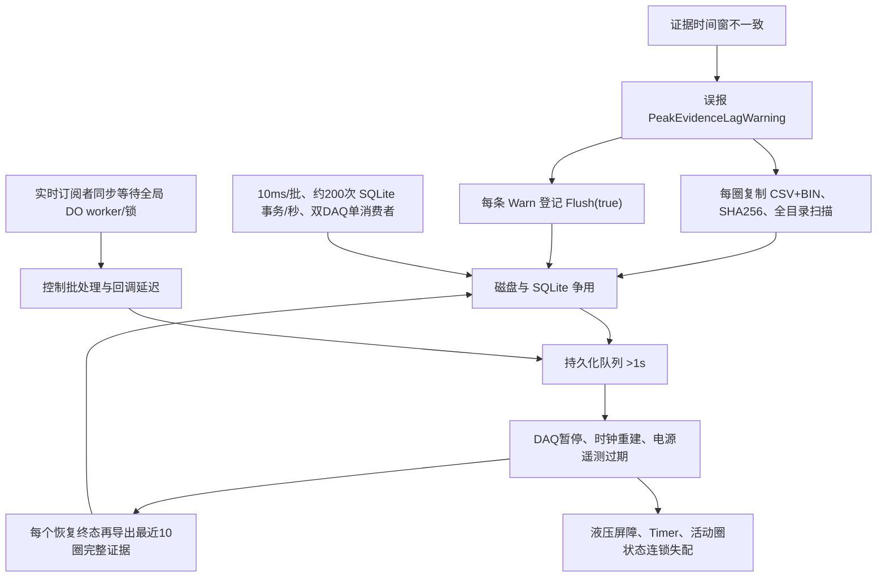

# 10358-029 V2.12.0.0 全历程卡顿、多故障根因与彻底整改方案

> **2026-08-10 V2.12.0.28 当前状态：** 在 V2.12.0.27 第二轮整改上继续按第 8—12 节
> 反证，已补齐每设备预分配 DAQ SPSC 环、四级优先级 DO 命令环、整组断能先于封圈/观察者、
> 正式圈 `CycleAttemptContext` 精确一次终态、旧 Runner execution tombstone、事故证据全局
> 1+1 有界出口，以及 HostRuntime/现场门禁资源反例。冻结源码 Release 重建 0 error，
> Adaptive `374/374`、写盘 `32/32`、电源 `17/17`、门禁 `45/45` 通过。当前权威状态见
> [V2.12.0.28 长期无人值守第三轮整改与验收报告](./2026-08-10_10358-029_V2.12.0.28_长期无人值守第三轮整改与验收报告.md)。
> 当前仍缺真实 NI 2/8/24/72 h、每通道 100000 圈，以及四类结构化生产指标；不得生产放行。

> **2026-08-10 V2.12.0.27 当前状态：** V2.12.0.26 第一轮整改完成后继续反证，发现
> `SuppressAfter` 可把未写盘尾批伪装成 Persisted、恢复/Stop 在提交 OFF 前等待恢复所有权、
> 已接纳异步 OFF 在 NI 永久阻塞或 Dispose 竞态下可能永不完成、日志软刷可覆盖并发新写，
> 以及旧现场门禁可用稀疏心跳和极少圈数产生假阳性。V2.12.0.27 已按“冻结 sequence
> 边界、物理持久化与明确排除分账、先断能后等所有权、OFF 独立 deadline、日志版本水位、
> 72 h+每通道100000圈双硬门”完成第二轮代码整改。当前权威状态、验证边界和现场命令见
> [V2.12.0.27 长期无人值守第二轮整改与验收报告](./2026-08-10_10358-029_V2.12.0.27_长期无人值守第二轮整改与验收报告.md)。
> V2.12.0.26 已被该候选取代；V2.12.0.27 现又被 V2.12.0.28 第三轮候选取代。

> **2026-08-10 V2.12.0.24 现场全停与 V2.12.0.26 整改更新：** V2.12.0.24 长时运行约
> 6 h 45 min 后出现的 `BackgroundQueueFull` 已确认来自 DAQ 后台处理队列，而非 SQLite
> 持久化队列。同步 HostRuntime 探针阻塞唯一处理线程后，旧恢复链又依次触发耐久前缀误判、
> Stop→Start 取消半状态、压力陈旧循环门禁和局部故障升级整机停止。V2.12.0.26 已按
> “关键链无阻塞、两设备全链隔离、已接收批次保序、断电态先修复输入 DAQ、永久缺口明确
> 作废失败圈并进程回收”完成代码整改。完整证据、限制和现场验收门槛见
> [V2.12.0.24 全停不可恢复根因与 V2.12.0.26 整改方案](./2026-08-10_10358-029_V2.12.0.24_全停不可恢复根因与V2.12.0.26整改方案.md)。
> 在正式包 `gitDirty=false`、72 h 与最终 100000 圈证据完成前，仍不得签字为生产放行。

> 分析对象：`\\wj-epb\EPB_Data\10358-029_V2.12.0.0_0808_1438`  
> 运行版本：V2.12.0.0，程序集版本 `2.12.0.0`，仓库标签 `2.12.0.0`（`37e4a7e`）  
> 试验 RunId：`cb24af3e6f364e4d89ea5e4efbbc2a83`  
> 运行区间：2026-08-08 14:13:36—14:38:01（14:38:10 关闭窗体，14:38:16 完成最终 DO 关闭）  
> 报告结论级别：根因已定位；V2.12.0.0 当前构建不具备上线条件

> **2026-08-08 实施状态更新：** 本报告所列软件 P0/P1 整改已在源码中实施，版本迭代为
> `V2.12.0.1`，Release 主程序构建成功，自动化回归 `284/284` 通过；新增的六通道
> 2kHz 双 DAQ 真实写盘压力回归也已通过。改动清单、部署步骤和
> 现场验收门槛见
> [V2.12.0.1 卡顿整改实施与上线验证](./2026-08-08_V2.12.0.1_卡顿整改实施与上线验证.md)。
> 在完成六通道现场老化验收前，结论仍是“代码整改完成、尚未批准批量上线”。

> **2026-08-08 第二次封存与最终代码候选更新：** V2.12.0.1 后续在
> `\\wj-epb\EPB_Data\10358-029_V2.12.0.1_0808_2013` 暴露了 x86 长时运行下的
> MMF 访问器资源故障和同进程恢复缺口；已迭代为 V2.12.0.2，并补齐短视图事务映射、
> 进程内写盘自愈、基础设施窗口开路改判、UI 降载、1 Hz 主机审计、DO 延迟模型 v4 和
> 统一后台任务监督；随后补齐缺失时间戳独立诊断、软预警 1+1 门控/worker 退出纳管、
> 10 万条 UI 日志有界队列和磁盘 50–1,500 ms 故障矩阵。最终代码回归 294/294，
> 通过六通道 2 kHz 连续 60 秒、4 个真实圈、
> 每通道 120,000 点写盘长稳；发布身份/76 文件校验通过，但当前工作区未提交，因此候选被
> 强制标记 `DIRTY_CANDIDATE_NOT_FOR_PRODUCTION`、`deploymentApproved=false`，不得上线。
> 现场各阶段封存目录可用 `Tools/validate_epb_field_gate.py` 自动检查红线、SQLite、事故合并和时长门槛；
> 最终根因、构建哈希、发布双门禁及现场门槛见
> [V2.12.0.1 EPB4/5 自恢复失败根因与 V2.12.0.2 彻底整改](./2026-08-08_V2.12.0.1_EPB4-5反复自恢复失败根因与V2.12.0.2彻底整改.md)。

> **2026-08-09 V2.12.0.3 完成性审计更新：** V2.12.0.2 现场又暴露了“双 DAQ
> 时间滞后漏判 → 峰值证据失败后未机械释放 → 资格/学习圈未封存 → 错峰计划串用 →
> 恢复状态残留”的闭环，已在 V2.12.0.3 逐段切断。完成性审计还发现：旧 `StopAll`
> 只等待写盘队列排空，没有先锁定并等待停止时的 Raw 发布边界；旧现场验收器虽然读取
> DAQ 时序，却没有按本报告第 11 节的 P99/最大值作强制判定。两项均已补齐：停止收尾必须
> 同时满足 Raw 已发布、边界已持久化、队列为零，否则禁止同进程重启；程序按 2 秒输出
> DAQ/持久化结构化指标、逐次输出高优先级 OFF 指标、按 10 秒输出 UI 消息泵 P95，验收器
> 现在能直接执行定量门槛。最终控制回归 `296/296`、写盘回归 `27/27`、验收器回归
> `5/5`（含轮转日志和分通道控流质量反例），V2.12.0.3 Release 构建 0 error。完整证据和最新上线命令见
> [V2.12.0.2 全历程自维护失控根因与 V2.12.0.3 彻底整改](./2026-08-09_10358-029_V2.12.0.2全历程自维护失控根因与V2.12.0.3彻底整改.md)。
> 当前仍为 `DIRTY_CANDIDATE_NOT_FOR_PRODUCTION`；在干净发布和真实 24 h/72 h 数据通过前，
> 原目标“无人值守流畅持续运行”仍属于代码候选已完成、现场放行未完成。

> **2026-08-09 V2.12.0.4 数据完整性审计更新：** 在 V2.12.0.3 候选完成后继续审计发现，
> 写盘连续失败超过恢复时限时，旧 worker 虽然发布了故障，却会释放当前批次并在 `finally`
> 中把该序号推进为“已持久化”；同时恢复事件在批次归还对象池后读取 `Device`，可能把 Dev1
> 状态错误归到 Dev2。这会造成长磁盘故障后的失败圈数据缺口、停止边界误放行和恢复设备号
> 错误。V2.12.0.4 改为：超时只触发安全停机与自维护，原批次继续以最大 250 ms 退避重试；
> 只有真实写入成功或明确淘汰旧代次才推进边界，Raw 和耐久边界完成后才允许封失败圈；
> 失败状态参与 Stop 重启门禁；恢复发布使用释放
> 前捕获的设备号。对 V2.12.0.2 最终封存复核还确认，旧程序在 20 秒内为同一次队列满
> 重复写出 1491 条 ERROR，并创建重复 UI 更新/恢复任务，形成“写盘慢 → 故障风暴 → CPU/I/O
> 更高 → 写盘更慢”的正反馈；现已改为一次拥塞只发布一次 Failed，后续只做结构化计数，
> 现场门禁强制 `OverCapacityDropped=0`。新增长故障恢复及防风暴回归后总计 `297/297` 通过。完整补充报告见
> [V2.12.0.4 写盘超时数据完整性补充整改](./2026-08-09_V2.12.0.4_写盘超时数据完整性补充整改.md)。

> **2026-08-09 V2.12.0.5 全恢复路径审计更新：** V2.12.0.4 已保证整台 DAQ 故障在
> Raw 与耐久边界闭合后才封失败圈，但液压、电源、非 DAQ 电气和普通软件预警仍可能在
> 后台 Raw 批次到达前直接废止当前圈。V2.12.0.5 已把全部恢复入口统一为“暂停/断能 →
> 锁定圈号与截止时间 → 排空 Raw 发布边界 → 等待对应设备耐久前缀 → 废止失败圈 →
> 资格验证 → 自动重入”；耐久条件不成立时保持恢复态并重试，绝不提前重入。数据窗口只允许
> 向更早时间单调收紧，后续并发恢复不能重新扩展窗口。当前所有直接废止软件恢复圈的调用均
> 已收口到统一耐久门禁。控制回归增至 `298/298`，写盘回归 `27/27`、现场门禁回归 `5/5`。
> 详见 [V2.12.0.5 全恢复路径统一耐久收口整改](./2026-08-09_V2.12.0.5_全恢复路径统一耐久收口整改.md)。

> **2026-08-09 V2.12.0.6 圈终态反证审计更新：** 逐个搜索所有 Complete/Alarm/Abort
> 入口后发现，Timer 看门狗、受影响组硬期限清场、活动圈上限以及正式/报警/学习圈的失败降级
> 仍有少量旁路。现已全部接入“圈身份匹配 → 封闭窗口 → Raw 排空 → 耐久前缀 → 唯一终态 →
> 清除身份”的统一协议；耐久或数据库终态失败时保留活动圈并持续恢复，禁止开始下一圈。
> 写盘器还会拒绝迟到任务修改非当前圈，并要求 SQLite 终态更新恰好命中一条记录。
> Stop 现在会在撤销运行授权前后各捕获一次活动圈；只有整设备耐久边界和这些圈的唯一终态
> 都确认后才允许同进程重启，Recorder 缺失或圈身份竞态一律拒绝假成功。
> 控制回归 `299/299`（含活动圈/终态重试未收口禁止重启）、写盘回归增至 `28/28`、现场门禁 `5/5`，V2.12.0.6 Release
> 构建 0 error。详见 [V2.12.0.6 全圈终态耐久一致性完成性整改](./2026-08-09_V2.12.0.6_全圈终态耐久一致性完成性整改.md)。

> **2026-08-09 V2.12.0.7 原始方案完成性审计更新：** 继续逐条核对第 8.1、11、12 节后，
> 发现软预警仍默认复制整圈、容量状态仍在每份完整证据前后递归扫描全目录，并且运行身份把
> `2.12.0.x` 的 Revision 截断。现已改为默认有界批量 JSONL 标量证据，完整 CSV/BIN 必须显式
> 开启；容量使用一次基线加增量维护；事故身份加入完整 `V2.12.0.7`、PID、BuildUtc、EXE/Git/
> 发布配置哈希。控制回归增至 `300/300`，写盘 `28/28`、现场门禁 `6/6`，Release 0 error。
> 详见 [V2.12.0.7 软预警 I/O 减负与运行身份完整性整改](./2026-08-09_V2.12.0.7_软预警IO减负与运行身份完整性整改.md)。

> **2026-08-09 V2.12.0.8 根治闭环更新：** 最终反证审计又发现，高优先级 OFF 在 NI
> 阻塞时会重复排队并为每次请求创建未释放等待句柄；DAQ/恢复/Latest 清理及退出 Flush 仍有
> 生命周期竞态；`ThresholdBeforeLoadRise` 可在完整 2 kHz 证据到达前仅按状态顺序硬报警；
> 重启还会继续复用旧的污染自适应模型。V2.12.0.8 已完成按物理设备合并 OFF、后台任务统一
> 监督和退出排空、快速夹紧候选先断电后归因，以及自适应模型 v5 留档失效并重新学习。
> 回归为 `302/302`、写盘 `28/28`、现场门禁 `6/6`，Release 0 error。详见
> [V2.12.0.8 频繁自维护根因闭环与根治整改](./2026-08-09_V2.12.0.8_频繁自维护根因闭环与根治整改.md)。

> **2026-08-09 V2.12.0.9 最终任务与 UI 队列审计更新：** UI 配置防抖已从“每次变化一个
> 延迟任务”改为“每配置文件一个单次计时器”；`ui-info.log` 文件队列增加默认 512 容量、
> 单一可观察写入任务和退出排空；公共 `TaskSupervisor` 现在等待异常观察和活动项删除的完整
> 边界。源码已无裸 `_ = Task.Run(...)`。控制/恢复回归增至 `303/303`，写盘 `28/28`、
> 现场门禁 `7/7`（新增 UI 文件队列丢弃红线），V2.12.0.9 Release 0 error。第 8—12 节逐条证据及现场未完成项见
> [V2.12.0.9 原始整改方案逐项完成性审计与后台任务最终收口](./2026-08-09_V2.12.0.9_原始整改方案逐项完成性审计与后台任务最终收口.md)。

> **2026-08-09 V2.12.0.10 连续运行与自维护风暴验收更新：** 最终反证发现旧现场门禁
> 会用项目目录内所有日志的最早/最晚时间计算时长，多个短运行存在被拼成 24/72 小时长跑的
> 可能；同时没有结构化判定自维护频率和终态 Recovering 残留。V2.12.0.10 新增 SESSION
> Start/终态、固定 EXE/配置/Git 身份和 STATE 状态迁移；门禁只验收同一 RunId 连续区间，
> 第二个 RunId、最新会话未闭合却回退旧会话、`GitDirty=true`、每设备 10 分钟超过 3 个根事故、同根事故重复进入自维护、
> Recovering 缺少有效根关联号、终态仍处于 Recovering 均直接失败。自动证据为 `303/303`、`28/28`、门禁 `12/12`、
> Release 0 error。详见
> [V2.12.0.10 连续运行会话与自维护风暴验收闭环](./2026-08-09_V2.12.0.10_连续运行会话与自维护风暴验收闭环.md)。

> **2026-08-09 V2.12.0.11 会话终态安全耐久收尾更新：** 完成性审计发现最后通道自然完成、
> 人工停止或报警停机时，旧空闲判断漏检 `_runnerCache`，并在压力释放、电源关闭、Raw 排空和
> 持久化边界确认前直接记录 `SESSION Closed=True`。V2.12.0.11 改为四张 Timer/Runner 活动与
> 缓存表全部为空后只登记一次统一 StopAll 收尾；仅当物理安全、Raw/耐久边界、活动圈终态和
> 逻辑清场全部确认时才允许封口。门禁新增“同一 RunId 只有一个终态”红线。自动证据为
> `304/304`、写盘 `28/28`、门禁 `13/13`、六通道 2 kHz 队列深度 `2/2`、Release 0 error。
> 详见 [V2.12.0.11 会话终态统一安全与耐久收尾整改](./2026-08-09_V2.12.0.11_会话终态统一安全耐久收尾整改.md)。

> **2026-08-09 V2.12.0.12 无人值守授权隔离更新：** 最终跨会话反证发现，旧运行的
> `NotifyRunAuthorizationRevoking` 观察者可能异步迟到，而无人值守检查点没有 RunId；当新运行
> 已经武装后，旧撤权仍可能清除新授权，表现为自维护恢复资格再次丢失。V2.12.0.12 将 RunId
> 同步写入 StopContext，把检查点升级为 schema v4 并持久化 RunId；撤权只允许作用于同一
> RunId，历史空身份仍按安全优先撤权。控制/恢复回归增至 `305/305`，写盘 `28/28`、门禁
> `13/13`、Release 0 error；详见
> [V2.12.0.12 无人值守授权 RunId 隔离整改](./2026-08-09_V2.12.0.12_无人值守授权RunId隔离整改.md)。

> **2026-08-09 V2.12.0.13 全自动恢复身份隔离更新：** 反证审计继续发现，旧运行的
> `SystemFaultRaised` 后台任务仍可能在新运行武装后登记同进程恢复或进程重启；恢复登记还会
> 把检查点 schema v4 降回 v3，正常暂停重建检查点时也未强制写入当前 RunId。V2.12.0.13
> 要求所有主动恢复动作使用两个非空、合法且完全相同的 RunId；不匹配的迟到任务只记录并
> 忽略，绝不停止或重建新运行。检查点版本集中为 v4，正常暂停必须收敛到唯一 RunId。现场
> 门禁同时开始验证 SESSION/STATE/CYCLE/CorrelationId 的合法 GUID 和同运行归属。自动证据为
> `306/306`、写盘 `28/28`、门禁 `14/14`、Release 0 error。详见
> [V2.12.0.13 全自动恢复 RunId 隔离与完成性审计](./2026-08-09_V2.12.0.13_全自动恢复RunId隔离与完成性审计.md)。

> **2026-08-09 V2.12.0.14 长跑显示反馈收口更新：** 最后的流畅性反证发现，采集层虽然已只保留每设备最新 UI 快照，但唤醒计数仍可积累；窗体层的实际实现也与“只保留最新批”注释相反，每设备排队 64 批并在 UI 恢复后集中追赶；曲线窗口滚动后还可能每 100 ms 复制每条曲线的整个保留段。V2.12.0.14 改为 Dev1/Dev2 最新值槽、容量 1 二值唤醒、至少 1 秒批量裁剪和全局约 1 Hz 主机探针，不改变 2 kHz 控制/峰值/Raw/数据库链。自动证据为 `307/307`、写盘 `28/28`、门禁 `14/14`、Release 0 error；候选仍因工作树未干净而禁止产线放行。详见 [V2.12.0.14 UI 积压反馈切断与频繁自维护根治结论](./2026-08-09_V2.12.0.14_UI积压反馈切断与频繁自维护根治结论.md)。

> **2026-08-09 V2.12.0.15 窗体层可验证最新值邮箱更新：** V2.12.0.14 虽已将窗体队列改成两个私有最新槽，但自动化只直接覆盖了采集层的二值唤醒。V2.12.0.15 将窗体层抽成 `LatestPairMailbox<T>`，并发向 Dev1/Dev2 各发布 100,000 批时仍只保留两个槽，消费后无历史残留。主框架、设置窗体和实时监控的遗留内存日志上限也统一由每类 100,000 条收紧到 2,000 条，不影响进程级持久日志。自动证据增至 `308/308`、写盘 `28/28`、门禁 `14/14`，Release 0 error。主报告第 8–12 节的实现/自动证据/台架边界见 [V2.12.0.15 UI 双设备邮箱与上线门槛完成性审计](./2026-08-09_V2.12.0.15_UI双设备邮箱与上线门槛完成性审计.md)。

> **2026-08-09 V2.12.0.16 自维护恢复层级闭环更新：** 最终反证发现 V2.12.0.15 虽已阻止并发恢复风暴，但 DAQ 自维护、Timer 恢复、受影响组清场、启动定位和普通可恢复卡钳资格复核仍可能由一个所有者无限退避，造成“没有风暴却永远停在自维护”。V2.12.0.16 将这些入口统一为三次软件失败后打开 RunId 级 single-flight 熔断器：先保持受影响输出关闭，再只触发一次 `StopAll → 同进程整批重建 → 必要时进程重启`；没有两份独立硬件证据时仍不得锁存卡钳硬件报警。1000 个并发熔断请求只允许一个成功，新运行复位后再允许一次。完成性审计又要求 SESSION 和每个事故阶段保留程序集版本、PID、完整 EXE 路径、EXE/配置/Git 身份；缺失即拒绝放行。当前自动证据为 `309/309`、写盘 `28/28`、门禁 `17/17`、电源 `17/17`、Release 0 error。详见 [V2.12.0.16 自维护有界熔断与整批自动重建整改](./2026-08-09_V2.12.0.16_自维护有界熔断与整批自动重建整改.md)和[上线要求完成性追踪矩阵](./2026-08-09_V2.12.0.16_上线要求完成性追踪矩阵.md)。

> **2026-08-09 V2.12.0.16 六通道 CPU 忙等收口更新：** 正式控制已经由 2 kHz 快速样本事件驱动，但学习及兼容路径仍有五处每个采样周期末约 1—2 ms 的忙等，六通道并发学习/重建时会叠加 CPU。现统一为粗粒度 `Task.Delay` 加最多 0.2 ms 单调精对齐；六通道各 120 个 3 ms 节拍的 CPU 时间必须小于墙钟时间 1.25 倍且不得提前返回。自动证据增至 `309/309`。详见 [V2.12.0.16 六通道 CPU 忙等收口](./2026-08-09_V2.12.0.16_六通道CPU忙等收口.md)。

> **2026-08-09 V2.12.0.16 后台任务与关闭顺序闭环更新：** 最终生命周期扫描确认参与编译的业务任务均由监督器、专用 worker、任务字段或 UI 事件边界观察，但发现主窗体第二次关闭重入曾绕过控制层已有的任务排空，直接释放采集器。现改为 `StopAll` 完成物理安全和耐久边界后，先排空控制恢复/证据任务和液压任务，再释放电源/DAQ/AO/DO，窗体直接释放仅作异常兜底。四套回归仍为 `309/309`、`28/28`、`17/17`、`17/17`。详见 [V2.12.0.16 后台任务排空与关闭顺序闭环](./2026-08-09_V2.12.0.16_后台任务排空与关闭顺序闭环.md)。

> **2026-08-09 V2.12.0.17 退出数据耐久门禁更新：** 反证发现窗口关闭仅检查电机 DO 和程控电源，最后 Raw/SQLite 边界未确认时仍会取消持久化 worker 并退出，可能再次造成最后圈或报警最近 10 圈缺失。现将“允许释放采集”和“允许结束进程”拆开：后者必须同时确认停止时接受的 Raw/SQLite 前缀；未确认时保持断能、窗口和 writer 存活，存储恢复后重试关闭。版本统一迭代为 V2.12.0.17，自动证据仍为 `309/309`、`28/28`、`17/17`、`17/17`、Release 0 error。详见 [V2.12.0.17 退出数据耐久门禁与流畅运行补充整改](./2026-08-09_V2.12.0.17_退出数据耐久门禁与流畅运行补充整改.md)。

> **2026-08-09 V2.12.0.17 六通道持续写盘更新：** 在短时回归之外，候选又完成 120/300/180 秒三轮六通道 2 kHz 真实 SQLite/BIN 写盘。300 秒每通道 600,000 点，双设备最大队列深度 5，Drain 0 ms，SQLite 事务 600 次；180 秒资源检查点显示工作集 38.37→38.83 MiB、句柄 417→416，没有持续增长。详见 [V2.12.0.17 六通道 2 kHz 离线持续写盘压力验证](./2026-08-09_V2.12.0.17_六通道2kHz离线持续写盘压力验证.md)。

> **2026-08-09 V2.12.0.17 VS2022/发布项目清单门禁更新：** 现场生成失败确认不是依赖 DLL 丢失，而是旧式非 SDK 项目未在 VS 当前快照中编译新增 `CoalescingTaskSupervisor.cs`，上游失败再连锁形成 `IO.NI.dll`、`Controller.dll` 缺失。项目清单已补正并在重启 VS 后以 `Release | x86` 验证 0 error；正式发布脚本还会在 MSBuild 前检查五个关键新增源码同时“文件存在且已列入 Compile”，防止同类遗漏复发。详见 [V2.12.0.17 VS2022 生成失败修复记录](./2026-08-09_V2.12.0.17_VS2022生成失败修复记录.md)。

> **2026-08-09 V2.12.0.18 跨目录 MMF 隔离更新：** 最终并行反证发现 `EpbDiskWriter` 对任何数据目录都使用全局 `EPB1_MMF`—`EPB12_MMF`，独立验证/诊断目录也会阻止正式写盘器创建。现按规范化 `DataStorePath` 生成稳定映射作用域：同一目录仍跨进程互斥，不同目录完全隔离。新增双根目录并行构造、写入和封口回归，写盘证据增至 `29/29`；控制 `309/309` 与写盘 `29/29` 同时运行也全部通过。版本迭代为 V2.12.0.18。详见 [V2.12.0.18 内存映射命名隔离与并行写盘闭环](./2026-08-09_V2.12.0.18_内存映射命名隔离与并行写盘闭环.md)。

> **2026-08-09 V2.12.0.19 发布身份递归闭环更新：** 构建警告审计确认主程序无业务代码使用 `ZlgCanComm`，但它仍把重复的 DevExpress UI 类型和失效 EntityFramework 引用带入现场包；主程序本地 `ToggleButton.cs` 又未加入旧式项目清单。现显式编译本地控件、移除无用运行依赖，并将发布改为受限空目录构建。`build-identity.json` 和 UTF-8 `SHA256SUMS.txt` 递归覆盖 Config、x86/x64 SQLite 互操作库及语言资源；配置 SHA 只取项目明确发布的 XML，按序数路径计算，并在构建后重算。Windows PowerShell 5/PowerShell 7 均得到同一配置 SHA，递归校验为 `97/98`，Release `0 error, 41 warning`。版本迭代为 V2.12.0.19。详见 [V2.12.0.19 发布依赖去重与递归身份闭环](./2026-08-09_V2.12.0.19_发布依赖去重与递归身份闭环.md)。

> **2026-08-09 V2.12.0.20 发布配置唯一性更新：** 在 V2.12.0.19 干净正式候选上继续反证发现，旧式项目把两份 `TestConfig - 复制*.xml` 历史备份也复制到输出目录。运行时虽然只读取正式 `TestConfig.xml`，但同包多套试验参数会造成部署误替换和审计歧义。现取消备份发布，并在构建前、构建后和独立校验器中强制只允许七份正式 XML；缺少、增加、重复或发布目录残留任一配置都拒绝候选。人工向包内加入备份配置的反例已被校验器拒绝，版本迭代为 V2.12.0.20。详见 [V2.12.0.20 发布配置唯一性门禁](./2026-08-09_V2.12.0.20_发布配置唯一性门禁.md)。

> **2026-08-09 V2.12.0.21 实时曲线连续性更新：** V2.12.0.20 现场 DAQ 指标持续 `Discontinuities=0`、无容量丢批，但 UI 最大延迟达到约 0.7 秒。绘图代码错误地用“距上次绘出点的间隔”识别采集断点，导致最新值邮箱覆盖的显示批次被插入 `NaN` 断笔。现只依据批次携带的相邻 DAQ 时间判断真实断点；两槽邮箱、10 FPS 重绘、10 Hz 抽稀和批量裁剪全部保留。自动证据增至 `310/310`，连续性判定十万次无持续分配。详见 [V2.12.0.21 实时曲线显示断线根因与性能无损修复](./2026-08-09_V2.12.0.21_实时曲线显示断线根因与性能无损修复.md)。

> **2026-08-09 V2.12.0.22 UI 日志全量重写卡顿更新：** 对最新 V2.12.0.20 六通道会话 3.14 小时现场指标继续聚合后，控制、DO、持久化、工作集和句柄均稳定，但 UI 最大消息泵停顿达 5868 ms，1132 个窗口中有 429 个 `FlushMax>200ms`。源码确认电源安全分部又在 `RtbInfo.TextChanged` 中对每批日志遍历 2000 行、重建整个 Text、重复裁剪并强制滚动，抵消了有界批量追加。V2.12.0.22 删除第二套全量处理，只保留唯一增量链，使用原位头删、批次容器复用和 500 ms 滚动限频，并新增 Append/Trim/Scroll 分阶段门禁。自动证据增至 `311/311`、门禁 `20/20`。详见 [V2.12.0.22 UI 日志全量重写卡顿根因与彻底整改](./2026-08-09_V2.12.0.22_UI日志全量重写卡顿根因与彻底整改.md)。

> **2026-08-09 V2.12.0.23 长期曲线退化、末批伪边界与退出弹框更新：** 最终封存目录 `10358-029_V2.12.0.20_0809_1451` 补齐了 14:42 之后的日志。曲线启动阶段连续、运行后才出现短线，与 UI 全量文本重写的累计分配/GC/消息泵停顿一致；14:43 后 UI Flush 达 607—816 ms，14:44 两块 DAQ 队列同时升到 63，随后压力/电源样本陈旧并触发自维护级联。Dev1 最终 `Boundary=1254944`、`Published=Persisted=1254943`、`Depth=0`：1254944 只分配了回调序号却未被后台队列接收，旧停止逻辑因等待不存在的批次永久失败；窗口每次关闭又重复 10 秒 StopAll 和模态框。V2.12.0.23 将 `LastAllocated` 与 `LastAccepted` 分离，停止/恢复/写盘只使用实际接收边界，进程退出前先停止新 DAQ 回调，同一关闭故障只提示一次。自动证据增至 `312/312`。详见 [V2.12.0.23 长期曲线退化、DAQ 末批边界与退出弹框根因整改](./2026-08-09_V2.12.0.23_长期曲线退化_DAQ末批边界与退出弹框根因整改.md)。

> **正式候选身份绑定：** 现场验收必须通过 `Tools/Invoke-Field-Acceptance.ps1`：先递归校验正式 Release，再强制匹配 ProductVersion、EXE SHA、配置 SHA、GitCommit、BuildUtc 和 `GitDirty=false`；旧版本、同版本异包、改配置包、未封账会话和 quick/none 不完整扫描均拒绝正式放行。

> **2026-08-09 V2.12.0.24 已接收批次全链路耐久更新：** 对 V2.12.0.23 继续做停止/代次切换反证后发现，已进入后台工程队列的批次仍可能在 generation 失效时跳过 Raw/SQLite，Raw 发布队列满时被 Dispose，SQLite 队列满时被拒绝，或在新 generation 接管时被伪装成已持久化。V2.12.0.24 将 generation 失效批次改为 `ArchiveOnly`，Raw 和 SQLite 两级容量满均改为后台有界背压且保留原所有权，持久化 generation 只做身份诊断、不再清除旧 FIFO。综合证据增至 `314/314`。V2.12.0.23 候选作废，详见 [V2.12.0.24 已接收批次全链路耐久与退出收口完成性整改](./2026-08-09_V2.12.0.24_已接收批次全链路耐久与退出收口完成性整改.md)。

> **曲线时间退化与退出门禁补充：** 现场确认启动初期曲线连续、运行一段时间后才出现短线，进一步证明根因是累计型消费延迟叠加旧断笔判据，而不是固定采样率或画笔参数。V2.12.0.24 同时分离退出耐久门禁与同进程恢复门禁：数据真实闭合但只剩新鲜批次恢复锁存时允许退出；未解决写故障或真实丢弃仍禁止关闭。

> **2026-08-09 V2.12.0.25 发布混包根治更新：** 现场核对发现正在运行的 V2.12.0.24 EXE SHA 与此前正式候选不同，且旧清单校验 `Config.dll` 失败。根因是正式发布和 Visual Studio 都写入可变 `MTTfTest\bin\Release`，窗口版本号不能证明整包身份。V2.12.0.25 将该目录永久标记为构建暂存，正式包只生成到版本/Git/UTC 独立目录；新试验或跨进程恢复前程序重新校验完整文件集合和 SHA，混包直接拒绝启动。详见 [V2.12.0.25 发布目录混包根因与不可变候选整改](./2026-08-09_V2.12.0.25_发布目录混包根因与不可变候选整改.md)。

## 1. 结论先行

本次“所有卡钳频繁报峰值完整数据处理滞后”和“软件越来越卡、最终完全不可用”不是一个故障，而是一条软件自激放大链：

1. 峰值证据代码把“最终峰值晚于快速判定时看到的证据窗口”错误地等同于“处理超过 100 ms”。本次共报 475 次，但 **0 次真正超过 100 ms**，最大仅 97.5 ms。
2. 每次误报都会登记一份完整单圈 CSV+BIN 软预警快照，并做 SHA-256、保留数量清理、磁盘配额扫描。正式圈实际完成了 415 次此类导出，仅这类快照估算就产生约 662 MiB 文件写入；最终仍保留 287.1 MiB。
3. V2.12.0.0 对每条 Warn/Error 又登记一次 `Flush(true)`，本次 1088 条 warning 加 153 条 error，形成约 1241 次持久化刷新请求，与原始采样、SQLite、CSV/BIN 快照争用同一磁盘。
4. 原始数据持久化本身是“两台 DAQ 共用一个工作线程”，每个设备每 10 ms 一个批次；每批又开启一次 SQLite 事务并逐通道更新圈进度，理论上约 200 个事务/秒。轻微磁盘抖动就会积累队列。
5. 实时控制工作线程同步调用订阅者；订阅者在达到夹紧/释放条件时又同步等待 DO 断电。DO 控制器对 Dev1/Dev2 共用一个全局锁和一个高优先级 worker，造成跨设备、跨卡钳队头阻塞。本次普通 DO 最慢 366.7 ms，高优先级 NI 写入大量落在 20—70 ms。
6. 当持久化在 14:36:50 超过 1 秒后，恢复链同时触发持久化暂停、DAQ 时钟重建、后台队列满和电源遥测过期。每个恢复终态还同步导出最近 10 圈完整证据。本次运行对应的事故快照已达 1067 个文件、754.3 MiB，形成“越卡越取证、越取证越卡”的正反馈。

因此，**调大“峰值允许滞后”、提高队列容量、换更快电脑、关闭界面提示都不能彻底解决**。必须同时改正判定语义、移除热路径文件放大器、重构持久化粒度、隔离实时 DO，并合并恢复与事故取证。

## 2. 证据范围与可信度

### 2.1 已检查的证据

- 封存目录全部运行日志：`run.log`、`warning.log`、`error.log`、`ui-info.log`。
- `index.db` 全表统计和异常状态；SQLite `integrity_check=ok`。
- 当前运行的 DAQ IncidentSnapshots、触发/终态 JSON、DAQ timing/runtime CSV。
- WarningSnapshots、AlarmSnapshots、连续电源遥测和程序安全策略快照。
- 当前仓库 V2.12.0.0 标签源码、相关提交历史和现有测试。
- 用户提供的运行界面与任务管理器截图。

分析时只把日志与数据库复制到本机临时目录进行读取；封存源目录未被修改。SQLite 在临时副本旁创建的 `-wal/-shm` 不属于原始封存数据。

### 2.2 证据边界

- 事故快照记录了 GC、托管内存和线程池余量，但没有记录试验期间的整机 CPU、磁盘活动时间、磁盘队列长度和具体外部进程 CPU。因此可证明软件内部存在严重 I/O/同步放大机制，但无法仅凭现有文件把 14:37 的每一毫秒延迟精确分摊给 CPU、磁盘驱动、杀毒软件或其他进程。
- 事故快照中托管内存最高约 75.2 MiB、可用 worker 线程最低仍为 1007、GC pause 为 0 ms，不支持“内存泄漏、GC 长停顿或线程池耗尽”这一解释。
- 任务管理器截图文件生成于 14:46:47，而日志显示应用 14:38:10 已进入 `ApplicationClosing`、14:38:16 已完成最终关闭。此时看不到 V2.12.0.0 进程是正常结果，不能证明“2.12 运行时不显示进程”。
- 截图中的 Bandizip 在试验结束后占用约 69% CPU，不能反推它在 14:13—14:38 期间也是根因；但上线机运行时仍应禁止压缩、杀毒全盘扫描等竞争任务。

## 3. 本次运行画像

| 项目 | 实际值 |
|---|---:|
| 试验周期 | 15 s |
| 采样率/批次 | 2000 Hz，N=20，即约 10 ms/批 |
| 启用卡钳 | EPB4、5、8、9、10、11 |
| DAQ 分组 | Dev1：EPB4、5；Dev2：EPB8、9、10、11 |
| 电流目标 | 15 A |
| 峰值证据允许滞后 | 100 ms |
| 活动圈样本硬上限 | 37500 条，即 18.75 s |
| 软预警保留 | 每通道、每代码 30 份 |
| 当前运行数据库记录 | 537 圈/尝试 |
| 正常正式圈 | 459 |
| 学习完成 | 60 |
| 软件恢复作废 | 10 |
| failed / alarm / canceled | 4 / 1 / 1 |
| 资格确认圈 | 2 |

各通道当前运行正常完成正式圈：EPB4=75、EPB5=75、EPB8=78、EPB9=79、EPB10=78、EPB11=74。说明系统在 14:18—14:22 的故障后曾经恢复并继续运行；最终失去生产能力发生在 14:36:50 之后。

## 4. 全历程时间线

| 时间 | 事件 | 判断 |
|---|---|---|
| 14:13:24—14:13:36 | 加载 V2.12.0.0 配置，DAQ 启动健康检查通过，RunId 建立 | 启动正常 |
| 14:13:48 | 首批“峰值完整数据处理滞后”和峰值超调提示出现 | 误报链已经启动 |
| 14:15:47 起 | 正式圈峰值滞后快照持续保存 | 完整圈 CSV+BIN 开始持续复制 |
| 14:18:24 | Dev1 `DaqSampleStale`，随后重建并于约 14:18:45 恢复 | 第一轮 DAQ 软件恢复 |
| 14:18:31—14:19:02 | EPB11 多次 `ThresholdBeforeLoadRise`，第 3 次形成 `CurveSequenceInvalid` 报警 | 快速上升波形被曲线顺序规则判故障 |
| 14:18:47 | EPB8 `OpenCircuitOrOutputFault`；多个 Timer 返回失败 | DAQ/DO 时序异常向状态机扩散 |
| 14:19:17 | 液压 1 屏障超时，Pending=[5] | 成员未及时退出代次 |
| 14:21:31 | Dev1/Dev2 同时出现约 272—302 ms 控制/回调异常 | 主机级或共享软件路径抖动，不是单卡故障 |
| 14:21:46 | 液压 1、2 同时屏障超时，Pending=[5]/[9] | DAQ 恢复与液压代次清理不原子 |
| 14:21:56—14:21:58 | 两次 `TaskScheduler.UnobservedTaskException` | 液压关闭/恢复任务存在未观察异常 |
| 14:22:16 | EPB10 Cycle 17231 达到 37500 样本上限；同一问题连续写 117 条 error | 超限后未一次性封圈/抑制后续批次 |
| 14:22:17 | Dev1/Dev2 持久化队列均达 101+ 批并触发暂停 | 第一轮明确写盘积压 |
| 14:22:38 后 | 两组恢复并继续完成正式圈 | 恢复链能工作，但成本过高 |
| 14:22:38—14:36:40 | 持续完成圈，同时大量误报、软预警快照和 100—140 ms 落盘延迟提示 | 系统在带病运行，I/O 债务持续累积 |
| 14:36:40 左右 | 最后一批正常正式圈完成 | 此后不再有有效产出 |
| 14:36:49 | 两台设备再次出现持久化延迟 | 最终雪崩前兆 |
| 14:36:50 | Dev1 Depth=101、Dev2 Depth=103，Oldest>1000 ms；同时安全暂停 | 原始数据消费者跟不上生产者 |
| 14:37:00 | Dev1 再次 Depth=128 | 暂停/恢复未消除根负载 |
| 14:37:01 | 程控电源 TelemetryStale 开始 | 同一进程/主机延迟已波及第二类 I/O |
| 14:37:09 | Dev1/Dev2 时钟模型同时失效 | 全局服务质量崩溃 |
| 14:37:13 | 两设备出现约 3.7 s 回调空窗；后台队列满 | 已无法满足实时控制 |
| 14:37:15—14:37:35 | 队列满、时钟重建、DAQ 回调异常和电源恢复反复触发 | 恢复风暴 |
| 14:38:01 | 用户手工停止 | 操作正确 |
| 14:38:10—14:38:16 | 窗体关闭，电源、DO/AO 最终关闭完成 | 停机安全链最终完成 |
| 14:46:47 | 任务管理器截图无 V2.12 进程 | 应用已关闭约 8 分钟，属预期 |

## 5. 根因链



## 6. 问题清单、原因与处置

| ID | 优先级 | 问题 | 已证实原因 | 必须采取的处置 |
|---|---|---|---|---|
| P0-1 | 阻断上线 | 475 次峰值滞后误报 | `!comparableWindow` 被并入 `peakEvidenceLag`，即使实际滞后小于 100 ms 也报警 | 拆分“窗口不可比较”和“处理超时”语义 |
| P0-2 | 阻断上线 | 软预警快照 I/O 风暴 | 每个 warning 通过无界 `Task.Run` 导出完整 CSV+BIN，并重复 SHA、保留扫描、配额扫描 | 有界、合并、限频；热路径只写小型结构化事件 |
| P0-3 | 阻断上线 | 原始数据持久化吞吐设计不足 | 两设备共用一个消费者；每 10 ms/设备开启 SQLite 事务并逐通道更新进度 | 原始数据块写与圈索引分离，扩大批量，取消 10 ms 事务 |
| P0-4 | 阻断上线 | 事故取证反向拖垮恢复 | 每次恢复终态同步导出每个受影响通道最近 10 圈；本次 754.3 MiB | 一次事故一个 manifest；完整数据引用既有存储，禁止恢复等待大文件复制 |
| P0-5 | 阻断上线 | 实时控制被 DO 同步阻塞 | DAQ 控制线程同步调用订阅者；DO 对两设备共用全局 worker/锁，NI 写入 20—70 ms | 每物理设备独立安全 worker；控制线程只提交命令，不等待其他设备 |
| P0-6 | 阻断上线 | 14:37 恢复风暴 | 持久化、时钟、后台队列、电源各自触发恢复；重复请求虽被字典拒绝，但先递增 recovery epoch | 根事故合并、单所有者、退避；epoch 只在成功登记上下文后递增 |
| P1-1 | 高 | EPB8 控流明显振荡 | DO 实际动作延迟波动未作为模型输入，决策时刻被当成物理断电时刻 | 使用硬件完成时刻/延迟分布校正，限制单圈模型更新步长 |
| P1-2 | 高 | EPB11 `ThresholdBeforeLoadRise` 误硬故障 | 快速真实上升在空行程窗口稳定前达到目标，被固定规则判曲线非法 | 保持立即断电，但改为“快速上升待确认”，依据连续性/斜率/断电清零再分类 |
| P1-3 | 高 | 液压屏障超时与未观察异常 | DAQ 作废成员未在所有路径原子退出液压代次；部分 Close 任务未被统一 await | 代次成员退出一次性提交；中央任务监督器观察全部异常 |
| P1-4 | 高 | 活动圈上限错误刷屏 | 超限异常每个后续批次重复抛出，未立即封圈和抑制 | `(channel,cycle)` 原子锁存，一次停止、一次封存、一次告警 |
| P1-5 | 高 | UI 可见卡顿 | 每条日志跨线程 `BeginInvoke`；信息框每行读取全部 `Lines` 并滚动；故障时消息洪峰 | UI 日志批量刷新、限频、虚拟化；图表固定 5—10 Hz |
| P1-6 | 高 | 每个 Warn/Error 做持久刷新 | V2.12.0.0 每条 warning/error 都 `RequestFlush(true)` | 1 秒批量刷新；只有硬报警、Stop、进程关闭做 durable flush |
| P1-7 | 高 | 软预警快照无样本时继续失败 | 作废圈/零样本仍进入完整导出 | 导出前验证圈状态和样本数；失败时仅保存小型元数据和环形缓冲引用 |
| P1-8 | 高 | 恢复证据不完整/重复 | 部分事故目录没有终态，重复事故又产生大量目录 | append-only 事故 manifest，进程关闭前有限时间排空小型元数据 |
| P2-1 | 中 | 数据库残留 `running` | 8 月 5 日 EPB4 Cycle -399 仍为 running | 启动时按 RunId/时间窗恢复或明确标记 `aborted_on_startup` |
| P2-2 | 中 | 进程身份无法从截图确认 | 截图晚于应用退出 | 启动日志/UI 显示 PID、EXE 路径、文件版本、Git SHA、二进制 SHA-256 |
| P2-3 | 中 | 上线环境资源不可审计 | 没有试验期 CPU/磁盘/外部进程指标 | 增加 1 Hz 主机遥测并封存；上线机禁止压缩和计划扫描 |

## 7. 关键根因的源码证据

### 7.1 峰值滞后报警的布尔逻辑错误

位置：`Controller/EpbCycleRunner.Adaptive.cs:1183-1298`。

当前流程先完成 100 ms 全速率证据排空，并通过 `IsFullRatePeakCaptureValid` 验证逻辑截止已覆盖、尾差未超过 100 ms。随后代码又计算：

```csharp
peakEvidenceLag =
    !comparableWindow ||
    double.IsNaN(decisionEvidenceLagMs) ||
    double.IsInfinity(decisionEvidenceLagMs) ||
    decisionEvidenceLagMs > PeakEvidenceMaximumLagMs;
```

`comparableWindow=false` 的含义只是“最终峰值发生在快速判定时看到的证据水位之后”，用于禁止把两个不同时间窗的峰值做偏差硬故障比较；它不等于后台处理超过 100 ms。当前代码却统一输出“峰值完整数据处理滞后”。

本次 475 次统计：

| EPB | 次数 | 中位数 ms | P95 ms | 最大 ms | 超过 100 ms |
|---:|---:|---:|---:|---:|---:|
| 4 | 83 | 35.0 | 45.5 | 67.5 | 0 |
| 5 | 74 | 27.75 | 43.5 | 60.0 | 0 |
| 8 | 62 | 21.0 | 40.5 | 46.0 | 0 |
| 9 | 86 | 32.0 | 62.5 | 77.0 | 0 |
| 10 | 83 | 32.0 | 45.5 | 97.5 | 0 |
| 11 | 87 | 35.5 | 47.0 | 61.5 | 0 |
| 合计 | 475 | 31.5 | 47.0 | 97.5 | 0 |

该逻辑由提交 `4fa397b` 引入并包含在 V2.12.0.0 中。现有测试 `PeakEvidenceMismatchRequiresComparableWindow` 只验证“不可比较时不参加峰值偏差硬故障计数”，没有验证“证据有效且滞后未超限时不得产生 PeakEvidenceLagWarning”，所以回归未被发现。

正确拆分应为：

```csharp
var lagKnown = IsFinite(decisionEvidenceLagMs);
var lagExceeded = lagKnown && decisionEvidenceLagMs > limitMs;
var timestampMissing = !lagKnown;

// 只控制峰值偏差能否比较，不产生超时预警。
var canComparePeak = IsPeakEvidenceWindowComparable(evidenceThroughUtc, finalPeakAt);

if (lagExceeded)
    Raise(PeakEvidenceLagWarning);
else if (timestampMissing)
    RecordDiagnostic(EvidenceTimestampUnavailable);

if (canComparePeak)
    EvaluatePeakMismatch();
```

不得用提高 100 ms 阈值来掩盖该问题。

### 7.2 软预警快照是无界、高成本任务

位置：`Controller/EpbManager.WarningSnapshots.cs:66-176、736-870、1156-1266`。

- 每个 warning 都登记 `WarningSnapshotRequest`。
- 圈结束后直接 `_ = Task.Run(() => ExportWarningSnapshot(request))`，没有全局有界队列。
- 每份导出完整 CSV+BIN，随后重新读取文件计算 SHA-256。
- 导出前后都会递归扫描 WarningSnapshots 计算容量/数量。
- 每份又枚举同分类目录做保留数量清理，并递归扫描全目录执行配额逻辑。

本次正式圈完成 415 份 PeakEvidenceLag 快照。该分类最终仅保留 6 通道 × 30 份 = 180 份、720 个文件、301,061,156 bytes（287.1 MiB）。按最终平均文件量估算，运行过程中此分类至少生成约 694 MB（662 MiB）文件，此外还有 SHA 读回、旧目录删除和其他预警分类。

warning 到“快照保存完成”的事件延迟中位数约 7.28 s、P95 约 8.03 s、最大 28.58 s；该时长包含等待当前圈封口，因此不能视为纯磁盘写入耗时，但可证明后台任务长期重叠。

### 7.3 原始采样持久化粒度过小且故障耦合

位置：`Controller/DaqPersistenceCoordinator.cs:42-157、293-470`；`DataOperation/EpbDiskWriter.cs:958-1027`。

- `DaqPersistenceCoordinator` 为 Dev1/Dev2 各保留队列，但只有一个 `_worker` 轮询两个队列。
- 两个 DAQ 各约 100 批/秒，即单 worker 约处理 200 个批次/秒。
- 每个设备批次在 `WriteDeviceBatch` 中获取多个通道锁和全局 `_dbGate`，开启 SQLite transaction，逐通道写 MMF 并更新圈进度，再 commit。
- 任意设备或 SQLite 抖动都会拖住另一设备；队列容量只能延迟故障，不能提高长期服务率。

运行证据：

- 平常已经出现 60 次持久化延迟提示，Oldest 多为 100—140 ms。
- 14:22:17 两设备均到 101+ 批，触发第一次安全暂停。
- 14:36:50 Dev1/Dev2 同时为 101/103 批且 Oldest>1000 ms。
- 14:37:00 Dev1 再次到 128 批，说明暂停/恢复没有消除服务率不足。

### 7.4 实时控制路径同步等待 DO

位置：`IO.NI/TwoDeviceAiAcquirer.cs:2707-2819`；`Controller/EpbCycleRunner.Adaptive.cs:415-512、651-705`；`IO.NI/DoController.cs:59-215、492-576`。

`OnFastEpbCurrentSample?.Invoke(fastSample)` 在 DAQ 控制 worker 中同步执行。达到夹紧、释放或硬故障后，`DispatchAdaptiveDecisionInSafetyOrder` 同步调用 `EnsureAdaptiveTerminalPowerOff`；后者又同步等待 `SetEpbOffHighPriority`。

虽然高优先级 DO 使用专用线程，但：

- 所有设备共用一个 `HighPriorityDoWorker`；
- 所有 Dev1/Dev2 写入共用 `_doTaskLock`；
- NI `WriteSingleSampleSingleLine` 是同步调用；
- 调用线程在 timeout 内等待结果。

本次普通 DO 命令共 2285 次，76 次超过 50 ms、14 次超过 100 ms，最大 366.7 ms。高优先级断电慢诊断 176 次，NIWrite 中位数约 28.2 ms、P95 约 56.3 ms、最大 70 ms。DAQ 诊断中 `SubscriberMaxMs` 与整批 `ProcessingMs` 基本相等，证明主要阻塞发生在同步订阅者，而不是滤波计算。

14:21:31 Dev2 控制处理约 271.8 ms；14:37:13 两台设备同时出现约 3.7 s 回调空窗。现有全局 DO worker/锁会把某一卡钳/某一设备的 NI 写延迟扩散到其他卡钳。

### 7.5 事故快照阻塞恢复并重复复制历史

位置：`Controller/EpbManager.WarningSnapshots.cs:409-583`。

终态 `90-recovered` 会对每个受影响通道执行：

```csharp
recorder.FlushRecentTo(channel, 10, sub, includeRunningCycle: true);
```

而 `BeginDaqAutoRecoveryAsync` 在恢复完成前 `await ExportDaqIncidentSnapshotAsync(..., "90-recovered")`。这使“恢复成功”必须等待大量 CSV+BIN 复制完成。

本次当前运行对应事故目录共 1067 个文件、790,957,924 bytes（754.3 MiB）。与峰值误报快照相加，已确认/估算的证据文件生成量下限约 1.38 GiB，尚未计入原始滑动数据、其他 warning 分类、历史快照、日志和电源遥测。

### 7.6 Warn/Error 的 durable flush 频率不合理

位置：`MTTfTest/FormLoggerAdapter.cs:62-79`；`Config/ProjectLogStore.cs:171-185`。

V2.12.0.0 将过去调用方同步 `Flush(true)` 改成了后台 `RequestFlush(true)`，避免直接卡住控制调用者，这是改进；但它仍然在每条 Warn/Error 后登记 durable flush。`ProjectLogStore.Flush(true)` 会对所有已打开日志流调用 `FileStream.Flush(true)`。

本次 1088 条 warning、153 条 error，等价于约 1241 次后台持久刷新请求。误报越多，磁盘同步刷新越多，仍会与 DAQ 数据和快照争用磁盘。

### 7.7 恢复请求虽然 single-flight，但仍存在重复请求/epoch 抖动

位置：`Controller/EpbManager.cs:2380-2576`。

`_daqAutoRecovery.TryAdd(device, context)` 能阻止同设备同时存在两个活动上下文，但 `RecoveryEpoch = Interlocked.Increment(ref _recoveryEpoch)` 在 `TryAdd` 之前执行。重复触发被拒绝时仍消耗 epoch。本次从早期个位数跳到 14:36 的 127/128，与大量被合并前的重复触发一致。

这会污染诊断、增加过时代次判断复杂度，并表明同一根事故仍在被持久化、时钟、后台队列等多个观察器反复提交。根事故应在入口处合并，而不是创建完整 context 后再拒绝。

### 7.8 自适应控制质量并不稳定

除 475 次峰值滞后误报外，仍存在真实的控制质量偏差：

- 43 次峰值超出平衡带但未达到 +2 A 永久线；其中 EPB8 占 33 次，误差中位数 +1.129 A、最大 +1.691 A。
- 36 次峰值低于目标；其中 EPB8 占 24 次，误差绝对值中位数 0.891 A。
- 3 次低于合格下限的平台停滞。
- EPB8 在约 16 A 与约 14.1 A 之间频繁交替，说明模型在实际执行延迟变化下出现过度修正/反修正。

当前模型保存的是“决策时 cutoff 电流/斜率 → 最终峰值”，但没有使用 DO 硬件实际完成时间。20—70 ms 的 NI 写延迟变化会直接变成不可解释的尾部电流变化。模型再用 30 圈中位数/MAD修正，无法消除每圈执行器延迟抖动。

### 7.9 `ThresholdBeforeLoadRise` 对快速真实波形分类错误

位置：`Controller/Adaptive/EpbAdaptiveControl.cs:597-648`；测试 `Tests/AdaptiveControlTests/Program.cs:368-376`。

状态机要求先形成空行程稳定窗口并进入 `LoadRise`。如果仍为 `EmptyTravel` 时电流已经达到 15 A，就立即 `CurveSequenceInvalid ThresholdBeforeLoadRise`。EPB11 在约 180 ms 内快速达到 15.119 A，连续 3 次后形成报警。

安全动作“立即断电”是正确的，错误在于把它直接解释为曲线非法/硬故障。对于真实快速上升，应先断电，再依据：

- DAQ 批次连续性和质量标志；
- 电流斜率是否物理合理；
- 2 kHz 完整峰值；
- 断电后电流是否在规定时间清零；
- 是否连续多圈复现；

分类为“快速夹紧待确认”或“传感器阶跃/输出故障”，不能只由状态先后顺序决定。

### 7.10 液压代次、Timer 与活动圈生命周期未完全闭环

本次液压屏障超时：

- 14:19:17：Hydraulic1 Slot21，Pending=[5]；
- 14:21:46：Hydraulic1 Slot31，Pending=[5]；
- 14:21:46：Hydraulic2 Slot31，Pending=[9]。

紧随 DAQ 恢复/通道作废而出现，说明参与者停止、液压 lease 关闭和 Timer 返回没有在一个原子生命周期中完成。随后两次 `TaskScheduler.UnobservedTaskException` 的异常栈均来自 `HydraulicBarrierTimeoutException` 和 channel scope close/abort 路径。

EPB10 Cycle 17231 达到 37500 样本上限后，同一错误被记录 117 次；数据库最终样本数 37496，状态为 `AbortedBySoftwareRecovery`。这说明安全上限保护住了数据文件，却没有一次性终结活动圈，造成日志和恢复风暴。

## 8. 彻底整改设计

### 8.1 第一批 P0 热修：先切断自激放大链

必须作为一个版本同时完成：

1. 修正 `peakEvidenceLag`，`comparableWindow` 只控制 mismatch 比较，不触发 lag warning。
2. `PeakEvidenceLagWarning` 仅在有限且明确的 `lagMs > limitMs` 时产生；无时间戳使用不同诊断代码。
3. 软预警默认只保存 JSONL 标量：时间、通道、圈号、lag、queue depth、peak、target、build identity。
4. 完整软预警证据使用全局有界队列：最多 1 个运行、1 个待处理；相同 `(run,channel,code)` 在 10 分钟内合并，连续阈值变化或首次出现才升级完整证据。
5. 移除每条 Warn/Error 的 `RequestFlush(true)`；后台每 1 秒批量 `Flush(false)`，硬报警/Stop/ApplicationClosing 才 `Flush(true)`。
6. WarningSnapshots 容量统计改为增量计数，不得每份快照递归扫描整棵目录。
7. UI 日志进入一个有界队列，每 100—200 ms 批量追加，单次最多 50 行；不对每行 `BeginInvoke`，不对每行读取全部 `RtbInfo.Lines`。

这批修改可以立即去掉 475 次假提示以及主要的快照/日志放大器，但仍不能替代持久化和 DO 重构。

### 8.2 原始数据与圈索引分层

目标架构：

| 层 | 职责 | 运行约束 |
|---|---|---|
| 实时采集层 | 将预分配批次写入每设备 SPSC ring | 无文件 I/O、无 SQLite、无日志 flush |
| 原始数据层 | 每设备独立 writer，以 100—250 ms 大块顺序写 MMF/二进制 | 两设备不互相阻塞；队列有界 |
| 圈生命周期层 | Begin/Seal/Complete/Abort 写 SQLite | 只在圈状态变化时事务提交；进度最多 1 Hz |
| 证据层 | 写 manifest，引用原始数据的 `(channel,cycle,start,end,hash)` | 默认不复制 CSV/BIN |
| 离线导出层 | 试验停止后或人工请求时生成 CSV/ZIP | 不得与实时试验争抢资源 |

具体要求：

- 删除“每 10 ms 设备批次一次 SQLite transaction”。
- SQLite 只记录圈开始、周期性 checkpoint、圈封存和状态；一个圈最多数次事务。
- Dev1/Dev2 使用独立写线程和队列；SQLite 状态提交由单独低频协调器处理。
- 记录生产序号、持久化序号和缺口；任何丢批都必须形成唯一事件，不允许静默丢弃。
- 先做容量模型：6 通道 × 2000 Hz 的原始吞吐本身不高，验收重点应是 P99/P999 延迟和停顿，而非平均 MB/s。

### 8.3 DO 实时安全隔离

建议的安全执行模型：

1. 每个物理 DO 设备一个专用最高优先级线程、一个设备内锁和一个预分配命令环；取消跨 Dev1/Dev2 的全局 worker/锁。
2. 命令优先级固定：`EmergencyGroupOff > ChannelOff > DirectionChange > Pressure`。
3. 同一设备同时出现多个 OFF 时合并为一次位图写，保证原子断电并减少 NI 调用数。
4. DAQ 控制 worker 只提交命令并锁存状态，不同步等待另一个设备；DO 完成事件在专用完成通道中更新物理动作时间。
5. 超过硬期限仍未完成时，由独立硬件联锁/安全继电器切断电源组；软件继续记录但不得阻塞采样。
6. 控流模型使用 `decisionUtc`、`doWriteStartedUtc`、`doWriteCompletedUtc` 和断电清零时间，区分算法提前量与执行器延迟。

如果 NI 数字输出硬件/驱动无法稳定满足 100 ms 最大断电期限，必须增加外部硬件 watchdog/安全继电器，不能用软件重试来替代安全边界。

### 8.4 事故恢复与证据合并

- 以 `(RunId, Device, root-correlation)` 建立唯一事故；30 秒内的 PersistenceLag、ClockInvalid、QueueFull、TelemetryStale 作为派生症状追加到同一 manifest。
- 恢复入口先查询/合并已有 context，再分配 `RecoveryEpoch`；失败的 `TryAdd` 不得递增 epoch。
- 每设备同一时刻仅一个恢复所有者；新症状只提高严重度，不新建恢复任务。
- 首次触发只写小型 `incident.json` 和 10 秒 timing ring；恢复终态追加 JSON，不复制最近 10 圈。
- 如需完整证据，只保存对现有原始圈数据的不可变引用和校验值；CSV/BIN 在停机后生成。
- 事故取证队列容量固定，恢复状态机永远不 await 大文件导出。
- 连续失败执行指数退避；在根负载没有恢复前保持安全暂停，不重复启动/停止 DAQ 和电源。

### 8.5 液压、Timer、活动圈统一生命周期

- 每个正式圈创建一个 `CycleAttemptContext`，统一拥有 Timer、液压 lease、峰值 token、持久化窗口和取消令牌。
- 所有结束路径进入一个幂等 `Complete/AbortOnce`；顺序固定为：安全断电 → 作废液压成员 → 封存/抑制数据 → 结束 DB 状态 → 返回 Timer。
- DAQ 故障时先对该设备全部活动 attempt 执行 `AbortOnce`，再等待持久化/液压屏障；屏障不应等满 15 秒才发现成员已退出。
- 所有 fire-and-forget 任务交给 `TaskSupervisor`，记录任务名、RunId、异常并读取 `Exception`；业务代码禁止裸 `_ = Task.Run(...)`。
- 活动圈样本到上限时原子锁存 `(channel,cycle)`，立即拒绝该圈后续样本、一次封存、一次恢复事件；同一圈不得重复 117 次。

### 8.6 自适应控制算法修正

- `ThresholdBeforeLoadRise`：仍立即 OFF，但先进入 `FastRiseCandidate`，不要直接硬报警。
- 只有 DAQ 质量异常、非物理阶跃、断电后不清零或连续复现达到确认阈值时才升级硬故障。
- 预测模型显式加入 DO 完成延迟；对每通道/设备分别学习延迟中位数和 P95。
- 限制单圈参数更新幅度；超调一圈后不能导致下一圈对称性严重欠调。
- EPB8 单独重新学习，不沿用本次已经包含振荡样本的 profile；保留旧 profile 用于审计，不直接删除。
- 学习阶段与正式阶段的 warning/snapshot 策略分开；普通学习偏差只写指标，不保存完整圈副本。

## 9. 立即可执行的临时止血

在永久版本完成前：

1. **暂停 V2.12.0.0 上线和长时间无人值守试验。**
2. 若必须做短时验证，关闭软预警完整快照或至少排除 `PeakEvidenceLagWarning`；硬报警快照保留。
3. 关闭/降低普通 warning 的 durable flush，只在硬报警和停机时强制落盘。
4. 试验机禁止同时运行 Bandizip、同步盘、全盘杀毒扫描和人工大文件复制；对已批准的本地试验数据目录设置合理的实时扫描排除，而不是关闭整机安全防护。
5. 数据目录使用本地 SSD/NVMe，保持至少 30% 可用空间；试验结束后再复制到 `\\wj-epb`。
6. 不要通过把持久化队列从 256 调到更大来“解决”问题；这只会延后雪崩并增加停机时排空量。
7. 不要仅提高峰值滞后阈值；本次全部 475 次本来就低于 100 ms。
8. 可将已验证的旧版作为短期回退候选，但必须重新做安全策略、数据完整性和 6 通道 24 小时验证，不能仅凭“界面不卡”判定可上线。

## 10. 必须新增的测试

### 10.1 单元/组件测试

1. `captureValid=true`、`lag=25ms`、`finalPeakAt > decisionEvidenceThrough`：不得产生 PeakEvidenceLagWarning。
2. `lag=101ms`：只产生一次 PeakEvidenceLagWarning。
3. `timestamp missing`：产生独立诊断代码，不伪装成 100 ms 超时。
4. 两设备同时产生控制样本，Dev2 DO 人为阻塞 80 ms：Dev1 控制 subscriber 仍必须及时返回。
5. 软预警 1000 次：完整快照任务并发数和待处理数不超过配置，重复事件被合并。
6. 事故在 30 秒内连续触发 100 次：只生成一个 recovery context、一个 trigger、一个 terminal manifest。
7. 活动圈超过 37500：一次 abort、一次错误、数据库无 running 残留。
8. DAQ 恢复发生在液压屏障等待中：所有成员立即退出，无 15 秒悬挂、无未观察异常。
9. 快速真实上升在 200 ms 内到 15 A：立即断电但不硬报警；非物理阶跃仍被拦截。
10. 日志 10 万条：UI 消息队列有界、磁盘刷新按批次执行、控制线程不等待。

### 10.2 故障注入测试

- 磁盘写入随机暂停 50/100/500/1500 ms。
- NI DO 写入随机延迟 20—100 ms，分别注入 Dev1/Dev2。
- DAQ 回调空窗 150 ms、1 s、4 s。
- 程控电源遥测延迟与 DAQ 故障同时发生。
- 运行中触发杀毒/大文件读取等受控资源压力。
- 应用关闭时存在未完成 warning/incident 任务。

所有故障注入都必须证明：先安全断电、事故只合并一次、数据库状态闭合、恢复不复制大量历史、不发生恢复风暴。

## 11. 上线验收门槛

下列条件必须全部通过，任何一项失败都不得上线：

| 维度 | 24 小时 6 通道验收标准 |
|---|---|
| 峰值证据语义 | 有效捕获且 lag≤100 ms 时，PeakEvidenceLagWarning=0 |
| DAQ 回调 | 正常负载下最大空窗 <100 ms；无 QueueFull/ClockInvalid |
| 控制 subscriber | P99 <5 ms，最大 <20 ms；不得包含同步文件 I/O/跨设备 DO 等待 |
| 安全断电 | 所有通道最大软件命令完成 <100 ms；P99 <50 ms；超限时硬件联锁可验证 |
| 持久化 | Oldest P99 <100 ms、最大 <250 ms；Depth P99 <20；Pause/Failed=0 |
| SQLite | 不再 10 ms 一事务；完整运行 `integrity_check=ok`，running 残留=0 |
| 快照 | 普通 warning 不复制整圈；事故目录单事故默认 <10 MiB；恢复不等待大文件 |
| 日志 | durable flush 仅硬报警/停机；普通刷新周期化；Dropped=0 |
| UI | 图表和日志满负载下操作响应 P95 <200 ms，无持续“未响应” |
| 恢复 | 每设备每根事故单 context；无 epoch 跳涨、无重复启动、无 UnobservedTaskException |
| 液压 | 无 stale pending；DAQ 作废成员退出后 1 s 内屏障收敛 |
| 控流质量 | 学习稳定后 ≥99% 峰值落在配置合格带；无 >17 A；EPB8 不再交替超调/欠调 |
| 数据完整性 | 生产序号与持久化序号可对账，0 静默丢批；Stop 后全部圈状态闭合 |
| 主机资源 | 封存 1 Hz CPU、磁盘活动/队列、进程 CPU、工作集、句柄数和可用空间 |

建议执行顺序：2 小时台架冒烟 → 8 小时压力与故障注入 → 24 小时 6 通道验收 → 72 小时无人值守验证。每个阶段保留固定 build SHA 和配置 SHA，禁止中途替换二进制。

## 12. 版本与发布建议

1. 新版本号不得继续使用 `2.12.0.0`；至少发布为新的补丁版本，并在 UI、启动日志和每个 incident manifest 中写明 PID、完整 EXE 路径、程序集版本、Git SHA、EXE SHA-256。
2. 将 P0 热修、持久化重构、DO 隔离拆成可审计提交，但必须在同一候选版本完成 24 小时联合验证。
3. 回滚条件要预先定义：任意一次安全断电 >100 ms、任意 QueueFull、SQLite 不一致、恢复风暴或静默丢批，自动退出候选并回滚。
4. 现有封存目录必须保留，作为回归测试黄金数据；不要清理或覆盖。

## 13. 最终判断

V2.12.0.0 的主要问题不是采样率太高，也不是六个卡钳同时发生硬件故障。日志、数据库和源码共同证明：

- 峰值滞后是确定的逻辑误报；
- 误报触发了高成本软预警快照和日志 durable flush；
- 原始持久化的 10 ms SQLite 事务和双设备单 worker 缺乏余量；
- 实时控制被全局 DO worker/锁同步阻塞；
- 恢复阶段的大体量事故导出把积压进一步放大；
- 液压、Timer、活动圈和自适应状态机在恢复边界仍有生命周期缺口。

只有完成第 8 节的结构性整改并通过第 11 节门槛，才能认为问题被彻底解决。单独降低报警、扩大队列、提高阈值或更换电脑都只能暂时隐藏症状。

## 附录 A：当前运行数据库异常记录摘要

| EPB/圈号 | 状态 | 时间 | 样本数 | 主要原因 |
|---|---|---|---:|---|
| EPB5 / 16473 | failed | 14:18:16—14:18:45 | 15138 | DaqSampleStale |
| EPB11 / 17210 | AbortedBySoftwareRecovery | 14:18:31—14:18:32 | 637 | CurveSequenceInvalid |
| EPB8 / 15799 | AbortedBySoftwareRecovery | 14:18:45—14:18:46 | 716 | OpenCircuitOrOutputFault |
| EPB11 / 17211 | failed | 14:18:46—14:18:47 | 0 | 曲线/快照链异常 |
| EPB4 / 16754 | AbortedBySoftwareRecovery | 14:19:00—14:19:17 | 0 | 液压屏障/恢复 |
| EPB11 / 17212 | alarm | 14:19:01—14:19:03 | 3277 | ThresholdBeforeLoadRise 连续确认 |
| EPB10 / 17224 | AbortedBySoftwareRecovery | 14:19:46 | 705 | OpenCircuitOrOutputFault |
| EPB4 / 16763 | failed | 14:21:30—14:21:55 | 1023 | DAQ/液压恢复 |
| EPB8 / 15810 | failed | 14:21:30—14:21:58 | 918 | DAQ/液压恢复 |
| EPB10 / 17231 | AbortedBySoftwareRecovery | 14:21:30—14:22:16 | 37496 | 达到活动圈上限 |
| EPB11 / 17220 | AbortedBySoftwareRecovery | 14:21:31—14:21:46 | 0 | HydraulicBarrierTimeout |
| EPB4 / 16764 | AbortedBySoftwareRecovery | 14:22:00—14:22:04 | 6947 | 恢复级联 |
| EPB8 / 15811 | AbortedBySoftwareRecovery | 14:22:00—14:22:17 | 31661 | 持久化/DAQ 恢复 |
| EPB9 / 16295 | AbortedBySoftwareRecovery | 14:22:01—14:22:16 | 30040 | HydraulicBarrierTimeout |
| EPB4 / 16765 | canceled | 14:22:15—14:22:21 | 1839 | 恢复取消 |
| EPB5 / 16483 | AbortedBySoftwareRecovery | 14:22:16—14:22:17 | 2276 | 持久化/DAQ 恢复 |

此外，数据库存在 2026-08-05 的历史残留：EPB4 Cycle -399 仍为 `running`，应由启动恢复迁移为明确终态。当前数据库结构本身通过完整性检查。

## 附录 B：关键源码位置

| 主题 | 文件与位置 |
|---|---|
| 峰值窗口/滞后误报 | `Controller/EpbCycleRunner.Adaptive.cs:68-84、1183-1298` |
| 软预警快照 | `Controller/EpbManager.WarningSnapshots.cs:66-176、736-870、1156-1266` |
| DAQ 事故快照 | `Controller/EpbManager.WarningSnapshots.cs:409-583` |
| DAQ 控制同步订阅者 | `IO.NI/TwoDeviceAiAcquirer.cs:2707-2819` |
| DO 全局 worker/锁 | `IO.NI/DoController.cs:59-215、492-576` |
| 持久化单 worker | `Controller/DaqPersistenceCoordinator.cs:42-157、293-470` |
| 每批 SQLite 事务 | `DataOperation/EpbDiskWriter.cs:958-1027` |
| 日志每警告 durable flush | `MTTfTest/FormLoggerAdapter.cs:62-79`；`Config/ProjectLogStore.cs:171-185` |
| DAQ 恢复 context/epoch | `Controller/EpbManager.cs:2380-2576` |
| 快速上升硬故障 | `Controller/Adaptive/EpbAdaptiveControl.cs:597-648` |
| 液压代次关闭 | `Controller/HydraulicGroupCoordinator.cs:501-642、1508-1530` |
| 缺失的峰值误报回归测试 | `Tests/AdaptiveControlTests/Program.cs:2330-2383` |
