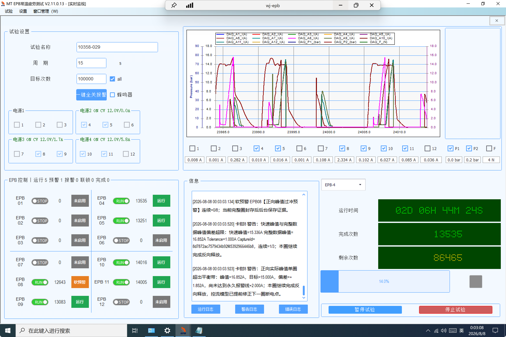

# V2.11.0.13 EPB4/EPB5 停转误显运行及“未处理异常”分析与整改方案

> 分析日期：2026-08-08
>
> 现场项目：`10358-029`
>
> 软件版本：`V2.11.0.13`
>
> 数据目录：`\\wj-epb\EPB_Data\10358-029_V2.11.0.13_0808_0005`
>
> 整改版本：`V2.11.0.15`
>
> 功能提交：`cd395cf`（Timer/运行态一致性）、`ce3ce68`（程控电源超时任务观察）
>
> 结论状态：EPB4/EPB5 的直接停转原因和界面误显原因已确认；发起 Pause 的更上游业务分支因日志字段不足，需补充日志后复现确认。

## 1. 结论

### 1.1 EPB4、EPB5 实际停转，但界面仍显示正常运行

EPB4、EPB5 并非一直正常运行。两路在 **2026-08-07 22:09:45.016** 被同步暂停了控制定时器，此后没有新的 DO 动作、循环记录或 Timer Resume；但控制层没有同步发布 `Paused`、`Recovering` 或 `SystemFault` 通道状态，界面继续沿用此前的 `Running`，所以在 2026-08-08 00:03 仍显示绿色 `RUN/运行`。

直接因果链为：

```text
EPB4/5 最后有效循环
    ↓
两个 HighPrecisionTimer 在同一毫秒进入 Pause
    ↓
EPB4 全关、压力 1 停止/释放、周期 91 取消并返回失败
    ↓
之后没有 Resume，也没有新循环
    ↓
通道运行状态未发布变化
    ↓
界面继续显示旧的 Running/绿色运行
```

这属于 **控制执行状态、通道状态机与 UI 展示状态不一致的软件故障**，不是“界面状态正确，但 EPB4/EPB5 硬件自行不动作”。

### 1.2 不是 22:09 时程控电源跳闸

22:09:45 事件发生后，电源组 2 遥测仍为：

- `Connected=True`；
- `Output=True`；
- 输出电压约 `11.997 V`；
- `Stage=Armed`；
- 输出电流为 `0 A`。

因此，EPB4/EPB5 最终无动作的直接原因是控制 Timer 已暂停，不是电源组 2 跳闸。这里的 `0 A` 是没有执行电机动作时的结果，不能单独作为开路结论。

### 1.3 大量“未处理异常”的本质

`error.20260807.001.log` 中共有 **27 条** `TaskScheduler.UnobservedTaskException`，27 条内部异常均为：

```text
System.ObjectDisposedException:
无法访问已释放的对象。
对象名：“System.Net.Sockets.NetworkStream”
```

这些异常集中在 **2026-08-07 17:21:34.291～17:22:33.249**，根因是程控电源 SCPI 查询超时以后：

1. `ReadLineAsync()` 的底层读任务仍在运行；
2. 超时包装直接返回并抛出 `TimeoutException`，没有继续 `await` 或观察原读任务；
3. 异常处理又释放了 `NetworkStream`；
4. 遗留的读任务随后以 `ObjectDisposedException` 结束；
5. GC/终结器线程稍后发现该 Task 的异常从未被观察，于是触发 `TaskScheduler.UnobservedTaskException`。

它们不等于程序发生了 27 次崩溃：全局处理器记录日志后调用了 `e.SetObserved()`。但它们仍是需要修复的真实异步任务生命周期缺陷，会污染错误日志并掩盖真正故障。

这批异常发生在 17:21～17:22，早于 EPB4/EPB5 最终同步 Pause 约 4 小时 47 分。现有证据 **不支持** 将其认定为 22:09 最终停转的直接触发原因，应作为独立问题整改。

## 2. 现场截图



截图可见：

- EPB4 显示 `RUN`、绿色“运行”，计数 `13535`，实时电流约 `0.010 A`；
- EPB5 显示 `RUN`、绿色“运行”，计数 `13251`，实时电流约 `0.016 A`；
- 电源组 2 显示 `ON CV 12.0V/0.0A`；
- EPB8/9/10/11 仍在继续动作，说明不是整套程序或采集界面整体冻结。

## 3. EPB4/EPB5 关键时间线

| 时间 | 现场证据 | 判定 |
|---|---|---|
| 22:09:30.755～22:09:39.769 | `index.db` 中 EPB4 最后一个完成圈为 cycle 13583 | EPB4 此前仍能产生有效循环 |
| 22:09:31.553～22:09:40.035 | `index.db` 中 EPB5 最后一个完成圈为 cycle 13302 | EPB5 此前仍能产生有效循环 |
| 22:09:45.013 | `压力[1]@Dev1 => 启动`；`HydraulicQualificationStarted Hydraulic=1 Generation=1131` | Dev1 组级动作开始 |
| 22:09:45.016 | 连续两条 `Timer 定时器已暂停。` | EPB4/EPB5 两个 Timer 在同一毫秒被同步暂停 |
| 22:09:45.016 | `DO操作 EPB[4]@Dev1 => 全关` | EPB4 输出进入安全关闭 |
| 22:09:45.016～22:09:45.020 | 压力 1 停止/释放；`周期91随暂停/恢复切换取消` | 组级流程被撤销，未进入正常下一圈 |
| 22:09:45.020 | `Timer 周期 91 返回失败` | 本次周期以失败结束 |
| 22:09:45 之后 | 无 EPB4/5 新 DO、循环或 Resume；其他通道继续运行 | 故障局限于相关通道控制状态，不是全局停机 |
| 08-08 00:03:08 | UI 仍显示 EPB4/5 `RUN/运行` | 实际停转约 1 小时 53 分后，界面仍显示旧状态 |

关键运行日志片段：

```text
2026-08-07 22:09:45.013  压力[1]@Dev1 => 启动
2026-08-07 22:09:45.013  AO Cylinder1 70bar
2026-08-07 22:09:45.013  HydraulicQualificationStarted Hydraulic=1 Generation=1131
2026-08-07 22:09:45.016  Timer 定时器已暂停。
2026-08-07 22:09:45.016  DO操作 EPB[4]@Dev1 => 全关
2026-08-07 22:09:45.016  Timer 定时器已暂停。
2026-08-07 22:09:45.020  Timer 周期91随暂停/恢复切换取消
2026-08-07 22:09:45.020  WARN Timer 周期 91 返回失败
```

> 注意：截图中的运行计数与 SQLite `cycle_id` 不是同一统计口径，学习圈、资格圈、尝试圈和正式圈的编号不能直接相减。本报告使用数据库时间戳确定“最后完成时间”，不以两种编号的差值计算丢失圈数。

## 4. EPB4/EPB5 根因分析

### 4.1 已证实的直接原因：Timer 被暂停后没有恢复

`Timing/HighPrecisionTimer.cs` 中 `Pause()` 会复位暂停门并记录“定时器已暂停”。Timer 只有收到 `Resume()` 后才能继续周期。

现场日志在同一毫秒连续出现两条 Pause，之后：

- 没有对应 Resume；
- 没有 EPB4/EPB5 新 DO；
- `index.db` 没有两路新 completed 圈；
- Dev1 的采集回调仍在继续；
- EPB8/9/10/11 仍继续运行。

因此，可以确定 EPB4、EPB5 的正式调度停在 Pause 门上，而不是采集程序、主线程或全套试验整体停止。

### 4.2 界面误显原因：Pause 与权威通道状态没有原子同步

`MTTfTest/FrmEpbMainMonitor.PowerSupply.cs` 的界面通过 `ApplyChannelRuntimeState(...)` 消费 `ChannelRuntimeStateChangedEvent`，再更新：

- RUN/STOP 文本；
- 绿色、黄色、红色状态色；
- “运行/暂停/报警/系统故障”等标签；
- 操作按钮是否可用。

它不会根据“最近是否产生新循环”或“Timer 是否处于 Pause”自动修正运行态。

22:09 的控制路径只暂停了 Timer，没有为 EPB4/EPB5 发布新的 `Paused`、`Recovering` 或 `SystemFault`，于是形成：

| 层级 | 事件后的真实状态 | UI 掌握的状态 | 问题 |
|---|---|---|---|
| Timer | `Paused`，等待门未再次打开 | UI 不直接读取 | Timer 与 UI 状态分裂 |
| 通道状态机 | 没有收敛到可见终态 | 仍为 `Running` | Pause 路径漏发状态事件 |
| DO/循环 | 无动作、无新完成圈 | 只作为曲线和数值显示 | 没有运行心跳判定 |
| 界面 | 应显示暂停或系统故障 | 绿色 `RUN/运行` | 展示过期状态 |

相关代码位置：

- `Timing/HighPrecisionTimer.cs:125`：周期返回失败日志；
- `Timing/HighPrecisionTimer.cs:182`：Pause 日志；
- `Controller/EpbManager.cs:222`：发布通道运行状态；
- `Controller/EpbManager.cs` 中仍存在多个直接 `timer.Pause()` 调用点；
- `MTTfTest/FrmEpbMainMonitor.PowerSupply.cs:236,269,287`：界面应用通道运行状态。

### 4.3 为什么不能唯一确认“是谁发起了 Pause”

V2.11.0.13 的 Timer 日志仅记录：

```text
Timer 定时器已暂停。
```

缺少以下字段：

- `Channel`；
- `TimerId`；
- `PauseReason/ReasonCode`；
- `Initiator`；
- `CorrelationId`；
- `OldState/NewState`；
- `DAQ Generation`；
- 受影响电源组/液压组。

22:09:45 也没有对应事故快照或通道状态变化记录。两个 Timer 同时暂停强烈指向 Dev1 组级安全、液压资格或恢复分支，但现有记录不足以在多个直接 `timer.Pause()` 调用点之间做唯一归因。

所以本次应作如下定性：

- **已证实根因**：两个 Timer 同步 Pause、未恢复、未同步通道状态，且缺少失活看门狗；
- **待复现项**：发起本次 Pause 的具体上游业务分支；
- **不影响立即修复**：无论哪个分支发起 Pause，都不允许出现 Timer 已暂停而通道仍长期显示 Running。

### 4.4 与同日 17:23 已知缺陷的关系

同一 V2.11.0.13 项目在 17:23 还发生过另一条已完整取证的 EPB4/EPB5 故障链：

1. Dev1 DAQ 回调超过 100 ms 未更新；
2. EPB4/EPB5 按失效安全关闭 DO 和共用电源组 2；
3. DAQ 重建成功，但 `.13` 恢复逻辑只识别正式阶段 `_timers`，漏掉学习阶段 Runner；
4. 电源组 2 未重新接通，学习圈却继续发出动作请求；
5. 两路以 `0.010 A`、`0.016 A` 被误判 `OpenCircuitOrOutputFault`；
6. 人工单通道重启补做电源预检后，两路恢复正常，反证了持续性硬件开路。

该事件已经在下列文档中单独分析：

[`2026-08-07_V2.11.0.13_EPB4与EPB5误报不可自恢复及未勾选可重启分析.md`](./2026-08-07_V2.11.0.13_EPB4与EPB5误报不可自恢复及未勾选可重启分析.md)

17:23 与 22:09 不是同一条直接事件，但它证明 V2.11.0.13 在 Dev1/电源组 2 的恢复参与通道、供电许可和状态收敛方面存在已知缺陷。

V2.11.0.14 已落地以下相关修复：

- 用 `PreviouslyActiveChannels` 覆盖 Timer、Runner 和液压参与通道；
- 将恢复供电集合与正式 Timer 重入集合分离；
- 电机动作前增加程控电源许可；
- `Enabled=false` 时禁止绕过项目设置重启；
- 不可自恢复禁用后立即刷新 UI。

在本轮整改开始前，从 `.13` 到 `.14` 的 `HighPrecisionTimer.cs` 和 `PswTcpClient.cs` 尚未针对本报告两个问题变更。本轮已在 `.14` 基线上继续完成：

- `cd395cf`：Timer 发布结构化状态和暂停原因，EpbManager 同步纠正通道运行态，并增加运行心跳看门狗；
- `ce3ce68`：所有 I/O 超时包装在提前退出前注册原始 Task 的故障观察，避免 NetworkStream 释放后的 Faulted Task 进入 `UnobservedTaskException`；
- 上述改动统一纳入发布版本 `V2.11.0.15`。

## 5. “未处理异常”代码根因

### 5.1 日志统计

| 项目 | 结果 |
|---|---|
| 文件 | `log/error.20260807.001.log` |
| `TaskScheduler.UnobservedTaskException` | 27 条 |
| 内部异常 | 27/27 均为 `NetworkStream` 的 `ObjectDisposedException` |
| 时间范围 | 17:21:34.291～17:22:33.249，约 59 秒 |
| 同阶段通信现象 | `warning.log` 有 9 次 `*IDN?`/SCPI `2000 ms` 超时 |
| 程序行为 | 全局处理器记录后调用 `e.SetObserved()`，未因此立即崩溃 |

### 5.2 代码执行链

`PowerSupply.Core/PswTcpClient.cs:216` 的查询逻辑为：

```csharp
var response = await AwaitWithTimeout(
    _reader.ReadLineAsync(),
    _commandTimeoutMs,
    token,
    command);
```

`AwaitWithTimeout` 使用 `Task.WhenAny(readTask, timeoutTask)`。超时时，包装方法抛出 `TimeoutException`，但原 `readTask` 仍在后台占用 `StreamReader/NetworkStream`。

`ExecuteLockedAsync` 捕获超时以后调用 `DisposeTransport()`，关闭并释放 `_reader`、`_writer` 和 `_client`。遗留的 `readTask` 随后在已释放的 `NetworkStream` 上完成，并进入 Faulted 状态。由于没有代码继续 await 它或访问它的 `Exception`，最终触发：

```text
TaskScheduler.UnobservedTaskException
  └─ AggregateException
      └─ ObjectDisposedException: NetworkStream
          └─ StreamReader.ReadLineAsyncInternal
```

`MTTfTest/Program.cs:76-79` 的全局处理器只是兜底：

```csharp
TaskScheduler.UnobservedTaskException += (s, e) =>
{
    TryWriteFatalLog("TaskScheduler.UnobservedTaskException", e.Exception);
    e.SetObserved();
};
```

因此，“未处理异常”这个日志分类容易被误解。更准确的含义是：**异步任务已经故障，但业务代码从未观察该 Task 的异常，最后由全局兜底捕获。**

## 6. 整改方案与 V2.11.0.15 落地结果

### 6.1 P0：统一 Timer 状态变更入口

禁止业务代码直接调用：

```csharp
timer.Pause();
timer.Resume();
timer.Stop();
```

统一改为控制层方法，例如：

```csharp
PauseChannelWithReason(
    int channel,
    ChannelRuntimeState targetState,
    string reasonCode,
    string initiator,
    string correlationId);
```

该方法必须在同一控制事务中完成：

1. 记录旧状态；
2. 写入 Pause 原因、发起者、关联号和时间；
3. 将通道状态更新为 `Paused/Recovering/SystemFault`；
4. 发布 `ChannelRuntimeStateChangedEvent`；
5. 最后操作 Timer 暂停门；
6. 失败时回滚或收敛到 `SystemFault`，不能留下半状态。

组级安全操作应先确定全部受影响通道，并对所有成员原子发布过渡态，再执行 Pause 和断电。

### 6.2 P0：增加运行失活看门狗

`HighPrecisionTimer` 至少公开：

- `TimerId`；
- `IsRunning`；
- `IsPaused`；
- `LastCycleStartUtc`；
- `LastCycleEndUtc`；
- `PauseUtc`；
- `PauseReason`。

控制层每 2～5 秒检查一次：

```text
RuntimeState == Running
AND (
    Timer.IsPaused
    OR now - LastCycleEnd > max(2 × 试验周期, 30 s)
    OR 应动作窗口内无 DO/无采样心跳
)
```

命中后必须在 1 秒内：

- 将通道切换为 `Paused` 或 `SystemFault`；
- UI 显示黄色或红色，不再显示绿色；
- 写结构化故障日志；
- 根据原因进入自动恢复或人工确认流程。

运行绿灯应采用组合条件：

```text
RuntimeState == Running
AND Timer.IsPaused == false
AND 运行心跳新鲜
```

电流 `0 A` 在圈间可能正常，不能单独决定运行态；但“长时间无新循环 + Timer 已暂停”必须推翻绿色 Running。

### 6.3 P0：恢复流程必须形成唯一终态

任何安全/DAQ/液压/电源恢复分支只能以以下结果之一结束：

- 全部目标 Timer 已 Resume，并收到首个新循环心跳；
- 通道进入 `Paused`，等待明确人工操作；
- 通道进入 `SystemFault/AlarmStopped/InterlockStopped`；
- 通道被显式禁用。

禁止出现“Timer 已暂停、恢复任务已退出、RuntimeState 仍为 Running”的终态。

### 6.4 P0：修复 SCPI `ReadLineAsync` 遗留任务

推荐处理顺序：

1. 查询事务保存原始 `readTask`；
2. 超时时主动中止当前连接，使不可取消的 `ReadLineAsync` 退出；
3. 继续 await 原 `readTask`，显式观察并吞掉预期的 `ObjectDisposedException/IOException`；
4. 完成清理后，再向上抛业务 `TimeoutException`；
5. 在旧读任务退出之前，禁止下一条 SCPI 请求复用同一 `StreamReader`。

示意代码：

```csharp
var readTask = _reader.ReadLineAsync();
var completed = await Task.WhenAny(readTask, Task.Delay(timeoutMs, token));

if (completed != readTask)
{
    AbortTransport();
    try
    {
        await readTask.ConfigureAwait(false);
    }
    catch (ObjectDisposedException) { }
    catch (IOException) { }

    throw new TimeoutException($"{operation} 超时（{timeoutMs} ms）");
}

return await readTask.ConfigureAwait(false);
```

如果短期内受框架限制不能完整改造，至少给超时后遗留 Task 增加同步 Fault continuation 并读取 `t.Exception`，避免未观察异常：

```csharp
_ = readTask.ContinueWith(
    t => _ = t.Exception,
    CancellationToken.None,
    TaskContinuationOptions.OnlyOnFaulted |
    TaskContinuationOptions.ExecuteSynchronously,
    TaskScheduler.Default);
```

V2.11.0.15 采用该同步 Fault continuation，并保留“超时后整体释放当前传输层、禁止在同一连接上继续请求”的隔离策略。因此旧读取只关联已关闭的旧 `StreamReader`，不会复用后续新连接。后续若需要在不重连的前提下取消单条查询，可再演进为“单一后台读循环 + 请求队列/TCS + 连接代次”。

### 6.5 P1：优化异常分类和日志可观测性

1. 保留 `TaskScheduler.UnobservedTaskException` 作为最后防线，不把它当正常错误处理机制；
2. 日志分类从笼统“未处理异常”细分为“基础设施异步任务未观察”；
3. 按异常类型、设备端点和分钟去重/限流；
4. SCPI 超时日志增加端点、命令、连接代次、请求 ID、耗时和清理结果；
5. Timer Pause/Resume/Stop 日志统一增加：

```text
Channel
TimerId
GroupId
OldState
NewState
ReasonCode
Initiator
CorrelationId
DaqGeneration
LastCycleEndUtc
```

### 6.6 V2.11.0.15 实际落地记录

| 整改项 | 实际实现 | 提交 |
|---|---|---|
| Timer 可观测状态 | `HighPrecisionTimer` 新增 `Created/Running/PausePending/Paused/Completed/Stopped/Faulted` 状态、状态事件、启动/最近圈/暂停时间和 `PauseReason` | `cd395cf` |
| Pause 原因追踪 | 人工暂停、批次/单通道优雅暂停、DAQ 自恢复、DAQ 安全、液压自愈、电源自愈、活动圈上限和电源组紧急关闭均传入明确 Reason | `cd395cf` |
| UI 即时纠正 | Timer 进入 `PausePending/Paused` 时，如果通道仍为 `Running/WarningRunning`，控制层立即发布对应通道状态，UI 不再继续显示绿色运行 | `cd395cf` |
| 运行失活看门狗 | 默认每 `2000 ms` 巡检；Timer 已停、已故障，或超过 `max(30 s, 2×周期)` 无循环心跳时，发布 `SystemFault`、暂停 Timer 并执行安全全关 | `cd395cf` |
| 自恢复保护 | 看门狗只纠正 `Running/WarningRunning`，不会覆盖 `Recovering/PausePending/Paused/AlarmStopped` 等已有权威状态 | `cd395cf` |
| 超时 Task 观察 | `AwaitWithTimeout` 的泛型和非泛型分支在超时/取消提前退出前，均给原始 I/O Task 注册 `OnlyOnFaulted + ExecuteSynchronously` continuation 并读取 `Exception` | `ce3ce68` |
| 传输隔离 | 原有 `ExecuteLockedAsync` 继续在 I/O、Socket、Timeout 异常时整体释放连接；旧读取不会与后续新连接复用同一个 `StreamReader` | `ce3ce68` |
| 回归测试 | 新增 Timer 暂停状态、停止/陈旧心跳决策和 3 次回环 TCP 超时后强制 GC 的测试 | `cd395cf`、`ce3ce68` |

本次没有删除 `TaskScheduler.UnobservedTaskException` 全局兜底。它仍作为最后防线存在，但正常的程控电源超时清理不应再到达该兜底。

## 7. 现场处置建议

1. V2.11.0.13 不再继续执行新的长周期试验，先备份当前项目目录；
2. 22:09:45 之后 EPB4/EPB5 没有有效动作，不得按界面仍显示的计数认定已完成耐久循环；
3. 以 `index.db` 中最后 `status=completed` 的正式圈和原始 BIN/CSV 为准，重新核对两路有效完成数；
4. 升级到 V2.11.0.15；该版本同时包含 `.14` 的 DAQ 恢复供电、动作许可、项目启用修复，以及本报告新增的 Timer/运行态一致性和 SCPI 遗留 Task 修复；
5. 部署前保留 `.13` 项目数据和程序副本，部署后执行第 8 节故障注入和超时压力测试；
6. 复测通过前，操作人员发现“绿色运行但计数长期不变/无电流动作”时，应立即暂停试验并保存日志，不要仅凭绿色状态继续计时。

## 8. 必须执行的回归测试

### 8.1 Timer 与 UI 一致性

1. 正常运行中调用统一 Pause，UI 必须在 1 秒内从绿色 `Running` 切换为 `Paused/SystemFault`；
2. 人为制造 `Timer.IsPaused=true`、`RuntimeState=Running`，看门狗必须在 30 秒内发现并收敛状态；
3. 组级 Pause 同时影响 EPB4/EPB5 时，两路状态、摘要计数和按钮必须同步变化；
4. Resume 只有在两个 Timer 都恢复并收到首个新循环心跳后，才允许显示绿色 Running；
5. 电源组保持 ON/Armed、Timer 不运行时，界面不得显示正常运行。

### 8.2 DAQ/电源恢复

1. 在学习、资格、正式三个阶段分别注入 Dev1 `DaqCallbackStale`；
2. 验证先关闭 EPB4/EPB5 DO 和电源组，再重建 DAQ；
3. 验证程控电源完成 `OUTP ON`、输出电压稳定并签发许可后，才允许 Forward/Reverse DO；
4. 故意保持电源 OFF，近零电流不得累计为 `OpenCircuitOrOutputFault`；
5. 恢复失败时必须进入可见故障态，不能保留 Running。

### 8.3 程控电源异步任务

1. 连续制造 1000 次查询超时、断连和重连；
2. 测试结束后强制 `GC.Collect()`、`GC.WaitForPendingFinalizers()`；
3. `TaskScheduler.UnobservedTaskException` 必须为 0；
4. 不得出现“流正在由其上的前一操作使用”；
5. 不得发生上一条查询遗留读取吞掉下一条 SCPI 响应；
6. 超时后新连接代次必须能够稳定执行 `*IDN?`、电压、电流和输出状态查询。

## 9. 现场验收标准

修复版本只有同时满足以下条件才算通过：

- Timer、通道状态机、UI 三者状态始终一致；
- 任一 Running 通道超过 30 秒无有效心跳时，界面能自动转为暂停/故障；
- 所有 Pause/Resume 均可从日志唯一追溯到通道、原因和调用方；
- 任意阶段的 Dev1 DAQ 短暂停顿都能安全断电并按完整屏障恢复；
- 电源许可缺失时，动作被门禁拒绝，且不误累计卡钳开路；
- 连续 SCPI 超时压力测试后，“未处理异常”计数为 0；
- EPB4/EPB5 断点续测后的正式圈号连续，无重复计数和无效圈混入；
- 现场不再出现“实际无动作，但绿色运行持续超过一个周期”的情况。

### 9.1 自动化验证结果

- `AdaptiveControlTests` Release 构建通过；
- 新增“Timer暂停事件立即纠正运行态”测试通过；
- 新增“Timer失活看门狗识别停止和陈旧心跳”测试通过；
- 新增“程控电源查询超时不遗留未观察NetworkStream异常”测试通过：连续 3 次 `*IDN?` 超时、释放连接并强制 GC/终结器后，目标未观察异常为 0；
- 完整测试执行在与本次改动无关的既有 `ProjectLogStoreTests.ProjectRestartCleanupIsIsolated` 用例停止，错误为“活动日志未在清空前轮转”；在本轮代码修改前的 `.14` 基线上同样复现，因此不作为上述两个功能回归失败；
- 真实 NI DAQ、程控电源和 EPB4/EPB5 联机故障注入仍属于部署验收项，不能由纯软件自动化替代。

## 10. 最终定性表

| 项目 | 定性 |
|---|---|
| EPB4/EPB5 22:09:45 后无动作 | 两个控制 Timer 同步 Pause 且未恢复 |
| 界面仍显示绿色运行 | Pause 路径未同步发布通道状态，且缺少运行失活看门狗 |
| 电源组 2 | 事件后仍为 ON/Armed、约 11.997 V，不是最终停转直接原因 |
| 具体 Pause 发起分支 | 现有日志不能唯一确定，需补结构化日志并复现 |
| 17:23 的 EPB4/5 假开路 | V2.11.0.13 已知的 DAQ 恢复供电遗漏，与 22:09 不是同一直接事件 |
| 27 条“未处理异常” | SCPI 超时后遗留 `ReadLineAsync` 未被观察，Stream 释放后产生的异步任务异常 |
| “未处理异常”是否导致主程序崩溃 | 没有；全局处理器调用了 `SetObserved`，但代码缺陷必须修复 |
| 两类问题的关系 | 无直接时间因果证据，应分别整改 |

## 11. 证据索引

| 证据 | 位置 | 用途 |
|---|---|---|
| 现场截图 | `docs/截图/0808/PixPin_2026-08-08_00-02-45.png` | 证明 00:03 时 EPB4/5 仍显示运行及基线电流 |
| 运行日志 | `数据目录/log/run.20260807.001.log`，22:09:45.013～22:09:45.020 | 证明两个 Timer 同步 Pause、EPB4 全关、液压释放、周期 91 取消 |
| 告警日志 | `数据目录/log/warning.20260807.001.log`，22:09:45.020 | 证明周期 91 返回失败 |
| 错误日志 | `数据目录/log/error.20260807.001.log`，17:21:34～17:22:33 | 统计并定性 27 条未观察 NetworkStream 异常 |
| 循环索引 | 数据目录中的 `index.db` | 确定 EPB4/EPB5 最后 completed 圈时间，并确认其他通道继续运行 |
| 电源遥测 | `数据目录/PowerSupplyTelemetry` | 排除 22:09 时电源组 2 跳闸 |
| Timer 代码 | `Timing/HighPrecisionTimer.cs` | 确认 Pause 门和周期失败行为 |
| 控制状态代码 | `Controller/EpbManager.cs` | 确认通道状态发布和多个直接 Pause 调用点 |
| UI 代码 | `MTTfTest/FrmEpbMainMonitor.PowerSupply.cs` | 确认 UI 依赖运行状态事件更新 |
| 程控电源代码 | `PowerSupply.Core/PswTcpClient.cs` | 确认超时包装、传输层释放和遗留读任务链 |
| 全局异常处理 | `MTTfTest/Program.cs` | 确认“未处理异常”记录及 `e.SetObserved()` |
| 整改提交 | `cd395cf`、`ce3ce68` | 追溯 Timer/运行态一致性及程控电源超时 Task 修复 |

---

本报告没有把缺少直接证据的“具体 Pause 发起分支”写成确定根因。三个 P0 修复已在 V2.11.0.15 代码中落地：**Timer/运行态同步、运行失活看门狗、SCPI 超时 Task 故障观察与传输隔离**；剩余工作是按第 8、9 节完成真实设备故障注入验收。
