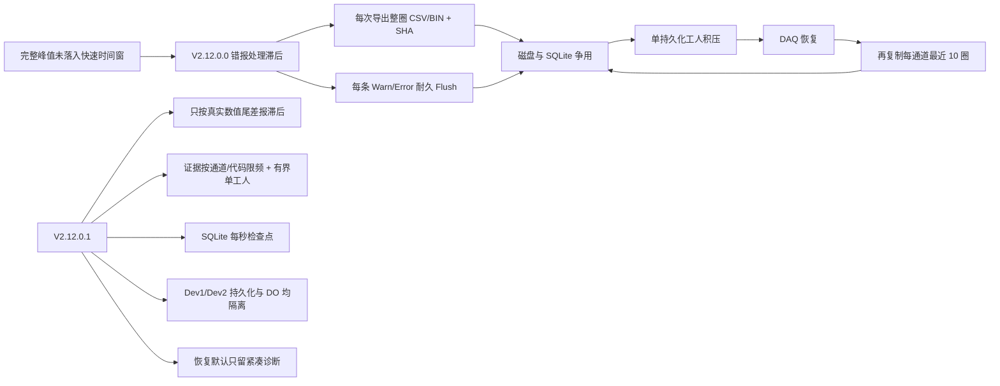

# V2.12.0.1 卡顿整改实施与上线验证

> **后续现场结论（2026-08-08 20:13）：V2.12.0.1 长时间运行暴露了 x86 写盘视图地址空间和访问器生命周期故障，本版不批准上线。详见 [V2.12.0.1 EPB4/EPB5 反复自恢复失败根因与 V2.12.0.2 彻底整改](./2026-08-08_V2.12.0.1_EPB4-5反复自恢复失败根因与V2.12.0.2彻底整改.md)。**

> 对应事故：10358-029，V2.12.0.0，2026-08-08 14:13:36—14:38:01  
> 根因报告：[10358-029 V2.12.0.0 全历程卡顿、多故障根因与彻底整改方案](./2026-08-08_10358-029_V2.12.0.0_全历程卡顿与多故障根因及彻底整改方案.md)  
> 整改版本：V2.12.0.1  
> 文档状态：源码整改完成；自动化验证通过；等待六通道台架老化验收

## 1. 技术结论

V2.12.0.0 的卡顿不是单一 CPU 问题，而是“误预警 → 全量证据复制 → 日志耐久刷盘 →
SQLite 高频事务 → 两设备共用后台工人 → DO 跨设备锁竞争 → DAQ 恢复再复制大量证据”的
正反馈链。V2.12.0.1 已从产生端、放大端和实时控制端同时切断该链，而不是通过调大阈值掩盖问题。

本次源码整改完成 20 个文件、约 724 行新增和 193 行删除。Release 主程序已成功构建，生成的
`MTTFTest.exe` 文件版本和产品版本均为 `2.12.0.1`；自动化回归从基线 281 项增加到 284 项，
最终 `284/284` 通过。

当前可以确认的是：已定位的软件必现放大器均已整改，代码、离线回归和本机真实 MMF/SQLite
六通道实时写盘压力回归通过。当前不能替代现场确认的是：NI 驱动、现场硬盘、程控电源和六通道
机械负载共同运行时的尾延迟。因此在完成本文
第 8 节现场门槛前，不应直接批准批量上线。

## 2. 整改前后的负载链



## 3. 已落地的代码整改

| 原问题 | V2.12.0.1 实施内容 | 结果与安全边界 |
|---|---|---|
| 475 次峰值滞后预警中 0 次真实超过 100 ms，最大 97.5 ms | 将“时间窗可比较性”和“处理尾差是否超限”拆成两个判定；只有有限数值且 `lag > limit` 才报处理滞后 | 时间窗不可比较只禁止峰值偏差计数，不再伪造后台卡顿告警；真实超过阈值仍报警 |
| 每条 Warn/Error 调用耐久刷新 | 普通日志只入后台日志队列；停止、报警、退出等明确持久化边界仍使用显式 Flush | 消除本次约 1241 次额外耐久刷新请求，不牺牲关键终态日志 |
| 每个软预警都 `Task.Run` 全量导出整圈 CSV/BIN、计算 SHA、扫描目录 | 新增每通道/故障码最短 600 秒间隔、全局队列容量 2、单一长任务后台工人；任务完成后清理幂等表 | 软预警仍可观察，首份完整证据仍保留；高频重复预警不再把线程池和磁盘打满 |
| 每次快照前后递归扫描整个 WarningSnapshots | 增加 30 秒存储状态缓存；文件集变化时失效；配额删除时强制刷新 | 避免目录越大、每次导出越慢的二次放大 |
| DAQ 恢复终态复制每通道最近 10 圈，当前事故达到 754.3 MiB | 默认 `DaqIncidentCopyRecentCycles=false`，保留 incident.json 和 DAQ timing 诊断，不再复制已存在的正式圈原始文件 | 恢复证据从“重复原始数据”变为“紧凑事故索引”；专项取证时才临时开启重复制 |
| Dev1/Dev2 共用一个持久化工人 | 每个 DAQ 设备独立队列、独立信号和独立消费任务 | 一个设备慢写或重试不再堵塞另一个设备 |
| 每设备每约 10 ms 开 SQLite 事务并逐通道更新 running 进度 | 原始 MMF 数据仍逐批写入；SQLite running 状态改为每秒检查点；封圈同步写最终样本数 | 理论事务频率由约 200 次/秒降到约 2 次/秒；异常断电最多损失 1 秒“运行中进度显示”，不会丢已写原始 MMF，也不影响完成圈索引 |
| 活动圈超过 37,500 样本后同一异常重复发布 | 每通道首次超限后锁存，后续批次直接跳过，封圈/新圈时复位 | 同一故障只发布一次，不再形成 117 次重复日志/恢复请求 |
| Dev1/Dev2 共用一个高优先级 DO 工人和全局写锁 | 每个 NI DO 设备持有独立高优先级工人和独立写锁；生命周期初始化仍受全局锁保护 | 跨设备 DO 不再互相排队；同设备正反向状态仍在同一锁内保持互斥和原子写 |
| 快速夹紧来不及先形成 LoadRise 状态时直接 `ThresholdBeforeLoadRise` 硬故障 | 只有 2 kHz 完整速率峰值同时确认达到目标时，按 `FullRateRapidClamp` 立即断电并软预警 | 解决真实快速夹紧误硬停；没有独立完整速率证据时仍保持原硬故障，不降低传感器跳变保护 |
| 重复 DAQ 恢复请求在去重前消耗 recovery epoch | 只有成功取得设备恢复所有权的请求才递增 epoch | 消除“代次增长但没有对应恢复任务”的状态污染 |

## 4. 新增和变更的运行参数

`MTTfTest/Config/AlarmConfig.xml`：

```xml
<WarningSnapshots
  FullEvidenceMinimumIntervalSeconds="600"
  FullEvidenceQueueCapacity="2" />
```

- `FullEvidenceMinimumIntervalSeconds=600`：同一通道、同一故障码 10 分钟内最多保存一份完整软预警证据。
- `FullEvidenceQueueCapacity=2`：最多允许两份完整证据等待后台导出；超出时保留日志和 UI 预警，但不排队复制原始数据。

`MTTfTest/App.config`：

```xml
<add key="DaqIncidentCopyRecentCycles" value="false" />
```

该值上线必须保持 `false`。只有研发人员为一次有明确起止时间的专项取证，且已确认磁盘空间和试验
负载允许时，才能临时设为 `true`；取证结束必须恢复 `false`。

## 5. 证据、方法和回归结果

### 5.1 比较基线

- 基线：仓库标签 `2.12.0.0`，提交 `37e4a7e`。
- 基线自动化：281/281 通过。
- 整改版本：源码声明、EXE FileVersion、EXE ProductVersion 均为 `2.12.0.1`。
- 整改自动化：284/284 通过。
- 构建：`MTTfTest/MTTfTest.csproj`，Release/AnyCPU，成功且无编译错误。
- 差异格式检查：`git diff --check` 通过。

### 5.2 本次新增或强化的关键断言

1. `NaN` 或缺失尾差不再当作处理滞后。
2. 97.5 ms 在 100 ms 阈值内，不报警；100.1 ms 才报警。
3. 2 kHz 完整速率证据确认的快速夹紧可软完成；相同代表样本在缺少完整速率证据时仍硬停。
4. DO 设备上下文必须拥有独立写锁和独立高优先级工人。
5. 高优先级 DO 调用在底层阻塞时仍保持 100 ms 有界返回，禁止回退到调用线程无限等待。
6. 原有 DAQ、恢复、液压、电源、日志、10 万圈仿真和十万样本零持续分配回归全部继续通过。

### 5.3 六通道真实写盘压力回归

新增专项入口：

```powershell
.\Tests\AdaptiveControlTests\bin\Release\AdaptiveControlTests.exe --persistence-load
```

该用例不是空实现或内存假记录器，而是直接使用产品的 `EpbDiskWriter`、内存映射原始文件、
SQLite `index.db` 和重构后的两个 `DaqPersistenceCoordinator` 工人。它按现场配置同时运行
EPB4、5、8、9、10、11，以 2kHz、每批 20 点、每 10ms 一批持续实时送入 10 秒。

| 指标 | 实测结果 | 回归门槛 |
|---|---:|---:|
| 实时生产阶段 | 10,008.9 ms | <15,000 ms |
| 生产结束后队列排空 | 1.8 ms | <5,000 ms |
| Dev1 最大队深 | 7 批 | <64 批 |
| Dev2 最大队深 | 7 批 | <64 批 |
| SQLite running 进度事务 | 20 次/10秒 | 约 2 次/秒 |
| 每通道样本数 | 20,000 | 必须精确相等 |
| Pause / Failed | 0 / 0 | 必须为 0 / 0 |
| SQLite `integrity_check` | ok | 必须为 ok |
| 完成圈最终样本索引 | 6/6 正确 | 必须 6/6 |

这证明在本机文件系统上，整改后的真实写盘链能持续跟上六通道现场生产速率，且双设备队列均保持
很低水位。它仍不等同于现场 8 小时验收，因为没有接入 NI 驱动、实际卡钳动作、UI 绘图和现场
安全软件；因此第 8 节门槛不能删除。

### 5.4 已知编译警告

Release 构建仍有仓库既存警告，包括旧 UI 类型与 `ZlgCanComm` 重名、未使用字段、部分 async 方法
无 await 等。它们不是本次卡顿链的新增错误，构建结果为成功；后续应单独清理，但不应与本次
V2.12.0.1 性能整改混在同一现场验证中扩大变更面。

## 6. 为什么这不是“只调参数”

- 没有把峰值允许滞后从 100 ms 调大；修复的是错误的布尔语义。
- 没有简单扩大 DAQ 队列；修复的是生产速率、消费隔离和事务粒度。
- 没有关闭告警或删除证据；保留首次完整证据、所有结构化日志和终态事故诊断，只抑制重复大文件。
- 没有让快速夹紧无条件通过；必须有独立 2 kHz 全速率证据。
- 没有删除 DO 超时保护；仍在 100 ms 返回失败并由上层进行电源组安全隔离。

## 7. 发布与回滚步骤

### 7.1 生成正式现场包

正式包必须从已评审、已提交的干净工作树运行：

```powershell
powershell -ExecutionPolicy Bypass -File .\Tools\Build-Release.ps1 `
  -MsBuild "C:\Program Files\Microsoft Visual Studio\2022\Professional\MSBuild\Current\Bin\MSBuild.exe"
```

脚本会生成 `build-identity.json` 和 `SHA256SUMS.txt`。不得直接把开发机当前 `bin/Release` 当作正式
现场包，因为它没有经过“干净提交 + 配置哈希 + 校验清单”的发布门禁。

### 7.2 台架部署

1. 停止试验并确认所有 EPB DO、液压 AO/DO、四路电源输出均已关闭。
2. 备份现有程序目录、项目 XML、自适应模型和当前 `index.db`；保留 V2.12.0.0 现场包用于回滚。
3. 校验 V2.12.0.1 包内 `SHA256SUMS.txt`，核对 `build-identity.json` 的版本、提交和配置哈希。
4. 整目录替换程序，不在旧目录中混拷 DLL；确认 `AlarmConfig.xml` 含两个新参数且
   `DaqIncidentCopyRecentCycles=false`。
5. 首次启动只加载 10358-029 配置，不立即全通道运行；先检查程序标题和文件版本为 2.12.0.1。
6. 按“2 通道 10 分钟 → 6 通道 30 分钟 → 6 通道 8 小时”逐级放量。任何一级失败立即停止，不进入下一级。

### 7.3 回滚触发条件

出现以下任一项应立即安全停机并回滚，而不是现场继续调大阈值：

- DO 高优先级命令超时或实际 NI 写入超过 100 ms。
- 任一通道电流达到安全线却未立即断电。
- DAQ 队列持续增长、恢复反复触发或两设备互相影响。
- 完成圈的 CSV/BIN/SQLite 圈号、样本数或时间戳不一致。
- 程控电源、液压联锁或报警锁存行为与 2.12.0.0 安全逻辑不一致。

回滚时使用完整 V2.12.0.0 包恢复，不混用 2.12.0.1 DLL；新产生的数据目录单独封存，禁止覆盖。

## 8. 六通道现场上线门槛

| 验收项 | 必须达到的门槛 | 取证位置 |
|---|---|---|
| UI 流畅性 | 连续 8 小时无界面无响应、曲线长时间空缺或操作延迟超过 1 秒 | 现场观察 + Windows 性能记录 |
| 峰值滞后语义 | 阈值内尾差不得出现“峰值完整数据处理滞后”；如出现必须能在日志中证明实际 `lag > 100ms` | warning.log / run.log |
| 软预警证据 | 同通道同故障码 600 秒内最多 1 份完整快照；待处理队列不得超过 2 | WarningSnapshots / 日志 |
| 事故快照 | `recentCycleCopiesIncluded=false`；单次恢复不再生成六通道最近 10 圈副本 | IncidentSnapshots/incident.json |
| 持久化 | 正常运行无 `DaqPersistenceQueueFull`，无持续 `DaqPersistenceLag`；Dev1 慢写不得使 Dev2 停顿 | DAQ timing/runtime CSV |
| DO 实时性 | 高优先级 OFF 无超时，`TotalMs` P99 < 100 ms；不得出现跨设备队头阻塞 | DO timing / warning.log |
| 圈数据完整性 | 6 通道完成圈号连续；SQLite integrity_check=ok；CSV/BIN 样本数、圈号、时间戳一致 | index.db + 抽检导出 |
| 资源稳定性 | 进程 CPU、内存、句柄、线程、磁盘队列在稳态无单调增长；禁止同时运行压缩和全盘扫描 | PerfMon / 任务管理器 |
| 安全回归 | 过流、断流、压力失败、DAQ 失新、程控电源保护均能按现有策略断电、隔离和锁存 | 故障注入记录 |

建议现场采集 Windows 性能计数器：进程 `% Processor Time`、Private Bytes、Handle Count、Thread Count，
以及物理磁盘 `% Disk Time`、Current Disk Queue Length、Avg. Disk sec/Write。V2.12.0.0 的封存缺少这些
整机指标，本次必须补齐，才能把剩余尾延迟准确区分为应用、磁盘、驱动或外部进程。

## 9. 限制与后续问题

1. 自动化测试可以证明算法、并发边界和回归行为，但不能模拟 NI 驱动在真实硬件上的写入尾延迟。
2. `FullEvidenceMinimumIntervalSeconds=600` 是本事故负载下的上线默认值；若未来改变周期、采样率或证据法规要求，需要重新容量评估，不能只凭感觉修改。
3. 外部硬件看门狗、独立安全继电器属于系统级最终保护，软件整改不能替代。若设备风险等级要求单故障安全，应把该项列入硬件整改计划。
4. 既存 UI/类型重名编译警告和旧代码清理应另开版本处理，避免影响本次验证归因。

## 10. 上线判定

当前判定为：**V2.12.0.1 源码整改和离线验证通过，具备进入六通道台架验收的条件；尚未具备跳过台架直接批量上线的条件。**

只有第 8 节全部通过、封存新的运行目录并完成复盘后，才能把状态改为“批准上线”。若其中任一项
不通过，应使用新的现场证据继续定位，不允许回退到“扩大阈值、关闭日志、关闭告警”的临时方案。
