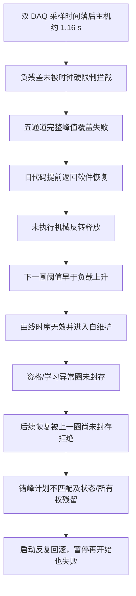

# 10358-029 V2.12.0.2 全历程自维护失控根因与 V2.12.0.3—V2.12.0.19 彻底整改

## 1. 结论

V2.12.0.2 频繁进入自维护、EPB4 最终无法再次启动，并不是五只卡钳在同一时刻同时发生机械故障，也不是简单把自维护次数或超时阈值调大即可解决。现场发生的是一条由软件缺陷闭环放大的故障链：

1. 两块 DAQ 的采样时间在 23:55 左右同时落后主机约 1.16 s；时钟判定只拦截“正向残差”，没有拦截绝对值相同的“负向残差”，异常采样仍被当作实时数据使用。
2. EPB4、5、9、10、11 的完整峰值覆盖检查同时失败。旧代码在正转证据失败后提前返回，没有执行机械反转释放。
3. 下一圈从“仍夹紧”状态开始，很快达到 15 A，触发 `ThresholdBeforeLoadRise`，被判定为曲线时序无效。
4. 连续的软件恢复在资格圈/学习圈中失败时，活动圈没有封存；随后所有重试都被“上一圈尚未封存”拒绝。
5. 单通道恢复又复用了不包含该通道的全局错峰计划，产生“通道不在当前错峰计划中”。失败和取消路径没有统一回到可重试停机态，最终出现恢复所有权残留、启动回滚和不能再次进入试验。

因此，频繁自维护只是外部表现，根因是“DAQ 时间有效性、机械安全收尾、圈事务封存、恢复计划作用域和生命周期归一化”五个环节同时存在闭环缺口。

V2.12.0.3 已对上述五个根因逐项修复，并同时修复 EPB8 硬报警最近 10 圈未导出问题。修复后的原则是：软件/DAQ 瞬态故障不得永久隔离卡钳；必须先安全释放，再封存当前圈并进入可重试状态；只有独立、可重复验证的卡钳硬件故障才允许停用通道。

后续完成性审计又发现 V2.12.0.3 的写盘超时终态仍可能释放未成功写入的当前批次，并把序号误推进为“已持久化”。该缺口已在 V2.12.0.4 修复：持久化超时只触发安全停机与自维护，原批次继续有界退避重试；真实写入成功前不得推进持久化边界，失败状态也不得通过 Stop 重启门禁。详见 [V2.12.0.4 写盘超时数据完整性补充整改](./2026-08-09_V2.12.0.4_写盘超时数据完整性补充整改.md)。

最终完成性审计确认，整台 DAQ 恢复已经使用耐久边界，但液压、电源、非 DAQ 电气和普通软件预警仍可能在后台 Raw 批次到达前直接废止当前圈。V2.12.0.5 将主要恢复入口统一为耐久收口；V2.12.0.6 继续封闭 Timer、受影响组硬期限清场、活动圈上限和正式/报警/学习圈的终态旁路，并增加当前圈身份和 SQLite 唯一更新检查。V2.12.0.7 又把普通软预警改为默认有界 JSONL 标量证据、将容量统计改为增量维护，并修复四段运行身份截断。V2.12.0.8 补齐重复 OFF 队列/等待句柄、DAQ 后台任务生命周期、快速夹紧候选误判和污染自适应模型跨重启复用。V2.12.0.9 收口 UI 配置任务、UI 文件有界队列和公共任务监督排空竞态。V2.12.0.10 增加同一 RunId 连续会话和自维护风暴机器红线。V2.12.0.11 再将最后通道自然完成、人工停止和报警停机统一接入 StopAll 物理安全与 Raw/耐久边界收尾，禁止 `_runnerCache` 残留和提前 `Closed=True`。V2.12.0.12 把无人值守检查点和撤权事件绑定同一 RunId；V2.12.0.13 进一步要求同进程恢复、进程自重启和正常暂停恢复全部按合法 RunId 严格隔离，禁止旧 `SystemFaultRaised` 任务影响新运行。V2.12.0.14 把 UI 历史批次追赶改为每设备最新值槽，将采集层 UI 唤醒改为容量 1 合并信号，并降低长跑曲线裁剪和主机探针开销。V2.12.0.15 进一步把窗体两槽抽成可并发压力验证的 `LatestPairMailbox<T>`，并将三个主要窗体的遗留内存日志从每类 100,000 条收紧到 2,000 条。V2.12.0.16 最终封闭“单所有者无限自维护”缺口：DAQ、Timer、受影响组、启动定位和普通可恢复卡钳资格复核连续三次软件失败后，只允许同一 RunId 发布一次整批安全重建；仍无独立硬件证据时不得锁存卡钳；关闭路径先排空控制/液压后台任务再释放硬件。V2.12.0.17 又封闭退出数据边界：最后 Raw/SQLite 前缀未确认时保持断能、窗口和 writer 存活，禁止结束进程。V2.12.0.18 最后将全局固定 MMF 名称改为按数据根目录稳定作用域，既保留同目录互斥，又消除独立验证/诊断目录对正式写盘器的误阻塞。详见 [V2.12.0.16 自维护有界熔断与整批自动重建整改](./2026-08-09_V2.12.0.16_自维护有界熔断与整批自动重建整改.md)、[V2.12.0.17 退出数据耐久门禁与流畅运行补充整改](./2026-08-09_V2.12.0.17_退出数据耐久门禁与流畅运行补充整改.md)和[V2.12.0.18 内存映射命名隔离与并行写盘闭环](./2026-08-09_V2.12.0.18_内存映射命名隔离与并行写盘闭环.md)。因此后续台架和现场验证版本统一为 V2.12.0.18。

V2.12.0.19 进一步移除了主程序对重复 `ZlgCanComm` UI 类型的无用依赖，将本地 `ToggleButton.cs` 显式加入旧式项目，并让 Config、x86/x64 SQLite 互操作库及语言资源全部进入确定性递归身份。Windows PowerShell 5 与 PowerShell 7 构建得到同一配置 SHA，后续台架和现场验证版本因此统一更新为 V2.12.0.19。详见[V2.12.0.19 发布依赖去重与递归身份闭环](./2026-08-09_V2.12.0.19_发布依赖去重与递归身份闭环.md)。

## 2. 分析范围与数据可信度

### 2.1 数据源

- V2.12.0.2 封存目录：`\\wj-epb\EPB_Data\10358-029_V2.12.0.2_0809_0001`
- 现场运行目录：`\\wj-epb\EPB_Data\10358-029`
- EPB8 原报警目录：`AlarmSnapshots\20260808_231726-EPB08\EPB08_ALARM`
- 截图、运行日志、报警日志、错误日志、HOST 运行指标、SQLite 圈索引、CSV/BIN 原始数据。

### 2.2 封存索引损坏及恢复

封存目录中的 `index.db` 不是完整可查询副本。文件头存在，但 SQLite `PRAGMA integrity_check` 报数据库损坏，多处 B-tree 页面为全零。这是一个独立的 P0 数据封存问题：仅“复制完成”不能证明 SQLite 一致性。

现场原目录的数据库副本完整性检查为 `ok`，但其中包含封存时间之后的新运行数据。为避免污染证据，已按封存截止时间 `2026-08-09 00:00:13.9999999 +08:00` 过滤，并创建只读旁路恢复索引，未覆盖损坏原件：

`\\wj-epb\EPB_Data\10358-029_V2.12.0.2_0809_0001_RECOVERED_INDEX`

恢复结果：

| 项目 | 结果 |
|---|---:|
| 源数据库圈记录 | 118871 |
| 截止时间内保留 | 118192 |
| 排除封存后新记录 | 679 |
| 恢复库完整性 | `ok` |
| 恢复库 SHA-256 | `3e3948a86638e6716c6e3583bb7b6d8a73fed1ffdcb798d7e5edeade71a30e47` |

恢复库保留了现场退出时仍未封存的负圈，例如 EPB4 `-897`、EPB9 `-934`、EPB11 `-930`。这些记录本身就是资格/学习圈事务未正常收尾的直接证据。

## 3. 现场资源与卡顿结论

从 2798 条约 1 Hz 的 HOST 运行记录统计：

| 指标 | 平均 | P95 | 最大 |
|---|---:|---:|---:|
| 程序 CPU | 7.87% | 12.70% | 44.50% |
| 系统 CPU | 32.44% | 66.20% | 92.30% |
| 程序工作集 | 213.72 MiB | 247.40 MiB | 341.90 MiB |
| DAQ 到达滞后（564 条） | 137.46 ms | 1166.51 ms | 1172.47 ms |

任务管理器截图中的程序 42.3%、系统 98% 属于高风险瞬时负载，但不能据此认定程序长期占满 CPU；同一截图中任务管理器自身占用 45.6%。真正与 23:55 故障同步的证据是两个 DAQ 时间线都落后主机约 1.16 s，而不是单纯的平均 CPU 高。

风险仍然存在：系统 CPU 接近 100% 会增加回调、绘图、日志和磁盘调度抖动，因此 V2.12.0.19 必须继续保留运行时监控和现场压力验收。但本次五通道自维护失控的直接原因不是持续 CPU 饱和，而是时间残差漏判后被错误恢复链放大。V2.12.0.14—V2.12.0.15 对 UI 历史追赶和长跑裁剪的收口是防止性降负；V2.12.0.16 保证软件恢复失败时层级必然前进，V2.12.0.17 保证退出不会取消尚未完成的耐久重试，V2.12.0.18 消除不同数据根目录之间的全局 MMF 碰撞，V2.12.0.19 保证现场包身份递归覆盖实际依赖，均不改变原始根因判断。

## 4. 故障历程

### 4.1 早期恢复成功，证明卡钳并非普遍硬故障

23:22、23:30、23:35 附近的恢复流程能够完成并重新并入试验。这说明自维护机制并非从启动起完全不可用，也说明相关卡钳至少在这些时点具备继续运行能力。

### 4.2 23:55：双 DAQ 时间线异常

两块 DAQ 的采样时间同时落后主机约 1.16 s。旧实现采用 `_residualMs > hardLimit`，负残差无论绝对值多大都不会判定为硬时钟异常。于是已经过时的样本继续进入峰值完整性和控制判定。

随后 EPB4、5、9、10、11 在正式圈出现 `PeakCaptureInvalid / FullRatePeakInvalid`，典型证据为 `Covered=False`、`Drain≈106–108 ms`、`CutoffNotCovered`。这五只卡钳跨不同电源/通道近乎同时出现同类完整性失败，符合公共采集/调度故障，不符合五只机械件同步损坏。

### 4.3 证据失败后没有反转释放

旧自适应圈执行器在正转峰值证据无效时立即返回 `SoftwareRecovery`。返回前只完成断电/液压释放，没有走后续的反转机械释放阶段。

下一次资格圈开始时卡钳仍有夹紧余量，电流在约 0.20–0.28 s 内迅速达到目标阈值，因“负载尚未正常建立就先达到阈值”触发 `CurveSequenceInvalid / ThresholdBeforeLoadRise`。该报警不是第二个独立故障，而是上一圈未机械释放造成的次生结果。

### 4.4 三轮放大后，五通道同时进入恢复

峰值证据失败、未释放、下一圈时序无效这一组合连续出现，约在 23:56:15–23:56:16，EPB4、5、9、10、11 均进入可恢复报警/自维护。软件把一个公共 DAQ 瞬态扩散成了五个通道生命周期故障。

### 4.5 资格/学习圈未封存，恢复通道被永久卡住

以 EPB4 为例，第一轮软件瞬态进入 `SoftwareSelfHealingRetryException` 后，旧代码把局部圈号重置为 0，却没有把 `Recorder.CurrentCycle` 封存为失败终态。后续尝试全部遇到“圈 -897 尚未封存”。

同类孤儿圈继续接收 2 kHz 数据，直至达到 37500 样本上限（18.75 s）；EPB9 `-933`、EPB10 `-936`、EPB5 `-925` 等均出现该现象。这既占用资源，也使恢复资格判断永远不能从干净状态重新开始。

### 4.6 错峰计划串用和状态未归一化

多个通道恢复循环并发/交错运行时，旧逻辑直接复用全局 `_activeStaggerPlan`。当全局计划是为另一个通道集合构建时，单通道恢复会报“EPB9 不在当前错峰计划中”。

恢复失败或被取消后，部分路径继续停留在 `Recovering/Qualification`，没有统一转换为允许下一轮恢复的 `AlarmStopped`。因此暂停再开始也会提示“通道当前不处于可重新开始的停机状态”。

23:56:38、23:57:09、23:57:37、23:57:50、23:58:11、23:58:27、23:59:34 至少发生 7 次启动回滚，主要表现为“全部选中通道均在学习阶段被隔离”。23:59:17 停止时仍记录 `LifecycleBusy=True / RecoveryOwners=1`，即使定时器和圈执行器已为零，残留恢复所有权仍会阻止重新启动。

## 5. 根因链



## 6. 问题清单、原因和整改

| 优先级 | 问题 | 确定原因 | V2.12.0.3—V2.12.0.19 整改 |
|---|---|---|---|
| P0 | 双 DAQ 严重滞后未立即隔离 | 时钟仅判断正残差 | 对残差使用绝对值，采样领先或落后超过硬限均触发重建 |
| P0 | 峰值证据失败后留下夹紧状态 | 正转证据失败提前返回 | 记录软件恢复原因，但必须完成液压等待、保持和机械反转释放后再返回 |
| P0 | 资格圈异常后永久“尚未封存” | 软件自愈异常分支只重置圈号 | 当前负圈先封存为 `qualification_failed`，再退出/重试 |
| P0 | 学习圈异常后形成孤儿圈 | 学习异常分支未统一封存 | 当前负圈封存为 `learning_failed` |
| P0 | 恢复计划不包含当前通道 | 无条件复用全局错峰计划 | 只有周期兼容且包含全部目标通道才复用，否则按本次通道重建 |
| P0 | 恢复失败后不能再试 | 失败/取消路径残留恢复态 | 安全失败统一归一为 `AlarmStopped`，标记 `UnattendedRecoveryRetryPending` |
| P0 | EPB8 硬报警最近 10 圈目录为空 | 正式圈先封存后，报警任务仍只认活动圈领取 | 当前圈已由正式路径封存时，从不可变终态回读并导出，再刷新最近 10 圈 |
| P0 | 封存 `index.db` 损坏 | 文件复制没有 SQLite 一致性验证 | 现场门禁增加复制后 `PRAGMA integrity_check`、运行圈检查；保留旁路恢复工具 |
| P0 | Stop 后极端情况下 Raw 尚未转交 | 旧 Stop 只等持久化队列，没有锁定停止时生产边界 | Stop 开始锁定 Dev1/Dev2 生产序号；必须等待 Raw 发布、持久化序号越界且队列为零，否则禁止同进程重启 |
| P0 | 数据边界未确认仍可关闭进程 | 窗口仅检查电机/电源关闭，无条件关闭 writer | 新增 `CanCloseApplication`；未确认最后 Raw/SQLite 前缀时保持断能、窗口及 writer 存活，禁止退出 |
| P0 | 非 DAQ 自维护可能提前废止圈 | 液压、电源、电气和普通软件预警未统一等待 Raw/耐久边界 | 所有恢复先封闭窗口并排空 Raw；整台 DAQ 等完整边界，通道/组等待对应耐久前缀；成功后才废止圈和重入 |
| P0 | 部分终态旁路仍可制造孤儿圈 | Timer/硬期限清场/活动圈上限及终态失败降级未共用耐久门禁 | 所有 Complete/Alarm/Abort 统一验证当前圈身份、Raw/耐久前缀和 SQLite 唯一更新；失败保留圈并持续恢复 |
| P0 | 旧运行撤权可能取消新运行资格 | 撤权观察者异步执行且无人值守检查点没有 RunId | StopContext 同步捕获旧 RunId；检查点 schema v4 持久化 RunId；仅同一 RunId 可撤权 |
| P0 | 旧运行系统故障可能登记新运行恢复 | `SystemFaultRaised` 后台执行且主动恢复未比较检查点 RunId | 同进程恢复/进程重启要求严格非空 RunId 匹配；不匹配只记录并忽略 |
| P1 | 报警快照偶发“无样本” | 快照任务与正式/中止圈收尾存在 0.2–0.8 s 竞争 | 在独立长任务中按 0/100/200/400/800/1200 ms 退避重试，不阻塞控制和 DAQ |
| P1 | 孤儿圈持续写到 37500 点 | 圈事务未终态，采集仍绑定活动圈 | 通过所有异常出口终态封存消除孤儿圈；门禁禁止存在 `running` 圈 |
| P1 | 瞬时 CPU 高/界面卡顿 | 系统负载、绘图/日志/回调调度相互竞争 | 保留 HOST 指标与 DAQ 队列监控；以真实 6 通道 2 kHz 压测作为上线门禁 |

日志中的主要异常出现次数（跨多份日志，可能包含同一事件的重复记录）包括：`PeakCaptureInvalid` 22 次、硬曲线时序无效 5 次、`DaqCallbackStale` 11 次、`QueueFull` 9 次、`HydraulicBarrierTimeout` 32 次、活动圈样本上限 5 次、未封存圈 7 次、错峰计划不匹配 1 次、`LifecycleBusy` 13 次、报警快照导出失败 5 次。次数用于判断规模，根因判断以时间关联和状态链为准。

## 7. 关键实现位置

- `IO.NI/HighResolutionSampleClock.cs`：残差硬限制改为 `Math.Abs(_residualMs)`。
- `Controller/EpbCycleRunner.Adaptive.cs`：正转证据失败先记账，完成反转释放后才返回软件恢复，且不计为成功圈。
- `Controller/EpbManager.PauseResume.cs`：资格圈软件自愈异常出口封存 `qualification_failed`。
- `Controller/EpbManager.BatchStart.cs`：学习圈异常出口封存 `learning_failed`；新增 `GetCompatibleStaggerPlan`。
- `Controller/EpbManager*.cs`：所有恢复/重入路径均使用兼容错峰计划；可安全重试的恢复失败归一为 `AlarmStopped`。
- `DataOperation/EpbDiskWriter.cs`、`Controller/EpbManager.cs`：报警任务可从持久化终态回读已封存圈。
- `Controller/EpbManager.WarningSnapshots.cs`：快照导出退避等待终态封存。
- `Controller/EpbManager.FieldMetrics.cs`：2 秒 DAQ/持久化结构化指标、逐次 OFF 指标，以及停止 Raw/持久化边界闭环。
- `MTTfTest/FrmEpbMainMonitor.cs`：按 10 秒汇总 UI 消息泵延迟和日志批量刷新 P95/最大值。
- `Tools/validate_epb_field_gate.py`：数据库完整性、活动圈和硬报警最近 10 圈证据门禁。
- `Controller/StopContext.cs`、`Controller/EpbManager.cs`、`MTTfTest/UnattendedRecovery.cs`：停止撤权与无人值守检查点按 RunId 隔离。
- `Controller/ChannelRuntimeState.cs`、`Controller/EpbManager.cs`、`MTTfTest/FrmEpbMainMonitor.cs`：应用退出必须额外确认 Raw/SQLite 耐久边界，未确认时不得销毁 writer 或结束进程。
- `Tools/analyze_v212_incident.py`、`Tools/recover_sealed_index.py`：只读事故分析和封存索引旁路恢复。

## 8. EPB8 报警证据恢复

EPB8 在 2026-08-08 23:17:25 的停机本身是有效硬报警：正式圈 17787 峰值 17.041 A，目标 15.000 A，连续过冲 8/8。缺失的是报警证据导出，不是采样原始数据。

已从 SQLite 和历史 BIN 恢复 17778–17787 共 10 圈到：

`\\wj-epb\EPB_Data\10358-029\AlarmEvidenceRecovery\20260808_231726-EPB08`

目录包含 10 个 CSV、10 个 BIN、`RECOVERY.txt` 和 `SHA256SUMS.txt`。详细说明见同目录问题文档：`2026-08-09_V2.12.0.2_EPB8报警最近10圈未落盘根因与V2.12.0.3修复.md`。

## 9. 回归验证结果

| 验证项 | 结果 |
|---|---:|
| 自适应控制完整测试 | 309/309 通过（含 Dev1/Dev2 固定两槽邮箱、三次恢复熔断、1000 并发 single-flight 及六通道协作节拍 CPU 反例） |
| 10358-029 事故专项 | 19/19 通过 |
| 写盘器真实 SQLite/BIN 测试 | 29/29 通过（含不同数据根目录并行映射） |
| DAQ 正/负时间残差场景 | 2/2 通过 |
| 现场门禁测试 | 17/17 通过（含正式圈外来 RunId、正式会话进程身份缺失、事故阶段身份缺失及完整身份正例） |
| 6 通道真实 MMF + SQLite、2 kHz、10 s | 两次最终回归 Drain=0—15.7 ms；Dev1 最大深度 2、Dev2 为 2—3；每通道 20000 点 |
| Release 编译 | 0 error；41 个遗留未使用字段/方法 warning；无缺失引用、重复类型和位域警告 |

候选程序身份：

| 项目 | 值 |
|---|---|
| ProductVersion | `V2.12.0.19` |
| Commit | `37e4a7e92f644f5292e5cb4329562e5d6a4c9ab0` |
| EXE SHA-256 | `7a38cb09abd0ce360b8df76ca74291d9e149fa8df6fde920d37a7c8bb606b558` |
| Config SHA-256 | `c6ca9e59d9412f446de5235947f2ad14c2e72c9ab2ad3b81bc667741400f4ebf` |
| 递归身份/校验文件 | `97/98` |
| 当前身份 | `DIRTY_CANDIDATE_NOT_FOR_PRODUCTION` |
| buildUtc | `2026-08-09T02:18:40.7941932Z` |

当前工作树包含本轮及此前尚未提交的整改，虽然代码已编译和测试通过，但该二进制不能直接作为正式生产包。必须先审查变更、清理发布边界、提交干净版本，再重新构建和验证身份。

## 10. 无人值守运行的正确边界

“除非卡钳确实不能运行，否则持续测试”不等于忽略所有异常继续计数。正确策略是：

1. 软件、DAQ、磁盘、队列、证据完整性等基础设施异常：立即停止该圈计数，安全释放，封存失败圈，自动重建资源，并无限期以受控退避重试；不得把通道永久判死。
2. 可恢复控制偏差：进入限定维护动作，完成机械释放和资格验证后自动回到正式试验。
3. 卡钳硬件故障：只有满足独立、连续、数据完整的硬件证据（例如 EPB8 连续 8 圈有效峰值超限）才停用该通道，并强制落盘报警圈和最近 10 圈。
4. 目标次数完成：正常停止并完成所有数据封存。
5. 任一情况下不得把无效圈计入寿命次数，不得在未释放或存在活动圈事务时盲目重启。

因此，自维护可以作为短暂内部状态存在，但不能成为不可退出的终态。修复后的恢复出口统一为“成功重入”或“安全停机后继续重试”，不会因一次软件异常永久失去试验资格。

## 11. 上线步骤与验收条件

### 11.1 发布前

1. 人工审查本轮及既有未提交改动，形成干净提交。
2. 从干净提交重新执行 Release 构建与 `Verify-Release.ps1`，要求 `deploymentApproved=true`、`gitDirty=false`。
3. 对正式包、配置、校验清单和提交号四者绑定归档。
4. 在封存副本上运行现场门禁，要求 SQLite 完整性为 `ok`、无 `running` 圈、报警证据完整。

### 11.2 台架验证

1. 先用模拟/空载通道注入 DAQ 正负时间跳变、回调停顿、队列积压、磁盘短暂失败、暂停/恢复和进程退出。
2. 验证每次异常都完成：断能、机械释放、当前圈终态封存、资源重建、资格验证、自动重入。
3. 验证不存在“上一圈尚未封存”“不在错峰计划中”“生命周期繁忙”持续阻塞。
4. 验证硬报警目录自动生成当前报警圈和最近 10 圈的 CSV/BIN/清单。

### 11.3 现场放行

- 先运行 24 h 观察，再连续运行 72 h。
- DAQ 队列必须可排空，不得持续增长；完整峰值失败不得成簇跨设备出现。
- 不得出现未终态圈、启动回滚循环、恢复所有权残留或人工重启后才恢复。
- 软件/基础设施故障恢复率应为 100%；卡钳停用必须能追溯到完整、连续的硬件证据。
- 24 h/72 h 数据副本均须通过现场门禁后，才可批准无人值守上线。

24 小时正式门禁命令：

```powershell
python Tools/validate_epb_field_gate.py "<24小时封存目录>" `
  --expected-version V2.12.0.19 `
  --minimum-hours 24 `
  --performance-gates required `
  --artifact-scan full `
  --log-scan full `
  --database-scan full
```

72 小时最终门禁将 `--minimum-hours` 改为 `72`。当最小时长大于等于 2 小时时，验收器的
`auto` 模式也会强制性能证据，但正式签字应显式使用 `--performance-gates required`。

强制检查包括：Dev1/Dev2 指标覆盖、DAQ 回调最大空窗、控制订阅者 P99/最大值、持久化
Oldest/Depth、序号连续性、容量满丢批累计值必须为 0、DO OFF P99/最大值及迟到完成、UI 消息泵窗口 P95、UI 日志丢弃、
Stop Raw/持久化边界、系统 CPU P95、事故合并/容量、SQLite 完整性/running 圈和硬报警最近
10 圈证据。验收器会读取活动日志及全部轮转日志，并按通道检查正式圈合格率 ≥99%、最大峰值
≤17 A，防止只看总体平均值掩盖单只卡钳异常。真实液压动作和外部安全继电器仍须台架人工签字。

### 11.4 原始验收门槛完成性对照

| 原始门槛 | 当前落地方式 | 当前状态 |
|---|---|---|
| 峰值证据、DAQ 回调、控制 subscriber | 2 秒结构化 DAQ 指标；门禁检查回调空窗、P99/最大值、QueueFull、ClockInvalid | 已实现并有正反例自动回归；待 24 h/72 h 实测 |
| 安全断电 | 每次高优先级 OFF 记录排队、NI 写入、worker 和总耗时；门禁执行 P99 <50 ms、最大 <100 ms、无失败/迟到 | 软件链已实现并回归；真实 NI 与外部硬联锁待台架签字 |
| 持久化、SQLite、数据完整性 | 检查 Oldest/Depth/状态/序号连续；Stop 先排空 Raw，再锁定 Published 边界并等到 Persisted 越过边界、队列为零 | 已实现并回归；真实长跑待验收 |
| 快照、日志、UI | 检查事故合并与容量、报警最近 10 圈、UI P95 和 Dropped；扫描活动及轮转日志 | 已实现并有反例回归；满负载长跑待验收 |
| 恢复、液压 | 启动回滚/恢复所有权/未终态圈为红线；液压屏障超时为红线 | 软件状态机已回归；真实液压释放和重入待台架签字 |
| 控流质量 | 每个成功自适应圈记录目标、合格上下界、峰值和阶段；正式圈按通道检查 ≥99% 且最大 ≤17 A | 已实现并有分通道反例回归；学习稳定后的现场数据待验收 |
| 主机资源 | 1 Hz 主机审计加结构化现场指标；门禁检查系统 CPU P95 <80% | 已实现；磁盘/句柄/空间趋势仍须随 24 h/72 h 报告人工复核 |

因此，原报告第 11 节要求已全部具备“可观测、可自动判定或明确人工签字”的落地入口；尚未完成的不是代码项，而是干净发布身份和真实硬件长跑证据。

## 12. 最终判断

可以从根上解决，而且本轮不是通过放宽阈值掩盖问题，而是切断了完整故障链：

`过期采样漏判 → 峰值证据失败 → 未机械释放 → 资格圈时序失败 → 圈未封存 → 写盘队列满 → 重复错误/UI/恢复任务风暴 → CPU与写盘进一步恶化 → 状态/所有权残留 → 无法重启`

对应代码修复、所有圈终态耐久边界、超时批次保留、软预警 I/O 减负、完整运行身份、OFF 合并、后台任务生命周期、UI 文件有界队列、最新显示批合并、二值唤醒、固定两槽邮箱、批量曲线裁剪、遗留内存日志限容、快速夹紧归因、模型 v5 重新学习、连续 RunId、自维护风暴门禁、会话终态统一安全耐久收尾、恢复三次熔断、退出数据耐久门禁、跨数据目录 MMF 隔离、发布依赖去重与递归身份，以及撤权/同进程恢复/进程重启/正常暂停的全主动动作 RunId 隔离已经完成。剩余工作不是继续猜测参数，而是把已验证代码整理成干净正式包，并完成 2 h 故障注入及 8 h/24 h/72 h 台架/现场验收。只有这些证据全部完成后，才能把 V2.12.0.19 定义为可无人值守上线版本。
