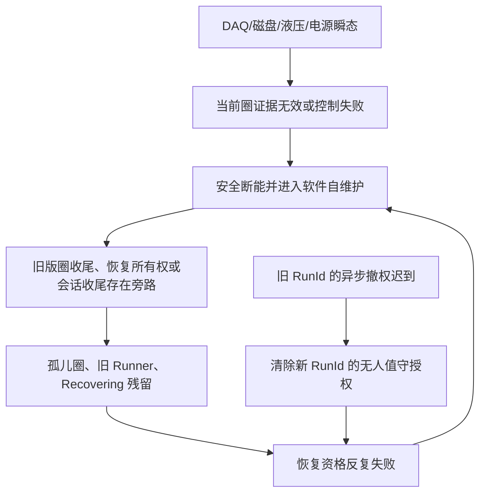

# V2.12.0.12 无人值守授权 RunId 隔离与自维护根治整改

> **已由 V2.12.0.13 取代：** 继续审计发现旧运行的迟到 `SystemFaultRaised` 仍可能登记新运行的同进程恢复/自重启，恢复登记还会把 schema v4 降回 v3。修复见 [V2.12.0.13 全自动恢复 RunId 隔离与完成性审计](./2026-08-09_V2.12.0.13_全自动恢复RunId隔离与完成性审计.md)。本文件保留 V2.12.0.12 的历史实现和验证证据。

## 结论

频繁进入自维护的直接诱因曾包括 DAQ 时间线陈旧、写盘积压、峰值证据窗口不完整、液压/电源瞬态和控制圈异常；真正把这些可恢复瞬态放大成“反复自维护、暂停再开始也失败、最终只能重启软件”的根因，是旧实现没有把恢复状态、圈事务、会话收尾和无人值守运行授权绑定到同一个不可混淆的运行身份。

V2.12.0.3—V2.12.0.11 已依次修复过期采样漏判、未机械释放、孤儿圈、恢复风暴、后台任务、统一耐久收口和会话假闭合。最终反证审计又发现一条跨运行竞态：`NotifyRunAuthorizationRevoking` 异步通知可能晚于旧会话结束；无人值守检查点没有 RunId，因此旧会话的迟到撤权事件可能清除刚刚建立的新会话授权。表现上就是新运行已经满足条件，却又被旧事件取消资格，通道继续停留在自维护或无法重新进入试验。

V2.12.0.12 从根上关闭这条竞态：停止原因在撤权发出前同步捕获 RunId；无人值守检查点升级为 schema v4 并持久化 RunId；撤权只允许作用于相同 RunId。旧格式或身份缺失的检查点继续按安全优先撤权，避免历史异常状态被误恢复。

这不是放宽故障阈值，也不是取消安全停机。软件、DAQ、磁盘或调度瞬态仍会使当前圈作废并进入受控恢复，但不得永久停用卡钳；只有具有完整、连续、可落盘硬件证据的真实卡钳故障才允许锁存停机。

## 为什么旧版本会频繁自维护



| 层级 | 已确认问题 | 对现场的影响 | 根治机制 |
|---|---|---|---|
| 采集 | DAQ 时间残差过去只拦正方向，约 1.16 s 的负向陈旧样本可继续参与控制 | 多通道同时峰值证据失败 | 对正负残差统一硬限制；异常先隔离、重建采集 |
| 机械状态 | 峰值证据失败路径曾在反转释放前返回 | 下一资格圈过早到阈值，被误判曲线时序故障 | 所有软件恢复先完成断能和机械释放 |
| 圈事务 | 学习/资格/正式圈异常曾留下 `running` 圈 | 后续恢复一直报“上一圈尚未封存” | 所有终态统一经过 Raw、耐久前缀和 SQLite 唯一终态门禁 |
| 恢复调度 | 同根故障可重复创建错误、UI、取证与恢复任务 | CPU/I/O 越高，恢复越慢，形成正反馈 | 根事故合并、任务监督、有界队列、退避重试和风暴门禁 |
| 会话收尾 | 最后通道退出曾漏检 `_runnerCache` 并提前记录 `Closed=True` | 旧资源尚未清场便允许下一会话 | 四张 Timer/Runner 表清空后统一进入 `StopAllAsync` 收尾 |
| 授权隔离 | 检查点无 RunId，旧撤权事件可晚到新运行 | 新会话被旧会话取消资格，再次陷入自维护 | 检查点 schema v4 保存 RunId，撤权仅匹配同一 RunId |

## V2.12.0.12 实现

### 1. 撤权事件同步绑定旧运行

`Controller/StopContext.cs` 新增 `RunId`，并写入结构化日志。`Controller/EpbManager.cs` 在安排异步观察者之前，同步捕获当前 `_activeBatchId`。即使观察者随后因调度延迟才执行，它携带的仍是产生该事件的旧运行身份，不会读取到新会话的活动 ID。

### 2. 无人值守检查点绑定当前运行

`MTTfTest/UnattendedRecovery.cs` 将检查点 schema 升级到 4，新增 `RunId`；开始运行时由 `FrmEpbMainMonitor.UnattendedRecovery.cs` 传入实际 `state.RunId`。优雅暂停继续保留已有 RunId，不把会话身份降级为空。

### 3. 只撤销相同 RunId

新增 `ShouldApplyRunAuthorizationRevocation` 和 `DisarmIfRunMatches`：

- 同一 GUID 无论是否带连字符、大小写如何，都视为同一个 RunId；
- 旧 RunId 与新检查点 RunId 不相同时，迟到撤权被忽略；
- 任一侧 RunId 为空时按历史兼容和安全优先执行撤权，禁止把无法证明来源的旧授权自动延续。

### 4. 与会话终态协议共同形成闭环

V2.12.0.12 继承 V2.12.0.11 的唯一终态规则：最后通道退出不直接宣布可重启，必须等待电机 OFF、压力释放、电源 Disable、Raw 发布、持久化边界、活动圈唯一终态以及 Timer/Runner 活动与缓存表全部清场。只有该边界成功且新运行获得独立 RunId 后，才允许无人值守续测。

## 自动验证证据

| 验证 | 结果 | 主要覆盖 |
|---|---:|---|
| 控制、恢复、并发与生命周期回归 | `305/305 PASS` | 新增“迟到旧运行撤销不得清除新运行授权” |
| SQLite/BIN/报警最近 10 圈回归 | `28/28 PASS` | 已封报警圈可回读，最近 10 圈 CSV/BIN 原子导出 |
| 现场封存门禁回归 | `13/13 PASS` | 单 RunId、唯一终态、自维护风暴、Recovering 关联与终态红线 |
| Release 构建 | `0 error` | 存在 69 个既有静态 warning |
| 发布身份核验 | `verified=true` | 版本、75 个身份文件、76 个校验文件一致 |

新增专项用例验证：旧运行 A 的撤权不影响已武装的新运行 B；同一 GUID 的格式差异仍能正确撤权；历史空 RunId 继续执行保守撤权。

## 当前候选身份

| 项目 | 值 |
|---|---|
| ProductVersion | `V2.12.0.12` |
| Git commit | `37e4a7e92f644f5292e5cb4329562e5d6a4c9ab0` |
| BuildUtc | `2026-08-08T20:31:52.5370255Z` |
| EXE SHA-256 | `4d5b3a81229478154c7261a0d279a8fe1e7b35cccd36ca21136dbf2fdfd26e8e` |
| Config SHA-256 | `71fd41aa6f89b5dfc98bc8b97abbd1bb9a0a0e3f5f1ae72da243f5ba82a55457` |
| 当前发布状态 | `DIRTY_CANDIDATE_NOT_FOR_PRODUCTION` |
| deploymentApproved | `false` |

当前二进制用于代码和受控台架验证。由于工作树包含本轮及此前尚未提交的整改，它不能直接作为正式生产包。正式发布必须审查变更、形成干净提交、重新构建，并要求 `gitDirty=false`、`deploymentApproved=true`。

## 现场判定标准

正常运行中偶发进入一次短暂自维护并自动恢复，不等于系统不稳定；但以下任一情况都属于阻断上线：

1. 同一根事故重复并发进入自维护，或任一设备 10 分钟内超过 3 个独立根事故；
2. 恢复后仍残留 `Recovering`、旧恢复所有权、活动/缓存 Runner 或 `running` 圈；
3. 暂停后重新开始必须依赖退出软件才能成功；
4. 软件/DAQ/磁盘瞬态造成通道永久停用；
5. 报警停机缺少报警圈和最近 10 圈 CSV/BIN；
6. 同一 RunId 没有且仅有一个闭合终态，或用多个短 RunId 拼接长跑时长；
7. `OverCapacityDropped`、UI 文件队列丢弃或持久化序号缺口不为零。

现场正式门禁示例：

```powershell
python Tools/validate_epb_field_gate.py "<V2.12.0.12封存目录>" `
  --expected-version V2.12.0.12 `
  --minimum-hours 24 `
  --performance-gates required `
  --artifact-scan full `
  --log-scan full `
  --database-scan full
```

## 最终边界

从软件根因上，频繁自维护及自维护后无法重入的已知闭环已经被逐层切断，V2.12.0.12 又补上了跨 RunId 撤权这一最后竞态。当前结论是“代码整改和自动回归完成”，不是“已经获得无人值守生产放行”。仍需用干净正式包完成 2 小时故障注入、8 小时台架观察和 24/72 小时真实硬件连续运行；只有这些数据通过门禁，才能确认现场环境、NI 驱动、磁盘、电源和液压硬件同样满足长期稳定运行。
