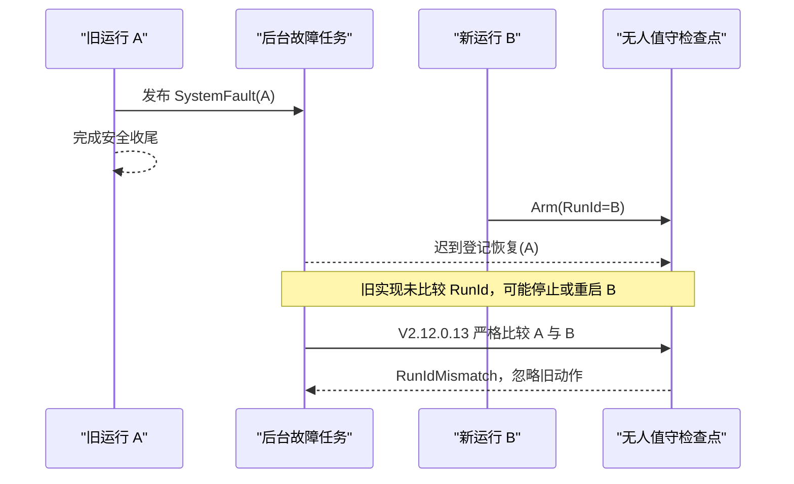

# V2.12.0.13 全自动恢复 RunId 隔离与完成性审计

> **后续版本：** V2.12.0.14 又切断了 UI 历史批次追赶、空唤醒积累和高频曲线裁剪三个卡顿反馈，现场验证统一使用 V2.12.0.14。详见 [V2.12.0.14 UI 积压反馈切断与频繁自维护根治结论](./2026-08-09_V2.12.0.14_UI积压反馈切断与频繁自维护根治结论.md)。

## 结论

V2.12.0.12 已阻止旧运行的迟到撤权清除新运行授权，但继续按“主动证明不存在旁路”的方式审计后，发现无人值守自动恢复仍有三处同源缺口：

1. 启动失败产生的 `SystemFaultRaised` 由后台任务处理；若任务迟到，新运行可能已经武装，而旧故障仍会登记同进程恢复或进程自重启。
2. `TryRegisterInProcessRecovery` 会把已经是 schema v4 的检查点重新写成 schema v3，破坏版本单调性。
3. 正常暂停在检查点丢失后重新创建文件时，没有显式写入当前 RunId，可能重新生成来源不明的授权。

V2.12.0.13 将隔离范围从“撤权事件”扩大为“所有能够停止、重建或续测的主动动作”：同进程恢复、进程自重启、正常暂停恢复和现场验收证据都必须携带合法且完全匹配的 RunId。迟到旧运行事件只记录并忽略，绝不能执行 `StopAll`、重建新运行或覆盖新检查点。

## 根因与风险



这条竞态不要求 CPU 长期满载才会发生。任何线程调度、磁盘停顿或启动异常取证都可能扩大后台任务延迟，因此仅靠“通常执行得很快”不能作为安全证明。

## 代码整改

### 1. 主动动作使用严格 RunId 策略

`Controller/EpbManager.cs` 新增 `AreSameNonEmptyRunIds`：

- 两个值都必须是合法 GUID；
- 统一大小写及带/不带连字符格式；
- 任一值为空、非法或不相同均返回 false。

撤权仍保留失效安全语义：历史空身份允许撤权；主动恢复则相反，无法证明来源时绝不执行。这一区分避免了“为了兼容旧格式而允许一个来源不明的任务启动设备”。

### 2. 同进程恢复和进程重启均校验运行身份

`MTTfTest/UnattendedRecovery.cs` 的 `TryRegisterInProcessRecovery` 和 `TryRegisterRestart` 接收故障产生时的 RunId。检查点 RunId 不匹配时返回 `RunIdMismatch`：

- 不登记恢复；
- 不覆盖当前检查点；
- 不升级为进程重启；
- 不执行安全停机去干扰新运行；
- 只在项目日志中记录“忽略迟到旧运行请求”。

启动阶段软件恢复熔断的 `ControlFault.CorrelationId` 使用该次失败运行的 `failedRunId`，因此可以作为严格的期望 RunId。若自动重建已经产生新 RunId，而旧恢复随后失败，旧任务同样不能用原 RunId 重启新会话；新会话自身的故障事件负责其恢复。

### 3. 检查点 schema 单调保持 v4

检查点当前版本集中为 `CurrentSchemaVersion = 4`。Arm、正常暂停和同进程恢复登记全部使用该常量，不再出现 v4 降回 v3。自动恢复入口拒绝低于 v4 或缺少合法 RunId 的检查点。

### 4. 正常暂停必须收敛到唯一 RunId

保存正常暂停前，UI 从全部 `Paused` 通道状态中提取 RunId：

- 必须恰好得到一个非空 RunId；
- 通道属于多个 RunId、全部为空或状态未收敛时，拒绝生成自动恢复检查点；
- 保存时显式写入该 RunId；
- 加载时要求 schema v4 和合法 RunId。

这会把异常暂停变成明确、可诊断的拒绝，而不是生成一个可能污染下一运行的模糊授权。

### 5. 现场门禁验证真实 GUID 和圈身份

`Tools/validate_epb_field_gate.py` 现在：

- 要求最新 SESSION Start 的 RunId 是合法 GUID；最新启动身份非法时直接失败，不回退旧会话；
- SESSION、STATE、CYCLE 和自维护根关联号统一规范化为 GUID；
- 正式成功圈必须全部属于当前验收 RunId；
- 非法、空、全零或外来身份均作为红线。

## 主报告完成性对照

| 原要求 | 当前代码证据 | 自动证据 | 仍需现场证明 |
|---|---|---|---|
| 峰值滞后语义拆分 | `ClassifyPeakEvidenceDiagnostic` 独立时间戳/真实超限分类 | 25 ms 不报警、101 ms 唯一报警 | 24 h 假报警为 0 |
| 软预警不放大 I/O | 标量 JSONL、有界 1+1、600 s 合并、增量容量 | 千次风暴回归、UI 十万条回归 | 磁盘压力下 Dropped=0 |
| 双 DAQ 独立持久化 | Dev1/Dev2 独立 worker/队列，圈进度 1 Hz | 六通道 2 kHz，最大深度 2/2 | 24/72 h P99/P999 |
| DO 实时隔离 | 每物理设备独立高优先级 worker，重复 OFF 合并 | Dev1/Dev2 隔离及超时回归 | 真实 NI 最大 <100 ms；外部联锁签字 |
| 恢复单所有者/无风暴 | 根事故合并、epoch 登记后递增、任务监督 | 100 次同根故障及所有权回归 | 现场每设备 10 分钟根事故 ≤3 |
| 圈与会话唯一终态 | Raw/耐久边界、SQLite 唯一更新、四张运行表清场 | 活动圈、缓存 Runner、唯一 SESSION 终态回归 | 现场 running=0、Closed=True |
| 跨运行隔离 | STATE revision、token、撤权及主动恢复均按 RunId | 旧撤权与旧恢复两项专项回归 | 反复暂停/重启故障注入 |
| 硬报警最近 10 圈 | 已封终态回读并原子导出 CSV/BIN | 写盘 `28/28` | 每次真实硬报警目录完整 |

## 验证结果

| 验证项 | 结果 |
|---|---:|
| 控制、恢复、并发与生命周期 | `306/306 PASS` |
| SQLite/BIN、报警圈及最近 10 圈 | `28/28 PASS` |
| 现场封存门禁 | `14/14 PASS` |
| 全解决方案 Release 编译 | `0 error`，65 个既有/静态 warning |
| 主程序 Release Rebuild | `0 error`，69 个既有/静态 warning |
| 发布身份文件核验 | 75 个身份文件、76 个校验文件一致 |

## 当前候选身份

| 项目 | 值 |
|---|---|
| ProductVersion | `V2.12.0.13` |
| Git commit | `37e4a7e92f644f5292e5cb4329562e5d6a4c9ab0` |
| BuildUtc | `2026-08-08T20:49:05.0351392Z` |
| EXE SHA-256 | `a101df6702c2bfe042126f6529b8b3f7436252e82b05ce9bddcf371fcc0a1de2` |
| Config SHA-256 | `71fd41aa6f89b5dfc98bc8b97abbd1bb9a0a0e3f5f1ae72da243f5ba82a55457` |
| 状态 | `DIRTY_CANDIDATE_NOT_FOR_PRODUCTION` |
| deploymentApproved | `false` |

候选包已通过自身身份和校验清单核验，但工作树尚未形成干净提交，因此只能用于当前代码现场验证，不能作为生产放行包。

## 现场门禁命令

```powershell
python Tools/validate_epb_field_gate.py "<V2.12.0.13封存目录>" `
  --expected-version V2.12.0.13 `
  --minimum-hours 24 `
  --performance-gates required `
  --artifact-scan full `
  --log-scan full `
  --database-scan full
```

验证器只接受最新一次合法、唯一、闭合的 RunId，不会用旧成功运行替代最新失败运行，也不会把多个短运行拼成 24/72 小时。

## 剩余边界

代码侧已关闭目前找到的跨运行撤权、状态发布、证据令牌和主动恢复旁路；但“试验能长期流畅运行”还需要真实 NI 驱动、液压、电源、磁盘和主机负载共同证明。正式结论仍需：干净提交正式包、2 小时故障注入、8 小时压力测试、24 小时六通道验收和 72 小时无人值守验证。任一安全断电超过 100 ms、QueueFull、SQLite 不一致、静默丢批、自维护风暴或必须退出软件才能恢复，都应立即退出候选。
