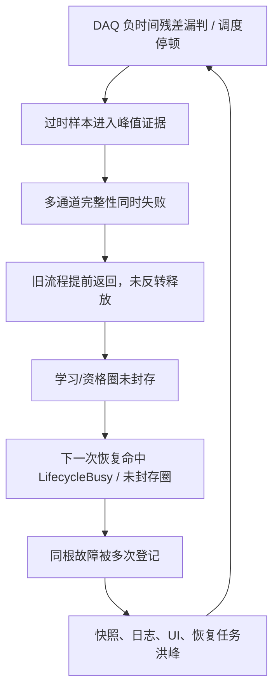

# V2.12.0.14 UI 积压反馈切断与频繁自维护根治结论

> **后续版本：** V2.12.0.15 把窗体层 Dev1/Dev2 最新值槽抽成可压力验证的固定两槽邮箱，并统一收紧遗留窗体内存日志上限。后续台架和现场验证统一使用 V2.12.0.15。详见 [V2.12.0.15 UI 双设备邮箱与上线门槛完成性审计](./2026-08-09_V2.12.0.15_UI双设备邮箱与上线门槛完成性审计.md)。

## 技术结论

频繁进入自维护可以从软件根因上解决，但不能也不应屏蔽真实的卡钳硬件故障。V2.12.0.2 现场不是多只卡钳同时损坏，而是公共 DAQ 时间异常、圈事务未封口、恢复任务重复登记和 UI/IO 积压共同组成的自激放大链。

V2.12.0.3—V2.12.0.13 已将故障语义、机械释放、当前圈耐久封存、单恢复所有者、无人值守 RunId 授权隔离和恢复风暴门禁收口。V2.12.0.14 继续切断最后的性能反馈：显示链只保留每块 DAQ 的最新工程值，不再追赶最多 64 批历史 UI 数据；唤醒信号改为二值合并；曲线旧点至少每 1 秒批量裁剪；两块设备共用的主机探针全局限为约 1 Hz。这些变更只作用于显示和诊断层，2 kHz 控制、峰值判定、Raw 落盘和 SQLite 圈事务不降采样、不丢批。

## 现场证据指向公共软件链，不是五只卡钳同时损坏

| 证据 | 精确含义 | 对恢复策略的影响 |
|---|---|---|
| Dev1/Dev2 采样时间同时落后主机约 1.16 s | 公共采集/调度异常 | 只能恢复 DAQ 链，不能把单通道永久判死 |
| EPB4、5、9、10、11 近乎同时 `PeakCaptureInvalid` | 跨设备/电源的同类证据窗失效 | 应合并为一个根事故，不应并发五个自维护 |
| 失败后遗留 EPB4 `-897`等负圈 | 学习/资格圈未进入唯一终态 | 未封口前不得重入；必须安全释放、Raw 排空、耐久封存 |
| 恢复后曾再次并入试验 | 当时卡钳仍具备运行能力 | 自维护不得成为不可退出终态 |
| EPB8 连续 8 圈有效峰值超过目标 2 A | 独立、连续、数据完整的硬故障证据 | 这类证据才允许停用该通道并强制导出最近 10 圈 |

上述是诊断性结论：时间关联和跨通道分布支持“公共软件/设备链”，不支持“多只机械件同时损坏”。EPB8 则是反例，证明系统仍需保留严格硬故障锁存。

## 频繁自维护的完整根因链

这是一个正反馈环，所以单独调大超时、增大队列或降低报警等级都不是根治。队列更大只会延长追赶时间；隐藏报警不会修复未释放机械和未封口圈事务。

## 根治所需的四个不可退让条件

1. **故障归因不扩散。** 公共 DAQ、磁盘、队列或调度故障只能触发基础设施恢复，不得累加为卡钳硬件次数。
2. **一个根事故只有一个恢复所有者。** 同一 RunId、设备和根关联号的派生症状必须合并；旧运行的迟到任务不能撤销或重启新运行。
3. **恢复前必须完成物理和数据收尾。** 先断能与机械释放，再封闭当前圈窗口、排空 Raw、越过耐久前缀、提交唯一终态；任一条不成立就保持受控重试，不得开始下一圈。
4. **永久停用必须有硬证据。** 只有独立、连续、数据完整的卡钳硬件故障才允许锁存停机；软件/设备瞬态必须可自动重试。

## V2.12.0.14 切断 UI 追赶引起的二次卡顿

### 显示邮箱从历史队列改为最新值槽

`FrmEpbMainMonitor` 的注释原本已定义“每设备只保留最新一批”，但实际代码却为每设备排队 64 批，并允许一次 UI 消费 64 批。在消息泵受阻后，这会把短时停顿放大为长时间追赶。

V2.12.0.14 把 Dev1/Dev2 改为独立最新值槽；新批次仅覆盖旧的待显示批次。UI 消费每设备最多一批，处理期间新数据到达时再补一次合并调度。

### 唤醒信号与最新值语义保持一致

`TwoDeviceAiAcquirer` 虽然已对每设备使用最新 UI 快照，但旧 `SemaphoreSlim(0)` 会为每次发布累加计数。消费者停顿后，数据槽已取空仍可能有大量空唤醒。新增 `CoalescingAsyncSignal` 使用容量 1，重复 `Set` 只保留一个待处理唤醒。专项回归向阻塞期间连续发送 10,000 次信号，待处理计数仍为 1，消费一次后为 0。

### 长跑图形和主机探针降负

- 曲线仍以 10 FPS 重绘，但旧点从每帧达线就整段拷贝，改为至少积累 1 秒越界点再批量裁剪。可见时间窗不变，只额外保留约 1 秒屏幕外数据。
- Dev1/Dev2 各自每秒请求一次运行指标，全局缓存由 500 ms 改为 900 ms，避免相位错开时重复读取 `Process` 和磁盘性能计数器。

## 验证证据

| 验证项 | V2.12.0.14 结果 | 覆盖边界 |
|---|---:|---|
| 控制/恢复/持久化综合回归 | **307/307** | 新增 UI 10,000 次唤醒合并反例 |
| 写盘器 SQLite/BIN 真实回归 | **28/28** | 圈终态、最近 10 圈、并发封存、长故障恢复 |
| 现场封存门禁回归 | **14/14** | RunId、SESSION/STATE/CYCLE、恢复风暴、数据一致性 |
| Release 编译 | **0 error，69 warning** | warning 为既有静态/第三方引用告警 |
| 候选包完整性 | **verified=true** | 75 个 identity 文件，76 个 checksum 文件 |

候选构建身份：

| 字段 | 值 |
|---|---|
| ProductVersion | `V2.12.0.14` |
| Commit | `37e4a7e92f644f5292e5cb4329562e5d6a4c9ab0` |
| BuildUtc | `2026-08-08T21:03:30.0053612Z` |
| EXE SHA-256 | `bb41ce5b08e96928bb0530ead6d61edef9cdd8cf4c9890968a4e7ab36c0ac61c` |
| Config SHA-256 | `71fd41aa6f89b5dfc98bc8b97abbd1bb9a0a0e3f5f1ae72da243f5ba82a55457` |
| 候选状态 | `DIRTY_CANDIDATE_NOT_FOR_PRODUCTION` |
| 部署批准 | `false` |

## 尚未由自动化证明的边界

代码回归能够证明已找到的软件旁路被关闭，但不能代替真实 NI 驱动、液压、电源、磁盘、网络存储和主机调度的长时间联合证据。当前工作树为 dirty，所以生成的二进制只能用于受控验证，不能直接作为生产包。

正式无人值守放行仍需顺序完成：

1. 审核并提交干净源码，重新构建，要求 `gitDirty=false`、`deploymentApproved=true`。
2. 2 小时故障注入：人工造成短时 UI 停顿、磁盘 50–1500 ms 暂停、设备重建和延迟旧故障，证明不发生空唤醒追赶、跨 RunId 停机或恢复风暴。
3. 8 小时六通道 2 kHz 压力测试：无 QueueFull、无静默丢批、UI 可操作、持久化边界连续前进。
4. 24 小时台架候选与 72 小时无人值守验收，封存后执行 `Tools/validate_epb_field_gate.py`。

任意一次安全断电超过 100 ms、QueueFull、SQLite 不一致、无有效 CorrelationId 的 Recovering、同根事故重复入自维护、或必须退出程序才能恢复，都应立即判定候选失败。

## 实施后的正确运行语义

- **软件/基础设施故障：** 当前圈不计数，安全释放并耐久封存，合并恢复、受控退避、自动重入；不永久停用卡钳。
- **可恢复控制偏差：** 执行有界机械释放和资格验证，成功后回到正式试验；失败则继续安全重试。
- **独立硬件故障：** 满足专用连续阈值后锁存该通道，封存报警触发圈和最近 10 圈；其他健康通道继续运行。
- **目标完成：** 统一 StopAll 安全收尾，在物理安全、Raw/耐久边界和圈终态都闭合后，唯一关闭 SESSION。

因此，自维护可以作为短暂的内部恢复态，但不能是频繁颠簸或不可退出的终态。“从根上解决”的可验收定义是：同一根故障只进入一次恢复，恢复后自动回到同一 RunId 的测试，不留活动圈，不要求退出程序，且只有完整硬证据才锁存卡钳。
