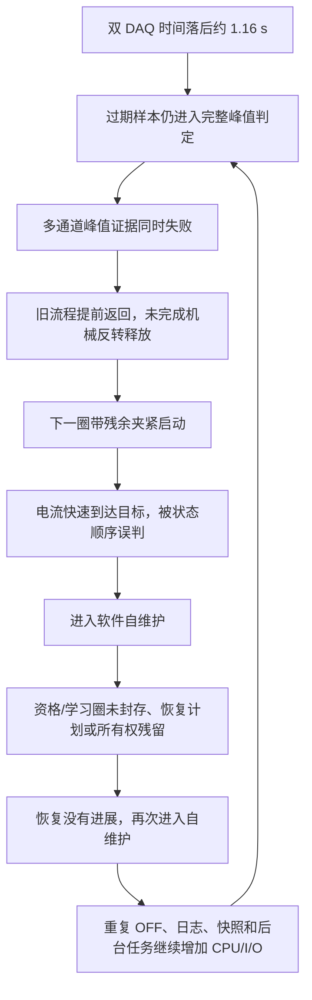

# V2.12.0.8 频繁自维护根因闭环与根治整改

> **后续状态：** 本文保留 V2.12.0.8 的阶段性根治证据。继续对原始第 8.1/8.5 节反证后，
> UI 配置防抖任务、`ui-info.log` 文件队列和公共任务监督 Drain 的最后竞态已在 V2.12.0.9
> 收口；显示队列与文件队列丢弃量均已进入现场门禁，当前门禁正反例为 `7/7`。
> 正式台架/现场验证统一使用 V2.12.0.9。详见
> [V2.12.0.9 原始整改方案逐项完成性审计与后台任务最终收口](./2026-08-09_V2.12.0.9_原始整改方案逐项完成性审计与后台任务最终收口.md)。
> 连续运行和自维护频率的最终机器验收已在
> [V2.12.0.10 连续运行会话与自维护风暴验收闭环](./2026-08-09_V2.12.0.10_连续运行会话与自维护风暴验收闭环.md)
> 完成，正式验证版本以 V2.12.0.10 为准。

## 1. 结论

频繁进入自维护不是卡钳普遍损坏，也不是“自维护功能本身太敏感”。V2.12.0.2 现场的直接故障链是：双 DAQ 时间异常未被正确拦截，完整峰值证据失败后又提前退出机械释放，下一圈在残余夹紧状态下快速达到目标，旧逻辑把它误判为曲线时序硬故障；随后资格/学习圈未封存、恢复计划串用和恢复所有权残留，使自维护无法取得进展，最终只能靠退出进程清场。

V2.12.0.3—V2.12.0.7 已切断采样时间、机械释放、圈事务、持久化、恢复状态和证据 I/O 的主要故障链。继续按原始整改方案逐项反证后，V2.12.0.7 仍留下四个能够在长时无人值守中重新放大自维护的代码缺口：

1. 同一通道的高优先级 OFF 超时后会重复排队，每次还创建未释放的 `ManualResetEventSlim`；NI 写入恢复后，旧命令会继续串行回放。
2. DAQ 日志、故障发布、报警恢复、最新圈清理和退出 Flush 存在未统一纳管的后台任务；退出时可能先释放信号量、CTS、SQLite/MMF，再由迟到任务访问这些资源。
3. 电流在“负载上升状态尚未建立”前达到目标时，旧逻辑可只按状态顺序直接硬报警，没有先等待本圈 2 kHz 完整证据归因。
4. 重启只清除连续故障计数，不会使旧的稳定自适应模型失效；在 DO 积压或异常圈期间学到的污染基线会跨进程复用。

V2.12.0.8 已把这四项补齐。它不是通过调大超时、减少保护或禁止自维护来掩盖问题，而是保证软件瞬态能够安全收口并自动重试，只有完整、连续、独立的卡钳硬件证据才允许停用通道。

## 2. 为什么会形成自维护循环



自维护本应是短暂中间态：断能、释放、封存失败圈、重建资源、资格验证、重入正式试验。现场失控的关键不是“进入了自维护”，而是恢复链没有形成可重复、可提交的事务边界，失败后又制造下一轮失败条件。

## 3. V2.12.0.8 最后一组根治项

| 缺口 | 风险 | V2.12.0.8 处理 |
|---|---|---|
| 同通道 OFF 重复排队 | 阻塞时最多积累 64 条等价 OFF；恢复后继续回放，延长维护窗口 | 按物理设备建立高优先级 worker；同通道请求共用一个完成源；同设备不同通道合并为一次位图写入 |
| 每次 OFF 创建等待句柄 | 15 秒周期长跑中句柄持续增加 | 用 `TaskCompletionSource<bool>` 替代 `ManualResetEventSlim`，不再为每次请求持有内核等待句柄 |
| Dev1/Dev2 普通运行仍受全局任务锁影响 | 一个设备慢写可能拖住另一个设备 | 正常和高优先级通道写使用每设备 `WriteGate`；全局锁只保留初始化、AllOff 和 Dispose |
| DAQ fire-and-forget 任务 | 同根故障可生成任务风暴，异常无人观察，退出竞态 | 引入按操作键合并的 `CoalescingTaskSupervisor`；所有任务先登记后启动，异常必观察，Dispose 前停止接收并排空 |
| DAQ Dispose 先释放资源 | worker/回调可能访问已释放 CTS、信号量 | 独立退出收口线程先等待采集、Raw/UI 发布和控制线程，再排空后台监督器，最后释放资源 |
| Latest 保留清理裸任务 | 退出后可能继续访问 MMF/SQLite | 每通道最多一个命名线程；Dispose 先停止接收并限时 Join，再关闭存储资源 |
| 无人值守恢复任务未纳管 | 窗口关闭或进程重启时恢复任务可能迟到 | 纳入公共 `TaskSupervisor`，携带关联号，窗口关闭前限时排空 |
| 最终 DAQ Flush 与 writer Dispose 并发 | 最后一批数据可能仍在 Flush 时资源已关闭 | FormClosing 直接 `await` Dev1/Dev2 Raw/Stat Flush，完成后才 Dispose |
| 标定重连重复启动 | 读取异常可创建多个重连循环 | 单一、可取消、可等待的重连任务，最多 30 次并在关闭时收口 |
| `ThresholdBeforeLoadRise` 直接硬报警 | 快速夹紧或前圈状态影响被误当成卡钳永久故障 | 立即 OFF，但先记为 `FastRiseCandidate` 软预警；等待完整 2 kHz 峰值、证据质量和断电清零结果后归因 |
| 污染模型跨重启复用 | 重启短暂正常，运行后再次进入相同故障链 | 自适应模型升级为 v5；旧模型自动复制为 `.pre-v5.<UTC>` 审计副本并全部失效；每路重新完成 5 个完整有效学习圈 |

## 4. 正确的无人值守状态边界

软件、DAQ、磁盘、队列或证据质量异常时，系统必须立即停止本圈计数并断能，但不得永久判死卡钳。当前圈只有在 Raw 发布边界、耐久写盘前缀和 SQLite 唯一终态全部闭合后才能作废；随后系统持续以受控退避重建资源、完成机械释放和资格圈，并自动回到正式试验。

只有下列两类条件允许结束通道：

- 卡钳硬件故障：完整有效数据连续满足专用确认策略，例如完整峰值超过永久报警线连续 8 个正式提交圈；硬报警必须同时封存触发圈和最近 10 圈 CSV/BIN/清单。
- 目标次数完成：正常停止并完成全部持久化边界。

“峰值证据滞后、DAQ 陈旧、队列满、磁盘慢、液压数据陈旧、后台任务异常”都属于基础设施或软件恢复条件，不得直接成为永久停用卡钳的证据。

## 5. 升级时必须知道的行为

V2.12.0.8 第一次打开旧项目时会检测 `EpbAdaptiveProfiles.xml` 的旧策略版本：

1. 原文件保留为 `EpbAdaptiveProfiles.xml.pre-v5.<UTC>`，用于审计，不直接删除。
2. 所有通道的旧学习结果失效，避免 EPB8 或其他通道继续复用异常运行期间的基线。
3. 启用通道自动执行至少 5 个完整有效学习圈；学习圈不计入正式寿命次数。
4. 学习失败时仍按安全恢复流程持续重试；不得手工复制旧模型绕过重新学习。

## 6. 自动验证证据

| 验证项 | 结果 |
|---|---:|
| 自适应、恢复、DAQ、DO、液压、电源和并发回归 | `302/302 PASS` |
| 写盘、SQLite、BIN/CSV、报警最近 10 圈和 Latest 保留 | `28/28 PASS` |
| 现场封存门禁正反例 | `6/6 PASS` |
| 六通道 2 kHz 真实 MMF + SQLite、每通道 20000 点 | Producer `10010.9 ms`，Drain `0.0 ms`，Dev1/Dev2 最大深度 `2/2` |
| V2.12.0.8 Release 重建 | `0 error`，72 个仓库既有/静态 warning |
| 发布清单与文件哈希校验 | 通过，identity 75 项，checksum 76 项 |

候选包身份：

| 项目 | 值 |
|---|---|
| ProductVersion | `V2.12.0.8` |
| Git commit | `37e4a7e92f644f5292e5cb4329562e5d6a4c9ab0` |
| Build UTC | `2026-08-08T19:35:23.0602192Z` |
| EXE SHA-256 | `4006160709758183e7cd7e6b37040631721dbe20cb61dda47b56e0cd9c4e015a` |
| Config SHA-256 | `71fd41aa6f89b5dfc98bc8b97abbd1bb9a0a0e3f5f1ae72da243f5ba82a55457` |
| 当前发布状态 | `DIRTY_CANDIDATE_NOT_FOR_PRODUCTION` |

当前工作树包含本轮和此前尚未提交的整体整改，因此该包只能用于代码审查和受控验证，不能直接作为无人值守正式生产包。必须形成干净提交后重新构建，且 `Verify-Release.ps1 -RequireDeploymentApproved` 通过。

## 7. 现场放行步骤

1. 审查全部改动，生成干净提交和 V2.12.0.8 正式候选；绑定 EXE、配置、Git SHA、`build-identity.json` 和 `SHA256SUMS.txt`。
2. 先做 2 小时故障注入：DAQ 正/负时间跳变、回调停顿、NI 写阻塞、磁盘 50—1500 ms 停顿、暂停/恢复、退出重启。每次必须完成 OFF、机械释放、圈终态、资源重建和自动重入。
3. 做 8 小时台架运行，确认句柄数、线程数和内存不持续增长；重复 OFF 的待处理项不随报警次数增长；不存在未观察任务异常。
4. 做 24 小时正式观察，再做连续 72 小时无人值守验收；两次封存都执行全量门禁。
5. 红线：不得出现 `running` 孤儿圈、`LifecycleBusy` 持续阻塞、恢复所有权残留、同一故障任务风暴、队列容量丢批、停止边界未闭合或硬报警最近 10 圈缺失。

```powershell
python Tools/validate_epb_field_gate.py "<24小时封存目录>" `
  --expected-version V2.12.0.8 `
  --minimum-hours 24 `
  --performance-gates required `
  --artifact-scan full `
  --log-scan full `
  --database-scan full
```

72 小时最终验收将 `--minimum-hours` 改为 `72`。只有干净发布身份、2/8/24/72 小时证据和真实液压/外部硬联锁人工签字全部通过，才能批准无人值守上线。

## 8. 最终判断

能从根上解决。代码层已经把“公共瞬态 → 未释放 → 误判硬故障 → 圈事务卡死 → 任务/输出请求风暴 → 无法重启”的闭环拆开，并补上旧模型污染跨重启复发的问题。当前剩余风险不是已知代码缺口，而是尚未完成干净正式发布和真实硬件长跑验证；在这两项完成前，不能把自动回归等同于现场最终放行。

完整现场历程与早期证据见：

- [10358-029 V2.12.0.2 全历程自维护失控根因与彻底整改](./2026-08-09_10358-029_V2.12.0.2全历程自维护失控根因与V2.12.0.3彻底整改.md)
- [10358-029 V2.12.0.0 全历程卡顿、多故障根因与彻底整改方案](./2026-08-08_10358-029_V2.12.0.0_全历程卡顿与多故障根因及彻底整改方案.md)
