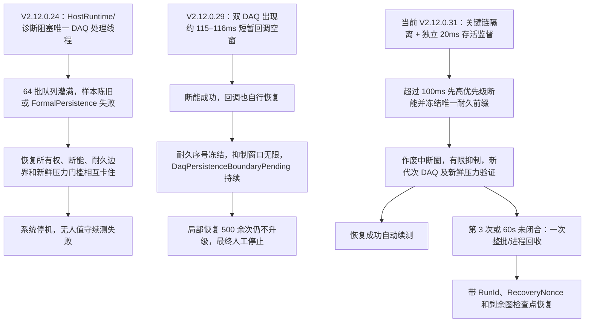

# 10358-029 V2.12.0.24 / V2.12.0.29 无人值守失效复盘及 V2.12.0.31 整改验收

> 数据日期：2026-08-09—2026-08-11  
> 整改版本：V2.12.0.31  
> 当前结论：代码、无硬件自动化验证和本地 x86 Release 构建已完成；真实 2/8/24/72 小时及每通道 100000 圈待现场执行  
> 生产状态：**不得签字为无人值守生产版本**

> **2026-08-11 后续状态更新：**V2.12.0.31 已在现场约 38 分钟运行中暴露冻结前缀、圈终态和 StopAll 交接缺陷，本文件中原“V2.12.0.31 已落地整改”只能视为当时的代码状态，不代表现场通过。后续代码整改已提升为 V2.12.0.32，详见 `2026-08-11_V2.12.0.32_无人值守根因整改实现与第二轮代码审查.md`。

## 1. 目标和统计口径

目标是人工只执行一次正式启动，此后每个启用通道分别完成 100000 个有效正式圈。软件自行执行的同进程恢复、DAQ 重建或带授权检查点的进程重启属于无人值守；人工点击停止、重新开始、确认报警或重启软件均不属于无人值守。

本报告严格按 `ProductVersion + PID + RunId` 划分运行段：

- 人工停止、人工重新开始和人工重启不计作“软件自动失效时长”；
- 人工停止前若已经出现 DAQ 停更、圈不再完成或恢复死循环，归为“软件异常后人工收尾”；
- 学习圈、资格复核圈和被中断/作废圈不计入正式圈；
- 自动进程重启只有在原 RunId、RecoveryNonce、候选包身份和剩余圈检查点均可关联时，才可计入同一无人值守授权链。

## 2. 数据源与身份

| 封存目录 | 运行身份 | 用途 |
|---|---|---|
| `D:\EPB_Data\10358-029_V2.12.0.24_0809_2343` | V2.12.0.24 | 第一段长时间运行及首次全停 |
| `D:\EPB_Data\10358-029_V2.12.0.24_0810_0707` | V2.12.0.24 | 第二段长时间运行及凌晨全停 |
| `D:\EPB_Data\10358-029_V2.12.0.29_0810_0708` | V2.12.0.29 | 双 DAQ 短空窗后的恢复死循环 |
| `D:\EPB_Data\10358-029_V12.0.24_0810_2243` | V2.12.0.24 | 多次人工停止/重开及最终 Dev1 回调停更 |

最后一个目录名缺少 `2.`，但启动日志和 SESSION 身份均表明实际产品版本为 `V2.12.0.24`。四个目录属于累计封存，不能用文件时间跨度直接推断一次连续运行时长。

## 3. V2.12.0.24 运行分段

| RunId（前缀） | 起止和持续时间 | 终止分类 | 结论 |
|---|---:|---|---|
| `77a7eef` | 08-09 16:52:41—23:37:26，约 6:44:45 | 软件自动停机 | EPB5 圈 23927 出现 `DaqSampleStale/FormalPersistence`；第 3 次恢复转系统停机，但新鲜压力证据缺失，未能无人值守续测 |
| `fb531d` | 08-09 23:53:16—08-10 03:52:42，约 3:59:26 | 软件自动停机 | EPB4 圈 25219 DAQ 陈旧；DAQ 曾记录恢复完成，但圈尾持久化/Timer 状态未闭合，第 3 次后停止且未重启 |
| `8e5088` | 07:10:51—07:48:43，约 0:37:52 | 软件异常后人工收尾 | 07:48:16 已出现 Dev1 `DaqSampleStale`，随后人工停止；不计作自动停机时长，也不能当作健康人工段 |
| `fb9149` | 07:50:41—10:04:40，约 2:13:59 | 人工结束 | 未发现自主终态，排除出无人值守失效时长 |
| `0d5eef` | 10:07:21—11:08:56，约 1:01:35 | 软件自动停机 | 圈 25784 `FormalPersistence` 后进入系统故障 |
| `4fbada` | 11:10:50—15:19:41，约 4:08:51 | 人工结束 | 排除出无人值守失效时长 |
| `bcffc1` | 15:22:20—19:51:21，约 4:29:01 | 软件自动停机 | 圈 27786 `FormalPersistence` 后进入系统故障 |
| `5671c5` | 20:04:07 起；约 22:28:40 出现停更 | 软件异常后人工收尾 | Dev1 回调停止，循环 579 不再完成；22:32 人工请求暂停、22:33 安全停止 |

最后一段的关键证据：

- 22:28:39 前 Dev1 `Produced≈879485` 且健康；随后冻结在约 880118；
- `CallbackAgeMs` 持续增长，停止时约 266293ms，压力样本年龄约 271s；
- Dev1 各通道圈 579 已开始但没有完成，停止时圈耗时约 267210ms；
- `DAQ后台有界队列已满` 直到人工停止阶段才出现，是回调停更后的次生现象；
- 管理器每 2 秒仍记录新鲜度，却只检查 Timer 状态和 30 秒以上圈心跳，没有根据 `CallbackAgeMs` 创建 DAQ 故障。因此该段是明确的软件漏检。

V2.12.0.24 最长可证明的自主运行约 6 小时 44 分，但多个区间由人工停止/重开分隔，不能拼成更长连续运行结论。

## 4. V2.12.0.29 运行分段

- 00:12 左右首次进程因包身份校验失败退出，随后人工重启；该段不计入正式无人值守时长。
- PID 13476、RunId `87dd504...` 于 00:22:45 进入正式运行。
- 00:54:32 Dev1/Dev2 同时出现 DAQ 陈旧，正式运行约 31 分 47 秒。

事故时序证明两块 DAQ 分别出现约 116.459ms、115.371ms 的一次回调间隔。系统 CPU 约 10%、进程 CPU 约 8%、磁盘队列为 0，没有主机资源饱和证据；ETW GC 因权限不足不可用，因此不能进一步证明或排除一次 CLR/系统调度停顿。回调很快恢复，事故快照中的队列为空，电机 OFF、程控电源关闭和断电电流确认均成功。

真正使系统彻底失去运行能力的是恢复闭环：

1. `SuppressAfter` 将截止后的排除窗口设置到 `long.MaxValue`；
2. `Produced/Published` 继续增长，`Persisted` 停在 Dev1 203055、Dev2 203045；
3. 恢复持续得到 `DaqPersistenceBoundaryPending`，未进入恢复提交，因而 `ResumeAdmission` 永远没有执行；
4. 截止后的批次被持续 Suppressed，至人工停止前每块设备超过 220 万批；
5. `IsolatedInfrastructureRecovery` 累计到 546/547 次仍被策略强制保持局部，07:01 由人工停止；停止结果中 `SoftwareRecovery=12` 且耐久边界无法确认。

源码中的直接原因是旧 `ShouldPublishUnattendedBatchRecycle` 同时要求“达到第 3 次”和“不是局部阶段”。`DaqSelfMaintenance`、`IsolatedInfrastructureRecovery` 又被永久定义为局部阶段，导致普通 `DaqCallbackStale` 即使第 300 次也不能打开整批回收熔断。旧自动测试明确固化了这个错误行为。

## 5. V2.12.0.31 已落地整改

### 5.1 独立 DAQ 存活监督

- 新增管理器级 20ms 宿主定时监督，不依赖 DAQ 回调、单圈自适应等待或 Timer 心跳；
- 仅在对应设备存在带电通道时检查，`CallbackAgeMs > 100ms` 或从未形成有效回调即触发 `DaqCallbackStale`；
- 同一设备/代次只锁存一次，已有恢复上下文时不重复发布；
- 同一扫描发现双设备异常时，先为所有设备提交高优先级 OFF 和电源关闭，再发布恢复；
- 输出 `FieldMetric DAQ_LIVENESS`，包含设备集合、RunId、RunEpoch、阈值和批次关联号。

### 5.2 耐久截止边界

- 恢复继续使用首次冻结的 `LastAcceptedSequence`，重试不得扩大边界；
- 后台排空新增结构化结果，分别报告 Dev1/Dev2 的 Boundary、Published、RawTransferred 及准确的未通过谓词；
- 持久化快照增加队头序号和在途序号；`Persisted >= cutoff` 且不存在 `<= cutoff` 的队头/在途批次即可证明耐久前缀；
- 截止后的批次仍作为 `Suppressed/TerminallyHandled` 明确排除，不伪装为物理写入；恢复提交时把无限窗口收紧为有限迟到窗口，首个严格更新批次恢复真实写入；
- 新增 `FieldMetric DAQ_RECOVERY`，记录 Cutoff、Accepted、Published、RawTransferred、Persisted、TerminallyHandled、抑制窗口、尝试数、阶段和 60 秒期限。

### 5.3 有界恢复和安全语义

- 普通 DAQ/基础设施故障前两次优先局部恢复，第 3 次仍失败即发布一次 `UnattendedBatchRecycle`；
- DAQ 恢复超过 60 秒未提交时直接打开同一整批回收熔断，不再执行可反复重建的局部组循环；
- 整批回收仍使用既有 RunId、RunEpoch、RecoveryNonce、程序/配置哈希和 10 分钟最多 3 次自重启预算；
- 自动故障恢复没有使用 V2.12.0.30 的人工停止旁路；只有操作员明确停止且电机 DO、程控电源均确认关闭，才可丢弃上一批次历史检查；
- DAQ/持久化/Timer 故障保持软件故障分类。只有卡钳通道硬件策略或两份独立 DAQ 硬件缺失证据可以形成永久报警。

## 6. 相对 V2.12.0.24 和 V2.12.0.29，当前版本在避免停机上改善了什么

### 6.1 先明确“避免停机”的含义

当前版本不是用放宽 100ms DAQ 安全门槛来换取“表面不停”。在带电运行中一旦回调超过 100ms 未更新，软件仍会先执行安全断能。本次改善的真正目标是：

1. 降低诊断、日志和慢任务拖住 DAQ 关键链的概率；
2. 短暂异常出现后，在毫秒级发现并先断能，不再假运行数分钟；
3. 将已完成数据闭合、作废受影响当前圈，然后自动重建并续测；
4. 同进程无法恢复时，在有界次数/时间内转为受控进程回收，不再无限局部循环；
5. 只有确认的硬件故障、无法证明已断能、无法闭合数据或重启安全预算耗尽时，才保持终态安全停机。

因此，验收中允许“故障后自动断能→恢复→续测”，不允许“故障后一直暂停、一直报警或必须人工重开”。

### 6.2 三个版本的失效链对比

### 6.3 相对 V2.12.0.24 的具体改善

V2.12.0.24 的优点是已开始严格保护“已接纳数据必须耐久化”，但它保住了数据完整性，没有同时闭合“异常后如何继续向前运行”。当前版本的改善是 V2.12.0.26—V2.12.0.31 的累积结果，不应全部宣称为 V2.12.0.31 单个版本新增。

| 对比环节 | V2.12.0.24 的行为/缺口 | 当前 V2.12.0.31 的行为 | 对避免停机的实际作用 | 主要承载位置 |
|---|---|---|---|---|
| DAQ 关键线程 | `HostRuntimeProbe.CaptureWindows` 等慢探针在每台 DAQ 唯一处理线程内同步执行；已观测 546.5ms 陈旧、1.507s 和 2.560s 日志空窗 | 主机探针、日志和诊断证据移出实时处理链；两台 DAQ 各自使用预分配处理环 | 首先降低“软件自己把 DAQ 拖停”的概率，一台设备的诊断/慢链不应反压另一台 | `IO.NI/TwoDeviceAiAcquirer.cs`、`Config/ProjectLogStore.cs` |
| 瞬时积压能力 | 后台处理队列 64 批，约 0.64s 即可灌满，首次事故直接出现 `BackgroundQueueFull` | 每设备处理环默认 1024 批，并另有队龄/处理水位监督 | 可吸收短暂调度抖动；但文档不把“加大队列”当成根治，根治点仍是慢任务隔离和独立看门狗 | `MTTfTest/App.config`、`IO.NI/TwoDeviceAiAcquirer.cs` |
| 回调完全停更检测 | 最后一段 Dev1 已停更约 266s，管理器仍只记录新鲜度；Timer 显示运行也没有形成 DAQ 故障 | 管理器每 20ms 独立检查，带电设备 `CallbackAgeMs > 100ms` 立即触发，不依赖回调、圈等待器或 Timer | 消除“界面还在 Running，实际数分钟没有新圈”的漏检窗口 | `Controller/EpbManager.DaqLiveness.cs`、`Controller/EpbManager.cs` |
| 双 DAQ 同时异常 | 没有管理器级同一扫描批次语义 | 同一扫描先对全部异常设备发出高优先级 OFF/电源关闭，再发布恢复；按设备代次去重 | 避免第一台设备的诊断或恢复占用延误第二台断能 | `Controller/EpbManager.DaqLiveness.cs` |
| 恢复所有权顺序 | 当前圈、液压组成员关系和耐久边界尚未先冻结，即去等共享恢复所有权；容易与已占用的液压恢复者相互等待 | 先暂停组准入、冻结 RunEpoch/截止序号、作废未完成圈、断能、撤销液压成员资格，然后取得唯一恢复所有权 | 打破“为了恢复而等待旧圈，旧圈又等待 DAQ 恢复”的闭环 | `Controller/EpbManager.cs`、`Controller/HydraulicGroupCoordinator.cs` |
| 旧 Run 延迟任务 | 停止后重开的代次隔离不完整，历史恢复/圈任务可能干扰后续运行 | 用 RunId、RunEpoch、恢复代次和引用一致性判定任务所有权；旧 Run 不得删除新 Run 恢复上下文或控制新 Timer/Runner | 防止“刚重开又被上一次的延迟清理停掉” | `Controller/EpbManager.DaqRecoveryState.cs`、`Controller/EpbManager.PauseResume.cs` |
| 压力陈旧后恢复 | DAQ 停止后没有新鲜压力，而恢复/重启又先要求新鲜压力，形成不可自解门禁 | 先确认电机 DO 和程控电源均 OFF，在不允许重新上电的条件下重建输入采集，取得新鲜压力和机械释放证据后才恢复输出 | 保持安全门槛不降低，同时让“断能状态下修复采集”成为可达路径 | `Controller/EpbManager.BatchStart.cs`、`Controller/EpbManager.PauseResume.cs` |
| 故障域 | DAQ、持久化等软件/外设问题可以最终以报警停机的形式暴露，现场感受类似“卡钳永久故障” | DAQ、Timer、持久化继续按软件/基础设施故障恢复；DAQ 硬件缺失须有两份独立证据，卡钳硬件锁存仍由独立通道策略决定 | 软件故障不再冒充不可恢复卡钳报警；真实硬件故障仍不会被自动清除 | `Controller/EpbManager.RecoveryCoordination.cs`、通道报警策略 |

### 6.4 相对 V2.12.0.29 的具体改善

V2.12.0.29 已包含大量 V2.12.0.26—V2.12.0.28 的关键链隔离和安全断能改善。这也是为什么 00:54:32 事故中，它在双 DAQ 短空窗后能完成电机和程控电源断能。它的主要退化点不是“没有断能”，而是“断能后恢复事务永远无法提交”。

| 对比环节 | V2.12.0.29 的实际行为 | 当前 V2.12.0.31 的行为 | 对避免停机的实际作用 | 主要承载位置 |
|---|---|---|---|---|
| 短暂 115–116ms 抖动 | 能检测并断能，回调后来也自行恢复；但异常检测仍受圈和当时执行链影响 | 增加完全独立的 20ms 管理器看门狗，并保持 100ms 门槛 | 不放宽安全标准；无论是短空窗还是完全停更，都有统一入口进入恢复 | `Controller/EpbManager.DaqLiveness.cs` |
| 耐久截止定义 | `Produced/Published` 在恢复期继续增长，`Persisted` 停在首次故障附近；恢复将不同水位混成单一布尔结果 | 只以首次故障冻结的 `LastAcceptedSequence` 作为必须耐久化的唯一前缀，重试不得扩大 | 恢复的完成线从“不断后退的目标”改为“首次故障时的固定目标” | `Controller/EpbManager.cs`、`Controller/DaqPersistenceCoordinator.cs` |
| 已写入前缀的通过条件 | 即使 `Persisted` 已到冻结边界，仍可被后续发布/抑制水位拖成 `DaqPersistenceBoundaryPending` | `Persisted >= cutoff`，且不存在 `<= cutoff` 的队头、在途序号或未解决写故障时，前缀立即通过 | 消除“数据实际已写入，却因截止后流量永远不能提交”的虚假阻塞 | `Controller/DaqPersistenceCoordinator.cs::WaitForDurablePrefixAsync` |
| 截止后批次 | `SuppressAfter=long.MaxValue` 实际形成无限抑制；两台设备各累计 220 万以上抑制批次 | 截止后数据以 `Suppressed/TerminallyHandled` 有限区间闭合；新代次验证完成时原子收紧窗口，严格更新批次重新真实写入 | 不再把故障后本就应作废的尾部当成耐久前缀，也不再让抑制状态永久化 | `Controller/DaqPersistenceCoordinator.cs`、`Controller/EpbManager.cs` |
| 排空结果 | 只能看到“未通过”，无法立即区分是 Published、RawTransferred、Persisted、队头还是在途序号未闭合 | `DaqBackgroundDrainResult` 分别报告 Boundary、Published、RawTransferred 和 `PendingPredicate`；持久化快照增加队头/在途序号 | 这一项主要是可诊断性改善，不单独等于防停机；它使恢复能依精确谓词决策，也能证明现场究竟卡在哪一层 | `IO.NI/TwoDeviceAiAcquirer.cs`、`Controller/EpbManager.FieldMetrics.cs` |
| 局部恢复上限 | `DaqSelfMaintenance` / `IsolatedInfrastructureRecovery` 被永久视为局部阶段；即使第 300 次也不打开整批回收 | 第 1–2 次优先同进程修复；同一故障到第 3 次必须发布一次 `UnattendedBatchRecycle`；DAQ 恢复事务另有 60s 硬期限 | 将 546/547 次无限恢复风暴收口为有界恢复；局部修复失败不再等于永久暂停 | `Controller/EpbManager.RecoveryCoordination.cs`、`Controller/EpbManager.DaqRecoveryState.cs` |
| 全进程连续性 | 局部恢复永不升级，因而没有机会进入已存在的受控重启链 | 同进程无法恢复时进入 StopAll、检查点和进程重启；使用 RunId、RecoveryNonce、程序/配置哈希、剩余正式圈数关联 | 进程自身状态已污染时，不再强迫原进程无限自愈；新进程仍必须通过完整安全预检 | `MTTfTest/UnattendedRecovery.cs`、`MTTfTest/Main_Frm.UnattendedRecovery.cs` |
| 重启风暴 | V2.12.0.29 未走到整批重启，但如无预算控制，修复很容易从“无限局部恢复”变成“无限重启” | 保留 10 分钟最多 3 次自重启预算；耗尽后保持全断能并判本次验收失败 | 避免无人现场反复上电/重启；这是故意保留的安全终态，不是功能缺失 | `MTTfTest/UnattendedRecovery.cs` |
| 候选包身份 | 启动时出现过包校验失败并由人工重启；该段不是正式运行时长，但会阻断无人启动链 | Assembly/File/ProductVersion 统一为 `2.12.0.31`，程序和配置哈希进入检查点/发布门禁 | 避免用错包或在重启后换包继续统计；不把身份门禁通过冒充为运行稳定性通过 | 程序集信息、构建/发布校验脚本、`MTTfTest/UnattendedRecovery.cs` |

### 6.5 哪些是直接防停机，哪些只是让问题可以被证明

| 类别 | 改善 | 对停机的关系 |
|---|---|---|
| 降低故障发生 | 将 HostRuntime/日志/证据移出 DAQ 关键链；两设备处理链隔离；预分配环和更大瞬时缓冲 | 直接降低 V2.12.0.24 类同步阻塞和队列灌满复发概率 |
| 避免异常变永久停机 | 20ms 独立存活监督、固定耐久前缀、有限抑制窗口、第 3 次/60s 整批回收、安全进程交接 | 直接针对 V2.12.0.24 的无法续测和 V2.12.0.29 的恢复死循环 |
| 防止恢复又破坏新运行 | RunId/RunEpoch/恢复代次隔离，中断圈作废，正式圈精确提交 | 直接防止重开后被旧任务二次停掉或将故障圈误计为成功 |
| 可诊断性 | `DaqBackgroundDrainResult`、队头/在途序号、`FieldMetric DAQ_LIVENESS/DAQ_RECOVERY` | 本身不能保证不停机；作用是让恢复决策不再依赖模糊布尔值，并为现场验收提供可审计证据 |
| 操作解锁 | V2.12.0.30 `PrepareForFreshRestartAsync(..., discardHistoricalStopChecks)` | 只解决“人工明确停止后可以开新批次”，自动故障恢复不允许借此绕过历史安全检查；它不计入十万圈无人值守能力 |

### 6.6 当前版本仍会停机的情况

当前版本并不承诺任何故障都无限自动清除。下列情况必须保持全断能，并将本次十万圈验收判为失败：

- 卡钳本体经独立证据确认为永久硬件故障；
- 电机 DO 或程控电源无法确认关闭；
- 已接纳耐久前缀存在无法修复的写入失败/数据空洞；
- DAQ 硬件经两份独立探测确认不可用；
- 10 分钟内 3 次自重启安全预算已耗尽；
- 新进程无法校验 RunId、RecoveryNonce、程序/配置哈希或剩余圈检查点。

这些终态是安全边界，不应为了“看起来不停机”而取消。当前可以严谨宣称的是：**已针对 V2.12.0.24 的关键链阻塞/漏检/恢复顺序问题，以及 V2.12.0.29 的耐久边界卡死/无限局部恢复问题，建立了完整的代码闭环**。尚不能宣称的是：**现场已经证明它能无人完成十万圈**。

### 6.7 现场应如何证明上述改善确实有效

1. 注入单设备 120ms 回调停顿：应出现 `FieldMetric DAQ_LIVENESS Result=Trip`，高优先级断能，受影响圈作废，恢复新鲜样本后自动续测；
2. 注入单设备永久停更：局部恢复要么成功，要么在第 3 次/60s 门槛进入唯一 `UnattendedBatchRecycle`，不得出现数百次局部循环；
3. 复现“`Persisted == frozen cutoff`，但 Published 仍增长”：已写前缀必须立即闭合，截止后批次只允许进入有限终态区间；
4. 复现双 DAQ 同时停顿：必须先同批断能，以同一批次关联号协调恢复，设备级结果分别留证且不得互相竞争；
5. 自动进程重启后：必须找到原 RunId、RecoveryNonce、相同程序/配置哈希和剩余正式圈，并在新鲜压力、机械释放和启动预检完成前不允许上电；
6. 最终按同一候选包依次通过 2h、8h、24h、72h 和每通道 100000 正式圈，且首次启动后人工干预始终为 0。

## 7. 完成性矩阵

| 项目 | 当前状态 | 证据/后续动作 |
|---|---|---|
| V2.12.0.30 正常退出、停止后重开 | 已完成代码与自动测试 | 作为 V31 前置修改保留；现场操作回归待执行 |
| DAQ 独立漏检监督 | 已完成代码与自动测试 | 120ms、未带电、已有恢复去重反例通过 |
| 第 3 次/60 秒有界整批回收 | 已完成代码与自动测试 | 旧“第 300 次仍局部”反例已删除并改为第 3 次回收 |
| 冻结边界结构化诊断 | 已完成代码与自动测试 | 可精确区分 Published/RawTransferred/持久化队头/在途未闭合 |
| C# 综合测试 | 已完成 | `376/376 PASS` |
| x86 Release 构建与版本身份 | 已完成 | 0 error；Assembly/File/ProductVersion 均为 `2.12.0.31`；本地 EXE SHA-256=`8c4ae1554ca084604c67fbdf51df630612a6905a6606a50eb59cd109ed2a3be1`；当前脏工作树产物仅供研发验证 |
| Python 发布/现场门禁测试 | 已完成 | `45/45 PASS`，包含正式门禁不可放宽及恢复风暴反例 |
| SQLite/BIN/Raw 写盘测试 | 已完成 | `32/32 PASS` |
| 程控电源调试器测试 | 已完成 | `17/17 PASS` |
| 2小时现场恢复冒烟 | 待现场验证 | 一次启动，人工干预 0 |
| 8小时资源与故障压力 | 待现场验证 | 一次启动，人工干预 0 |
| 24小时六通道联合运行 | 待现场验证 | 同一候选身份和授权运行链 |
| 72小时无人值守 | 待现场验证 | 无永久卡死、无无法恢复的软件报警 |
| 每启用通道 100000 正式圈 | 待现场验证 | 每通道独立达标，学习/资格/作废圈不计数 |

## 8. 现场验收顺序与硬门槛

使用同一个 V2.12.0.31 候选依次执行 2h、8h、24h、72h，全部通过后执行每启用通道 100000 圈。任一阶段出现以下情况即失败并封存：

- 人工停止、人工重新开始、人工确认报警或人工重启；
- DAQ 回调超过 100ms 后没有立即进入安全断能/恢复；
- 任一恢复超过 60 秒仍处于局部循环，或 10 分钟自重启预算耗尽；
- 运行状态显示 Running 但圈数和 DAQ 水位长期不前进；
- 数据序号存在未解释空洞、圈终态未闭合、作废圈被计为成功；
- 自动重启前后缺少原 RunId、RecoveryNonce、剩余圈数和相同程序/配置哈希关联；
- 软件/外部基础设施故障被误锁存为卡钳永久报警。

最终只有完整现场证据、正式候选身份门禁和每通道 100000 圈同时通过，才能把本文顶部状态改为“生产无人值守验收通过”。
