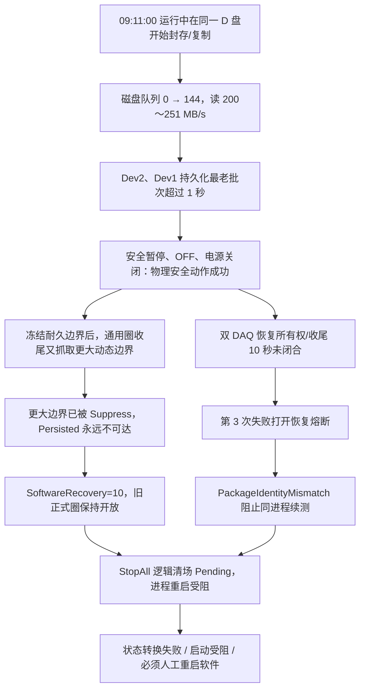

# 10358-029 V2.12.0.32 完整运行历程与归档触发双 DAQ 持久化恢复失败分析

> 分析日期：2026-08-12  
> 现场描述：`docs/01_Inboxes/2026-08-12_01_V2.12.0.32_最新运行情况.md`  
> 数据封存：`D:\EPB_Data\10358-029_V2.12.0.24_0812_0917`  
> 补充封存：`D:\EPB_Data\10358-029_V2.12.0.32_0812_1030`（覆盖至 10:31，包含 09:50、10:00、10:23 三次后续事件）  
> 实际运行版本：**V2.12.0.32**（目录名中的 `V2.12.0.24` 与运行证据不一致）  
> 主要运行区间：2026-08-11 19:31:00 至 2026-08-12 09:13:30；补充验证区间至 10:31:19  
> 结论等级：**可用于问题定位和整改；由于封存是运行中活拷贝且发布包身份校验失败，不可作为最终验收数据。**

## 1. 结论先行

本次并不是单一故障，而是三段彼此独立、最终叠加的事件：

1. **EPB08 是真实的单卡钳电流报警。** 06:12:48 至 06:14:33 连续 8 圈超过永久报警判据，06:14:40 锁存报警并退出后续运行。界面显示的最终峰值为 17.286 A，目标 15.000 A，超出 2.286 A。此故障只属于 EPB08，与 09:11 的整批系统故障不是同一个根因。
2. **EPB04/05 的长时间“等待暂停”源于一次 Dev1 DAQ 回调空窗后的恢复缺失。** 08:25:52 Dev1 的回调间隔达到 1163.190 ms，100 ms 安全门正确断能并暂停 EPB04/05；回调在约 1 秒后自行恢复，但卡钳定时器没有恢复运行，直到 09:03 操作员干预，停留约 37 分钟。
3. **09:11 的全局停机由运行中同盘归档触发，恢复逻辑缺陷把一次短时 I/O 拥塞扩大为不可自恢复停机。** 封存目录的创建时间是 09:11:00；同一秒 D 盘读吞吐升至 64 MB/s，随后约 200～251 MB/s，磁盘队列从 0 升到 144。Dev2、Dev1 的持久化队列先后超过 1 秒门槛并暂停。DAQ 回调年龄仍低于 1 ms、处理队列基本为空，说明采样链没有停止，故障点是**落盘链路**。

09:11 后未能自动恢复，不是因为电机、压力或程控电源无法安全关闭，而是恢复状态机同时暴露了以下缺陷：

- 双 DAQ 几乎同时恢复时，恢复所有权/收尾未在 10 秒内闭合；冻结前缀实际已于约 09:11:06 落盘，但仍被判为 `DaqPersistenceBoundaryPending`。
- DAQ 恢复把正式耐久前缀冻结在 Dev1=`4918893`、Dev2=`4918579`，通用圈收尾却又分别等待 Dev1=`4919133`、Dev2=`4918894`；冻结点之后的批次已经被抑制，不可能再使 `Persisted` 达到后一个边界。
- StopAll 后仍有 `SoftwareRecovery=10`，导致逻辑清场长期为 `Pending`，干净重启被拒绝。
- 发布包身份为 `PackageIdentityMismatch`，系统拒绝同进程续测，升级到进程自重启；进程自重启又被 `SafetyStopUnconfirmed` 连续阻挡并耗尽预算。
- 系统故障触发的 StopAll 被统一发布成 `ManualStopped`，因此界面错误显示“人工停止”；学习阶段的 `WarningRunning` 又映射成 “RUN/软预警”，造成“EPB04 已运行、其他卡钳仍学习”的错觉。

**对 09:11 这条故障链，最终恢复方式只有关闭并重启软件。** 新进程于 09:13:55 启动，09:14:05 开始新批次，09:16:01 完成学习，09:16:15 后 5 个剩余卡钳重新产生正式圈。说明卡钳、DAQ 和电源硬件并没有形成永久故障；重启能够清除旧进程中的恢复所有者和状态残留。

补充封存又记录了两类后续故障：10:00 Dev1 DAQ 恢复再次陷入不可达持久化边界，软件于 10:15 再次重启；10:23 电源 3、4 组同时发生 `TelemetryStale`，这次不需要退出软件，10:27 执行 Stop→Start 后同一 PID 恢复。后者的根因与解决方案详见第 10 节。

## 2. 数据范围与可信度

### 2.1 已核对的数据

| 数据 | 数量/大小 | 用途 |
|---|---:|---|
| CSV | 5515 个，约 6.68 GB | 原始/诊断/事故快照 |
| BIN | 4936 个，约 2.68 GB | 高频原始数据 |
| JSON | 1124 个 | 事故、构建身份和状态快照 |
| 日志 | 12 个，约 163 MB | 运行、警告、错误、UI 操作历程 |
| `index.db` | 约 34.9 MB，另有 WAL 约 3.9 MB | 周期账本 |

SQLite `PRAGMA integrity_check` 返回 `ok`。`epb_cycles` 共 217476 条，主要状态为：

| 状态 | 条数 |
|---|---:|
| completed | 209110 |
| learning_completed | 7012 |
| qualification_completed | 490 |
| alarm | 335 |
| canceled | 191 |
| AbortedBySoftwareRecovery | 144 |
| failed | 122 |
| learning_canceled | 42 |
| aborted_on_startup | 14 |
| learning_failed | 11 |
| running | 5 |

最后 5 条 `running` 是 09:17 活拷贝结束时，新进程仍在运行形成的截面状态，不是 SQLite 损坏。

### 2.2 三项重要限制

1. **封存不是原子快照。** 顶层目录创建时间为 09:11:00，最后写入延续到 09:14；`LearningCycles` 继续写到 09:17:18。数据是在软件运行和重启过程中逐步复制形成的，不能用整个目录最早/最晚文件时间推导一段连续试验。
2. **封存目录版本名错误。** 目录名写 `V2.12.0.24`，但两次进程启动日志都明确为 `ProductVersion=V2.12.0.32`，可执行文件路径也是 `D:\debug\2.12.0.32\MTTFTest.exe`。
3. **发布包身份不可验证。** `build-identity.json` 显示 `releasePackageVerified=false`、`releasePackageCode=PackageIdentityMismatch`，版本为 `V2.12.0.29/V2.12.0.32`、Commit/配置身份一侧为 `unknown`、包文件数为 0。因此可以确认现场程序自报 V2.12.0.32，但不能证明它与当前仓库某一个确定提交完全一致。

综合评价：日志、事故快照、数据库和截图在核心时间点互相吻合，**问题诊断可信度高**；活拷贝和包身份问题使该数据只能判定为 **Share with caveats**，不能用于 24/72 小时无人值守签字。

## 3. 完整运行历程

### 3.1 启动与夜间运行

| 时间 | 事件 | 结果 |
|---|---|---|
| 08-11 19:31:00 | PID 15056 启动，版本 V2.12.0.32；包身份校验失败 | 软件继续允许试验，但自动交接能力已埋下风险 |
| 19:31:09 | 请求启动 EPB04/05/08/09/10/11，学习 10 圈 | RunId=`9c555f41099448dca207e8de2e6f8ebf` |
| 19:33:07 | 批次启动完成 | 6 路进入正式运行 |
| 20:50:02 | Dev1 `DaqCallbackStale`，EPB04/05 安全暂停 | 约 7.96 秒后 10/10 新鲜批次，自动恢复成功 |
| 22:30:16 | Dev1 再次 `DaqCallbackStale` | 约 7.49 秒后自动恢复成功 |
| 22:33:02 | 液压组等待超时 | 后续出现 `RecoveryOwnershipTimeout` |
| 22:33:05 | EPB08 发生 `TimerRuntimeStateLost` 系统/控制故障 | 触发整批 StopAll |
| 22:33:06 | StopAll，EPB04/05/09/10/11 被写为 `ManualStopped` | 实际 Source=`SystemFault`，界面语义错误 |
| 22:35:01 | 新 RunId=`5e94682bfe05414284938ea72f5fe573` 完成恢复学习 | 说明夜间整批自恢复曾成功一次 |
| 22:35:15 | 6 路重新进入正式运行 | 持续运行至次日 |
| 08-12 03:34:02 | Dev1 再次短时回调停顿 | 约 7.80 秒后成功恢复 |

夜间三次可恢复事件说明：安全断能路径本身有效，系统也具备成功恢复的案例；09:11 的永久停机不是“所有自动恢复从未工作”。

### 3.2 EPB08 连续 8 圈电流报警

连续报警计数的最终一段为：

| 圈次时间 | 连续计数 |
|---|---:|
| 06:12:48 | 1/8 |
| 06:13:03 | 2/8 |
| 06:13:18 | 3/8 |
| 06:13:33 | 4/8 |
| 06:13:48 | 5/8 |
| 06:14:03 | 6/8 |
| 06:14:18 | 7/8 |
| 06:14:33 | 8/8 |
| 06:14:40 | 报警锁存，取消 EPB08 项目启用 |

数据库中 EPB08 的 33545～33552 圈均正常封存；最后一圈从 06:14:30.982 到 06:14:40.645，共 19279 个样本。报警发生后 EPB08 不再开始新圈，也没有参与 09:03 和 09:14 的重启，这是锁存策略的预期行为。

处理建议：

- 将 EPB08 作为独立硬件/负载问题检查，核对卡钳机械阻力、线束压降、程控电源限流/电压、传感器标定和 8 圈波形。
- 不应为了避免停机而提高“连续 8 圈、超目标 2 A”阈值；在排除测量误差前保持锁存。
- 单独复测 EPB08，确认换卡钳、换线束或换通道后故障是否随部件迁移，再判定卡钳或台架侧根因。

### 3.3 EPB04/05 长时间等待暂停

08:25:52.032 时 Dev1 回调年龄已升至 62.995 ms；08:25:52.974 触发：

```text
FieldMetric DAQ_LIVENESS Result=Trip Devices=Dev1 ThresholdMs=100
```

下一次状态快照记录 `LastCallbackGapMs=1163.190`。安全路径立即把 EPB04/05 置为 `DaqDeviceFaultSafety:Dev1`，EPB04 于 08:25:52.976 完成暂停，EPB05 完成当前反向释放后于 08:25:55.278 暂停。此时：

- 电机 OFF 成功；
- 磁盘队列为 0，持久化深度为 0；
- 回调很快恢复到约 0.1 ms；
- Dev2 的 EPB09/10/11 继续运行；
- EPB04/05 没有出现对应的恢复完成或重新加入节律记录。

直到 09:02:57 操作员批量暂停、09:03:01 全部暂停完成，EPB04/05 才离开该遗留状态。其相位计划时间仍停留在 08:25:45/46，偏差约 2231352 ms，即约 37 分 11 秒。

因此，“WAIT”并非界面刷新问题，而是**存活监督只完成了安全暂停，没有形成完整恢复事务**。`OnDaqDeviceFaultSafetyDetected` 的安全优先路径只调用 `ExecuteDaqDeviceFaultSafetyFirst`；从现场日志看，没有随后形成与该次 `DAQ_LIVENESS` 关联的 `BeginDaqAutoRecovery` 事故上下文。这是一个独立的 P0 活性缺陷。

### 3.4 操作员 09:03 重启及界面错觉

| 时间 | 操作/状态 | 证据解释 |
|---|---|---|
| 09:02:57 | 操作员批量暂停剩余卡钳 | 09:03:01 全部暂停完成 |
| 09:03:06 | 手动 StopAll 完成 | 清理旧批次 |
| 09:03:14 | 启动 EPB04/05/09/10/11，学习 10 圈 | RunId=`03c6a110e93c4254900bbf154e19d1d0` |
| 09:03:36 | EPB04 `WarningRunning`，但日志明确 `Formal=False` | 仍在学习阶段，只是软预警状态覆盖了学习相位 |
| 09:03:50 | 截图显示 EPB04 “RUN/软预警”，其他卡钳 “LEARN” | UI 状态维度混合造成错觉 |
| 09:05:10 | 批次启动完成 | 正式运行从此后开始 |
| 09:05:15 后 | 数据库出现新 Run 的正式圈 | 证明 09:03:50 时没有提前进入正式圈 |

现有 UI 将 `WarningRunning` 映射为 `EpbTestStatus.Running`，没有同时保留 `Formal=False` 的相位信息。因此用户观察完全真实，但含义是“学习阶段软预警被显示成 RUN”，不是 EPB04 绕过学习直接正式运行。

### 3.5 09:11 同盘归档、双 DAQ 持久化暂停

封存目录的 `CreationTime` 为 **09:11:00**。主机记录如下：

| 时间 | DiskQueue | 读 MB/s | 写 MB/s | D 盘剩余空间 |
|---|---:|---:|---:|---:|
| 09:10:58 | 0 | 0 | 约 1 | 约 234.4 GB |
| 09:11:00.375 | 86 | 64.32 | 1.01 | 约 234.0 GB |
| 09:11:01.393 | 54 | 251.24 | — | — |
| 09:11:02.411 | 125 | 234.06 | 3.21 | — |
| 09:11:03.425 | 144 | 209.16 | 2.16 | 约 233.2 GB |
| 09:11:05.447 | 106 | 230.33 | 8.46 | 约 232.9 GB |
| 09:11:06.453 | 29 | 128.44 | 156.24 | 约 232.9 GB |

时间、吞吐和空间变化共同证明，09:11:00 开始了大规模同盘读写活动。封存中包含约 9.4 GB 的 CSV/BIN，仅从现有证据不能确定使用了资源管理器、robocopy 还是其他工具，但可以高置信度认定**运行中归档/复制是磁盘拥塞的直接触发条件**。

事故顺序：

1. 09:11:02.813，Dev2 持久化队列 `Depth=100`、最老批次 `1000.5 ms`，影响 EPB09/10/11，冻结边界 `4918579`。
2. 09:11:03.595，Dev1 `Depth=99`、最老批次 `1000.6 ms`，影响 EPB04/05，冻结边界 `4918893`。
3. 两组立即暂停、OFF 并关闭对应程控电源；压力释放成功。
4. 09:11:04，磁盘队列仍为 144；持久化最老年龄分别约 1.66 秒、2.44 秒。
5. 09:11:06，两条持久化队列深度均已回到 0，冻结边界分别真实到达 `4918893`、`4918579`；其后批次作为截止后尾段被 `Suppressed/TerminallyHandled`。

触发瞬间两块 DAQ 的回调年龄分别约 0.145 ms、0.769 ms，控制与处理队列接近 0。故障名称必须写成“**DAQ 原始数据持久化滞后**”，不能笼统写成“DAQ 采集卡死”。

### 3.6 恢复失败、错误状态与重启受阻

虽然冻结前缀已经到达，恢复仍没有闭合：

| 时间 | 事件 | 关键状态 |
|---|---|---|
| 09:11:12.828 | Dev2 恢复第 1 次超时 | `Phase=RecoveryOwnership`，已耗时 10015 ms |
| 09:11:13.601 | Dev1 恢复第 1 次超时 | `Phase=RecoveryOwnership`，已耗时 10006 ms |
| 09:11:13～14 | 两组继续重试 | 被归类为 `DaqPersistenceBoundaryPending` |
| 09:11:15.974 | EPB09/10/11 圈收尾等待 Dev2 边界 4918894 | 实际冻结并持久化到 4918579，差 315 批 |
| 09:11:16.021 | EPB04/05 圈收尾等待 Dev1 边界 4919133 | 实际冻结并持久化到 4918893，差 240 批 |
| 09:11:16.068 | Dev2 第 3 次失败打开恢复熔断 | EPB09/10/11 显示系统故障 |
| 09:11:16.072 | 同进程自动恢复被拒绝 | `PackageIdentityMismatch`，升级为进程重启 |
| 09:11:16.321 | Source=`SystemFault` 的 StopAll | EPB04/05 被发布为 `ManualStopped`，界面显示“人工停止” |
| 09:11:16～09:12:10 | 自动进程重启反复尝试 | `Persistence=Unconfirmed`、`Logical=Pending`、`SoftwareRecovery=10` |
| 09:12:00 | 操作员“暂停→开始” | 状态转换失败，恢复任务仍占用逻辑状态 |
| 09:12:24 | 再次开始 | 操作员 Stop 被允许覆盖上一批未确认诊断 |
| 09:12:50～09:13:03 | 5 路各 3 次学习失败 | 上一正式圈尚未封存，禁止开始学习圈 |
| 09:13:03 | 全部通道被隔离 | 界面“启动受阻”；旧 5 圈最终写为 `canceled` |
| 09:13:19 | 操作员停止 | 09:13:30 软件关闭 |

`StopAll` 的物理安全项实际均已确认：MotorDO、Power、Pressure、RawStorage、DataContinuity 都是 `Confirmed`。阻止重启的是持久化和逻辑清场，而不是电机仍带电。

“人工停止但并非人工操作”的直接代码原因也已定位：`RunStopSafetyAsync` 不区分来源，循环对所有通道发布 `ChannelRuntimeState.ManualStopped`；只有描述文字根据 `StopSource` 变化。此次日志明确为 `Source=SystemFault`，所以是状态标签错误。

### 3.7 重启软件后的恢复验证

| 时间 | 事件 |
|---|---|
| 09:13:55.771 | 新 PID 14376 启动，仍自报 V2.12.0.32，包身份仍不匹配 |
| 09:14:05 | 启动 EPB04/05/09/10/11，RunId=`0e8186d02def4d82af406f13bb22b35a` |
| 09:16:01 | 5 路完成学习 |
| 09:16:15 后 | 5 路正式圈成功提交 |
| 09:17:10～09:17:18 | 每路已有约 5 个完成正式圈，另各有 1 个活动圈被活拷贝截获 |

这验证了用户的恢复操作：**停止试验并重启软件是当时唯一能够清除旧进程恢复状态、重新完成学习并继续运行的方式。** EPB08 仍保持报警锁存，未被错误自动恢复。

## 4. 用户所见现象逐项解释

| 用户现象 | 数据结论 |
|---|---|
| EPB08 连续 8 次电流超限报警 | 真实报警；最终 8 圈连续满足判据，06:14:40 锁存 |
| EPB04/05 长期等待暂停 | 08:25:52 Dev1 发生 1.163 秒回调空窗；安全暂停后缺少恢复事务，遗留约 37 分钟 |
| EPB04 已 RUN，其余仍 LEARN | EPB04 实际 `Formal=False`；学习阶段软预警覆盖相位并映射成 RUN，是 UI 状态投影缺陷 |
| EPB04/05 显示人工停止但无人操作 | Source 是 SystemFault；StopAll 代码无条件发布 ManualStopped |
| EPB09/10/11 显示系统故障 | Dev2 恢复第 3 次失败打开软件恢复熔断，状态正确反映系统恢复失败 |
| 暂停再开始提示状态转换失败 | `SoftwareRecovery=10` 未退出，逻辑清场仍 Pending |
| 停止后开始仍启动受阻 | 上一批 5 个正式圈仍开放，学习启动被账本一致性门拒绝；3 次失败后全部隔离 |
| 重启软件后恢复 | 新进程清除了旧进程所有者；旧开放圈已在前次失败中转为 canceled，可重新学习 |

## 5. 根因树与责任边界



根因按层级划分：

- **直接外部触发（高置信度）：** 运行中把大体量活动数据在同一 D 盘归档/复制，产生严重 I/O 争用。
- **P0 软件根因 1：** 双 DAQ 同时恢复的所有权协调没有在冻结前缀已闭合后及时结束，健康事实未转化为恢复成功。
- **P0 软件根因 2：** 同一个事故存在两套耐久义务：DAQ 冻结边界与通用圈收尾动态边界。后者落在已抑制尾段，形成逻辑上的不可达条件。
- **P0 软件根因 3：** StopAll/熔断没有取消、等待并清除所有通道级软件恢复任务，残留 `SoftwareRecovery=10`。
- **发布根因：** 包身份不匹配，使无人值守同进程续测和进程交接无法获得可信授权。
- **P1 可观测性/UI 根因：** Phase、Severity、StopSource 被压成一个枚举，导致“学习软预警=RUN”和“系统 StopAll=人工停止”。
- **独立 P0 活性问题：** 08:25 的单设备 Liveness Trip 只完成安全暂停，没有自动恢复闭环。

这次现场行为也说明，`2026-08-11_V2.12.0.32_无人值守根因整改实现与第二轮代码审查.md` 中关于“唯一冻结前缀、共享圈终态任务、双 DAQ 批次级协调”的代码结论尚未通过现场验证。由于发布包身份不可验证，需同时排查两种可能：

1. 现场二进制未包含文档所述的完整整改；
2. 整改路径仍存在并发覆盖缺口，尤其是持久化滞后与两设备先后触发、通道圈 Finalizer 并行运行的组合。

## 6. 解决方案

### 6.1 立即执行的现场措施

1. **禁止运行中直接递归复制活动数据目录。** 归档前先执行优雅暂停/停止，等待 StopAll `FullyConfirmed`，停止 DAQ，完成 SQLite WAL checkpoint，再复制。
2. 如必须在线归档，使用 VSS/卷快照形成只读时间点，再从快照复制到**不同物理磁盘或网络存储**；限制带宽/IOPS，禁止在程序数据盘内进行“源目录→同盘封存目录”的大批量拷贝。
3. 归档程序增加互锁：检测应用 `RUNNING.lock`/IPC 状态、源目标物理卷 ID；同卷且试验运行中直接拒绝执行。记录工具名、PID、开始/结束时间、源/目标、卷 ID 和限速参数。
4. 将本次目录改名或在目录内增加 manifest，明确实际版本 V2.12.0.32、封存方式为 live copy、有效时间截面和哈希。不要继续把该目录当作 V2.12.0.24 数据。
5. EPB08 单独隔离检查，不与 09:11 系统恢复问题合并处理。

### 6.2 P0 代码整改

#### A. 统一恢复截止不变量

恢复事务必须只有一个权威边界：

```text
FrozenBoundary = 故障截止提交中原子读取的 LastAcceptedSequence
正式落盘义务   = Persisted >= FrozenBoundary
抑制起点       = FrozenBoundary + 1
圈收尾边界     <= FrozenBoundary
```

具体要求：

- Pause、冻结圈身份、读取 LastAccepted、设置 SuppressAfter 必须在同一个截止事务中完成。
- 所有已接纳且 `Sequence <= FrozenBoundary` 的批次必须排空，不能被抑制。
- 通道 `CycleFinalizer` 在 DAQ 恢复上下文存在时必须复用该 FrozenBoundary，禁止再次调用动态 `GetLastDiskPublishedSequence`。
- 增加强制断言：`FirstSuppressedSequence > FrozenBoundary`、`CycleFinalizeBoundary <= FrozenBoundary`。
- 一旦发现边界矛盾，立即形成结构化终态 `RecoveryBoundaryContradiction`，停止无意义重试；将事故圈明确封存为 `AbortedBySoftwareRecovery`，不得算作成功圈。

#### B. 双 DAQ 恢复采用单一批次协调器

- 同一短时间窗内 Dev1/Dev2 的持久化滞后合并为一个 BatchCorrelationId 和一个批次恢复任务。
- 两个设备分别完成冻结前缀，批次协调器统一申请液压/电源/DAQ 生命周期所有权，避免两个恢复任务相互等待。
- 当 `Persisted >= FrozenBoundary`、截止范围内 Head/InFlight 为空时，恢复所有权阶段不得继续等待 10 秒。
- 双设备恢复只递增一次批次失败计数，不能按设备、通道 Finalizer 同时放大到第 3 次。

#### C. StopAll 必须真正清除软件恢复任务

- 为所有通道级 CycleFinalizer、液压恢复、电源恢复、DAQ 恢复注册统一 CancellationToken 和任务表。
- StopAll/熔断后：撤销 RunEpoch → Cancel → 有界 Await → `finally` 删除字典所有者。
- 启动门禁要求 `DaqRecovery=0`、`SoftwareRecovery=0`、RecoveryOwners=0、没有开放圈；若未满足，界面必须显示具体任务 ID、通道和阶段，而不是只报状态转换失败。
- 对 5 通道同时作废、两个设备同时停机、操作员在恢复中点击暂停/停止/开始建立回归测试。

#### D. 补齐单设备 Liveness Trip 恢复入口

- `OnDaqDeviceFaultSafetyDetected` 在完成 safety-first 后必须登记完整恢复上下文；安全动作不能成为恢复事务的终点。
- 回调恢复后要求 N 个连续新鲜批次、连续性与持久化验证，通过后恢复 EPB04/05 的 timer 和公共节律。
- 增加 Liveness：任何 `Paused/PausePending` 超过“当前圈剩余时间 + 30 秒”且没有活动恢复上下文，立即触发 `PauseRecoveryOrphaned`，禁止静默停留 37 分钟。

#### E. 发布身份前置为启动硬门禁

- 发布包必须包含准确的 ProductVersion、Commit、配置哈希、清单和文件哈希；`PackageVerified` 必须为 true。
- `PackageIdentityMismatch` 不应等到故障恢复时才产生影响。正式无人值守试验启动前即拒绝，避免运行 13 小时后才发现不能自动交接。
- 归档 manifest 和应用 build identity 使用同一个版本来源，避免目录名与实际版本分叉。

### 6.3 P1 状态与界面整改

运行状态拆成三个正交维度：

| 维度 | 建议值 |
|---|---|
| Phase | Disabled / Learning / Formal / Paused / Recovering |
| Severity | Normal / Warning / Fault / Alarm |
| StopSource | None / ManualUi / SystemFault / SoftwareRecovery / Interlock |

显示规则：

- `Formal=false + Warning` 显示“学习中 · 软预警”，不能显示 RUN。
- 只有 `StopSource=ManualUi` 才显示“人工停止”。系统 StopAll 应显示“系统安全停止”或“系统故障停机”。
- “启动受阻”详情中列出开放圈号和残留恢复任务，例如 EPB04 Cycle=34990，而不是只有总括提示。

### 6.4 I/O 韧性

- 不建议仅把 1 秒暂停门槛调大。安全/数据完整性门槛可以保持，但应在 250 ms 提前预警，并基于队列容量和实测排空速率实施有界背压。
- 持久化使用独立、批量化写入线程，持续输出 Depth、Oldest、Head、InFlight、Persisted、Frozen、FirstSuppressed。
- 主机诊断增加卷级延迟、IOPS、队列、读写进程归因；检测到在线归档时将 ArchiveCorrelationId 写入事故快照。

## 7. 验收方案与通过标准

### 7.1 必测故障注入

1. 运行中对同一物理数据盘施加 200～250 MB/s 顺序读和并发写，复现两设备持久化滞后。
2. Dev1、Dev2 同时触发和相差 0.5～1 秒触发各执行一次。
3. 在恢复阶段分别执行暂停、停止、开始和关闭软件。
4. 注入 `CycleFinalizeBoundary > FrozenBoundary`，要求立即报 `RecoveryBoundaryContradiction`，不得重试到第 3 次。
5. 注入 1.2 秒单设备回调空窗，验证安全暂停后能自动恢复，不留下孤儿 Paused 状态。
6. 使用合法发布包完成一次自动进程交接，确认包身份、恢复票据和根 RunId 链均有效。

### 7.2 每次故障必须满足

- 所有受影响电机 OFF、程控电源关闭、压力释放在安全时限内确认。
- 冻结前缀真实落盘；抑制只发生在冻结点之后。
- 每个事故圈只产生一个明确终态 `AbortedBySoftwareRecovery`，不计正式成功。
- StopAll 后 `DaqRecovery=0`、`SoftwareRecovery=0`、RecoveryOwners=0。
- `index.db` integrity check 为 `ok`，无遗留 `running`/开放圈。
- 自动恢复或受控进程重启后重新学习并进入正式圈；不得需要人工关闭软件。
- 界面 Phase/Severity/StopSource 与结构化日志一致。

### 7.3 长稳门禁

在以上故障注入全部通过后，再执行 2 h、8 h、24 h、72 h 现场运行；其中至少一次使用新的快照归档流程。正式签字要求：

- `PackageVerified=true`；
- 无 `PackageIdentityMismatch`；
- 无孤儿 Pause/Recovery 状态；
- 无未封存圈、无人工拼接 Run；
- 在线归档不造成队列超过安全容量；
- 自动恢复链完整、可审计。

## 8. 最终判定

| 项目 | 判定 |
|---|---|
| EPB08 报警 | 有效单通道永久报警，需独立硬件/负载排查 |
| 08:25 EPB04/05 WAIT | Dev1 回调空窗后的恢复遗漏，软件 P0 |
| 09:11 首发触发 | 运行中同盘封存造成 I/O 拥塞，高置信度 |
| 物理安全动作 | 成功，电机/电源/压力均已安全关闭 |
| 永久停机根因 | 恢复所有权未闭合、耐久边界矛盾、恢复任务泄漏、发布身份失效的组合 |
| 必须重启软件 | 旧进程逻辑状态无法清场；新进程能恢复，证明不是永久硬件故障 |
| 10:23 电源遥测停机 | 约 0.65～0.73 秒公共调度/回调停顿触发 3、4 组 `TelemetryStale`；同液压组并发自愈发生同优先级抢占，幸存任务又卡在不受硬期限约束的同步前置区，软件 P0 |
| 10:27 同进程 Stop→Start | StopAll 七项全部 `Confirmed`，清空恢复所有权与旧故障锁存；同一 PID 成功重学并转正式运行，证明本次不是电源硬件永久故障 |
| 本次长稳验收 | **不通过** |
| 数据用途 | 可用于整改和回归；不可作为 24/72 小时签字证据 |

## 9. 证据索引

- 用户现场描述与 6 张截图：`docs/01_Inboxes/2026-08-12_01_V2.12.0.32_最新运行情况.md`
- 主运行日志：`D:\EPB_Data\10358-029_V2.12.0.24_0812_0917\log\run.log`
- 夜间分卷日志：`run.20260811.001.log`、`run.20260812.001.log`、`run.20260812.002.log`
- 警告/错误：`warning.log`、`error.log`
- 周期账本：`D:\EPB_Data\10358-029_V2.12.0.24_0812_0917\index.db`
- 09:11 Dev2 事故：`IncidentSnapshots\20260812_091102_813-Dev2-81de2c5af6674a06aa09bad8cb098744`
- 09:11 Dev1 事故：`IncidentSnapshots\20260812_091103_595-Dev1-4cae09d0bd2a41a0a01e539d9e068521`
- V2.12.0.32 设计/整改基线：`docs/02_Issues/2026-08-11_V2.12.0.32_无人值守根因整改实现与第二轮代码审查.md`
- 相关代码路径：`Controller/EpbManager.cs`、`Controller/DaqPersistenceCoordinator.cs`、`MTTfTest/FrmEpbMainMonitor.PowerSupply.cs`

## 10. 10:23 电源遥测停机未自恢复补充分析

### 10.1 补充结论

本次新增事件与 09:11 的“归档触发双 DAQ 持久化恢复失败”不是同一个首发故障，但暴露了同一类架构问题：**安全暂停能够执行，恢复事务却可能卡在没有有界退出能力的同步步骤中。**

可以确认：

1. 10:23:11 的直接触发是一次同时波及三路电源轮询和两块 DAQ 回调的约 0.65～0.73 秒公共停顿。它不是同盘归档 I/O 拥塞，现场磁盘队列为 0。
2. 3、4 组电源在恢复首帧中仍为 `Connected=True`、`Output=True`、约 12 V 且无保护标志。`TelemetryStale` 是**数据新鲜度故障**，不能据此认定电源实体掉线或保护跳闸；按当前 500 ms 安全策略暂停是正确的。
3. 3、4 组电源同时属于液压组 2。两条不同 OwnerId、相同优先级的恢复相遇后，4 组按现有 `priority >= current.Priority` 规则取消了 3 组，日志却误写为“更高层恢复”。
4. 4 组已经取得恢复所有权并暂停 EPB10/11，但在“暂停完成”到“发布 Recovering/进入异步重连循环”之间停留约 240.3 秒。这个区间包含同步高优先级 OFF 和 `SealCycleWindow`，不受 60 秒 `CancellationTokenSource` 的强制中断；因此配置的恢复硬期限没有生效。
5. 10:27 操作员执行 Stop→Start 后，在同一 PID 13876 内恢复。StopAll 清空定时器、Runner、恢复任务和所有权，实时电源预检又清除了旧故障锁存。由此排除“必须重启进程才能重新连接电源”的判断。

当前最合理的根因组合是：

> **公共调度/回调短暂停顿触发多组电源遥测过期；同液压组的同优先级电源恢复互相抢占；幸存恢复任务进入不可取消的同步前置区并失去进度，导致遥测监控不再重建、EPB09/10/11 长期保持暂停。**

其中，公共停顿的具体来源尚不能由现有证据唯一归因。它可能来自进程级调度、GC、线程池/锁竞争或 OS 调度，但当前日志没有 GC、线程池队列、锁等待和 ETW 数据，不应直接指定其中某一种为根因。

### 10.2 新封存数据质量

补充封存包含：

| 数据 | 数量/大小 | 复核结果 |
|---|---:|---|
| CSV | 5619 个，6,801,612,905 B | 含三个新增 Run 的连续电源遥测 |
| BIN | 5036 个，2,735,132,480 B | 高频原始数据存在 |
| JSON | 1127 个 | 含 10:00 Dev1 事故快照 |
| LOG | 12 个，173,938,900 B | `run.log` 延续至 10:31:18 |
| `index.db` | 35,090,432 B，WAL 4,132,392 B | `PRAGMA integrity_check=ok` |

`epb_cycles` 共 218646 条；补充封存截面仍有 6 条 `running`，其结束时间约为 10:31:19，是复制时新批次仍在运行形成的截面，不是数据库损坏。

本目录仍不是原子快照：顶层目录保留了 09:11:00 的创建时间和 09:14:00 的最后写入时间，而其中 10:00:48 事故目录的本机创建时间是 10:31:21、源最后写入时间仍是 10:00:48。这说明该目录是在 10:31 左右再次增量复制/活拷贝形成。核心日志、遥测、SQLite 与截图在事件时间上互相一致，足以用于定位；仍不可作为长稳验收签字数据。

发布包身份问题也没有改变：10:27:11 会话关闭记录仍为 `PackageVerified=False`、`PackageCode=PackageIdentityMismatch`。

### 10.3 上次重启后的完整历程

| 时间 | 进程/Run | 事件 | 结果 |
|---|---|---|---|
| 09:13:55 | PID 14376 | 前次 09:11 故障后重启软件 | 09:16:01 完成学习并进入正式运行 |
| 09:50:41.721 | Run `0e8186d...` | 电源组 3 `TelemetryStale` | EPB09 暂停；本次单组自愈成功 |
| 09:50:42.717～49.153 | 同上 | 组 3 OFF、实时预检、输出稳定、机械释放、公共槽重入 | 约 7.43 秒后 `Running`，`Attempt=1` |
| 10:00:48.530 | 同上 | Dev1 `DAQ_LIVENESS` Trip | EPB04/05 安全暂停；再次出现冻结边界与通用 Finalizer 等待边界矛盾，未同进程恢复 |
| 10:15:11.032 | PID 13876 | 软件再次启动 | 新进程，包身份仍不匹配 |
| 10:15:25 | Run `aca026a...` | 启动 EPB04/05/09/10/11 | 10:17:20 进入正式运行 |
| 10:23:11.152～11.154 | 同上 | 电源组 3、4 同时 `TelemetryStale` | EPB09/10/11 安全暂停；EPB04/05 继续运行 |
| 10:23:11.190 | 同上 | 3 组恢复被同优先级 4 组抢占 | 3 组任务退出；4 组取得液压组 2 所有权 |
| 10:23:11.191～10:27:11.492 | 同上 | 4 组恢复同步前置区无进度 | EPB10/11 停留 240.3 秒；无 OFF/预检/重入闭环 |
| 10:27:11.462 | 同上 | 操作员点击“停止试验” | 七项 StopAll 结果全部 `Confirmed` |
| 10:27:16.975 | PID 13876 | 未退出软件，点击重新开始 | `SoftwareRecovery=0`、`RecoveryOwners=0`，旧批次清场通过 |
| 10:27:17.230～18.140 | Run `0e828a4...` | 3、4 组实时预检、清旧锁存并接管输出 | 2、3、4 组均一次通过 |
| 10:27:25.425 | 同上 | 5 路进入学习 | 截图中均显示 LEARN |
| 10:29:12.601 | 同上 | 学习完成，开始正式批次 | SQLite 持续产生 completed 圈至 10:31 活拷贝截面 |

10:00 的 Dev1 事件还说明：09:11 报告中的 DAQ 恢复边界问题在没有归档磁盘负载时仍可复现。10:00:48 主机 `DiskQueue=0.00`；事故恢复冻结在 Dev1 `280725`，后续通用圈收尾却等待 `280854/280855`，属于同一“冻结后仍等待不可达更高边界”的缺陷。10:15 的进程重启因此不是对 09:11 的延续验证成功，而是同类恢复问题再次发生后的人工重启。

### 10.4 10:23 触发证据

电源遥测文件 `20260812_101524_aca026a08a9f446888accc8690d3c708.csv` 的量化结果：

| 电源组 | 行数 | 10:23 前后公共间隔 | 故障后的最大间隔 | 首个返回状态 |
|---:|---:|---:|---:|---|
| 2 | 6435 | 690.447 ms | 690.447 ms，之后继续约 100 ms 轮询 | Connected，Output ON，11.995 V，无保护 |
| 3 | 4239 | 730.292 ms | 240458.639 ms，直到手工 Stop 才再写一行 | Connected，Output ON，11.998 V，无保护 |
| 4 | 4239 | 729.788 ms | 240457.293 ms，直到手工 Stop 才再写一行 | Connected，Output ON，11.994 V，无保护 |

三组均在同一时段出现约 0.7 秒空窗，但只有 3、4 组在监控循环检查时命中 500 ms 新鲜度门槛。组 2 随后正常轮询，说明并非三台电源或交换机链路整体持续中断。

两块 DAQ 在同一窗口也留下同步回调间隔：

| 设备 | 10:23:12 当前 CallbackAge | LastCallbackGap | 持久化状态 |
|---|---:|---:|---|
| Dev1 | 0.067 ms | 671.481 ms | Recovered，Depth=0，无 discontinuity |
| Dev2 | 0.181 ms | 656.895 ms | Recovered，Depth=0，无 discontinuity |

主机侧 10:23:10 的进程 CPU 为 4.0%、系统 CPU 8.1%、磁盘队列 0；10:23:12 系统 CPU 短时升至 32.1%，其中其他进程约 28.1%，磁盘队列仍为 0。现有采样粒度只能确认“同一时窗有公共调度停顿”，不能证明是本进程 GC 或某个外部进程抢占。

还存在一个监控盲点：DAQ 的 `LastCallbackGap` 已远超 100 ms，但没有同步产生新的 DAQ Liveness Trip。合理解释是看门狗本身也受到相同调度停顿，恢复执行时只观察到当前 CallbackAge 已重新变小。需要补充独立单调时钟/专用线程监督，不能只依赖同一调度域内的周期任务。

### 10.5 为什么自动恢复没有完成

代码与日志的状态序列为：

1. `PowerSupplyCoordinator.MonitorLoopAsync` 检测到超过 500 ms 的快照时间戳后，`RaiseFault` 并退出该组监控循环。组 3、4 因此都不再产生周期遥测；只有重新预检/重建才能恢复监控。
2. `BeginPowerSupplySoftwareRecovery` 先为受影响通道申请液压恢复所有权。组 3 使用 `POWER:3:<CorrelationId>`，组 4 使用 `POWER:4:<CorrelationId>`，两者都映射液压组 2，优先级都为 `PowerSupply=30`。
3. `HydraulicRecoveryOwnershipCoordinator.AcquireAsync` 对不同 OwnerId 使用 `priority >= current.Priority` 取消当前所有者。因此同级 4 组取消 3 组；10:23:11.190 日志“移交给更高层”与实际优先级不符。
4. 4 组取得所有权后在 10:23:11.191 暂停 EPB10/11。直到 10:27:11.492，才发布两路 `Recovering` 并立即发现 RunEpoch 已被 Stop 改变而退出。
5. 源码中，暂停之后到发布 `Recovering` 之前依次执行 `TryEnsureSoftwareRecoveryOutputOff`、捕获圈、`TrySealSoftwareRecoveryCycleWindows`。这些是同步调用；`RecoveryGroupHardDeadlineMs=60000` 仅通过 Token 约束后续可取消的 await，不能中断同步锁等待或同步 I/O。因此 60 秒后没有出现“转入受影响组清场”日志。

现有日志没有在上述两个同步调用前后记录 Stage Begin/End，故只能把卡点定位到这个窄区间，不能严谨断言一定是 NI OFF 写等待还是 `EpbDiskWriter` 的 `state.Gate` 等待。StopAll 时 Dev2 的多个待处理 OFF 被合并执行，Timer/Runner 也被统一移除，随后 4 组任务立即越过该区间；这进一步支持“同步资源/锁等待被 StopAll 清开”，但仍需插桩后最终定点。

### 10.6 为什么 Stop→Start 可以恢复

这次 StopAll 与 09:11 的关键区别如下：

| 项目 | 09:11 故障 | 10:23 故障 |
|---|---|---|
| 首发链路 | D 盘归档造成持久化拥塞 | 电源轮询与双 DAQ 同时短暂停顿 |
| 持久化边界 | 冻结点与 Finalizer 目标矛盾 | 两设备 `Published=Persisted`，Depth=0 |
| StopAll | Persistence/Logical 未完全确认，`SoftwareRecovery=10` | Motor、Power、Pressure、Raw、Persistence、Continuity、Logical 全部 Confirmed |
| 清场后所有权 | 残留，拒绝同进程重启 | `SoftwareRecovery=0`、`RecoveryOwners=0` |
| 恢复所需操作 | 关闭并重启进程 | 同一进程 Stop→Start 即可 |

10:27:16.981 的重新开始门禁明确记录：Timer、Runner、StopCts、CycleCts、Participant、Lease、DAQ Recovery、Software Recovery、Recovery Owner 均为 0。随后电源 3、4 完成实时身份/输出/保护预检，自动清除上一 Run 的故障锁存；新 Run 使用相同 PID 13876。这条链证明了：

- 电源通信和输出能力实际可用；
- 旧故障锁存不是不可清除的硬件状态；
- 手工 Stop→Start 的作用是执行一套比电源组内自愈更完整的全局清场和重新预检。

现场可以把 Stop→Start 作为当前版本的临时恢复手段，但必须先确认界面/日志的 StopAll 七项全部 `Confirmed`，不得把它当作软件缺陷已经解决。

### 10.7 对应解决方案

#### P0-A：同液压组的并发电源故障必须合并为一个恢复事务

- 以 `RunId + HydraulicGroupId + 同一故障时间窗` 生成 `POWER_BATCH` OwnerId；组 3、4 同时过期时合并受影响组和通道，液压组 2 只获取一份租约。
- 协调器只有 `priority > current.Priority` 才允许抢占。`priority == current.Priority` 且 OwnerId 不同时应合并或 FIFO 排队，不得互相取消。
- 日志必须记录 `AcquireBegin/Acquired/Preempted/Released/Timeout`，包含 RequestedOwner、ActiveOwner、Priority、LeaseCount 和等待耗时；同优先级不能再显示“更高层”。

#### P0-B：安全动作前置，恢复协调后置

- 遥测过期后，先在独立安全路径完成受影响通道 OFF、组电源 OFF 请求、Timer Pause 和安全状态发布，再等待液压恢复所有权。
- 不允许因为所有权排队而延后安全状态可见性。当前组 4 虽由其他路径及时暂停，但恢复任务本身直到 4 分钟后才发布 `Recovering`，可审计性不足。
- 对同一 Dev2 的 EPB09/10/11 OFF 合并为一个设备位图写，避免三个恢复任务重复进入同一同步写路径。

#### P0-C：所有恢复阶段都必须真正受硬期限约束

- 禁止在恢复协程中直接调用可能持锁/同步 I/O 的 `SealCycleWindow` 或同步等待 OFF 完成。改为专用工作队列 + 可观测 Completion，外层使用单调时钟硬期限。
- 为同步前置区增加 1 秒进度看门狗：若 `_powerSoftwareRecoveryGroups` 已登记但 Stage 无变化，立即发布 `PowerRecoveryProgressStalled` 并转受影响组等价 Stop→Start 清场。
- 60 秒总硬期限必须覆盖从任务登记到最终释放所有权的完整时间，而不是只覆盖部分 await。无论成功、取消、超时还是 RunEpoch 变化，都要在 `finally` 中释放租约并移除组任务。

#### P0-D：故障后保留独立的只读遥测/重连观察链

- 当前监控循环在 `RaiseFault` 后 `break`，故障组不再产生周期遥测。应把“安全联锁状态机”与“只读监控/重连循环”解耦：输出被禁用后仍按低风险方式持续探测连接、身份、保护和新鲜度。
- 单次读取超时应小于 500 ms 门槛，例如 150～200 ms；每台电源使用独立轮询和取消域，某一设备阻塞不能拖慢其他设备。
- 恢复提交前要求连续 3～5 帧实时新鲜读数、身份一致、无保护、输出状态与期望一致；不能只凭旧快照清锁存。
- 不建议简单提高 500 ms 门槛。可以在 250 ms 预警，但 500 ms 安全暂停保持不变；整改重点是恢复可达性和监督独立性。

#### P0-E：补足公共停顿归因

在 100 ms～1 s 的统一时间轴上记录：

- GC pause、代次、分配速率；
- ThreadPool 可用线程、队列长度、Timer drift；
- 每台电源 socket connect/read/write 的开始、结束和超时；
- 每个恢复 Stage 的开始/结束、线程 ID、锁等待和耗时；
- DAQ 回调、独立看门狗心跳与 OS 调度/ETW 事件。

只有取得这些证据后，才能把公共停顿进一步归因到 GC、线程池饥饿、具体锁或外部进程。

### 10.8 新增回归与验收标准

必须新增以下故障注入：

1. 同时向电源组 3、4 注入 700 ms 遥测停顿，验证同液压组只生成一个 `POWER_BATCH`，无同级抢占。
2. 对相同优先级、不同 OwnerId 的协调请求做并发测试，验证 FIFO/合并、取消和租约释放，结束后 `ActiveCount=0`。
3. 分别阻塞高优先级 OFF、`SealCycleWindow` 和电源预检，验证每一阶段都在硬期限内退出并转等价组清场。
4. 阻塞一台电源读取 700 ms，验证其他电源轮询间隔不超过自身门槛。
5. 模拟整个进程 700 ms 调度停顿，验证多个遥测故障被合并，独立监督能够识别历史最大间隔，且不发生恢复风暴。
6. 在电源恢复中点击 Stop，再在同一 PID 点击 Start，验证 StopAll 全确认、所有恢复任务/租约为 0、旧 Run 任务不能修改新 Run。

通过标准：

- 从 `TelemetryStale` 到受影响通道安全 OFF/Pause 的可审计证据小于 1 秒；
- 合并恢复在 2 秒内取得或明确排队，任何同步 Stage 不得静默超过 1 秒；
- 正常可恢复故障在 30 秒内重新预检和公共槽重入；超过总硬期限必须自动执行受影响组清场，不能等待人工 Stop；
- 恢复期间健康电源组、健康液压组和 EPB04/05 持续运行；
- 恢复结束后 `SoftwareRecovery=0`、`RecoveryOwners=0`、无孤儿 Pause/Recovering、无遗留开放圈；
- `index.db integrity_check=ok`，作废圈只产生一个明确终态且不计正式成功；
- 完成长稳前，发布包仍必须达到 `PackageVerified=true`。

### 10.9 补充证据索引

- 新封存根目录：`D:\EPB_Data\10358-029_V2.12.0.32_0812_1030`
- 新封存运行日志：`D:\EPB_Data\10358-029_V2.12.0.32_0812_1030\log\run.log`
- 新封存错误/警告：`error.log`、`warning.log`、`ui-info.log`
- 09:50～10:14 电源遥测：`PowerSupplyTelemetry\20260812_091405_0e8186d02def4d82af406f13bb22b35a.csv`
- 10:15～10:27 故障 Run 电源遥测：`PowerSupplyTelemetry\20260812_101524_aca026a08a9f446888accc8690d3c708.csv`
- 10:27 同进程重启 Run 电源遥测：`PowerSupplyTelemetry\20260812_102717_0e828a494f3d47198fd4253279af3eb8.csv`
- 10:00 Dev1 事故：`IncidentSnapshots\20260812_100048_539-Dev1-9975388879004423bef2b6f51c561510`
- 周期账本：`D:\EPB_Data\10358-029_V2.12.0.32_0812_1030\index.db`
- 10:27 恢复截图：`C:\Users\19812\AppData\Local\Temp\codex-clipboard-acfb25c5-0504-47fd-a639-f74858ab6178.jpg`
- 09:14 前次重启截图：`C:\Users\19812\AppData\Local\Temp\codex-clipboard-43ae16dc-e0b5-48ba-811a-202ed4c16129.jpg`
- 关键代码：`Controller/PowerSupplyCoordinator.cs`、`Controller/EpbManager.cs`、`Controller/RecoveryCoordination.cs`、`IO.NI/DoController.cs`、`DataOperation/EpbDiskWriter.cs`

## 11. 全部 Error 日志与“未处理异常”影响分析

### 11.1 结论

`log` 目录中共有两份 Error 分卷：

| 文件 | 条数 | 时间范围 |
|---|---:|---|
| `error.20260811.001.log` | 32 | 2026-08-11 20:50:02～22:33:06 |
| `error.log` | 50 | 2026-08-12 03:34:02～10:23:11 |
| 合计 | **82** | 9 个事故时间窗 |

核心判断：

1. **没有发现进程级未处理异常。** 两份 Error 日志均没有 `Application.ThreadException`、`AppDomain.CurrentDomain.UnhandledException` 或 `TaskScheduler.UnobservedTaskException`；封存中也没有 fatal/crash/dump 文件。进程 PID 的变化均与已知人工关闭/重启相符，而不是异常崩溃。
2. **Error 级别不等于“异常没有处理”。** 82 条中 64 条没有异常堆栈，属于安全看门狗触发、联锁、状态快照、恢复升级或终止结果；只有 18 条带异常堆栈。
3. **18 条带堆栈记录也均位于捕获边界内。** 其中 11 条是 `HydraulicBarrierTimeoutException`，5 条是旧圈未封存引发的 `SoftwareSelfHealingExhaustedException`，1 条是电源上电许可拒绝，1 条是全部学习通道隔离后的批量启动失败。它们被 Timer、批量启动、软件恢复或 Task 监督器捕获并记录，没有逃逸到应用程序顶层。
4. **只有 1 条是后台 Task 以 Faulted 状态结束。** 22:33:06 的 `Task=PowerSoftwareRecovery` 被 `TaskSupervisor` 的 continuation 明确观察并记录，因此它是“受监督的后台任务失败”，不是 CLR 意义上的未观察/未处理异常。随后 StopAll 七项全部 Confirmed，新 Run 于 22:35:01 启动，未留下该次 Task 残留。
5. **虽然不是进程级未处理异常，但其中多类故障确实影响试验。** Error 行数不能代表事故数量或严重度；82 行实际归并为 9 个事故窗，其中 3 个自动恢复、1 个有效单通道永久报警，其余造成部分通道长暂停、整批停止、同进程 Stop→Start 或进程重启。

因此，本次不能得出“程序因大量未处理异常随时会崩溃”的结论；正确表述是：

> **程序捕获并记录了多类运行故障，但部分恢复状态机没有完成闭环。这些故障没有直接导致未处理异常崩溃，却已经影响试验连续性、有效圈产出和无人值守能力。**

### 11.2 82 条 Error 的完整分类

以下分类互斥，合计正好为 82 条：

| Error 类型 | 条数 | 是否异常堆栈 | 含义与影响 |
|---|---:|---|---|
| Stop 持久化失败快照 | 10 | 否 | 09:11 同一边界失败的重复设备快照，不是 10 次新故障；证明停止未闭合 |
| Timer 健康故障 | 7 | 否 | Timer 已完成/心跳丢失后进入自愈；部分恢复成功，部分升级整批 |
| 隔离软件恢复失败 | 7 | 否 | 恢复所有权或耐久边界未取得；健康组继续，但受影响组停机 |
| DAQ 陈旧后的断电复核失败 | 6 | 否 | DAQ 电流不新鲜，不能用旧样本确认 OFF；触发电源组失效安全联锁 |
| 液压屏障超时（周期执行） | 6 | 是 | Timer 捕获周期委托异常，将该圈判失败/软件恢复 |
| 电源遥测过期 | 6 | 否 | 500 ms 新鲜度看门狗触发；按组暂停并尝试恢复 |
| DAQ 回调活性触发 | 5 | 否 | 100 ms 回调看门狗触发；安全暂停，不是异常对象 |
| Stop 耐久边界失败 | 5 | 否 | 09:11 多轮 Stop 重试都无法闭合，不允许重新开始 |
| 无人值守进程重启失败/终止 | 5 | 否 | 同一 09:11 故障的交接重试和最终预算耗尽 |
| 旧圈未封存导致学习失败 | 5 | 是 | EPB04/05/09/10/11 的旧圈仍开放，启动保护拒绝建立学习圈 |
| 电源组失效安全联锁 | 4 | 否 | 对 DAQ 陈旧的安全后果；电源组被关闭或保持隔离 |
| 液压屏障超时（协调器） | 4 | 是 | 液压组公共槽没有在 15 秒内形成一致终态 |
| 局部恢复升级整批 | 3 | 否 | 达到第 3 次失败阈值后停止局部循环，升级整批清场 |
| EPB08 永久报警/禁用 | 2 | 否 | 真实连续 8 圈超流报警，按设计禁用 EPB08 |
| 重新开始逻辑清场失败 | 2 | 否 | `SoftwareRecovery=10` 残留，开始门禁正确拒绝启动 |
| 电源上电许可拒绝 | 1 | 是 | 电源正处于 PlannedTransition，保护门禁拒绝该圈上电 |
| 活动圈数据达到安全上限 | 1 | 否 | EPB08 圈未及时结束，达到 37500 样本上限，触发恢复 |
| 受监督后台 Task 故障 | 1 | 是 | 22:33 `PowerSoftwareRecovery` Task fault，已被监督器观察 |
| EPB08 报警快照关联缺失 | 1 | 否 | 报警时活动圈身份已消失；影响完整证据导出，不影响已提交圈账本 |
| 全部学习隔离后的批量启动失败 | 1 | 是 | 09:13 五路均因旧圈未封存被隔离，批量启动返回失败 |

`STOP_PERSISTENCE`、`DAQ_LIVENESS`、`PROCESS_RESTART` 等结构化 `FieldMetric` 被写进 Error 文件，是因为它们代表需要人工关注的安全终态，并不表示相应代码抛出了异常。

### 11.3 “Unhandled”字样为什么也不是进程未处理异常

Error 文件自身没有 `Unhandled` 记录；在 `warning.20260811.001.log` 中有 4 行 `UnhandledSoftwareException`，对应 EPB09、EPB11 两个事故圈的两种日志表达：

- `PowerSupplyEnergizationPermitException` 被 `IsSoftwareRecoveryException` 识别为可恢复软件异常；
- `EpbCycleRunner` 的 catch 先执行高优先级 OFF，再把该圈返回为 `SoftwareRecovery`；
- SQLite 中 EPB09 圈 32346、EPB11 圈 33316 均为 `AbortedBySoftwareRecovery`，没有作为正式成功圈计数；
- 之后由组级恢复或整批恢复接管。

所以这里的 `UnhandledSoftwareException` 是**命名不准确**：它表示“没有被业务分支提前识别、最终由通用软件恢复 catch 捕获”，而不是“没有任何 catch、已逃逸线程或进程”。建议重命名为 `HandledRecoverableControlException` 或 `FallbackSoftwareRecoveryException`，避免现场误判。

代码边界也可以验证这一点：

- `Timing/HighPrecisionTimer.cs` 在周期委托外层 `catch (Exception)`，记录“周期执行异常”后继续按失败结果处理；
- `Controller/EpbCycleRunner.Adaptive.cs` 对液压超时和可恢复软件异常分别捕获、安全 OFF 并返回明确 Outcome；
- `Controller/TaskSupervisor.cs` 通过 `ContinueWith` 观察 Faulted Task，记录一次后从活动任务表移除；
- `MTTfTest/Program.cs` 为真正的 UI 线程和 AppDomain 未处理异常单独使用日志分类“未处理异常”。本次封存不存在该分类。

### 11.4 九个事故窗及实际影响

| 时间窗 | Error 条数 | 实际结果 | 对正常试验的影响 | 影响等级 |
|---|---:|---|---|---|
| 08-11 20:50 | 6 | Dev1 回调停顿，约 7.97 秒后 EPB04/05 自动恢复 | EPB04、05 各 1 圈 `failed`；其他四路连续运行 | 中，已恢复 |
| 08-11 22:30～22:33 | 26 | DAQ、液压、电源和恢复所有权形成级联；22:33:06 整批安全停止，22:35:01 新 Run 恢复 | 1 圈 failed、7 圈作废、3 圈 canceled；六路经历整批重学 | 高，但自动整批恢复 |
| 08-12 03:34 | 6 | Dev1 回调停顿，约 7.80 秒后 EPB04/05 自动恢复 | EPB04、05 各 1 圈 `failed`；其他四路继续 | 中，已恢复 |
| 08-12 06:14 | 3 | EPB08 连续 8 圈峰值超过目标 2 A，永久报警并禁用 | EPB08 停止后续试验；其他通道正常。报警圈已 completed，但全量快照关联不完整 | 高，预期安全动作 |
| 08-12 08:25 | 1 | Dev1 回调空窗后缺少恢复入口 | EPB04 1 圈 canceled；EPB04/05 静默暂停约 37 分钟，直至 09:03 人工 Stop | **高，未自动恢复** |
| 08-12 09:11～09:13 | 29 | 归档 I/O 触发持久化暂停，边界矛盾和 10 个恢复任务残留 | 5 路当前圈 canceled，Stop/Start 和无人值守重启均失败，必须重启软件 | **严重，整批终止** |
| 08-12 09:50 | 1 | 电源组 3 遥测过期，约 7.43 秒后一次自愈成功 | EPB09 短暂停，窗口内数据库圈均正常完成；其他通道继续 | 中，已恢复 |
| 08-12 10:00～10:01 | 8 | Dev1 回调停顿后再次陷入不可达持久化边界，10:15 人工重启进程 | EPB05 1 圈 failed、EPB09 1 圈 canceled、EPB04 留 1 条 running 截面；最终整批中断 | **严重，需重启软件** |
| 08-12 10:23 | 2 | 电源 3、4 组遥测过期，恢复任务卡住；10:27 同进程 Stop→Start | EPB09/10/11 约 4 分钟不再产生新圈；EPB04/05 期间继续完成 36 圈 | **高，部分通道未自动恢复** |

这张表说明：**错误日志对正常运转有实际影响，但影响由事件而不是日志行数决定。** 例如 08:25 只有 1 条 Error，却造成 37 分钟双通道停顿；09:11 的 29 条大多是同一故障的重复边界快照和重试，并不是 29 次独立故障。

### 11.5 对安全、数据和连续性的分别判断

| 维度 | 判断 | 依据 |
|---|---|---|
| 进程稳定性 | 未发现未处理异常崩溃 | 无顶层未处理异常分类、fatal、dump；进程重启均有已知操作链 |
| 人身/设备安全 | 安全动作总体有效 | DAQ/电源陈旧后通道 OFF、组电源关闭、压力释放和 StopAll 多数有确认 |
| 试验连续性 | **不可靠** | 08:25 孤儿暂停、09:11/10:00 整批失败、10:23 电源恢复卡住 |
| 圈计数正确性 | 已完成圈总体可信，事故圈被失败/作废/取消 | SQLite integrity=ok；事故窗可追踪明确终态，但 10:00 留有旧 Run running 截面 |
| 无人值守能力 | **不通过** | 多次需要人工 Stop→Start 或重启软件；恢复硬期限和清场不变量未全部兑现 |
| 报警证据完整性 | 局部不足 | EPB08 报警圈已提交，但报警快照缺少活动/冻结圈关联 |

因此，当前版本可以确认“安全失败优先”基本生效，但不能确认“故障后无人干预持续运行”。在修复第 6、10 节所列恢复缺陷前，不应继续把长稳运行判为通过。

### 11.6 需要补充的处理方案

#### A. Error 日志去重并按事故聚合

- 每个根事件生成唯一 `IncidentId`，后续联锁、重试、设备快照和最终结果全部引用它。
- Error 文件只记录 Root、状态升级和 Terminal 三类事件；周期性 `STOP_PERSISTENCE` 快照放入 FIELD/诊断日志，Error 中用 `Repeated=5` 汇总。
- 同一异常类型、消息、RunId、通道和阶段在 10 秒内去重；保留首次堆栈、最后结果和累计次数。
- UI 显示“9 个事故窗”，不能把 82 行展示成 82 个独立故障。

#### B. 明确区分 Fatal、Error、Warning 和 SafetyEvent

- `Fatal`：只用于 `Application.ThreadException`、`AppDomain.CurrentDomain.UnhandledException`、进程崩溃前终态和无法确认安全停机。
- `Error`：用于已造成通道/组/整批停止的根事件和恢复终止。
- `Warning`：用于有界重试、同级恢复抢占、非终态超时和健康组继续运行的隔离故障。
- `SafetyEvent`/`FIELD`：用于 `DAQ_LIVENESS`、OFF 确认、Stop 持久化快照等结构化事实。
- 把 `UnhandledSoftwareException` 改为 `HandledRecoverableControlException`，同时记录 `CaughtBy` 和 `Outcome`。

#### C. 每个捕获异常必须有明确处理终态

异常日志增加以下字段：

- `Handled=True/False`；
- `CaughtBy=Timer/EpbCycleRunner/TaskSupervisor/BatchStart/Program`；
- `SafetyOff=Confirmed/Unconfirmed`；
- `RecoveryAction=Retry/Isolate/GroupReset/BatchReset/ProcessRestart`；
- `TerminalOutcome=Recovered/Paused/Stopped/Restarted/Fatal`；
- `AffectedCycles` 与是否计入正式成功数。

不能只输出堆栈而不说明后续是否恢复。后台 Task Fault 除记录外，还必须显式通知所属恢复状态机，避免“监督器吃掉异常、业务所有权仍残留”。

#### D. 新增日志与异常回归测试

1. 注入周期委托异常，验证 Timer 捕获、通道 OFF、本圈作废且下一圈/组恢复有明确终态。
2. 注入后台恢复 Task Fault，验证 TaskSupervisor 记录一次、释放任务/所有权并升级受影响组清场。
3. 注入真正 UI/AppDomain 未处理异常，验证写入 `Fatal`、撤销运行授权并进入安全重启；普通软件恢复异常不得写入 Fatal。
4. 对单个事故产生 100 次相同进度快照，验证 Error 汇总而不是刷出 100 条独立故障。
5. 自动检查每个 Error 的 `IncidentId` 最终都有 TerminalOutcome；超过 60 秒无终态即生成 `RecoveryOrphaned`。

### 11.7 本节证据

- 全部 Error 分卷：`D:\EPB_Data\10358-029_V2.12.0.32_0812_1030\log\error.20260811.001.log`、`error.log`
- 相邻运行/警告日志：同目录 `run.20260811.001.log`、`run.20260812.001.log`、`run.20260812.002.log`、`run.log`、`warning.20260811.001.log`、`warning.log`
- 周期账本：`D:\EPB_Data\10358-029_V2.12.0.32_0812_1030\index.db`
- 捕获与监督代码：`Timing/HighPrecisionTimer.cs`、`Controller/EpbCycleRunner.cs`、`Controller/EpbCycleRunner.Adaptive.cs`、`Controller/TaskSupervisor.cs`、`MTTfTest/Program.cs`
