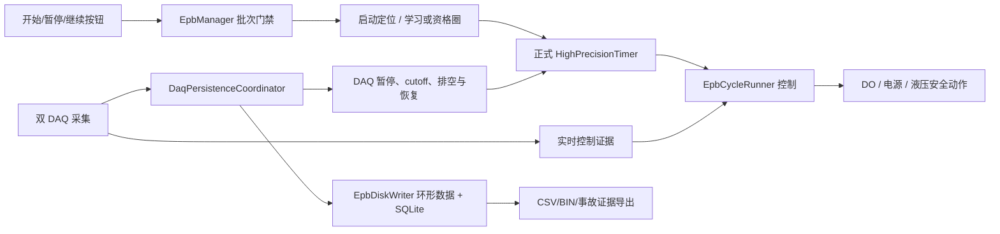

# V2.13.0.4 控制、记录与恢复代码审查

审查日期：2026-08-13  
审查基线：`70ccbe5`（`2.13.0.4`）  
审查范围：当前主程序的批量启动/正式循环、单通道终态、DAQ 持久化与恢复、暂停/继续、无人值守恢复、程控电源遥测和容量治理。未审查旧代码备份、回放工具的历史实现和硬件驱动 DLL 内部行为。

## 1. 结论先行

当前代码的正常路径和大部分已知故障路径已经具备较完整的门禁、状态身份和回归测试，尤其是：

- 正式圈只有“控制成功 + 圈终态持久化成功”才计数；
- DAQ 批次使用有界队列、原序重试、显式 cutoff 和 durable-prefix 判定；
- 报警圈、失败圈、软件恢复圈与正常完成圈已经分离；
- DAQ 恢复使用 RunId、RunEpoch、CorrelationId 和恢复所有权阻止迟到任务污染新运行；
- Watchdog、事故会话、遥测 CSV 和学习数据保留都采用临时文件/manifest/哈希等可审计机制。

但本轮仍确认 **3 个高风险闭环缺口、3 个中风险缺口**。最需要优先处理的是：

1. 单通道进入“已完成/人工停止”等终态前，没有统一强制验证电机 OFF；
2. 多液压组正式重入不是整批原子事务，并且“移交 DAQ、实际未启动”会被调用方当成恢复成功；
3. 暂停检查点在控制层已经宣布 `Paused` 后才由 UI 单独保存，崩溃恢复承诺并未与暂停终态一起提交。

在以上问题关闭前，不建议把“UI 已显示终态”等同于“物理安全边界已确认”，也不建议把同进程继续功能作为完全可靠的无人值守恢复边界。

## 2. 主调用链



本轮重点核对了“状态发布是否晚于物理动作”“内存状态是否晚于耐久证据”“恢复重入是否全有或全无”三类不变量。

## 3. 审查发现

### S1-01：单通道终态可以早于电机 OFF 确认

**位置**

- [`Controller/EpbManager.cs`](../../Controller/EpbManager.cs#L1360)：自然完成路径在第 1377 行忽略 `CommandEpbOff` 的返回值/异常，第 1403 行仍发布 `Completed`。
- [`Controller/EpbManager.cs`](../../Controller/EpbManager.cs#L2308)：`StopChannelForInternalCleanup` 在第 2329—2336 行忽略 OFF 失败，第 2359 行仍发布 `ManualStopped`。
- [`Controller/EpbManager.cs`](../../Controller/EpbManager.cs#L2444)：报警快速停机同样未消费高优先级 OFF 的失败结果。
- [`Controller/EpbManager.cs`](../../Controller/EpbManager.cs#L5622)：液压硬故障路径忽略普通优先级 OFF 结果后即发布故障终态。

**触发条件**

DO 队列拒绝、NI 写失败、设备任务异常或通道 OFF 返回 `false`。自然完成通道所在电源组若仍有其他通道运行，组电源不能作为立即兜底关闭。

**后果**

- UI/Watchdog/运行状态显示“完成”或“停止”，但带电位图仍可能为真、实际输出也可能未关闭；
- Timer/Runner 已被移除，后续活性监督不再拥有正常执行对象，故障更难自动收口；
- 自然完成路径只有“最后一个运行对象退出”才异步安排 `StopAllAsync`；若同组仍有其他通道，失败通道可能持续带电；
- 终态日志与物理状态不一致，现场审计会得到错误结论。

**整改建议**

建立唯一的异步终态提交入口，例如 `TransitionChannelToTerminalAsync`：

1. 撤销 Timer/Runner/液压参与权；
2. 提交最高优先级 OFF，并等待有界的 DO 完成回执；
3. OFF 未确认时立即升级电源组失效安全，保留 `IsChannelEnergized=true`；
4. 必要时用新鲜电流证据确认输出已清零；
5. 只有安全边界成功才发布 `Completed/ManualStopped/AlarmStopped`，否则发布 `SystemFault/TerminalCleanupUnverified`。

自然完成的“目标圈数已完成”和“设备已安全落位”应作为两个字段记录，不能用一个 `Completed` 同时表达。

**必须补测**

- 两个同电源组通道运行，其中一个自然完成且 OFF 返回 `false`；
- 单通道暂停失败转立即停止，OFF 队列拒绝；
- 报警停机高优先级 OFF 失败后，必须只有 `SystemFault`，且必须触发组级关电。

### S1-02：正式重入不是整批原子操作，且无操作返回会被误判为成功

**位置**

- [`Controller/EpbManager.PauseResume.cs`](../../Controller/EpbManager.PauseResume.cs#L1367)：`RejoinFormalChannelsAtSharedFutureSlot`。
- 第 1393—1408 行会把 DAQ 正在恢复的通道从 `selected` 删除；全部被删除时直接 `return`，没有向调用方说明“一个通道都未启动”。
- 第 1414—1489 行按液压组分别提交和回滚；如果第一组成功、第二组失败，只回滚第二组，第一组继续运行。
- [`Controller/EpbManager.PauseResume.cs`](../../Controller/EpbManager.PauseResume.cs#L156)：`ResumeBatchAsync` 在调用返回后立即清除暂停标记并发布 `Running`。
- [`Controller/EpbManager.PauseResume.cs`](../../Controller/EpbManager.PauseResume.cs#L358)：单通道继续也把无操作返回当作成功。

**触发条件 A：DAQ 竞态**

恢复预检通过后、调用正式重入前，DAQ 恢复上下文刚好建立。重入函数把通道移交给 DAQ 后返回；调用方却清除 `_channelPausedUtc/_batchPausedChannels` 并显示运行。

**触发条件 B：跨组部分提交**

同一次继续覆盖两个液压组；组 1 的 Timer 全部建立成功，组 2 在 `StartRejoinedFormalChannel` 或成员不变量检查处抛异常。

**后果**

- A：界面显示运行，但没有重建正式 Timer，通道实际停住且丢失“可继续”的暂停身份；
- B：调用方 catch 后把整批显示为 `Paused`，但组 1 的 Timer 仍真实运行，形成最危险的“界面暂停、硬件继续动作”；
- Watchdog 心跳会根据运行状态和恢复状态生成相互矛盾的证据。

**整改建议**

- 返回结构化 `FormalRejoinResult`，至少包含 `Requested/Started/Deferred/RolledBack`；调用方必须验证 `Started == Requested` 才能提交 `Running`；
- 把所有液压组放进同一个外层事务：先计算并登记全部成员，再启动全部 Timer；任一组失败时回滚本次调用已经启动的所有组；
- 若移交 DAQ，调用方保持 `ResumeChecking` 或 `Paused`，由 DAQ 恢复所有者在实际重入成功后统一提交状态；
- 加入只用于测试的竞态 seam，覆盖“DAQ 在预检与重入之间建立”和“第二液压组启动失败”。

### S1-03：暂停终态与可恢复检查点不是同一个耐久提交

**位置**

- [`Controller/EpbManager.PauseResume.cs`](../../Controller/EpbManager.PauseResume.cs#L53)：控制层完成断电、液压释放和持久化排空后，在第 123 行发布 `Paused`。
- [`MTTfTest/FrmEpbMainMonitor.BatchGuard.cs`](../../MTTfTest/FrmEpbMainMonitor.BatchGuard.cs#L93)：控制调用已经返回后，第 99 行才调用 `SaveGracefulPauseCheckpoint()`。
- [`MTTfTest/FrmEpbMainMonitor.PauseResume.cs`](../../MTTfTest/FrmEpbMainMonitor.PauseResume.cs#L272)：检查点保存属于 UI 层的第二次独立 I/O。

**触发条件**

控制层已经安全暂停后进程被强杀/断电，或检查点目录无权限、磁盘满、原子替换失败、RunId 快照不一致。

**后果**

同进程仍能继续，但重启后没有 `GracefulPause` 检查点，只能回退完整学习；UI 可能已经显示“全部通道已安全暂停”，实际只完成了物理暂停，没有完成“可跨进程恢复”的耐久承诺。

**整改建议**

- 像 `_pausePersistenceFlush` 一样向控制层注册“检查点耐久提交”回调；
- 在物理安全边界和数据 durable-prefix 完成后、发布 `Paused` 前保存检查点；
- 把状态细分为 `PauseSafeButCheckpointPending` 与 `PausedDurable`，按钮和 Watchdog 只把后者当作可跨进程继续；
- 检查点写失败不应撤销已经完成的安全暂停，但必须明确提示“仅可同进程继续/重启将完整学习”。

### S2-01：程控电源 typed 事件仍存在明确丢失路径，且降级状态没有进入控制/运行终态

**位置**

- [`Controller/PowerSupplyTelemetryCsvRecorder.cs`](../../Controller/PowerSupplyTelemetryCsvRecorder.cs#L225)：注释承诺 typed 事件不被有界稳态队列丢弃。
- 第 349—370 行：promotion 队列满时，触发事件本身没有直接进入 event/spill 队列，而是直接 `MarkEventDropped`。
- 第 372—387 行：event 与 spill 队列同时满时也会丢事件。
- `PersistenceDegraded`、`DroppedEventSamples` 和 `QueueDiagnostics` 只在本类及测试中使用，控制层没有订阅者。

**后果**

长时间磁盘异常或后台线程停滞时，保护状态/故障事件可能没有 CSV 证据。系统仍继续试验，运行 manifest 也没有稳定地声明“本轮程控电源事件证据不完整”。如果丢失后没有新段封口，`eventDrops` 甚至不会进入后续 segment manifest，只剩日志。

**整改建议**

- promotion 入队失败时，至少把 `TriggerRow` 直接送入 `QueueEvent`，只允许前置窗口降级，不能先丢触发事件；
- 增加 `TelemetryPersistenceStateChanged` 事件，由 EpbManager 锁存本轮证据降级；
- 在运行/事故 manifest 写入首次丢失序号、累计数量、原因和恢复时间；
- 明确策略：证据丢失是“继续但告警”，还是“暂停试验”；不要只留一个从未被消费的布尔属性。

### S2-02：仍保留可绕过安全边界的公开暂停/恢复 API

**位置**

- [`Controller/EpbManager.cs`](../../Controller/EpbManager.cs#L2280)：`PauseChannel` 只暂停 Timer 并发布 `Paused`，没有 OFF、液压释放和持久化排空。
- 同文件第 2290 行：`ResumeChannel` 直接恢复 Timer，没有 DAQ、电源、数据连续性、模型和机械释放预检。

当前生产 UI 已改用 `PauseChannelGracefullyAsync/ResumePausedChannelAsync`，仓库内没有上述两个公开 API 的调用点；但它们仍是 public，后续维护或外部程序集很容易误用并重新引入旧缺陷。

**整改建议**

删除这两个 API，或至少改为 `private/internal` 并标注 `[Obsolete(..., true)]`；所有入口只允许调用带安全门禁的异步版本。

### S2-03：完整解决方案构建依赖显式 restore，且调试器测试存在架构告警

执行：

```text
MSBuild TfTest.sln /m /t:Build /p:Configuration=Debug /p:Platform="Any CPU"
```

不带 restore 时，主程序、Controller、DAQ、Watchdog 和两个核心测试项目均成功编译，但 `PowerSupplyDebugger` 因 `project.assets.json` 缺少 `net8.0-windows/win-x64` target 导致解决方案最终返回失败。

补充执行 `MSBuild TfTest.sln /restore /m /t:Build ...` 后完整解决方案构建成功，说明源码配置可以构建，但构建入口必须显式还原。另外，`PowerSupplyDebugger.Tests` 仍报告 `MSIL` 测试项目引用 `AMD64` 调试器程序集的 `MSB3270` 架构不一致告警；当前仅编译通过，不能据此确认测试进程在所有执行器上都能正确加载 x64 依赖。

**整改建议**

- CI/构建脚本固定先执行 `MSBuild /restore` 或 `dotnet restore`；
- 校验 `RuntimeIdentifier(s)` 与发布配置一致；
- 增加一条从清空 `obj` 开始的解决方案构建检查，避免依赖开发机残留 assets。

## 4. 已验证内容

### 编译

- `Config`、`DataOperation`、`Timing`、`IO.NI`、`Controller`、`Watchdog.Protocol`、`MTTFTest.Watchdog`、`MTTfTest` 编译成功；
- `AdaptiveControlTests`、`EpbDiskWriterTests` 编译成功；
- 带 `/restore` 的完整解决方案构建成功；
- `PowerSupplyDebugger.Tests` 存在 `MSIL`/`AMD64` 的 `MSB3270` 告警。

### 定向回归

以下定向集合全部通过，共 173 项：

- `--telemetry-storage`：11/11；
- `--historical-storage`：3/3；
- `--watchdog-journal`：9/9；
- `--daq-realtime`：101/101；
- `--incident-session`：5/5；
- `--recovery-hardening`：10/10；
- `--recovery-coordination`：24/24；
- `--cycle-lifecycle`：10/10。

通过项说明已有机制按设计工作，不代表本报告的竞态已覆盖。现有测试主要验证单个液压组重入不变量、静态 DAQ defer 判定和正常终态；没有覆盖“第二组失败后的全局回滚”“defer 后调用方不得提交 Running”“单通道终态 OFF 返回 false”。

### 全量回归

- `AdaptiveControlTests`：416/416 通过；
- `EpbDiskWriterTests`：51/51 通过。

全量回归与定向集合有重叠，不能简单相加为独立用例总数；这里分别保留执行口径，便于后续复现。

## 5. 建议整改顺序

1. **先修 S1-01**：统一终态安全提交，禁止未确认 OFF 的通道显示完成/停止；
2. **再修 S1-02**：把正式重入改为有结果、可全局回滚的事务；
3. **再修 S1-03**：把暂停检查点纳入控制层耐久提交；
4. 补齐上述三项的确定性并发/故障注入测试；
5. 处理遥测降级传播、删除不安全旧 API；
6. 固化 restore + clean build，最后执行全量回归和至少一次双液压组长时间联调。

## 6. 验收不变量

整改完成后建议用以下不变量做代码和现场验收：

- 任一 `Completed/ManualStopped/AlarmStopped/Paused` 状态，都能关联一份晚于最后一次上电命令的 OFF 完成回执；
- `Running` 状态中的每个通道必须同时具有当前 RunEpoch 的 Timer、Runner、液压参与槽和有效电源许可；
- 一次多组重入要么所有请求通道启动，要么全部回滚，不能部分运行；
- `PausedDurable` 必须同时具备物理安全、DAQ durable-prefix、Raw 排空和原子检查点；
- 任一 typed 电源事件丢失都必须进入运行级证据降级状态，不能只存在于内存属性或限频日志；
- 重启恢复不得依赖 UI 文本推断，必须只依赖结构化状态、SQLite 和带哈希的 manifest/checkpoint。
