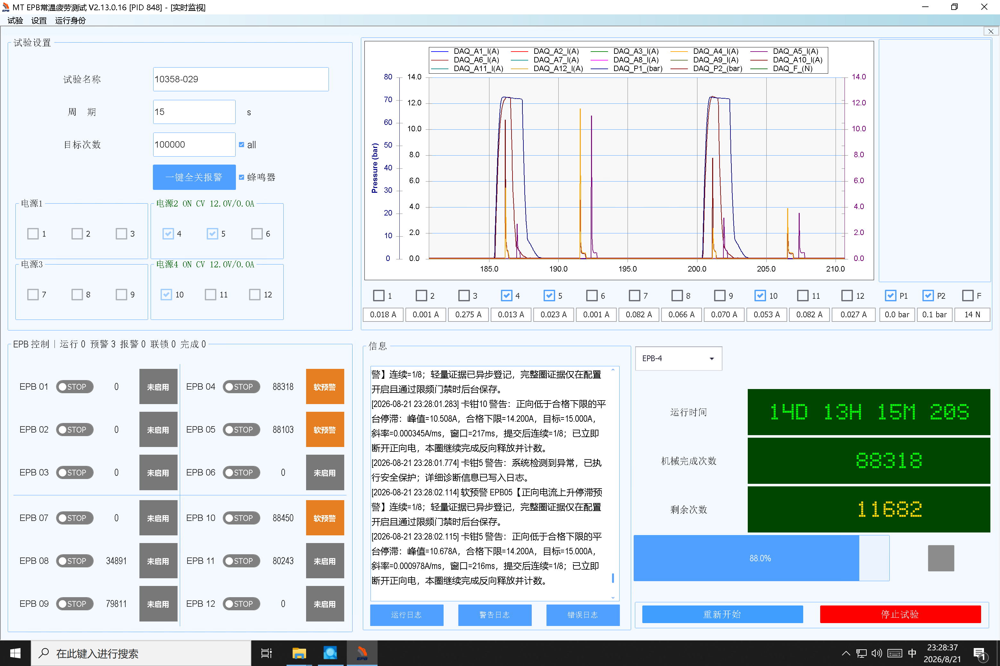

# 10358-029 V2.13.0.16 无法正常开始、曲线误截断与停止卡死：根因、修复及验收

日期：2026-08-21  
现场快照：`\\wj-epb\EPB_Data\10358-029_V2.13.0.16_0821_2329`  
对照快照：`\\wj-epb\EPB_Data\10358-029_V2.13.0.15_0821_2310`  
现场程序：`D:\debug\2.13.0.16\MTTFTest.exe`，PID 848  
分析结论：代码根因已确认并修复，自动化回归通过；尚需使用修复后的新安装包完成一次台架验收，不能继续把现场 V2.13.0.16 当作可运行版本。

## 1. 结论先行

本次是两个相互独立的软件问题，不是 DAQ 曲线绘制故障，也没有证据指向液压建压不同步。

1. V2.13.0.16 的“无法正常开始、曲线完全不对”是正向控流状态机提前断电造成的真实波形截断。V2.13.0.16 新增了 `RapidLoadRiseWithoutObservedEmpty` 分支，允许本圈还没有形成空行程观测时提前进入 `LoadRise`；但后续 `LowTargetPlateau` 判定没有要求平台必须接近 15 A 目标，因而把 10～11.7 A 的机构中段平台误判成“夹紧已完成”，约 215～219 ms 后立即断开正向电。三只启用卡钳 EPB4、EPB5、EPB10 均重复发生，所以界面所见曲线确实被控制逻辑截断，并非显示比例或刷新异常。
2. “停止试验”卡死是停止按钮在真正调用 `StopAllAsync` 之前，先在 UI 线程同步执行恢复检查点强制刷盘、Watchdog 通知和暂停检查点清理。现场最后一条 UI 日志正好停在“已接收停止试验命令”，没有任何 `StopStage` 或 `StopAll` 入口证据；恢复检查点却在同一秒被写过，Watchdog 又始终没有收到 `ManualStopIntent`。因此阻塞被严格夹在“收到点击”与“进入安全停机”之间。该路径同时存在两个无界风险：`Flush(true)` 外部 I/O 在 UI 线程执行，以及命名管道 `WriteLine` 在 Watchdog 全局锁内执行。

修复后：

- 15 A 目标下，低目标平台至少必须达到 13.5 A（目标的 90%），且当前 200 ms 窗口的 P90 也必须达到该门槛，才允许按低目标平台断电；10～11 A 中段平台会继续供电，仍由既有 3000 ms 正向进展硬截止兜底。
- 点击“停止试验”后首先启动 `StopAllAsync`。批次取消回调、Watchdog 通知和检查点耐久化都改为后台并行收口，不再挡在物理断电之前。
- Watchdog 命名管道写入改用独立发送锁，等待发送锁最多 100 ms，且任何可能阻塞的 `WriteLine` 都不再持有全局状态锁。

## 2. 现场证据

现场截图清楚显示 EPB4、EPB5、EPB10 启用，电流峰值只到约 10～12 A，界面连续出现“正向低于合格下限的平台停滞”。



### 2.1 曲线异常不是画图问题

`log\run.log` 的关键时间线如下。

| 本地时间 | 现场证据 | 含义 |
|---|---|---|
| 23:24:31.738 | `ProductVersion=V2.13.0.16`，PID 848 | 确认故障进程和版本 |
| 23:26:28～23:26:36 | EPB4/5/10 进入启动定位和学习阶段 | 启动命令已被系统接收，不是按钮未生效 |
| 23:26:45.852 | `GlobalSlotAlignment ... AlignmentState=Aligned` | 双液压建压和全局槽已对齐，排除本次同步故障 |
| 23:26:46.029 | EPB10 `RapidLoadRiseWithoutObservedEmpty` | 新增快速负载上升分支被触发 |
| 23:26:46.182 | EPB4 `ClampReachedLowTargetPlateau Peak=11.493A` | 远低于 15 A 目标即被断电 |
| 23:26:46.183 | EPB10 `Peak=10.316A` | 同一错误作用于 EPB10 |
| 23:26:46.930 | EPB5 `Peak=11.132A` | 同一错误作用于 EPB5 |
| 后续学习圈 | 峰值反复为约 10.2～11.7 A | 稳定重复的软件判定，不是单点毛刺 |

首圈还明确记录：

```text
EPB[10] 控流观测未进入学习模型：Rejected=InvalidOrUnlearnableSlope ... Peak=10.316A Target=15.000A
EPB[4]  ... Peak=11.493A Target=15.000A
EPB[5]  ... Peak=11.132A Target=15.000A
```

因此学习圈虽然被封存为 `learning_completed`，但形成的是提前断电的无效控流观测，用户所说“完全无法开始试验”在业务上成立：系统没有得到可用于正常正式试验的夹紧曲线。

V2.13.0.15 对照日志中的同类软平台峰值是 14.032 A、14.093 A、14.138 A，处于目标尾段；没有出现 V2.13.0.16 这种 10～11 A 即断电的成片现象。

### 2.2 停止卡死发生在安全停机入口之前

`log\ui-info.log` 最后一条人工停止日志为：

```text
[2026-08-21 23:28:10.572] 已接收停止试验命令，正在执行安全断能与数据收口。
CommandId=df274cd052e344608854e0668a7608b6
```

此后直到 23:29:01 强杀进程：

- `run.log` 没有 `StopAll`、`StopStage`、物理安全确认或停止完成记录；
- `Recovery\unattended-run-checkpoint.json` 和审计文件更新时间是 23:28:10，说明 UI 已进入同步检查点写入链；
- Watchdog 客户端日志最后一个事件仍是 23:26:47 的 `HeartbeatRefreshSent`，没有 `ManualStopIntent`；
- Watchdog 最后心跳时间是 23:28:07.105，`StopAllActive=false`、`StopStage=None`、`ActiveCycleCount=3`；
- 23:29:01.411 才因主进程被强杀出现 `PipeDisconnected`，23:29:01.676 以 `HeartbeatUnresponsive` 请求接管；23:29:02 的 `OperatorCanceledAutomaticRecovery` 是强杀后的过渡窗操作，不是 23:28:10 的停止按钮成功送达。

旧按钮顺序是：

```text
UI 收到点击
  -> UnattendedRecoveryCoordinator.Disarm()       // WriteThrough + Flush(true)
  -> WatchdogRuntime.NotifyManualStop()            // 命名管道写入
  -> ClearGracefulPauseCheckpoint()                // 再次耐久化
  -> _batchCts.Cancel()                             // 同步执行取消回调
  -> _epb.StopAllAsync()                            // 真正安全停机最后才开始
```

这解释了为什么界面卡死时既没有安全停机进度，也只能强杀：有多个外部或回调阻塞点位于安全入口之前。现场证据可以把阻塞范围锁定到这段前置链；单凭日志无法进一步证明当时 CPU 精确停在哪一条系统调用，因此本次同时消除了该范围内的全部结构性阻塞点，而不是只猜一个点。

## 3. 版本回归来源

V2.13.0.16 的主体变更提交 `0770d7a` 在 `Controller/Adaptive/EpbAdaptiveControl.cs` 新增：稳定历史基线存在、当前圈尚无空行程观测、当前超过临时负载阈值且斜率为正时，直接进入 `LoadRise` 并记录 `RapidLoadRiseWithoutObservedEmpty`。

这个入口本身是为兼容“涌流忽略期结束时已经越过历史阈值”的现场曲线，不能简单删除；否则此前 EPB10 第 85993 圈回放会重新失败。真正缺口在下游：

```text
进入 LoadRise
  -> 电流达到 60% 目标即可进入高负载平台探测
  -> 斜率低并持续约 200 ms
  -> 不检查是否处于目标尾段
  -> ClampReachedLowTargetPlateau
  -> 正向断电
```

在本次现场，`RapidLoadRiseWithoutObservedEmpty` 把普通中段负载变化送入了这条链，旧的低平台判据随后将 10～11 A 当成夹紧终点，二者组合才构成 V2.13.0.16 回归。

## 4. 已落地修复

### 4.1 防止中段平台误判夹紧完成

文件：`Controller/Adaptive/EpbAdaptiveControl.cs`

- 新增 `MinimumLowTargetPlateauFraction = 0.90`。
- `LowTargetPlateau` 除原有 200 ms 确认、P90 低于目标、斜率低于门限外，同时要求：
  - 本圈有效峰值达到低平台尾段门槛；
  - 当前确认窗口 P90 也达到门槛。
- 对本项目 15 A 目标，门槛为 `min(14.2 A 合格下限, 15 A × 90%) = 13.5 A`。
- 10～11 A 平台不再被当作成功终态；若电流确实无法继续上升，既有 3000 ms `ForwardProgressDeadline` 仍会硬停，安全保护没有被取消。
- 14.2 A 以上近目标平台、13.6/13.9 A 既有低目标平台策略和直接达到 15 A 的正常策略保持不变。

### 4.2 让安全停机先于所有外部收口

文件：`MTTfTest/FrmEpbMainMonitor.cs`、`MTTfTest/UnattendedRecovery.cs`

新顺序是：

```text
UI 收到点击并锁定按钮
  -> 立即 _epb.StopAllAsync()                      // 首个可能阻塞操作就是安全停机
  -> 后台通知 Watchdog（UI 最多礼让 250 ms）
  -> 后台撤销并耐久化自动恢复检查点
  -> 后台清理正常暂停检查点
  -> 后台执行批次 CancellationToken 回调
  -> UI 持续显示 StopAll 阶段，等待既有有界安全结果
```

`UnattendedRecoveryCoordinator.DisarmAsync` 先撤销恢复/交接序列，再把 `WriteThrough + Flush(true)` 移到线程池，网络盘或磁盘停顿不会冻结 UI，也不会延迟 `StopAllAsync` 的启动。

物理安全完成后的 `PhysicalStopConfirmed`、`StopCompleted` 和本地 Watchdog 关闭同样在后台执行；通知窗口最多保留 1 秒，随后由独立任务关闭管道，使完成阶段也不存在 UI 管道写入阻塞点。

### 4.3 Watchdog 管道写入与全局锁解耦

文件：`MTTfTest/WatchdogRuntime.cs`

- 新增独立 `SendGate`，串行化同一 `StreamWriter` 的发送。
- 获取发送锁最多等待 100 ms；超时返回发送失败并进入现有传输故障处理。
- 只在全局 `Gate` 内核对 writer 身份，不在该锁内调用 `WriteLine`。
- 即使一个管道写入被系统 I/O 卡住，其他线程仍能获得全局锁、取消生命周期、释放管道并触发 Watchdog 接管；停止 UI 不会再无限等待该全局锁。

## 5. 回归验证

新增回归：`Tests/AdaptiveControlTests/Program.cs` 的 `RapidLoadRiseMidTravelPlateauDoesNotCutPower`。

回放条件：

- 15 A 目标、稳定历史模型；
- 46 ms 为 0.054 A、94 ms 为 1.719 A、109 ms 为 2.318 A，复现 `RapidLoadRiseWithoutObservedEmpty`；
- 上升到 10.8 A 后保持 330 ms；
- 随后恢复上升到 15 A。

新增测试在修复前稳定失败，错误原文：

```text
10.8A中段平台被提前断电：ClampReachedLowTargetPlateau
Peak=10.800A I=10.800A Floor=14.200A Target=15.000A
slope=0.000605A/ms confirm=220ms
```

修复后的结果：

| 验证项 | 结果 |
|---|---|
| `MTTfTest.csproj` Debug/AnyCPU（实际 `PlatformTarget=x86`）编译 | 通过；只有仓库既有未使用字段/变量警告 |
| `AdaptiveControlTests.csproj` Debug/AnyCPU 编译 | 通过 |
| 完整 `AdaptiveControlTests.exe` | `PASS 478/478` |
| 新增 V2.13.0.16 中段平台回放 | 通过，10.8 A 不断电，恢复后到 15 A 正常完成 |
| EPB10 第 85993 圈快速负载回放 | 通过 |
| 13.6 A 持续低平台软断电 | 通过 |
| 13.9 A 短平台恢复、持续平台预警 | 均通过 |
| Stop/Watchdog 既有硬化回归 | 全部通过 |

本轮没有连接现场 NI、程控电源、液压站做硬件动作，自动化通过不能替代台架停机验收。

## 6. 新包发布与台架验收门禁

建议将本修复打入 V2.13.0.17 或更高版本，不要覆盖或继续分发 V2.13.0.16。

### 6.1 发布前

1. 从干净构建输出生成安装包并生成逐文件 manifest。
2. 启动日志必须显示 `PackageVerified=True`。本次现场 V2.13.0.16 为 `PackageVerified=False; PackageCode=PackageManifestMissing`；这不是曲线异常根因，但意味着现场包缺少发布完整性门禁，下一包不得带病发布。
3. 保存新包的 Git commit、配置 SHA-256、EXE SHA-256 和构建时间。

### 6.2 台架曲线验收

1. 仍选择 EPB4、EPB5、EPB10，目标 15 A，先执行至少 3 个完整学习圈。
2. 每圈不得在 13.5 A 以下出现 `ClampReachedLowTargetPlateau`；正常目标应继续接近 15 A。
3. 不得连续出现 `RapidLoadRiseWithoutObservedEmpty` 后紧接 10～11 A 低平台断电。
4. 学习观测应能进入模型，不能三通道反复 `Rejected=InvalidOrUnlearnableSlope`。
5. 正式 Timer 建立、机械完成次数和剩余次数均应正常推进。

### 6.3 停止验收

分别在学习圈正向上电、反向释放、正式等待三个时点各点一次“停止试验”：

1. 点击后界面应立即显示安全停止状态，窗口仍能刷新/拖动。
2. `run.log` 必须在“已接收停止试验命令”后出现 `StopStage` 或 StopAll 进展，不允许只有接收日志。
3. 正反向 DO、程控电源和液压安全状态按现有 StopAll 合约确认。
4. 正常情况下应出现 `ManualStopIntent`、物理安全确认和 `StopCompleted`；如 15 秒安全收口超时，应由 Watchdog 按既有策略接管，而不是 UI 永久卡死。
5. 停止后不得自动恢复本次已撤权运行；若结果要求重启，开始按钮必须保持闭锁。

## 7. 影响范围与回退

- 控流改动只收紧“低目标平台可以被当作夹紧完成”的最低位置，不改变过流、开路、DAQ 断流、绝对上电期限、直接目标、全速率峰值和反向释放保护。
- 停止改动不缩短 StopAll 的安全确认流程，只把非物理安全的耐久化与通知工作移到后台，并保留原有 Watchdog 兜底。
- 若新包现场仍出现异常，立即停止继续试验并回退到已验证可运行的 V2.13.0.15；保留新包完整项目快照、`log`、`Recovery`、`WatchdogSessions` 和对应截图，不要只复制单个 `run.log`。

## 8. 本次变更文件

- `Controller/Adaptive/EpbAdaptiveControl.cs`
- `MTTfTest/FrmEpbMainMonitor.cs`
- `MTTfTest/UnattendedRecovery.cs`
- `MTTfTest/WatchdogRuntime.cs`
- `Tests/AdaptiveControlTests/Program.cs`
- 本文档
