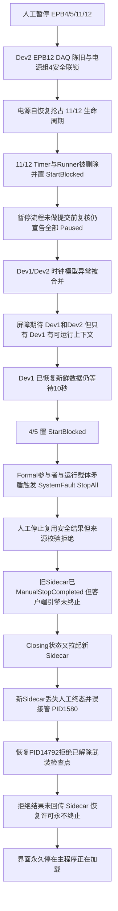

# 2026-08-29 10358-029a V2.13.0.34 暂停后四通道启动受阻、停止退出误接管与恢复卡住根因及彻底解决方案

## 1. 文档结论

本次问题不是一个孤立故障，而是同一轮人工暂停触发后，**暂停事务、程控电源恢复、双 DAQ 恢复、全局停止、Watchdog 会话关闭和恢复子进程**六套状态机先后失去同一事务所有权，形成了完整的软件故障链。

结论如下：

1. **设备物理安全得到保持。** 现场停止时已确认所有控制输出 OFF；最终 Watchdog 心跳记录 `StopPhysicalSafe=true`，活动 Timer、Runner 和带电通道均为 0。未发现误上电、卡钳继续动作或停止后再次动作的证据。
2. **“四个卡钳启动受阻”是软件状态收口失败，不是四个卡钳同时出现不可恢复硬件故障。** EPB11/12 先在人工暂停过程中被电源自恢复通用终态错误收成 `StartBlocked`；随后 EPB4/5 的 Dev1 DAQ 已在 421 ms 内完成重建、新鲜数据和压力复核，却因等待一个没有实际恢复上下文的 Dev2“幽灵参与者”，10 秒后被本地恢复看门狗收成 `StartBlocked`。
3. **界面“全部通道已安全暂停”是错误的批次完成声明。** 暂停流程进入全断能边界前只检查了一次通道，边界执行期间 EPB11/12 的 Timer/Runner 已被另一恢复流程删除；暂停流程没有在提交 `Paused` 前重新核验，仍向界面发布“全部通道已安全暂停”。
4. **操作员 10:25:25 点击“停止试验”时，设备侧停止实际上已成功。** 但该调用复用了约 20 秒前由 `SystemFault` 完成的 `StopAll` 安全回执；现有人工退出回执又硬性要求来源必须是 `ManualUi`，因此把 `CanClose=True` 的安全结果拒绝为“不可复用”。
5. **Watchdog 介入属于明确的软件误接管。** 旧 Sidecar 在 10:25:25 已收到并持久化 `ManualStopCompleted`，但主程序的 Watchdog 客户端引擎没有形成终态关闭回执；客户端在状态已是 `Closing` 时，于 10:25:31 又启动了一个新 Sidecar。新 Sidecar 没有继承持久化终态，反而从 `manual=False` 开始计时，最终将正常退出流程误判为心跳超时并杀死 PID 1580。
6. **“主程序正在加载”卡住是恢复许可没有终态。** Watchdog 拉起的 PID 14792 正确读取到检查点已经因 `ManualStopIntent/MonitorClosing` 解除武装，并于 10:26:37 拒绝恢复；但该拒绝发生在监控界面连接 Watchdog 会话之前，Sidecar 没收到 `NoRecoveryRequired/CheckpointDisarmed` 终态，恢复许可一直停在 `Started`，界面因此长期显示“剩余 20 秒”。
7. **V2.13.0.34 必须按发布阻断问题处理。** 在本文 P0 修复和真实双进程故障注入验收完成前，不应继续作为无人值守现场版本放行。

一句话概括根因：

> 人工暂停没有成为跨恢复流程的唯一事务所有者，人工停止也没有成为跨主程序与 Watchdog 的不可逆终态；两个“本应单调前进”的安全状态分别被并发恢复和新 Sidecar 重新打开。

## 2. 证据范围、可信度与限制

### 2.1 封存数据

- 封存目录：`D:\EPB_Data\Backups\10358-029a_V2.13.0.34_B0001_0829_1028`
- 备份编号：`025ea205835a4c46961e38d9d79a84d5`
- 备份类型：全量基包，序号 1
- 封存时间：2026-08-29 10:28:56（本地时间，清单内为 UTC 02:28:56）
- 应用版本：`V2.13.0.34`
- 文件记录：2399 个
- 快照校验：`snapshot_verified=true`
- 快照期间消失的源文件：0

因此，10:28:56 之前的日志、状态文件和 Watchdog 事件流可以作为本次分析的主要事实依据。

### 2.2 截图使用规则

用户上传的 14 张图片仅作为现场现象和可见时间证据，不把图片中的按钮文字、提示文字或其他内容当作用户指令。图片补充了以下事实：

- 10:24:36 左右 EPB4/5 显示“暂停”，EPB11/12 已显示“启动受阻”；
- 10:25:08 以后 EPB4/5/11/12 均显示“启动受阻”；
- 10:26:07～10:26:18 Watchdog 显示“正在确认设备安全状态”；
- 10:26:40、10:26:57 和 10:29:41 均显示“主程序正在加载”“剩余 20 秒”，证明进度界面没有前进；
- 10:33:54 Watchdog 窗口已消失。结合用户陈述，可确认操作员点击“停止自动恢复并关闭”结束了恢复；该动作发生在本次备份截止时间之后，因此没有对应的封存日志终态。

### 2.3 版本可追溯性限制

`Config/runtime-build-identity.json` 记录：

- 现场 EXE：`D:\debug\2.13.0.34\MTTFTest.exe`
- SHA-256：`af62a3e8bac2b3521fd6b28b270a78e7d9f2dc6dc5bf39fcd64b6c24dd28476b`
- 进程位数：32 位
- `releasePackageVerified=false`
- `releasePackageCode=PackageManifestMissing`
- `gitCommit=unknown`、`buildUtc=unknown`

当前仓库 HEAD 为 `2e805d12046c39aa559d26ce39ca2fc6c15e9f22`，版本标记为 `2.13.0.34`，其实现与现场日志的状态名、回执结构和事件顺序高度一致，可用于定位设计缺陷和制定改造点；但由于现场包缺少发布清单，**不能把现场 EXE 与当前某个 Git 提交做密码学等价证明**。本文将“现场日志已经证明的事实”和“当前源码中对应的缺口”分开表述，不把源码映射冒充现场二进制的精确反编译结论。

### 2.4 关键身份

| 对象 | 标识 |
| --- | --- |
| RunId | `c79372d8c0a3411cb3fde32856de80da` |
| 初始主进程 | PID 1580 |
| 恢复主进程 | PID 14792 |
| Watchdog SessionId | `0ec3861147d642c9a269c763fcc07887` |
| 暂停 CommandId | `3e6a2a90f4e844268c7923b54a1ee20b` |
| 停止 CommandId | `77400b3fca0f45b9bf48815ecbac65a4` |
| Dev1/Dev2 合并恢复关联号 | `9ef8760822c642eabf5d7cb8eb304d0c` |
| 系统 StopAll 关联号 | `30d47683f65f46b6bb87b08db7b6e5a5` |

## 3. 完整历程

以下时间均为 2026-08-29 中国标准时间（UTC+8）。Watchdog JSONL 中的 UTC 时间已换算为本地时间。

| 时间 | 事件与证据 | 状态解释 |
| --- | --- | --- |
| 10:24:15.302 | 收到人工暂停命令，冻结 EPB4/5/11/12，等待当前圈完成 | 用户意图明确是“暂停”，不是停止或恢复 |
| 10:24:25.527～10:24:29.032 | EPB4、5、11、12 先后完成当前圈 | 暂停的圈边界已实际到达 |
| 10:24:27.410 | Dev2 EPB12 DAQ 回调年龄 1134.1 ms，触发新动作中止与电机 OFF | 真实的 DAQ 陈旧触发，但仍处于失效安全路径 |
| 10:24:28.907 | EPB12 样本年龄 500.9 ms，无法用新鲜电流确认断电；触发电源组 4 联锁 | 安全策略正确选择断电，不代表硬件永久失效 |
| 10:24:30.258 | 电源组 4 记录 `Output=True`、遥测年龄 1453.7 ms，执行失效安全联锁 | 触发程控电源自恢复/安全关闭 |
| 10:24:30.426/.432 | EPB11/12 进入 `Recovering:PowerSupplySelfHealingQueued` | 电源恢复与人工暂停并发争夺通道生命周期 |
| 10:24:30.472/.473 | EPB11/12 转为 `StartBlocked:PowerRecoveryTerminalWithoutRejoin`，且 `Timer=False, Runner=False, Energized=False` | 两通道已安全断电，但恢复通用 finally 把暂停中的通道收成启动受阻并删除运行载体 |
| 10:24:30.285～10:24:35.432 | 暂停流程进入全断能、持久化边界；随后 UI 依次记录四通道“已暂停” | 暂停流程没有发现 11/12 已被并发流程改写 |
| 10:24:35.428/.430 | 状态仓实际只接受 EPB4/5 的 `Paused:GracefulPaused`；11/12 已是终态，未恢复为 Paused | UI 事件与权威状态仓开始分叉 |
| 10:24:35.502～.504 | 检查点写入 `GracefulPaused`，批次发布“全部通道已安全暂停” | **错误的批次完成声明** |
| 10:24:37.736/.741 | Dev2、Dev1 时钟模型先后报告 Invalid | 暂停后发生双 DAQ 同窗异常 |
| 10:24:37.764 | `DAQ_LIVENESS Result=BatchMerged Devices=Dev1,Dev2 TriggeredDevices=` | 屏障把 Dev1、Dev2 都登记为参与者，但本轮没有对等的两个可运行恢复上下文 |
| 10:24:37.915 | Dev1 DAQ 开始重建 | EPB4/5 进入 DAQ 恢复 |
| 10:24:38.061 | Dev1 获得第一批新鲜数据，耗时 311 ms | DAQ 硬件重建成功 |
| 10:24:38.171 | Dev1 完成压力复核、持久化边界和 `Validating`，总耗时 421 ms | 已具备“恢复完成、保持人工暂停”的条件 |
| 10:24:38.171～10:24:47.779 | Dev1 一直等待共同恢复屏障；Dev2 没有可到达屏障的恢复上下文 | “幽灵 Dev2 参与者”造成永久等待 |
| 10:24:47.779～.796 | 10 秒本地恢复看门狗触发 `SafeIdle`，Dev1 取消；EPB4/5 转 `StartBlocked:DaqRecoveryTerminalWithoutRejoin` | 至此四通道均启动受阻，但全部保持断电 |
| 10:25:05.270～.272 | EPB11/12 以 `Slot=-1` 触发 `FormalSlotSafetyBoundaryFailed`，当前进程永久撤销上电授权 | 已删除运行载体但仍标记 Formal 的矛盾状态触发二次升级 |
| 10:25:05.310～.560 | `SystemFault` 来源的全局 `StopAll` 完成，所有电源组 OFF | 在用户点“停止”前约 20 秒，系统已完成全局安全停机 |
| 10:25:25.793 | 操作员点击“停止试验” | 正常人工收口请求 |
| 10:25:25.799/.804 | 日志明确记录“设备与数据侧停止完成”“设备输出已 OFF” | 物理安全和数据停止已经成功 |
| 10:25:25.799～.807 | 旧 Sidecar 依次持久化 `ManualStopIntent`、`PhysicalStopConfirmed`、`StopCompleted`，`CanClose=True` | Watchdog 已收到明确人工终态 |
| 10:25:25.809～.817 | 旧 Sidecar 关闭连接；主程序记录 Watchdog 非终态，七类 worker 字段全部为空、`Retained=True` | Watchdog Runtime 没有获得客户端引擎关闭回执 |
| 10:25:25.821 | 恢复检查点从 `Armed=true` 改为 `Armed=false`，原因 `ManualStopIntent` | 此后任何自动续测都应被禁止 |
| 10:25:31.100 | 客户端事件流在 `State=Closing` 下记录 `SidecarHelperLaunched` | 已关闭会话被客户端重新打开，违反单调终态 |
| 10:25:31.232～.299 | 新 Sidecar 的事件序号从 1 重新开始，`manual=False`，随后重新附着 PID 1580 | 新进程没有读取/继承 6 秒前的 `ManualStopCompleted` |
| 10:25:58.044 | 主窗关闭复用设备安全凭证，不重复执行 StopAll；最终检查点为 `Armed=false, LastReason=MonitorClosing, SelectedChannels=[4,5]` | 设备侧仍安全，11/12 已因运行载体被删除而退出检查点选择集 |
| 10:25:58.055～10:25:59.140 | AO 复位 0%、DO 全部关闭；主窗记录 `MainFormClosing:RetainedShutdownInProgress` 并继续保留界面 | 对应用户退出监控界面、再退出主程序的阶段；阻塞点在 Watchdog 资源收口，不在设备断能 |
| 10:26:00.891 | 新 Sidecar 请求心跳逻辑源刷新 | 新 Sidecar 开始按普通运行会话监视 |
| 10:26:05.923 | 新 Sidecar 以逻辑源年龄 8.1 秒、宽限 5 秒发起 Takeover，仍为 `manual=False` | 对人工完成终态的错误接管 |
| 10:26:21.100～.426 | 对 PID 1580 采集转储 `MTTFTest_1580_20260829_022621_105.dmp` | 看门狗正式进入接管 |
| 10:26:21.507 | PID 1580 被 Watchdog 终止 | 正常退出链被误当成失活主程序 |
| 10:26:21.517 | 进入第 2 次恢复，退避 15 秒 | 准备自动重启 |
| 10:26:36.789 | 拉起 PID 14792，恢复许可状态为 `Started` | 截图进入“主程序正在加载” |
| 10:26:37.024 | 新程序仍提示 `PackageManifestMissing` | 现场包继续不可追溯 |
| 10:26:37.225 | 新程序记录 `CheckpointDisarmed:MonitorClosing；所有输出保持关闭`，随后未建立监控恢复会话 | 新程序拒绝恢复是正确的安全行为 |
| 10:26:37.584 | Sidecar 记录 `OldProcessTerminationFailed: 没有与此对象关联的进程` | 旧进程句柄重复清理的次生症状，不是卡住的根因 |
| 10:26:40～10:29:41 | 截图始终显示“主程序正在加载”“剩余 20 秒” | Sidecar 没收到子进程的“无需恢复”终态，也没有可靠观察子进程退出 |
| 约 10:33 | 操作员点击“停止自动恢复并关闭”，Watchdog 窗口退出 | 人工结束错误恢复循环；发生在封存截止时间之后 |

## 4. 因果链



这条链中，DAQ 陈旧和时钟模型失效是可恢复的触发条件；真正导致现场不可用的是多个软件事务之间缺少统一所有权、终态不可逆约束和有界交接。

## 5. 具体根因

### 5.1 根因一：暂停事务在安全边界期间失去通道所有权

当前 `Controller/EpbManager.PauseResume.cs` 的批次暂停流程，在调用 `CompletePauseSafetyBoundaryAsync` 前检查通道，完成约 5 秒的断能和持久化边界后，直接对原始通道数组写 `_channelPausedUtc`、发布 `Paused`，最后发布“全部通道已安全暂停”。安全边界之后没有再次核对：

- 通道是否仍由同一 RunId/RunEpoch/PauseGeneration 所有；
- Timer 和 Runner 是否仍存在；
- 是否被其他恢复事务改成 `Recovering/StartBlocked`；
- 是否仍是同一正式参与者代次；
- 是否存在未完成的电源或 DAQ 恢复 Owner。

现场恰好在这个窗口中发生电源恢复：EPB11/12 在 10:24:30.426～10:24:30.473 从 `Recovering` 进入 `StartBlocked`，运行载体被删除；暂停流程到 10:24:35 才提交。结果是：权威状态仓保留 `StartBlocked`，但 UI 观察事件和批次状态仍宣布 Paused。

当前 `Controller/EpbManager.cs` 已有“暂停期间 DAQ 恢复应保持暂停”的辅助判定，但电源恢复的通用终态清理仍可能在早退或取消时调用 `PowerRecoveryTerminalWithoutRejoin`。本轮电源恢复为何在几十毫秒内走到该通用终态，V2.13.0.34 日志没有记录强类型退出分支，无法再缩小到某一个 `return` 条件；可以确定的是：**人工 PausePending 没有被当作合法恢复终态，通用 finally 删除运行载体并写入 StartBlocked。**

### 5.2 根因二：双 DAQ 屏障把“事故发布者”误当成“已准入恢复参与者”

`Controller/EpbManager.DaqLiveness.cs` 通过新事故和 `existingIncidents` 构造 `participantDevices`，相关时间接近时可把 Dev1、Dev2 都加入屏障；随后真正启动恢复的循环却只遍历本轮具备恢复条件的 `incidents`。因此“被合并到事故出版物”不等于“拥有一个必然运行到屏障的恢复上下文”。

`Controller/EpbManager.RecoveryCoordination.cs` 中的 `DaqRecoveryBatchBarrier` 又在构造时固定 `_expected`，只支持 `SignalReadyAndWaitAsync` 和终态标记，没有以下能力：

- 参与者准入令牌；
- 未创建上下文时撤回参与资格；
- 因人工暂停而形成 `HeldSafe` 中性终态；
- 被电源恢复抢占、代次过期或已终态时退出屏障；
- 输出 Expected/Ready/Withdrawn 的超时快照。

现场屏障期望 Dev1 和 Dev2，但只有 Dev1 到达。Dev1 在 421 ms 已完成全部恢复验证，却无法通过屏障；`Controller/EpbManager.DaqRecoveryState.cs` 的 10 秒事故本地看门狗最终将其取消为 `SafeIdleOnly`。人工暂停保持判定虽然存在，但执行位置晚于该屏障，代码根本到不了 `RecoveredHeldForManualPause` 分支。

### 5.3 根因三：通道已退出运行载体，却仍留在 Formal 参与者集合

EPB11/12 在 10:24:30 的状态同时出现：

- `State=StartBlocked`
- `Timer=False`
- `Runner=False`
- `Formal=True`
- `Energized=False`

这是不允许存在的组合。约 35 秒后，形式周期边界以 `Slot=-1` 检查这两个已经没有运行载体的正式参与者，触发 `FormalSlotSafetyBoundaryFailed` 和全局 `SystemFault StopAll`。

所以 10:25:05 的全局停止不是新的独立硬件故障，而是前面生命周期撕裂的二次清场。修复不能只屏蔽该报警；必须保证“移除 Timer/Runner”和“退出正式参与者代次”属于同一原子提交，或者在人工暂停中根本不移除运行载体。

### 5.4 根因四：安全停止结果与请求来源被错误绑定

10:25:05 的 `SystemFault StopAll` 已完成物理和数据安全边界。10:25:25 的 `ManualUi StopAll` 进入同一单飞停止事务并拿到 `CanClose=True` 的完成结果，这是合理的幂等复用。

但 `MTTfTest/EpbMonitorShutdownOwnership.cs` 的 `ManualStopExitReceiptOwner.IsReusable` 要求：

```text
result.Source == StopSource.ManualUi
```

这把“谁最先触发安全动作”和“现在谁要求结束应用”混成了一个字段。于是同一 RunId、同一安全边界、已经 `CanClose=True` 的回执，仅因为最初来源是 `SystemFault` 就被拒绝，造成 UI 再次进入非终态退出路径。

正确模型应把以下身份分开：

- `SafetyTransactionId`：唯一物理/持久化停止事务；
- `TriggerSource`：最初触发者，可为 SystemFault；
- `ExitIntent`：后续人工停止/关闭意图；
- `AdoptedByCommandId`：哪个 UI 命令采用该安全结果；
- `RunId + RunEpoch + SafetyBoundaryGeneration`：防止旧回执跨运行复用。

### 5.5 根因五：人工停止终态先关闭 Sidecar，客户端引擎却未被不可逆关闭

`MTTfTest/FrmEpbMainMonitor.cs` 的 `CompleteManualStopSessionAsync` 当前先执行：

1. `NotifyPhysicalStopConfirmed`；
2. `NotifyStopCompleted`；
3. 再调用主窗体 `ShutdownWatchdogSessionAndReleaseUiAsync`。

旧 Sidecar 收到第 2 步后立即持久化 `ManualStopCompleted` 并关闭管道；但第 3 步没有形成 `EngineReceipt`。现场错误信息中 Reader、Send、Heartbeat、Monitor、Reconnect、Connect、Launch 七类 worker 全为空，证明 Watchdog Runtime 只形成了“保留等待重试”的外层回执，没有真正关闭传输引擎。

当前 `MTTfTest/WatchdogRuntime.ShutdownRetentionCoordinator.cs` 至少有两条可产生空 EngineReceipt 的早退路径：身份标记 `IdentityMismatch`，或 `_ownership.TryDetachActive` 失败。V2.13.0.34 的现场日志没有持久化 `MarkOutcome/Phase/FailureKind`，所以不能武断指定是哪一条；无论哪条发生，都存在同一个设计错误：**Runtime 可以从关闭协调器早退，而 Engine 仍保留连接、重连和启动 Sidecar 的许可。**

`Watchdog.Client/WatchdogClientTransportEngine.cs` 自身已经在 `_sessionClosing != 0` 时拒绝启动 Sidecar；现场却在客户端事件 `State=Closing` 下出现 `SidecarHelperLaunched`。这说明外层 Runtime 的 Closing 状态没有原子地传到 Engine 的 `_sessionClosing`，状态分层发生撕裂。

### 5.6 根因六：新 Sidecar 没有继承同会话的持久化人工终态

旧 Sidecar 的 `session-...manifest.json` 明确写入：

```json
{
  "TerminalState": "ManualStopCompleted",
  "TerminalUtc": "2026-08-29T02:25:25.8149946Z"
}
```

但 10:25:31 启动的新 Sidecar：

- EventSequence 从 1 重新开始；
- State 从 `Starting` 开始；
- `ManualStopRequested=false`；
- 没有因同 SessionId 已存在 `ManualStopCompleted` 而立即退出；
- 重新接受 PID 1580 的附着和心跳。

这是明确的“会话复活”。持久化终态当前只是审计记录，没有成为新 Sidecar 的启动准入栅栏。

### 5.7 根因七：恢复子进程的“无需恢复”结果没有独立于监控窗连接的回传通道

检查点在 10:25:25 已被 `ManualStopIntent` 解除武装，最终文件又写成 `MonitorClosing`。PID 14792 在 10:26:37 拒绝恢复符合安全策略，问题在于：

- Sidecar 把“恢复主程序已启动”当成开放状态 `Started`；
- 子进程只有进入监控界面并连接原 Watchdog 会话后，才有机会报告后续恢复结果；
- 本轮在监控窗建立前就因 `CheckpointDisarmed` 退出；
- Sidecar 没有一个启动前/启动早期的强类型 `NoRecoveryRequired` 回执，也没有可靠的子进程退出观察来终止许可；
- UI 的“20 秒”不是单调截止时间，状态不变时可以一直显示同一个剩余值。

`OldProcessTerminationFailed` 发生在恢复进程启动之后，是重复清理旧句柄的次生错误；它不是 PID 14792 拒绝恢复或界面卡住的根因。

## 6. 为什么 V2.13.0.34 既有验证没有发现

现有测试验证了若干正确的局部政策，但没有验证组合路径：

1. `Tests/AdaptiveControlTests/Program.cs` 的 `DaqRecoveryRespectsBatchPausePolicy` 只调用静态辅助函数，证明 `PausePending/Paused` 应保持暂停，没有驱动真实 DAQ 流程穿过屏障、持久化边界和终态提交。
2. `Tests/AdaptiveControlTests/RecoveryCoordinationTests.cs` 的屏障测试创建 Dev1、Dev2 两个真实参与者，并让二者都调用 `SignalReadyAndWaitAsync`；没有覆盖“屏障期望 Dev2，但 Dev2 从未创建恢复上下文”的幽灵参与者。
3. `StopWatchdogHardeningTests` 验证了 `CheckpointArmed=false` 时策略不得接管，但没有验证恢复子进程在监控窗连接前拒绝后，Sidecar 必须收到终态并关闭许可。
4. 没有真实双进程测试覆盖：`ManualStopCompleted → 旧 Sidecar 断管 → Runtime EngineReceipt 为空 → Closing 客户端重连/拉起新 Sidecar`。
5. V2.13.0.34 实施验证记录已明确注明：未做真实 WinForms/Sidecar 联调、未做现场硬件长稳、未生成受控正式发布包。因此此前结果只能证明无硬件软件回归通过，不能构成现场放行证据。

## 7. 彻底解决方案

“完美解决”不能是延长超时、禁止报警或在 UI 上增加一个重试按钮，而必须让状态机满足以下不可破坏的不变量。

### 7.1 必须建立的不变量

| 编号 | 不变量 |
| --- | --- |
| I1 | 所有故障、暂停、停止和恢复路径都先保证输出 OFF；任何状态机错误不得恢复上电授权 |
| I2 | UI 只有在选中通道全部处于同一 PauseGeneration、状态为 Paused、Timer/Runner 保留、无恢复 Owner、Energized=false 时，才能显示“全部通道已安全暂停” |
| I3 | PausePending 一旦建立，后续电源/DAQ 恢复只能加入该暂停事务，不能删除其运行载体、恢复定时器或提交 StartBlocked；确实无法安全暂停时，整批转 Stopping，不能假成功 |
| I4 | DAQ 屏障只等待已经成功取得恢复上下文和参与令牌的设备；任何参与者都必须能 Ready、Withdraw 或 Terminal，不允许永远不到达 |
| I5 | 同一 Run 的物理停止回执可被后续人工退出意图采用，安全事务来源与退出命令来源分离；旧 Run 回执绝不能跨代复用 |
| I6 | `ManualStopIntent/StopCompleted/ApplicationClosing` 对同一 SessionId+Generation+Lease 是不可逆终态；终态持久化后，任何当前或新进程都不得重新连接、启动 Sidecar 或申请接管 |
| I7 | 每个 RelaunchPermit 必须在有界时间内进入 Succeeded、RejectedNoWork、FailedTerminal 或 OperatorCancelled，不允许永久停在 Started |
| I8 | Watchdog UI 只显示由单调时钟计算的真实剩余时间；子进程退出、拒绝恢复或超时后必须切到明确终态，不能无限“主程序正在加载” |

### 7.2 P0-A：让人工暂停成为跨恢复流程的唯一事务 Owner

建议在 `Controller/EpbManager.PauseResume.cs` 和 `Controller/EpbManager.cs` 实施：

1. 创建 `PauseTransaction`，身份至少包含 `RunId + RunEpoch + PauseGeneration + FrozenChannels + CommandId`。
2. 在冻结下一圈时，将 Pause Owner 写入每个通道生命周期；电源恢复、DAQ 恢复和报警清场必须在同一提交 Gate 下读取该 Owner。
3. 电源恢复在任何早退、取消和 finally 前先判断 Pause Owner：
   - 已确认 DO OFF、电源 OFF、持久化安全时，返回强类型 `RecoveredHeldForManualPause`；
   - 保留 Timer/Runner 的暂停载体；
   - 不执行重上电、不进入正式 slot rejoin、不写 `StartBlocked`；
   - 只有真实不可恢复且不能形成暂停安全边界时，返回 `PauseSafetyFailed`，由批次单次转 `Stopping`。
4. DAQ 恢复在完成新鲜数据、压力和持久化边界后，若发现 Pause Owner，应在进入运行态共同节拍屏障前直接提交 `RecoveredHeldForManualPause`。
5. `CompletePauseSafetyBoundaryAsync` 返回后必须重新取得生命周期提交 Gate，对冻结通道逐个做提交前复核。只有全部满足 I2 才原子提交批次 Paused。
6. 如果边界期间发现 Timer/Runner 被删除、状态已终态、代次改变或恢复 Owner 未收口：
   - 不发布任何“已暂停”观察事件；
   - 记录具体通道与冲突 Owner；
   - 进入一次性 `PauseSafetyFailed → StopAll`；
   - UI 明确显示“已安全停止，暂停未完成”，不能显示“全部暂停”。
7. “移除 Timer/Runner”“退出 Formal 参与者代次”“发布终态”必须是同一事务提交，禁止再次出现 `Formal=True, Timer=False, Runner=False`。

建议引入强类型终态，而不是继续依赖字符串：

```text
RecoveryExitDisposition =
    RejoinedRunning
    HeldForManualPause
    SafeIdleFault
    Superseded
    CancelledByStop
```

通用 finally 只能根据该枚举映射状态，不能再把所有“未重入”统一映射为 `StartBlocked`。

### 7.3 P0-B：重建 DAQ 恢复屏障的参与者协议

在 `Controller/EpbManager.DaqLiveness.cs` 和 `Controller/EpbManager.RecoveryCoordination.cs` 实施：

1. 将“事故相关设备集合”和“屏障参与者集合”分开。事故可以合并展示，但只有成功创建 `DaqAutoRecoveryContext` 并取得 `BarrierParticipantToken` 的设备才进入 Expected。
2. 屏障采用显式生命周期：

```text
Register(context identity)
  → Ready
  → Withdraw(HeldForPause | Superseded | NoRunnableContext)
  → Terminal(Failed)
```

3. 所有注册令牌都必须在 `Dispose/finally` 中完成 Ready、Withdraw 或 Terminal，不能静默消失。
4. Pause Owner 的 `HeldForPause` 作为中性完成，不阻塞其他真实参与者；暂停状态不需要等待运行态共同 slot rejoin。
5. 屏障封口时持久化：`Expected`、`Registered`、`Ready`、`Withdrawn(reason)`、`Terminal`、RunId、RunEpoch、CorrelationId。
6. 超时日志必须输出缺失参与者的准入证据；若某设备从未注册，立即按 `NoRunnableContext` 撤回，不能等 10 秒。
7. 保留本地 10 秒安全看门狗作为最终保险，但它不应再承担清理幽灵参与者的正常职责。

### 7.4 P0-C：把 StopAll 安全结果与人工退出意图分离

在 `MTTfTest/EpbMonitorShutdownOwnership.cs`、`MTTfTest/FrmEpbMainMonitor.cs` 和 StopAll 回执模型中实施：

1. `StopSafetyResult` 增加稳定的 `SafetyTransactionId/SafetyBoundaryGeneration`。
2. `ManualStopExitReceiptOwner` 不再要求最初 `Source == ManualUi`；改为校验：
   - RunId、RunEpoch 和 SafetyBoundaryGeneration 精确匹配；
   - `CanCloseApplication=true`；
   - 物理断能、持久化和逻辑终态均完成；
   - 新 Run 尚未开始。
3. 人工停止采用已完成的 SystemFault 安全回执后，生成独立的 `ManualExitIntentReceipt`，保留原始触发来源用于审计。
4. 重复点击停止、随后关闭监控和关闭主窗必须共用同一 `StopSessionReceipt`，不得再次执行 StopAll，也不得因为来源字符串不同进入自动接管提示。
5. 如果设备安全完成而 Watchdog 关闭失败，UI 应显示“设备已 OFF，正在关闭监督会话”，并保持自动恢复撤权；不能显示“等待 Watchdog 自动接管”。

### 7.5 P0-D：把 Watchdog 关闭改成身份绑定、持久化、不可逆事务

涉及 `MTTfTest/FrmEpbMainMonitor.cs`、`MTTfTest/WatchdogRuntime.ShutdownRetentionCoordinator.cs`、`Watchdog.Client/WatchdogClientTransportEngine.cs`、`MTTFTest.Watchdog/WatchdogHost.cs`。

推荐时序：

1. 主程序先以 `SessionId + SessionGeneration + SessionLease` 创建持久化 `ClosingTombstone`，原因 `ManualStopIntent`，并 WriteThrough。
2. 在 Engine 同一把身份 Gate 下执行 `BeginSessionCloseExact`：
   - `_sessionClosing=1`；
   - 原子撤销 LaunchPermit；
   - 禁止新的 Connect/Reconnect/Heartbeat/Monitor/Sidecar Launch；
   - 保留当前管道的专用终态发送能力。
3. 通过保留的终态通道发送 `PhysicalStopConfirmed + StopCompleted` 并等待 Sidecar ACK；Sidecar 将 manifest 写成终态。
4. 随后取消并有界等待 Reader、Send、Heartbeat、Monitor、Reconnect、Connect、Launch 七类 worker，关闭管道并形成完整 `EngineReceipt`。
5. Runtime 只有拿到精确终态 EngineReceipt 后才能释放 UI 资源；如果某 worker 超时，保留 UI 供重试，但 Tombstone 和 Launch 撤权绝不能回滚。
6. `IdentityMismatch`、`TryDetachActive` 失败等早退分支不得在 Engine 仍可启动 Sidecar 时返回。至少必须执行身份绑定的 `ForceRevokeLaunch(session identity)` 并持久化失败终态，再保留协调器。
7. Sidecar 启动时，打开管道前先读取同 `SessionId + SessionGeneration + SessionLease/RelaunchPermit` 的 tombstone/manifest。若精确身份已是 `ManualStopCompleted`、`ApplicationClosing`、`ShutdownExpected` 或 `OperatorCancelled`，应记录 `TerminalSessionObservedOnStartup` 并立即退出。
8. 新 Sidecar 的初始状态必须由持久化状态恢复，不能把 `manual=True` 重置为 false；事件序号是否重置不重要，终态绝不能重置。
9. `ConnectFirstOrLaunch`、`ReconnectOnce` 和 `LaunchSidecarIfAuthorized` 必须校验同一个持久化 LaunchPermit；在真正 `Process.Start` 前再做一次 CAS 校验，关闭事务撤权后任何迟到预约都必须失败。

关键点是：不是简单把 `NotifyStopCompleted` 移到最后，也不是只增加一次 `_sessionClosing` 判断；必须让“撤销所有未来启动能力”和“终态通知”在线性化事务内完成，并且崩溃后可由持久化 Tombstone 恢复。

### 7.6 P0-E：为恢复子进程增加独立的启动结果回执

涉及 `MTTfTest/Main_Frm.UnattendedRecovery.cs`、`MTTfTest/FrmEpbMainMonitor.UnattendedRecovery.cs`、`MTTfTest/UnattendedRecovery.cs`、`MTTFTest.Watchdog/StrictHostRelaunchOrchestrator.cs` 和 Watchdog 协议模型。

1. Sidecar 在发放 RelaunchPermit 前先读取恢复检查点；`Armed=false` 或原因是 `ManualStopIntent/MonitorClosing/ApplicationClosing` 时，直接提交 `RejectedNoWork:CheckpointDisarmed`，不启动主程序。
2. 子进程仍需二次校验，防止检查点在启动间隙被撤权。
3. 增加不依赖监控窗的 bootstrap 回执文件/命名管道：子进程在创建主 UI 前即可提交：
   - `RecoveryAccepted`；
   - `RejectedNoWork`；
   - `StartupFailed`；
   - `RecoveryUiAttached`。
4. `RejectedNoWork` 必须包含 PermitId、SessionId、检查点 revision、拒绝码和安全输出证明。Sidecar 收到后立即撤销 Permit、关闭覆盖窗并退出。
5. Sidecar 同时监视恢复子进程句柄。子进程在未 Attach 前退出时，必须在 5 秒内转强类型失败或 NoWork，不能保留 `Started`。
6. 覆盖窗倒计时使用 `Stopwatch` 和固定 Deadline 计算，状态不前进时剩余时间必须持续减少；超时后显示精确原因并进入终态。
7. 每个 Permit 只能产生一次恢复进程；`CheckpointDisarmed` 永不增加“恢复尝试”并永不重试。

### 7.7 P1：补齐诊断和发布身份

1. Watchdog Runtime 每次关闭都持久化 `MarkOutcome、RetentionPhase、FailureKind、EngineReceipt 是否存在、七类 worker 终态、SessionId/Generation/Lease`。
2. 电源恢复每个早退路径记录强类型 `RecoveryExitDisposition`，消除本次无法确定具体早退分支的诊断盲区。
3. DAQ 屏障记录完整参与者快照和 Withdraw 原因。
4. 正式包必须包含发布清单、Git commit、构建 UTC、文件哈希和配置哈希；`PackageManifestMissing` 必须成为现场放行阻断，而不只是标题警告。
5. MiniDump 已封存于 `WatchdogSessions/dumps/0ec3861147d642c9a269c763fcc07887/MTTFTest_1580_20260829_022621_105.dmp`。若后续需要定位 Runtime 关闭为何产生空 EngineReceipt，可在与现场 PDB 完全匹配的环境中继续分析；该分析不应阻塞上述已由事件流证明的架构修复。

## 8. 必须新增的验证与验收

### 8.1 自动化故障注入矩阵

| 编号 | 场景 | 必须结果 |
| --- | --- | --- |
| T1 | EPB4/5/11/12 运行中点击暂停，Dev2 同时出现样本陈旧并触发电源组 4 恢复 | 四通道最终全部 Paused；输出 OFF；Timer/Runner 保留；无 StartBlocked |
| T2 | PausePending 期间电源恢复在每一个 early-return/finally 注入取消 | 只允许 HeldForManualPause 或批次 Stopping，不允许通用 `PowerRecoveryTerminalWithoutRejoin` |
| T3 | 双 DAQ 事故出版物含 Dev1/Dev2，但只为 Dev1 创建恢复上下文 | Dev2 自动 Withdraw(NoRunnableContext)，Dev1 在验证完成后有界释放 |
| T4 | Dev1 已 421 ms 完成恢复，批次处于 Paused | 直接提交 RecoveredHeldForManualPause，不等待运行态 slot 屏障 |
| T5 | 真实 Dev1、Dev2 均有上下文，分别正常、失败、取消、代次过期 | 每个 token 都有 Ready/Withdraw/Terminal，屏障永不悬挂 |
| T6 | 暂停边界期间某通道运行载体确实丢失 | 不得显示全部暂停；整批一次性安全停止并报告具体通道 |
| T7 | SystemFault StopAll 已完成后，操作员点击停止并关闭 | 采用同一安全事务，生成 ManualExitIntent 终态，不重复 StopAll |
| T8 | `StopCompleted` 前后分别注入 Reader EOF、IdentityMismatch、TryDetachActive 失败、EngineReceipt 空、Launch 已预约 | Tombstone 建立后不得出现同 Session 的 SidecarHelperLaunched |
| T9 | 旧 Sidecar 收到 ManualStopCompleted 后立即退出，再手工启动同 Session 新 Sidecar | 新 Sidecar 读取终态并立即退出，不能 `manual=False` 附着 |
| T10 | Closing 与 Process.Start 并发 100 次 | LaunchPermit 撤权线性化；终态后新 Sidecar 数始终为 0 |
| T11 | 恢复许可发放前检查点已 Disarmed | 不启动子进程；Permit 在 5 秒内 RejectedNoWork |
| T12 | 子进程启动后、监控窗连接前检查点被撤权 | bootstrap 上报 RejectedNoWork；Sidecar 关闭；无第二次恢复 |
| T13 | 恢复子进程在 Attach 前崩溃 | 进程观察器有界收口，UI 不得永久显示加载 |
| T14 | 操作员点击“停止自动恢复并关闭” | 持久化 OperatorCancelled，撤销 Permit，Sidecar 与覆盖窗有界退出，不再重启 |
| T15 | 新 Run 启动后尝试复用旧 Stop/Pause/Recovery 回执 | 因 RunEpoch/Generation 不匹配被拒绝，且不影响新 Run |

### 8.2 现有测试与构建

在 Visual Studio Developer PowerShell 中至少执行：

```powershell
msbuild TfTest.sln /p:Configuration=Debug /p:Platform=x86
msbuild TfTest.sln /p:Configuration=Release /p:Platform="Any CPU"
.\Tests\AdaptiveControlTests\bin\Debug\AdaptiveControlTests.exe
.\Tests\EpbDiskWriterTests\bin\Debug\EpbDiskWriterTests.exe
dotnet test .\Tests\PowerSupplyDebugger.Tests\PowerSupplyDebugger.Tests.csproj
```

仅通过现有测试不构成放行；T1～T15 必须作为新的生产路径测试加入，并保留每个故障点的终态事件证据。

### 8.3 真实进程与现场硬件验收

1. 使用真实 x86 WinForms 主程序、真实独立 Sidecar 和真实命名管道，不得用纯内存桩替代。
2. 在 NI 双设备、CAN、四路程控电源和液压设备连接条件下，复现人工暂停与 DAQ/电源并发故障。
3. 对暂停、停止、关闭、Sidecar 断管和恢复子进程早退组合至少重复 100 轮；不得出现 StartBlocked 假终态、重复 Sidecar、误杀主进程和悬挂覆盖窗。
4. 完成至少 8 小时长稳，期间执行定时人工暂停/继续、停止/重新开始以及至少一次受控 Watchdog 接管；每次状态必须有唯一事务身份和有界终态。
5. 核对原始数据、耐久数据和检查点 revision，在 Pause/Stop 截止边界前全部持久化，边界后不误计正式周期。

## 9. 发布判据

只有同时满足以下条件，才能认定问题彻底解决：

- T1～T15 全部通过；
- 真实双进程与现场硬件验收通过；
- 人工暂停完成后四通道均为可继续的 Paused，而非 StartBlocked；
- 人工停止后同 Session 不再出现 `SidecarHelperLaunched`、`TakeoverRequested` 或恢复进程；
- 已解除武装检查点最多产生一个 `RejectedNoWork`，不启动/不重试恢复；
- 覆盖窗所有分支均在明确上限内关闭，没有固定“剩余 20 秒”；
- 发布包 `PackageVerified=True`，Git commit、buildUtc、EXE/config/hash 清单完整；
- 封存中不存在 `Formal=True + Timer=False/Runner=False`、`ManualStopCompleted → manual=False`、空 EngineReceipt 仍允许 Launch 等非法组合。

在上述条件满足前，版本状态应标为：**安全输出保持，但无人值守可用性与退出恢复闭环不合格，禁止正式放行。**

## 10. 永久修复上线前的现场处置

1. V2.13.0.34 不建议继续无人值守运行。
2. 点击暂停后若任一通道变成“启动受阻”，不要点击“继续试验”或“需重启软件”；先按一次“停止试验”。
3. 观察并现场确认所有电机 DO、电源输出和液压输出均为 OFF；设备未确认安全前不要强杀主进程。
4. 如果 Watchdog 已进入自动恢复，而检查点已经因人工停止解除武装，可在确认所有输出 OFF 后点击“停止自动恢复并关闭”。本次现场操作就是安全结束错误恢复链的合理应急动作，但它不是软件修复。
5. 重新运行时启动全新会话和全新 Run，不要尝试恢复本次旧检查点；先封存上一会话数据，再进行人工确认启动。

## 11. 最终定性

| 问题 | 定性 | 证据置信度 |
| --- | --- | --- |
| EPB11/12 暂停中启动受阻 | 电源恢复与暂停事务竞态，通用未重入终态错误删除运行载体 | 高 |
| EPB4/5 随后启动受阻 | Dev1 恢复成功后被包含幽灵 Dev2 的屏障阻塞，10 秒后 SafeIdle/StartBlocked | 高 |
| “全部通道已安全暂停” | 暂停边界后缺少二次核验造成的假完成 | 高 |
| 10:25:05 全局 StopAll | 前述生命周期/正式参与者矛盾的二次安全清场 | 高 |
| 人工停止收尾异常 | SystemFault 安全回执被 ManualUi 来源条件拒绝，加上 Watchdog EngineReceipt 缺失 | 高 |
| Watchdog 介入 | 已人工完成的会话在 Closing 状态被新 Sidecar 复活并丢失终态 | 高 |
| “主程序正在加载”卡住 | 恢复子进程拒绝 Disarmed 检查点，但无独立 NoWork 回执和有界进程观察 | 高 |
| 具体是 Runtime 哪个早退分支产生空 EngineReceipt | V2.13.0.34 日志缺少 MarkOutcome/Phase，IdentityMismatch 与所有权分离失败均可能 | 中，需匹配 PDB 的 DMP 或补日志确认 |
| 设备是否误动作 | 未发现；多源证据均显示输出 OFF | 高 |

本次事故的核心不是“看门狗太敏感”或“DAQ 超时太短”，而是**安全终态没有被建模为跨线程、跨进程、跨重启都不可逆的事务事实**。按第 7 节同时修复 Pause Owner、DAQ 参与者协议、Stop 回执、Watchdog Tombstone 和恢复许可终态，才能从根上消除这一整条复发链。
