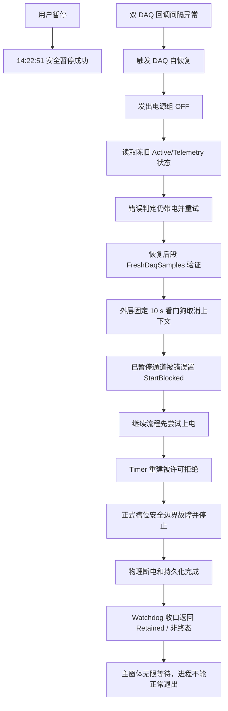

# 10358-029a V2.13.0.35 暂停后启动受阻与主程序无法关闭复发根因及彻底整改方案

> 封盘数据：`D:\EPB_Data\Backups\10358-029a_V2.13.0.35_I0003_0829_1425`  
> 试验：`10358-029a`；版本：`2.13.0.35`；现场时间：2026-08-29 14:22–14:24（北京时间）  
> 结论等级：**P0，当前版本不得以“已解决”状态继续发布或现场复用。**

## 1. 结论

本次不是“暂停命令没有执行”，也不能仅归因于 DAQ 或现场硬件。暂停在 14:22:51 已经以“全部通道已安全暂停”成功结束；之后两台 DAQ 同时出现短时回调间隔异常，触发了系统的 DAQ 自恢复路径。该路径存在两个确定的软件时序缺陷，进而造成通道被错误置为 `StartBlocked`：

1. **断电确认竞争条件**：恢复程序发出电源组 OFF 后，立即依据尚未刷新完成的 `Active/TelemetryOutputEnabled` 缓存判断“仍带电”，把“正在断电”误判成“断电失败”。本次 Dev2 的误判早于实际 OFF 回执约 4 ms，Dev1 早于实际 OFF 回执约 39 ms。
2. **恢复总超时设计错误**：外层恢复看门狗从恢复起点起固定 10 s 取消整个恢复上下文；恢复流程自身在后段又允许 `FreshDaqSamples` 使用 10 s。前面的断电竞争和重试消耗时间后，外层看门狗会在后段健康验证尚未完成时取消它，尽管现场日志同时声明的硬截止时间为 60 s。

取消后的状态机没有把“用户已成功暂停、硬件已断电、数据恢复完成”的情形保持在可继续的暂停态，而是进入 `StartBlocked` 并撤销运行许可。此后“继续试验”仍尝试恢复电源，随后创建 Timer 被运行许可拒绝，最终触发正式槽位安全边界故障。该顺序存在“先尝试上电、后发现不能恢复”的安全近失。

停止试验后，硬件断电、数据持久化边界和会话撤销均已完成；主程序不能退出的直接原因是 Watchdog 关闭协议返回“保留、未终态”，主窗体把此状态当作必须无限等待的条件。封盘中没有保存足以确定其在关闭协调器内具体卡在哪一个分支的细节，但已经足以确定：**物理安全已达成后，非关键清理失败仍永久阻止主进程退出**，这是关闭协议的设计缺陷。

## 2. 证据范围与可信边界

本报告以封盘目录的原始 `run.log`、`error.log`、`warning.log`、`ui-info.log`、DAQ 事件快照、恢复检查点、电源遥测和 Watchdog 会话文件为准。截图仅用于核对操作界面和时间顺序，未将截图中任何文字作为指令或结论来源。

`Config/runtime-build-identity.json` 显示运行程序来自 `D:\debug\2.13.0.35\MTTFTest.exe`，`releasePackageVerified=false`、`releasePackageCode=PackageManifestMissing`，且 Git commit 为 `unknown`。因此：

- 本报告可以证明该封盘运行实例的行为及日志事实；
- 仓库源码用于定位相同逻辑的设计缺陷和提出整改位置；
- 在取得现场 EXE 的可验证发布清单或精确提交前，不能声称仓库当前某次提交与现场二进制完全一致。

两台 DAQ 的共同回调间隔异常是恢复的**触发条件**，不是本报告能证明的根本物理原因。数据未见磁盘、队列或 CPU 饱和：异常前后采集队列深度为 0、最老批次年龄为 0，采集处理和重新挂臂很快完成，磁盘和内存余量充足。其底层来源仍需通过 NI 驱动/设备诊断、总线与操作系统调度事件进一步取证，不能凭本次日志给硬件定责。

## 3. 经核对的时间线

| 时间 | 已核实事件 | 结论 |
|---|---|---|
| 14:22:32.138 | UI 接收暂停命令 `d7735dd4a754420fb8c0880613e67866`。 | 用户暂停请求有效。 |
| 14:22:42.190–14:22:50.928 | Dev1/Dev2 出现 0.60–2.01 s 的未带电回调间隔；电源遥测轮询也有约 0.64–2.06 s 延迟。 | 两台 DAQ 的短时共同异常触发恢复；相关性成立，因果尚未证明。 |
| 14:22:44.474–14:22:51.507 | 当前圈完成、全断能提交；4、5、11、12 分别进入暂停，批次记录为“全部通道已安全暂停”。 | 暂停已成功，之后不应再把该批次降为不可继续状态。 |
| 14:22:52.145 / 14:22:53.117 | Dev2、Dev1 分别报告 `DaqClockModelInvalid`。 | 自恢复被触发。 |
| 14:22:52.313 / 14:22:53.206 | 恢复检查报告电源组仍带电、禁止重建。 | 此为读取到陈旧运行态的误判。 |
| 14:22:52.317 / 14:22:53.245 | 电源组 4、2 分别记录实际 OFF。 | OFF 回执分别比误判晚约 4 ms、39 ms。 |
| 14:22:53.364–14:22:54.370 | 新鲜 DAQ 样本、持久化边界与队列状态恢复正常。 | 采集数据链路已恢复；不应再触发永久启动封锁。 |
| 14:23:02.175 / 14:23:03.234 | Dev2、Dev1 被 `DaqRecoveryPipelineStalled_after_10000ms; SafeIdleOnly` 取消并置 `StartBlocked`。 | 外层 10 s 看门狗提前取消恢复，是直接的软件故障。 |
| 14:23:25.188–14:23:27.211 | 点击继续后，先出现电源组 ON，再因 `State=StartBlocked` 禁止创建 Timer；随后触发正式槽位安全边界失败。 | 继续流程缺少全通道原子预检，且上电排序错误。 |
| 14:23:46.424 以后 | 设备与数据侧停止完成；会话已撤销、物理停止已确认，但 14:24:05–14:24:23 反复记录 Watchdog 会话“未达到终态”，主窗体保持可见。 | 退出卡死发生在 Watchdog 收口协议，非硬件未断电。 |

## 4. 因果链



## 5. 根因分解

### 5.1 触发条件：共同 DAQ 回调异常，而非已证实的数据持久化瓶颈

Dev1 和 Dev2 的 `ObservedUnenergizedGap` 在暂停收口窗口内连续出现；随后分别出现 `DaqClockModelInvalid`。与此同时，事件快照显示队列无积压、采样恢复后的数据新鲜度为毫秒级，资源监控未见 CPU、内存或磁盘瓶颈。因此，数据记录层不是本次 `StartBlocked` 的直接根因。

电源遥测轮询同样变慢，说明可能存在共享调度、设备/驱动或总线层扰动；但没有足够证据把两者确定为因果。整改必须先令应用对这种短暂扰动正确降级，再通过增强诊断定位底层触发源。

### 5.2 根因一：`TryEnsureDaqRecoveryGroupDeenergized` 将“OFF 进行中”视为“仍带电失败”

当前实现位于 `Controller/EpbManager.cs` 的 `TryEnsureDaqRecoveryGroupDeenergized`。它检查运行态中的 `ExpectedOutputEnabled`、`TelemetryOutputEnabled`、`Active` 等字段，却未把同一恢复代际已提交的 `PowerDisableTasksByGroup` 与其 OFF 回执作为优先事实。

本次日志精确证明该竞争：

- Dev2 在 14:22:52.313 报“仍带电”，电源组 4 在 14:22:52.317 才得到 OFF；
- Dev1 在 14:22:53.206 报“仍带电”，电源组 2 在 14:22:53.245 才得到 OFF。

这不是保护策略应有的“拒绝恢复”，而是保护判定取了错误的一致性来源。正常策略应当把“OFF 命令已被当前恢复代际接管、尚在等待可验证回执”表示为 `PowerOffPending`，而不是直接升级为恢复失败。

### 5.3 根因二：外层 10 秒取消整个恢复，与后段 10 秒验证及 60 秒硬截止相互矛盾

`Controller/EpbManager.DaqRecoveryState.cs` 的 `StartDaqRecoveryWatchdog` 使用 `_daqPersistenceRecoveryTimeoutMs`（本次为 10,000 ms）启动无进度识别的全局 `Task.Delay`，到期后直接取消恢复。`TryCompleteDaqAutoRecoveryAsync` 后段又用同一时长等待新鲜样本。

结果是：外层时间从 14:22:52/53 开始计算，前段的错误重试消耗约 1 秒，后段刚进入 10 秒新鲜样本验证，外层即在 14:23:02/03 把其取消。现场字段日志却记录 `HardDeadlineMs=60000`，形成“显示 60 秒、实际约 10 秒全流程截止”的行为矛盾。

这一步是把已恢复的数据通道错误推进 `SafeIdleOnly/StartBlocked` 的直接原因。

### 5.4 根因三：暂停期间的恢复处置时机太晚，许可被不可逆撤销

现有恢复逻辑虽包含“暂停时保持断电”的分支，但它在恢复/验证靠后阶段才执行。由于外层看门狗先取消了上下文，系统没有到达该分支，反而把暂停会话转为 `StartBlocked`，并使数据准入抑制保持为无限上界。

对于已经拥有有效暂停所有权的批次，DAQ 健康恢复应归入“暂停保持中的健康修复”，不能删除定时器/运行器生命周期或撤销可恢复的暂停许可。`StartBlocked` 只能用于无法建立安全暂停、无法保证断电、或正式运行时需要安全终止的情形。

### 5.5 根因四：继续试验不是原子事务，存在先上电再失败的危险顺序

14:23:25 点击继续后，日志显示电源组 4、2 已尝试 `OUTP ON`，而 14:23:26 才因 `State=StartBlocked` 拒绝创建 Timer，随后升级为正式槽位安全边界失败。

任何一个通道无法重新加入正式批次时，必须在**任何电源输出开启之前**发现，并保证整个批次保持暂停和断电。当前流程把“运行许可、Timer/Runner、正式槽位和 DAQ 恢复状态”的检查放在电源使能之后，违反了恢复操作的原子性。

### 5.6 根因五：Watchdog 收口把非关键清理未完成等同于不允许主进程退出

封盘证明以下安全收口已经完成：电源输出关闭、数据持久化边界完成、会话撤销标记与关闭意图持久化、Watchdog 物理停止确认、未授权重新启动能力已撤销。`unattended-run-checkpoint.json` 也记录 `MotorOff=true`、`PressureSafe=true`、`PersistenceDrained=true`。

但 `Main_Frm.WatchdogUi.cs` 和 `WatchdogRuntime.ShutdownRetentionCoordinator.cs` 的现有协议仅在取得终态回执时释放主窗体；回执为 `RetainedShutdownInProgress` 时持续保留窗口。日志只保存了“未达到终态”和空的工作器状态，未持久化关闭阶段、实际失败操作和回执详情，故不能在本封盘中确认是墓碑写入、活动会话分离、引擎回执还是日志管线的哪一支失败。

不能因此掩盖故障：在安全状态已经独立验证完成的前提下，后台清理未完成不应让操作员只能强杀主进程。

## 6. 彻底整改方案

### 6.1 将暂停内的 DAQ 恢复建模为“保持暂停”，而不是“启动封锁”

引入由批次暂停命令唯一标识的 `PauseHolding` 恢复归属，状态转换必须满足下表。

| 原状态 | DAQ 恢复结果 | 目标状态 | 电源 | 是否保留 Timer/Runner/继续资格 |
|---|---|---|---|---|
| `Running` | 恢复成功 | `Running` | 按运行计划 | 是 |
| `PausePending` / `Paused` | 恢复或健康验证进行中 | `PauseHolding`（UI 显示“暂停，正在健康修复”） | 强制 OFF | 是 |
| `PauseHolding` | 恢复验证成功 | `Paused` | 强制 OFF | 是 |
| `PauseHolding` | 到达真实硬截止且无法确认安全 | `Paused` 或受控安全停止，附明确故障原因 | 强制 OFF | 仅在受控停止时撤销 |
| `Stopping` | 任意 | `Stopping` / 终态 | 强制 OFF | 否 |

关键规则：已完成的同一 `PauseCommandId` 不得因为后续 DAQ 维护而进入 `StartBlocked`；除非无法证明断能与安全边界，此时必须进入明确的受控停止，而不是伪装成可点击继续的状态。

### 6.2 用当前操作代际的 OFF 回执替代陈旧状态位图

将 `TryEnsureDaqRecoveryGroupDeenergized` 改为异步、代际绑定的确认操作：

1. 为每个电源组记录 `RecoveryEpoch`、`PowerOperationId`、OFF 下发时间及回执时间；
2. 若当前代际已提交 OFF，则先等待对应 `PowerDisableTasksByGroup` 完成或到达该阶段截止；
3. 回执后读取一次带时间戳的实际状态，要求状态新鲜且明确为 OFF；
4. 在等待期间返回 `PowerOffPending`，禁止建立 Timer 和恢复输出，但不得因为旧 `Active/TelemetryOutputEnabled` 直接宣布失败；
5. 若回执超时或读回仍为 ON，记录操作 ID、最后状态、遥测年龄和设备错误，再走受控安全停止路径。

缓存状态可作为诊断证据，不能覆盖本代际命令回执。这样既不放松断电保护，也消除了本次 4–39 ms 的假失败窗口。

### 6.3 统一恢复时限：一个单调硬截止 + 可观测阶段进度

取消“外层固定 10 秒取消整个恢复”的实现。每个恢复上下文应只拥有一个单调时钟的 `HardDeadlineUtc`（现场需求为 60 s），所有子阶段从该硬截止剩余时间中分配预算。

- `PowerOffPending`、数据重建、`FreshDaqSamples`、持久化边界和暂停保持分别记录阶段开始、阶段完成和进度令牌；
- 可以保留 10 s 的**单阶段无进度预警/超时**，但不得把它误当作总流程截止；有实质进度时重置无进度计时；
- 硬截止到期时按 6.1 的状态表进入暂停保持或受控停止，并写明哪个阶段、哪个设备、最后进度与剩余时间；
- 外层取消必须等待或通知正在执行的子阶段，禁止在其已合法开始的等待中盲目取消。

不得再以两个互相独立的 `Task.Delay(10000)` 控制同一恢复上下文。

### 6.4 正确关闭数据准入抑制并保留可恢复证据

DAQ 恢复期间的准入抑制可以防止陈旧批次写入，但在 `PauseHolding -> Paused` 成功后，必须通过有限边界和 `ResumeAdmission` 明确收口；不能遗留 `SuppressThrough=long.MaxValue`。

恢复记录至少持久化：恢复代际、暂停命令 ID、每设备最新样本序列、持久化边界、OFF 回执、健康验证完成时间、抑制关闭序列和最终处置。这样“继续试验”能基于可审计事实决策，而非猜测运行时缓存。

### 6.5 将“继续试验”改为全批次原子预检和补偿事务

继续命令必须串行进入一个批次恢复闸门，并严格按以下顺序执行：

1. 对所有目标通道完成预检：暂停所有权一致、状态为 `Paused`、无活动恢复上下文、DAQ 健康合格、数据准入已关闭、Timer/Runner/正式槽位可以重新加入、执行许可有效；
2. 任一通道失败时，不执行任何 `OUTP ON`，整个批次留在暂停且电源保持 OFF，并返回具体通道和不满足的谓词；
3. 所有预检都通过后，先建立所有运行对象和正式槽位，再以批次事务打开电源输出；
4. 任一后续动作失败时，立即幂等地下达所有组 OFF，撤销本次临时资源，恢复到 `Paused`，不得升级为通用“状态转换失败”；
5. 只允许预检和提交使用同一个 `PermitEpoch`；提交前再次核对 epoch，避免并发停止/恢复穿插。

正式槽位安全边界的强制停止逻辑应保留，它是最后防线；整改目标是让非法状态在上电前被阻止，而不是降低该防线。

### 6.6 为 Watchdog 引入“安全可退出、后台可续清理”的关闭契约

将关闭结果拆为安全性与清理性两个独立维度。定义：

```text
SafeExitAllowed =
    PhysicalOutputsOffConfirmed
    && PersistenceBoundaryClosed
    && SessionRevocationDurable
    && NewLaunchOrReconnectRevoked
```

当 `SafeExitAllowed=true` 时，即使 Watchdog 的日志、回执归档或后台工作器释放尚未完成，也必须：

1. 写入包含会话 ID、关闭阶段、失败原因、最后工作器回执和重试计划的持久化 `DetachedRetained` 记录；
2. 释放主窗体和 UI 资源，让主进程正常退出；
3. 由独立的最小守护方或下一次启动执行幂等清理，不得恢复输出或重新接管已撤销会话；
4. 对用户展示“设备已安全停止；后台清理待续”的明确结果，而不是无限可见的空白主窗体。

若 `SessionRevocationDurable` 或物理断电确实无法确认，则仍可阻止退出；但界面必须显示精确的失败阶段、最后异常、重试次数和操作员处置方式，且写入可导出的故障包。禁止仅以空 Worker 状态和 `RetainedShutdownInProgress` 无限等待。

### 6.7 补齐 DAQ/电源共同异常的底层诊断

为每次 `ObservedUnenergizedGap` 记录并关联：DAQ 设备时钟、回调线程 ID、调度延迟、驱动错误码、USB/PCIe/以太网事件、CPU 线程池饥饿、GC 暂停、NI 服务状态、电源遥测请求开始/结束时间。两个设备在同一窗口异常时生成单一关联 ID。

这会把“应用已安全降级”的修复与“为什么两个设备同时延迟”的根因调查分开，避免把尚未证实的现场扰动错误归咎于数据持久化或硬件。

## 7. 建议代码落点

| 责任 | 主要文件/方法 | 必须完成的改变 |
|---|---|---|
| DAQ 断电确认 | `Controller/EpbManager.cs` / `TryEnsureDaqRecoveryGroupDeenergized` | 绑定当前恢复代际和 OFF 回执，提供 `PowerOffPending`，不使用陈旧位图作失败结论。 |
| 恢复状态机与时限 | `Controller/EpbManager.DaqRecoveryState.cs` / `StartDaqRecoveryWatchdog` | 单一 60 s 硬截止、阶段进度、取消协作；移除外层盲目 10 s 全局取消。 |
| 自动恢复完成 | `Controller/EpbManager.cs` / `TryCompleteDaqAutoRecoveryAsync` | 暂停所有权优先，成功后转 `PauseHolding/Paused`，保证准入抑制有限收口。 |
| 数据准入 | `Controller/DaqPersistenceCoordinator.cs` | 恢复完成或暂停保持时调用显式 `ResumeAdmission`，记录恢复代际与序列边界。 |
| 批次继续 | `Controller/EpbManager.BatchStart.cs` 及暂停/继续命令入口 | 实现全通道预检、先建运行对象后上电、失败补偿和 epoch 二次校验。 |
| Watchdog 关闭 | `Main_Frm.WatchdogUi.cs`、`MainWatchdogUiLifecycleAdapter.cs`、`WatchdogRuntime.ShutdownRetentionCoordinator.cs` | 持久化逐阶段收据；引入 `DetachedRetained` 和 `SafeExitAllowed`，不得因后台清理悬挂永久保留主窗体。 |

## 8. 必须新增的回归与现场验收

以下用例未全部被既有“暂停/Watchdog”测试覆盖；尤其要覆盖本次精确竞态，而不是只验证正常路径。

| 编号 | 注入条件 | 断言 |
|---|---|---|
| R1 | 当前恢复代际提交 OFF 后，在 0–100 ms 内读取到旧的 `Active/Telemetry=true`，随后收到 OFF 回执。 | 状态为 `PowerOffPending`，不报告“仍带电失败”，不进入 `StartBlocked`。 |
| R2 | 已安全暂停的 4、5、11、12 通道同时发生双 DAQ `DaqClockModelInvalid`。 | UI 最多显示“暂停，正在健康修复”；全部输出 OFF；Timer/Runner 与继续资格保留。 |
| R3 | 恢复前段消耗 1–9 s，随后 `FreshDaqSamples` 需要最多 10 s，整体少于 60 s。 | 外层不得在 10 s 取消；按全局硬截止和阶段进度完成。 |
| R4 | 恢复健康验证完成时处于暂停态。 | 准入抑制被有限关闭；检查点完整；随后继续可成功。 |
| R5 | 继续前任一通道处于 `StartBlocked`、Timer 不可建或许可 epoch 变化。 | 不发生任何 `OUTP ON`；返回具体预检失败；全批次仍暂停且断电。 |
| R6 | 在“建立运行对象”后、“打开输出”前注入失败。 | 批次补偿完成、输出保持 OFF、无正式槽位安全边界升级。 |
| R7 | 分别在会话墓碑、活动会话分离、引擎回执、日志归档环节注入关闭失败。 | 未达物理安全时明确阻止并说明原因；已达 `SafeExitAllowed` 时写入 `DetachedRetained` 后主程序正常退出。 |
| R8 | 使用真实 NI 硬件和现场电源，执行至少 100 次“运行中暂停—双设备恢复扰动—继续—停止—退出”，另执行不少于 8 小时稳定运行。 | 零 `StartBlocked` 误升级、零先上电后预检失败、零需强杀进程；每轮均有可审计恢复/退出收据。 |

验收时必须保留版本清单（EXE SHA-256、配置 SHA-256、Git commit、发布包校验结果）并与封盘一同归档。未满足 R1–R7 的自动化测试和 R8 的硬件验证，不得将修复标记为“已解决”。

## 9. 当前现场处置建议

1. 当前 `2.13.0.35` 在复现“暂停后系统自恢复”时，不应继续点击“继续试验”尝试绕过 `StartBlocked`；应保持输出 OFF 并执行受控停止。
2. 若出现主窗体空白但日志已确认物理停止与会话撤销，应导出封盘、Watchdog 收据和 NI 诊断后再由现场规程处理进程；强杀只能作为现版本缺陷下的应急动作，不能作为正常作业流程。
3. 暂停发布或回归使用所有声称已修复该问题的 `2.13.0.35` 包，直至完成第 8 节验收并获得可验证发布身份。

## 10. 与既有整改记录的关系

仓库内已有 `V2.13.0.35` 的暂停—停止—Watchdog 闭环整改/验证记录。本次封盘是在相同版本号下的现场反例，说明已有验证没有覆盖“暂停完成后双 DAQ 异常、OFF 回执与缓存状态竞争、外层总超时取消后段验证、Watchdog 非终态退出”这一组合时序。

后续整改应以本报告的 R1–R8 为发布门禁，不应仅以正常路径或单一模块测试通过来宣称问题闭环。

后续版本的实际实现、自动化结果与待完成现场验收见：[V2.13.0.36 实施及验收记录](./2026-08-29_V2.13.0.36_暂停后DAQ恢复启动受阻与Watchdog退出彻底修复实施及验收.md)。本补充不改写上述封盘事实。

## 11. 关键原始证据索引

- `Config/runtime-build-identity.json`：运行身份、调试目录、发布包未验证状态；
- `log/run.log`：暂停成功、DAQ 间隔异常、恢复阶段、10 s 取消、继续/停止状态转换；
- `log/error.log`：两设备时钟模型异常、恢复中“仍带电”误判、`StartBlocked`；
- `log/warning.log`：Watchdog 会话未终态并保留主窗体；
- `log/ui-info.log`：用户命令与界面状态时序；
- `IncidentSnapshots/` 内 DAQ 事件与时序快照：队列、样本新鲜度和回调间隔；
- `PowerSupplyTelemetry/`：电源组 2、4 的 OFF 实际回执时间；
- `Recovery/unattended-run-checkpoint.json`：停止后 `MotorOff`、`PressureSafe`、`PersistenceDrained`；
- `WatchdogSessions/`：物理停止确认、会话撤销与关闭保留状态。
