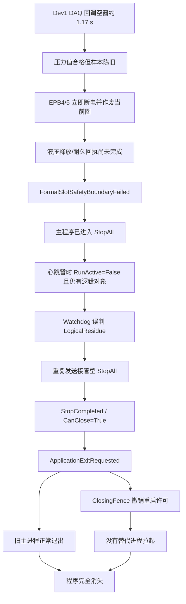

# 10243-028 V2.13.0.40 运行中程序完全退出根因分析及彻底解决方案

- 分析日期：2026-08-30
- 事故版本：V2.13.0.40
- 事故数据：`D:\EPB_Data\Backups\10243-028_V2.13.0.40_I0004_0830_2040`
- Watchdog Session：`dfe18211f4a04fada5e084a1fbb11cd6`
- 主进程：PID `22052`
- Sidecar：PID `9676`
- 试验 RunId：`cddd5198f1774f0f8b6310fbb95326c9`
- 时间口径：正文使用现场本地时间 UTC+8；Watchdog JSON/JSONL 的 UTC 时间已换算为本地时间
- 结论状态：软件退出链已确认；DAQ 回调空窗的设备/驱动级根因尚未唯一确认

## 1. 技术结论

### 1.1 最简短答案

**这次不是程序崩溃、Windows 杀进程、操作员关闭，也不是内存耗尽。主程序是在 Watchdog 的错误接管链中收到明确退出请求后自行退出；随后本应负责重启的恢复许可又被通用关闭围栏撤销，因此旧进程退出后没有新进程接替，最终表现为“程序完全退出”。**

完整故障链由五层组成：

1. 20:30:47 起，Dev1 出现约 `1.17 s` 的 DAQ 回调空窗；随后 Dev2 也出现约 `458 ms` 的共同空窗。
2. Dev1 液压压力实测仍为 `69.589 bar`，高于最低 `60 bar`，但样本已陈旧 `1124.3 ms`。软件正确执行断电保护，却在液压释放回执和本圈耐久作废回执尚未完成时，把 EPB4/5 判成 `FormalSlotSafetyBoundaryFailed`，立即升级为全局 StopAll。
3. 主程序已经处于 StopAll 收口窗口，心跳必然短暂呈现 `RunActive=False` 且仍有 Timer/Runner/CTS 等待摘除。Watchdog 的 `logicalResidue` 修复分支没有排除 `StopAllActive`，把正常的收口中间态再次误判为控制残留，又发送了一次接管型 StopAll。
4. 接管型 StopAll 在 20:30:56 返回 `CanClose=True` 后，主程序明确写入 `ApplicationExitRequested`，开始释放窗口和进程退出；这不是未处理异常。
5. `ApplicationExitRequested` 和 `ClosingFenceObserved` 又被 Sidecar 当成普通人工关闭处理：设置 `ManualStopRequested`、取消自动接管并撤销已生成的重启许可。于是旧进程退出后，Watchdog 被自己的关闭围栏禁止拉起替代进程。

此外，主进程退出后的安全交接 Worker 连续 5 次错误选择项目 `Config` 目录，并因缺少 `AOConfig.xml` 失败。该缺陷不是最初退出触发器，但使安全交接一直没有达到 `Completed`，进一步暴露了退出/恢复链不完整。

### 1.2 结论置信度

| 结论 | 置信度 | 依据 |
| --- | --- | --- |
| 主进程不是 CLR 崩溃或强杀，而是按软件请求自行退出 | 确定 | `ApplicationExitRequested`、`GracefulCompleted`、`MainProcessExitedBeforeDeadline`；`ProcessTerminationRequested=False` |
| 直接退出命令来自 Watchdog 接管型 StopAll 完成后的 UI 退出路径 | 确定 | Client 事件 8～10、Sidecar 事件 150～152、`WatchdogStopAllCompleted:<correlation>` |
| 完全不重启是重启许可被通用关闭语义撤销 | 确定 | `relaunch.json State=Revoked`、`DetailCode=ClosingFenceObserved`；源码明确取消接管、设置人工停止并 Revoke |
| Watchdog 对正在执行的 StopAll 产生了 `LogicalResidue` 误修复 | 高 | Controller 已在 20:30:48.928～49.260 进入全局停止；20:30:49 Watchdog 又记录 `ResponsiveApplicationControlRepairRequested/LogicalResidue`；源码修复分支未排除 `stopActive` |
| 业务触发起点是 DAQ 回调空窗，而不是真实低压 | 高 | Dev1 回调间隔、样本年龄以及 `69.589 bar > 60 bar` 的对照证据一致 |
| DAQ 空窗具体由 NI 设备、驱动、总线、GC、锁或 OS 调度哪一项造成 | 未确定 | 封存缺少 NI 驱动事件、ETW/GC/线程池、Windows 系统事件和空窗瞬间转储 |
| 主 Raw/SQLite 已接收前缀在退出前完成收口 | 高 | 两设备 `STOP_PERSISTENCE` 均为 Closed、Depth/InFlight=0，封存清单验证通过；仍应把未完成的 1377 圈视为作废圈 |

## 2. 故障关系图



这张图中，A 是现场扰动；E、H、M 是三个需要分别修复的软件放大点。只修 DAQ 或只修退出界面都不能形成完整闭环。

## 3. 证据范围与边界

### 3.1 已核对证据

- `backup-manifest.json`：schema 4，项目 `10243-028`，版本 `V2.13.0.40`，EXE 文件版本 `2.13.0.40`，增量快照序号 4，`snapshot_verified=True`，367 个文件，抓取时间 20:40:38。
- `log/run.log`、`warning.log`、`error.log`、`ui-info.log`。
- `WatchdogSessions/session-dfe18211f4a04fada5e084a1fbb11cd6.*` 全套会话、Client/Sidecar 事件、关闭墓碑、应用退出回执、安全交接回执和 Worker 日志。
- `Recovery/unattended-run-checkpoint.json` 及审计日志。
- `Latest/`、`HistoricalSnapshots/` 的末尾周期文件。
- V2.13.0.40 对应提交 `2410507` 及当前 V2.13.0.41 源码。

### 3.2 数据限制

1. 本目录是增量快照，不应脱离基础备份把“本增量没有某文件”解释为历史上从未存在。
2. 本次没有 PID 22052 在 20:30:47～20:30:49 空窗瞬间的托管转储，也没有 Windows 事件日志、NI-DAQmx 诊断或 ETW，因此不能唯一归因 DAQ 底层空窗。
3. Watchdog JSONL 使用 UTC，日志使用本地时间；本报告已统一换算。
4. `RecoveryFailureCode=UnhandledSoftwareStartup` 是退出后恢复状态机生成并随后被 `Superseded` 的分类字段，不是 CLR 未处理启动异常的证据。真正的退出请求、关闭围栏和进程终态另有完整事件链。

## 4. 关键时间线

| 本地时间 | 事件 | 技术判断 |
| --- | --- | --- |
| 18:05:46 | PID 22052 与 Sidecar 建立会话 | 本次会话正常开始，持续运行约 2 小时 25 分钟 |
| 20:30:42～46 | CPU、内存、磁盘和 DAQ 队列均无明显资源耗尽 | PID 22052 为 32 位；工作集约 226～243 MiB，系统可用内存约 11.8 GiB，磁盘队列 0，采集/持久化队列为 0 |
| 20:30:47.877～.878 | Dev1 EPB5/4 的 DAQ 样本年龄约 `264 ms`，超过 `250 ms` 保护门槛 | 立即执行 MotorOff 并作废当前圈，保护动作合理，不应取消 |
| 20:30:48.743 | 液压组 1 报 `HydraulicSampleStale`；实测 `69.589 bar`，最低 `60 bar`，年龄 `1124.3 ms` | 不是确认低压，而是压力证据过期 |
| 20:30:48.919～.920 | EPB4/5 的软件自愈断电确认链报错；槽 579 记录 `MotorOff=True HydraulicReleased=False Persistence=False` | 电机已关；液压释放和耐久作废尚未在这一瞬间闭合 |
| 20:30:48.928 | EPB4/5 进入 `FormalSlotSafetyBoundaryFailed`，全局上电授权被撤销 | 主程序自己的 StopAll 已经开始 |
| 20:30:49.019 | 液压组 1 因陈旧样本进入自愈，首次断电确认失败 | 同一 DAQ 事件被液压、正式槽和电源联锁多层放大 |
| 20:30:49.258 | Dev1/Dev2 同时出现约 `458 ms` 的回调陈旧；Dev1 记录完整间隔 `1171.4 ms` | 此时已从 Dev1 单链路演变为共同执行空窗，但底层来源未唯一确认 |
| 20:30:49.260～.319 | 全局 StopAll 摘除运行对象、重复 OFF；部分迟到高优先级 OFF 返回 False，但已有 DO_OFF 成功回执 | 重复 OFF 的返回值不能覆盖已存在的物理 OFF 事实 |
| 20:30:49 | Sidecar 事件 150：`ResponsiveApplicationControlRepairRequested / LogicalResidue` | Watchdog 把 StopAll 中间态再次当成控制残留，发出第二个接管型 StopAll |
| 20:30:49.365～50.023 | 两组液压 DO/AO 归零；压力分别达到安全阈值 | 最初缺失的液压安全事实约 0.6～1.1 秒后即闭合 |
| 20:30:50.072 | 首次 StopAll 的 Dev1/Dev2 持久化边界均闭合 | `Depth=0`、`InFlight=0`、`Closed=True` |
| 20:30:56 | Sidecar 事件 151、Client 事件 9：接管 StopAll 返回 `CanClose=True` | Watchdog 开始旧进程退出/替代流程 |
| 20:30:56.818 | Client 事件 10：`ApplicationExitRequested`，原因 `WatchdogStopAllCompleted:eae...` | 主进程明确进入退出流程，30 秒硬截止被安装 |
| 20:30:56.931 | Client 事件 12：`WatchdogClosingTombstone / ApplicationClosing` | 通用关闭围栏开始与恢复许可冲突 |
| 20:30:57 | Sidecar 事件 153：`ClosingFenceObserved` | `relaunch.json` 最终为 `Revoked/ClosingFenceObserved`，自动恢复被封死 |
| 20:31:02.418 | Client 记录 ACK 超时并关闭传输 | 此时状态已是 Closing，不再重连 |
| 20:31:07.461 | 第二次关闭收口的 Dev1/Dev2 持久化边界再次闭合 | 两路均无丢弃、无队列积压 |
| 20:31:10.810 | 主程序请求安全交接 | 物理/数据事实已确认，但 `LogicalQuiescent=False` |
| 20:31:11.101 | `GracefulCompleted / MainAndChildWindowsReleased` | UI 和子窗口正常释放，不是崩溃 |
| 20:31:11～23 | 安全 Worker 连续 5 次启动，均因项目 Config 缺 `AOConfig.xml` 失败 | 安全交接停在 `WorkerStarted`，没有到 `Completed` |
| 20:31:26 前 | `application-exit.json Detail=MainProcessExitedBeforeDeadline` | 主进程在 30 秒硬截止前自行消失；未请求精确 PID 强杀 |

## 5. 根因分层

### 5.1 触发事件：DAQ 回调空窗

Dev1 在事故前已累计 11 次 callback gap，最近一次完整大空窗为 `1173.411 ms`。事故窗口首先由 Dev1 触发：

- 20:30:47.877，CallbackAge 约 `264 ms`；
- 20:30:48.743，压力样本年龄 `1124.3 ms`；
- 20:30:49.258，记录 GapInterval `1171.4 ms`。

20:30:49.258 时 Dev2 也出现约 `458 ms` 陈旧，电源遥测出现约 `534～568 ms` 的慢响应。这说明事故后半段存在共同执行停顿，但不能据此武断指定是 GC、线程锁、NI 驱动还是 OS 调度。

保护策略本身必须保留：带电期间 DAQ 超过 250 ms 不新鲜时应立即断电。需要修复的是异常后的状态归并和恢复，而不是放宽保护门槛。

### 5.2 放大点一：安全事实尚在闭合就被定性为全局失败

EPB4/5 的首个物理 OFF 命令在 20:30:47.878～.879 已成功，耗时约 `0.9～1.5 ms`。但液压释放和当前圈耐久作废需要稍后才能获得新鲜压力与持久化回执。V2.13.0.40 在 20:30:48.920 看到：

```text
MotorOff=True HydraulicReleased=False Persistence=False
```

便立即发布 `FormalSlotSafetyBoundaryFailed`。实际约 0.6～1.1 秒后，两组压力安全和持久化边界均已闭合。这里缺少“安全闭合进行中”的中间态，导致暂时缺回执被等价成不可恢复的 `SafetyUnproven`。

同时，液压层、正式槽层、通道自愈层和电源失效安全层各自对同一个 DAQ gap 创建停止/恢复动作，造成重复 OFF 和状态竞争。部分迟到 OFF 返回 `False`，又被解释为“无法确认断电”，尽管更早的物理 OFF 回执已经为 True。

### 5.3 放大点二：Watchdog 在 StopAll 期间误报 LogicalResidue

当前源码的判定顺序仍显示这一缺陷：

- [`WatchdogHost.cs`](../../MTTFTest.Watchdog/WatchdogHost.cs#L2010) 根据 `RunActive=False` 且 Timer/Runner/CTS 等非零计算 `logicalResidue`；
- [`WatchdogHost.cs`](../../MTTFTest.Watchdog/WatchdogHost.cs#L2072) 直接把它纳入 `responsiveControlFault`；
- 到 [`WatchdogHost.cs`](../../MTTFTest.Watchdog/WatchdogHost.cs#L2152) 才计算 `stopActive`，因此它只保护后面的强接管策略，不能阻止前面的“响应式控制修复”再次发 StopAll。

StopAll 本来就是一个逐阶段清除 Timer、Runner、CTS、液压租约和持久化边界的过程。`RunActive=False + 逻辑对象尚未清零` 在其期限内是合法中间态，不应再由第二个 owner 发起修复。

### 5.4 直接退出点：接管型 StopAll 无条件进入旧进程退出

[`WinFormsWatchdogStopHandlerCore.cs`](../../MTTfTest/WinFormsWatchdogStopHandlerCore.cs#L88) 在接管 StopAll 完成后调用：

```text
RequestWatchdogOwnedExit("WatchdogStopAllCompleted:<correlation>", WatchdogTakeoverExit)
```

[`Main_Frm.WatchdogUi.cs`](../../MTTfTest/Main_Frm.WatchdogUi.cs#L216) 又在区分 `shutdownIntent` 之前无条件安装通用 Application Exit Deadline。因此这次退出是明确、可审计的软件动作，不是进程突然消失。

### 5.5 完全不重启：TakeoverExit 与普通 ApplicationExit 被错误合流

正确业务语义应当是：

```text
Watchdog 接管 StopAll
  -> 旧进程退出
  -> Sidecar 保留唯一恢复许可
  -> 拉起新进程
  -> 新进程验证 checkpoint 后恢复
```

V2.13.0.40 实际语义却是：

1. `StopCompleted` 先进入 `BeginRelaunchAfterExit`，生成一次恢复许可；
2. 紧接着通用 `ApplicationExitRequested` 被 Sidecar 的 [`ObserveApplicationExitIntent`](../../MTTFTest.Watchdog/WatchdogHost.cs#L4249) 读取；
3. [`WatchdogHost.cs`](../../MTTFTest.Watchdog/WatchdogHost.cs#L4293) 执行 `CancelAutomaticTakeover("ApplicationExitRequested")`，并把 `ManualStopRequested` 置为 True；
4. 通用关闭墓碑又进入 [`ObserveClosingFence`](../../MTTFTest.Watchdog/WatchdogHost.cs#L4646)；
5. [`WatchdogHost.cs`](../../MTTFTest.Watchdog/WatchdogHost.cs#L4657) 执行 `_relaunchCoordinator.Revoke("ClosingFenceObserved")`。

最终 `relaunch.json` 明确为：

```text
State=Revoked
DetailCode=ClosingFenceObserved
LaunchConsumed=False
```

这就是“进程退出了但没有自动拉起”的直接根因。仅延长等待时间、增加重启次数或修改 DAQ 阈值都无法修复这个语义冲突。

### 5.6 退出后安全 Worker 的配置选择缺陷

安全 Worker 当前只判断项目 Config 目录是否存在：

- [`WatchdogSafetyShutdownWorker.cs`](../../MTTfTest/WatchdogSafetyShutdownWorker.cs#L60) 只要 `ProjectDirectory\Config` 存在就选它；
- [`WatchdogSafetyShutdownWorker.cs`](../../MTTfTest/WatchdogSafetyShutdownWorker.cs#L66) 随后要求同一目录同时包含 AO/DO/Test 等完整运行配置。

事故现场项目 Config 目录存在，但其中没有 `AOConfig.xml`；硬件基础配置实际属于程序发布目录。Worker 因此连续 5 次得到同一 `FileNotFoundException`，而不是回退到有效的程序配置目录。

这暴露出更深的模型问题：项目业务配置与发布包硬件配置来源不同，却被压成了一个 `configDirectory`。Worker 应消费主进程已经验证并耐久封存的精确配置快照，而不是退出后重新猜目录。

## 6. 可以排除的解释

### 6.1 不是未处理异常崩溃

- 没有 `AppDomain.UnhandledException`、CLR fatal 或异常终止栈。
- Client 明确记录 `ApplicationExitRequested`。
- UI 明确记录 `GracefulCompleted / MainAndChildWindowsReleased`。
- 应用退出回执为 `MainProcessExitedBeforeDeadline`，`ProcessTerminationRequested=False`。

`error.log` 中的异常是 Controller 已捕获并参与安全状态机的业务/控制异常，不能等同于进程未处理异常。

### 6.2 不是操作员主动关闭

事故链开始时 Client 事件和心跳均为 `ManualStopRequested=False`，没有 `TransitionWindowButton`、人工停止或窗体关闭事件。最终 Journal 中的 `ManualStopRequested=True` 是 `ApplicationExitRequested/ClosingFenceObserved` 代码路径自己设置的状态，不是人工点击证据。

### 6.3 不是物理电源、液压未关闭

最终关闭墓碑和退出回执均记录：

- `MotorsOff=True`
- `PowerOff=True`
- `PressureSafe=True`
- `PersistenceDrained=True`
- `DataContinuityVerified=True`

问题是控制/退出语义，不是设备未能断能。

### 6.4 不是内存、CPU 或磁盘耗尽

事故前主进程工作集约 226～243 MiB，系统可用内存约 11.8 GiB；进程 CPU 和系统 CPU 均无持续满载，磁盘队列为 0，DAQ 与持久化队列也为 0。现有证据不支持资源耗尽退出。

## 7. 数据与恢复状态

### 7.1 已确认的安全/耐久事实

20:31:07.461 的最终回执：

| 设备 | Boundary/FinalBoundary | Published/Persisted | Depth/InFlight | 状态 |
| --- | ---: | ---: | ---: | --- |
| Dev1 | `871918/871918` | `871918/871918` | `0/0` | `Recovered, Closed=True` |
| Dev2 | `871365/871365` | `871365/871365` | `0/0` | `Recovered, Closed=True` |

两路均为 `Discarded=0`、`OverCapacityDropped=0`。封存 manifest 也通过快照验证。因此，当前证据不显示已接收 DAQ 前缀因这次退出丢失。

### 7.2 当前圈处理原则

事故时 EPB4/5/9/11/12 的 1377 圈处于故障/作废窗口，`Latest` 中可见部分通道的短 CSV。该圈不能计入正式完成数；恢复时应以 SQLite/耐久 closure receipt 为准，不得以“存在 CSV 文件”推断圈已完成。

### 7.3 Checkpoint 仍具备恢复意图

最终 checkpoint 为：

```text
Armed=true
RestartPending=true
RootRunId=cddd5198f1774f0f8b6310fbb95326c9
LastReason=WatchdogTakeoverHandoffPrepared
MotorOffConfirmed=true
PressureSafeConfirmed=true
PersistenceDrained=true
```

这说明业务恢复意图和剩余圈数已耐久保存。没有自动恢复不是因为 checkpoint 被取消，而是 Sidecar 的 relaunch permit 被关闭围栏撤销。重新运行前仍需执行配置哈希、数据库边界、未完成圈作废和硬件全 OFF 预检。

## 8. 现有 V2.13.0.41 能解决什么、还缺什么

V2.13.0.41 已完成以下有价值的上游整改：

- 同权威恢复进程重连不再重复消费一次性许可；
- 恢复提示的关闭与“退出软件”拆分；
- `FreezeActiveWork` 的 Timer/CTS 用户回调移出 2 秒硬阶段；
- 正式槽开始用 durable receipt 区分 `SafeAborted` 和 `SafetyUnproven`。

但对本次 V2.13.0.40 I0004 事故，**当前 V2.13.0.41 源码仍保留三个未闭环点**：

1. `responsiveControlFault` 仍未排除 `StopAllActive`；
2. `ApplicationExitRequested` 和 `ClosingFenceObserved` 仍会取消 takeover/relaunch；
3. Safety Worker 仍只按目录是否存在选择项目 Config，未校验完整配置集。

因此不能把“升级到 V2.13.0.41”单独写成完美解决方案。建议形成后续 P0 修复版本，并完成第 11 节的真实双进程验收后再放行无人值守运行。

## 9. 彻底解决方案

### 9.1 P0-1：StopAll 只能有一个监督 owner

在 `WatchdogHost` 中把 `stopActive` 的计算提前，并建立以下不变量：

```text
StopAllActive 或 StopTakeoverRequired 或 StopTimedOut
    => 禁止 ResponsiveApplicationControlRepair 再发送 RequestStopAll
    => 只允许 StopSafetySupervisor 按同一 TransactionId 观察阶段、进度和截止
```

具体要求：

1. `responsiveControlFault` 必须包含 `!stopActive`。
2. StopAll 期间的 Timer/Runner/CTS 非零是阶段状态，由 Stop 事务自己的 `Stage/ProgressVersion/LastMaterialProgressUtc` 判定，不复用 idle `logicalResidue` 规则。
3. 所有 `RequestStopAll` 携带并校验唯一 `StopSafetyTransactionId`；相同事务重复请求只能 Join，不能创建第二个退出 owner。
4. StopAll 完成后先观察一条终态心跳，再恢复 idle residue 规则，避免末尾迟到快照触发二次修复。
5. 增加审计事件 `ResponsiveControlRepairSuppressedDuringStop`，记录被抑制原因和事务身份。

### 9.2 P0-2：应用退出意图必须强类型区分“人工关闭”和“接管替换”

将 `WatchdogApplicationExitReceipt` 升级为兼容 schema，至少新增：

```text
ExitDisposition = OperatorExit | NormalCompletionExit | WatchdogTakeoverReplacement
RelaunchDisposition = Forbidden | PreserveApprovedPermit
ApprovedPermitGeneration
TakeoverCorrelationId
```

事务顺序必须固定为：

```text
StopCompleted
  -> Sidecar 原子批准唯一 relaunch permit
  -> 耐久写 TakeoverReplacement exit intent，绑定 Session/PID/Start/PermitGeneration
  -> 主进程安装 30 秒精确 PID 退出截止
  -> 旧进程退出
  -> Sidecar 消费同一个 permit
  -> 拉起新进程
  -> Attached -> checkpoint validation -> Committed
```

安全要求：

1. `WatchdogTakeoverReplacement` 不得设置 `ManualStopRequested`，不得调用 `CancelAutomaticTakeover`，不得用普通 `ClosingFence` 撤销已批准 permit。
2. 接管退出仍保留 25 秒诊断和 30 秒精确 PID 截止，不能为了恢复而取消有界退出。
3. 普通人工关闭、正式完成退出和操作员停止恢复仍必须 `RelaunchDisposition=Forbidden`，保持禁止重启。
4. 关闭墓碑也必须强类型：`OperatorCloseFence` 与 `TakeoverReplacementFence` 分开；后者只阻止重复 permit，不撤销绑定的唯一 permit。
5. Sidecar 必须先耐久确认 exit intent 和 permit 的一致身份，再允许主窗口销毁。
6. 旧进程退出观察、permit 消费、新进程 Attach 需要使用 PID、StartUtcTicks、Session、Generation、Lease、PermitId/Nonce 全字段防 ABA。

不能用“如果 Reason 字符串以 `WatchdogStopAllCompleted` 开头就不撤销”作为最终修复；必须有强类型协议字段和状态转换验证。

### 9.3 P0-3：Safety Worker 使用不可变、已验证的配置快照

主进程在接受安全交接前，应封存最小安全配置集：

- 发布包硬件配置：AO、DO、AI、程控电源；
- 项目配置：TestConfig、液压参数和分组映射；
- 每个文件的绝对来源、SHA-256、长度和最后写入版本；
- 配置快照整体哈希与 Runtime Build Identity。

Worker 只消费该快照，不在主进程退出后猜测目录。建议写入：

```text
WatchdogSessions/safety-handoff-<HandoffId>/ConfigSnapshot/
```

要求：

1. Handoff receipt 增加 `ConfigSnapshotPath/ConfigSnapshotSha256`。
2. Sidecar 在标记 `Accepted` 前回读并验证完整文件集。
3. 缺文件时返回强类型 `SafetyConfigSnapshotIncomplete`，列出缺失文件；相同指纹不做 5 次无意义重试。
4. Worker 完成后写 `Completed`，并记录每项 DO/AO/电源/压力回执。
5. 项目目录和发布目录均不得在交接完成前被归档、删除或替换。

### 9.4 P0-4：把“安全闭合进行中”建模为一等状态

Controller 的正式槽应至少有四态：

```text
SafeCommitted
SafeAborted
PendingSafetyClosure
SafetyUnproven
```

对于本次 `MotorOff=True / HydraulicReleased=False / Persistence=False`：

1. 立即保持全通道撤权和输出 OFF；
2. 进入 `PendingSafetyClosure`，在既有液压释放/持久化安全截止内等待共享回执；
3. 压力安全和 durable abort 成功后转 `SafeAborted`，不计圈、不触发全局退出；
4. 只有截止到期、OFF 命令真实失败、压力无法证明或作废记录无法耐久化，才转 `SafetyUnproven` 并进入全局 StopAll。

重复 OFF 必须幂等：若已有同一执行代次的成功物理 OFF 回执，后续因队列关闭或授权撤销而返回 False 的重复命令不得覆盖成功事实，应返回 `AlreadyOffConfirmed`。

### 9.5 P1：补齐 DAQ 空窗的底层取证

保持 250 ms 安全门槛不变，增加低开销环形诊断：

1. Dev1/Dev2 每次 NI callback 的入口、`EndRead`、re-arm、线程 ID、native status、单调时钟和批次序号。
2. .NET GC pause、线程池 pending/available worker、进程线程数、CPU ready、关键锁等待和 UI dispatcher latency。
3. NI-DAQmx 设备状态、总线重置/断连、驱动错误码和设备 generation。
4. Windows Application/System 事件、USB/PCIe/网卡/电源管理事件。
5. 空窗超过 250 ms 时立即冻结最近 30～60 秒环形证据，并在 1 秒内抓取轻量线程栈；不要等 15 秒后才抓 dump。
6. 使用统一 `IncidentId` 让 DAQ、液压、正式槽、电源和 Watchdog 只引用同一个事件，不各自建立恢复 owner。

## 10. 必须保持的系统不变量

| 编号 | 不变量 |
| --- | --- |
| I1 | `StopAllActive=True` 时禁止 generic `LogicalResidue` 再发 StopAll |
| I2 | Watchdog takeover replacement exit 不能设置人工停止语义 |
| I3 | Takeover exit 的 30 秒退出截止与自动 relaunch 必须同时成立，而不是二选一 |
| I4 | 每次接管只能有一个耐久 permit；旧进程退出后只能消费一次 |
| I5 | 普通人工关闭永远禁止 relaunch，接管替换永远不能被普通 ClosingFence 误撤销 |
| I6 | Safety Worker 只能使用已验证配置快照，不能猜项目/程序目录 |
| I7 | DAQ 陈旧立即断电，但已安全作废的圈不能升级为无条件进程退出 |
| I8 | 任何迟到任务都不能重新上电，不能操作下一事务的新 Timer/Runner/CTS |
| I9 | 未完成圈不计数；恢复以 durable DB/receipt 为唯一事实源 |

## 11. 自动化与现场验收

### 11.1 必须新增的自动化测试

| 场景 | 注入 | 通过标准 |
| --- | --- | --- |
| StopAll 中出现逻辑对象 | `RunActive=False`、`StopAllActive=True`、Timer/Runner 非零 | 不产生 `ResponsiveApplicationControlRepairRequested`；只由原 Stop 事务推进 |
| StopAll 末尾迟到心跳 | 终态前后交错旧/新 snapshot | 不创建第二个 StopAll；终态后只接受新鲜代次 |
| 接管退出正常替换 | StopCompleted 后旧进程正常退出 | permit 保留并只消费一次；新进程成功 Attach/Committed |
| 接管退出卡死 | 旧进程超过 30 秒不退出 | 只终止精确 PID/Start；随后仍使用同一 permit 拉起 |
| 人工关闭 | 操作员退出 | relaunch 永久禁止，不得误拉起 |
| ClosingFence/exit intent 乱序 | 消息、文件观察顺序随机化 | 最终语义由强类型 disposition 决定，不受到达顺序影响 |
| Safety Worker 配置 | 项目 Config 存在但缺 AO/DO；发布 Config 完整 | 使用已封存快照完成，不因目录存在性选错 |
| Safety Worker 配置损坏 | 缺文件或哈希不符 | fail-closed、单一明确终态、无重复启动风暴 |
| DAQ 1.2 秒空窗 | Dev1 单独空窗 | 立即 OFF；bounded closure 后 `SafeAborted`；不退出进程 |
| 双 DAQ 0.5～2 秒空窗 | Dev1/Dev2 同时阻塞 | 单一 Incident/owner；物理 OFF；无重复 StopAll |
| 液压回执迟到 | OFF 成功后压力样本 1 秒后恢复 | `PendingSafetyClosure -> SafeAborted`，不提前 `SafetyUnproven` |
| 重复 OFF 迟到失败 | 首次 OFF=True，后续重复命令=False | 成功事实不回退；结果为 `AlreadyOffConfirmed` |

真实双进程场景需要连续至少 100 轮执行：

```text
启动 -> 正式运行 -> 注入 DAQ 空窗 -> Stop/安全作废 ->
接管退出 -> 旧进程消失 -> 新进程 Attach -> checkpoint 恢复
```

每轮必须验证无双进程、无双 permit、无重复计数、无上电回跳、无 `ClosingFenceObserved` 误撤权。

### 11.2 软件验收门禁

- Debug x86 和 Release Any CPU 全解决方案构建通过。
- `AdaptiveControlTests`、`EpbDiskWriterTests`、`PowerSupplyDebugger.Tests` 全量通过。
- 新增 StopAll 单 owner、typed exit、relaunch permit、Safety Worker 配置快照四组专项测试。
- 对 Watchdog protocol schema 的旧版本记录做向后兼容读取测试。
- `git diff --check` 通过，版本身份统一，发布包工作区干净。

### 11.3 现场验收门禁

1. 在 NI、CAN、液压和程控电源齐全的现场环境执行不少于 24 小时耐久，建议 48 小时。
2. 分别注入至少 10 次 Dev1 单设备空窗、10 次双设备共同空窗、10 次命名管道断开、5 次旧进程退出卡死。
3. 运行态和 StopAll 各阶段都要覆盖，不得只测 idle。
4. 每次接管替换必须出现：

```text
StopCompleted
TakeoverExitIntentCommitted
OldProcessExited（或 ExactOldProcessTerminated）
RelaunchPermitConsumed
RecoveryProcessStarted
Attached
Committed
```

5. 以下事件必须为 0：

```text
ResponsiveApplicationControlRepairRequested while StopAllActive
ClosingFenceObserved revoking takeover permit
SafetyWorker FileNotFoundException
DuplicateRelaunchPermit
DuplicateFormalCompletion
UnexpectedProcessExitWithoutReplacement
```

6. 对每次注入核对物理输出、压力、持久化边界、SQLite 正式计数和 checkpoint 剩余圈数。

## 12. 修复版本发布前的临时措施

1. V2.13.0.40 不适合继续无人值守运行；当前 V2.13.0.41 也不能仅凭既有软件测试宣称已闭合本次“完全退出”链。
2. 若必须短时运行，现场需有人值守，并准备独立确认 DO、程控电源和液压压力的手段。
3. 不要调大或关闭 DAQ 250 ms 保护门槛；这会降低安全性，但无法修复 Watchdog 误退出和恢复许可撤销。
4. 发生完整退出后，先确认全部输出 OFF、压力安全、Safety Worker/Watchdog 状态和数据库边界，再启动恢复；不要手工修改正式完成圈数。
5. 恢复前校验发布包与 checkpoint 的 BuildVersion/ExecutableSha256/ConfigurationSha256，确认未使用 DIRTY 或未批准包。
6. 保留完整基础备份与增量链，不能只保留 I0004 增量目录。

## 13. 后续仍需回答的问题

1. Dev1 为什么反复出现约 1.17 秒回调空窗：NI 设备/总线、驱动、进程调度、GC 还是锁竞争？
2. 为什么后半段 Dev2 和电源遥测也出现共同延迟？是否存在全局调度暂停？
3. 项目 Config 与发布 Config 的权威边界应如何定义，哪些配置必须进入不可变安全快照？
4. 在真实厂商 SDK 阻塞下，typed takeover exit 能否同时满足 30 秒旧进程截止和一次性新进程恢复？

这些问题不会改变本报告对“为什么完全退出”的判断，但会影响长期稳定性和现场恢复成功率。

## 14. 最终判定

本次 V2.13.0.40 完全退出是一个确定的软件状态机/协议事故：

- DAQ 回调空窗触发了必要的断电保护；
- 未完成的液压/耐久回执被过早放大为全局 StopAll；
- Watchdog 又把 StopAll 中间态误判为 `LogicalResidue`，发起接管型重复 StopAll；
- 接管完成后主程序按设计自行退出；
- 通用 `ApplicationExitRequested/ClosingFence` 错误撤销接管恢复许可，导致没有新进程拉起；
- 安全 Worker 又因配置目录模型错误无法完成交接。

因此，完美解决不能只做“升级版本”“增加重试”或“放宽 DAQ 阈值”。必须同时修复 StopAll 单 owner、强类型退出/恢复协议、不可变安全配置快照和安全闭合中间态，并用真实双进程故障注入证明：**DAQ 可以再次抖动，设备必须立即安全，但程序不能再无替代地完全退出。**
