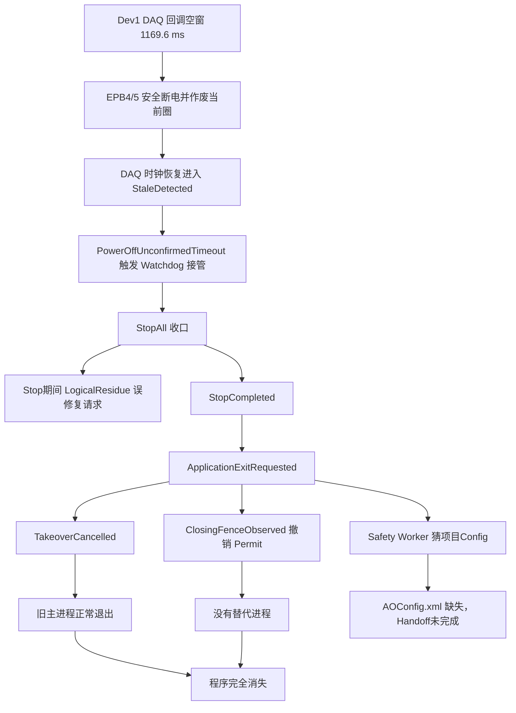

# 10243-028 V2.13.0.41 I0005 程序自行退出同源性、版本回溯及 V2.13.0.42 解决性分析

- 分析日期：2026-08-30
- 事故版本：`V2.13.0.41`
- 事故封存：`D:\EPB_Data\Backups\10243-028_V2.13.0.41_I0005_0830_2312`
- 事故 Watchdog Session：`a4787e1e270c420fb256f12f92729c36`
- 主进程：PID `8324`，启动时间身份 `639236913463027143`
- Sidecar：PID `20696`，启动时间身份 `639236913658321925`
- 试验 RunId：`4d3799998a3b40779b881dd5cbdbccf7`
- 现场 EXE：`D:\debug\2.13.0.41\MTTFTest.exe`
- 现场 EXE SHA-256：`9d0a550a041d37a771e351ec0a741c116219ff5e339f5c8c18aaa75c074b2d34`
- 时间口径：正文统一使用现场本地时间 UTC+8；Watchdog JSON/JSONL 的 UTC 已换算
- 报告结论：`.41` 与 `.40` 属于同一故障族，决定性的“主动退出后无替代进程”根因相同；上游触发路径有差异

关联文档：

- [V2.13.0.40 I0004 运行中程序完全退出根因分析及彻底解决方案](./2026-08-30_10243-028_V2.13.0.40_I0004_运行中程序完全退出根因分析及彻底解决方案.md)
- [V2.13.0.42 无人值守稳健运行彻底整改实施及验收方案](./2026-08-30_10243-028_V2.13.0.42_无人值守稳健运行彻底整改实施及验收方案.md)
- [V2.13.0.42 无人值守稳健运行二次复核整改及发布闭环方案](./2026-08-30_10243-028_V2.13.0.42_无人值守稳健运行二次复核整改及发布闭环方案.md)

## 1. 技术结论

### 1.1 直接回答

**V2.13.0.41 这次不是新的随机崩溃，而是与 V2.13.0.40 高度同源的状态机/协议事故。**

两次事故共同的决定性故障链是：

```text
DAQ 短暂停顿/证据陈旧
  -> 软件安全断电及恢复状态被升级为 Watchdog 接管
  -> StopCompleted
  -> 主程序明确执行 ApplicationExitRequested
  -> 通用关闭围栏把接管退出误认为人工/普通退出
  -> 已批准的唯一 Relaunch Permit 被撤销
  -> 旧主进程正常退出，但没有替代进程附着
  -> 程序在操作员视角完全消失
```

V2.13.0.41 的直接证据为：

- `ApplicationExitRequested` 明确指定 PID `8324`；
- `application-exit.json` 最终为 `MainProcessExitedBeforeDeadline`，`ProcessTerminationRequested=false`；
- Client 记录 `GracefulCompleted / MainAndChildWindowsReleased`；
- Sidecar 在退出请求后立即记录 `TakeoverCancelled: ApplicationExitRequested`；
- `relaunch.json` 最终为 `Revoked / ClosingFenceObserved`，`RelaunchProcessId=0`；
- checkpoint 仍为 `Armed=true / RestartPending=true`，说明恢复意图仍在，但恢复权限被关闭语义封死；
- Safety Worker 连续 6 次因项目配置目录缺少 `AOConfig.xml` 失败，Handoff 未完成。

因此，这次可排除“CLR 未处理异常、Windows 强杀、人工关闭、内存耗尽”作为主程序消失的直接原因。

### 1.2 与 V2.13.0.40 是不是完全一样

准确表述是：

> **同一故障族、同一个决定性退出/不拉起根因，但上游升级为 StopAll 的入口不完全相同。**

V2.13.0.40 主要经过 `FormalSlotSafetyBoundaryFailed` 和 StopAll 中间态 `LogicalResidue` 误修复放大；V2.13.0.41 则先由 Dev1 DAQ 时钟恢复阶段的 `PowerDisablePending` 超时触发 `PowerOffUnconfirmedTimeout` 接管，随后仍出现 StopAll 期间的 `LogicalResidue` 误判，但第二个请求被 `SameSourceIdentityConflict` 拒绝，没有形成第二个有效安全事务。

两次事故的最终四个关键节点完全一致：

1. `StopCompleted`；
2. `ApplicationExitRequested`；
3. `ClosingFenceObserved` 撤销 Permit；
4. 旧进程退出后无新进程附着。

### 1.3 V2.13.0.42 能否解决

当前结论分两层：

| 层级 | 判定 |
| --- | --- |
| 对本次 `.41` 已确认的软件因果链 | **代码已覆盖并逐段切断** |
| 软件自动化 | **通过**；本次复核重新执行 `AdaptiveControlTests`，`659/659` 通过 |
| 可否立即宣称现场永久解决 | **不能**；真实 Sidecar 100 轮、24 小时模拟、48 小时现场多通道尚未完成 |
| 可否继续使用 `.40/.41` 无人值守 | **不建议，且不应批准** |

V2.13.0.42 已恢复 V2.13.0.30 中正确的核心语义——“接管退出不得被当成人工退出，必须保留唯一重启许可”，并在此基础上增加精确 PID 退出证明、强类型 Permit、Handoff 安全证明、配置快照、5 秒拉起/15 秒附着和失败安全阻断。因此应采用 `.42` 的加强模型，而不是整体回退 `.30`。

## 2. 证据范围与会话隔离

### 2.1 封存有效性

`backup-manifest.json` 显示：

| 字段 | 值 |
| --- | --- |
| `schema_version` | `4` |
| 项目 | `10243-028` |
| 应用版本 | `V2.13.0.41` |
| EXE 文件版本 | `2.13.0.41` |
| 备份类型/序号 | 增量 / `I0005` |
| 捕获时间 | 2026-08-30 23:12:23 |
| `snapshot_verified` | `true` |

封存包含 Watchdog Journal、Client/Sidecar 事件、应用退出回执、关闭围栏、Relaunch Authority、安全 Handoff、Worker 日志、运行日志、SQLite、checkpoint 和周期数据，足以证明退出链。

### 2.2 必须区分的两个 Session

该目录是增量快照，包含升级前遗留证据。目录中有两个 Watchdog Session：

| Session | 主 PID | 时间 | 性质 |
| --- | ---: | --- | --- |
| `57e137...` | `17880` | 20:45～20:50 | 升级前会话；人工安全暂停/关闭，`ManualStopIntent`，不是本次事故 |
| `a4787e...` | `8324` | 20:56～23:06 | V2.13.0.41 正式运行会话；本报告事故对象 |

`IncidentSnapshots` 中还保留 V2.13.0.40 的旧事故目录，这是增量备份链的历史内容，不能冒充 `.41` 本次事故证据。本报告只使用 PID `8324`、Session `a4787e...` 和 RunId `4d379...` 的精确身份链。

### 2.3 构建身份限制

现场运行身份文件确认了版本、位数和 EXE 哈希，但同时记录：

```text
releasePackageVerified=false
releasePackageCode=PackageManifestMissing
gitCommit=unknown
gitDirty=unknown
```

因此可以确定事故二进制的文件版本和 SHA-256，但不能仅靠现场包证明其与 Git 标签 `2.13.0.41` 逐字节对应。代码历史判断使用仓库标签 `2.13.0.41`；现场事件行为与标签源码完全吻合，但正式发布仍必须补齐 BuildId、Git commit 和整包清单。

## 3. V2.13.0.41 事故时间线

| 本地时间 | 事件 | 判断 |
| --- | --- | --- |
| 20:56:06 | 主 PID 8324 与 Sidecar PID 20696 完成 Attach，主界面 Ready | 会话正常建立 |
| 23:05:54.745 | Dev1 DAQ 回调年龄 `250.4 ms` | 跨过 250 ms 安全门槛 |
| 23:05:54.760 | EPB4/5 因 `DaqSampleStale>250ms` 安全断电并作废当前圈 | 保护动作正确；两路首个物理 OFF 均成功 |
| 23:05:55.680 | Dev1 记录完整回调空窗 `1169.6 ms` | 与 `.40` 的约 `1171.4 ms` 极其接近 |
| 23:05:55.695 | EPB4/5 电流清零确认通过，约 `0.013/0.026 A` | 物理断电事实已经成立 |
| 23:05:57.324 | Dev1 回调年龄恢复到 `9.2 ms`，队列深度为 0 | DAQ 回调已经恢复，不是持续拔线 |
| 23:06:04.700 | Dev1 时钟模型转为 `DaqClockModelInvalid`，EPB4/5 进入 Recovering | 开始进程内 DAQ 安全恢复 |
| 23:06:09.724 | Sidecar 看到 `PowerDisablePending=true`、恢复阶段 `StaleDetected`，触发 `PowerOffUnconfirmedTimeout` 接管 | 本次全局接管入口 |
| 23:06:09.813 | Controller 撤销全通道执行授权并开始 StopAll | 安全边界收口 |
| 23:06:10.542 | Sidecar 在 StopAll 期间又记录 `ResponsiveApplicationControlRepairRequested / LogicalResidue` | 与 `.40` 相同的错误中间态识别仍存在 |
| 23:06:10.544 | Client 以 `SameSourceIdentityConflict` 拒绝第二请求 | `.41` 避免了第二个有效事务，但误判本身未修复 |
| 23:06:10.285～.426 | 四个电源组关闭，两组液压压力达到安全阈值 | 物理安全闭合 |
| 23:06:10.473 | Dev1/Dev2 持久化边界均 `Closed=true`、Depth/InFlight 为 0 | 耐久停止边界闭合 |
| 23:06:18.317 | Client 发出 `StopCompleted / CanClose=true` | Watchdog 接管停止完成 |
| 23:06:18.334 | Client 写入 `ApplicationExitRequested`，精确 PID 为 8324 | 主程序开始主动退出，不是崩溃 |
| 23:06:18.345 | Sidecar `TakeoverCancelled: ApplicationExitRequested` | 接管替换事务被通用退出语义取消 |
| 23:06:18.523 | `ClosingFenceObserved`；Relaunch 变为 `Revoked` | 唯一 Permit 被撤销 |
| 23:06:23～.29 | 主程序继续有 HOST/DAQ/液压安全日志，随后请求 Handoff | 仍是受控关闭过程 |
| 23:06:29.161 | Handoff 被 Sidecar 接受 | 进入退出后安全 Worker 路径 |
| 23:06:29.432 | `GracefulCompleted / MainAndChildWindowsReleased` | 主窗口和子窗口正常释放 |
| 23:06:29～.46 | Worker 第 1～6 次启动均缺 `D:\EPB_Data\10243-028\Config\AOConfig.xml` | 项目 Config 被错误当成完整硬件配置 |
| 23:06:48 前 | 应用退出回执为 `MainProcessExitedBeforeDeadline` | PID 8324 在 30 秒截止前自行退出 |
| 封存时 | `RelaunchProcessId=0`、`LaunchConsumed=false`，没有新 Attached/Committed | 完全退出结果形成 |

## 4. 同源性判定

### 4.1 V2.13.0.40 与 V2.13.0.41 对照

| 因果节点 | V2.13.0.40 I0004 | V2.13.0.41 I0005 | 同源判断 |
| --- | --- | --- | --- |
| 初始扰动 | Dev1 DAQ gap 约 `1171.4 ms`，后续共同停顿 | Dev1 DAQ gap `1169.6 ms`，Dev2 基本新鲜 | 同类触发；`.41` 更偏单设备时钟事件 |
| 首次断电 | DAQ 陈旧触发 EPB4/5 OFF | DAQ 陈旧触发 EPB4/5 OFF | 相同 |
| 物理 OFF | 首次 OFF 已成功 | 首次 OFF 已成功，电流约 `0.013/0.026 A` | 相同 |
| StopAll 入口 | 正式槽安全回执过早升级 | `PowerOffUnconfirmedTimeout` | 不完全相同 |
| StopAll 中 `LogicalResidue` | 误发接管修复 | 同样误判，但第二请求被拒绝 | 缺陷仍在，影响程度降低 |
| StopCompleted 后退出 | `ApplicationExitRequested` | `ApplicationExitRequested` | 相同 |
| Permit 处理 | `ClosingFenceObserved -> Revoked` | `ClosingFenceObserved -> Revoked` | **决定性根因相同** |
| 旧进程结果 | 正常退出 | 正常退出 | 相同 |
| 新进程 | 未拉起 | 未拉起 | 相同 |
| Safety Worker | 缺 `AOConfig.xml`，连续 5 次失败 | 同一缺文件，连续 6 次失败 | 相同配置模型缺陷 |

### 4.2 因果关系图



### 4.3 根因分层

| 层级 | 本次结论 |
| --- | --- |
| 现场触发 | Dev1 出现约 1.17 秒 DAQ 回调空窗，后续时钟模型被判无效 |
| 软件放大一 | 已成功 OFF 的事实没有阻止恢复状态被 `PowerOffUnconfirmedTimeout` 升级为接管 |
| 软件放大二 | StopAll 活动期间仍用 idle `LogicalResidue` 规则发修复请求 |
| 直接退出根因 | 接管 StopCompleted 后主程序明确执行退出 |
| 无替代根因 | schema 1 应用退出回执没有强类型 disposition；Sidecar 把接管退出当普通关闭并撤销 Permit |
| 恢复后备缺陷 | Safety Worker 按“目录存在”猜配置，项目 Config 缺 AO 硬件配置后重复失败 |
| 底层未知项 | 1.17 秒 DAQ 空窗究竟来自 NI 驱动、总线、GC、锁还是 OS 调度，现有封存不能唯一确定 |

## 5. 可以排除的解释

### 5.1 不是 CLR 崩溃或未处理异常

- 无 `AppDomain.UnhandledException`、CLR fatal 或崩溃栈；
- 有完整 `ApplicationExitRequested`、Closing Tombstone、Handoff 和 `GracefulCompleted`；
- 退出回执明确为 `MainProcessExitedBeforeDeadline`；
- `ProcessTerminationRequested=false`，说明 Sidecar 没有执行强杀。

`relaunch.json` 中的 `UnhandledSoftwareStartup` 是恢复分类字段，并被 `ClosingFenceObserved` 置为 `Superseded/Revoked`；它不是主程序未处理启动异常的证据。

### 5.2 不是人工停止

接管开始时 Journal 和事件均为 `ManualStopRequested=false`。后续变为 true 是 `ApplicationExitRequested/ClosingFenceObserved` 代码路径自己写入的结果，而不是鼠标点击或人工停止证据。

### 5.3 不是主机资源耗尽

退出前 PID 8324 仍持续记录主机指标：工作集约 `228～239 MiB`，系统可用内存约 `11.8 GiB`，CPU、磁盘队列和持久化队列均无耗尽迹象。

### 5.4 不是最终物理安全未闭合

最终回执记录：

```text
MotorsOff=true
PowerOff=true
PressureSafe=true
PersistenceDrained=true
DataContinuityVerified=true
```

`LogicalQuiescent=false` 表示关闭交接逻辑尚未完全证明，不代表电机、电源或液压仍带能。正确处理应是保持 Sidecar/诊断界面并继续安全证明，而不是撤销恢复后让所有界面消失。

## 6. V2.13.0.30 为什么没有出现

### 6.1 版本历史不是 `.30 -> .32 -> ... -> .41` 的单一直线

Git 证据显示：

```text
共同基线：2.13.0.28 / 9d9a175
  ├─ 历史恢复分支：2.13.0.30 / a4d6b53
  └─ 现场整改主线：2.13.0.32 -> .34 -> .35 -> .37 -> .38 -> .39 -> .40 -> .41
```

`git merge-base 2.13.0.30 2.13.0.41` 为 `9d9a175`，且 `2.13.0.30` 不是 `2.13.0.41` 的祖先。也就是说，`.30` 是从 `.28` 恢复出的独立历史分支，后续版本号虽然更大，却不是在 `.30` 上逐提交演进。

### 6.2 `.30` 的退出/重启语义为何避开本次回归

V2.13.0.30 已有 `PowerOffUnconfirmedTimeout`、`FormalSlotSafetyBoundaryFailed` 和 Watchdog StopCompleted 后旧进程替换能力，因此它并非没有安全接管。

它与 `.40/.41` 的关键区别是：

1. `StopCompleted` 先调用 `BeginRelaunchAfterExit`，生成并保留 Relaunch Permit；
2. 主程序退出时发送专用 `WatchdogTakeoverExit`；
3. Sidecar 对该消息只观察旧主进程退出，明确不设置人工停止、不取消自动接管；
4. `.30` 没有在接管退出前额外发送会被通用处理的 `ApplicationExitRequested`；
5. 因此旧进程退出与替代进程拉起在语义上没有互相撤销。

这解释了为什么 `.30` 即使遇到软件接管，也不容易表现成“旧程序消失后永远没有新程序”。

### 6.3 不能把“长期没看到”解释为绝对不会发生

当前没有 V2.13.0.30 对应的完整封存目录，不能统计它是否出现过相同的 1.17 秒 DAQ gap、接管次数或重启次数。因此只能确认：

- `.30` **不含 `.40` 引入的本次决定性 Permit 撤销回归**；
- 用户观察到 `.30` 长期可见运行与源码行为一致；
- 但不能由单次长期运行证明 `.30` 对所有卡死、旧进程未退出、PID 复用、配置缺失和数据边界都安全。

## 7. 问题是不是后续版本引入的

### 7.1 决定性回归引入点已定位到 V2.13.0.40

版本历史中的关键叠加如下：

| 版本阶段 | 提交 | 引入/变化 | 与事故关系 |
| --- | --- | --- | --- |
| `.30` 历史分支 | `a4d6b53` | 保留 `WatchdogTakeoverExit` 专用语义 | 不会因通用退出回执主动撤销接管 Permit |
| `.37` 主线 | `026bfc9` | 增加响应式控制修复/逻辑残留识别 | 后来可在 Stop 中误判 `LogicalResidue` |
| `.38` 主线 | `4b41794` | 加强关闭身份门禁与退出事务，出现 `ClosingFenceObserved` 撤权 | 单独用于人工关闭是合理的，但需要类型区分 |
| `.39` 主线 | `a5139d1` | 增加安全退出事务和 Safety Worker | Worker 后来暴露“猜配置目录”缺陷 |
| `.40` 主线 | `dc513af` | 新增通用 `ApplicationExitRequested` 和 30 秒有界退出 | **无条件执行 `CancelAutomaticTakeover` 并设置人工停止，形成决定性回归** |
| `.40` 标签 | `2410507` | 标识 2.13.0.40 | 首个包含完整无替代退出链的版本 |
| `.41` | `21b4015`、`f45ae66` | 修复同权威重连、暂停保活并标识版本 | 没有修复通用退出回执撤销接管 Permit |

`dc513af` 的本意是让任何主程序退出都具有 25 秒诊断和 30 秒硬截止，这是正确的安全加固目标；错误在于它把“人工退出”和“Watchdog 接管替换退出”合流。`.40/.41` 同时发送或持久化了接管退出和通用退出语义，通用分支先取消了本应保留的替换许可。

因此，本问题不是 V2.13.0.30 随机运气更好，也不是单纯因为新版本代码量变大。**用户可见的“主动退出后不再拉起”确实是后续主线改动组合产生的回归，决定性引入点在 V2.13.0.40。**

## 8. 能否照 V2.13.0.30 的模式解决

### 8.1 应该继承的模式

应该继承 `.30` 的核心不变量：

```text
WatchdogTakeoverExit
  != OperatorExit
  != NormalCompletionExit

接管替换退出必须：
  保留唯一已批准 Permit
  不设置 ManualStopRequested
  不被普通 ClosingFence 撤销
```

这正是 V2.13.0.42 的强类型设计基础。

### 8.2 不应整体回退到 `.30`

整体回退会重新失去后续已经增加的安全能力，包括：

- 旧进程精确 PID/启动时间身份与 30 秒有界退出；
- Closing Tombstone 和退出回执的耐久审计；
- Safety Handoff；
- 完整 StopAll 阶段/期限监督；
- 后续的暂停恢复、正式参与者代次、数据闭合和现场诊断修复；
- 对旧进程未退出、PID 复用、消息乱序和 Permit ABA 的严格阻断。

因此正确路线不是“退回 `.30`”，而是：

> **保留 `.30` 的接管/人工退出分离语义，叠加 `.42` 的精确身份、安全证明和失败安全机制。**

## 9. V2.13.0.42 对本次事故的覆盖

| V2.13.0.41 事故节点 | V2.13.0.42 处理 | 当前代码/验证 |
| --- | --- | --- |
| DAQ 1.17 秒短暂停顿 | 当前圈安全作废，软件瞬态优先进程内恢复；不把陈旧值直接当硬故障 | DAQ 分级、局部恢复和硬件证据回归已覆盖 |
| OFF 已成功但后续回执迟到 | `PendingSafetyClosure` 最长并行等待 15 秒；真实闭合后为 `SafeAborted/SafeCommitted` | [`EpbManager.BatchStart.cs`](../../Controller/EpbManager.BatchStart.cs#L2220)；正式槽专项通过 |
| 重复 OFF 迟到结果覆盖首次成功 | 返回 `AlreadyOffConfirmed`，成功物理事实不可回退 | [`DoControlTrace.cs`](../../Controller/DoControlTrace.cs#L397)；重复 OFF 专项通过 |
| StopAll 期间 `LogicalResidue` | 先计算 `stopActive`，记录 `ResponsiveControlRepairSuppressedDuringStop`，不得新建第二事务 | [`WatchdogHost.cs`](../../MTTFTest.Watchdog/WatchdogHost.cs#L2108)；StopAll 单事务测试通过 |
| 接管退出被通用退出覆盖 | schema 2 `WatchdogExitDisposition.TakeoverReplacementExit` + `PreserveApprovedPermit` | [`WatchdogSafetyReceipts.cs`](../../Watchdog.Protocol/WatchdogSafetyReceipts.cs#L17) |
| `ApplicationExitRequested` 取消接管 | 只有非 `PreserveApprovedPermit` 才取消；接管退出记录 `TakeoverReplacementExitObserved` | [`WatchdogHost.cs`](../../MTTFTest.Watchdog/WatchdogHost.cs#L4897) |
| 无 Permit 仍销毁旧窗口 | 主程序无法形成精确许可时阻止退出，界面显示“自动替换许可未形成” | [`Main_Frm.WatchdogUi.cs`](../../MTTfTest/Main_Frm.WatchdogUi.cs#L207) |
| ClosingFence 撤销接管 Permit | schema 4 Tombstone 保存同一强类型 disposition 和精确 Permit 身份 | [`WatchdogClosingTombstone.cs`](../../Watchdog.Protocol/WatchdogClosingTombstone.cs#L39) |
| Safety Worker 猜错 Config | 每个 Handoff 创建不可变配置快照和 SHA-256 清单；Sidecar/Worker 都回读验证 | [`WatchdogSafetyConfigSnapshot.cs`](../../Watchdog.Protocol/WatchdogSafetyConfigSnapshot.cs#L83)、[`WatchdogSafetyShutdownWorker.cs`](../../MTTfTest/WatchdogSafetyShutdownWorker.cs#L60) |
| 旧进程是否退出不确定 | 冻结 PID+Start；仅 `Dead/IdentityMismatch` 放行，`Alive/Unknown/WaitForExit=false` 耐久阻断 | [`WatchdogHost.cs`](../../MTTFTest.Watchdog/WatchdogHost.cs#L2788) |
| 安全回执缺失仍可能续跑 | Handoff 结果结构化；声明 Handoff 时缺失、损坏、失败、错身份、超时均阻断 | [`WatchdogHost.cs`](../../MTTFTest.Watchdog/WatchdogHost.cs#L2965) |
| 替代进程拉起/附着无严格时限 | 安全证明完成后首轮立即拉起；5 秒越过 `Process.Start`，15 秒精确 Attach | [`WatchdogPolicy.cs`](../../Watchdog.Protocol/WatchdogPolicy.cs#L1578) |
| 全部通道退出后界面全消失 | 安全无法证明时保留 Sidecar 和诊断界面，不冒险续跑 | 旧进程退出证明/Handoff 阻断专项通过 |

### 9.1 对本次 `.41` 事故的预期行为

若同样的 Dev1 约 1.17 秒 DAQ 空窗在 V2.13.0.42 再发生，预期路径是：

1. EPB4/5 立即 OFF，当前圈作废；
2. DAQ 恢复且物理/液压/持久化证明能在期限内闭合时，优先进程内恢复，不退出程序；
3. 如状态确实不可证明并需要进程替换，只允许一个 StopAll 事务；
4. Sidecar 先批准并落盘精确 Permit，再允许旧 PID 退出；
5. `ApplicationExitRequested` 和 Closing Tombstone 均保存 `TakeoverReplacementExit/PreserveApprovedPermit`，不会撤销 Permit；
6. 旧进程退出和 Handoff/完整 StopCompleted 安全证明均成立后，立即拉起新进程；
7. 5 秒内跨过启动边界，15 秒内附着，然后校验 checkpoint、硬件安全并重新学习；
8. 任一安全证明缺失时不续跑，但 Sidecar 与诊断界面必须保持可见。

这同时覆盖“尽量不退出主进程”和“必须替换时不能无替代消失”两层目标。

## 10. 自动化复核与发布边界

### 10.1 本次重新执行结果

在当前 V2.13.0.42 工作区重新执行：

```powershell
.\Tests\AdaptiveControlTests\bin\Debug\AdaptiveControlTests.exe
```

结果：`659/659` 通过。与本事故直接相关的通过项包括：

- `StopAll活动期间逻辑残留不得发起第二个安全事务`；
- `强类型接管退出精确绑定Permit并拒绝ABA`；
- `安全接管配置快照完整且篡改后拒绝使用`；
- `旧进程只有Dead或IdentityMismatch且WaitForExit成功才形成退出证明`；
- `恢复安全证明要求完整StopCompleted或完整Handoff证据`；
- `初次安全替换无预退避且使用5秒拉起15秒附着契约`；
- `正式槽先等待并行安全闭合再提交终态`；
- `重复OFF不得覆盖首次物理成功证据`；
- `周期硬截止只隔离本次运行且不调用项目永久禁用`。

此前 V2.13.0.42 完整整改验证还记录：Debug x86、Release Any CPU、Adaptive `659/659`、EpbDiskWriter `55/55`、PowerSupplyDebugger `17/17` 均通过。详见二次复核整改文档。

### 10.2 为什么仍不能写“已经现场永久解决”

当前工作区仍是 Dirty 的开发候选，版本号虽然已统一为 `2.13.0.42`，但尚未形成：

1. 干净 Git commit；
2. 最终现场包文件清单与整包 SHA-256；
3. 真实 Sidecar 连续 100 轮替换证据；
4. 24 小时模拟无人值守；
5. 48 小时现场多通道运行。

因此发布结论必须保持：

> **V2.13.0.42 已完成针对 `.40/.41` 无替代退出链的软件整改，可进入受控现场验证；完成全部现场门禁前，不得标记为无人值守正式发布。**

## 11. 建议的现场决策

### 11.1 版本选择

| 版本 | 建议 |
| --- | --- |
| V2.13.0.30 | 不作为正式回退版本；只借鉴其接管退出不撤销 Permit 的语义 |
| V2.13.0.40 | 禁止用于本问题的无人值守正式运行 |
| V2.13.0.41 | 本次事故已证明仍会无替代退出，禁止无人值守正式运行 |
| V2.13.0.42 开发候选 | 可用于受控故障注入和连续验证，不得仅看版本号投放 |
| V2.13.0.42 最终候选 | 仅在干净构建身份、100 轮、24 小时、48 小时门禁全通过后批准 |

### 11.2 必须针对本次 `.41` 签名做的复现测试

1. 注入 Dev1 `1.15～1.20 s` 回调空窗，Dev2 保持新鲜；
2. 让恢复阶段短暂保持 `PowerDisablePending=true`；
3. 覆盖 DAQ 时钟 `StaleDetected -> SafeIdle -> Terminal`；
4. 在 StopAll 收口期间保留一拍旧 Timer/Runner/CTS 心跳；
5. 验证只出现一个 `StopSafetyTransactionId`；
6. 若能进程内闭合，主 PID 必须继续存活并恢复；
7. 若必须替换，必须出现以下完整序列：

```text
StopCompleted
TakeoverReplacementExitIntentCommitted
OldProcessExitProven
SafetyHandoff Completed 或完整 StopCompleted 安全证明
RecoveryReady
RecoveryProcessStarted（<=5s）
Attached（<=15s）
RecoveryBatchCommitted
```

8. 以下事件必须为 0：

```text
ClosingFenceObserved revoking takeover permit
TakeoverCancelled because ApplicationExitRequested
ResponsiveApplicationControlRepairRequested while StopAllActive
SafetyWorker AOConfig.xml FileNotFoundException
Old main exited without replacement attachment
```

### 11.3 现场包防混用

由于版本号继续沿用 `2.13.0.42`，不得只看窗口标题或文件版本。最终候选必须同时记录：

- Git commit SHA；
- `MTTFTest.exe`、Watchdog、Client、Protocol、Controller 的逐文件 SHA-256；
- 清单 SHA-256；
- 整包 SHA-256；
- BuildId、构建配置、位数和构建时间；
- 100 轮、24 小时、48 小时记录引用的同一个 BuildId。

## 12. 数据与安全处置

本次最终物理和持久化停止证明已闭合，checkpoint 仍为：

```text
Armed=true
RestartPending=true
RootRunId=4d3799998a3b40779b881dd5cbdbccf7
MotorOffConfirmed=true
PressureSafeConfirmed=true
PersistenceDrained=true
LastReason=WatchdogTakeoverHandoffPrepared
```

这说明未自动恢复不是因为恢复意图被取消，而是 Relaunch Permit 被关闭围栏撤销。

事故窗口内的 1896 圈不得计入正式完成数。恢复时应以 SQLite、durable closure receipt 和 checkpoint 为准，不得仅凭 CSV/BIN 文件存在推断完成。由于当前已经形成独立封存，应保留基础备份和增量链，不要只保留 I0005 目录。

## 13. 限制与待继续回答的问题

1. 本次没有 V2.13.0.30 的对应封存，无法量化 `.30` 实际经历过多少 DAQ gap 或自动替换；“未出现”是现场观察，不是统计学免疫证明。
2. `.41` 现场包缺发布清单和 Git commit，代码历史映射依据版本、事件协议和行为一致性，不能做到二进制到源码的可复现证明。
3. `.41` 本次没有形成新的完整 IncidentSnapshot 目录；详细 DAQ 空窗依据运行日志和 Journal，仍缺 ETW、GC、线程池、NI 驱动及 Windows 系统事件。
4. 两次事故都出现约 1.17 秒 Dev1 gap，这种高度相近的周期性停顿值得继续检查 NI callback、驱动/总线、全局锁、GC 和线程调度；但它不会改变“为何程序完全消失”的确定结论。
5. V2.13.0.42 能切断软件退出链，但底层 DAQ 空窗仍应通过 60 秒循环诊断缓冲和现场驱动证据继续定位，避免长期频繁触发安全作废或替换。

## 14. 最终判定

1. **V2.13.0.41 与 V2.13.0.40 的程序完全退出属于同一故障族。**
2. **两次决定性根因相同：接管型主动退出被通用关闭语义取消，Relaunch Permit 被 `ClosingFenceObserved` 撤销。**
3. `.41` 的上游入口从 `.40` 的正式槽过早失败，变化为 DAQ 时钟恢复中的 `PowerOffUnconfirmedTimeout`；这不改变最终同源结论。
4. **V2.13.0.30 不包含 `.40` 引入的通用 `ApplicationExitRequested` 撤销回归，并用专用 `WatchdogTakeoverExit` 保留 Permit，这解释了它为何没有表现出同样的“退出后不再拉起”。**
5. **决定性的无替代退出回归由 V2.13.0.40 提交 `dc513af` 引入，V2.13.0.41 未将其修掉。**
6. 不应整体回退 V2.13.0.30；应继承其退出类型隔离原则，并采用 V2.13.0.42 的强类型、精确身份、安全证明和失败安全超集。
7. **当前 V2.13.0.42 在软件代码和自动化层面已经覆盖本次 `.41` 因果链，但必须通过真实 100 轮、24 小时和 48 小时门禁，才能宣称无人值守正式解决。**

最终工程目标应保持不变：

> DAQ 和通信可以瞬时抖动，受影响圈必须安全作废；状态无法证明时可以安全替换进程；但除人工停止或正常完成外，主程序绝不能在没有已证明、可消费的替代进程许可时自行消失。
