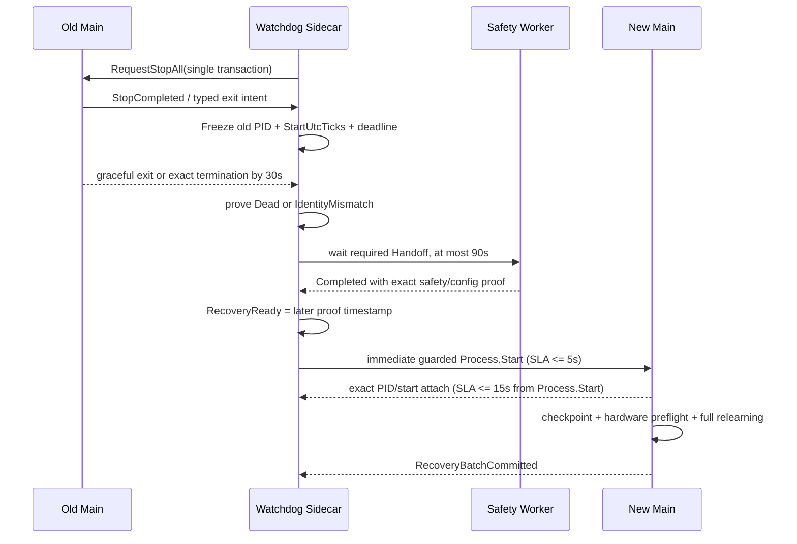

# 10243-028 V2.13.0.42 无人值守稳健运行二次复核整改及发布闭环方案

- 文档日期：2026-08-30
- 整改版本：`2.13.0.42`（沿用版本号，不再递增）
- 事故对象：`10243-028 / I0004`
- 原始事故版本：`V2.13.0.40`
- 软件基线：`.NET Framework 4.8`，现场 `Debug x86`
- Watchdog 线协议：`v4`，未升级
- 本文状态：**二次复核代码整改与自动化验证完成；无人值守正式发布仍待三项现场门禁**
- 优先级：本文对 V2.13.0.42 的退出证明、恢复 SLA 和周期硬截止隔离口径优先于第一次实施方案

关联文档：

- [V2.13.0.40 I0004 运行中程序完全退出根因分析及彻底解决方案](./2026-08-30_10243-028_V2.13.0.40_I0004_运行中程序完全退出根因分析及彻底解决方案.md)
- [V2.13.0.42 无人值守稳健运行彻底整改实施及验收方案](./2026-08-30_10243-028_V2.13.0.42_无人值守稳健运行彻底整改实施及验收方案.md)

## 1. 技术结论与当前发布决定

### 1.1 二次复核发现的三个缺口均已落到生产代码

第一次整改已经切断“StopAll 中间态被重复接管、接管退出被当成人工退出、Handoff 猜错配置目录”等主要故障链，但二次代码审查确认仍有三个会影响无人值守发布的缺口：

1. 协作退出路径没有冻结旧进程 `PID + StartUtcTicks`，并且忽略 `WaitForExit(5000)` 的 false 结果；理论上可能在旧进程尚未证明退出时继续消费 Permit。
2. Handoff 回执缺失会被当成“不需要等待”，首轮拉起固定预等 5 秒，附着窗口仍为 20 秒；这既放松了安全前提，也不满足新的 `5 秒拉起 / 15 秒附着` 恢复门禁。
3. 周期硬截止仍调用 `PersistentlyDisableChannels`，会把项目 XML 的 `Enabled` 改为 false，把“本次运行隔离”污染为跨启动永久禁用。

本次已分别完成：

- 旧进程身份在接管入口冻结，退出证明统一为 `Dead` 或 `IdentityMismatch`；`Alive`、`Unknown`、探测异常和 `WaitForExit=false` 全部耐久阻断。
- Handoff 等待改为结构化结果；只有精确 Handoff 完成，或未声明 Handoff 时存在完整、强类型、精确 Permit 绑定的 `StopCompleted` 终态证明，才形成恢复就绪。
- 恢复就绪后首轮不再预退避，立即越过受保护 `Process.Start`；5 秒是发布 SLA，不是等待时间；新进程附着窗口从 `Process.Start` 边界起严格为 15 秒。
- 周期硬截止只锁存当前进程内的通道隔离、撤销执行授权并完成物理安全动作，不再调用项目永久禁用。

### 1.2 “彻底解决”的准确边界

| 层级 | 当前结论 | 依据 |
| --- | --- | --- |
| 原事故软件故障链 | 已逐段切断 | StopAll 单所有者、强类型退出、精确 Permit、不可变配置快照、延迟安全闭合、旧进程退出证明、本次运行隔离 |
| 二次复核代码缺口 | 已整改 | 本文第 3～5 节代码和回归证据 |
| 软件自动化门禁 | 已通过 | Debug x86、Release Any CPU、Adaptive 659/659、Disk 55/55、Power 17/17 |
| 最终现场可靠性 | 尚未证明 | 真实 Sidecar 100 轮、24 小时模拟无人值守、48 小时现场多通道尚未执行 |
| 正式发布决定 | **暂不批准无人值守正式发布** | 同版本最终包尚无干净提交、清单和整包 SHA-256；三项现场门禁未完成 |

因此当前可标记为：

> **V2.13.0.42 软件整改完成，可进入受控现场验证；尚不能标记为“V2.13.0.42 无人值守正式发布”。**

这不是对代码整改结果的保留意见，而是安全软件的证据边界：自动化能证明状态机、身份、时限和持久化语义，不能替代真实 NI、液压、电源、Windows 调度和连续运行环境。

## 2. 二次复核对第一次方案的口径修正

| 项目 | 第一次方案口径 | 二次复核后的最终口径 |
| --- | --- | --- |
| 首次替换等待 | 首次退避 5 秒 | **取消预退避**；安全恢复前提完成后立即拉起，必须在 5 秒内跨过 `Process.Start` 边界 |
| 新进程附着 | 20 秒 | **15 秒**，从实际 `Process.Start` 边界开始计时 |
| SLA 起点 | 容易与 Handoff 等待混合 | 旧进程退出证明与 Handoff/StopCompleted 安全证明中较晚者，即 `RecoveryReady` |
| Handoff 缺失 | 回执读不到可继续 | Closing 已声明 Handoff 时，回执缺失、损坏、错身份、失败或超时均耐久阻断 |
| 无 Handoff 场景 | 未严格限定替代证据 | 只接受 schema 4、精确 Permit 绑定、最终安全结果已提交且物理/持久化/逻辑均闭合的 `StopCompleted` 围栏 |
| 旧进程退出 | 可能重新读取 Journal；强杀后未严格检查 Wait 结果 | 接管入口冻结 `PID + StartUtcTicks + 退出硬截止`；只有 `Dead/IdentityMismatch` 放行 |
| 周期硬截止 | 保留永久报警/禁用 | **只做本次运行隔离**；项目 `Enabled` 不变，下次启动重新执行硬件预检 |

如两份 V2.13.0.42 文档出现冲突，以本文为准。第一次方案中的其余 StopAll、退出 schema、Permit、配置快照、正式槽延迟闭合及诊断设计继续有效。

## 3. 旧进程退出证明已改为精确且失败安全

### 3.1 不再从可变 Journal 重新推断旧进程身份

接管入口现在同步冻结：

```text
OldProcessIdentity = PID + ProcessStartUtcTicks + ExitHardDeadlineUtcTicks
```

来源优先级为：

1. 精确匹配当前 Permit 的 schema 2 `WatchdogApplicationExitReceipt`；
2. 尚未生成退出回执时，在接管入口锁内读取一次 Journal 并冻结；
3. 后续异步等待、转储、终止和探测不得重新读取可能已被新进程覆盖的 `Journal.CurrentPid`。

生产实现见：

- [`BeginTakeover`](../../MTTFTest.Watchdog/WatchdogHost.cs#L2277)
- [`BeginRelaunchAfterExit`](../../MTTFTest.Watchdog/WatchdogHost.cs#L2642)
- [`FreezeOldProcessIdentityForPermit`](../../MTTFTest.Watchdog/WatchdogHost.cs#L2758)

### 3.2 退出观察结果只有两种可以授权拉起

| 观察结果 | 含义 | Permit/Process.Start |
| --- | --- | --- |
| `Dead` | 精确 PID 已不存在 | 允许继续检查安全前提 |
| `IdentityMismatch` | PID 已复用，但启动时间不同，精确旧进程已不存在 | 允许继续检查安全前提 |
| `Alive` | 精确旧进程仍存活 | 禁止拉起 |
| `Unknown` | 访问失败、探测异常或身份无法证明 | 耐久阻断 |
| `WaitForExit=false` | 强制终止后仍未在确认窗口内退出 | 耐久阻断，即使随后出现不可靠的偶然观察也不消费本 Permit |

统一策略位于 [`WatchdogRecoveryReadinessPolicy`](../../Watchdog.Protocol/WatchdogPolicy.cs#L1578)，生产观察和 30 秒边界位于 [`WaitForOldProcessExitProofAsync`](../../MTTFTest.Watchdog/WatchdogHost.cs#L2788)。

发生阻断时执行：

```text
Record OldProcessExitUnproven
  -> Block exact relaunch authority
  -> Journal.RecoveryBlocked = true
  -> Permit 进入 Blocked
  -> 不调用 TryConsumeRelaunchPermit
  -> 不调用 Process.Start
  -> Sidecar、过渡界面、Journal 和诊断证据继续存活
```

### 3.3 30 秒截止不会因监督器晚到重新计算

退出事务冻结 `ExitHardDeadlineUtcTicks`。如果应用退出监督器在退出请求 30 秒后才进入恢复观察，剩余等待为 0，不会重新再等一轮 30 秒。新建接管事务的最大等待仍被限制为 30 秒；精确强制终止后的确认窗口为 5 秒。

这同时覆盖：

- 正常协作退出；
- 30 秒精确强制终止；
- 心跳/界面非响应接管；
- 退出监督器、StopCompleted 与 Handoff 消息乱序到达。

## 4. Handoff 与恢复 SLA 已形成单一恢复就绪边界

### 4.1 结构化 Handoff 结果

新增 `WatchdogSafetyHandoffWaitOutcome`：

```csharp
NotRequired
Completed
Failed
TimedOut
MissingOrCorrupt
```

定义和统一判定见：

- [`WatchdogSafetyHandoffWaitOutcome`](../../Watchdog.Protocol/WatchdogPolicy.cs#L1569)
- [`TryResolveSafetyPrerequisite`](../../Watchdog.Protocol/WatchdogPolicy.cs#L1633)
- [`AwaitSafetyHandoffBeforeRelaunchAsync`](../../MTTFTest.Watchdog/WatchdogHost.cs#L2965)

ClosingTombstone 声明 `SafetyHandoffId` 时，必须同时满足：

1. Handoff 回执可读取且 schema 有效；
2. `HandoffId`、Session 代次/租约、`StopSafetyTransactionId` 完全一致；
3. `RelaunchDisposition=PreserveApprovedPermit`；
4. `SessionId + PermitGeneration + PermitId + PermitNonceSha256` 精确匹配当前耐久 Authority；
5. 状态为 `Completed`；
6. 电机 OFF、电源 OFF、压力安全、持久化闭合、逻辑静止、硬件资源释放、执行授权撤销和回调隔离全部成立；
7. 配置快照清单和文件 SHA-256 再次验证通过。

任一失败均不允许“猜配置”“跳过回执”或依据 `Reason` 字符串续跑。

### 4.2 未声明 Handoff 的唯一替代证明

ClosingTombstone 未声明 `SafetyHandoffId` 时，不再把“没读到回执”解释为成功。只有以下完整 `StopCompleted` 围栏才能返回 `NotRequired`：

```text
SchemaVersion >= 4
PreservesApprovedPermit = true
FinalSafetyResultCommitted = true
State = Terminal
SafetyStage = Terminal
MotorsOff = true
PowerOff = true
PressureSafe = true
PersistenceDrained = true
LogicalQuiescent = true
Exact Permit binding = true
```

旧 schema 仍可读取和审计，但因为缺少强类型接管权限，不得自动续跑。

### 4.3 恢复就绪与 5 秒/15 秒时限



关键规则：

- 90 秒 Handoff 等待不计入 5 秒拉起 SLA；等待期间 Sidecar 和诊断界面持续存活。
- `RecoveryReady` 是旧进程退出证明和安全证明中较晚者；当前实现按顺序完成两项证明后立即记录单调时间戳。
- 首轮安全替换不调用原有 `5/15/30/60` 秒退避。
- 首轮调度或 `Process.Start` 超过 5 秒会记录独立 `RecoveryProcessLaunchSlaExceeded`，包含 Session、Permit generation、PermitId、nonce 哈希和耗时；安全前提已满足时仍继续恢复。
- 新进程必须在 `Process.Start` 边界后的 15 秒内完成精确附着；超时记录 `RecoveryAttachSlaExceeded`，精确终止该新进程、关闭本 Permit，再按既有后续退避与预算重试。
- 后续启动失败继续使用 `5/15/30/60` 秒退避；没有改成无限快速重启。

生产实现见：

- [`RelaunchLoopAsync`](../../MTTFTest.Watchdog/WatchdogHost.cs#L3131)
- [`RecoveryProcessLaunchSlaExceeded`](../../MTTFTest.Watchdog/WatchdogHost.cs#L3272)
- [`RecoveryAttachSlaExceeded`](../../MTTFTest.Watchdog/WatchdogHost.cs#L3366)

## 5. 周期硬截止已改为本次运行隔离

### 5.1 项目 `Enabled` 不再被自动改写

周期硬截止和连续周期超限统一进入 [`LatchCurrentRunPeriodIsolationAsync`](../../Controller/EpbManager.PeriodOverrun.cs#L198)。该路径现在只执行：

1. 写入当前进程的 `_nonRecoverableChannelFaultLatch` 和原因；
2. 停止当前 Timer；
3. 撤销通道执行授权；
4. 幂等 OFF、液压释放和证据导出；
5. 发布“本次运行隔离”报警；
6. 物理安全无法证明时升级整批 StopAll。

该方法已完全移除 `PersistentlyDisableChannels` 调用，不再自动写：

```xml
<Enabled>false</Enabled>
```

运行提示改为：

> 本次运行隔离已锁存；项目启用配置保持不变，下次启动必须重新执行硬件预检。

### 5.2 保留的兼容行为

- 旧项目已经存在的 `PermanentAlarmLatched` 和人工 `Enabled=false` 继续读取，不自动清除历史安全设置。
- 人工执行“重置永久报警/是否重新启用”的明确操作仍可修改项目配置。
- 其他确实被定义为项目级永久安全门禁的历史策略仍保留其原行为；本次只移除周期硬截止分支对项目永久禁用的越权调用。
- 周期超限次数和最近时间可继续作为诊断状态持久化，但更新使用 `Enabled=null`，不改变启用授权。

### 5.3 自动化增加生产 IL 门禁

回归测试不仅检查分类函数，还读取异步生产状态机 `MoveNext` 的 IL，确认 `LatchCurrentRunPeriodIsolationAsync` 不包含对 `PersistentlyDisableChannels` 的 `call/callvirt`。测试位于 [`PeriodHardLimitDoesNotPersistProjectDisable`](../../Tests/AdaptiveControlTests/FormalBatchSlotCoordinatorTests.cs#L322)。

这项门禁可以防止后续重构时仅修改提示语，却把永久禁用调用重新接回周期硬截止路径。

## 6. 实际代码改动清单

| 子系统 | 文件 | 本次二次复核改动 |
| --- | --- | --- |
| Protocol/Policy | `Watchdog.Protocol/WatchdogPolicy.cs` | 新增结构化 Handoff 结果、旧进程退出证明、完整 Stop/Handoff 证明、5/15/30/90 秒常量、首轮退避策略、可注入单调时钟 SLA 判定 |
| Watchdog Host | `MTTFTest.Watchdog/WatchdogHost.cs` | 冻结旧 PID/启动时间/退出截止；统一正常/强制/非响应退出观察；失败耐久阻断；Handoff 精确校验；恢复就绪时间；首轮立即拉起；15 秒附着；SLA 精确事件 |
| Controller | `Controller/EpbManager.PeriodOverrun.cs` | 周期硬截止由永久报警改为本次运行隔离；移除项目永久禁用；仅安全闭合失败才升级整批停止 |
| 回归测试 | `Tests/AdaptiveControlTests/WatchdogHostIntegrationTests.cs` | 覆盖 Dead、IdentityMismatch、Alive、Unknown、WaitForExit=false、Handoff 缺失/失败/超时/错身份/快照损坏、5/15 秒边界和首轮退避 |
| 回归测试 | `Tests/AdaptiveControlTests/FormalBatchSlotCoordinatorTests.cs` | 增加周期隔离生产 IL 不得调用项目永久禁用的门禁 |

本次没有升级 Watchdog v4 线协议，也没有破坏 schema 1～3 的读取兼容；兼容原则继续是“旧数据可审计、缺失权限不推断”。

## 7. 自动化验证结果

### 7.1 完整验证矩阵

执行日期：2026-08-30。构建工具：Visual Studio MSBuild `18.8.2`；目标框架：.NET Framework 4.8 / .NET 8 测试项目。

| 验证项 | 命令/范围 | 结果 |
| --- | --- | --- |
| Debug x86 全解决方案 | `msbuild TfTest.sln /p:Configuration=Debug /p:Platform=x86` | **通过**；仅仓库既有编译警告 |
| Release Any CPU 全解决方案 | `msbuild TfTest.sln /p:Configuration=Release /p:Platform="Any CPU"` | **通过**；仅仓库既有编译警告 |
| Adaptive/Controller/Watchdog 全套 | `AdaptiveControlTests.exe` | **659/659 通过** |
| EpbDiskWriter | `EpbDiskWriterTests.exe` | **55/55 通过** |
| PowerSupplyDebugger | `dotnet test PowerSupplyDebugger.Tests.csproj` | **17/17 通过** |
| 差异格式检查 | `git diff --check` | **无空白错误**；仅 Git 行尾转换提示 |

### 7.2 高风险目标组

| 目标组 | 结果 |
| --- | ---: |
| Watchdog Host integration | 11/11 |
| Strict Host v4 production | 22/22 |
| Stop/Watchdog hardening | 44/44 |
| Watchdog safety v39/schema | 7/7 |
| Recovery coordination | 47/47 |
| Recovery hardening | 38/38 |
| Formal slot barrier/period isolation | 18/18 |

### 7.3 本次新增的关键证明

- `Dead`、`IdentityMismatch` 放行；`Alive`、`Unknown` 阻断。
- 强制退出要求 `WaitForExit=true`；false 时即使存在后续不可靠观察也不授权本事务。
- 完整 StopCompleted 返回 `NotRequired`；旧 schema 或不完整安全证据不能替代 Handoff。
- Handoff 缺失/损坏、身份不匹配、`Failed`、超时分别形成 `MissingOrCorrupt`、`Failed`、`TimedOut`，不会落入默认成功。
- 快照损坏时结果为 `MissingOrCorrupt`；完整 Handoff 才为 `Completed`。
- 可注入单调时间戳精确验证 `5000 ms` 不超时、`5001 ms` 超时；`15000 ms` 不超时、`15001 ms` 超时。
- 初次安全替换无预退避，第二次及以后恢复原有退避。
- 周期硬截止生产状态机不调用项目永久禁用。

### 7.4 自动化不能证明的事项

自动化通过不等于现场门禁通过。以下证据当前仍缺失：

- 真实 Sidecar 连续 100 轮旧进程正常退出、30 秒精确终止、替换、附着和 `RecoveryBatchCommitted`；
- 24 小时模拟无人值守；
- 48 小时真实多通道、NI、液压、电源现场运行；
- V2.13.0.40 现场 1.17 秒 DAQ 空窗的唯一底层归因。

## 8. 版本、构建身份与候选包防混用

### 8.1 版本号保持 2.13.0.42

已核对以下身份均为 `2.13.0.42`：

- `MTTfTest` AssemblyVersion/FileVersion
- `MTTFTest.Watchdog` AssemblyVersion/FileVersion
- `Watchdog.Client` AssemblyVersion/FileVersion
- `Watchdog.Protocol` AssemblyVersion/FileVersion
- `Controller` AssemblyVersion/FileVersion
- ClickOnce `ApplicationVersion`

### 8.2 本次开发验证构建身份

| 字段 | 值 |
| --- | --- |
| Git branch | `feature/safety-margin-freezeA-20260101` |
| 基础 HEAD | `f45ae66b7092cd35e24ab60869756ae9cbd598b3` |
| 工作区状态 | Dirty，34 个状态项（包含本次完整 V2.13.0.42 整改与文档） |
| 构建用途 | 本机软件验证，不是可投放现场的最终包 |

本次 Release 验证二进制清单：

| 文件 | 长度（字节） | SHA-256 |
| --- | ---: | --- |
| `MTTfTest.exe` | 3,447,808 | `D71062606FF9BAA348F7DAB2E4AFAD813CC5DB560AE3455A9544E4FB65B33CCE` |
| `MTTFTest.Watchdog.exe` | 192,000 | `C3B6DBCD8AE2422C7307D1B4D88495FBF9D132F0F665AADC0BC7F4E28B098F90` |
| `MTTFTest.Watchdog.Client.dll` | 179,712 | `02D5D7554D2BFA34DF9688A9CD9307EBA013188AE632DD46526B510596464ED6` |
| `MTTFTest.Watchdog.Protocol.dll` | 325,120 | `57D9E0AED45C14AC7E8A78B9880B80F5E39B194EAC5E0B65CD533C8527029069` |
| `Controller.dll` | 1,810,944 | `8B0B7EE65EBF49FAF84B83823D5A426B75ADEA31497338323960312EB5F17604` |

这些哈希只证明本次本机验证使用了哪些文件。由于工作区尚未形成干净 Git 提交，也没有生成正式整包，**不得把上述单文件哈希当作现场发布包身份**。

### 8.3 正式候选包的强制身份

相同文件版本 `2.13.0.42` 的不同候选包必须同时提供：

1. 干净 Git commit SHA；
2. 构建时间、构建机、Configuration、Platform 和工具链身份；
3. 逐文件相对路径、长度、SHA-256 清单；
4. 清单自身 SHA-256；
5. 最终压缩包/安装包整包 SHA-256；
6. 自动化结果和现场门禁记录所引用的同一 BuildId。

缺任一项，不得仅凭资源管理器中的 `2.13.0.42` 文件版本判断“已经是最新整改包”。

## 9. 现场验证与发布门禁

### 9.1 真实 Sidecar 100 轮

每轮至少记录：

- `SessionId`
- `StopSafetyTransactionId`
- `TakeoverTransactionId`
- `HandoffId`（如需要）
- `PermitGeneration + PermitId + PermitNonceSha256`
- 旧 `PID + StartUtcTicks`
- `OldProcessExitProven` 的观察结果和时间
- `RecoveryReady` 时间
- `Process.Start` 时间及 5 秒 SLA
- 新 `PID + StartUtcTicks` 附着时间及 15 秒 SLA
- `RecoveryBatchCommitted`

覆盖比例：

- 正常协作退出不少于 40 轮；
- 30 秒精确终止不少于 20 轮；
- Handoff 完成不少于 20 轮；
- Handoff 失败、缺失、损坏、错身份和超时的阻断用例合计不少于 10 轮；
- 其余用于附着超时、启动失败和后续退避。

任一轮出现第二主进程、旧进程退出未证明仍拉起、Permit 重复消费或阻断后 Sidecar 消失，整项判失败。

### 9.2 24 小时模拟无人值守

至少包含：

- 单 DAQ 1.2 秒停顿与双设备共因停顿；
- 持久化 1～5 秒延迟；
- 液压释放延迟；
- UI 调度、GC、线程池和锁等待扰动；
- 单通道与电源组实时硬故障；
- 至少 10 次进程替换；
- 人工停止与正常完成各一次。

### 9.3 48 小时现场多通道

使用最终干净 BuildId 和真实硬件。期间不得：

- 人工删除或修改 Watchdog Journal；
- 手工重启掩盖替换失败；
- 临时修改项目 XML 恢复被错误禁用的通道；
- 跳过完整硬件预检或重新学习；
- 把安全阻断手工改写为成功。

### 9.4 零容忍发布指标

| 指标 | 门限 |
| --- | ---: |
| 双主进程 | 0 |
| 非人工退出后无替代进程附着 | 0 |
| 旧进程退出未证明仍消费 Permit | 0 |
| Handoff/StopCompleted 安全证明不完整仍续跑 | 0 |
| 5 秒拉起 SLA 超时 | 0 |
| 15 秒附着 SLA 超时 | 0 |
| 重复 StopAll | 0 |
| 作废圈/半提交圈错误计数 | 0 |
| 带压、带电或持久化未闭合续跑 | 0 |
| 配置快照错误接管 | 0 |
| Permit ABA、重复或跨会话消费 | 0 |
| 周期硬截止或软件瞬态改写项目 `Enabled` | 0 |
| 全通道故障后主程序、Sidecar 和诊断界面全部消失 | 0 |

SLA 超时本身不应在安全前提已经完成后停止安全恢复，但任一 SLA 超时都使当前候选包的发布门禁失败，必须保留精确事务证据并整改。

## 10. 发布闭环步骤

### 10.1 软件候选固化

1. 评审本次差异，确认不包含现场日志、备份、`bin/obj` 或凭据。
2. 形成干净 Git 提交；建议提交说明：`fix(watchdog): 完成旧进程退出证明与恢复时限闭环`。
3. 从干净提交重新执行 Debug x86、Release Any CPU 和三套测试。
4. 使用现场要求的 Debug x86 配置生成候选包。
5. 生成逐文件清单、清单哈希和整包 SHA-256。
6. 将 BuildId 写入 100 轮、24 小时和 48 小时记录。

### 10.2 发布签署表

| 门禁 | 当前状态 | 责任证据 |
| --- | --- | --- |
| 二次复核代码整改 | 通过 | 本文第 3～6 节 |
| Debug x86 | 通过 | 2026-08-30 本机构建 |
| Release Any CPU | 通过 | 2026-08-30 本机构建 |
| 三套自动化 | 通过 | 659/659、55/55、17/17 |
| 干净提交与正式整包 SHA-256 | **待完成** | 最终构建清单 |
| 真实 Sidecar 100 轮 | **待完成** | 100 轮逐事务记录 |
| 24 小时模拟无人值守 | **待完成** | 模拟台记录和事故清单 |
| 48 小时现场多通道 | **待完成** | 现场运行记录和签署 |
| V2.13.0.42 无人值守正式发布 | **未批准** | 以上三项现场门禁全部通过后更新 |

## 11. 故障阻断后的现场处置

出现 `OldProcessExitUnproven`、`RecoverySafetyPrerequisiteBlocked`、`RecoveryProcessLaunchSlaExceeded` 或 `RecoveryAttachSlaExceeded` 时：

1. 保持 Sidecar 和过渡诊断界面运行；
2. 不手工删除 Permit、Closing、Exit 或 Handoff 文件；
3. 导出 Journal、事件日志、配置快照、进程转储和 60 秒诊断缓冲区；
4. 记录 BuildId、Session、事务 ID、Permit 和精确 PID 身份；
5. 确认电机 OFF、电源 OFF、压力安全和持久化闭合；
6. 由操作员结束当前会话后，以新会话执行完整硬件预检；
7. 不得通过修改 `Reason`、回执状态或项目 `Enabled` 强行续跑。

## 12. 最终结论

本次二次复核没有停留在文档建议，已经修改并验证生产代码：

- 旧进程没有精确退出证明时，不会出现第二主进程；
- Handoff 或完整 StopCompleted 安全证明缺失时，不会消费 Permit 或启动新进程；
- 安全恢复前提完成后，首轮不再人为等待 5 秒，5 秒成为可审计的拉起 SLA；
- 新进程附着窗口从 20 秒收紧为 15 秒，并绑定实际 `Process.Start` 边界；
- 周期硬截止不再污染项目 `Enabled`，健康通道可以在本次运行策略允许时继续，下次启动重新预检；
- 人工停止、正常完成和接管替换继续保持强类型分离；
- 版本号继续为 `2.13.0.42`，现场包必须靠 BuildId、清单和整包哈希区分。

软件自动化层面，本次整改已通过全部现有套件和新增门禁。正式发布层面，结论仍是：

> **只有干净正式包、真实 Sidecar 100 轮、24 小时模拟无人值守和 48 小时现场多通道全部通过，且零容忍指标全部为 0，才可把 V2.13.0.42 标记为“无人值守正式发布”。**

