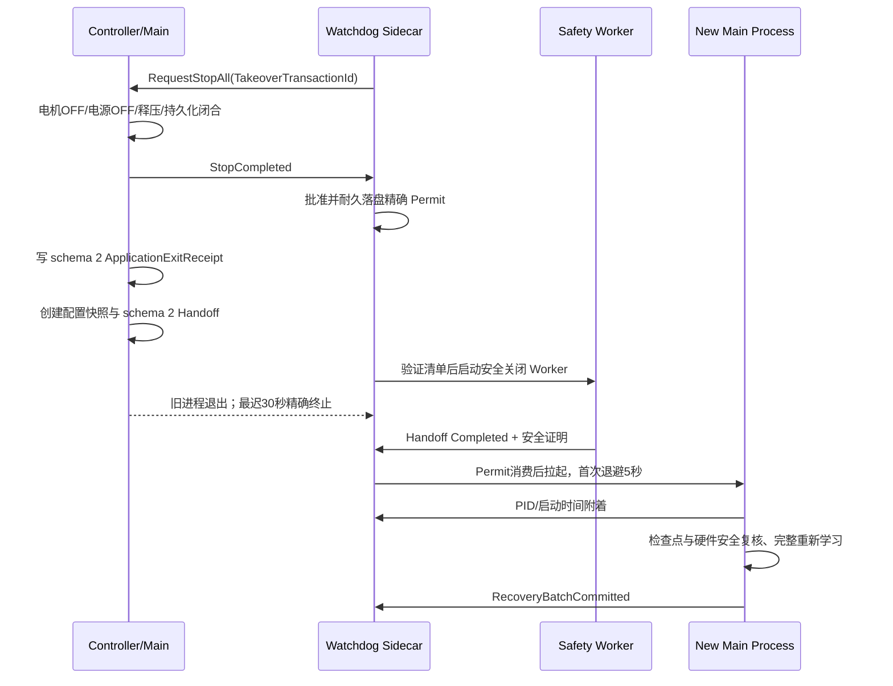

# 10243-028 V2.13.0.42 无人值守稳健运行彻底整改实施及验收方案

- 文档日期：2026-08-30
- 整改版本：V2.13.0.42
- 事故版本：V2.13.0.40
- 事故数据：`D:\EPB_Data\Backups\10243-028_V2.13.0.40_I0004_0830_2040`
- 原因分析：[2026-08-30_10243-028_V2.13.0.40_I0004_运行中程序完全退出根因分析及彻底解决方案.md](2026-08-30_10243-028_V2.13.0.40_I0004_运行中程序完全退出根因分析及彻底解决方案.md)
- 实施状态：软件整改已落地，自动化编译和测试已通过；24 小时模拟与 48 小时现场门禁待执行
- 发布结论：V2.13.0.42 可进入现场验证，不得在现场门禁完成前宣称正式发布

## 1. 结论

### 1.1 本次实际完成的整改

V2.13.0.40 的“程序完全退出”不是单点崩溃，而是一个由 DAQ 短暂停顿触发、被三个软件缺陷连续放大的故障链：

1. 正式圈在电机 OFF、液压释放和持久化闭合回执仍在异步到达时，被过早判为 `SafetyUnproven`；
2. 主程序已进入 StopAll 后，Watchdog 又把 Timer/Runner 等收口残留误判为响应故障，重复发起接管 StopAll；
3. 接管退出被通用字符串语义当作人工关闭，已批准的重启许可被撤销；
4. 旧进程正常退出后，替代进程因此没有拉起；
5. 安全关闭 Worker 又因猜错配置目录而不能完成接管闭合。

V2.13.0.42 已对上述五个放大点完成代码闭环，并补强硬故障隔离和事故诊断：

| 根因/风险 | V2.13.0.42 处理结果 | 状态 |
| --- | --- | --- |
| StopAll 期间把逻辑残留误判为新故障 | `stopActive` 成为响应修复硬门禁，停止期间不再产生第二个 StopAll | 已落地 |
| 通过 `Reason` 字符串猜测人工/接管退出 | 新增强类型退出类型、重启处理类型和 schema 2 退出回执 | 已落地 |
| 接管退出撤销已批准 Permit | 关闭围栏 schema 4 保存精确 Permit 身份；接管围栏不再写人工撤权标记 | 已落地 |
| 旧进程正常退出后 Sidecar 一并结束 | 退出监督按强类型分流；接管退出保持 Sidecar 并继续拉起，人工/完成退出才结束 Sidecar | 已落地 |
| 自动 StopAll 的批次取消被发布为 `RunStopped` | 仅显式人工停止可发布 `RunStopped`；自动恢复/接管取消由原事务收口 | 已落地 |
| ABA、旧消息或跨会话误拉起 | 精确绑定 `SessionId + Generation + PermitId + PermitNonceSha256`，失败/撤销 Permit 不可消费 | 已落地 |
| 安全 Worker 猜测项目 Config | 每个 Handoff 创建不可变配置快照和 schema 1 哈希清单，Worker 仅使用已验证快照 | 已落地 |
| 电机/液压/持久化回执稍晚即 `SafetyUnproven` | 新增内部 `PendingSafetyClosure`，并行等待最长 15 秒后再决定终态 | 已落地 |
| 重复 OFF 的迟到失败覆盖首次成功 | OFF 证据改为幂等单调，后续返回 `AlreadyOffConfirmed` | 已落地 |
| 软件瞬态被升级为永久停机 | 只有实时电气/机械证据为 `HardwareConfirmed` 才隔离；项目 `Enabled` 不因本次运行隔离而修改 | 已落地 |
| DAQ 空窗原因无法复盘 | 复用并固化现有 60 秒诊断环、250 ms 冻结阈值及统一 Incident 证据链 | 已落地 |

### 1.2 V2.13.0.42 的安全承诺

本版本的目标不是“任何故障都盲目续跑”，而是同时满足两条不可让步的约束：

- 软件瞬态不得使无人值守程序永久消失；
- 无法证明电机 OFF、液压释放或持久化闭合时不得带压、带电或带缺口续跑。

据此，运行策略固定为：

| 故障类型 | V2.13.0.42 强制行为 |
| --- | --- |
| DAQ 短暂卡顿、通信抖动、持久化延迟 | 当前圈安全作废并在原进程内退避恢复；不得退出程序 |
| 单卡钳、线路或驱动硬故障 | 隔离证据绑定的当前通道并报警，健康通道继续；不修改项目永久启用配置 |
| 共用设备短暂异常 | 相关组安全停止并退避重试，其他组继续 |
| 状态不可证明、死锁或进程崩溃 | StopAll 闭合安全边界，Watchdog 替换进程并从耐久检查点恢复 |
| 全部通道均确认硬故障 | 进入安全空闲并持续报警；主程序和 Watchdog 均保持运行 |
| 人工停止或正常试验完成 | 正常退出；Watchdog 不自动拉起 |

### 1.3 “彻底解决”的验收口径

代码和自动化测试通过只能证明软件链路整改完成，不能代替 NI、CAN、液压、电源和真实 Windows 调度环境。只有同时满足以下条件，才能对本事故关闭问题：

1. 本文第 5 节自动化门禁全部通过；
2. 24 小时模拟无人值守通过；
3. 48 小时现场多通道运行通过；
4. 真实 Sidecar 完成 100 轮旧进程退出、替换、附着和恢复提交；
5. 任何非人工退出均不存在“旧进程已退出、替代进程未附着”；
6. 不存在重复 StopAll、错误正式计数、持久化缺口、带压续跑或错误配置接管。

在这些门禁完成前，本文件使用“软件整改完成、现场发布待批准”，不使用未经证据支持的“现场已彻底解决”。

## 2. 整改实施

### 2.1 StopAll 改为单事务、单所有者

实施位置：

- `Watchdog.Protocol/WatchdogPolicy.cs`
- `MTTFTest.Watchdog/WatchdogHost.cs`

新增 `ResponsiveControlRepairPolicy.ShouldRequest`，响应修复必须同时满足：主进程存活、接管尚未确认、`stopActive == false`，并且确有逻辑残留、恢复矛盾、正式进展停滞或通道监督失败。

Watchdog 现在先计算 `stopActive`，再评估 Timer/Runner/CTS 等逻辑残留。StopAll 活动期间的残留只记录一次 `ResponsiveControlRepairSuppressedDuringStop`，不再发送新的 `RequestStopAll`。重复停止请求只能加入当前安全事务，不能创建第二个所有者。

这直接关闭事故中“Controller 已在 StopAll 收口，Watchdog 又因 `LogicalResidue` 发起第二个接管 StopAll”的路径。

### 2.2 强类型退出事务与精确 Permit 围栏

实施位置：

- `Watchdog.Protocol/WatchdogSafetyReceipts.cs`
- `Watchdog.Protocol/WatchdogClosingTombstone.cs`
- `Watchdog.Protocol/WatchdogSafetyConfigSnapshot.cs`
- `MTTfTest/WatchdogRuntime.cs`
- `MTTfTest/Main_Frm.WatchdogUi.cs`
- `MTTFTest.Watchdog/WatchdogHost.cs`

新增类型：

```csharp
public enum WatchdogExitDisposition
{
    OperatorExit = 1,
    NormalCompletionExit = 2,
    TakeoverReplacementExit = 3
}

public enum WatchdogRelaunchDisposition
{
    Forbidden = 1,
    PreserveApprovedPermit = 2
}
```

`WatchdogApplicationExitReceipt` 升级为 schema 2，新增：

- `ExitDisposition`
- `RelaunchDisposition`
- `TakeoverTransactionId`
- `RelaunchPermitGeneration`
- `RelaunchPermitId`
- `RelaunchPermitNonceSha256`

`WatchdogClosingTombstone` 升级为 schema 4，同步保存以上强类型关闭围栏。接管退出必须同时满足：

```text
Receipt.SessionId == Authority.SessionId
Receipt.Generation == Authority.Generation
Receipt.PermitId == Authority.PermitId
SHA256(Authority.PermitNonce) == Receipt.PermitNonceSha256
Authority.State ∈ [Approved, Committed]
```

任一字段不一致、Permit 已 `Failed`/`Revoked`/`Blocked`、进程 PID/启动时间不一致、消息属于旧会话或旧 schema 缺少强类型字段，均保守阻断自动拉起。明文 nonce 不进入退出回执和关闭围栏。

人工退出与正常完成仍写 `Forbidden`，保持“不自动拉起”；只有 `TakeoverReplacementExit + PreserveApprovedPermit` 能越过关闭围栏。主窗体如果在 2 秒内读不到已耐久批准的精确 Permit，会保持可见并记录 `TakeoverExitBlockedWithoutApprovedPermit`，不会先退出再赌 Watchdog 能否恢复。

退出监督器在观察到旧 PID 已正常退出或完成 30 秒精确终止后，再按退出类型决定 Sidecar 生命周期：人工退出和正常完成结束 Sidecar；接管替换记录 `TakeoverReplacementOldProcessExited`，保持 Sidecar 存活并继续同一 Permit 的 Handoff/拉起事务。自动 StopAll、恢复事务或 Watchdog 接管造成的批次取消不再发布具有人工终止含义的 `RunStopped`。

### 2.3 固定自动替换顺序

V2.13.0.42 的接管时序固定如下：



具体约束：

- `StopCompleted` 处理路径先批准 Permit，再允许旧进程生成退出意图；
- 旧进程退出等待最长 30 秒；超过后只对精确 PID 与启动时间匹配的旧进程执行终止；
- 安全交接存在时，替代进程必须等待 Handoff 达到 `Completed` 且 `MotorsOff + PowerOff + PressureSafe`；`Failed` 或超时均禁止续跑；
- 复用现有进程级最多 8 次预算；替代进程已经附着后的设备暂时不可用，进入进程内持续退避，不能靠无限重启处理；
- 人工停止、正常完成和通用关闭不会进入上述自动替换路径。

### 2.4 不可变安全配置快照

实施位置：

- `Watchdog.Protocol/WatchdogSafetyConfigSnapshot.cs`
- `MTTfTest/WatchdogRuntime.cs`
- `MTTfTest/WatchdogSafetyShutdownWorker.cs`
- `MTTFTest.Watchdog/WatchdogHost.cs`

每个 `HandoffId` 创建独立目录：

```text
<Journal>/safety-handoff-<HandoffId>/
├─ ConfigSnapshot/
└─ config-snapshot-manifest.json
```

快照规则：

1. 先复制程序目录下完整 `Config`；
2. 只用项目 `Config/TestConfig.xml` 覆盖运行项目配置；
3. 强制要求 `AIConfig.xml`、`AOConfig.xml`、`DOConfig.xml`、`PowerSupplyConfig.xml`、`TestConfig.xml` 全部存在；
4. 清单 schema 1 保存相对路径、配置角色、源路径、长度、SHA-256、构建身份和创建时间；
5. 临时目录写入并刷盘后原子改名；
6. Sidecar 接收 Handoff 时重新验证清单哈希、每个文件哈希/长度、必需文件、重复项、未登记文件和路径越界；
7. Worker 只读取 `ConfigSnapshotPath`，不再根据“项目 Config 目录是否存在”猜测配置来源。

`WatchdogSafetyHandoffReceipt` 升级为 schema 2，保存快照目录、清单路径、清单哈希、清单 schema 和精确 Permit 身份。快照缺失、篡改或 Permit 不匹配时写终态 `Failed` 与 `FailureCode`，阻断续跑且保留 Watchdog/诊断界面。

### 2.5 正式槽位延迟闭合

实施位置：

- `Controller/EpbManager.BatchStart.cs`
- `Controller/DoControlTrace.cs`

新增内部状态 `PendingSafetyClosure`，它仅是等待态，不写入终态 `FormalParticipantDisposition`。正式圈结束或安全作废时并行观察：

- 电机 OFF 命令及通道实时未上电证明；
- 液压成员租约释放；
- 圈闭合回执已耐久提交或耐久作废。

三类证据最长等待 15 秒，轮询间隔 25 ms。证据齐备后才计算 `SafeCommitted` 或 `SafeAborted`；只有真实失败或 15 秒超时才进入 `SafetyUnproven`。全局 StopAll 的 45 秒硬截止保持不变。

OFF 证据采用单调 OR 语义：首次物理 OFF 成功后，后续重复 OFF 即使返回失败或迟到，也返回 `AlreadyOffConfirmed`，不能覆盖首次成功证据。正向或反向重新上电时会清除旧 OFF 证据，避免跨动作代次误用。

### 2.6 硬故障隔离语义

实施位置：

- `Controller/EpbManager.cs`
- `Controller/EpbManager.StartupPositioning.cs`
- `Tests/AdaptiveControlTests/NonRecoverableAlarmPolicyTests.cs`

本次统一以下边界：

- DAQ 陈旧、通信失败、单次超时、软件对象残留和持久化延迟属于软件/基础设施瞬态，不得升级为卡钳硬故障；
- 开路、负载上升未建立、已确认低平台、已确认峰值超限等，必须以当前动作窗口内实时电气/机械证据分类为 `HardwareConfirmed`；
- `HardwareConfirmed` 只隔离证据绑定的通道，或确有共享证据时隔离对应电源组；
- 健康通道继续正式计数；
- 本次运行隔离不再调用项目 XML 永久禁用，不修改 `Enabled`；
- 已有、明确配置为永久安全门禁的周期硬上限策略保持不变，它不属于本次 DAQ 瞬态分类。

### 2.7 60 秒循环诊断证据

本版本保留并纳入验收的现有诊断基础：

- DAQ 回调、控制消费和原始批次的 60 秒环形证据；
- DO 调用、动作时序与最近 60 秒控制追踪；
- GC 暂停、线程池、主机 CPU/内存/句柄/线程探针；
- 持久化接收、发布、写盘、队列和冻结边界；
- UI 调度、恢复阶段、资源所有者和 Watchdog 心跳；
- 250 ms DAQ 新鲜度阈值；
- `DaqIncidentLatch`/Incident 会话将 Controller、Watchdog 和 Sidecar 证据关联到统一事故身份。

当 DAQ 间隔超过 250 ms 或恢复边界锁存时，冻结相关 60 秒窗口。现场验收必须确认日志、诊断目录和 Watchdog Journal 能用同一 `RunId/IncidentId/CorrelationId` 还原时序。

## 3. 接口与持久化兼容

### 3.1 schema 兼容矩阵

| 对象 | 新 schema | 旧 schema 行为 | 新写入行为 |
| --- | ---: | --- | --- |
| `WatchdogApplicationExitReceipt` | 2 | schema 1 可读；不能保留接管 Permit | 始终写强类型退出和 Permit 围栏 |
| `WatchdogClosingTombstone` | 4 | schema 1～3 可读；无强类型接管字段时禁止自动续跑 | schema 4 同步退出类型和 Permit 身份 |
| `WatchdogSafetyHandoffReceipt` | 2 | schema 1 可读；仅用于旧会话兼容 | schema 2 必须带配置快照和重启处理类型 |
| 配置快照清单 | 1 | 无旧格式 | Handoff 创建时一次性生成并验证 |
| Watchdog 线协议 | 4 | 继续兼容 v4 现有字段 | 只增加 DTO 字段，不提升线协议版本 |

兼容原则是“旧数据可审计、缺失权限不推断”。旧 schema 中即使 `Reason` 文本包含 Takeover/Recovery，也不能据此恢复自动重启许可。

### 3.2 关键身份与单调约束

以下字段一经耐久写入不得改变：

- Session 代次与租约；
- Exit/Handoff/Takeover 事务 ID；
- 旧主进程 PID 与启动时间；
- 退出类型、重启处理类型；
- Permit 代次、ID 与 nonce 哈希；
- 配置快照路径、清单路径和清单哈希。

Receipt 的 `Revision` 和状态只能单调前进；`Completed`/`Failed` 后禁止改写终态。文件/消息乱序、重复到达、相同 revision 不同内容、进程身份不匹配均失败安全。

## 4. 实际变更清单

### 4.1 生产代码

| 子系统 | 文件 | 主要变更 |
| --- | --- | --- |
| 协议 | `Watchdog.Protocol/WatchdogSafetyReceipts.cs` | 强类型退出、schema 2 Exit/Handoff |
| 协议 | `Watchdog.Protocol/WatchdogClosingTombstone.cs` | schema 4 关闭围栏 |
| 协议 | `Watchdog.Protocol/WatchdogSafetyConfigSnapshot.cs` | 配置快照、清单验证、精确 Permit 绑定 |
| 策略 | `Watchdog.Protocol/WatchdogPolicy.cs` | StopAll 活动期响应修复抑制 |
| Sidecar | `MTTFTest.Watchdog/WatchdogHost.cs` | Permit 先落盘、精确退出观察、30 秒旧进程边界、安全 Handoff 后拉起 |
| Runtime | `MTTfTest/WatchdogRuntime.cs` | schema 2/4 写入、配置快照和关闭围栏 |
| UI | `MTTfTest/Main_Frm.WatchdogUi.cs` | 未取得精确 Permit 时禁止旧进程退出 |
| UI | `MTTfTest/FrmEpbMainMonitor.cs` | 自动取消与人工 `RunStopped` 语义分离 |
| Worker | `MTTfTest/WatchdogSafetyShutdownWorker.cs` | 只接受已验证快照，不猜项目 Config |
| Controller | `Controller/EpbManager.BatchStart.cs` | `PendingSafetyClosure` 最长 15 秒 |
| Controller | `Controller/DoControlTrace.cs` | OFF 证据幂等单调 |
| Controller | `Controller/EpbManager.cs` | 当前运行硬故障隔离，健康通道继续 |
| Controller | `Controller/EpbManager.StartupPositioning.cs` | 启动定位硬故障采用当前运行隔离 |

### 4.2 版本号

以下程序集和 ClickOnce 应用版本已统一为 `2.13.0.42`：

- `MTTfTest`
- `MTTFTest.Watchdog`
- `Watchdog.Client`
- `Watchdog.Protocol`
- `Controller`
- `MTTfTest.csproj/ApplicationVersion`

## 5. 验证记录

### 5.1 已执行自动化验证

执行环境：Windows，Visual Studio 2022 MSBuild 17.14，.NET Framework 4.8，.NET 8 调试器测试。

| 验证项 | 命令/范围 | 结果 |
| --- | --- | --- |
| Debug x86 全解决方案 | `msbuild TfTest.sln /p:Configuration=Debug /p:Platform=x86` | 通过；仅现有编译警告 |
| Release Any CPU 全解决方案 | `msbuild TfTest.sln /p:Configuration=Release /p:Platform="Any CPU"` | 通过；仅现有编译警告 |
| 控制与 Watchdog 回归 | `Tests/AdaptiveControlTests/bin/Debug/AdaptiveControlTests.exe` | 655/655 通过 |
| 磁盘写入与恢复 | `Tests/EpbDiskWriterTests/bin/Debug/EpbDiskWriterTests.exe` | 55/55 通过 |
| 电源调试器 | `dotnet test Tests/PowerSupplyDebugger.Tests/PowerSupplyDebugger.Tests.csproj` | 17/17 通过 |
| 差异格式检查 | `git diff --check` | 通过；仅行尾转换提示 |

首次全解决方案构建时，`PowerSupplyDebugger` 的 SDK 资产缺少运行时目标；补执行 `dotnet restore` 的 `win-x64` 与 `win-x86` 目标后，Debug x86 和 Release Any CPU 均通过。这是本机构建还原状态，不是生产代码错误，也没有修改项目源文件。

### 5.2 本次新增/调整的关键回归

- StopAll 活动且 Timer/Runner/CTS 有逻辑残留时，响应修复策略返回 false；
- 接管已确认后不能重复发起响应修复；
- 电机 OFF、液压释放、持久化回执分批到达时保持 `PendingSafetyClosure`，证据齐备后关闭；
- 首次 OFF 成功、后续 OFF 失败时仍保持关闭证明；
- schema 2 接管退出能精确绑定 Permit；Generation、PermitId、nonce、Session 任一变化均拒绝；
- `Failed` Permit 不能授权退出或拉起；
- schema 4 接管关闭围栏保留已批准 Permit；旧 schema 文本 Takeover 不能推断权限；
- 接管旧进程退出后保持 Sidecar，人工退出后终止 Sidecar；
- Watchdog/恢复引起的批次取消不发布人工 `RunStopped`，显式人工停止仍发布；
- 配置快照包含完整硬件配置和项目 `TestConfig.xml` 覆盖；
- 快照文件被篡改或缺少 `AOConfig.xml` 时失败安全；
- 确认硬故障改为当前运行通道隔离，健康通道继续且不永久修改项目配置；
- 程序、Watchdog、Client、Protocol、Controller 文件版本均验证为 `2.13.0.42`。

### 5.3 尚未由本机自动化替代的验证

以下项目必须在现场或具备真实硬件的仿真台完成，当前不得标记为通过：

- 真实 NI DAQ 注入约 1.2 秒单设备回调停顿；
- 双 DAQ/USB/PCIe 共因停顿；
- 液压 0.6～1.1 秒延迟释放和持久化延迟闭合；
- CAN、DO、AO、电源串口/网络的真实断线与恢复；
- Sidecar 连续 100 轮真实旧进程退出、强制终止、替换、附着和 `RecoveryBatchCommitted`；
- 24 小时模拟无人值守；
- 48 小时现场多通道运行。

## 6. 现场验收方案

### 6.1 测试前提

1. 使用干净构建的 V2.13.0.42 Debug x86 现场包；
2. 核对主程序、Watchdog、Client、Protocol、Controller 文件版本均为 `2.13.0.42`；
3. 备份项目目录和当前检查点；
4. 确认 NI、CAN、液压、电源和项目配置哈希可追溯；
5. 启用 Controller、Sidecar、Worker 和 Windows 事件记录；
6. 每个注入用例记录 `RunId`、`IncidentId`、`StopTransactionId`、`TakeoverTransactionId` 与 Permit 身份。

### 6.2 故障注入矩阵

| 用例 | 注入 | 必须观察到 | 禁止现象 |
| --- | --- | --- | --- |
| F01 | 单 DAQ 停顿 1.2 秒后恢复 | 当前圈作废、原进程退避恢复、健康组继续 | 程序退出、硬故障永久禁用 |
| F02 | 双 DAQ 共因停顿 1.2 秒 | 相关组安全停止并恢复；只有一个 StopAll 所有者 | 重复 StopAll、带陈旧压力续跑 |
| F03 | 持久化写入延迟 1～5 秒 | `PendingSafetyClosure` 后 `SafeAborted/Committed` | 提前 `SafetyUnproven`、错误加圈 |
| F04 | 液压释放延迟 1.1 秒 | 15 秒窗口内等待真实低压/租约闭合 | 用旧压力值证明释压 |
| F05 | 单卡钳开路/线路硬故障 | 仅故障通道本次运行隔离并报警 | 项目 `Enabled` 被永久修改、健康通道停止 |
| F06 | 单电源组实时硬故障 | 仅证据绑定组隔离，其他组继续 | 无证据扩大到全局硬故障 |
| F07 | 主进程死锁 | StopAll 完成、Permit 落盘、30 秒内精确终止 | 错杀不同 PID、旧进程退出后无人接替 |
| F08 | 主进程崩溃 | Watchdog 保持、检查点验证、替代进程附着 | 无限重启、绕过安全 Handoff |
| F09 | Handoff 清单缺文件/篡改 | `Failed`、阻断续跑、界面和 Watchdog 保持 | Worker 猜其他 Config 后继续 |
| F10 | Permit/消息乱序、旧 schema、ABA | 精确阻断并记录身份不匹配 | 跨会话或重复消费 Permit |
| F11 | 人工停止 | 正常退出，Watchdog 不拉起 | 被误当接管恢复 |
| F12 | 正常完成 | 正常退出，Watchdog 不拉起 | 完成后新建替代进程 |

### 6.3 100 轮替换压力验收

每轮至少检查：

1. 只产生一个 StopAll 安全事务；
2. `StopCompleted` 早于 Permit 批准后的旧进程退出意图；
3. ExitReceipt、ClosingTombstone、Handoff 三者的 Session/Generation/Permit/Takeover ID 完全一致；
4. 旧 PID 在 30 秒内退出或被精确终止；
5. Handoff 真实完成后才消费 Permit；
6. 新 PID 与启动时间完成附着；
7. 检查点恢复和硬件安全预检通过；
8. 完整重新学习后才恢复正式计数；
9. 最终写 `RecoveryBatchCommitted`；
10. 旧圈不重复计数，作废圈不转为成功圈。

任一轮不满足即整项失败，保留完整 Journal、事件日志、进程转储和配置快照，不允许只重测失败轮后放行。

### 6.4 24/48 小时运行门禁

24 小时模拟无人值守至少包含：

- 多通道并行正式运行；
- 定时注入 DAQ、持久化、UI 调度和通信延迟；
- 至少 10 次进程替换；
- 至少一次全部通道故障进入安全空闲；
- 人工停止和正常完成各一次。

48 小时现场门禁必须使用真实多通道、液压、电源和采集硬件，期间不得人工清理 Journal、修改项目配置或手工重启来掩盖失败。

## 7. 发布门禁与判定

### 7.1 必须全部为零的指标

- 非人工退出后替代进程未附着：`0`
- 重复 StopAll 事务：`0`
- 作废圈或半提交圈错误计数：`0`
- 持久化未闭合仍续跑：`0`
- 电机 OFF、释压或电源关闭无法证明仍续跑：`0`
- 错误配置快照接管：`0`
- Permit ABA、重复消费或跨会话消费：`0`
- 软件瞬态导致项目 `Enabled` 永久改变：`0`
- 全通道故障后主程序或 Watchdog 消失：`0`

### 7.2 发布决定

| 条件 | 决定 |
| --- | --- |
| 自动化通过，但 24/48 小时或 100 轮替换未完成 | 仅允许受控现场验证，不批准无人值守正式运行 |
| 任一安全证明不完整 | 禁止续跑；保持安全空闲和诊断界面 |
| 100 轮替换、24 小时模拟、48 小时现场全部通过 | 批准 V2.13.0.42 无人值守正式发布 |
| 任一零容忍指标非零 | 拒绝发布，保留现场证据并重新进入根因整改 |

V2.13.0.41 不批准用于本问题的无人值守正式运行。V2.13.0.42 是本次故障链首次具备完整强类型退出、精确 Permit、不可变配置 Handoff 和延迟安全闭合的候选版本。

## 8. 回退与现场处置

若现场门禁失败：

1. 立即停止正式试验并进入安全空闲，不删除 Watchdog Journal；
2. 导出项目日志、60 秒诊断证据、Windows 事件、NI 诊断、Handoff 快照和进程转储；
3. 记录全部精确身份，不得只记录错误文本；
4. 不得回退到 V2.13.0.40 或 V2.13.0.41 继续无人值守；
5. 如需临时恢复生产，只能采用人工值守、禁止自动进程替换、降低并行通道并增加物理安全巡检的受控方案；
6. 新版本必须重新执行本文全部自动化和现场门禁，不能只验证失败用例。

## 9. 最终交付结论

V2.13.0.42 已把事故中的“短暂 DAQ 空窗 → 过早安全失败 → 重复 StopAll → 接管退出被当成人工退出 → Permit 撤销 → 旧进程退出后无人接替 → Worker 配置失败”链条逐段切断。

当前可以确认的是：代码实现、协议兼容、构建和三套自动化测试均已完成；自动化覆盖证明旧 schema、乱序、重复消息、Permit ABA、配置篡改、延迟安全闭合、当前运行硬故障隔离等边界按失败安全工作。

当前仍不能替代现场证据的是：DAQ 底层 1.17 秒空窗究竟来自 NI 驱动、总线、GC、线程池、锁或 OS 调度，以及真实硬件下连续 48 小时与 100 轮进程替换的可靠性。V2.13.0.42 通过保持程序/Watchdog存活、冻结 60 秒证据和统一 Incident 身份，使下一次即使仍发生底层停顿，也不会再沿原故障链演变为“程序完全消失”，并能留下可定位证据。
