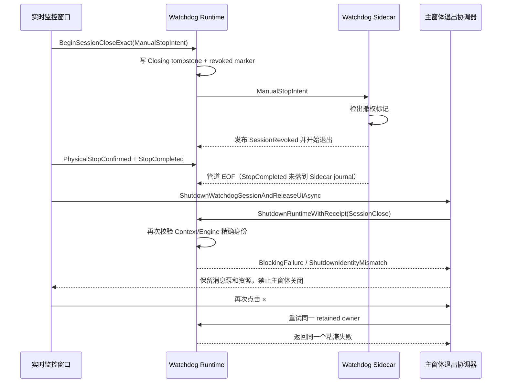

# V2.13.0.37 主程序无法退出事件分析

## 技术结论

V2.13.0.37 本次“多次点击主程序右上角 `×` 仍不退出”不是 WinForms 消息泵卡死，也不是设备断能、DAQ/SQLite 落盘或程控电源遥测封口一直未完成。**直接阻止退出的是 Watchdog 关闭事务返回的粘滞失败 `ShutdownIdentityMismatch`。**

人工停止链在 2026-08-30 00:56:25 先写入 Watchdog `Closing` tombstone 和撤权标记。Sidecar 在 00:56:25.505 已把会话发布为 `SessionRevoked`，并在 00:56:27.020 断开管道；主程序随后才完成 `PhysicalStopConfirmed/StopCompleted` 通知并启动 Runtime shutdown。关闭事务在同一会话的第二次身份校验中撞上已经被前述标记触发的 Sidecar/传输退场，将这次自致竞态判成 `ShutdownIdentityMismatch`。

该错误在关闭保留协调器中被设计为不可推进的 fail-closed 状态。每次点击 `×` 都会再等待约 15 秒，然后复用同一个失败回执，因而界面会短暂显示“正在安全退出…”，随后恢复为灰色主窗体；不会自行退出。最终只能由操作员在 00:59:07 强制结束进程。

结论置信度：**高**。现场日志、Watchdog 双端事件、持久化 tombstone、截图时间和 V2.13.0.37 标签源码的控制流相互吻合。

同时，封盘数据没有显示出因强杀导致的结构损坏：增量备份 I0008 的 188 个清单文件逐一通过长度和 SHA-256 复核，`index.db` 的 SQLite `quick_check` 为 `ok`，最后四个运行通道的末圈均为 `completed`，程控电源遥测文件已于 00:56:27.009 封口且 `dropCount=0`。**退出失败与本次试验数据损坏应分开定性。**

## 事件范围与证据边界

| 项目 | 取值 |
| --- | --- |
| 名义程序版本 | V2.13.0.37 / 文件版本 2.13.0.37 |
| 源码基线 | 当前 `HEAD` 与标签 `2.13.0.37` 同为 `621ebf0` |
| 现场进程 | `MTTFTest.exe`，PID 13596，32 位 |
| 现场可执行文件 | `D:\debug\2.13.0.37\MTTFTest.exe` |
| 现场 EXE SHA-256 | `cc0eac8e4e80d2b2aba82ac848027d196ce1206f6d42f0481f9f9344df8dbe09` |
| 本次 RunId | `7c2cab94a1114b52a34747ff24a1c555` |
| Watchdog SessionId | `2fefdc390f8f406f83d87bf0862a779a` |
| Stop CommandId | `f934d425e9ff47aca3ec15911b1e98e9` |
| StopSafetyTransactionId | `43aa7efff11a422a951bf3e3a402f6ec` |
| 封盘目录 | `D:\EPB_Data\Backups\10358-029a_V2.13.0.37_I0008_0830_0059` |
| 封盘归档 | `D:\EPB_Data\Backups\10358-029a_V2.13.0.37_I0008_0830_0059.7z` |
| 分析类型 | 现场证据回放 + 标签源码静态审计 + 备份完整性复核 |

需要保留一个发布证据限制：现场窗口标题显示 `[非受控包:PackageNotApproved]`，`runtime-build-identity.json` 也记录 `GitCommit=unknown`、`PackageVerified=false`、`GitDirty=True`。因此，现场 EXE 与标签源码的逐字节构建等价性没有由发布清单证明。尽管如此，现场日志中的状态名、错误名、15 秒行为和持久化结构均与标签源码精确对应，所以不影响本报告对运行机制的高置信度定位；它会影响严格的版本可追溯性。

## 关键时间线

以下时间均为现场本地时间（Asia/Shanghai）。

| 时间 | 证据 | 解释 |
| --- | --- | --- |
| 00:56:12.305 | `ui-info.log` | 接收暂停命令。 |
| 00:56:17.396 | `ui-info.log` | 四个运行通道完成当前圈并安全暂停。 |
| 00:56:25.224 | `ui-info.log` | 接收停止命令，开始安全断能和数据收口。 |
| 00:56:25.258 | Client journal seq 7 | 写入第 1 版 `WatchdogClosingTombstone`，Intent=`ManualStopIntent`，Generation=1，Lease=1。 |
| 00:56:25.274 | Sidecar journal seq 10 | Sidecar 收到 `ManualStopIntent`。 |
| **00:56:25.505** | Sidecar journal seq 11 | **Sidecar 已发布终态 `SessionRevoked`，Reason=`RevocationMarker`。** |
| 00:56:25.510 | `session-*.manifest.json` | 持久化终态为 `SessionRevoked`，早于设备侧停止完成。 |
| 00:56:27.011 | `ui-info.log` | 设备与数据侧停止完成，开始释放 Watchdog 精确会话。 |
| 00:56:27.015 | Client journal seq 9 | Client 记录 `StopCompleted`，`CanClose=True`。 |
| 00:56:27.017 | Sidecar journal seq 12 | Sidecar 只落到 `PhysicalStopConfirmed`；Sidecar journal 中没有 `StopCompleted/ManualStopCompleted`。 |
| 00:56:27.018–00:56:27.023 | Sidecar/Client journal | Host connection retired、管道关闭，Client Reader 收到 EOF。 |
| 00:56:27.046 | Client journal seq 12 | 写入第 2 版 tombstone，Intent=`SessionClose`；现场文件最终仍为 `State=Closing`。 |
| **00:56:42.169** | `warning.log` | 首次 15 秒收口后返回 `BlockingFailure; Reason=ShutdownIdentityMismatch`。 |
| 00:57:04.502 | `warning.log` | 主窗体关闭重试仍为同一个 `ShutdownIdentityMismatch`。 |
| 00:57:51.301 | `warning.log` | 再次点击关闭，结果不变。 |
| 00:58:50.642 | `warning.log` | 第三次可确认的主窗体重试仍不变。 |
| 00:59:07 | 现场截图 | 使用 Process Explorer 强杀 `MTTFTest.exe`。 |
| 00:59:39 | `backup-manifest.json` | I0008 增量封盘完成捕获，`snapshot_verified=true`。 |

截图与日志一致：


## 失败链路是如何形成的



### 1. 人工停止过早建立了会被 Sidecar 当成终态的撤权证据

人工停止在 `StopAll` 刚取得事务身份后，立即调用 `BeginSessionCloseExact(..., "ManualStopIntent", ...)`。见 [`FrmEpbMainMonitor.cs`](../../MTTfTest/FrmEpbMainMonitor.cs#L2698-L2712)。

`BeginSessionCloseExact` 的执行顺序是：

1. 第一次验证 Runtime Context 与 Engine 的 SessionId/Generation/Lease；
2. 将 Context/Pipeline/Ingress 标成 Closing；
3. 持久化 `.closing.json`；
4. 再调用一次 `TryMarkSessionClosing`，其中又做一次身份验证；
5. 写 `.revoked`，记录 journal 并 Flush。

对应代码见 [`WatchdogRuntime.cs`](../../MTTfTest/WatchdogRuntime.cs#L2541-L2625)。

Sidecar 的监控循环把 `IsSessionRevoked()` 作为终止条件。普通人工停止并不属于其特殊保护的“过渡窗人工停止”，因此它在检出撤权/closing 证据后发布 `SessionRevoked` 并取消自身。见 [`WatchdogHost.cs`](../../MTTFTest.Watchdog/WatchdogHost.cs#L1778-L1788)。现场 seq 10→11 正好证明了这条路径：`ManualStopIntent` 后 231 ms 即进入 `SessionRevoked`。

### 2. `StopCompleted` 到达得比 Sidecar 撤权退出晚

设备安全停止完成后，UI 才依次发送 `PhysicalStopConfirmed`、`StopCompleted`，然后调用 Main-owned Watchdog shutdown。见 [`FrmEpbMainMonitor.cs`](../../MTTfTest/FrmEpbMainMonitor.cs#L2784-L2796) 和 [`FrmEpbMainMonitor.cs`](../../MTTfTest/FrmEpbMainMonitor.cs#L2886-L2929)。

Sidecar 对 `StopCompleted` 的正常处理应发布 `ManualStopCompleted` 后取消自身，见 [`WatchdogHost.cs`](../../MTTFTest.Watchdog/WatchdogHost.cs#L1421-L1431)。但本次 Sidecar journal 中不存在该事件：它已经先被撤权路径推进到 `SessionRevoked`。Sidecar 只处理到 `PhysicalStopConfirmed`，随即退休连接；Client 虽记录了 `StopCompleted`，却没有取得对端对应终态。

因此，现场存在两个相互矛盾的终态视图：

| 文件/一侧 | 最终证据 |
| --- | --- |
| Sidecar manifest | `TerminalState=SessionRevoked`，00:56:25.510 |
| Sidecar event journal | 最后业务事件为 `PhysicalStopConfirmed`，随后 PipeDisconnected |
| Client event journal | 有 `StopCompleted`，随后两次 Reader EOF |
| `.closing.json` | `State=Closing`，Intent=`SessionClose`，没有推进到 Terminal |
| Runtime shutdown receipt | `FailClosed / ShutdownIdentityMismatch / Retained=True` |

### 3. 第二次身份校验把“本流程引起的退场”判成身份冲突

Runtime shutdown 重新进入 `BeginSessionCloseExact` 时，会先验证一次、写第 2 版 tombstone，再通过 `TryMarkSessionClosing` 进行第二次验证。验证要求 Engine 仍存在 active session，且 Context 引用、SessionId、Generation、Lease 全部稳定匹配。见 [`WatchdogRuntime.cs`](../../MTTfTest/WatchdogRuntime.cs#L2495-L2538)。

现场中，Sidecar/连接正好在这两段操作附近退出：00:56:27.020 管道断开，00:56:27.022/023 Client 收到 EOF，00:56:27.046 才记录第 2 版 tombstone。由此产生的 Engine/Context 过渡快照被判为 `IdentityMismatch`，而不是“同一会话已被本关闭事务撤权、继续收口”或“无会话可关”。

这里不能简单删除身份校验：三元身份门禁用于防止旧回调关闭新会话，是必要的 ABA 防护。缺陷在于**关闭 fence、Sidecar 终止语义和 Runtime retained owner 没有共享同一个原子/幂等的关闭事务**，导致自己的 closing marker 先拆掉了后续还要验证的对象。

### 4. `ShutdownIdentityMismatch` 是粘滞失败，重试不会推进

关闭协调器在首次收到 `IdentityMismatch` 时创建 `RetainedFailure` owner，并返回 `BlockingFailure`。见 [`WatchdogRuntime.ShutdownRetentionCoordinator.cs`](../../MTTfTest/WatchdogRuntime.ShutdownRetentionCoordinator.cs#L131-L157)。

后续重试进入 retained owner 后，代码明确把 `IdentityMismatch` 当成 sticky 状态，直接返回原回执，不再重新核实 Sidecar 已终止、同一 tombstone 已耐久或是否存在新会话。见 [`WatchdogRuntime.ShutdownRetentionCoordinator.cs`](../../MTTfTest/WatchdogRuntime.ShutdownRetentionCoordinator.cs#L177-L197)。

UI adapter 每次最多等待 15 秒；未取得 `IsCloseAuthorized` 就记录警告并保留资源。见 [`MainWatchdogUiLifecycleAdapter.cs`](../../MTTfTest/MainWatchdogUiLifecycleAdapter.cs#L295-L347)。这与 00:56:27→00:56:42 的首个间隔及随后多次点击的表现完全吻合。

主窗体 `FormClosing` 在发现 retained shutdown 或 UI 资源时主动设置 `e.Cancel=true`，再次进入同一协调器。见 [`Main_Frm.WatchdogUi.cs`](../../MTTfTest/Main_Frm.WatchdogUi.cs#L152-L170)。所以“点击无效”是当前 fail-closed 设计的确定结果，不是鼠标事件丢失。

### 5. 灰色空主窗体是子窗与主窗关闭授权不一致的可见结果

实时监控子窗在人工停止的设备安全凭证可复用后，会继续释放 DAQ、定时器、写盘器等资源并关闭自身；它不以 Watchdog `IsCloseAuthorized` 作为最终放行条件。见 [`FrmEpbMainMonitor.cs`](../../MTTfTest/FrmEpbMainMonitor.cs#L3012-L3053) 和 [`FrmEpbMainMonitor.cs`](../../MTTfTest/FrmEpbMainMonitor.cs#L3146-L3418)。

主窗体则仍受 retained Watchdog owner 门禁保护，因此留下截图中的灰色 MDI shell。这个现象进一步说明设备/监控资源已经完成退出，卡点发生在 Main-owned Watchdog 会话终态，而不是实时监控业务线程仍在运行。

## 为什么不是其他日志中的异常

### 不是 Raw/SQLite 持久化卡住

`ui-info.log` 在 00:56:26.385 已记录 `ClosePersistenceBoundary` 推进，00:56:27.011 明确记录“设备与数据侧停止完成”。Watchdog 失败回执中的 `PipelineTerminal=False/JournalFlush=False/JournalDisposed=False` 指的是 **Watchdog Runtime callback/journal 收口**，不是 EPB Raw/SQLite 数据库的持久化状态。

### 不是程控电源遥测文件没有封口

00:56:29.050 的警告是“遥测清理线程未在退出窗口内完成；保留其待处理封存段”。代码只有在 writer 已完成后才进入 cleanup wait，且该 cleanup 超时被明确设计成不阻止主进程退出。见 [`PowerSupplyTelemetryCsvRecorder.cs`](../../Controller/PowerSupplyTelemetryCsvRecorder.cs#L1639-L1658)。

现场遥测 manifest 进一步证明：CSV 在 00:56:27.009 已 `ended/sealed`，共 2100 行，`dropCount=0`、`eventDropped=0`，封盘中也不存在 `.tmp/.spill` 文件。因此这条警告不是主程序退出失败的原因。

### `PackageNotApproved` 不是本次直接根因，但必须整改

非受控包标记不会触发 `ShutdownIdentityMismatch`，两者在调用链上独立。不过现场 EXE 的 Git commit/build UTC 不可追溯，且目录中携带 PDB/调试候选特征。它会增加复现和责任边界的不确定性，应作为发布治理问题单独整改，不能用它替代本次已明确的 Watchdog 根因。

## 封盘数据完整性结论

### 封盘本体

对 `D:\EPB_Data\Backups\10358-029a_V2.13.0.37_I0008_0830_0059` 的复核结果：

| 检查项 | 结果 |
| --- | --- |
| Manifest schema | 4 |
| 备份类型 | incremental，序号 8 |
| Manifest 自带验证 | `snapshot_verified=true` |
| 清单数据文件 | 188 |
| 实际缺失文件 | 0 |
| 长度不匹配 | 0 |
| SHA-256 不匹配 | 0 |
| SQLite `pragma quick_check` | `ok` |
| SQLite `epb_cycles` 行数 | 114,515 |
| 活跃 SQLite sidecar | 无 `.wal/.shm/.journal` |
| 未封口遥测临时文件 | 无 `.tmp/.spill` |
| 7z CRC/结构测试 | `Everything is Ok` |
| 7z 内容 | 148 个目录、189 个文件、129,146,518 字节未压缩 |

7z 中的 189 个文件比 manifest 的 188 个数据文件多 1 个，正好是 `backup-manifest.json` 自身，数量一致。

### 最后有效圈

| EPB | 最后圈号 | `end_time` | 状态 | `mechanical_completed` |
| --- | ---: | --- | --- | ---: |
| 4 | 28,894 | 00:56:10.535 | completed | 1 |
| 5 | 28,898 | 00:56:11.242 | completed | 1 |
| 11 | 28,937 | 00:56:11.072 | completed | 1 |
| 12 | 25,876 | 00:56:11.937 | completed | 1 |

这些末圈随后都出现在 `Latest/` 和 `HistoricalSnapshots/` 的封盘变更中。停止命令在 00:56:25 才发出，故最后有效圈早于退出竞态约 13 秒，并已完成 SQLite 和文件侧落盘。

### 增量恢复链

I0008 不能脱离基线单独恢复，但现场目录中 B0001 与 I0002–I0008 的 `.7z` 全部存在。逐个读取其 manifest 后，所有 `previous_backup_id` 都精确指向前一序号，全部 `snapshot_verified=true`：

```text
B0001 025ea205... -> I0002 991839fa... -> I0003 21002cbc...
-> I0004 e874621a... -> I0005 6bf165c5... -> I0006 da90d9ca...
-> I0007 a3895f76... -> I0008 d8fc2cbd...
```

因此，本次强杀后取得的 I0008 具备可用的完整前序恢复链。仍建议在正式恢复演练中从 B0001 顺序回放到 I0008，并对还原目录再次执行 manifest 哈希与 SQLite 检查；本报告没有修改或实际回放生产备份。

### 强杀留下的可预期缺口

数据业务文件完整不等于退出事务完整。强杀后仍可见：

- `.closing.json` 停在 `State=Closing`，没有推进到 `Terminal`；
- Watchdog manifest 的终态是提前产生的 `SessionRevoked`，不是期望的 `ManualStopCompleted`；
- 没有正常的主进程退出完成日志；
- 00:59:07 之后当然不会再有应用内日志。

这些缺口影响 Watchdog 会话审计和优雅退出证明，不构成本次已完成试验圈数据损坏的证据。

## 版本与引入点

`git blame` 显示，本次关键链路由提交 `9b2c0509`（`fix(recovery): 闭环暂停停止与看门狗恢复所有权`，2026-08-29 14:07 +08:00）引入：

- 人工停止前置 `BeginSessionCloseExact`；
- `WatchdogClosingTombstone` 与后续 revoked marker；
- shutdown 的精确身份二次验证；
- Sidecar 对 closing/revoked 的新启动和运行期处理。

V2.13.0.37 包含该提交。项目持久日志还显示，前一个 PID 20496 程序实例在较早一轮停止时已经出现同类征兆：00:47:55 `ManualStopCompleted` 未达终态，00:48:13、00:48:16、00:48:32 三次主窗体关闭均被 retained shutdown 阻止。PID 13596 于 00:50:46 启动并开启本次试验，最终再次命中同一路径。前一实例的发布身份没有随 I0008 一起保留，不能据此断言其精确版本或 EXE 哈希；但重复的状态名和关闭行为说明问题不是 00:59 的偶发鼠标/UI 现象，而是至少跨两个进程实例重复出现的停止—关闭协议缺陷。

现有测试覆盖了孤立的 Engine 身份冲突、retained failure 和 UI 保留行为，但在 `Tests/AdaptiveControlTests` 中没有找到直接调用 `BeginSessionCloseExact` 并启动真实 Sidecar/NamedPipe、再走完整 `ManualStopIntent -> PhysicalStopConfirmed -> StopCompleted -> Runtime shutdown -> Main close` 的端到端用例。测试分别验证了局部安全规则，却漏掉了这些规则组合后的自致竞态。

## 整改建议

### P0：统一关闭事务的所有权和顺序

1. **区分“禁止重拉”的 Closing fence 与“允许 Sidecar 退出”的 Terminal marker。** `WatchdogClosingTombstoneState.Closing` 只应撤销自动恢复/新拉起许可，不应让 Sidecar 立即发布终态并取消管道。只有 `Terminal`、已确认的 `StopCompleted` 或明确的 application-exit 协议才结束 Sidecar。

2. **不要在普通人工停止的 Closing 阶段写入会被 Sidecar 当作终态的 legacy `.revoked`。** 若必须保留兼容 marker，应让 Sidecar 根据状态/事务 ID 判断“保持监督直到 StopCompleted”，而不是把所有 marker 统一解释为 SessionRevoked。

3. **把 close fence 回执交给后续 Runtime shutdown 幂等复用。** 同一 SessionId/Generation/Lease、同一 StopSafetyTransactionId、同一 boundary generation 已有耐久 fence 时，不应再创建第二次独立标记和二次竞态校验；应由一个 retained owner 从 Fence 一直推进到 Engine、Pipeline、Journal Terminal。

4. **保留 ABA 防护，精确区分三种情况。**

   - 新会话已激活且三元身份不同：继续 `ShutdownIdentityMismatch`，fail closed；
   - 同一会话因本关闭事务已无 Engine session，且 durable fence/Sidecar terminal evidence 匹配：按“同一事务已撤权”继续收口；
   - 身份不可证明：保持失败，但输出 expected/current SessionId、Generation、Lease、ConnectionGeneration 和 tombstone version，不能只写一个总括错误名。

5. **避免不可恢复的永久 UI 门禁。** 当设备 OFF、Raw/SQLite 边界完成、同一 Watchdog 会话已耐久撤权且不存在替代会话时，应有可证明的收敛路径生成 terminal 或 detached-retained 回执；不能让相同失败无限重放。这里的放行必须基于精确证据，不能用全局超时直接绕过 Watchdog 安全门禁。

### P1：改进可诊断性和操作员反馈

- `ShutdownIdentityMismatch` 日志增加 expected/current 完整身份、active context 引用是否稳定、Engine session active、tombstone state/version、Sidecar PID/start ticks。
- 主窗体 15 秒重试失败后显示明确状态，例如“设备与数据已安全；Watchdog 会话终态失败：ShutdownIdentityMismatch；再次点击不会推进，请导出诊断包”。
- 灰色 MDI shell 上保留一个只读退出诊断面板，显示最近回执和建议操作，避免操作员只能反复点击 `×`。
- 发布包必须通过身份校验；禁止 `PackageNotApproved`/dirty candidate 进入现场正式运行。

## 必须补充的回归测试

| 场景 | 注入点 | 必须通过的结果 |
| --- | --- | --- |
| 普通人工停止后关闭 | 真实 Sidecar + NamedPipe | Sidecar 在 `StopCompleted` 前不退出；Runtime 回执 Terminal；主窗体有界关闭。 |
| tombstone 写入与 Engine mark 竞态 | 两次身份验证之间让管道 EOF | 同一 lease 的自致退场不能误判为新会话冲突；不得削弱 ABA 防护。 |
| Sidecar 先收到 revoked/closing | 延迟 `PhysicalStopConfirmed` 1–3 秒 | Sidecar 保持监督和接收能力，最后 journal 含 `ManualStopCompleted`。 |
| 真正 ABA 替换会话 | 关闭期间激活新 lease | 旧 owner 必须稳定返回 `ShutdownIdentityMismatch`，且绝不能关闭新会话。 |
| 连续“停止—重新开始—停止—退出” | 同一 Main_Frm 两轮会话 | 第二轮不继承第一轮 close authorization/retained failure，最终可退出。 |
| 连续点击主窗体 `×` | shutdown 正在进行及失败后 | 同一任务 single-flight，不重复释放；可恢复失败能推进，粘滞失败给出明确诊断。 |
| 退出数据门禁 | 末圈 + 遥测 cleanup 延迟 | SQLite/Raw/Latest/telemetry 已封口，cleanup 慢不误阻塞，也不丢临时证据。 |
| 强杀后再启动 | 保留 Closing tombstone | 新进程能识别上次已物理安全但会话未优雅终止，并给出一致审计，不误恢复旧试验。 |

建议验收时至少连续执行 100 次“启动一小段试验 → 暂停 → 停止 → 关闭监控子窗 → 关闭主程序”，并单独执行 100 次“停止按钮尚在释放 Watchdog 时立即点击主程序 `×`”。每次必须满足：进程有界退出、无强杀、无 `ShutdownIdentityMismatch`、Sidecar journal 终态正确、末圈数据和遥测 manifest 完整。

## V2.13.0.37 现场临时处置建议

在修复版本发布前，如果再次出现同样问题：

1. 先通过界面和日志确认停止事务已经完成设备 OFF 与持久化边界；至少看到“设备与数据侧停止完成”，并确认电源/电机实际安全状态；
2. 若 `warning.log` 已明确出现 `ShutdownIdentityMismatch`，继续点击 `×` 在该版本中不会推进，只会每次再等待约 15 秒；
3. 保存 `log/`、`WatchdogSessions/`、`Recovery/`、`runtime-build-identity.json`，再执行封盘；
4. 只有在设备输出、安全压力和数据封口均已由现场规程确认后，才把强制结束作为 V2.13.0.37 的最后手段；
5. 重启前检查上次 `.closing/.revoked` 和 unattended recovery 状态，避免误把旧会话当成可恢复运行。

这只是旧版本故障处置，不是产品级修复。正式版本必须让关闭协议本身有界收敛。

## 限制与后续问题

- 强杀前没有抓取进程 dump/线程栈；本报告无法提供 00:59:07 时每个托管线程的栈。不过日志已明确给出主动拒绝关闭的状态和原因，不依赖线程栈才能定位直接根因。
- 现场包未通过发布身份校验，无法用 manifest 证明 EXE 来自 `621ebf0` 的干净构建；修复验证必须改用批准的发布包。
- 本报告验证了 I0008 本体、SQLite 和增量链清单，没有把 B0001→I0008 实际恢复到新目录；正式归档验收仍应做一次只读恢复演练。
- 需要确认为何普通人工停止没有进入 Sidecar 的 `IsTransitionOperatorStopInProgress()` 保护分支。现场事件已证明该保护没有生效，但要决定最终协议模型，仍需在修复实现时审计该状态的设置者和生命周期。

## 证据索引

- `D:\EPB_Data\Backups\10358-029a_V2.13.0.37_I0008_0830_0059\log\ui-info.log`
- `D:\EPB_Data\Backups\10358-029a_V2.13.0.37_I0008_0830_0059\log\warning.log`
- `D:\EPB_Data\Backups\10358-029a_V2.13.0.37_I0008_0830_0059\log\run.log`
- `D:\EPB_Data\Backups\10358-029a_V2.13.0.37_I0008_0830_0059\WatchdogSessions\session-2fefdc390f8f406f83d87bf0862a779a.client-events.jsonl`
- `D:\EPB_Data\Backups\10358-029a_V2.13.0.37_I0008_0830_0059\WatchdogSessions\session-2fefdc390f8f406f83d87bf0862a779a.sidecar-events.jsonl`
- `D:\EPB_Data\Backups\10358-029a_V2.13.0.37_I0008_0830_0059\WatchdogSessions\session-2fefdc390f8f406f83d87bf0862a779a.closing.json`
- `D:\EPB_Data\Backups\10358-029a_V2.13.0.37_I0008_0830_0059\WatchdogSessions\session-2fefdc390f8f406f83d87bf0862a779a.manifest.json`
- `D:\EPB_Data\Backups\10358-029a_V2.13.0.37_I0008_0830_0059\WatchdogSessions\session-2fefdc390f8f406f83d87bf0862a779a.json`
- `D:\EPB_Data\Backups\10358-029a_V2.13.0.37_I0008_0830_0059\backup-manifest.json`
- `D:\EPB_Data\Backups\10358-029a_V2.13.0.37_I0008_0830_0059\index.db`
- `D:\EPB_Data\Backups\10358-029a_V2.13.0.37_I0008_0830_0059\Config\runtime-build-identity.json`
