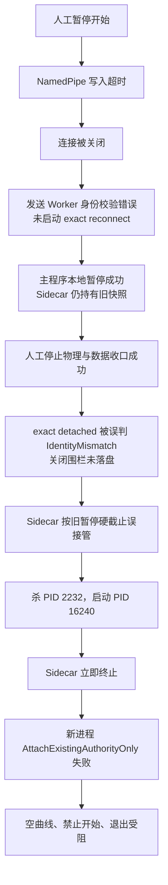

# V2.13.0.38 暂停误接管、停止终态失败与退出阻塞分析及整改方案

> 文档状态：根因已确认，整改方案已锁定；V2.13.0.39 代码与本地自动化验证已完成，真机验收待执行。
> 现场结论：**V2.13.0.38 不具备生产放行条件，应立即停止继续扩散。**
> 后续目标版本：V2.13.0.39 受控候选包。
> 分析日期：2026-08-30。
> 实施结果：[V2.13.0.39 暂停误接管、停止终态与退出闭环修复实施及验证](./2026-08-30_V2.13.0.39_暂停误接管_停止终态与退出闭环修复实施及验证.md)。

## 1. 执行摘要

本次故障不是“人工暂停没有完成”，也不是电机、电源或液压没有执行安全动作。现场日志证明：

- 人工暂停已经在 10:31:20.952 完成；
- 暂停期间触发的 DAQ 时钟模型恢复在 10:31:22.223 前完成，系统保持安全暂停，可继续试验；
- 人工停止后，电机 DO、电源、液压和数据持久化均在 10:31:50.249 前完成；
- 真正失效的是 **Watchdog 通信断开后的重连、停止终态封口、Sidecar 与空闲重启进程的身份交接，以及 UI 退出授权**。

完整故障链如下：

1. 暂停过程中发生一次 Watchdog NamedPipe 写入超时；
2. Client 关闭了旧连接，但把发送队列 Owner 错当成 monitor/reconnect Worker 身份，重连请求被自身门禁拒绝；
3. 主程序继续完成暂停和停止，但 Sidecar 永远停留在断线前的 `ManualPausePending/CurrentCycleDrain` 快照；
4. 人工停止建立关闭围栏时，Runtime 又把“精确会话仍一致、仅连接已断开”误判成 `IdentityMismatch`，无法生成耐久停止证据；
5. Sidecar 到达旧的暂停硬截止后误认为暂停未完成，杀死原进程并启动空闲进程；
6. Sidecar 在启动空闲进程后立即发布终态并退出，而新进程要求附着同一存活 Sidecar，导致 `AttachExistingAuthorityOnly` 必然失败；
7. 新进程没有可用的 Watchdog/DAQ/UI 精确会话，出现空曲线、禁止新试验和 `ShutdownIdentityMismatch` 粘滞失败；
8. 主窗口和监控窗口把 Watchdog 唯一终态作为退出的必要条件，于是右上角 `×` 永久失效，只能强杀。



## 2. 证据范围与版本身份

### 2.1 现场封存

现场封存目录：

`D:\EPB_Data\Backups\10358-029a_V2.13.0.38_I0010_0830_1034`

关键身份：

| 项目 | 值 |
| --- | --- |
| 项目 | `10358-029a` |
| 版本 | `V2.13.0.38` |
| Watchdog SessionId | `8214342051a44dbda3fae8bb4e581c51` |
| RunId | `605a2d1b69054d77a8533630137eb8b1` |
| RunEpoch | `1` |
| 原主进程 | PID `2232` |
| Sidecar | PID `19644` |
| Watchdog 启动的新进程 | PID `16240` |
| 人工停止 CommandId | `92f7ae0af02048998a5b89fbdc498bbb` |
| 参与通道 | EPB `4、5、11、12` |
| 周期 | `15000 ms` |

备份清单记录：

- schema：4；
- 增量序号：10；
- 文件数：219；
- 清单总大小：约 130.04 MiB；
- `snapshot_verified=true`；
- `index.db` 的备份时完整性结果为 `ok`；
- 本备份是增量包，完整恢复仍需按 `base_backup_id/previous_backup_id` 串接备份链。

### 2.2 现场二进制与仓库二进制完全一致

现场 `runtime-build-identity.json` 记录：

```text
ExecutablePath = D:\debug\2.13.0.38\MTTFTest.exe
SHA-256       = 3bdf718513b9f7ef393407d53249fa677191c974df46d2b1a3c877fc82aa6581
```

仓库中 `MTTfTest\bin\2.13.0.38\MTTFTest.exe` 的 SHA-256 同样为：

```text
3bdf718513b9f7ef393407d53249fa677191c974df46d2b1a3c877fc82aa6581
```

因此，本报告不是根据“相近源码”推测，而是针对现场实际运行二进制完成的分析。

### 2.3 `PackageManifestMissing` 的性质

窗口标题中的 `[非受控包:PackageManifestMissing]` 不是本次通信和退出故障的直接原因。现场二进制身份已经通过 SHA-256 精确匹配，故障也能由当前实现的状态机逻辑完整解释。

但该标记说明现场目录不是经过正式包清单校验的受控发布包，无法证明所有 EXE/DLL/配置来自同一次构建。V2.13.0.39 的现场验收必须使用带 package manifest 和逐文件哈希的受控包，标题不得再出现该标记。

## 3. 现场时间线

### 3.1 试验、暂停与断线

| 时间 | 事件 | 证据与判断 |
| --- | --- | --- |
| 10:26:53.479 | Watchdog 会话建立 | Session `8214…1c51`，原进程 PID 2232 |
| 10:26:53.668 | 启动通道 4、5、11、12 | 自学习 10 圈，随后进入正式运行 |
| 10:31:03.545 | 人工暂停命令被接收 | 动态硬截止为 60 秒，约 10:32:03.235 |
| 10:31:10–13 | 各通道完成当前圈 | EPB 4、5、11、12 依次退出活动圈 |
| 10:31:12.784 | Client 记录发送失败 | `Send:命名管道写入超时` |
| 10:31:12.790 | Sidecar 退休连接 | 随后出现 PipeDisconnected/HeartbeatSuspect |
| 10:31:12.888 | 主程序警告 | `WatchdogTransportError Reason=Send` |
| 10:31:14.421 | 暂停进入持久化阶段 | `全断能已提交，正在完成数据持久化边界` |
| 10:31:20.872 | 批次状态转为 Paused | 所有通道安全暂停 |
| 10:31:20.952 | UI 宣布暂停完成 | CommandId `a08c…7505` |
| 10:31:21.647 | DAQ 时钟模型异常 | Dev1、Dev2 进入软件恢复；不是暂停失败 |
| 10:31:22.164–223 | DAQ 恢复完成 | 保持安全暂停，允许继续试验 |

Sidecar 最后收到并确认的是心跳序号 254。该心跳仍为：

- `Phase=ManualPausePending`；
- `ManualPauseStage=CurrentCycleDrain`；
- `ActiveCycleCount=1`；
- `EnergizedChannelCount=1`；
- `OutputsConfirmedOff=false`；
- `RunActive=true`。

主程序在此之后发生的“全部通道暂停、输出关闭、DAQ 恢复”没有再传到 Sidecar。

### 3.2 人工停止实际完成

| 时间 | 事件 | 证据与判断 |
| --- | --- | --- |
| 10:31:49.975 | 操作员点击停止 | CommandId `92f7…8bbb` |
| 10:31:50.002 | 关闭围栏失败 | `Mark=IdentityMismatch`，但 expected/current 三元身份完全一致，唯一差异是 `EngineAttached=false` |
| 10:31:50.012–013 | 电机 DO 全部关闭 | Dev1/Dev2 合并位图写入成功 |
| 10:31:50.100–120 | 四组程控电源关闭 | 电源组 1–4 均记录已关闭 |
| 10:31:50.092–094 | 两路液压强制释放 | DO Off、AO=0 |
| 10:31:50.208 | 压力安全确认 | 液压 1 为 -0.076 bar，液压 2 为 -0.162 bar，均低于 5 bar 阈值 |
| 10:31:50.249 | 数据持久化完成 | Dev1/Dev2 Raw、Persistence 均 drained，队列与 in-flight 为 0 |
| 10:31:51.738 | UI 宣布设备与数据侧完成 | 开始尝试释放 Watchdog 精确会话 |
| 10:31:51.742 | Client 本地记录 StopCompleted | 该消息无法通过已断开的管道送达 Sidecar |
| 10:31:51.749 | 关闭被阻止 | `ShutdownIdentityMismatch` 被保留为 sticky blocking failure |

结论：**人工停止的物理安全和数据安全成功，失败的是 Watchdog 生命周期终态。**

### 3.3 错误接管与重启失败

| 时间 | 事件 | 证据与判断 |
| --- | --- | --- |
| 10:32:03.675 | Sidecar 触发暂停接管 | `ManualPauseSafetyTakeoverRequested/ManualPauseHardDeadlineExceeded` |
| 10:32:18.866 | 请求原进程 MiniDump | 生成约 17.4 MiB dump |
| 10:32:19.201 | 原 PID 2232 被终止 | `ManualPauseOldProcessTerminated` |
| 10:32:19.414 | 启动 PID 16240 | `IdleProcessLaunched; AutoResume=false` |
| 10:32:19.424 | Sidecar 发布终态 | `ManualPauseIdleRestartLaunched`，随后退出 |
| 10:32:22.901 | 新进程附着被拒绝 | `RecoveryAuthorityRejected` |
| 10:32:22.908 | Transport fail-closed | `InvalidConfiguration:AttachExistingAuthorityOnly` |
| 10:32:22.964 | 空闲预检失败 | 开始试验保持禁用 |
| 10:32:23.021 | 未观察任务异常 | `TaskScheduler.UnobservedTaskException` |
| 10:32:24.610 起 | 多次退出均失败 | 重复 `ShutdownIdentityMismatch` |
| 10:33:35 | 再次开始试验被拒绝 | `人工停止组合终态未完成` |
| 10:34:09 | 人工强杀 PID 16240 | Process Explorer 截图证据 |

## 4. 根因分析

### 4.1 P0：发送超时后重连被错误的 Worker 身份门禁拒绝

相关实现：`Watchdog.Client/WatchdogClientTransportEngine.cs`。

发送队列在 `RunSendQueue` 中等待 `WriteLineAsync`。超过 `SendWriteTimeoutMs` 后，它调用：

```text
BreakTransport(... expectedWorkerIdentity: SendQueueOwner, fromSendWorker: true)
```

`BreakTransport` 成功关闭精确连接后，又把同一个 `SendQueueOwner` 传给：

- `ReportTransportLostOnce`；
- `TryScheduleReconnect`；
- `TryCaptureAttachOnlyReconnectScope`。

然而后两处的合法 Worker 只有：

- `_monitorTaskIdentity`；
- `_reconnectTaskIdentity`。

`SendQueueOwner` 不可能与这两个对象引用相同，因此发送超时路径会稳定发生：

```text
关闭连接成功
→ TransportLost 回调被拒绝
→ Reconnect 调度被拒绝
→ EngineActive=true / EngineAttached=false 永久保留
```

这与现场现象完全一致：client journal 有发送错误，但没有后续有效的 `TransportLost → ReconnectStarted → ExactAttached`。

这不是简单地把 500 ms 超时加大就能根治。即使扩大到 1000 ms，其他现场抖动仍可能触发同一路径。正确修复必须让发送 Worker 使用精确 Session/Connection 身份触发重连，而不是冒充 monitor/reconnect Worker。

### 4.2 P0：精确会话断线被错误归类为身份冲突

相关实现：`MTTfTest/WatchdogRuntime.cs` 的 `TryMarkSessionClosing`、`ValidateExactClosingIdentity` 和 `BeginSessionCloseExact`。

现场关闭诊断已经证明：

| 比较项 | 结果 |
| --- | --- |
| ContextStable | `true` |
| ContextReferenceExact | `true` |
| Expected Session/Generation/Lease | `8214…1c51 / 1 / 1` |
| Current Session/Generation/Lease | `8214…1c51 / 1 / 1` |
| ActiveLease | `1` |
| EngineActive | `true` |
| EngineAttached | `false` |
| 既有 Tombstone | 无 |

因此这不是 ABA，也不是新会话替换。它只是相同精确会话的 Transport 已断开。

当前实现先要求 Engine 的 closing CAS 成功；连接已经断开时 CAS 返回 false，随后只区分“没有 Engine session”和“IdentityMismatch”，最终落入后者。结果是：

- 无法写入关闭 tombstone；
- Sidecar 看不到人工停止意图；
- Runtime retention 进入不可恢复的 sticky failure；
- `StopSessionReceipt.CanRestart` 永远为 false；
- 退出门禁永久扣留 UI。

需要增加 `ExactSessionDetached`，把“精确身份一致、连接代际已清除”和“精确身份真的变化”分开。

### 4.3 P0：空闲重启的生产者和消费者协议互相矛盾

相关实现：

- `MTTFTest.Watchdog/WatchdogHost.cs` 的 `ManualPauseSafetyTakeoverAsync`、`ManualStopTakeoverAsync`、`LaunchIdleRestart`；
- `MTTfTest/Main_Frm.UnattendedRecovery.cs` 的 `EnterWatchdogSafeIdleAsync`；
- `MTTfTest/WatchdogRuntime.cs` 的 `AttachRecoverySessionAsync`。

Sidecar 的现有顺序是：

```text
启动空闲进程
→ PublishTerminal(ManualPauseIdleRestartLaunched)
→ _stop.Cancel()
→ Sidecar 退出
```

空闲进程的要求却是：

```text
使用启动参数中的 Sidecar PID/start/nonce
→ AttachExistingAuthorityOnly
→ 必须连接仍存活的同一个 Sidecar
→ exact Attached 后才允许 UI Ready
```

Sidecar 在子进程完成 attach 前就退出，子进程失败是确定性的，不是偶发竞态。现场的 `RecoveryAuthorityRejected`、空曲线和开始按钮禁用正是这一矛盾的直接结果。

人工暂停、人工停止和应用退出不应再启动完整 UI。真正需要异常安全接管时，应启动无界面的单次安全关闭 Worker，并采用两阶段交接：`Accepted → Completed`。

### 4.4 P0：UI 退出授权把软件协议故障错误提升为“永久禁止退出”

相关实现：

- `MTTfTest/Main_Frm.WatchdogUi.cs`；
- `MTTfTest/FrmEpbMainMonitor.cs`；
- `MTTfTest/EpbMonitorShutdownOwnership.cs`；
- `MTTfTest/WatchdogRuntime.ShutdownRetentionCoordinator.cs`。

当前 `StopSessionReceipt` 只有一个 `CanRestart/CanClose` 终态，要求：

- StopSafety 满足关闭条件；
- ManualExitIntent 与 StopSafety 完全匹配；
- Watchdog Runtime 必须 `IsTerminal`；
- UI 资源必须释放。

这混淆了两个强度不同的授权：

1. **重新上电并创建新试验会话**：必须最严格；
2. **关闭已经安全断能的旧 UI 进程**：允许完整终态，或允许把尚未确认的安全责任耐久交给独立安全 Owner。

一旦 Watchdog 身份门禁自身发生软件错误，UI 就没有第二条合法退出路径。`ShutdownIdentityMismatch` 又被设计为 sticky，所以重复点击只能重复加入同一失败任务。

此外，现有 `StopSessionReceipt.CanRestart` 使用 `StopSafety.CanCloseApplication`，而不是更严格的 `CanRestartInProcess`。前者不完整要求压力安全、逻辑静默和数据连续性，不适合作为重新开始试验的授权。

### 4.5 触发因素，不是根因

暂停期间同时观察到：

- DAQ 回调约 1009 ms 间隔；
- EPB12 安全断能；
- PSU2 一次 1500 ms SCPI 查询超时；
- Dev1/Dev2 时钟模型短暂失效并自动恢复。

这些负载和硬件抖动增加了 NamedPipe 500 ms 写超时的概率，但它们不应造成永久失联。一个正确的 Transport 状态机必须能从单次发送超时恢复。

## 5. 已排除的错误方向

| 怀疑方向 | 结论 |
| --- | --- |
| 人工暂停算法没有完成 | 排除；本地暂停、持久化和 DAQ 恢复均有完成凭证 |
| 停止时电机未关闭 | 排除；四通道 DO_OFF 均成功 |
| 程控电源未关闭 | 排除；四组电源均有关闭记录 |
| 液压未卸压 | 排除；两路压力均已降到接近 0 bar |
| 最后一批数据未落盘 | 排除；Dev1/Dev2 均 drained、closed、无队列和 in-flight |
| `PackageManifestMissing` 直接导致状态机失败 | 排除；它是发布身份风险，不是本次逻辑根因 |
| 单纯延长暂停硬截止即可解决 | 否；只会延后误杀，无法修复断线、终态和交接矛盾 |

## 6. 整改后的系统不变量

后续实现必须同时满足以下不变量：

1. 单次 Transport 写失败不得永久破坏精确会话；权威 Sidecar 存活时必须自动重连。
2. 同一 SessionId/Generation/Lease 的 detached 状态不是 IdentityMismatch。
3. 真正不同的 SessionId/Generation/Lease 仍然 fail-closed，旧 Owner 不得关闭新会话。
4. 人工暂停完成后保留同一 RunId/RunEpoch 和剩余次数，继续试验不得创建新会话。
5. 人工停止一旦成立，自动恢复、自动续跑和完整 UI 重启许可立即撤销。
6. 正常停止必须确认电机 OFF、电源 OFF、压力安全、持久化完成和逻辑静默，才允许同进程重新开始。
7. 主 UI 退出只有两条合法路径：完整安全终态，或独立安全 Owner 的耐久接管已经成立。
8. 异常安全交接只能启动无界面、单次、不可续跑的安全 Worker。
9. 正常停止完成后 Sidecar 必须退出；不得无谓杀主程序或重启程序。
10. 关闭窗口的重复点击只加入同一 single-flight，不重复 StopAll、Flush 或 Watchdog shutdown。

## 7. 详细整改方案

### 7.1 Transport：精确断线作用域与自动重连

新增内部枚举和不可变作用域：

```text
TransportBreakOrigin
  - SendWorker
  - ReaderMonitor
  - ReconnectWorker

TransportBreakScope
  - SessionLease
  - ConnectionGeneration
  - ConnectionIdentity
  - Origin
  - WorkerIdentity
```

行为规则：

- `CloseTransportOnly` 仍对 SessionLease、ConnectionGeneration 和 ConnectionIdentity 做精确 CAS；
- `SendWorker` 在关闭成功后，以冻结的 Session/Connection 身份调度 reconnect，不再拿 `SendQueueOwner` 与 monitor/reconnect Worker 比较；
- monitor/reconnect 来源仍校验各自 WorkerIdentity，保留旧 Worker 隔离；
- `AttachExistingAuthorityOnly` reconnect 必须重新验证 Sidecar PID/start/nonce 存活且未复用；
- 重连成功后立即发送当前最新心跳，不等待下一个周期；
- 心跳为状态快照，暂停已完成时第一帧必须体现 `ManualPauseStage=Completed`、输出已 OFF、DAQ 健康状态；
- 生命周期发送队列继续优先于普通心跳，Heartbeat 允许合并，停止/退出消息不得被普通心跳挤掉。

发送超时的标准序列必须可观察：

```text
TransportWriteTimeout
→ TransportLost
→ ReconnectStarted
→ ReconnectAttempt
→ ExactAttached
→ ImmediateStateSnapshot
```

### 7.2 耐久人工暂停进度

新增原子写透文件 `session-<id>.manual-pause.json`，schema 1。由 Runtime 从 `EpbManager.CaptureManualPauseProgress()` 和当前心跳中生成，Controller 不直接依赖 Watchdog 程序集。

最小字段：

| 字段 | 作用 |
| --- | --- |
| SessionId/Generation/Lease | 防止跨会话误认 |
| RunId/RunEpoch | 绑定原试验 |
| PauseCommandId | 幂等暂停事务 |
| Revision | 单调版本 |
| Stage | CurrentCycleDrain/PhysicalOff/PersistenceDrain/Completed/Resumed/Fault |
| HardDeadlineUtc | Sidecar 使用的原始截止 |
| SelectedChannels | 冻结通道集合 |
| OutputsOffConfirmed | 电机和电源证据 |
| PressureSafeConfirmed | 液压安全证据 |
| PersistenceDrained | 数据边界证据 |
| DaqReady | 暂停恢复后 DAQ 新鲜度证据 |
| UpdatedUtc | 新鲜度校验 |

Sidecar 在判断 `ManualPauseHardDeadlineExceeded` 前必须同时读取：

1. 最新 NamedPipe 心跳；
2. 最新耐久人工暂停进度；
3. 同会话关闭围栏。

任一精确证据显示 `Completed` 或人工停止已成立，均取消暂停接管。`Resumed` 只能由同一 RunId/RunEpoch、exact Attached 且 DAQ Ready 的主程序写入。

### 7.3 Closing tombstone v2

现有 closing tombstone 升级到 schema 2，保留 v1 字段并增加：

- `SafetyStage`；
- `MotorOffConfirmed`；
- `PowerOffConfirmed`；
- `PressureSafeConfirmed`；
- `PersistenceDrained`；
- `LogicalQuiescenceConfirmed`；
- `DataContinuityCompromised`；
- `SafetyOwner`；
- `HandoffState`；
- `CompletedUtc`。

状态单调推进：

```text
ClosingIntent
→ PhysicalSafe
→ DataDrained
→ LogicalQuiescent
→ Terminal
```

任何缺失项不得倒退或伪造。v1 只兼容为 `ClosingIntent`，不能视为物理安全或 Terminal。

`RuntimeShutdownMarkOutcome` 增加：

- `ExactSessionDetached`：公开三元身份一致，Transport 已断；允许写精确围栏；
- `IdentityMismatch`：公开三元身份或 active context 确实变化；禁止接触替代会话；
- `TombstonePersistenceFailed`：无法建立耐久证据；不得伪造终态。

### 7.4 Sidecar 决策矩阵

| 证据 | 主进程 | Sidecar 行为 |
| --- | --- | --- |
| 暂停 Completed | 存活 | 取消暂停接管，保持原会话，等待继续或停止 |
| ClosingIntent | 存活 | 立即撤销 relaunch/auto-resume，等待安全阶段推进 |
| Terminal | 任意 | 发布正常停止/退出终态并退出 |
| 精确安全交接 Accepted | 退出中/已退出 | 保持权威，启动或监督无界面安全 Worker |
| 物理安全未确认且无交接 | 存活但无响应 | 请求 StopAll；达到策略后转安全交接，不启动 UI |
| 不同会话身份 | 任意 | 隔离旧会话，不关闭新会话；旧 UI 释放自身资源后允许退出 |

`ManualPauseSafetyTakeoverAsync` 和 `ManualStopTakeoverAsync` 必须在以下位置重新校验耐久证据：

1. 显示接管提示前；
2. 发送 RequestStopAll 前；
3. 捕获 dump 前；
4. 杀原进程前；
5. 启动安全 Worker 前；
6. 发布终态前。

人工停止或 Terminal 在任一点出现，都必须线性化地取消旧暂停接管。

### 7.5 有界安全交接

当正常 StopAll 在现有 15 秒关闭预算内无法取得完整物理安全凭证时：

1. 主程序继续保持输出关闭请求；
2. 原子写入 safety handoff 请求，包含精确会话、停止事务、Run、尚缺的安全项和已完成的数据边界；
3. Sidecar 校验精确身份并写入 `SafetyHandoffAccepted`；
4. 主程序只有在 Accepted 已耐久且 Sidecar 身份仍存活时，才获得 UI 退出授权；
5. 原主进程退出后，Sidecar 使用一次性 permit 启动：

```text
MTTFTest.exe --watchdog-safety-shutdown ...
```

6. 该入口不创建 Main_Frm、不创建监控窗口、不恢复 Run，只加载安全关闭所需配置和硬件接口，幂等执行电机 OFF、电源 OFF、液压卸压与回读；
7. Worker 写入并发送 `SafetyHandoffCompleted` 后退出；
8. Sidecar 发布最终安全终态并退出。

新增协议消息：

- `SafetyHandoffRequested`；
- `SafetyHandoffAccepted`；
- `SafetyHandoffCompleted`。

普通无人值守运行崩溃恢复继续使用原有恢复路径。人工暂停、人工停止和应用退出不再使用 `LaunchIdleRestart` 打开完整 UI。

### 7.6 重新开始与退出授权分离

`StopSessionReceipt` 拆分：

```text
CanStartNewSession
CanExitApplication
```

`CanStartNewSession` 必须同时满足：

- `StopSafety.CanRestartInProcess=true`；
- 压力安全；
- 持久化完成；
- 逻辑静默；
- 数据连续性未受损；
- Watchdog 精确会话 Terminal；
- UI/Transport 资源已释放。

`CanExitApplication` 满足任一条件：

1. 正常完整终态；
2. 精确 `SafetyHandoffAccepted` 已耐久，且旧进程不再拥有可执行安全回调或硬件 lease。

`SafetyHandedOff` 只允许退出，不允许在当前进程重新开始。

### 7.7 监控窗口与主窗口关闭

新增 Main-owned/Monitor-owned 单一关闭协调器，所有入口共享同一个任务：

- 人工停止；
- 监控窗口 `×`；
- 主窗口 `×`；
- Watchdog takeover exit。

UI 行为：

- 第一次关闭立即取消 WinForms 当前轮关闭并启动异步 single-flight；
- 超过 250 ms 后显示程序化遮罩、Marquee ProgressBar/转菊花和阶段文字；
- 阶段至少包括“停止电机”“关闭供电”“液压卸压”“保存数据”“释放 Watchdog”“关闭窗口”；
- 重复点击只聚焦/刷新同一进度，不重复调用 StopAll；
- 关闭阶段不弹阻止退出的模态 MessageBox；错误写入日志、诊断包和遮罩文字；
- 监控窗口成功关闭后，Main_Frm 缓存精确 `ApplicationCloseReceipt`；
- 主窗口后续关闭若无 MDI 子窗、无 active batch、无硬件 lease、已有 Terminal/HandedOff 回执，则只做轻量日志 flush 和 `Close()`，不得再次等待 15 秒；
- 主窗口现场目标：监控窗口已关闭后，1 秒内退出。

遮罩控件运行时创建，不修改任何 `*.Designer.cs`。

### 7.8 协议和兼容

- Watchdog protocol/current minimum compatible version 同步提升到 4；
- closing tombstone 提升到 schema 2；
- manual pause receipt 和 safety handoff receipt 使用各自 schema 1；
- V4 main 只允许附着 V4 Sidecar；
- v1 closing tombstone 可读但只能表示关闭意图；
- 不允许新版本把旧版不完整围栏当成安全完成；
- 正式包必须用 package manifest 锁定 Main、Host、Client、Protocol 和 Controller 的同构版本。

## 8. 实施顺序

### P0-1：先修 Transport

1. 修复 send timeout 的 Worker 身份错误；
2. 增加发送写入阻塞测试缝；
3. 验证 attach-only exact reconnect；
4. 重连后立即发送当前快照。

该阶段可以直接消除本次最初断链，但不能单独视为完整修复。

### P0-2：耐久暂停和停止状态

1. 增加 manual-pause receipt；
2. closing tombstone 升级 v2；
3. 增加 `ExactSessionDetached`；
4. Sidecar 使用耐久状态压过旧心跳；
5. StopCompleted 同时推进 pipe 生命周期和耐久状态。

### P0-3：移除人工路径 UI 空闲重启

1. 增加 safety handoff 协议；
2. 增加无界面安全 Worker；
3. Sidecar 等待 Accepted/Completed；
4. 人工暂停、停止、退出路径禁止恢复 UI 和自动续跑。

### P1：UI 关闭体验与快速主退出

1. 合并关闭 single-flight；
2. 增加非 Designer 遮罩；
3. 分离 start/exit receipt；
4. 缓存 ApplicationCloseReceipt；
5. 移除关闭阶段的模态阻塞消息。

### P1：受控版本

1. 统一版本到 V2.13.0.39；
2. 协议升级到 v4；
3. 生成受控发布包和 package manifest；
4. 禁止使用 Debug 目录直接作为现场验收包。

## 9. 自动化回归设计

### 9.1 Transport 确定性回归

- 人工暂停期间让 `WriteLineAsync` 阻塞 600、750、1000 ms；
- 验证旧连接只关闭一次；
- 验证 `TransportLost` 只报告一次；
- 验证只有一个 reconnect supervisor；
- 验证 SessionId/Generation/Lease 不变；
- 验证新连接代际增长；
- 验证第一帧是最新暂停快照；
- 验证旧发送 Worker 不能污染新连接。

### 9.2 暂停—继续

- 15 秒周期、4 通道，随机在圈内不同时间暂停；
- 等全部通道完成当前圈并断能；
- DAQ 恢复期间保持 paused；
- exact Attached 后继续；
- RunId/RunEpoch、剩余次数和机械计数连续；
- 不重复当前圈、不创建新试验 Session、不自动学习；
- 曲线恢复刷新。

### 9.3 暂停—断线—停止

- 在断管且 reconnect 尚未完成时点击停止；
- `ExactSessionDetached` 成功写 v2 ClosingIntent；
- Sidecar 取消旧暂停 takeover；
- StopAll 推进 PhysicalSafe/DataDrained/LogicalQuiescent/Terminal；
- Sidecar 正常退出；
- 主程序不被杀、不拉起 PID 2、不出现空曲线进程。

### 9.4 截止竞态

- 在暂停硬截止前 1 秒、同一时刻、后 1 秒提交人工停止；
- durable stop intent 与 kill authorization 线性化；
- 只有一方能获胜；
- 已成立的停止意图必须压过旧暂停快照；
- 10000 次并发交错无双重终态、无错误 kill。

### 9.5 安全交接

- 模拟电源回读、压力回读或硬件调用挂起；
- 主 UI 在 handoff Accepted 后退出；
- 无 Main_Frm/监控窗口被创建；
- 无界面 Worker 幂等完成安全动作；
- Sidecar 在 Completed 后退出；
- handoff 期间不得开始新会话；
- Sidecar/Worker 崩溃后从耐久 receipt 继续，而不是恢复试验。

### 9.6 UI

- 100 次连续点击监控窗口 `×`；
- 重复点击只调用一次 StopAll 和一次 Watchdog shutdown；
- 遮罩在 250 ms 后可见且消息泵持续响应；
- 监控窗口关闭后主窗口关闭不再调用 StopAll；
- 主窗口关闭目标小于 1 秒；
- true ABA 替代会话不会被旧窗口关闭，旧窗口自身也不会永久受阻。

### 9.7 必跑命令

```powershell
msbuild TfTest.sln /p:Configuration=Debug /p:Platform=x86
msbuild TfTest.sln /p:Configuration=Release /p:Platform="Any CPU"

.\Tests\AdaptiveControlTests\bin\Debug\AdaptiveControlTests.exe --watchdog-transport-hardening
.\Tests\AdaptiveControlTests\bin\Debug\AdaptiveControlTests.exe --stop-watchdog-hardening
.\Tests\AdaptiveControlTests\bin\Debug\AdaptiveControlTests.exe --watchdog-runtime-shutdown-retention
.\Tests\AdaptiveControlTests\bin\Debug\AdaptiveControlTests.exe --watchdog-host-integration
.\Tests\AdaptiveControlTests\bin\Debug\AdaptiveControlTests.exe --watchdog-winforms-ui
.\Tests\AdaptiveControlTests\bin\Debug\AdaptiveControlTests.exe
.\Tests\EpbDiskWriterTests\bin\Debug\EpbDiskWriterTests.exe
dotnet test .\Tests\PowerSupplyDebugger.Tests\PowerSupplyDebugger.Tests.csproj
```

## 10. 现场验收

V2.13.0.39 受控候选至少完成：

| 场景 | 次数 | 必须满足 |
| --- | ---: | --- |
| 暂停—继续 | 100 | 同一 Run 继续、曲线恢复、无 Watchdog 介入 |
| 暂停—停止 | 100 | 全部 OFF、卸压、数据完成、Sidecar 退出 |
| 监控 `×`—主窗口 `×` | 100 | 有进度、无模态阻断、主窗口快速退出 |
| 暂停期间通信故障注入 | 30 | exact reconnect，禁止误杀 |
| 停止期间通信故障注入 | 30 | durable terminal 或安全交接 |
| Sidecar/安全 Worker 故障注入 | 20 | 不续跑、不打开 UI、最终安全 |

每轮检查：

- 电机 DO 全 OFF；
- 四组电源 OFF 且有回读；
- 两路压力低于安全阈值；
- Raw/SQLite 持久化边界完成；
- no active batch、timer、runner、hardware lease；
- 无残留 `MTTFTest.exe`、`MTTFTest.Watchdog.exe` 或 safety worker；
- 正常路径 Sidecar terminal 为 ManualStopCompleted/ExpectedApplicationExit；
- 无 `ManualPauseHardDeadlineExceeded`；
- 无 `ShutdownIdentityMismatch`；
- 无 `ManualPauseIdleRestartLaunched`；
- 标题无 `PackageManifestMissing`。

## 11. V2.13.0.38 的现场处置建议

在 V2.13.0.39 完成前：

1. V2.13.0.38 标记为禁止生产放行；
2. 不使用 V2.13.0.38 做长时间无人值守试验；
3. 若出现人工暂停异常弹窗，禁止尝试继续或新建试验；
4. 先通过现场电气、压力和软件日志确认电机、电源、液压已安全，再结束被卡住的进程；
5. 保留项目备份、WatchdogSessions、运行日志和 dump；
6. 不把 Process Explorer 强杀视为正常操作流程；
7. 现场包必须使用正式构建脚本生成并验证 manifest。

## 12. 截图证据索引

截图目录受 `.gitignore` 的 `**/截图/` 规则保护，只在现场/研发工作区本地保存，不随普通提交进入仓库。

| 编号 | 时间 | 内容 | 文件 |
| ---: | --- | --- | --- |
| 1 | 10:26:35 | 主界面初始空白 MDI | [01](./截图/V2.13.0.38_暂停停止退出问题/01_102635_主界面初始空白.jpg) |
| 2 | 10:26:46 | 监控界面加载配置 | [02](./截图/V2.13.0.38_暂停停止退出问题/02_102646_监控界面加载配置.jpg) |
| 3 | 10:26:52 | 开始试验 | [03](./截图/V2.13.0.38_暂停停止退出问题/03_102652_开始试验.jpg) |
| 4 | 10:26:56 | 通道启动中 | [04](./截图/V2.13.0.38_暂停停止退出问题/04_102656_通道启动中.jpg) |
| 5 | 10:27:04 | 自学习运行 | [05](./截图/V2.13.0.38_暂停停止退出问题/05_102704_自学习运行.jpg) |
| 6 | 10:27:57 | 自学习持续运行 | [06](./截图/V2.13.0.38_暂停停止退出问题/06_102757_自学习阶段持续运行.jpg) |
| 7 | 10:29:50 | 正式运行、曲线正常 | [07](./截图/V2.13.0.38_暂停停止退出问题/07_102950_正式运行曲线正常.jpg) |
| 8 | 10:31:06 | 暂停等待当前圈 | [08](./截图/V2.13.0.38_暂停停止退出问题/08_103106_暂停等待当前圈.jpg) |
| 9 | 10:31:15 | 暂停断能与持久化 | [09](./截图/V2.13.0.38_暂停停止退出问题/09_103115_暂停断能与持久化.jpg) |
| 10 | 10:31:27 | 暂停态 DAQ 恢复完成 | [10](./截图/V2.13.0.38_暂停停止退出问题/10_103127_暂停态DAQ恢复完成.jpg) |
| 11 | 10:31:46 | 暂停完成、按钮可继续 | [11](./截图/V2.13.0.38_暂停停止退出问题/11_103146_暂停完成可继续.jpg) |
| 12 | 10:31:55 | 人工停止后设备已 OFF | [12](./截图/V2.13.0.38_暂停停止退出问题/12_103155_人工停止设备已OFF.jpg) |
| 13 | 10:32:02 | 人工暂停安全确认异常 | [13](./截图/V2.13.0.38_暂停停止退出问题/13_103202_人工暂停安全确认异常.jpg) |
| 14 | 10:32:02 | 原进程退出后的灰色 MDI | [14](./截图/V2.13.0.38_暂停停止退出问题/14_103202_原进程退出后主界面灰屏.jpg) |
| 15 | 10:32:25 | 新进程空曲线、退出受阻 | [15](./截图/V2.13.0.38_暂停停止退出问题/15_103225_新进程空曲线及退出受阻.jpg) |
| 16 | 10:33:01 | 监控窗口 `×` 无效 | [16](./截图/V2.13.0.38_暂停停止退出问题/16_103301_监控窗口关闭无效.jpg) |
| 17 | 10:33:18 | 重复关闭仍无效 | [17](./截图/V2.13.0.38_暂停停止退出问题/17_103318_重复关闭仍无效.jpg) |
| 18 | 10:33:35 | 新试验状态转换失败 | [18](./截图/V2.13.0.38_暂停停止退出问题/18_103335_新试验状态转换失败.jpg) |
| 19 | 10:33:47 | 退出继续受阻 | [19](./截图/V2.13.0.38_暂停停止退出问题/19_103347_退出持续受阻.jpg) |
| 20 | 10:34:09 | Process Explorer 强杀 | [20](./截图/V2.13.0.38_暂停停止退出问题/20_103409_ProcessExplorer强杀.jpg) |

关键视觉证据：


## 13. 最终判定

V2.13.0.38 已经证明能够完成暂停、物理断能、液压卸压和数据持久化，但它不能在一次 Watchdog 发送超时后维持一致的跨进程生命周期。该缺陷会把一个已经安全停止的系统误判为暂停失败，继而错误杀进程、启动无法附着的新进程，并永久阻塞 UI 退出。

完整修复不能只调整一个超时时间，也不能只放宽退出门禁。必须同时修复：

1. send timeout 后的精确重连；
2. exact detached 与真实身份冲突的分类；
3. 暂停/停止耐久状态；
4. Sidecar 两阶段安全交接；
5. 重新开始与退出授权分离；
6. 监控/主窗口共享关闭事务和可见进度；
7. 受控包身份和现场故障注入验收。

在这些项目完成并通过真机循环前，V2.13.0.38 不得重新标记为可生产使用。
