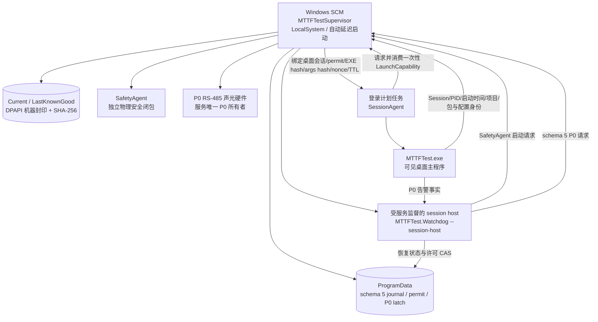

# V2.14.0.0 无人值守自恢复架构彻底修复实施与验证

> 文档版本：R1  
> 实施日期：2026-09-01  
> 目标版本：V2.14.0.0  
> 当前结论：**软件候选实现与自动化回归通过；尚未达到正式无人值守放行条件**  
> 事故基线：[10243-028 V2.13.0.45 I0015 停止与自恢复阻断根因及无人值守架构整改方案](./2026-09-01_10243-028_V2.13.0.45_I0015_停止与自恢复阻断根因及无人值守架构整改方案.md)  
> 事故封盘：`D:\EPB_Data\Backups\10243-028_V2.13.0.45_I0015_0901_1621`

## 1. 结论先行

本次已把 V2.13.0.45 的两个确定性恢复阻断修复为可验证契约，并把原先依附主程序的临时恢复进程改造成由 Windows 服务、登录会话代理和独立 SafetyAgent 组成的恢复闭环：

1. 程控电源 OFF 不再用布尔值猜测成功或失败，而是以实际回读 `OFF` 为唯一成功条件；每组电源分别留下连接、身份、写入、两次回读、耗时和异常证据。
2. schema 5 安全交接允许常驻监督服务在精确证明旧 PID、启动时间和 permit 后，单调补齐 `OldProcessExitProven`、`LogicalQuiescent`、`CallbacksIsolated` 和 `HardwareResourcesReleased`；PID 重用、回执倒退、身份不符和未知进程状态全部 fail-closed。
3. `MTTFTest.Watchdog.exe` 已成为双模式宿主：无参数为 Windows 服务，`--console` 为工程/自动化模式，`--session-host` 为受服务监督的单会话恢复宿主。主程序不再自行创建无监督 Sidecar。
4. SessionAgent 只能消费服务签发并持久 CAS 的一次性 `LaunchCapability`；capability 同时绑定 Session、permit、桌面会话、EXE 路径和 SHA-256、参数哈希、nonce 与有效期，防止双主进程和旧许可重放。
5. SafetyAgent 改由监督服务直接验证并启动；服务重启后依据 schema 5 回执从最后成功阶段续跑，已经完成的断能动作不重复执行。
6. 恢复失败按 `SafetyPrerequisiteFailure`、`MainLaunchFailure`、`MainAttachFailure`、`CheckpointResumeFailure`、`FirstCycleCommitFailure` 分开计数，同一 operation/permit/fingerprint 只计一次；安全前置失败按 1/5/15/30/60/300 秒退避，不再消耗主程序启动预算。
7. DAQ、液压、电源和卡钳的现有最小故障域策略保留并纳入恢复门禁；已确认硬件故障持续锁存，不允许周期性重新上电。
8. 圈数据新增强类型终止原因、完整 sequence、缺口、设备 generation 和恢复事务 ID；SQLite 启动时执行 WAL checkpoint 与 `quick_check`，存储不可证明可写时禁止继续产生正式圈。
9. Current/LastKnownGood 双槽、DPAPI LocalMachine 封印描述、包逐文件哈希、候选两次真实启动失败后的 LKG 切换，以及 168 小时后才允许晋升 LKG 的门禁已落地。
10. SafeIdle 的 P0 声光告警由服务持有耐久状态并驱动。人工静音只关闭蜂鸣器，不清除故障灯和锁存；瞬态故障只有在恢复后首圈正式提交后才自动清除当前提示，历史证据不删除。

必须同时说明：本次生成的包来自 dirty 工作区，发布脚本已正确标记为 `DIRTY_CANDIDATE_NOT_FOR_PRODUCTION`；真实 NI/CAN/液压/程控电源、SCM 安装、登录/锁屏、RS-485 声光硬件和 24/72/168 小时长稳尚未执行。因此本文件不能签署“正式无人值守放行”。

## 2. 原事故根因与修复映射

| V2.13.0.45 根因/缺口 | V2.14.0.0 实施 | 验证结论 |
| --- | --- | --- |
| `SetOutputAsync(false)` 成功返回 `false`，SafetyAgent 却把 `false` 当失败 | 新增 `PswOutputState`、`PswOutputCommandResult`、`SafetyPowerOffReport`；安全链只认两次回读均为 OFF | 电源契约与多电源诊断自动化测试通过 |
| 旧进程退出后无法补齐 `LogicalQuiescent` | schema 5 把物理安全、进程退出、逻辑静默、资源释放分别记录；服务只在精确旧进程退出证明成立后单调补齐 | 回执单调性、PID/启动时间、重放与篡改测试通过 |
| 临时 Sidecar 随主程序生命周期，崩溃后缺少常驻恢复权威 | `MTTFTestSupervisor` 常驻服务 + 受监督 session host + SessionAgent + SafetyAgent | Release 构建通过，`--console` 存活冒烟通过；真实 SCM 尚待现场 |
| 安全前置失败被记成主程序启动失败，未真正启动也出现 Count=2 | 五类分阶段计数；只在对应阶段实际执行后计数；同一幂等键只计一次 | authority、journal、恢复事务与 UI 投影测试通过 |
| UI 把所有 `Stop*` 都翻译为“停止超时” | 固定展示首发故障、停止结果、恢复门禁、当前动作、各阶段计数和下次重试 | WinForms/Watchdog UI 自动化测试通过 |
| 单 Dev1 DAQ 停更被正式槽、液压、全局 StopAll 竞态放大 | 局部故障事实进入唯一协调器；DAQ/液压/电气组继续按最小域隔离；活动圈作废而非伪装完成 | DAQ、液压、电源组与健康通道续测回归通过；500 ms 物理指标待现场 |
| 数据完整性与物理安全混成一个布尔门禁 | 物理安全、数据完整、可续测分别判定；圈终止原因强类型化 | EpbDiskWriter 58/58 通过 |
| 包身份缺失、配置/二进制不可独立证明 | build identity、逐文件 SHA-256、schema 5 双槽描述与 DPAPI 机器封印 | `Verify-Release.ps1` 通过 111/112 身份检查 |
| 熔断后无限停留，无法自动探测条件恢复 | 普通失败 30/60/300 秒半开；LKG 失败固定 1800 秒半开，始终先重做安全证明 | 半开资格、计时和断路器测试通过 |

## 3. 修复不变量（不可破坏的安全边界）

V2.14.0.0 的恢复代码必须满足以下不变量，任何一项无法证明都不得上电：

1. **先撤权，后动作。** 进入隔离或恢复时，旧控制 generation/permit 先失效，迟到回调不能重新上电。
2. **先断能，后换进程。** DO OFF、AO 零、程控电源 OFF、压力安全和数据边界分别形成证据；未知状态按不安全处理。
3. **OFF 以回读事实为准。** 命令返回值、网络写成功或对象未抛异常都不能代替实际输出 OFF 回读。
4. **安全动作幂等、证据单调。** 服务/Agent 崩溃后只从最后成功阶段继续；已完成阶段不得回退，revision 不得变小。
5. **进程身份不可只看 PID。** PID、启动时间、EXE 路径、文件哈希、Session、permit 和 challenge nonce 必须同时匹配。
6. **任意 permit 只消费一次。** launch intent、进程启动、attach、checkpoint、首圈提交按状态机 CAS 推进；同一时刻最多一个主程序。
7. **硬件故障不靠软件重试治愈。** 已确认卡钳、液压或电气硬件故障保持最小域禁用，人工维修和完整资格检查前不得重新使能。
8. **数据不完整不伪装完成。** 活动圈必须完成、强类型作废或封为 `DataIncomplete`；无可写存储时安全停机。
9. **硬件故障不触发包回滚。** 只有当前候选在真实启动/附着/checkpoint/首圈提交阶段的重复软件失败才可切换 LKG。
10. **恢复失败仍有确定终态。** 仅允许 `Running`、`RunningDegraded` 或 `SafeIdleAlarmed`；不存在无限“正在恢复”中间态。

## 4. 服务拓扑与所有权



### 4.1 服务模式

- 无参数：`ServiceBase.Run`，正式 Windows 服务模式。
- `--console`：使用同一监督核心，供开发、CI 和现场诊断。
- `--session-host`：只由服务创建并持续监控；意外退出后从耐久注册恢复。
- SCM 恢复策略由安装脚本设置为 5、15、60 秒，之后持续重启。
- 正式目录 ACL 仅允许 Administrators/SYSTEM 修改，普通登录用户只读执行。

### 4.2 SessionAgent

- 由用户登录计划任务常驻交互桌面。
- 不生成 permit，不决定是否恢复，不直接绕过安全门禁。
- 只消费服务签发的 `LaunchCapability` 并在目标桌面启动主程序。
- 请求/响应带 schema、挑战 nonce、精确进程身份和协议长度上限。

### 4.3 SafetyAgent

- 由服务直接验证 EXE/参数/回执/permit 后启动。
- 使用已封印安全配置快照，不读取可能变化的 UI/项目运行态作为物理安全依据。
- 阶段顺序为：DO OFF → AO 零 → 程控电源 OFF 两次回读 → 压力安全 → 完成。
- 物理安全状态与数据修复状态分开，不允许“数据未修完”否定已经成立的断能事实。

### 4.4 P0 告警

- `Latch`、`MuteBuzzer`、`ClearTransient` 是三个不同的 schema 5 动作。
- 服务先耐久提交 `p0-alarm-state.v5.json`，再驱动 RS-485；串口失败保留需求并每 30 秒重试。
- 人工静音只设置 `BuzzerMuted=true`，所有故障灯和持久锁存保持。
- 恢复后的首个正式圈提交才允许 `ClearTransient`；清除当前输出不删除历史 Event Log、JSON、封盘和审计。
- 主程序内原有通道面板仍用于运行期普通通道灯；`SafeIdleAlarmed` 的 P0 全局告警硬件所有权只属于服务。正式现场必须验证两者不会在同一 RS-485 端口并发占用。

## 5. schema 5 与公共 API 变化

| 对象/API | V2.14.0.0 变化 | 兼容策略 |
| --- | --- | --- |
| `PswOutputState` | `Unknown/On/Off` 强类型状态 | 新安全链必用 |
| `PswOutputCommandResult` | 请求状态、实际状态、两次回读、耗时、异常和身份 | 旧布尔接口保留并标记废弃 |
| `SafetyPowerOffReport` | 逐电源/逐组诊断，不再首个失败即丢失后续证据 | 新安全链必用 |
| Watchdog journal | schema 5；分阶段失败计数、重试时间、包槽与恢复事务 | v2-v4 只读保守迁移 |
| Safety handoff | schema 5；旧进程退出、逻辑静默、回调隔离、资源释放分字段 | 旧协议不得签发 V2.14 恢复许可 |
| Closing tombstone | schema 5，精确进程/permit/启动时间绑定 | 回退或损坏 fail-closed |
| Replacement transaction | schema 5，阶段单调 CAS | 不允许跳过 `Approved` |
| Supervisor protocol | Session、SafetyAgent、P0 告警三类请求，多路复用命名管道 | ACL + nonce + 精确进程身份 |
| `LaunchCapability` | 绑定 Session、permit generation/id、桌面会话、路径/hash、参数 hash、nonce、TTL | 单次持久 CAS 消费 |
| Package slot descriptor | schema 5，DPAPI LocalMachine 封印，逐文件验证 | Current/LKG 指针原子替换 |
| `CycleTerminationReason` | `Completed`、`Failed`、`AbortedByDaqLoss`、`AbortedBySafetyStop`、`AbortedBySoftwareRecovery`、`AbortedByHydraulicFault`、`DataIncomplete` | 保留旧 `status` 字段并迁移 |

## 6. 恢复状态机、计数和期限

主路径：

```text
Running → Degraded → Isolating → Safe → RecoveringLocal → Requalifying → Running
```

局部恢复超过既有 3 次、60 秒无进展或 300 秒总期限：

```text
Safe → ProcessReplacement → Requalifying → Running
```

同一当前候选在真实启动、附着、checkpoint 或首圈提交点连续失败两次：

```text
PackageRollback → ProcessReplacement → Requalifying
```

计数规则：

| 计数 | 何时增加 | 不增加的情况 |
| --- | --- | --- |
| `SafetyPrerequisiteFailure` | 独立安全前置阶段实际执行并失败 | 只观察到旧失败、同 operation/permit/fingerprint 重放 |
| `MainLaunchFailure` | 已签发 capability 且真实启动动作失败 | SafetyAgent/包验证尚未完成 |
| `MainAttachFailure` | 新 PID 已产生但协议 attach 失败 | 未启动主程序 |
| `CheckpointResumeFailure` | attach 后实际恢复 checkpoint 失败 | attach 前故障 |
| `FirstCycleCommitFailure` | checkpoint 后首圈提交失败 | 尚未进入正式圈 |

安全前置失败退避：1、5、15、30、60、300 秒，不消耗主程序预算。LKG 仍失败后保持断能，每 1800 秒进行一次半开安全复核；半开不是直接上电。

## 7. 最小故障域矩阵

| 故障事实 | 立即动作 | 自动恢复 | 持久隔离 | 升级整机条件 |
| --- | --- | --- | --- | --- |
| Dev1/Dev2 回调停更、任务停止、队列停滞 | 冻结对应 DAQ 通道；动作通道断电；当前圈 `AbortedByDaqLoss` | 重建对应任务，验证回调连续性、零电流、压力、配置和 generation | 仅多次确认硬件不可用后锁存相关域 | 两设备/共享安全资源失效或无法形成断能证明 |
| 单卡钳确认机械/电路故障 | 该通道 OFF、圈封口、证据封盘 | 否 | 单通道 | 故障跨共享域且无法隔离 |
| 单液压组确认故障 | 组内通道 OFF、释压/确认 | 瞬态软件/采集故障可；确认硬件故障不可 | 该液压组 | 两组或共享阀/泵安全不可证明 |
| 单程控电源/电气组故障 | 该组输出 OFF 两次回读 | 通信瞬态可；确认电路故障不可 | 该电气组 | 共享供电或 OFF 无法证明 |
| 软件 Timer/Runner/回调生命周期异常 | 局部撤权、作废圈、重建 | 最多 3 次且受 60/300 秒限制 | 否 | 无进展后换进程 |
| 主进程崩溃/卡死 | 服务接管、独立断能、安全交接 | 换进程 + checkpoint + 首圈复核 | 否 | 证据/包/存储均不可恢复 |
| 当前候选重复软件启动失败 | 安全闭包后切换 LKG | 是 | 当前候选停止使用 | LKG 也失败进入 `SafeIdleAlarmed` |
| 包/配置/数据库均无法证明或 OS 无执行能力 | 保持断能、告警、封盘 | 条件恢复后半开探测 | 故障状态耐久锁存 | 直接 `SafeIdleAlarmed` |

## 8. 数据、存储和圈语义

SQLite 增量字段记录：

- 最后完整 sequence；
- 缺口起止范围；
- 设备 generation；
- 恢复事务 ID；
- 强类型 `CycleTerminationReason`。

写盘器打开数据库后执行：

```sql
PRAGMA wal_checkpoint(TRUNCATE);
PRAGMA quick_check;
```

WAL 忙碌、quick check 非 `ok` 或数据库不可写会阻止写盘器进入正式运行。活动圈不会因为存储故障被标成 completed；可恢复故障先尝试 WAL/临时文件/历史遥测和过期快照治理，绝不删除当前项目正式圈、报警证据或数据库来“腾空间”。

物理安全、数据完整和续测资格分别判断：数据不完整不能阻止 DO/AO/电源断能，但必须先修复或把活动圈明确封为非完成圈。

## 9. 双槽、包与配置恢复

### 9.1 已实现

- 安装时验证 `build-identity.json`、版本、逐文件 SHA-256。
- `package-slot.v5.json` 和 `package-pointer.v5.json` 使用 DPAPI LocalMachine 封印。
- Current 候选在真实软件启动阶段连续失败两次、且故障不属于硬件/液压/卡钳/电路时，先安全闭包，再原子把活动指针切到 LKG。
- Current/LKG 包均包含并校验 Config 文件；SafetyAgent 每次交接另建独立、不可变、逐文件哈希的安全配置快照。
- 当前槽篡改会被拒绝；LKG 只有提供 `completedHours >= 168` 且 `status=PASS` 的现场证据才可晋升。

### 9.2 尚未宣称完成的配置边界

当前实现能独立封印 **SafetyAgent 的安全配置快照**，并能随 LKG 包恢复整套已验证配置；但普通主程序配置仍与程序包槽共同验证，尚未实现“不切换程序二进制、只原子切换普通 UI/运行配置槽”的全路径能力。代码中也存在 `Environment.CurrentDirectory` 与 `Application.StartupPath` 两种历史配置定位方式，贸然用目录重定向会制造新的身份分裂。

因此，若现场验收要求严格的“配置优先、程序包其次”两级独立回滚，这一项仍是正式放行阻断项。当前安全行为是 fail-closed 或切整套 LKG，不会在未验证配置上继续正式试验。

## 10. 部署与运维脚本

新增幂等脚本：

```powershell
# 正式安装（必须是 clean、deploymentApproved=true 的候选包）
.\Deployment\Install-MTTFTest-Unattended.ps1 -Mode Install `
  -SourceDirectory <ReleaseDirectory> `
  -InstallRoot 'C:\Program Files\MTTFTest'

# 修复服务、任务、ACL、SCM 恢复策略与健康检查
.\Deployment\Install-MTTFTest-Unattended.ps1 -Mode Repair `
  -SourceDirectory <ReleaseDirectory>

# 168 小时 PASS 后晋升 LKG
.\Deployment\Install-MTTFTest-Unattended.ps1 -Mode PromoteLastKnownGood `
  -SoakEvidencePath <168h-result.json>

# 卸载服务和登录任务；保留程序槽和事故证据
.\Deployment\Install-MTTFTest-Unattended.ps1 -Mode Uninstall
```

脚本负责：

- `MTTFTestSupervisor` LocalSystem 自动延迟启动服务；
- SCM 5/15/60 秒后持续重启策略；
- 当前登录用户的 SessionAgent 计划任务；
- Administrators/SYSTEM 写权限和普通用户只读权限；
- Current/LKG 双槽及 DPAPI 描述；
- 安装后服务/任务/包身份健康检查；
- dirty、未批准或非 `FIELD_CANDIDATE_PENDING_168H` 包的强制拒绝。

本机仅执行了 PowerShell 语法解析，未实际安装/修改 SCM 和计划任务。

## 11. 实际构建、测试与结果

### 11.1 执行命令

```powershell
& 'D:\Microsoft Visual Studio\18\Professional\MSBuild\Current\Bin\MSBuild.exe' `
  TfTest.sln /p:Configuration=Debug /p:Platform=x86 /m /v:minimal

.\Tests\AdaptiveControlTests\bin\Debug\AdaptiveControlTests.exe --v213043-recovery

.\Tools\Build-Release.ps1 -AllowDirtyCandidate -PersistenceSoakSeconds 1

.\Tools\Verify-Release.ps1 `
  -ReleaseDirectory '.\artifacts\releases\V2.14.0.0-c3baddeea0de-20260901_114316-DIRTY'
```

发布脚本在 Solution Restore/Rebuild 前显式还原 .NET 8 `win-x64` 和 `win-x86` runtime assets，解决首次构建缺少 RuntimeIdentifier 资产的问题。

### 11.2 实际结果

| 项目 | 结果 | 备注 |
| --- | --- | --- |
| Debug x86 Solution | PASS | 0 error；存在历史 C# 未使用字段/变量警告和 .NET x64 引用架构警告 |
| Release Any CPU Solution | PASS | 0 error，45 warning |
| AdaptiveControlTests | **PASS 691/691** | 包含恢复、Watchdog、液压、DAQ、最小隔离、电源、协议、进程强杀缝隙等软件测试 |
| V2.13.0.43/45 恢复专项 | **PASS 17/17** | 包含 SafetyAgent、schema 5 事务、监督服务 SafetyAgent/P0 协议、半开与 DAQ 重入 |
| EpbDiskWriterTests | **PASS 58/58** | 包含 WAL、圈终止、恢复封口、并发与保留策略 |
| Persistence soak | **PASS 1/1** | 1 秒、六通道、2 kHz、双 DAQ 软件压力样例；不是现场长稳替代品 |
| PowerSupplyDebugger.Tests | **PASS 19/19** | .NET 8、SCPI、超时和 OFF 回读契约 |
| Field gate validator | **PASS 49/49** | 188.881 秒 |
| Release identity verification | PASS | 111 个 identity 文件、112 个 checksum 文件 |
| Supervisor `--console` smoke | PASS | 进程持续存活 3 秒后按测试精确终止 |
| 安装脚本 PowerShell 解析 | PASS | 未实际安装服务 |
| `git diff --check` | PASS | 无空白错误；仅 Git 提示未来 LF/CRLF 转换 |

上述 691 个软件测试已经显著超过计划中的 197 个基线；数量增加来自仓库现有更完整的恢复/控制/持久化测试集和本次新增用例。

## 12. 候选包身份与哈希

候选目录：

```text
D:\Github\wanxiang\EPBTest\artifacts\releases\V2.14.0.0-c3baddeea0de-20260901_114316-DIRTY
```

构建身份：

| 字段 | 值 |
| --- | --- |
| Product/File version | `V2.14.0.0` / `2.14.0.0` |
| Git commit | `c3baddeea0de627a49ae287dc52e3e8542dc9fb0` |
| Branch | `feature/safety-margin-freezeA-20260101` |
| Build UTC | `2026-09-01T11:35:47.1114592Z` |
| Config SHA-256 | `c58a8a5862176dc973d3ba785522b1b4b4cd13352d7506884a96e2350bf7237b` |
| Watchdog/package schema | `5` / `5` |
| Long-soak gate | `FIELD_CANDIDATE_PENDING_168H` |
| Release status | `DIRTY_CANDIDATE_NOT_FOR_PRODUCTION` |
| Deployment approved | `false` |

关键文件 SHA-256：

| 文件 | SHA-256 |
| --- | --- |
| `MTTFTest.exe` | `9b8e05860d617fe64d9c947b6084381eb23ae15e4271248e8eb58eec77b16584` |
| `MTTFTest.Watchdog.exe` | `cc9f78569d15050157182de54170bee5fe759ab701e4d2ce15b9286d209ffbc0` |
| `MTTFTest.SessionAgent.exe` | `0717095903971dd90e1f0227d154d6b8d2c7e9de2f72747937ad68fd2c2b7637` |
| `MTTFTest.SafetyAgent.exe` | `95621aa325c1f0d664065e333eae8afc07342ea5404ab86937f2eda74ed64853` |
| `MTTFTest.Watchdog.Protocol.dll` | `ebae610d2c2a9a26e35d9918db26e27a87464873c7bfa47a2b22b8b2592cffb7` |
| `SHA256SUMS.txt` | `9094bfc6377bbe023d37548aa650f4964662c6d68234f3a01e7f790b694d8646` |
| `build-identity.json` | `64e5774954ad995514607c228291eff3ef5aacaf6618d3df7e26842aebe37c99` |

这个目录只用于证明当前工作树可以完整构建和通过测试。正式候选必须先提交/清理工作区，再不带 `-AllowDirtyCandidate` 重新构建；安装脚本会拒绝本包。

## 13. 尚未执行或未通过的现场项目

| 项目 | 状态 | 放行要求 |
| --- | --- | --- |
| 真实 Windows 服务安装、LocalSystem 权限、自动延迟启动 | 未执行 | 实机安装/修复/卸载各一次并保存 `sc.exe`/Event Log 证据 |
| SCM 5/15/60 秒持续恢复 | 未执行 | 强杀服务多轮，验证持久状态续跑且无双实例 |
| 登录、注销、锁屏、SessionAgent 丢失 | 未执行 | 当前用户桌面可见启动；锁屏不影响安全闭包；Agent 恢复无双主进程 |
| 真实 SafetyAgent + NI + SCPI | 未执行 | 从 `SafeButRestartRequired` 到 checkpoint/首圈的完整 E2E |
| 真实 RS-485 故障灯、蜂鸣器、人工静音 | 未执行 | 物理点检：静音只关蜂鸣器，灯和锁存保持；服务重启后重放 |
| 主程序普通通道灯与服务 P0 端口互斥 | 未执行 | 串口所有权/仲裁实测无并发写入和端口占用 |
| Dev1/Dev2 物理回调停更 500 ms 断电指标 | 未执行 | 每设备分别注入，示波/硬件时间戳证明 ≤500 ms |
| 30 秒独立安全证明 | 未执行 | 对真实 DO/AO/PSU/压力逐项计时 |
| 180 秒恢复并提交首个正式圈 | 未执行 | 每类可恢复故障独立统计 P95/P99 和最坏值 |
| PID 重用、每个恢复提交点逐点强杀 | 部分软件模拟通过 | 服务/Agent/主程序真实进程矩阵全部通过 |
| 当前槽篡改和原子切槽中断 | 软件门禁通过；实际安装槽未执行 | 安装后真实目录、断电/重启边界验证 |
| 配置优先独立回滚 | **未完整实现** | 统一配置路径并实现普通配置双槽后再验收 |
| 磁盘满、WAL 损坏、数据库修复 | 软件单元覆盖；真实磁盘未执行 | 独立测试盘注入并证明不删除正式圈/报警证据 |
| 卡钳、液压、电路确认故障最小隔离 | 软件回归通过；真实硬件未执行 | 每个故障域逐项断线/失压/机械阻滞验证 |
| 干净正式候选包 | 未生成 | clean commit 构建，`deploymentApproved=true` |

## 14. 24/72/168 小时长稳记录

| 阶段 | 开始时间 | 结束时间 | 包 SHA-256 | 故障注入数/自动恢复数 | 双进程/双 permit | completed 缺口 | 结果 |
| --- | --- | --- | --- | --- | --- | --- | --- |
| 24 小时 | 未开始 | — | — | — | — | — | **PENDING** |
| 72 小时 | 未开始 | — | — | — | — | — | **PENDING** |
| 168 小时 | 未开始 | — | — | — | — | — | **PENDING** |

每阶段必须同时满足：

- 可恢复故障全程无需人工；
- 活动 EPB 数据失新后 500 ms 内断电；
- 30 秒内形成独立安全证明；
- 180 秒内恢复并提交首个正式圈；
- 无双主进程、双 permit、无限中间态和 completed 圈缺口；
- 确认硬件故障只隔离最小域且不自动重新上电；
- 资源、队列、日志、数据库和磁盘无不可接受增长。

## 15. 最终放行状态

当前签署如下：

| 放行层级 | 状态 | 原因 |
| --- | --- | --- |
| 源码编译/自动化回归 | **PASS** | Debug/Release、691/691、58/58、19/19、49/49 全部通过 |
| 工程候选供实验室继续验证 | **CONDITIONAL GO** | 仅使用本文哈希对应代码；必须先生成 clean candidate |
| 现场候选 `FIELD_CANDIDATE_PENDING_168H` | **NO-GO（当前包）** | 当前包 dirty、deploymentApproved=false，安装脚本会拒绝 |
| 正式无人值守版本 | **NO-GO** | 真实服务/硬件/配置独立回滚及 24/72/168 小时未完成 |
| `2.14.0.0` 正式标签和 LKG 晋升 | **禁止** | 必须在 168 小时 PASS 后执行 |

“无人值守一直稳健运行”在工程上不是承诺任何硬件损坏、磁盘损坏或 OS 失效后仍无限续测；可签署的正确承诺是：

> 可执行、可验证的瞬态软件故障在安全边界内自动恢复；确认硬件故障最小域隔离且不自动上电；无法恢复时进入确定、耐久、可告警的 `SafeIdleAlarmed`，始终保持断能和证据完整。

本次已经消除 V2.13.0.45 的确定性恢复死锁，并建立了拒绝虚假成功的架构和发布门禁。正式放行必须继续用现场证据完成本文第 13、14 节，而不能用“软件测试很多”替代硬件和长稳验收。
