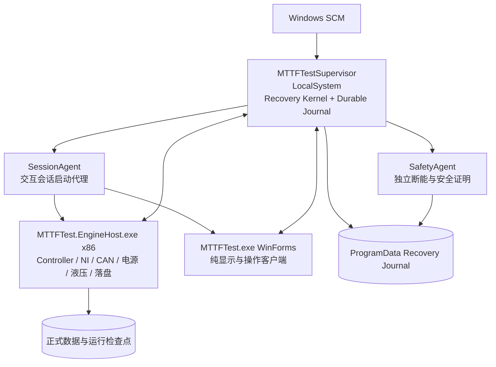

# EPB 无人值守通用自恢复内核架构与实施蓝图

- 文档日期：2026-09-03
- 适用项目：EPB 耐久试验控制系统
- 基线版本：V2.15.0.0
- 方案性质：下一代架构总方案，要求一次性完成生产切换，不与旧恢复策略并行运行
- 核心目标：把“针对已知故障逐个打补丁”改造成“任何故障都按统一安全属性和恢复阶梯自动收敛”

## 1. 执行结论

不存在能够保证所有未知软硬件故障都重新恢复运行的程序。设备物理损坏、断能执行器失效、压力无法释放、Windows/工控机失去执行能力等情况，都不应通过无限重启或强制上电伪装成“已恢复”。

本方案所说的“一劳永逸”是：

> 不再要求开发人员提前知道每一种故障原因。只要系统还能获得必要的安全证据，Recovery Kernel 就根据资源状态、控制权、数据连续性和恢复进展自动选择最小隔离、局部重建、进程替换或程序包回滚；无法安全恢复时自动进入稳定的安全待机，而不是停在无主暂停、界面消失、恢复卡死或重启风暴中。

系统必须保证任何事故最终有界收敛到以下终态之一：

1. `Running`：全部启用通道恢复运行；
2. `RunningDegraded`：故障域被隔离，其余资源独立的健康通道继续运行；
3. `SafeIdleAlarmed`：无法证明可以安全续跑，全部相关输出保持关闭并持续报警；
4. `StoppedByOperator`：操作员主动停止、急停或进入维修状态，任何自动恢复都不得越权启动。

这四个终态之外的 `Detecting`、`Isolating`、`Recovering`、`Requalifying`、`ReplacingProcess` 等状态只能是带唯一 Owner、明确截止时间和下一动作的临时事务状态。超过截止时间必须自动升级，禁止无限停留。

---

## 2. 为什么目前总是在修“上一次问题”

当前系统已经具备 Supervisor、SessionAgent、SafetyAgent、检查点、恢复 Owner、双程序槽和大量专项恢复逻辑，但它们仍然以“多个模块分别判断故障、分别决定动作”的方式组合。

主要结构性问题如下：

### 2.1 决策入口分散

当前恢复入口分布在 Timer、DAQ、启动定位、批量启动、暂停继续、电源、液压、Watchdog、主界面和无人值守启动代码中。`EpbManager` 内已有多个 `TryBeginRecoveryIncident(...)` 调用点，同时仍存在：

- `BeginTimerRuntimeSelfHealing(...)`；
- `BeginRecoverableChannelRestartLoop(...)`；
- DAQ 专用恢复和终态重试；
- `SystemFaultRaised` 到进程内恢复/重启的独立链；
- 主界面直接 `_epb.StopAll()`；
- Watchdog 自己根据字符串状态决定接管和全局 StopAll；
- 进程启动失败、检查点失败和包回滚各自维护计数。

这些逻辑即使单独正确，也可能在同一事故中并发执行、互相撤权、改变状态或抢占恢复 Owner。

### 2.2 UI、试验引擎和硬件控制在同一主进程

WinForms UI 卡住或退出时，Controller、硬件句柄、定时器、试验状态和数据写入也同时失去宿主。Watchdog 只能把“界面故障”和“整个控制引擎故障”作为同一个进程故障处理，导致本可只重启界面的事故被扩大为全局停机和试验恢复。

### 2.3 依赖故障名称，而不是依赖安全性质

目前许多策略根据 `faultCode`、状态字符串或具体异常类型选择恢复动作。新的故障名称没有命中已有分支时，只能进入默认 StopAll、笼统 `UnhandledSoftwareStartup` 或永久熔断，开发人员随后再为新错误码增加例外。

### 2.4 没有系统级“期望状态协调器”

现有代码有恢复任务和检查点，但没有一个唯一组件持续执行：

```text
读取期望状态
  -> 读取系统观测状态
  -> 计算差异
  -> 发出一个幂等动作
  -> 验证结果
  -> 持久化进展
  -> 再次协调，直到进入合法终态
```

因此某一步失败后，系统可能只留下一个中间状态、一个过期 Owner 或一个已经打开的熔断器，而没有组件负责继续把它推到最终状态。

### 2.5 当前缺陷不是“测试还不够多”

继续为每个现场事故添加回归测试仍然有价值，但无法枚举未来所有线程阻塞、乱序回执、驱动停顿、存储抖动和组合故障。必须把验证重点从“每个错误码是否有分支”提升为：

- 任意故障序列是否都能断能；
- 任意中间步骤被强杀后是否能继续；
- 任意未知观测是否能归入资源域并执行统一策略；
- 是否只有一个恢复 Owner；
- 是否最终进入合法终态。

---

## 3. 不可破坏的系统不变量

Recovery Kernel 的所有实现和测试都必须围绕以下不变量，而不是围绕具体事故描述。

| 不变量 | 强制要求 |
|---|---|
| 单一决策者 | 只有 LocalSystem Supervisor 中的 Recovery Kernel 能决定隔离范围、恢复阶梯、进程替换和包回滚 |
| 单一 Owner | 一个 `IncidentId + ResourceScope + Generation` 同时最多存在一个有效 Owner |
| 先有事务后有动作 | 先耐久提交 `RecoveryIntent` 和 Owner，再执行暂停、断能、封圈、重建或复跑 |
| 物理安全优先 | 输出 OFF、压力安全等物理证明不依赖 UI、Controller 或数据库成功 |
| 未证明即不安全 | 不能读取状态、回执损坏、身份不符或超时均不能被解释为“已经安全” |
| 中断圈不计数 | 恢复期间的活动圈只能进入明确的作废/失败终态，不能成为 completed 正式圈 |
| 最小故障域 | 能证明局部隔离时不得停止资源独立的健康通道 |
| 无进展必升级 | 临时状态必须有截止时间；没有进展时自动进入下一恢复阶梯或安全待机 |
| 动作必须幂等 | 相同命令被重复投递、进程重启后重放或回执重复到达，不得重复计数、重复上电或创建第二任务 |
| 操作员意图最高 | 人工停止、急停和维修锁定一旦耐久提交，所有自动恢复许可立即撤销 |
| 有限恢复 | 恢复预算用尽后必须稳定停在隔离或安全待机，禁止无限重启和无限重新上电 |
| 诊断不参与授权 | 日志文字和推断出的根因只用于分析；恢复授权只依据强类型状态、身份和证明 |

---

## 4. 目标进程架构

### 4.1 总体拓扑



### 4.2 `MTTFTest.EngineHost.exe`

新增 x86、.NET Framework 4.8 的无界面试验引擎进程，承载：

- `Controller` 和通道状态机；
- NI DAQ、程控电源和液压控制；
- Timer、Runner、正式槽协调和资格圈；
- 数据写入、检查点和活动圈安全封口；
- Recovery Kernel 下发的局部恢复命令执行器。

EngineHost 不决定是否全局 StopAll、是否重启自己、是否切换 LKG。它只报告事实并执行带有效 capability 的 `RecoveryCommand`。

### 4.3 WinForms 主界面

主界面改成 EngineHost 的客户端：

- 通过命名管道订阅不可变状态快照；
- 操作请求必须先提交给 Recovery Kernel/EngineHost 的命令门；
- 不直接持有硬件、Timer、Runner、数据写入器和试验事实状态；
- UI 关闭、卡住或异常退出时，EngineHost 在无人值守模式下继续运行；
- Supervisor 在 60 秒内重新拉起 UI，UI 从快照恢复显示。

因此“主界面软件退出”不再等价于“试验引擎退出”。

### 4.4 LocalSystem Supervisor 与 Recovery Kernel

Recovery Kernel 作为 Supervisor 内部唯一决策组件，不再新建另一个 Windows 服务，避免增加新的最高权威和服务竞争。

它负责：

- 保存系统期望状态；
- 接收并归并 `FaultObservation`；
- 维护资源拓扑、Incident、Owner、预算和截止时间；
- 选择最小故障域；
- 请求 SafetyAgent 断能；
- 向 EngineHost 下发局部重建、资格复核和恢复命令；
- 强杀/替换无响应 EngineHost；
- 切换兼容的 Current/LastKnownGood；
- 重启 UI 和 SessionAgent；
- 最终提交 `Running`、`RunningDegraded` 或 `SafeIdleAlarmed`。

### 4.5 SafetyAgent

SafetyAgent 继续保持为独立、受 Supervisor 监督的安全执行进程，且不得依赖 EngineHost/UI 正常：

- 关闭 DO/AO 和程控电源；
- 释放液压并验证压力；
- 隔离仍持有硬件资源的旧 EngineHost；
- 生成带 authority、revision、时间戳和原始回读的 `SafetyProof`；
- 安全动作可以重复执行，但证明只能单调推进。

---

## 5. 资源拓扑与最小故障域

Recovery Kernel 不使用“EPB9 报错就只重启 EPB9”这种固定判断，而是维护实际依赖图：

```text
System
├─ EngineHost
├─ Storage
├─ Dev1 DAQ
│  └─ 关联通道
├─ Dev2 DAQ
│  └─ 关联通道
├─ HydraulicGroup 1
│  └─ 关联通道
├─ HydraulicGroup 2
│  └─ 关联通道
├─ PowerGroup 1..N
│  └─ 关联通道
└─ Channel EPB1..EPB12
```

故障域计算规则：

1. 从发生异常属性的最小资源开始；
2. 把所有无法独立断能或共享同一故障资源的通道纳入闭包；
3. 对闭包执行安全证明；
4. 如果某一共享依赖状态未知，向上扩大一级；
5. 如果无法证明 EngineHost 仍拥有可靠控制权，扩大为整机；
6. 资源独立且证明完整的健康通道保持 `Running`，系统进入 `RunningDegraded`。

示例：

| 观测 | 默认故障域 | 处理 |
|---|---|---|
| 单卡钳 Timer/Runner 无进展 | 单通道 | 断能、封圈、局部重建和资格复核 |
| 单电源组状态未知 | 电源组及其通道 | 整组断能；其他电源组继续 |
| 单液压组压力/阀状态异常 | 液压组及其通道 | 整组隔离和复核 |
| 单 DAQ 回调/样本陈旧 | 对应 DAQ 及其通道 | 关联通道断能，重建该 DAQ |
| 双 DAQ 同时失新但 EngineHost 有响应 | 所有 DAQ 通道 | 全通道断能，先局部重建双 DAQ |
| EngineHost 心跳、控制进展均丢失 | 整机 | SafetyAgent 断能，替换 EngineHost |
| 存储无法形成正式圈边界 | 当前所有正式通道 | 作废活动圈，停止产生新正式圈 |
| UI 单独退出 | UI | 只重启 UI，不停止 EngineHost |

---

## 6. 属性驱动的故障观测

### 6.1 原则

模块不再上报“请重启”“请 StopAll”，只上报可验证事实，例如：

- 心跳或进展超过期限；
- 样本/遥测数据陈旧；
- 命令结果无法确认；
- 输出状态与期望相反；
- 压力没有进入安全区；
- 持久化序列出现缺口或无法关闭；
- 资源 generation 不一致；
- 进程/PID/StartTicks 身份消失；
- 配置、包或回执身份无效；
- 观测源本身失联。

错误码和异常文本仍可保存到诊断字段，但不能决定恢复授权。

### 6.2 `FaultObservation`

在 `Watchdog.Protocol` 新 schema 中增加强类型记录，至少包含：

| 字段 | 含义 |
|---|---|
| `ObservationId` | 全局唯一事实 ID，用于重复投递去重 |
| `SessionId` | 当前无人值守会话 |
| `RunId` / `RunEpoch` | 试验运行身份 |
| `ResourceId` / `ResourceKind` | 发生属性异常的资源 |
| `PropertyKind` | `ProgressLost`、`DataStale`、`CommandUnconfirmed`、`StateContradiction`、`ProcessDead`、`StorageUnavailable`、`IdentityInvalid`、`Unknown` 等有限属性类别 |
| `ExpectedValue` / `ObservedValue` | 期望和观测事实，不解析自然语言 |
| `FirstObservedUtcTicks` / `ObservedUtcTicks` | 首发和本次观测时间 |
| `MonotonicSequence` | 同一来源的单调序列 |
| `SnapshotRevision` | 产生事实的不可变状态快照 revision |
| `SafetyImpact` | 影响输出、压力、数据、控制权或仅 UI |
| `EvidenceReference` | dump、日志、采样窗口或回执位置 |
| `DiagnosticCode` / `DiagnosticText` | 仅用于分析，不用于授权 |

同一稳定资源属性、同一 RunEpoch 和相近时间窗的观测归并为一个 Incident；不同异常文本不得制造多个并发恢复任务。

---

## 7. Recovery Kernel 数据模型和公共协议

正式协议版本升级为下一 schema。共享协议库保持 .NET Framework 4.8 AnyCPU；EngineHost 保持 x86。

### 7.1 事务身份

所有恢复记录和命令必须绑定：

```text
SessionId
+ RunId
+ RunEpoch
+ IncidentId
+ ResourceScope
+ Generation
+ Revision
```

`IncidentId` 标识一次事故；`Generation` 标识该事故的恢复代次；`Revision` 只允许单调增加。任何字段不匹配均拒绝执行，但拒绝本身必须作为观测返回 Recovery Kernel，不能让事务静默消失。

### 7.2 `RecoveryIntent`

Recovery Kernel 在执行任何动作前耐久提交：

- Incident 身份和稳定指纹；
- 故障资源及计算后的影响域；
- 当前和期望终态；
- 当前阶段；
- 唯一 Owner；
- 局部、进程和 LKG 剩余预算；
- 阶段截止时间和总截止时间；
- 需要形成的安全证明；
- 下一条允许执行的动作；
- 前置状态 revision。

只有 `RecoveryIntent` CAS 成功，执行器才能收到命令。不存在“先 Pause，随后再补 Owner”的路径。

### 7.3 `RecoveryCommand`

允许的命令为有限集合：

- `QuiesceScope`
- `AbortActiveCycles`
- `RebuildResource`
- `RunPassivePreflight`
- `RunActiveQualification`
- `ResumeScope`
- `IsolateScope`
- `ReplaceEngineHost`
- `ActivateLastKnownGood`
- `EnterSafeIdle`

命令包含期望 generation、前置 revision、deadline、capability nonce 和幂等键。执行器必须返回 `Accepted`、`AlreadyApplied`、`RejectedPrecondition`、`Failed` 或 `TimedOut`，禁止无结果退出。

### 7.4 `SafetyProof`

安全证明至少拆分为：

- `MotorOutputsOff`
- `PowerSuppliesOff`
- `HydraulicPressureSafe`
- `CallbacksIsolated`
- `HardwareResourcesReleased`
- `ActiveCyclesTerminallyHandled`
- `PersistenceBoundaryClosed`
- `OldProcessExitProven`（需要替换进程时）

每项包含执行者身份、原始回读、测量时间、有效期、revision 和证据引用。数据不完整不能阻止物理断能，但会阻止正式续跑。

### 7.5 `QualificationReceipt`

资格回执包含：

- 无源预检结果；
- 配置/程序包身份；
- DAQ generation 和连续新鲜批次；
- 零电流、压力和电源状态；
- 主动资格圈机械完成事实；
- 数据完整性和终态落盘；
- 连续资格圈数量；
- 是否允许进入正式槽。

### 7.6 `SystemDesiredState` 与 `ResourceHealthLease`

`SystemDesiredState` 保存操作员已经批准的通道集合、运行目标以及当前允许的终态。`ResourceHealthLease` 由 EngineHost、UI、DAQ、电源、液压、存储和 SafetyAgent 分别刷新，包含进展 token 而不只是“线程还活着”。

心跳存在但进展 token 长期不变，仍被视为资源无进展；反之 UI 消失但 EngineHost 进展正常，只恢复 UI。

---

## 8. 统一状态机

### 8.1 系统状态

```text
Running
  -> Detecting
  -> Isolating
  -> Safe
  -> RecoveringLocal
  -> Requalifying
  -> Running / RunningDegraded

RecoveringLocal budget exhausted
  -> ReplacingEngineCurrent
  -> Requalifying

Current replacement budget exhausted and package eligible
  -> ActivatingLastKnownGood
  -> ReplacingEngineLkg
  -> Requalifying

All allowed budgets exhausted or safety precondition failed
  -> SafeIdleAlarmed

Operator stop / E-stop / maintenance lock
  -> StoppedByOperator
```

### 8.2 Incident 阶段

每个 Incident 只能按以下方向单调推进：

```text
Observed
  -> IntentCommitted
  -> SafetyRequested
  -> SafeProven
  -> RecoveryCommanded
  -> RecoveryVerified
  -> QualificationStarted
  -> QualificationPassed
  -> StableRunning
  -> Closed
```

任何阶段失败都必须提交 `Failed` 事实并由协调器决定下一阶梯；执行器不得私自创建新的 Incident。进程重启后，Recovery Kernel 从最后提交阶段继续，已完成的断能和封圈动作只做幂等复核。

### 8.3 截止时间

默认时间门槛：

| 阶段 | 门槛 |
|---|---:|
| 安全触发到发出断能命令 | 不超过 250 ms |
| 独立物理安全证明 | 不超过 30 s |
| 单次局部恢复 | 不超过 60 s 无进展，单次总时长不超过 180 s |
| EngineHost 替换并附着 | 不超过 180 s |
| UI 单独恢复 | 不超过 60 s |
| Incident 总时长 | 由恢复阶梯计算；每一步都必须有单独 deadline |

超时不等于直接永久失败：它首先消耗当前阶梯的一次预算并进入下一次尝试或下一阶梯。安全证明超时则不得执行主动复跑。

---

## 9. 统一恢复阶梯

### 9.1 默认预算

对同一稳定故障指纹，默认预算固定为：

1. 局部资源重建 2 次；
2. Current 槽 EngineHost 替换 2 次；
3. 兼容 LastKnownGood 槽 1 次；
4. 仍失败则 `SafeIdleAlarmed`。

预算按 `RunEpoch + ResourceScope + StableFingerprint` 耐久保存。修改错误文本、重启 UI、重启 EngineHost、切换 Owner 或重新加载日志都不能清零预算。

### 9.2 什么才算有进展

只有以下事实能够推进或最终重置预算：

- 安全证明 revision 前进；
- 资源 generation 成功切换；
- 新鲜数据连续到达；
- 资格圈完成并耐久提交；
- 正式圈完成并耐久提交。

重新创建 Task、重新连接同一失效会话、刷新 UI 文本或生成新的 correlation ID 不算恢复进展。

### 9.3 预算重置

受影响故障域必须同时满足：

- 完成 2 个不计正式目标的资格圈；
- 完成 5 个正式圈；
- 资格通过后连续稳定运行 10 分钟；
- 同一稳定指纹没有再次出现；

才能把该指纹的局部、进程和 LKG 预算清零。这样可以防止间歇性故障每次短暂恢复后重新获得无限重试机会。

### 9.4 LKG 限制

只有软件包损坏、启动/附着/检查点/首圈提交的重复软件失败可以触发包回滚。已确认硬件故障、压力异常或断能失败不得通过切包规避。

Current 与 LastKnownGood 必须：

- 使用相同 Recovery Kernel 协议代际；
- 支持相同检查点 schema；
- 具有完整包清单和哈希证明；
- 在切换前完成物理安全证明；
- 不继承旧进程 permit、nonce 和 Owner。

首次部署新架构时，旧 V2.15 不得直接作为自动 LKG。应将同一新架构的已验收构建同时建立为 Current 和基线 LKG，之后再按受控流程晋升新槽。

---

## 10. 未知故障的处理方法

### 10.1 不要求先找到根因

未知故障到达时，Recovery Kernel 只需要回答五个问题：

1. 哪些资源的观测属性已经不满足期望？
2. 能否证明最小影响域已经断能？
3. EngineHost 是否仍有可靠控制权和进展？
4. 数据边界能否形成，活动圈是否已经作废？
5. 当前恢复阶梯还有多少预算？

根因分析可以在恢复之后继续，不是恢复事务的前置条件。

### 10.2 单个或部分卡钳停止

处理顺序：

1. 提交通道/共享资源域 `RecoveryIntent`；
2. 关闭该域输出并作废活动圈；
3. 保持无共享依赖的健康通道运行；
4. 重建 Timer、Runner 或相关硬件资源；
5. 执行无源预检；
6. 执行资格圈；
7. 成功则按未来正式槽重入；
8. 预算用尽则隔离该域，系统进入 `RunningDegraded`。

### 10.3 全部卡钳停止但 EngineHost 仍响应

Recovery Kernel 不立即替换进程，而是先形成整机安全证明，再按依赖图重建共享 DAQ、电源、液压或调度资源。两次局部重建均失败才替换 EngineHost。

### 10.4 EngineHost 卡死或退出

1. Supervisor 根据 PID/StartTicks、脉冲和控制进展确认失去控制权；
2. SafetyAgent 独立执行全局断能；
3. 证明旧 EngineHost 退出或隔离其硬件资源；
4. 把所有活动圈封为中断/数据不完整，不计正式圈；
5. 使用 Current 槽重新启动 EngineHost；
6. 新进程消费一次性 capability 和检查点；
7. 执行全域无源预检和资格圈；
8. 成功后恢复正式试验；失败按预算重试并最终切 LKG。

### 10.5 UI 卡死或退出

只要 EngineHost 的进展和硬件控制权仍然有效：

- 不停止试验；
- 不撤销 EngineHost Owner；
- 不触发全局断能；
- Supervisor 通过 SessionAgent 重启 UI；
- 新 UI 从 EngineHost 快照和 Recovery Journal 恢复显示。

### 10.6 Supervisor、SessionAgent 或 SafetyAgent 退出

- Supervisor 由 SCM 按既有恢复策略持续重启，并从 Recovery Journal 继续协调；
- SessionAgent 退出只影响交互进程拉起，由 Supervisor 重建；
- SafetyAgent 退出时 Supervisor 重新拉起同一 authority 的 Agent；
- 在 SafetyAgent 无法形成安全证明期间，不允许主动资格复跑；
- 本方案禁止应用主动重启 Windows。

---

## 11. 已确认硬件故障的一次资格尝试

根据当前项目决策，已确认硬件故障不是立即永久停机；允许一次受控主动资格尝试，但必须满足严格前置条件。

### 11.1 绝对禁止主动尝试

出现任一条件时不得重新上电：

- 急停或人工维修锁定；
- 电机/DO/AO 无法确认关闭；
- 程控电源输出无法确认关闭；
- 液压压力未进入安全区；
- SafetyAgent 或独立安全链不可用；
- 配置、包、资源身份无法证明；
- 活动圈和数据边界无法安全终结；
- 旧进程可能仍控制硬件；
- 同一故障域已经消耗过硬件主动资格预算。

### 11.2 资格顺序

1. 完成完整 `SafetyProof`；
2. 冷却/稳定等待满足现有硬件规范；
3. 无源检查通信、零电流、压力、DAQ 新鲜度、配置身份和资源 generation；
4. 同一共享故障域内一次只允许一个卡钳执行主动资格；
5. 使用正式安全阈值，不放宽电流、时间、压力或机械进展保护；
6. 资格圈不计入正式目标，但机械完成事实和全部原始证据必须落盘；
7. 资格中再次出现相同或更严重异常，立即断能并永久隔离该故障域；
8. 资格成功仍需满足两圈资格、五圈正式和十分钟稳定条件后才能重置通用恢复预算。

这一次尝试是“受控验证设备是否已经恢复”，不是允许对明确损坏的设备反复冲击。

---

## 12. 数据、检查点和耐久事务

### 12.1 Recovery Journal

Supervisor 是 Recovery Journal 的唯一写入者，建议固定存储在：

`%ProgramData%\MTTFTest\RecoveryKernel\`

Journal 使用原子临时文件替换、主/备份副本、canonical SHA-256、单调 revision 和目录 ACL。至少保存：

- `system-desired-state.json`
- `resource-graph.json`
- `active-incidents/*.json`
- `recovery-budget.json`
- `safety-proofs/*.json`
- `qualification-receipts/*.json`
- `engine-host-authority.json`
- `terminal-state.json`

进程崩溃时允许丢失尚未提交的尝试，但不得回退已提交 revision 或重新消费旧 capability。

### 12.2 运行检查点

检查点保存：

- 每通道正式完成圈数和剩余目标；
- 当前阶段和下一合法阶段；
- 活动圈的唯一终态及作废原因；
- DAQ、Timer、Runner、电源和液压 generation；
- 故障域隔离状态；
- 当前 Incident 和恢复预算；
- 最后一组已提交数据序列及缺口；
- 配置和程序包身份。

检查点不得保存可跨进程直接复用的旧 Owner、permit、nonce 或硬件授权。

### 12.3 正式数据规则

- `Completed` 必须同时具备机械完成、数据完整和持久化提交证明；
- 恢复中断的圈标记为具体 `AbortedBy...` 或 `DataIncomplete`；
- 被抑制、丢弃或无法验证的原始批次必须记录序列范围；
- 数据修复和物理安全证明相互独立；
- 存储不可写时允许断能和安全待机，不允许继续产生正式圈。

---

## 13. 旧恢复逻辑的一次性收口

本方案选择一次性整体替换。开发可以在独立分支内按模块构建，但生产切换时不允许新旧两套决策器并存。

### 13.1 必须删除或降级为执行器的入口

以下现有入口不能继续拥有恢复决策权：

| 现有入口 | 新架构处理 |
|---|---|
| `EpbManager.StopAll()` / `StopAll(StopContext)` | 仅保留幂等安全执行能力；普通模块不得直接调用，由 `RecoveryCommand` 或明确的操作员停止事务触发 |
| `SystemFaultRaised` | 替换为 `FaultObservation` 发布；订阅者不得自行重启进程 |
| `BeginTimerRuntimeSelfHealing(...)` | 改为 Timer 资源执行器；先由 Kernel 建立 Intent/Owner，再执行暂停与重建 |
| `BeginRecoverableChannelRestartLoop(...)` | 删除私有预算和循环，统一使用 Kernel 恢复阶梯 |
| DAQ 专用重试、终态重试和 SafeIdle 决策 | 保留硬件执行与回执，删除独立 Owner、预算和进程升级决策 |
| `TryBeginRecoveryIncident(...)` 的多处分散调用 | 上移到 Recovery Kernel；EngineHost 内只消费已提交 Incident |
| `UnattendedRecoveryCoordinator.OnSystemFaultRaised(...)` 和进程内重启 | 删除决策链，进程替换只能由 Supervisor 发起 |
| Watchdog 根据 `Paused` 等字符串推断 Owner | 改为读取 schema 强类型 `RecoveryIntent/ResourceHealthLease` |
| 主界面直接 `_epb.StopAll()` | 改为提交 `StoppedByOperator` 请求，由 Kernel 生成停止事务 |
| 各模块独立恢复次数和熔断器 | 删除，统一写入 `recovery-budget.json` |

压力标定等非试验业务可以保留自己的局部 `StopAll` 命名，但必须与正式无人值守资源域隔离，且不得控制正在运行的 EngineHost。

### 13.2 最终生产门禁

构建测试必须扫描并阻止：

- UI、Timer、DAQ、电源、液压模块直接调用全局 StopAll；
- 除 Recovery Kernel 外创建进程恢复 permit；
- 通过异常文本/字符串前缀决定安全动作；
- 未绑定 Incident/Generation 的恢复 Task；
- 新旧 schema 同时获得写权限；
- EngineHost 和 UI 同时持有同一硬件资源。

`Controller/EpbManager - Copy.cs` 等备份源码不得进入项目或正式包。

---

## 14. 一次性实现与切换步骤

虽然生产只进行一次架构切换，开发仍应在独立分支内按以下依赖顺序完成，任何阶段都不能作为现场正式版本单独发布。

### 14.1 建立新协议和 Recovery Kernel

- 新增强类型协议、Resource Graph、Journal、CAS、预算和期望状态协调器；
- 实现纯内存模型和耐久恢复模型；
- 先用模拟执行器完成全部状态机和崩溃一致性测试。

### 14.2 拆出 EngineHost

- 把 Controller、硬件初始化、正式槽、数据写入和检查点从 WinForms 生命周期移出；
- 定义 UI 查询/命令管道；
- 保证 UI 被强杀时 EngineHost 的 Timer、DAQ 和落盘不受影响；
- 保证 EngineHost 只能由 Supervisor capability 启动。

### 14.3 将现有恢复模块降级为执行器

- Timer、DAQ、电源、液压、启动定位和数据模块只报告观测、执行 Kernel 命令并返回回执；
- 删除各自 Owner、进程重启和恢复预算；
- 把全局 StopAll 收口到 SafetyAgent/EngineHost 的幂等安全事务。

### 14.4 改造 Supervisor、SessionAgent 和 UI

- Supervisor 接管全部恢复决策、EngineHost/UI 生命周期和 LKG；
- SessionAgent 支持分别拉起 EngineHost 与 UI；
- UI 从状态快照重建，不再持有正式运行事实；
- P0 报警显示当前 Incident、故障域、阶段、预算、下一动作和终态。

### 14.5 升级、迁移和正式切换

- 安装前要求所有输出关闭并封存旧活动 Session；
- 只迁移项目配置、正式完成圈数、剩余目标和隔离状态；
- 不迁移旧授权、Owner、permit、nonce 和中间恢复状态；
- 同时安装新协议代际的 Current 和基线 LKG；
- 新版本首次冷启动完成全域无源预检和资格圈后才能续跑；
- 新 schema 写入活动 Session 后禁止降级到旧架构继续该 Session。

---

## 15. 测试体系

### 15.1 状态机和属性测试

使用模型测试随机生成：

- 未知 `FaultObservation`；
- 观测乱序、重复和丢失；
- Owner/Generation 不匹配；
- 任意阶段超时；
- 回执写入前后进程退出；
- 状态文件损坏、回退和部分写入；
- 多个资源同时异常；
- 故障恢复后短暂正常再复发。

每条随机序列必须证明：

- 最多一个有效 Owner；
- 不重复上电、不重复计数；
- 不存在无限临时状态；
- 最终进入四种合法终态之一；
- 操作员停止永远不会被自动恢复覆盖。

### 15.2 进程强杀矩阵

在每个耐久事务提交前后强杀：

- UI；
- EngineHost；
- Supervisor；
- SessionAgent；
- SafetyAgent。

覆盖 Intent 提交、安全请求、安全证明、旧进程退出、启动 capability、检查点消费、资格圈提交和首个正式圈提交边界。验证重启后从最后耐久阶段继续，而不是创建第二 Incident。

### 15.3 故障注入矩阵

必须覆盖：

- 单卡钳 Timer/Runner 停滞；
- 单 DAQ 和双 DAQ 停更、积压、乱序和 generation 变化；
- 单电源、共享电源、液压组通信/状态不确定；
- 输出关闭回读相反；
- 压力不能进入安全区；
- 慢盘、磁盘满、数据库/WAL 损坏和目录不可写；
- ThreadPool 饥饿、长 GC、关键锁停顿和 UI 消息泵停止；
- 命名管道分区、回执丢失和 SessionAgent 不可用；
- Current 文件损坏、配置损坏、LKG 启动失败；
- 未注册的新故障属性，且不为它增加新的恢复分支。

### 15.4 关键验收指标

| 指标 | 放行门槛 |
|---|---:|
| 安全触发到断能命令发出 | `<= 250 ms` |
| 独立安全证明形成 | `<= 30 s` |
| 局部恢复或 EngineHost 替换 | `<= 180 s/次` |
| UI 单独退出后恢复显示 | `<= 60 s` |
| 同时有效 EngineHost | 始终 `1` |
| 同一 Incident 有效 Owner | 始终 `1` |
| 中断圈正式计数增量 | `0` |
| 无限中间态/无限重启 | `0` |
| 健康独立通道非必要停机 | `0` |

### 15.5 完整回归和现场长稳

必须执行：

1. Debug x86 和 Release Any CPU 全解决方案构建；
2. AdaptiveControlTests、EpbDiskWriterTests、PowerSupplyDebugger.Tests；
3. Recovery Kernel 模型/属性/耐久 Journal 测试；
4. 安装态 LocalSystem 全进程强杀矩阵；
5. 真实 NI、CAN、电源和液压故障注入；
6. 24 小时硬件长稳；
7. 72 小时硬件长稳；
8. 168 小时硬件长稳。

168 小时通过前只能标记为现场候选，不能宣称通用自恢复正式闭环。

---

## 16. 运行和报警策略

进入 `SafeIdleAlarmed` 后系统仍应保持可管理，而不是“彻底消失”：

- Supervisor 和报警持续运行；
- 能启动时保持或恢复 UI，明确显示首发事实、故障域、安全证明、预算和阻断原因；
- 写入 Windows Event Log、耐久告警、事故快照和 dump；
- 不自动重启 Windows；
- 不周期性重新上电；
- 可以按长退避执行无源半开探测，但主动复跑必须仍有预算且全部安全门禁通过；
- 操作员维修后通过显式复核事务解除隔离，不能直接清空 JSON 或修改计数绕过。

---

## 17. 本方案能够和不能够保证什么

### 17.1 能够保证

- 新故障不需要先增加专用错误码才能进入恢复框架；
- 单通道、共享资源、全通道和进程退出使用同一协调规则；
- UI 退出不再天然导致试验引擎退出；
- 所有恢复都有唯一 Owner、预算、截止时间、证据和终态；
- 软件可恢复故障按局部、进程、LKG 阶梯自动处理；
- 不能恢复的故障自动进入最小隔离或安全待机；
- 不会因为持续打补丁而产生更多并行恢复状态机。

### 17.2 不能也不应承诺

- 物理设备损坏后仍强制继续试验；
- 断能、压力或旧进程隔离无法证明时重新上电；
- Windows/工控机完全失效时仍由本机软件恢复；
- 存储不可写时继续产生可信正式数据；
- 通过无限进程重启或无限硬件冲击换取表面在线率。

项目最终可收口的标准不是“以后永远不出现新错误”，而是：

> 以后即使出现从未见过的错误，系统也会沿同一套已验证的安全状态机自动收敛；开发人员分析新根因是为了优化设备和减少停机，而不是为了把已经卡死的系统重新救活。

---

## 18. 关联资料

- `docs/02_Issues/2026-09-03_10243-028_V2.14.2.11_I0024_1246封盘主界面退出复盘及V2.15覆盖评估.md`
- `docs/02_Issues/2026-09-03_10243-028_V2.14.2.11_运行中程序完全退出根因分析与解决方案.md`
- `docs/02_Issues/2026-09-03_V2.15.0.0_无人值守闭环彻底整改实施与软件验收.md`
- `docs/02_Issues/V2.14.0.0 无人值守自恢复架构实施计划.md`
- `docs/02_Issues/2026-09-01_V2.14.0.0_无人值守自恢复架构彻底修复实施与验证.md`
