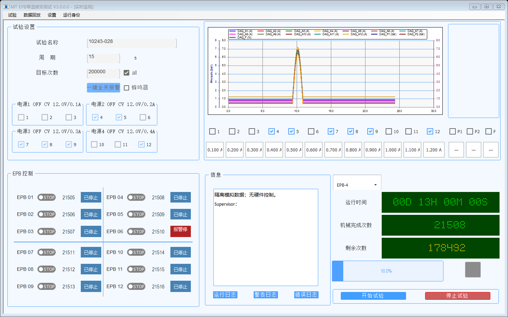

# V3 原界面完整恢复实施与验证

日期：2026-09-04；最新增量：2026-09-05。目标版本：3.0.0.0。开发分支：`codex/feat-v3-recovery-kernel`。

本轮开始时的源码基线为 `2b54194`；最终 R26 现场验证候选包绑定源码提交 `d87fa2a15bf199500057783dee44370b6905ef73`，不是已完成现场验收的正式包身份。

## 1. 当前结论：R26 现场验证候选包已生成，尚未正式无人值守放行

用户要求的是保留 V2.15 原操作界面及全部实际功能，后台使用 V3 EngineHost，而不是换成文本诊断窗口。

已恢复原主窗体、监控窗体的布局复用和客户端数据绑定，并接通当前项目参数保存、项目选择／新建／封存清零、报警确认、蜂鸣器、同批次暂停／继续、健康单通道暂停／继续、精确单卡钳隔离后的单次资格复核、压力维护／AO 标定及历史回放。已有项目选择、目的 EngineHost 启动/激活及跨 Run 的 UI 重附着源码链见 2.23；显式新建项目及原保存入口见 2.24；当前项目先封存再清零见 2.25；报警通道资格复核的软件链见 2.32。设置页只在明确停止及后台能力允许时提交参数、切换和单独确认的清零。原压力维护页及报警资格入口已按能力和安全门接通，但**安装态项目交接、真实标定、真实报警资格复核及 UI 崩溃恢复仍未完成现场验收**，不得把隔离模拟通过描述成正式无人值守闭环。

已从干净提交生成 `V3.0.0.0_现场验证包_d87fa2a15bf1_QUICKDEPLOY_R26.7z`，并通过内外层身份、递归哈希和 7z 完整性校验；详见 4.28。该包的 `releaseStatus` 为 `FIELD_VALIDATION_CANDIDATE`、`deploymentApproved=false`。生成过程没有覆盖本机安装目录、没有修改生产 ProgramData，也没有执行真实硬件操作。

最新增量：精确单卡钳隔离后的单次主动资格复核见 2.32，统一软件回归见 4.27；原压力校正页面、维护心跳、停止抢占、同 Owner 安全收尾及 AO 保存接线见 2.28–2.30。五项软件功能门已签署，`installedUiRecoveryVerified` 仍为 false，因此候选门允许生成受控现场验证包，正式门继续拒绝生成正式包。不能宣称真实标定、真实故障复跑或全部现场验收完成。

## 2. 已实施的源码改动

### 2.1 窗体与生产隔离

- 生产入口改为 `Main_Frm` 客户端，启动打开 `FrmEpbMainMonitor`，不再打开 `V3EngineClientForm`。
- 移除生产 UI 的旧首次运行配置/安装入口。通过启动 capability 检查后，界面仅连接后台，不因缺少项目配置而启动配置写入器或安装器。
- 新行为代码位于 `MTTfTest/V3/`；复用原 Designer 与 resx，不修改 Designer 文件。
- 保留项目、12 路卡钳、四组电源、曲线、日志、计数和启停区域；Session/Run/Owner 放入运行身份对话框。
- 原 UI 硬件构造、恢复 partial、压力标定硬件适配及旧 WatchdogRuntime 从生产编译移除。
- 为保持历史回归可编译，旧 UI 逻辑进入 `MTTfTest.LegacyUiRegression.csproj` 测试专用 Library，无入口点，输出到独立目录，不能纳入发布包。
- 源码门禁接收 MSBuild 实际 `Compile` 文件清单，检查全部生产 UI，而不是只检查最小客户端或者禁止旧窗体名称。
- 新增 `OriginalMonitorLayout`，捕获旧 Designer 初始化后的实际尺寸、列宽和字体为不可变基准；不改 Designer。特别修复 96 DPI 下把已缩放尺寸再次按 2808×1682 缩放导致的左侧过窄、文字过小问题。真实 125%/150% DPI 外观仍待验收。
- 数码摘要默认选择最小已选择通道；修复设计器已有 12 项又重复添加造成的摘要索引错位。用通道 4 的非零历史计数验证，不初始化或回写正式计数。

### 2.2 纯显示协议

在核心 schema 7 上增加 `EngineUiContract.Version=1` 和 `ReadUiSnapshot`：

- 12 路通道、四组电源、两路压力及力的纯 DTO；不传递硬件对象和执行授权。
- 区分机械完成次数、正式提交圈数及剩余目标；显示读取已有记录，不调用会创建缺失记录的 getter，不回写计数。
- 测量包含 Valid、采样时间和原因；失效、无样本显示“—”，不把默认零当作有效数据。
- EngineHost 读取电源缓存及通道状态缓存，不因 UI 刷新发起 SCPI 查询或重新初始化硬件。
- 跨批次时间桶保留峰谷及顺序；基础桶宽 50 ms，长周期自动增大桶宽，每条曲线最多 4096 点。EngineHost 缓存至少 60 秒、最多 1200 秒（两倍配置周期）；NaN/缺采形成断线标记，不连成正常波形。显示读取竞争时允许丢显示批次，不等待硬件采集线程。
- UI 日志后台缓存最多 2048 条，每次最多 200 条、每条消息最多 2048 字符；只读分页按级别和序号查询。生产者遇到显示读锁不等待，显示丢弃计数和缓存截断均可查询，不影响恢复管道。

### 2.3 通信与生命周期

- UI 读请求采用独立的 `.ui.v1` 只读管道，连接、写入、读取共用 3 秒总截止；服务端同样有 3 秒帧截止、16 KiB 请求上限及 4 MiB 响应上限。取消时关闭管道，校验帧长度、schema、RequestId 和运行身份。
- UI 显示通道不接受控制命令。半帧/慢客户端不会占住 Supervisor 使用的控制管道，显示请求和响应不建立无限队列。
- 新增 Supervisor UI 附着协议：核实请求管道的真实 UI PID、启动时刻、SessionAgent 角色授权，以及 EngineHost 管道的真实服务端 PID/启动时刻；返回当前运行身份。UI 检测到进程或 Epoch 改变后先重新取得附着批准，未批准的新身份不能覆盖旧显示状态。
- Supervisor 命令读取也有总截止，不再无限等待已连接但不响应的对端。
- 共享客户端会话保证刷新 single-flight，拒绝重复/乱序快照；运行、恢复、命令进行中或连接不明时阻止正常关闭。
- 全局开始/停止仍经 Supervisor 原有事务门，不直接调用硬件；打开、刷新和渲染界面不发送启动命令。

### 2.4 后续增量：操作回执与当前项目设置

- Supervisor Journal 将操作受理回执和 Intent/Owner 放入同一次耐久 CAS；启动、停止和配置命令可按原 ID 查询。相同 ID 改变载荷被拒绝；回执缓存最多 1024 条，并保留过期重放下界。
- UI 丢失回执时保留原命令，先查询；仅在查询明确不存在时重发原 ID、原时间和原载荷，不创建第二条启动命令。等待启动回执时仍允许提交停止，不接受第二次启动点击。
- 增加经 UI 角色授权的 Supervisor 状态读取；主/子窗口关闭必须同时看到 EngineHost 停止事实和 Supervisor 的独立停止完成状态。仅 EngineHost 提前显示停止、Supervisor 仍在确认断能时不得正常退出。
- 新增纯元数据 `EngineTestConfiguration`：基本信息、12 路循环参数/选择/目标、两组液压参与和设定压力。载荷没有完成次数、累计时间、硬故障隔离或授权字段。
- 当前项目设置保存采用独立配置 revision/hash；运行或恢复中拒绝保存。Kernel 先提交配置 Owner，再形成独立断能证明，再交 EngineHost 提交；重建后再次取得独立安全确认，完成于 `StoppedByOperator`，不自动开始试验。
- 项目 XML 保存前归档至项目 `Config/V3ConfigurationHistory`，设置与最后命令指纹/revision 在同一次原子替换中写入。准备阶段失败不修改活动文件；提交后丢失回执可幂等读取结果。原有记录、隔离、未编辑的安全参数和策略保留。
- 配置 hash 不包含运行计数和累计时间。检查点变更只允许在中断圈已作废且不处于运行态时衔接新配置，保留计数最大值、隔离和剩余工作，重新要求资格复核。
- EngineHost 登录加载不再使用会初始化新项目计数的旧 `EnsureProjectTestConfig` 路径。项目文件存在则优先读取；缺少时原子导入默认配置中的既有进度和隔离事实，不自动清零。
- 已定位并修复操作响应末尾空字符串的管道竞态：先在内存编码整帧，再发送，避免客户端读完关闭后服务端仍执行空字节写入；修复后连续 30 次“查询不存在后原 ID 重发”测试通过。
- 设置页复用原布局及 13 列循环参数表，当前项目的保存按钮已经映射到类型化配置事务。项目名称/目录切换、DAQ 保存、标定和正式记录清零仍未开放。
- Release 压测曾发现同一配置第一次准备成功、第二次提交却报 `ConfigurationCommandInvalid`：值未变，但 Framework 反射缓存改变了 JSON 属性枚举顺序，原实现直接哈希 JSON 因而不稳定。现对所有对象键按 Ordinal 排序后哈希，同时排序通道/液压数组。修复后 Release EngineHostIntegrationTests 连续十轮 22/22（含准备/提交强制异常、同 ID 重试）通过；不是硬件测试。

### 2.5 曲线、日志和布局增量

- 恢复原曲线调色板、左电流/压力轴、右力轴、蓝灰网格、2 像素线宽；禁用抗锯齿，不新增硬件采集行为。
- 默认时间窗口跟随周期 × 2，右键可切换缓存范围内的窗口及恢复实时显示；缩放时只冻结当前显示帧。曲线选择和窗口保存到用户级 `LocalAppData/MTTFTest/UI/original-monitor-v1.xml`，不修改项目配置、采样零位或正式次数。
- 缺采/非有限样本明确断笔；长窗口、连续小批次都保持缓存有界，不能因仅取平均值而丢失峰谷。
- 日志区右键按当前级别读取更早记录或返回实时；旧 EngineHost 的分页回执、返回实时后迟到的分页回执不能覆盖当前显示。页面只读，不发送控制命令。
- 窗体刷新间隔从渲染完成后重新计时，避免慢布局时持续堆积 Timer 消息；显示读取仍 single-flight。
- 修正 96 DPI 缩放基准、SunnyUI 组标题留白和 LED 高度重算；新增控件边界检查。诊断渲染仍不等于真实屏幕验收。

### 2.6 报警确认与蜂鸣器

- EngineHost 组合根创建并持有 `AlarmManager`，向控制器注入报警配置；UI 仅接收报警板实例 ID、revision、蜂鸣器期望开关、当前报警通道及串口状态。实例在硬件重建后改变，旧实例/旧 revision 命令不得确认新报警。
- 原“一键全关报警”和“蜂鸣器”控件使用 `AcknowledgeAlarms` / `SetBuzzerEnabled` 载荷，经 UI 角色授权的 Supervisor 入口受理。确认和消音不修改 `EpbRecords`、正式/机械计数、故障隔离或试验期望状态，也不创建恢复 Owner。
- Supervisor 将原命令及指纹耐久写入 Journal 的有界队列（最多 16 个待执行项）；独立工作循环通过 `.panel.v1` 管道交给 EngineHost。UI 显示管道继续只读，恢复控制管道不接受报警执行请求；报警串口或客户端卡住不占用恢复命令门。
- 报警执行回执区别“已受理”和“已完成”。UI 对待执行/回执丢失的报警继续查询原 ID；Supervisor 替换后继续原持久命令；EngineHost 保存幂等回执。新执行请求有效期 15 秒，单报警管道事务截止 10 秒；结果持续不明的队列项在 35 秒过期后的协调轮次收敛为未确认失败，不无限重发。
- 修复旧批量清报警在串口发送之后无条件清空集合的竞态：每个报警事实带内部版本，确认只移除已观察版本。发送期间同通道再次报警、其它通道新报警均保留；排队的灯/蜂鸣器写入在取得串口门后重新检查当前状态。
- 串口写失败向上返回失败，不伪装成功。现有 M-7055D 读取是可选、未校验回包内容，文案及日志因此只宣称“串口已写入”，**不宣称物理灯态回读、设备通信证明或断能安全证明**。真实报警板及隔离记录对照仍需现场验收。

### 2.7 实际落盘组合根与停止数据边界

检查原批次暂停接口时发现：此前 EngineHost 创建了 `EpbManager`，但没有注入真实 `Recorder`，也没有注册 `RegisterPausePersistenceFlush`。因此模拟进程和界面测试通过，不能证明真实控制器可以完成正式落盘或暂停；这是已确认的组合根缺项，不是现场硬件故障结论。

- 新增 `EngineProjectPersistence`，EngineHost 在创建硬件前建立并独占 `<StoreDir>/<TestName>/V3Persistence`，注入真实 `EpbDiskWriter` / `DiskWriterRecorderAdapter`。UI 不创建写盘器。
- 旧项目根目录的 `index.db` 和原工作目录的 `DataStore/EPB*_sliding.dat` **不移动、不修改、不复用到空环形文件上**。V3 新索引和 12 路环形文件放在同一目录；历史计数导入为独立基线，不伪造历史采样或已完成圈记录。旧文件回放仍属于历史兼容范围。
- 首次创建使用独立 `.V3Persistence.preparing.<id>` 目录；完成 SQLite 初始化、12 路文件和耐久基线及绑定文件后才整目录发布。发布前中断留下的准备目录保留供检查，不自动认领或删除；发布后重开不重复导入计数。
- 项目级独占文件锁防止双写者。重开先验证绑定、索引及全部 12 路文件长度；缺失/缩短的环形文件拒绝打开，不自动创建空文件或按默认大小截断。索引损坏时构造失败释放已有句柄；不把损坏目录覆盖成新项目。
- 新增 SQLite `cycle_progress` 耐久计数表：圈状态/机械完成事实与计数在同一事务更新，证据保留清理不能降低累计完成数。分离“最后分配的正圈号”和“成功正式圈数”；中断圈只占用圈号，资格圈不增加正式完成数。V3 使用 SQLite `Synchronous=Full`，旧宿主默认策略不变。
- V3 仅向全新空库导入 12 路正式/机械历史基线，重复导入拒绝。重开时从完成事实补齐落后的内存计数，不重置累计时间、目标或隔离；不能用最大圈号覆盖正式完成数。
- 新增 `EnginePersistenceBoundary`，即便默认 `RawDataLoggingEnabled=false` 也注册 DAQ 发布链排空回调。要求两设备明确冻结序号，10 秒总截止，取消/未达边界返回失败；控制器随后仍需验证持久前缀并封圈，该回调本身不是物理断能证明。
- EngineHost 释放写盘器前要求控制器持久化工作线程排空；排空失败保留写盘器所有权，拒绝同进程重新打开。源码门禁新增真实记录器、排空回调和退出边界检查。

本节是实际落盘组合的第一批实现；后续持续进度及连续 Raw 已接入，见 2.8、2.9。**不能将软件组合或磁盘夹具通过描述成完整实机运行链通过**：真实采集、批次暂停/继续和逐通道操作仍未完成验收。

### 2.8 EngineHost 持续进度与运行时间

- Controller 的状态、正式完成和机械完成事件接入 EngineHost；事件回调只更新内存时间状态或唤醒单个后台发布器，不在采集/控制事件线程写 XML 或检查点。
- `EngineRunTimeClock` 使用单调时钟、逐通道累计；暂停和未运行通道不计时。历史非零累计时间作为下限保存，使用完整 ticks，避免旧格式只保留整秒造成小间隔更新丢失。
- `cycle_progress` 增加累计运行 ticks。进度以绝对值最大值推进；重复通知、旧值重放不能加圈或加时。正式成功数、机械完成数仍分别读取 SQLite 的完成事实。
- `EngineProgressPublisher` 单工作任务、普通刷新最多约 2 Hz、通知合并；同步落盘再慢也不阻塞 UI/语义快照读取。无变化不反复改写项目 XML/检查点；显式封存请求按票据等待对应持久进度，10 秒超时返回失败。
- 项目进度保存与配置、隔离保存共享同一路径事务锁，只更新 12 路正式/机械/时长字段，并保持配置 revision、配置提交指纹、选择、隔离、目标等其它节点。暂存文件耐久刷新后原子替换。
- 检查点 `ProgressSchemaVersion=1` 分离正式次数、机械次数、累计时间。旧 V3 草稿将机械数写进正式数组的记录只能保守迁移：正式数取项目已确认记录、机械数保留较大值，清除资格/稳定计量，不迁移其运行授权。既有 `RemainingFormalCycles` 字段名保留，但含义是**剩余机械目标次数**；UI、控制器和检查点均按逐通道目标优先、未设置时回退共享目标计算。
- 检查点快照改为缓存副本，心跳读取不再做文件/DPAPI 操作。进度未就绪或超过 3 秒未发布，界面 `CountsValid=false`，不把默认零当作有效计数。
- 停止、配置重组和释放写盘器前要求进度发布排空。实际写任务未退出时保留旧所有权，拒绝同进程重新打开。失败只发布故障观测，不自行重启或创建恢复 Owner。

### 2.9 可选连续 Raw 落盘

- `RawDataLoggingEnabled=true` 时由 EngineHost 创建 `EngineRawPersistence`，每次采集宿主实例写入项目 `V3Persistence/Raw/<时间>-<id>`；保存 AI/DO/AO/项目配置副本。临时的 `ContinuousRawHostExecutorNotYetAvailable` 禁止入口已经移除；默认关闭时不注册空消费者。
- 按实际启用的 Dev1/Dev2 通道建立映射；每设备队列最多 256 批。只有成功入队才转移 `OwnedDaqRawBatch` 所有权，队列满、映射错误或已关闭时不释放调用方仍持有的批次。
- Raw 写盘独立于 UI，约 500 ms 合并刷新；冻结边界采用“先排下游 → 等待两设备发布前缀 → 再排下游及统计”的 10 秒总截止顺序，避免满队列等待形成互锁。超时/取消不能回报持久边界成功。
- 额外跟踪超时后仍未退出的实际 I/O 任务，停止时必须等其退出才能释放批次/项目所有权。异常关闭丢弃的缓冲明确记录 `NotDurableProof`，不冒充已保存数据。
- 修复旧统计文件写失败被吞掉且预先清空聚合窗口的问题：失败恢复聚合、回滚文件长度、保留序号；回滚本身失败则锁存错误，后续不再假装可继续提交。文件句柄真正关闭后才释放统计写入锁。

### 2.10 原设置窗口的草稿保护

- 保留原设置窗体及保存试验按钮。先打开窗体、后连接后台时自动读取首份有效配置；开始编辑后，遥测刷新不覆盖本地编辑。
- 草稿绑定 Session/Run/Epoch 和独立配置 revision/hash。仅遥测序号、计数或同一 Run 的 EngineHost 替换不产生冲突；元数据、隔离关联 hash 或运行身份变化时保留草稿并禁止保存。
- Supervisor “已受理”不是保存成功。只有看到较新配置 revision、对应配置 hash，且独立停止完成后才重新开放该草稿；明确拒绝保留编辑，丢回执继续等待原命令，不因重复点击另建配置事务。
- 停止后可右键状态提示，确认丢弃未保存草稿并重新读取后台；这是只读操作，不是取消已受理事务、不修改计数、不解除隔离。
- 核对旧生产源码后确认监控页 `BtnApply` / `BtnCancel` 原本隐藏且没有处理入口，继续保持隐藏，不借本次恢复启用历史未接通功能。项目切换、维护标定、清零等仍单列未完成。

### 2.11 停止抢占和迟到回执隔离（暂停接入的前置增量）

发现的原问题是：Supervisor 在观察循环中同步执行长命令，EngineHost 又以同一控制管道处理读取及长操作，导致操作员停止、故障观察和阶段超时可能等待长操作完成。仅在 UI 增加“暂停”按钮不能解决此问题。

- Supervisor 使用有界双执行通道：最多一个普通执行任务和一个安全执行任务；操作决定仍全部来自原 Journal/Owner。长命令不再占住观察循环；停止受理持久化后立即尝试派发，不等待下次轮询。
- EngineHost 新增 Supervisor 专用安全命令及只读状态管道；生产调用仍验证 LocalSystem。安全管道只接受停止、断能、封圈、安全待机，不能承载开始或恢复上电。
- 进程内执行栅栏按命令序号隔离旧执行器。优先发出第一次 OFF，再等待被中断执行器实际退出，最后再次 OFF；取消回调慢不会挡住第一次 OFF。旧执行器超时未退出时不能宣称排空、不能释放普通执行槽，也不能用迟到结果发布 Running。
- 普通命令超过阶段期限后，原恢复预算照常计入；下一阶梯先保存为 Journal 中的 `CommandAfterSafetyProof`，必须通过新的断能/独立安全证明才派发。停止不会依靠“调用方超时”假定后台已经退出。新字段尚未经过 Current/LKG 混包兼容验收，因此不能据此打包。
- 独立安全证明和资格回执校验完整运行身份、故障域、generation、revision 及时间；旧范围证明、过期证明、迟到资格结果不得覆盖扩大的故障范围或新的停止事务。
- 原界面的停止仍保留明确完成门：命令被受理不等于物理停止已证明。本批**尚未接通优雅暂停／继续、逐通道暂停、维护权限或标定**，不能把上述前置改动登记为这些功能完成。

限制：执行栅栏是进程内的，不替代 Supervisor 的耐久授权；未通过真实 NI 资源释放到 SafetyAgent 的交接验证，未证明非协作硬件调用在限时内退出，也未验证 250 ms 实机断能时延。开发改动和模拟结果不构成现场安全证明。

### 2.12 原按钮的同批次暂停／继续

原 `BtnStartTest` 现在按后台事实显示“开始试验／暂停试验／正在暂停…／继续试验／正在恢复…”，按钮不再恒定发送 Start。显示采用类型化阶段及能力 `ManualBatchControl`，不从状态字符串猜测允许操作；旧后台不声明能力时不开放暂停/继续。

正常同进程暂停的路径为：UI 类型化 Pause → Supervisor 原子提交唯一 Owner → EngineHost 调用现有 `PauseBatchGracefullyAsync` → 当前圈完成、电源关闭确认、液压释放压力确认、Raw/SQLite/最近圈排空 → 持久进度与暂停检查点 → Supervisor `OperatorPaused`。原计数、剩余目标、隔离状态和控制模型不重置，暂停不是重启试验。

暂停等待操作员期间，期望终态是 `StoppedByOperator`，但保留一个明确的暂停 Owner 与 EngineInstanceId，不产生无主的 Paused 状态。它是主动操作保持，不是允许自动重试的故障中间态。主窗口和监控子窗口仍需完成正式停止事务后才能正常关闭；设置修改同样不得把暂停当成正式停止。

继续要求同一 EngineInstanceId、Session/Run/Epoch、暂停 Incident/Owner 和有效的进程内执行票据。EngineHost 检查新鲜安全压力，并调用原 `ResumeBatchAsync` 的 DAQ、模型、配置、数据连续性与电源门禁，从未来正式槽继续。此路径不会创建第二个恢复 Owner，不重新组合硬件，不跳过故障后的独立安全证明及资格复核。

任一硬件/持久化故障、停止、硬件重组或 EngineHost 换代会撤销进程内继续票据。暂停/继续失败或超时会提交断能事务并禁止直接继续；需按安全停止/新启动资格流程处理，不能拿旧进程的暂停记录给新进程上电。Supervisor 自身重载而同一健康 EngineHost 未更换时，耐久暂停 Owner 可以继续对应原执行票据。

暂停打断恢复预算的“连续稳定十分钟”窗口；只重置该观察窗口的时间和正式圈增量，**不重置历史正式/机械次数、累计运行时间、剩余目标或隔离状态**。暂停已确认的当前完整圈正常计数；未完成或失败的圈仍由既有持久化完成门处理。

这里的正常暂停回执不声明 `HardwareResourcesReleased` 或独立 SafetyAgent 证明：硬件宿主和健康批次保留在原 EngineHost。真正的故障恢复、停止与维护继续使用独立安全证明路径。没有执行真实硬件暂停/继续，不把模拟结果作为物理安全证明。

### 2.13 原 12 路开关的健康通道暂停／继续

`SwitchEpb1`～`SwitchEpb12` 已接 `PauseChannel` / `ResumeChannel` 类型化操作。目标通道包含在载荷哈希和恢复命令 `TargetResource` 中；Supervisor 以独立读取的 EngineHost 可暂停/继续位图检查目标，不依据 UI 字符串决定动作。UI 仅在新能力 `ManualChannelControl`、新鲜身份和 Owner 匹配时开放开关。

多个手动暂停通道共用一个耐久 Owner，Journal 保存暂停集合；只恢复一路不会释放其他路的暂停票据。局部暂停显示 `RunningDegraded`，没有剩余可运行通道时为 `StoppedByOperator`，但暂停 Owner 保留，仍需明确停止才能关窗或改配置。整批暂停可以接管单路暂停集合，整批继续清理这些手动暂停记录。Supervisor 重载保留事务；EngineHost 换进程不能继承原进程的继续票据。

本批修正了旧 `CompletePauseSafetyBoundaryAsync` 的单路分支也调用 `DisableAllAsync` 的问题。现在只有整批暂停关闭全部电源；单路先完成当前圈、封住下一圈、退出液压参与者、关闭目标电机，并等待相应数据持久化边界。目标电源组还有其他活动/可能执行的成员时保留供电；没有其他活动成员才调用带回读确认的组关闭。映射缺失或冲突不声明暂停完成。

单路暂停不声称整组压力为零、不声称全机断能、不形成维护隔离证明。健康共享资源可以继续工作，继续通道从原公共正式槽重新加入。故障、停止、取消后的失败及数据边界失败会使旧继续票据失效；失败/超时由 Kernel 安排安全事务，不私自再上电。暂停打断预算稳定窗口，最后一个手动暂停通道继续后重新观察，历史正式/机械次数、时长、剩余目标和隔离记录不清零。

完成回执携带 EngineInstanceId 和完成时的可运行/暂停集合，绑定原 CommandId / IdempotencyKey；缺失该类型化事实的“成功”回执不能提交单路终态。其他健康通道可能在等待目标通道封圈期间达到目标，故不能使用受理时的旧集合推断完成状态。该并发场景已有内核回归。

本批只接通健康手动暂停/继续；旧开关还承担的报警后确认与重新资格复核尚未接通，不能据此宣称“逐通道功能全部完成”。真实电源组/液压/DAQ 边界仍未执行。

### 2.14 资格复核与正式运行分离（报警恢复入口前置修正）

核对生产代码发现两条实际旁路：EngineHost 的 `RunQualificationCycle` 调用旧 `StartBatchFromGracefulCheckpointAsync`，旧接口返回前已经创建正式计时器；`IsolateResource` 也直接调用该接口重启剩余通道。之前的模拟执行器无条件接受 `ResumeFormalRun`，不能发现这些真实执行语义差异。

- 新增 Controller 的 `PrepareBatchQualificationAsync` / `CommitPreparedFormalRunAsync`。资格命令只完成学习、两圈资格复核以及电机 OFF、液压释放、电源 OFF、Raw/SQLite/最近圈证据边界；返回 `QualifiedChannels`，`StartedChannels` 必须为空。旧接口仍供历史回归使用，但生产 EngineHost 不再调用。
- 缺少稳定模型时，V3 执行完整学习**之后仍需两圈独立资格复核**；不再用完整学习成功冒充“两圈资格已通过”。资格圈消耗实际机械目标但不计正式成功圈；若剩余目标在学习/资格中全部完成，不再启动正式计时器，报告无剩余工作。
- 待提交执行上下文只存在于当前 Controller 实例内，绑定 Supervisor 的 Session/Run/Epoch/Incident/Scope/Generation、Owner、命令序号和单调 revision；同时捕获本地 batch/epoch、每通道执行 permit 和 DAQ generation。该上下文不创建恢复 Owner，不序列化、不在进程替换后恢复。
- 收到独立 `ResumeFormalRun` 后才一次性消费上下文，重新验证本地身份、取消、DAQ 同代际三批新鲜样本、数据连续性、模型及压力，再执行电源预检和启动正式计时器。DAQ 预检只读，不调用会顺带重建 DAQ 的旧预检接口。重复、过期、错误 Owner、停止、故障及换进程后的请求不能复用已消费资格。
- 资格完成的通道显示暂停等待，EngineHost 保留 Supervisor Incident/Owner；检查点写 `QualifiedAwaitingSupervisor`，稳定运行时间为零，历史圈数、累计时间、隔离和剩余目标不清零。真正启动正式运行后才写 `Running` 并开始本次连续稳定窗口。检查点只记录事实，本身不是可迁移的运行许可。
- 隔离命令只持久化隔离及新配置 hash，不自行学习或启动剩余通道。Kernel 保留同一 Owner，依次下发健康域无源预检、资格复核、正式运行授权；最后才进入 `RunningDegraded`。没有剩余工作时收敛安全待机，不能仅因“隔离成功”就宣称健康通道已经运行。
- 主动资格或正式提交失败的回执不等于断能证明。Kernel 在继续原升级决策或进入最终安全待机前，新增耐久 OFF 请求并要求新的独立安全证明；旧资格回执不能跨越新的 generation。
- 隔离模拟 EngineHost 使用同一进程内资格授权类，资格完成时不再伪造稳定运行时间或正式运行状态。源码门禁禁止生产 EngineHost 调用旧的资格后直接正式启动接口。

本节**尚未开放原报警通道恢复按钮**，不等于报警通道主动资格、硬故障解除策略、维护标定或真实最小故障域恢复已经完成。Controller 中剩余私有恢复执行路径、安全资源释放证明和完整现场矩阵仍需按总计划继续核对；禁止据此提前打包 R26。

### 2.15 NI 实际退出证据与 EngineHost 重建门

- 新增 `HardwareReleaseSnapshot`，分别表示释放请求、原生任务释放、回调退出和失败原因。它是进程内资源退出事实，**不是 DO 物理断能、电源关闭或压力安全证明**。
- AO 释放异常不再被吞掉后假定成功；构造 NI Task 后、创建通道/Writer 失败时，也尝试释放未进入字典的任务，释放失败保留首个原因。
- DO 高优先级执行线程及完成回调线程在启动前登记、真正退出时撤销登记。`Dispose` 的有限 `Join` 超时和清空设备字典不会删除活动回调证据；同时串行化线程启动与停止，避免停止先看到空线程、随后却启动旧 worker。
- AI 对每个读取代次保留独立退出登记，旧代次回调不会随当前 Task/Reader 字段清空而丢失。后台恢复任务关闭准入后仍保留活动登记；处理、Raw、UI、控制线程实际退出后才关闭回调准入。纯 OS 性能探针不承担 NI 控制，其有限退出等待不作为硬件退出证明。
- 新增只读、有总截止的 `HardwareReleaseBarrier`，不执行释放、不删除对象、不生成授权。EngineHost 的 `DisposeHardware` 在清理进度发布器、落盘所有者和硬件引用之前等待此屏障；释放失败或回调超时则拒绝同进程重建，保留旧所有者供后续内核处置。
- 专项测试发现单 DAQ 配置会为另一块空设备创建零通道滤波器并在构造时抛异常；已改为仅为有配置通道的设备创建滤波器，分别覆盖仅 Dev1 和仅 Dev2，不添加虚假采集通道。
- 本增量尚未把 Controller/电源退出事实完整聚合到 Supervisor 的 `SafetyProof` 交接回执，也尚未接通主动报警资格恢复。不能据此宣称原“执行授权撤销等同硬件退出”的整条交接缺口已解决；发布标志继续全部为 false。

### 2.16 电源与 Controller 退出聚合（独立交接的前置增量）

- `PswTcpClient` 新增不可撤销的退出状态。连接、已取得/等待 I/O 锁的命令和迟到 TCP/DNS/读写任务分别登记；`Dispose` 后不允许重新连接或启动排队写入，未完成操作仍保留原信号量直到退出。
- 先关闭 socket/stream 中断在途通信，再释放 Writer 包装器。释放异常保留，字段置空不能证明成功。超时包装结束后，底层任务仍被观察并计入退出边界；新连接必须等待上一传输实际结束。已同步完成的 I/O 不额外创建超时计时器或退出登记。
- `PswClientRetirementSnapshot` / `IPswClientRetirementEvidence` 只报告通信资源退出；**不表示电源已经 OUTP OFF**，不能代替独立输出回读。
- `PowerSupplyCoordinator` 的正常操作、OFF 执行器和监控回调保持退出登记；关闭准入、客户端工厂及监控启动共用生命周期门。退出后供电许可失效，不提前销毁仍被旧操作使用的 Gate，不以清空客户端/监控字典作为退出依据。
- 旧 OFF 超时处置绑定其观察过的原操作对象；迟到超时不能退休替代操作。退出中的客户端另行保留，同组不能在旧客户端退出未知时创建替代连接；其它电源组不受这个同组创建门阻拦。
- 新增 `EpbManager.CaptureHardwareReleaseForHost()`，合并 NI、电源、Controller 后台任务、液压后台任务及逻辑静止状态。退出函数 `state=2` 不再足以满足 EngineHost 的重建门；读取恢复所有者门使用非阻塞尝试，取不到锁则保持未确认。
- EngineHost 已使用此聚合退出检查，再清理旧宿主引用和数据写入所有者；生产源码门禁也要求该接线。独立 SafetyAgent 所需的 Supervisor 交接回执、停止后重新组合/启动衔接仍待接通，本增量不能被描述为整条独立安全交接已完成。

### 2.17 EngineHost → Supervisor → SafetyAgent 的实际资源交接

本节是在 2.15/2.16 前置退出事实之上接通的后续实现，不把前述单组件测试当作整机交接验收。

- `RecoveryCommandReceipt.HardwareHandoff` 独立记录逻辑静止、原生资源退出、回调退出和命令执行器退出；绑定 Session、Run、Epoch、Incident、ResourceScope、Generation、Revision、Owner、CommandId、幂等键及 EngineInstance。授权撤销一个布尔值不再能替代这些事实。原生资源退出仍不等于电压/压力已经安全。
- EngineHost 保持“先 OFF → 等被打断的旧命令实际结束 → 最终 OFF”的执行顺序，随后才调用 `PrepareSafetyHandoffAsync`。等待旧命令取消/超时不能调用资源交接；NI/电源/Controller 实际退出与所有数据写入者排空通过后才交回原生资源。
- 停止检查点更新不再吞掉持久化异常。交接回执成功只表示这一步的资源/逻辑/数据边界可交接；全局停止是否成立仍须 Supervisor 的独立物理证明通过。
- 停止后的 EngineHost 不再占着 NI/电源连接等待独立 SafetyAgent。项目显示配置和非零历史进度保留，报警板对象保留供报警确认/蜂鸣器使用；实时采样缺失继续显示未就绪，不以零冒充有效测量。
- 新增 `HardwareRecompositionReady`，区分“已初始化可访问硬件”和“已释放、可由 Supervisor 指令重新组合”。原界面的开始门与停止态参数提交允许后者，但仍要求当前 Supervisor 的停止/启动准入；不能因释放 NI 后 `HardwareInitialized=false` 再次形成无法开始的界面死路。
- 参数提交在硬件和旧写入者已退出后执行原子配置事务，保持停止、不主动组合硬件。随后只有 Supervisor 的预检/重建命令才重新组合；资格圈、正式授权仍使用既有独立步骤。
- Supervisor 校验回执与当前 EngineHost 身份；同一进程重建之后、或新进程启动之后，都拒绝重复使用旧释放回执。重复的原停止命令在同一释放状态下仍返回原回执，不制造第二次释放。
- SafetyAgent 写入终态日志不代表其 NI 句柄已退出。Supervisor 现在还等待该进程实际正常退出，才将物理回读证明交给内核推进；超时/异常退出不签发完整证明。
- **尚未完成的相关闭环**：EngineHost 崩溃后的检查点/活动圈封存与耐久数据边界重建。进程消失只证明 OS 关闭句柄，不能伪报 `DataBoundaryClosed=true`；当前该分支保持禁止自动复跑，仍需接通数据核验后才可验收。真实 SafetyAgent 原生驱动交接、当前硬件配置与独立安全快照的现场一致性、共享故障域最小化及安装态强杀仍未验证。

本增量没有把项目切换、清零、维护标定或报警资格恢复标为完成，没有生成 R26。

### 2.18 持久会话准入、初始化抢占与界面环境恢复

继续核验崩溃续接时，发现必须先处理的两个入口漏洞：`AdmitSafeIdleEngine` 会因看见另一个待机进程而清空已有事务；EngineHost 启动初始化尚未纳入停止命令的执行门。本增量修正这些前置路径，**尚未完成崩溃后的数据封存/核验**。

- EngineHost 在开放命令管道前注册初始化执行租约。初始化不是第二个 Recovery Owner；正常开始不能越过它。停止先发 OFF，随后等待初始化实际结束、再次 OFF，才能进行原生资源交接。初始化的迟到结果只能在其租约仍有效时发布，不能覆盖已提交的停止 Owner。
- Kernel 的启动准入检查硬件已初始化或处于有效释放待重建状态，同时要求停止态、无输出及无残留 Owner；不再只依赖 UI 按钮禁用。初始化未完成、运行中或另一个事务占有期间的开始命令会被明确拒绝。
- `AdmitSafeIdleEngine` 只用于空 Journal 的首次发现，不再隐式替换已有 Session/Run/Epoch。故障观测、直接开始和停止入口也拒绝外来运行身份；项目切换必须由后续明确的事务实现，不能借发现新进程绕过。
- 桌面/登录 UI 环境由 `EngineEnvironmentSession` 从 Journal 和已观察进程解析。已有明确停止会话需要冷启动时复用原 Session/Run/Epoch；恢复期间或外部原生交接占用时只打开原界面等待后台，不创建第二个 EngineHost、新 Run、Owner 或预算。UI 恢复请求的 Session 校验在任何启动副作用之前执行。
- Supervisor 内新增外部原生进程互斥门，覆盖界面引发的冷启动、EngineHost 替换与独立 SafetyAgent 的交接。此门不产生恢复决策或 Owner，等待受当前命令截止约束；它是 **Supervisor 进程内互斥**，不能当作跨 Supervisor 崩溃的持久进程唯一性验收。
- Supervisor 冷重启后，如果 Journal 仍要求 Running/RunningDegraded、无现有恢复 Owner，且证实 EngineHost 不存在，可以仅依靠持久身份提交失踪观测，不再依赖已丢失的 `_lastEngineSnapshot`。该观测不宣称数据边界已闭合。没有运行会话时不会每轮写“心跳消失”日志；新实例的 pulse 高水位重新开始，外来身份日志按实例限频。
- 发布源码检查要求初始化租约、受保护发布、持久运行身份和外部交接门存在；部署校验脚本的源码检查改为验证实际使用的新环境解析入口，而不是已不参与生产决策的旧身份帮助方法。

遗留数据边界核验、活动圈封存、独立 SafetyAgent 跨 Supervisor 重启的真实唯一性/原生句柄强杀矩阵仍未执行或未完成，不能据这些入口回归宣称安装态自动续接已闭环。R26 仍未生成。

### 2.19 保留清理读取与安全快照原子替换、双配置构建依赖

全量控制回归出现同步安全快照持久化失败后，补充了有界失败诊断，保留异常类型、HRESULT 和消息；不再只有一个无法区分原因的 false。同步写入仍必须真正提交成功才返回 true，备用 spool 写入成功不等于可以授权恢复，也没有增加重试预算或放宽持久化断言。

- 发现并用确定性测试证实：保留清理器的 `HasSupportedSchema` / `IsLeaseLive` 使用 `File.ReadAllText` 打开活动文件，其只共享读取的句柄可以阻止安全写者的 `File.Replace`。保留相同共享方式并持续持有生产读取句柄时，测试得到 `IOException / 0x80070020`。
- 改为统一、有大小上限的只读元数据入口，使用 `FileShare.ReadWrite | FileShare.Delete`；已打开的句柄读取完整旧文件，新读者看到原子替换后的文件。上限针对实际打开的文件检查，超限、截断、增长或非法 UTF-8 不作为有效保留元数据。
- 新增回归同时要求：保留读取不阻止提交且读到旧完整版本；真正的不兼容外部句柄仍导致提交失败并留下诊断；超限读取拒绝后不泄漏文件句柄。没有用跳过检查、增加等待或吞掉写入失败解决问题。
- 旧失败日志未包含底层异常，原并发用例在补充诊断后连续 50 次未复现。因此能证明上述共享冲突缺陷真实存在，但**不能把它断言为旧失败日志唯一的根因**；原失败日志保留，并继续执行全量回归。
- 电源调试器的 Debug/Release 使用不同 RID，却共享 `obj/project.assets.json`。项目显式声明 `RuntimeIdentifiers=win-x64;win-x86`，使同一还原结果保留两套目标。发布脚本改为按实际 Release 配置还原；原先先后传两个 `--runtime` 并不会累积两套依赖图。
- 发布构建新增实际执行 Release `OriginalUiTests`，要求非零通过数且失败数为零，将规范化的完整通过摘要写入 `identity.verification.originalUiTests`。递归发布核验同时要求 RecoveryKernel、EngineHostIntegration 和 OriginalUi 三项证据，拒绝缺失、NOT_RUN、0/0、部分通过或错误类型。新增独立脚本 `Tools/Test-V3ReleaseVerificationEvidence.ps1` 直接测试生产核验函数，不运行构建/安装入口；可加 `-RunOriginalUiTests` 使用生产隐藏进程执行器运行隔离原界面测试。

以上属于安全持久化和构建可靠性修正，不增加任何已验收的原界面按钮完成项，也不代表崩溃数据封存、维护标定或项目切换已经实现。

### 2.20 持久项目选择与项目交接存储层（按钮尚未接通）

本小节保留前序增量记录；后续接线进展见 2.21、2.23，不代表当前按钮仍禁用。

本增量先实现项目切换需要的持久化交接。**Supervisor 的切换状态机、目的 EngineHost 启动参数/能力绑定、UI 项目选择与新 Run 重附着尚未接通，生产项目切换按钮仍禁用。** 不能把以下存储层和隔离测试描述为项目切换功能已完整恢复。

- 新增纯 DTO `ProjectSwitchPlan`，冻结源 Session/Run/Epoch、Owner、源 EngineInstance、唯一操作 ID、选择 revision、源/目标文件 SHA256，以及目标 RunId 和严格递增一代的 RunEpoch。该 DTO 是交接描述，不是启动 capability、permit 或第二个 Recovery Owner。
- 新增 `EngineProjectSelectionStore`，在 `%ProgramData%\MTTFTest\RecoveryKernel\project-selection` 保存 DPAPI-LocalMachine 保护的项目指针和准备记录。原子替换、备份、进程间文件写锁及 revision 共同保护持久状态；原始项目 XML 以冻结副本保存在准备记录中，不覆盖源/目标项目。
- 初始绑定已经接入真实 EngineHost 初始化/重新组合入口：仅首次没有选择记录时依据现有默认配置定位项目；以后按运行身份读取持久指针。发现另一个 Run、损坏指针，或主记录丢失但备份/准备记录仍在时，拒绝静默退回默认项目。初次发现也拒绝“文件位于 A 项目但 XML 声称 B 项目”的身份冲突。
- 准备接口要求执行器、原生资源、项目写者和检查点四项均已收口，先耐久保存源/目标快照，再登记 pending。重复请求复用原记录；不同 Owner、payload 或 revision 不得占用已有 pending。
- 激活接口只接受匹配的目的运行身份、原操作 ID 和准备摘要，再次校验目标文件没有被修改后，原子切换指针。激活重放不把冻结计数覆盖回目标文件。激活前撤销只清除匹配的 pending，保留快照；撤销后的迟到激活和旧 revision 会被拒绝。
- 各项目保留自己的正式圈、机械圈、时长和项目内隔离记录。新 Run 使用 `run-{SessionId}-{RunId}.v7.json`，不覆盖旧的 Session 检查点，也不导入全局旧 schema 的剩余圈/授权。首次绑定保留现有 Session 检查点路径，避免无事务迁移当前运行记录。
- V3 使用 `ConfigLoader.LoadAllForEngine` 读取选定项目，不应用旧 UI 的用户级选择，也不写默认项目模板。初始化、设置提交和隔离提交中的旧 `UpdateDefaultTestFromProject` 调用已移除；真实项目、检查点写入仍保留。此举避免旧模板缺失分支清零引用对象而影响当前记录。
- 项目输入限制为规范本地 `Config\TestConfig.xml` 路径；不接受 UNC、ADS 或含路径回退的输入。项目 XML 读取有大小上限、禁止 DTD，要求 12 路完整计数身份；缺失计数、截断、非法项目路径/元数据及超限内容不能当成零计数或就绪。

后续接线仍需保持同一 Session、明确的新 RunId/递增 Epoch，由 Kernel 原子提交唯一 Owner；源域独立安全证明 → 准备 → 目的 EngineHost 激活 → 新域明确停止/安全证明完成后，UI 才显示切换完成。现有 UI 附着只允许原 RunId，必须同时补充 Supervisor 对持久期望身份的校验和显式新代际批准；不能仅放宽客户端 RunId 检查。跨项目的硬件故障隔离与恢复预算仍由 Kernel 保留，不能只依据目标 XML 清除；这部分尚未接线验证。

发布兼容性也必须覆盖项目选择格式和 Run 级检查点：Current/LKG 都必须理解这些记录，不能仅因同为 3.0.0.0/schema 7 就回滚到忽略项目指针的旧 V3 草稿。该包兼容性检查尚未完成，不以当前本地构建替代。

### 2.21 项目切换内核事务与源 EngineHost 执行接线

本小节保留前序增量记录；目的端与 UI 的最新进展见 2.23。

在 2.20 的存储基础上新增以下源码实现。**这仍不是完整项目切换交付：目的 EngineHost 的专用 capability/启动参数、激活回执、全局隔离在目的执行器中的应用、UI 项目选择及跨 Run 附着尚未接通。Supervisor 的操作命令入口仍拒绝 SwitchProject，按钮保持禁用。**

- `ProjectSwitchRequest` 只表达操作意图和配置/文件 CAS 条件，不允许 UI 提供新 Run 或 Owner。Kernel 在明确停止、没有其他事务、EngineInstance 匹配后，生成唯一 Plan，并在同一次耐久提交中登记操作受理记录、Owner 和断能命令。
- 独立安全证明完成后，Kernel 才下发 `PrepareProjectSwitch`。只有与原命令 ID、幂等键、源 EngineInstance、完整运行身份、Plan 摘要匹配且数据边界已关闭的类型化准备回执，才能原子提交新的期望 Run/Epoch 和 `ActivateProjectSwitch`。普通字符串成功回执不能推进交接。
- 目的激活阶段保留原 Owner/Incident/Generation；源操作身份跨至目的 Run 的唯一例外必须由完整 Plan 绑定。Plan、配置 revision/hash、资源隔离列表及准备摘要参与幂等校验；Journal 同时校验命令、Intent、期望状态、未完成受理记录之间的一致性。
- 激活成功还需目的域的 `StopByOperator` 与独立安全确认，之后才把操作结果记为完成。切换过程不下发正式启动或资格圈命令，不创建恢复预算；原 Kernel 的隔离状态和已耗预算保留。
- 切换中的停止请求加入原事务，不创建第二 Owner、不撤回已经持久提交的目的身份。这里的阶段前提是试验已明确停止，整个项目交接不授予上电；目的启动链路和 UI 在断开窗口内提交停止仍需后续集成验证，不能以模型用例替代。
- 准备失败或失去回执先再次完成安全边界，再由 `AbortProjectSwitch` 撤销源项目中相同 Plan 的 pending，保留封存记录。目的身份已经提交后的失败不会自动退回旧 Run。安全证明、撤销或最终停止无法完成时，进入 SafeIdleAlarmed 并记录失败；不声称仅凭软件状态已证明物理安全。
- 同一交接失败中的重复未知故障保留原断能命令与 deadline，不通过新日志事件重置时限。准备、激活、撤销、最终停止均有阶段 deadline；受理与实际完成是两个独立的持久结果，未完成项目命令不因历史条数上限而被丢弃。
- `EngineProjectSwitchExecutor` 已接入真实 PhysicalEngineRuntime 的已释放硬件分支；必须满足执行器、原生句柄、全部项目写者和检查点边界。源 EngineHost 身份在命令执行前校验，配置 revision/hash 再次 CAS，执行器只准备或精确撤销文件事务，不做进程操作。准备回执不能把原生句柄释放冒充新的输出/压力测量。
- 准备写入支持取消检查；原子替换期间不会宣称可中途撤销已经耐久的数据。若回执丢失，后续撤销依据同一完整 Plan 校验 pending，无需猜测尚未收到的准备摘要，不删除其他准备记录。

上述内核与文件执行器已能隔离验证源/目的状态转换；真实目的进程交接、安装态强杀和完整 UI 操作仍是未完成项。不能解除 R26 完整功能发布门禁。

### 2.22 修正原监控布局的桌面尺寸依赖

本批全量原界面测试发现真实的布局回归：在 1440×900、96 DPI 的隔离窗体中，左侧设置区过宽，曲线及日志区被压窄，数码时间区宽度只有 240 像素。失败先表现为 LedRunTime 高度 17、FontHeight 31 的断言；保留相同断言并渲染后确认不是单纯的字体测量误报。

原 `OriginalMonitorLayout` 用 `Form.ClientSize` 作为完整设计基准，但该尺寸可能在窗体显示前已经受桌面窗口追踪上限约束，并不总是完整设计坐标。现在从原根网格中固定的 1084 设置列、18 像素行间隔推导实际自动缩放比例，再还原 2808×1682 的设计基准。这样既保留 WinForms 已应用的缩放，也不受顶层窗口截限影响。未改动任何 Designer 文件。

新增独立用例验证原网格在 0.5／1／1.5 坐标比例、不同受限窗体大小下仍得到一致的完整基准；这属于坐标计算验证，不是实际显示器 DPI 验收。原 1440×900 控件边界、非零计数和缩放往返断言没有取消或放宽。失败时额外保存截图和控件/父容器/DPI 明细，避免仅剩笼统的 Assertion failed。

以下两图为 **隔离模拟数据的 DrawToBitmap 诊断图**，不代表现场 UI、硬件数据或安装态验证。修正后图对菜单进行了同一测试原有的最终绘制处理；修正前错误图未补绘顶层菜单，不能据此比较菜单是否存在。

### 2.23 目的 EngineHost 激活、原项目选择及跨 Run 重附着

本增量在开发源码中接通 `SwitchProject` 的 Supervisor 准入与目的进程执行分支，不生成安装包、不替换现场进程。新建项目不包含在此次已有项目切换增量中，仍须另行实现。

- `EngineProjectActivation` 将操作命令 ID、准备文件摘要和完整 Plan 摘要加入 EngineHost 的签名启动参数；不产生新的 Owner 或运行授权。缺项、重复参数、错误摘要均拒绝。普通重启没有切换参数，只读取已持久化选择；模拟模式不能激活生产项目。
- 进程替换器先用实际命名管道 PID、启动时刻和 SessionAgent 的 EngineHost 角色记录校验源/目的身份。源必须已关闭硬件、未供能且属于同一 Owner/Incident；目的必须是不同实例，激活记录与命令一致、初始化完成且保持 SafeIdle。已激活目的进程的回执重试直接复用结果，不再杀进程或切换一次。
- 目的进程在硬件组合之前原子激活选择指针；目标配置改变、摘要不符、已撤销准备或取消均不能换入项目。重试不会用准备时的 XML 覆盖目标的新计数。源、目的检查点分属不同 Run。
- Kernel 保留的故障域隔离在目的项目组合前应用；已存在的永久报警原因不覆盖，次数和运行时间不清零。已知通道/电源/液压/DAQ 域按现有拓扑映射，未知作用域保守隔离全域；首次目的检查点包含永久隔离通道。
- 目的初始化成功回执只证明激活/初始化这一阶段，不冒充独立断能、压力证明。之后仍执行 Supervisor 的最终停止及独立安全检查；成功终态是 `StoppedByOperator`，切换不自动开始试验。
- 显式编码“已持久化、未超时的目的激活空窗”，到期继续交给阶段 deadline 协调；这补充既有 ActiveIntents 对掉线观测的保护，不是新增第二套恢复策略。交接没有 EngineHost 管道时，操作员停止只加入同一个持久事务；非源/目的运行身份不能加入。
- UI 附着协议由 `UI1` 升为 `UI2`：Supervisor 返回实际进程身份和持久期望 Run。新 Run 必须递增 Epoch，旧代际不能回写新显示。首次初始化失败且尚无持久 Run 时，允许受监督的同一启动身份“只观察”以显示原因，不能借此跨 Run 或启用启动。
- EngineHost 的项目选择 revision/path/文件摘要以纯 DTO 发布；摘要在初始化、配置事务及最终写入器排空之后刷新。显示轮询只复制缓存，不每帧读磁盘。配置 revision 与遥测 revision 继续分离。
- 原设置窗口恢复“路径按钮选择存储目录 → 试验名称列表选择已有项目 → 明确确认”的入口，复用原控件，不修改 Designer。打开/浏览不写配置、不清零；确认提示保留双方计数、丢弃未保存编辑和切换后仍停止。运行/恢复/未决命令期间不可切换。
- 项目目录浏览只读、仅本机规范路径、最多扫描 512 个下一级目录、配置上限 1 MB；总等待上限 3 秒，后台读取未退出时拒绝新读取，避免慢盘导致无限堆积。EngineHost 仍负责最终 XML/项目身份/源与目标文件摘要校验。
- UI 对“已受理但未执行完成”的切换持续查询原 ID，不能换 ID 重发；收到目标身份后经 Supervisor 重附着。目标失败时不自动回退源项目、不恢复旧授权。
- 完整 UI 回归发现并修复设置窗体关闭后异步更新已释放下拉控件的问题：保留可等待的选择 Task，关闭时取消只读浏览，更新回到 UI 线程并检查关闭/释放状态，捕获任务异常供存活界面显示；不再让 `async void` 回调异常退出整个 UI。测试必须等待选择任务真正结束，不能只看到命令计数增加就提前释放窗体。

该链路尚未执行真实 LocalSystem/SessionAgent 进程强杀矩阵或物理硬件切换。`UI2` 附着协议不能与 R25 的旧组件混装，Current/LKG 的完整契约校验仍是发布前未完成项。

### 2.24 显式新建项目与原保存入口

- 在现有 `SwitchProject` 事务上增加可选的 `ProjectCreationRequest`，不另建恢复状态机或 Owner。新建载荷仅含配置元数据，必须使用空目标文件摘要；已有项目切换必须使用目标文件摘要且不带创建载荷。两种模式、全部元数据及原配置 revision/hash 均绑定到原命令和持久 Plan，旧的已有项目指纹计算不变。
- 原设置页允许输入新的试验名称并按原“保存”按钮，明确确认后才提交新建。旧项目不变、仅新项目次数从零开始、硬故障隔离保留、完成后仍停止。目录按钮和下拉列表继续用于已有项目；打开窗口、浏览目录或取消确认不创建文件，不发送开始命令。
- 新建能力独立声明为 `ProjectCreationV1`，缺少能力时保留原界面并禁用新建。运行、恢复、未完成命令和配置冲突期间不能新建。UI 本机只读预检复用单在途、3 秒总等待上限；屏蔽未发布的 `.v3-create-*` 目录。已有、空白或损坏的同名目录均不能当成新项目覆盖，EngineHost 在发布时再次检查竞争。
- EngineHost 从冻结的源配置构造新项目，保留硬件拓扑、保留策略、永久报警及操作员重新学习要求；不调用会清除硬故障事实的旧重置函数。仅新项目的正式/机械次数、累计时间和开始时间初始化，源项目及其他已有项目不写回。新 XML 不迁移旧事务戳、未知 permit 或旧 Run 授权。
- 新配置先进入受保护的耐久准备记录，再写同父目录的专属暂存目录，最终用目录重命名一次发布；不会将内容合并进竞争创建的目标。准备、发布或 pending 提交后重试复用同一冻结文档。目的激活仍需既有安全证明、原生资源/写者/检查点收口及最终独立停止；激活重放不会将目标的新进度恢复为零。
- 新建所属标记使用 DPAPI 封装和一次性原子发布，不使用滚动 Journal 的备份命名；选择指针和准备文件仍使用既有耐久存储。任意字节处强杀造成的截断暂存文件尚未做安装态验证，遇到不完整/未知暂存内容会保守拒绝，不凭目录存在声明新建成功。
- 保存按钮和目录按钮改为可等待、受观察的 Task；关闭设置窗体取消只读预检，晚到回执不会更新已释放控件。已经提交到 Supervisor 的事务不因子窗口关闭而生成第二命令。

本节为软件实现及隔离回归，不是安装态新建、真实硬件重新组合或完整原界面验收；R26 发布门禁不因此放开。

### 2.25 原清零按钮、完整封存及新 Run 发布事务

- 原“重置所有 EPB 进度”按钮接入 `ProjectResetV1` 能力和类型化 `ProjectResetRequest`。点击先确认当前项目，不使用尚未提交的名称/路径编辑改变清零目标；原参数编辑随事务绑定配置 revision/hash。运行、恢复、配置冲突、未决命令或缺少能力时拒绝。UI 不累加或清零本地权威计数，只等待后台新快照。
- 清零复用唯一 Kernel 项目交接 Owner，但使用显式 Reset 模式，不允许与新建混用。目标必须是当前项目，目标旧摘要必须等于源摘要。新 Run/Epoch 由 Supervisor 持久提交，不迁移旧检查点授权，不重置故障恢复预算或隔离。
- 源准备必须已停止且执行器、原生硬件、写者和检查点全部收口；准备阶段只冻结源/新配置及允许保留的配置副本，旧项目和次数不变，可在发布前精确撤销。真正的封存与清零在已获 capability 的目的 EngineHost 激活中执行，不能由仍在运行的旧 UI/EngineHost 直接写零。
- 激活先耐久提交 `ResetPublicationStarted`，再进行任何项目移动。该标志阻止旧 Run 的读取、初始绑定、重复准备和撤销回退；崩溃后仅允许相同 Plan/命令/准备摘要的目标激活继续，不能把半重置目录作为旧 Run 重新启动。
- 新配置在同父目录 `.v3-reset-stage-<CommandId>` 准备完成，旧项目整个目录重命名为 `.v3-reset-archive-<CommandId>`，再发布新活动目录。封存包含旧 V3 索引/环、Raw、历史快照、日志、模型以及未知格式文件；**不执行递归删除，不合并或覆盖已有目录**。封存和暂存标记由 DPAPI 保护并绑定完整 Plan/准备摘要。同卷目录重命名不是复制后删除，真实断电耐久性仍需现场验证。
- 新活动项目保留试验参数、目标数、通道选择、永久报警及重新学习安全事实；保留 AI/AO/DO、报警、电源、UI、无人值守报警 XML 和 CAN DBC 配置副本。旧模型、运行数据、未知旧授权不进入新活动目录，但仍在完整封存中。新正式/机械次数和累计时间归零，使用独立新 Run 检查点，完成后保持停止，另行开始仍要通过独立安全/资格门。
- 旧配置或保留配置变化、封存/活动目录竞争、重解析点以及新候选混入旧运行文件均拒绝，不能以默认零掩盖失败。项目根目录若包含运行程序、恢复 Journal、用户目录根、Windows 根或公共数据根，拒绝封存。已经完成激活后的重放不再发布目录，不会覆盖后续新进度。
- `LastResetArchivePath` 以只读 DTO 写入设置页提示。封存可供人工核验/恢复，但本次没有实现自动把封存重新覆盖为活动项目的入口，不能直接复制旧 Owner、permit 或检查点授权继续运行。

截至本节，真实安装态强杀和任意字节截断未执行；不完整的 `.pending` 文件会被保守拒绝，不擅自删除并重新初始化。仍需现场验证安全待机、报警、人工处置入口和完整恢复矩阵，不能解除 R26 发布门禁。

### 2.26 原 DAQ 参数表、独立配置版本与最终执行回执

- 恢复设置页 `dgvDaqAI` 和 `BtnSaveDaqAI`，复用原 Designer。九列顺序、中文标题、参数类型下拉和启用复选框对应原功能；序号、物理通道和隐藏的零位漂移保持只读，EngineHost 同样拒绝修改这些字段。UI 使用纯 DTO，不读取或写入现场 AI 配置文件。
- 新增 `EngineDaqConfiguration` 及 `DaqConfigurationV1` 能力。沿用 schema 7 类型化 `CommitConfiguration` 事务，载荷严格二选一：试验参数或 DAQ 参数，不能混合。DAQ 的独立 revision/hash 不依赖试验参数版本或遥测刷新；不同字段按长度编码后生成稳定摘要。有限值、非零斜率、类型、重复序号/物理通道/启用参数名及有界长度均校验。
- DAQ 文件沿用原语义，属于 `RuntimeConfigPaths` 下的设备共享 `AIConfig.xml`，不是当前项目的计数文件。Supervisor 要求明确停止及唯一配置 Owner，先形成全域独立安全证明；EngineHost 还必须确认硬件和写盘器已释放，才能提交。保存完成后保持停止，下次启动仍必须经 Supervisor 无源预检、重新组合及资格复核，不热切换正在采集的系数。
- EngineHost 是单写者：从同一个只读文件句柄获取源摘要与 XML；先耐久封存到 `V3DaqConfigurationHistory/<CommandId>.before.xml`，再同目录准备候选，将元数据、revision、命令指纹和 Session/Run/Epoch 一次原子替换。提交前检查取消和外部写入冲突。禁止 DTD，保持不相关 XML 元数据；不写 TestConfig、圈索引、累计时间、目标或隔离。这里的文件替换软件测试不是掉电持久性验收。
- 修正配置命令原先仅追踪受理回执的缺口：Journal 持久保存配置最终成功/失败；成功、执行失败、故障打断、操作员停止及阶段超时均结束原命令结果。客户端对“已受理但未完成”持续查询原 ID，不创建新 ID 重复保存。待执行配置回执不能因有界历史淘汰而丢失 Owner。
- DAQ 与试验参数各有草稿，保存一类不会丢弃另一类未保存编辑。冲突、失联和未知回执保留编辑并禁止重复提交；关闭设置子窗体后，迟到回执不能触碰已释放控件。重新读取草稿仍须明确确认。

本项是停止状态下的参数保存，不是带电压力标定或维护权限已完成。原动态压力校正页、硬件测试、现场系数及真实设备采集仍待接通／验收。

### 2.27 压力维护事务、独立续租通道与宿主租约隔离

本增量为压力校正完整接线的后台部分，**没有开放带电校正，没有更换现场包**。

- schema 7 增加压力维护载荷、租约及执行回执，绑定 Session/Run/Epoch/Incident/Owner/Generation、EngineHost 实例、UI PID/启动时刻与液压组。命令不能指定任意输出电压、租约到期时刻或独立安全证明。
- 内核以同一 System Owner 执行“独立断能证明 → 准备维护 → 就绪 → 压力输出/停止输出”。“停止输出”保留维护会话；“结束维护”和全局停止先撤销租约，再取得独立安全证明。UI/EngineHost/Supervisor 替换、失联、过期、未知属性故障及执行超时转入同 Owner 安全收尾，不走自动复跑或进程重启阶梯。
- 租约每次最多 10 秒，总维护会话最多 30 分钟；单调心跳序号和时间戳不能改变总截止。重复心跳不写 Journal、不延长期限；首条后小于 500 ms 的新增心跳拒绝，以限制耐久写入风暴。中断输出的最终失败结果可按原命令 ID 查询，迟到执行回执不置换正在断能的命令。
- Supervisor 启动时明确按 `MaintenanceSupervisorReplaced` 撤销持久化维护会话，即使原 UI 和 EngineHost 仍在也不恢复旧授权。独立维护循环检查 UI 角色/精确进程与 EngineHost 实例，并及时派发已耐久提交的安全命令；全局停止不必先等待 EngineHost 快照，直接加入现有维护 Owner。
- `.pressure-heartbeat.v1` 使用单连接、16 KiB 上限、2 秒帧/客户端总截止，服务端核实真实管道 peer PID 与 SessionAgent UI 角色/PID/启动时刻。回复绑定 RequestId、nonce、完整租约及心跳序号；回复“已续租”不是“已输出”或“已安全”。不会通过这个通道新建 Owner 或开始维护。
- Supervisor 经独立 `.maintenance-lease.v1` 通道发布最新租约，写入前核实实际 EngineHost peer PID/启动时刻和角色，回复校验完整租约摘要。EngineHost 只允许 LocalSystem 调用该专用端点（隔离测试显式使用模拟权限）；普通控制、显示、报警及安全管道均不能代发租约。
- `EnginePressureMaintenanceLeaseFence` 只在内存保存有界当前租约，不读写正式计数、配置、输出或 Journal。接收租约本身不授权硬件，仍须显式匹配准备命令。检查 UTC 与单调时钟，过期/时钟回退/撤销后锁存拒绝续用；重复消息不延长本地截止，新 Owner 不能顶替尚未安全释放的执行器。
- Supervisor UI 状态补充维护租约与阶段 DTO。存在维护 Owner 时，原有关闭门不能因显示“停止”就允许正常退出。没有以文本客户端代替原窗体，也没有修改 Designer。

**尚未完成的接线**：EngineHost 压力输出/停止执行器、实际本地租约看门断能、采样安全检查与独立安全收尾联动、原压力页面全部八个按钮、AO 系数原子保存、UI 周期心跳发送和能力声明。当前 Supervisor 操作 allowlist 仍拒绝新的维护开始/输出操作；不能把纯状态机或内存租约检查当作实际设备断能已经实现。维护总线已编译进入后台，但完整功能门禁继续禁止生成半完成 R26。

### 2.28 压力维护硬件执行器与本地断能

2026-09-05 增量。`EnginePressureMaintenanceExecutor` 只执行当前 Supervisor 租约绑定的命令，不创建第二 Owner、不决定重启或切包。

- 准备前必须完成旧运行的独立断能交接，且没有 Controller、正式/原始写盘器或其它硬件所有者。物理维护组合根只建立 DO、AO、AI；不建立 `EpbManager`、不打开正式槽、不清零或创建新的试验进度。已有计数使用先前排空边界冻结的权威记录显示。
- 输出前先校验目标压力、校正换算和新鲜压力样本，再执行全域 OFF；DO 和 AO 调用返回后分别重新检查租约、取消和输出 generation。停止输出抢占正常输出时先 OFF，旧调用晚到后再 OFF，不能把旧成功回执用于重新上电。
- 50 ms 周期的独立监测线程检查租约有效性；可能供能时检查压力失效、过期、非有限值和越界。触发后立即撤销内存权限，通过专用线程尝试 OFF，并只发布一次故障事实；不把线程池中排队等待的任务当作已经发出物理断能命令。
- 结束维护与全局停止沿用同一 Owner 的安全交接。实际执行器、紧急 OFF、采样回调和原生资源均排空后才能交给 SafetyAgent；OFF 或释放不明确时保留引用与隔离，不能宣称资源已交接。执行回执不把本进程缓存读数升级为独立安全证明。
- 修正维护 lease 生命周期：第一次准备前的安全交接不能误撤销尚未绑定的新租约；完整结束后才退休旧绑定，下一次维护可以使用新 Owner；旧命令回执不能复活输出权限。
- `--simulation` 走同一执行器与租约围栏。独立启动模拟 EngineHost 已验证两轮“交接 → 准备 → 输出 → 停止输出 → 结束”，计数和 Engine 实例保持；这不是真实 NI/CAN/液压验收。

本地线程不能突破操作系统/驱动失效，也不构成硬实时或物理安全保证。250 ms 发令和 30 秒独立安全证明仍须真实硬件验证；UI 端完整接通之前，生产开始维护仍拒绝。

### 2.29 AO 标定保存事务与 V3 物理零电压

2026-09-05 增量。原“保存校正”需要的后台事务已实现，但原页面尚未接通，也尚未声明生产 `AoCalibrationV1` 能力。

- 增加纯 AO 元数据 DTO：两气缸的物理通道、斜率/截距、历史校正点及命令压力审计字段、全局范围、独立 revision/hash。显示元数据不含硬件对象或计数。配置提交严格三选一：试验参数、DAQ 参数、AO 校正点，混合载荷拒绝。
- AO 命令仅提交选定气缸的校正点；EngineHost 重新拟合斜率与截距。UI 不能借此改接线、全局边界、另一气缸、计数、隔离或执行许可。点数有界，拒绝非有限值、重复电压、非递增实测压力、拟合退化及超出配置电压范围的点。
- 复用配置事务的唯一 Owner、明确操作员停止与独立安全证明。维护未结束时存在活动 Owner，不能同时保存标定。硬件及写盘器已释放后才提交；保存完成仍保持停止，不自动输出或开始正式圈。
- `EngineAoConfigurationStore` 先校验独立基线 revision/hash；旧文件封存至 `Config/V3AoCalibrationHistory/<CommandId>.before.xml`，采用 WriteThrough/Flush(true) 写暂存文件并回读，再原子替换 AOConfig。配置内容、命令指纹、Session/Run/Epoch 及 revision 在同一个 XML 提交。重复命令读取已提交结果；载荷变化、封存冲突、外部写入及损坏回执拒绝覆盖。
- 新公式必须能表示当前项目启用液压组的设定压力，校验在封存/提交之前完成；当前项目参数保存也会检查其新压力能否用活动 AO 校正值表示。失败保留旧配置，避免保存成功后才在下一次启动中发现不可表示的目标。
- V3 正式组合根及维护组合根均使用物理零电压模式。初始化、`TryResetAll` 及 Controller 既有 `WritePressure(..., 0)` 的零压力路径统一写 0 V；正压力继续使用校正公式，不能偷偷限幅或把非法值报成成功。原两参数构造器保留 V2 历史语义，仅 V3 显式选择新模式。SafetyAgent 本来直接写 0 V，此次与其断能定义对齐。
- 有效正截距可能令 `(0 - Offset) / ScaleK` 为负数；现在不再用这条换算作为 V3 断能电压。正常正压力超出换算范围仍拒绝，不以“容错”放宽供能限制。
- UI 契约已校验 AO 元数据 hash、独立能力和停止门；真实隔离管道验证 AO 保存使用原命令 ID 查询最终回执。原校正页、开始/输出/停止/记录/删除/清空/保存等操作的完整绑定仍需后续实施，不能以 DTO 或存储测试代替按钮验收。

### 2.30 原压力校正页面、UI 维护租约与安全结束

2026-09-05。继续沿用原动态页面，不修改 Designer。将原 `FrmTestSetting.PressureCalibration.cs` 中的纯布局抽到共享 `FrmTestSetting.PressureCalibration.Layout.cs`；旧硬件实现仍仅供历史回归程序集使用。生产事件由 `V3/FrmTestSetting.PressureClient.cs` 承担，不引用 Controller、NI 或输出对象。

- 复用两个气缸选择、命令压力、实测压力、实时采样、AO 命令电压、校正点表、拟合预览及原八个按钮。开始/输出/停止经类型化维护命令，记录/删除/清空仅改本页草稿，保存经 Supervisor 安全结束后提交 AO 配置事务。打开页面不发送开始、清零或硬件初始化。
- `EngineUiPressureMaintenance` 为纯显示证据，绑定 Run/Incident/Owner/Engine/Generation 与租约 revision；输出显示还绑定成功命令 ID 和输出 generation。停止或在途输出失效后，不再显示旧成功回执为活动输出。未知/失效压力显示 `--`，AO 电压明确标为“命令”，不是物理回读或断能证明。
- 分开检查采样与显示时效：EngineHost 在捕获快照时按设备采样最大年龄（当前执行器测试为 100 ms）判断有效性；UI 同时检查这个捕获时刻关系和自身最多三秒的显示新鲜度。不能把网络/绘制耗时算成采集线程的样本年龄，也不能把已过期的设备采样当作正常值。
- UI 只有在明确停止、完整维护/AO 能力匹配后才可开始。能力丢失时禁止新输出及保存，既有租约的停止命令仍允许提交。DAQ/试验参数保存与压力维护及 AO 保存互斥，不能借另一个页签修改进行中的标定基线。
- 维护心跳走独立有界管道。生产客户端先通过 Windows SCM 查询已安装 Supervisor 的运行 PID，并与实际管道服务端 PID 比对，再发送续租载荷。请求/回执绑定真实 UI PID/启动时刻、Run/Owner/Generation、序号、RequestId 与 nonce；普通用户名下的安装态服务查询权限仍待验证。
- 独立续租任务要求 WinForms 线程持续观察到同一有效租约；UI 或快照刷新三秒无进展时停止续租，并直接提交一次绑定原租约的结束命令，不依赖被冻结的 UI 消息循环。窗口 Dispose 同样提交一次结束请求；网络不通时，后台既有租约截止仍是兜底，不能宣称请求已发出就等于物理断能完成。
- 结束提交只有一个原命令 ID，超时保留客户端待查询记录。切换气缸、离开标定页、正常关闭、保存前均结束维护；正常关闭及保存必须继续等待 EngineHost 停止事实与 Supervisor 独立收尾完成。UI 的 45 秒等待结束仍未确认时显示错误并保留窗口，不伪造停止成功。
- Supervisor 的结束请求优先加入既有维护 Owner，不等待 EngineHost 普通读请求。多个结束请求加入已撤销租约时保留原断能命令和 deadline；Journal 严格校验同一运行身份/Owner/租约，全部加入请求都取得最终成功或失败记录，不留下永久待查询回执。
- 校正记录绑定已执行的命令压力及 AO 电压；允许人工录入实测压力或取实时值，相同命令压力更新原点。新旧点混合保存仍有明确风险确认。单气缸保存成功只更新该气缸历史点，另一气缸未保存草稿保留；正式次数、隔离及试验参数 revision 不被标定修改。
- 页面刷新完成后再计下一次间隔，最多一个刷新在途；普通操作提示保留五秒窗口，不被常规遥测立即覆盖，安全失联和不兼容提示优先显示。

软件验证不代替独立物理证明、实际液压标定、250 ms 发令/30 秒安全证明或安装态强杀。所有发布完成标志仍为 false。

### 2.31 原特征值／原始数据回放与大文件边界

2026-09-05。原 `FrmPlayBack`、`FrmRawPlayBack` 布局、曲线、通道选择、平移、文件列表和导出入口保持不变，不修改 Designer；生产按钮改接独立的只读回放组件，打开回放不启动 EngineHost、不修改项目配置、正式次数或历史文件。

- 特征值继续解析每帧 77 字节；旧原始记录继续兼容 Dev1 76 字节、Dev2 68 字节。V3 原始记录不再按“EPB1–8 固定属于 Dev1、EPB9–12 固定属于 Dev2”猜列宽，而是读取历史目录根部或 `Config/AIConfig.xml`，按当时启用行及序号还原实际设备、矩阵宽度、列号和标定参数。两份配置不一致、通道未唯一启用、序号/物理通道重复、配置超过 1 MiB或包含 DTD 时拒绝解释。
- 读取使用长整型帧数和固定缓冲，不再按文件总帧数一次分配数组。全局显示最多 40000 点，按时间桶保留首尾和四轴峰谷；缩放/平移到不超过 40000 点的范围后重新扫描同一只读源并显示该范围全部明细，连续缩放会取消旧请求。范围仍过大时保留峰谷总览，不把截断片段冒充完整明细。
- 原始数据中值行为与旧实现一致：最终不足窗口用最后值补齐，偶数窗口取排序后的右中位数；显示降采样不参与 CSV 导出。
- 导出从已验证的源文件重新流式读取全部特征记录或全部中值结果，使用固定 CSV 列和区域无关小数格式。导出前后校验源文件 ID、长度及 SHA-256；禁止覆盖源文件/硬链接别名/链接目标，只在目标目录创建自有临时文件，完整 Flush 后原子替换。取消、源变化、目标并发变化或竞争新建均保留外部目标并清理自有临时文件。
- 文件夹枚举在后台执行、仅接收顶层 `.bin`、最多 10000 个匹配项；试验名称/目标只从不超过 1 MiB 且禁用 DTD 的历史 `TestConfig.xml` 读取。读文件和导出期间原按钮被禁用，完成后恢复；窗体关闭会取消读取、导出及缩放明细任务，不在已释放控件上回写。

以上为隔离软件与合成精确格式夹具结果；未在本机找到该现场封存中的真实 Stat/Raw 文件用于逐字节对照，不能把合成兼容测试描述成现场数据已经回放。最终验证见 4.26，发布标志仍不因此自动改为 true。

### 2.32 报警隔离卡钳的单次主动资格复核

2026-09-05。原 `SwitchEpb1`～`SwitchEpb12` 保持健康通道暂停／继续行为；仅当 EngineHost 与 Recovery Kernel 同时报告精确 `Channel:n` 隔离、运行身份一致、系统已处于 `SafeIdleAlarmed` 或 `RunningDegraded`、没有活动 Owner、剩余目标有效且主动资格预算未使用时，同一个原开关才显示并提交 `RetryQualification`。UI 必须先给出明确确认，打开界面或刷新快照不会自动提交复核。

- UI 只提交带唯一 ID、Run 身份和精确通道的事实请求，不直接调用 Controller 复位接口。共享电源、液压、DAQ、系统级或继承自项目的隔离不能从单卡钳按钮拆开恢复，入口保持禁用。
- Recovery Kernel 在一次耐久 CAS 中提交唯一 Incident/Owner、将该通道主动资格预算从 0 增至 1，并首先下发全域 `DisableOutputs`。之后必须取得独立断能／压力安全证明，再按同一 Owner 执行无源预检、两圈不计正式次数的资格复核和单独的正式运行授权。
- 物理 EngineHost 只在安全证明及无源预检之后清除 Controller 内部该通道的永久报警锁存；检查点和 Kernel 隔离事实继续保留。只有两圈资格完成且正式运行授权成功，检查点才将该通道重新加入选择集合，Kernel 才删除对应隔离。
- 资格、正式提交或执行任一步失败后，Kernel 必须跨越新的 OFF 请求和独立安全证明，再重新写入隔离。该通道预算已经消耗，不能再次主动复跑；其它独立健康通道按最终 `RunningDegraded` 或安全待机状态处理。
- 正式次数、机械次数、累计运行时间和剩余目标均从权威记录读取；资格圈不增加正式次数，重接入不把历史清零。EngineHost 更换、乱序回执、重复命令、外来 Run 和共享作用域均不能复用本次授权。

上述是隔离模拟、状态机和检查点测试结果，最终软件验证见 4.27。未执行真实报警卡钳、共享硬件边界、250 ms 断能发令、30 秒物理安全证明或安装态强杀，发布完成标志仍不因此自动改为 true。

## 3. 功能对照与未完成项

| 原功能 / 要求 | 当前状态 | 仍需完成 |
|---|---|---|
| 原主窗口与监控布局 | 已复用；窗口尺寸及非零摘要绑定测试通过 | 完整视觉验收；诊断图仍不能认定像素一致 |
| 12 路状态、电流、历史计数 | 已接显示 DTO；有非零计数测试 | 真实数据与检查点一致性、运行中更新矩阵 |
| 正式落盘 / 持续进度 | 已接真实记录器、耐久正式/机械/时长投影、XML/检查点更新及缓存快照 | 真实采样持续运行、实际断电与慢盘矩阵 |
| 连续 Raw 原始数据记录 | 已接可选后台执行器、有界所有权队列、配置副本及停止排空；合成 V3 可变宽度记录的大文件回放通过 | 真实双 DAQ 连续流、生产盘慢盘/满盘/断电矩阵及真实封存文件对照 |
| 电源、压力、力 | 已接缓存与有效性 | 真实四组电源、双 DAQ、力传感器验证 |
| 曲线 | 已接跨批次峰谷缓存、断笔、原色轴/网格、缩放、窗口及选择持久化 | 实际操作及硬件波形对照；真实 DPI 视觉验收 |
| 全局启停与同批次暂停/继续 | 已接 Supervisor 开始/停止门、耐久原 ID 查询、暂停 Owner 与同宿主继续；原按钮映射和隔离回归通过 | 安装态并发/强杀矩阵、真实圈边界与硬件压力/电源交接；实际停止抢占时延 |
| 当前项目参数 | 已接独立 revision/hash、原子 XML 提交、旧草稿保护、非零计数及隔离保持 | 完整 UI 操作矩阵、真实硬件重新组合验证 |
| 已有项目切换 | 已接原目录/名称选择、Supervisor 准入、源准备/撤销、目的激活、隔离继承与 UI2 新 Run 附着；软件隔离验证见 4.18 | 安装态真实进程交接/强杀、实际硬件及完整操作矩阵 |
| 新建项目 | 已接原名称/保存入口、明确确认、类型化创建、旧历史保护、隔离继承和原子发布；软件验证见 4.19 | 安装态强杀、实际硬件重新组合及全部输入/操作验收 |
| DAQ AI 参数表与保存 | 已接原九列、独立 revision/hash、停止/断能/唯一 Owner、EngineHost 原子保存与最终回执；软件验证见 4.21 | 真实设备系数、重新采集及现场中断验证 |
| 压力/DAQ 标定、维护测试 | 原压力页八按钮、独立续租、执行器、安全结束及 AO 保存源码已接通，软件回归见 4.25；未安装 | 安装态维护权限/中断及真实硬件验证；不启用原不可达的历史 DAQ 调试页 |
| 报警确认、蜂鸣器 | 已接类型化命令、独立有界执行、原 ID 查询及并发新报警保护 | 真实报警板、串口中断及隔离记录现场对照 |
| 逐通道操作 | 健康通道暂停／继续及精确单卡钳隔离后的单次资格复核已接通；软件验证见 4.27 | 真实共享资源边界、报警卡钳复核、物理安全证明及安装态隔离保持 |
| 记录清零 | 已接原按钮确认、完整目录封存、发布中旧 Run 隔离、新 Run 检查点及重复执行保护；软件验证见 4.20 | 安装态强杀、真实大项目/慢盘、断电及人工恢复验收 |
| 历史回放 | 原窗体、列表、曲线、通道、缩放/平移和导出已接有界读取；旧 77/76/68 字节及 V3 可变宽度夹具、完整流式导出和竞态保护通过，见 4.26 | 现场真实 V2/V3 封存文件对照及安装态人工操作验收 |
| EngineHost 替换后 UI 重附着 | 已接 Supervisor 持久期望身份、PID/启动时刻绑定以及同 Run/跨 Run 重附着；初始化失败保留只读诊断 | 安装态角色权限、真实 UI 异常恢复及 Current/LKG 契约兼容矩阵 |
| 日志 | 2048 条有界缓存、每页最多 200 条、级别/序号游标、显式溢出提示 | 完整报警事实流及安装态操作验收 |
| Current / LKG UI 契约兼容 | 离线包能力、同 V3 代际基线创建及旧候选不得冒充已批准 LKG 的契约测试通过 | 安装态槽位创建、切换、损坏和 LKG 启动失败矩阵 |

`Build/OriginalUiCompletion.json` 中五项软件功能标志为 true，`installedUiRecoveryVerified` 为 false。`Tools/Test-V3OriginalUiReleaseGate.ps1` 同时接入 `Build-Release.ps1` 和 `Build-V3Installer.ps1`：候选模式只允许在五项软件门完成后生成 `FIELD_VALIDATION_CANDIDATE`；正式模式在安装态 UI 恢复门未签署时仍按预期拒绝。最终 R26 候选包身份见 4.28。

### 3.1 按实际控件的操作对应表

| 原入口 / 控件 | 当前去向 | 是否可以作为功能恢复验收 |
|---|---|---|
| 试验 → 实时监视 | 打开/激活原监控子窗体；只读后台 | 已接通；不发送开始命令 |
| 运行身份 | 显示 Session / Run / Epoch / Engine / Owner 与连接信息 | 已接通 |
| 监控页试验名称、周期、目标、all、12 路参与勾选 | 显示 EngineHost 当前事实；原设置窗体编辑参数 | 监控页隐藏确认/取消不启用；逐通道运行选择行为仍待独立命令恢复 |
| 开始试验、停止试验 | Supervisor 全局启停事务及原 ID 回执查询 | 已接通；安装态完整矩阵未执行 |
| 同一主按钮的暂停试验、继续试验 | Supervisor 类型化 Pause/Resume → EngineHost 原批次方法；等待期间停止仍可提交 | 已接通；非零计数、排空、同 Owner、失效票据及按钮映射已测；真实硬件未执行 |
| `SwitchEpb1`～`SwitchEpb12` | 健康通道提交暂停／继续；精确 `Channel:n` 隔离且预算未用时，经确认提交一次资格复核 | 12 路映射、非零次数及资格成功/失败/共享域拒绝已通过；真实硬件与安装态未执行 |
| 一键全关报警、蜂鸣器 | Supervisor 耐久受理 → EngineHost 报警板执行；能力/数据有效时可用 | 按钮映射、并发报警及失败/重放模型已测；真实串口未执行 |
| 电流 A1～A12、P1/P2/F 曲线勾选 | 本地改变曲线可见性 | 已接通，不改变采集或落盘 |
| 通道摘要下拉框 | 切换该通道机械完成/剩余/运行时间 | 已接通，非零计数断言通过 |
| 运行日志、警告日志、错误日志 | 过滤最近记录；右键按当前级别分页或返回实时 | 接通有界分页及身份校验，报警事实流另列未完成 |
| 原曲线时间窗/缩放设置 | 跟随周期 × 2；右键切换窗口/恢复实时；保存用户显示偏好 | 软件回归中；真实屏幕及波形验收未执行 |
| 设置 → 保存试验 | 原表单编辑当前项目；新名称经明确确认后创建新项目 | 当前参数及新建项目的软件验证分别见 4.19 / 4.21；安装态未执行 |
| 设置 → 路径按钮 / 试验名称列表 | 只读浏览已有项目，确认后提交同一切换事务；停止状态才允许 | 按钮与事务接线的软件隔离验证见 4.18；安装态真实项目交接未执行 |
| 设置 → 保存 DAQ | 原参数表 → 类型化 DAQ 配置 → Supervisor 独立断能/唯一 Owner → EngineHost 原子保存及最终回执 | 已接软件链路，实际结果见 4.21；真实设备参数和采集未执行 |
| 设置 → 记录清零 | 明确确认、旧项目完整封存、新 Run 重置；不自动开始 | 原按钮及事务软件验证见 4.20；安装态未执行 |
| 设置 → 压力输出校正 | 原八按钮 → 类型化维护租约/执行器 → 独立安全结束 → AO 配置事务 | 源码已接通，见 2.30 / 4.25；未通过真实硬件或安装态标定验收 |
| 数据回放 → 特征值 / 原始数据 | 原窗体按钮 → 有界只读解码、历史配置布局、缩放明细读取和完整原子 CSV 导出 | 隔离真实窗体与精确格式夹具已接通，见 2.31 / 4.26；现场封存文件及安装态人工操作未执行 |
| 主窗口/监控窗口关闭 | 同时要求 EngineHost 事实及 Supervisor 独立停止完成，正常退出写 typed exit | 模型覆盖后台先报停止而安全确认未完成；安装态矩阵未执行 |

原本隐藏、注释掉的调试按钮不重新启用；显示置零与清除显示偏移不是正式次数清零。

### 3.2 原压力校正页逐按钮映射

以下为真实 WinForms 控件配合隔离假后台的专项验证范围；实际液压输出和安装态安全收尾均未执行。

| 原按钮 | 接通行为 | 验证要点 |
|---|---|---|
| 开始校正 | 确认后 `BeginPressureMaintenance` | 已停止且两项能力完整；后台安全准备完成前不允许输出；打开页面不自动申请 |
| 输出压力 | `SetMaintenancePressure`，只提交命令压力 | 原 UI/Engine/Owner 绑定；不允许重叠输出；电压由后台换算 |
| 停止输出 | `StopMaintenanceOutput` | 可抢占未返回的输出；保留同一维护租约；迟到回执不能重启输出 |
| 使用实时值 | 把有效显示快照压力填入实测输入框 | 不发硬件命令；无效/过期样本不填零 |
| 记录当前点 | 本页按命令压力更新或新增点 | 取实际成功输出的命令电压；保留人工实测输入；重复压力不增加重复点 |
| 删除选中点 | 确认后删除本页选中草稿 | 需停止输出；未保存不写后台配置 |
| 清空 | 确认后清空当前气缸草稿 | 不清另一气缸、后台配置或历史次数；不足两点禁止保存 |
| 保存校正 | 确认拟合/混合点风险 → `EndPressureMaintenance` → AO 配置事务 | 必须等独立安全收尾；revision/hash 冲突或失败保留草稿；丢回执查询原 ID，不重复提交 |

## 4. 测试记录

以下先保留原界面显示基础阶段的实测基线，不代表后续配置增量全部复测，更不代表真实硬件或无人值守放行。配置增量另列于后文。

| 检查 | 已记录结果 |
|---|---|
| Debug x86 解决方案构建 | 已通过；仍有既有警告 |
| Release Any CPU 解决方案构建 | 已通过；仍有既有警告 |
| OriginalUiTests | Debug、Release 均为 16/16；真实 WinForms 实例、模拟非零计数、管道重附着、超时和生产程序集隔离测试；不是视觉一致性验收 |
| EngineHostIntegrationTests | Debug、Release 均为 15/15；含只读 UI 管道、半帧不阻塞控制管道、拒绝 UI 通道控制命令 |
| RecoveryKernelTests | 15/15；包含 10,000 组确定性模型序列 |
| EpbDiskWriterTests | 58/58 |
| PowerSupplyDebugger.Tests | 19/19 |
| AdaptiveControlTests | 最终复测 717/717；此前中断的运行不计为通过 |
| 安装身份测试 | 同版本身份 7/7、退休预检 5/5、PASS 门 1/1、LKG 身份 2/2 |
| 生产 UI 源码门禁 | 独立调用通过；实际 Compile 清单也纳入构建 |
| 原界面发布门禁 | 实测拒绝打包，符合当前未完成状态 |

开发日志位于 `artifacts/R26-debug-build.log`、`artifacts/R26-release-build.log`、`artifacts/R26-adaptive-final-tests.log`、`artifacts/R26-original-ui-tests.log`、`artifacts/R26-original-ui-release-tests.log`、`artifacts/R26-engine-integration-tests.log`、`artifacts/R26-engine-integration-release-tests.log`、`artifacts/R26-kernel-tests.log`、`artifacts/R26-disk-tests.log`、`artifacts/R26-power-tests.log` 和 `artifacts/R26-installer-identity-tests.log`。

UI 诊断渲染图位于 `artifacts/R26-original-ui/`。测试实际构造原 WinForms/DevExpress/SunnyUI 控件，使用隔离模拟数据，并验证 1440×900 → 1800×1125 → 2160×1350 → 1440×900 的尺寸往返不累计漂移；这些窗口尺寸测试**不等同于切换 Windows 125%/150% DPI 的验收**。`DrawToBitmap` 对 MDI/透明自绘控件存在栅格化局限，渲染图不是现场屏幕截图，部分文字呈现仍需实际屏幕核对。

以下为本轮隔离模拟诊断图，**不是已交付界面截图**：

### 本轮发现并修复的测试隔离问题

旧 `DuplicateEngineHostIsRejected` 场景绕过 `StartEngine`，没有传独立测试实例参数，可能误用生产名称空间并留下模拟进程。已改为复用隔离启动器，并在失败时终止该测试创建的重复进程。

EngineHost 现拒绝未设置独立测试实例的 `--simulation`；模拟日志也转入测试目录。此前本轮泄漏的一个 Debug 模拟进程已经按 PID、路径、完整命令行精确核实并清理，未终止现场 EngineHost。

旧 UI 测试程序集最初因 MSBuild 导入时序造成输出身份串用，已把输出类型、程序集名和路径在导入编译目标前固定。历史测试与新 UI 测试必须分别引用各自程序集，不能把历史夹具通过描述成新客户端通过。

历史控制台测试创建 WinForms 控件后残留 `WindowsFormsSynchronizationContext`，但测试主线程没有消息循环，后续 `Task.Yield()` 会等待不存在的 UI 泵。已在控制台测试用例边界清除此上下文后复测，不删除或弱化原断言。

### 4.1 当前项目配置增量的实测记录

以下为配置批次的构建和回归记录；后续显示增量再次改动过相关源码，不能把旧日志当作显示增量最终结果。

| 检查 | 实测结果 / 证据 |
|---|---|
| Debug / Release 全解决方案 | 均通过，`R26-configuration-debug-build.log` / `R26-configuration-release-build.log` |
| OriginalUiTests | Debug / Release 22/22，`R26-configuration-ui-tests.log` / `R26-configuration-ui-release-tests.log` |
| EngineHostIntegrationTests | Debug 22/22；Release 首次失败已定位并修复 JSON 属性顺序哈希；修复后十轮 22/22，`R26-config-canonical-1.log` ～ `R26-config-canonical-10.log` |
| RecoveryKernelTests | Debug 20/20，含 10000 组模型，`R26-configuration-kernel-tests.log` |
| AdaptiveControlTests | 717/717，`R26-configuration-adaptive-tests.log` |
| EpbDiskWriterTests | 58/58，`R26-configuration-disk-tests.log` |
| PowerSupplyDebugger.Tests | 19/19，`R26-configuration-power-tests.log` |

上述日志均位于仓库 `artifacts/`。曲线/日志第一轮 Release OriginalUiTests 为 27/27，EngineHostIntegrationTests 增至 23/23；随后又增加了日志身份/迟到回执和 96 DPI 控件边界断言，完整复测结果将以新日志记录，不沿用旧通过数。

### 4.2 曲线、日志、96 DPI 布局增量的复测

| 检查 | 实测结果 / artifacts 证据 |
|---|---|
| Debug x86 / Release Any CPU 全解决方案 | 均通过；`R26-display-debug-build.log` / `R26-display-release-build.log`；既有警告仍在 |
| OriginalUiTests | Debug / Release 均为 29/29；`R26-display-ui-debug-tests.log` / `R26-display-ui-release-tests.log` |
| EngineHostIntegrationTests | Debug / Release 均为 23/23；`R26-display-engine-debug-tests.log` / `R26-display-engine-release-tests.log` |
| RecoveryKernelTests | Debug / Release 均为 20/20（含 10000 组确定性模型）；`R26-display-kernel-debug-tests.log` / `R26-display-kernel-release-tests.log` |
| EpbDiskWriterTests | 58/58；`R26-display-disk-tests.log` |
| PowerSupplyDebugger.Tests | 19/19；`R26-display-power-tests.log` |
| AdaptiveControlTests | 717/717；`R26-display-adaptive-tests.log` |
| 生产 UI 源码门禁 | 通过；`R26-display-source-gate.log`；Designer 无改动 |

新增覆盖长窗口峰谷、跨批次压缩、缺采断笔、显示偏好重载、日志过滤/游标/溢出、读锁竞争不阻塞生产者、日志响应身份和迟到回执丢弃。1440×900 诊断图以 96 DPI 线程上下文生成，避免把开发机的 200% DPI 图误称为 100% 布局；同时检查关键控件高度及父容器边界。以上均为隔离软件验证，不涉及现场硬件供能或安装态强杀。

### 4.3 历史回放早期增量（最终结果见 4.26）

- 原特征值 77 字节记录、旧设备组 DAQ 76/68 字节记录改用只读共享打开；对空文件和截断帧明确拒绝，后台读异常交回界面，不显示半读取数组作为有效记录。
- 短于中值窗口的原始文件不再越界；选择文件/通道在读取期间暂时禁用，避免读一半切换来源。记录宽度不再使用跨窗口共享的 static 变量，标定系数在读取开始时冻结。
- CSV 使用不随系统区域设置变化的小数格式；拒绝把导出目标设为当前历史源文件。
- 第一轮隔离夹具通过只读文件、两种 DAQ 宽度、非零圈号、短数据滤波、CSV 列数、截断帧和源字节保持测试。`R26-playback-release-tests.log` 的 3/3 含生产程序集隔离用例；后续完整回归另记，不能据此宣称全部回放功能验收完成。
- 补齐读取期间控件禁用及数据源冻结后，客户端 Debug 和 Release 完整回归均为 31/31：`R26-playback-ui-debug-tests.log` / `R26-playback-ui-release-tests.log`。对应客户端及依赖构建日志为 `R26-playback-debug-build.log` / `R26-playback-current-release-build.log`。这不是上述显示批次全解决方案/全部控制测试的一次新运行。
- 本节记录当时尚未完成的状态；完整文件选择、导出、缩放明细、目录配置和大文件检查已在后续 4.26 补齐。环形 `.dat` / SQLite 索引不是这两个原回放窗体的输入格式，仍不得与 Stat/Raw 记录混用。

### 4.4 报警命令增量

本批次只验证隔离软件/模拟串口，不触碰安装目录、生产 ProgramData 或现场输出。首次构建因 UI 测试直接引用未声明的 SunnyUI 类型失败；改为通过真实控件属性反射检查后构建通过，没有移除控件断言。

| 检查 | 实测结果 / artifacts 证据 |
|---|---|
| Debug x86 / Release Any CPU 全解决方案 | 均通过；`R26-alarm-final-debug-build.log` / `R26-alarm-final-release-build.log`，含 dispatcher 抽取及并发回执序列化修正 |
| OriginalUiTests | Debug / Release 34/34；`R26-alarm-final-ui-debug-tests.log` / `R26-alarm-final-ui-release-tests.log` |
| EngineHostIntegrationTests | Debug / Release 25/25；`R26-alarm-final-engine-debug-tests.log` / `R26-alarm-final-engine-release-tests.log` |
| RecoveryKernelTests | Debug / Release 24/24；`R26-alarm-final-kernel-debug-tests.log` / `R26-alarm-final-kernel-release-tests.log`；含 dispatcher 丢回执、重建、原 ID 重放及过期收敛 |
| 报警执行器专测 | 7/7；`R26-alarm-panel-tests.log`：同通道再报警、旧批量确认并发、stale revision、消音保留事实、串口失败、取消后不继续写 |
| AdaptiveControlTests | 724/724；`R26-alarm-adaptive-tests.log`，含新增 7 项报警执行器测试 |
| EpbDiskWriterTests / PowerSupplyDebugger.Tests | 58/58、19/19；`R26-alarm-disk-tests.log` / `R26-alarm-power-tests.log` |
| 生产 UI 源码门禁 | 通过；`R26-alarm-final-source-gate.log`；Designer 未修改 |

上述控制全量 724/724、磁盘 58/58、电源 19/19 在 dispatcher 抽取前执行；抽取后的内核、EngineHost、客户端及双配置构建已另行复测。新的并行报警管道也要求回执存储不共享 `JavaScriptSerializer` 实例，已改为每次读写独立创建。最终现场包仍需在所有功能完成后再执行一次完整软件验收，不能累加各批次结果替代最终验收。

报警和逐通道合并的发布完成标志仍为 false：逐通道命令尚未接通，不能据报警子项通过而放行 R26。`R26-alarm-package-gate.log` 实测继续拒绝不完整包；没有生成安装包。

### 4.5 实际落盘组合与持久进度增量

本批次将 `EngineProjectPersistence` 和 `EnginePersistenceBoundary` 的生产源码直接编入磁盘测试宿主，在系统临时目录使用真实 SQLite / 环形文件，不创建 NI、CAN、电源或液压设备。8 个新增用例包含非零历史导入、12 通道差异、旧文件不变、发布前/后异常、双写者拒绝、缺文件/文件缩短、损坏 SQLite 后句柄释放、证据删除后计数保持、资格与中断圈、SQL 提交失败/重复完成、缺 DAQ 边界、超时和取消。

| 检查 | 实测结果 / artifacts 证据 |
|---|---|
| Debug x86 全解决方案 | 通过；`R26-persistence-debug-build.log` |
| Release Any CPU 全解决方案 | 通过；`R26-persistence-release-build.log` |
| EpbDiskWriterTests Debug 全量 | 66/66（原 58 + 新 8）；`R26-persistence-disk-tests.log` |
| 新落盘组合专项 Release | 8/8；`R26-persistence-targeted-release-tests.log`，不是 Release 全量磁盘测试 |
| AdaptiveControlTests Debug | 724/724；`R26-persistence-adaptive-tests.log` |
| OriginalUiTests Debug / Release | 均 34/34；`R26-persistence-ui-tests.log` / `R26-persistence-ui-release-tests.log` |
| EngineHostIntegrationTests Debug / Release | 均 25/25；`R26-persistence-engine-tests.log` / `R26-persistence-engine-release-tests.log` |
| RecoveryKernelTests Debug | 24/24，含 10000 组确定性模型；`R26-persistence-kernel-tests.log` |
| PowerSupplyDebugger.Tests | 19/19；`R26-persistence-power-tests.log` |
| 源码门禁 / 发布门禁 | 源码检查通过；发布检查按预期拒绝未完成包；`R26-persistence-source-gate.log` / `R26-persistence-package-gate.log` |

首轮直接以 x86 构建单个 EngineHost 项目时，依赖项目没有该平台映射而失败；改为解决方案 Debug x86 的既定映射后通过，未修改项目平台绕过。专项测试首轮对第二次 `CompleteCycle` 的预期不符合已有非当前圈拒绝契约，已改为验证拒绝且计数不再增加；SQL 提交失败回滚断言保留。上述发布边界“强制异常”是测试注入，不冒称安装态进程强杀。

仍未执行真实 DAQ→记录器连续流、连续 Raw、运行进度/时长到 XML/检查点的完整链路、生产大小环形文件的慢盘/断电矩阵或安装态强杀。本批次未增加任何完成标志，未生成 R26。

### 4.6 持续进度、连续 Raw 和设置草稿增量

本批次新增 9 项进度专项、8 项 Raw 专项及 6 项设置草稿/真实窗体测试。进度和 Raw 使用真实 SQLite、文件及生产源码，但根目录均为系统临时目录；DAQ 输入、时钟、慢 I/O 和故障为隔离夹具。它们证明软件路径，不证明实际 NI/CAN/电源/液压已经联调。

| 检查 | 实测结果 / artifacts 证据 |
|---|---|
| Debug x86 全解决方案 | 通过；`R26-progress-settings-final-debug-build.log` |
| Release Any CPU 全解决方案 | 串行复核通过，退出码 0；`R26-progress-settings-release-serial-build.log` |
| EpbDiskWriterTests Debug / Release | 均 83/83（上批 66 + 本批 17）；`R26-progress-settings-disk-tests.log` / `R26-progress-settings-disk-release-tests.log` |
| OriginalUiTests Debug / Release | 均 40/40；`R26-progress-settings-ui-final-debug-tests.log` / `R26-progress-settings-ui-release-final-tests.log`，Release 在串行构建完成后再次执行 |
| EngineHostIntegrationTests Debug / Release | 均 25/25；`R26-progress-settings-engine-tests.log` / `R26-progress-settings-engine-release-tests.log` |
| RecoveryKernelTests Debug / Release | 均 24/24，含 10000 组模型；`R26-progress-settings-kernel-tests.log` / `R26-progress-settings-kernel-release-tests.log` |
| AdaptiveControlTests Debug | 724/724；`R26-progress-raw-final-adaptive-tests.log`，在后续设置窗体/检查点目标一致性修正前执行，底层 Controller 未再修改 |
| PowerSupplyDebugger.Tests | 19/19；`R26-progress-settings-power-tests.log` |
| 安装身份夹具 | 同版本更新 7/7、候选 LKG 2/2、旧宿主退役预检 5/5、安装 PASS 身份门 1/1；`R26-progress-settings-installer-identity-tests.log`。其中“旧 EngineHost 仍在运行”是模拟测试分支，不是本次检测到现场仍运行 |
| 源码 / 发布门禁 | 源码 1/1 通过；不完整发布按预期拒绝；`R26-progress-settings-source-gate.log` / `R26-progress-settings-package-gate.log` |
| 差异检查 | `git diff --check` 通过；未修改 Designer 文件 |

专项覆盖：重复完成通知、暂停时长、旧时间值重放、进度保存前/后异常、配置/隔离并发保存、慢盘不阻塞快照、真实未退出 I/O 阻止换代、Raw 队列满与调用方所有权、双设备尾批、统计失败恢复、取消及原配置副本保持。设置覆盖延迟附着、草稿身份、配置冲突、仅受理不算完成、明确拒绝和丢回执不重复提交。

首轮新增设置窗体测试暴露旧 Designer 的 `components` 未实例化，导致新增右键菜单构造失败；已在非生成客户端代码中初始化容器后复测通过。Release 复核曾与 UI 测试重叠，复制测试依赖时发生文件锁冲突（`R26-progress-settings-release-verify-build.log`），该次失败不计为通过；停止测试重叠、按串行构建及测试复核。没有取消断言或通过杀现场进程解除文件锁。

当前仍未完成批次优雅暂停/继续、逐通道操作、项目切换、清零、维护标定、完整历史格式/大文件回放、Current/LKG 完整 UI 契约校验及安装态 UI 崩溃恢复矩阵。真实 125%/150% DPI 和硬件/长稳均未执行；1440×900 `DrawToBitmap` 仍只作诊断图。全部发布完成标志继续为 false，**没有 R26 安装包或新包身份**。

### 4.7 停止抢占前置增量的隔离软件测试

| 检查 | 实测结果 / artifacts 证据 |
|---|---|
| Debug x86 全解决方案 | 通过，退出码 0；`R26-stop-preemption-final-debug-build.log`，仍有既有警告 |
| RecoveryKernelTests Debug | 30/30，含 10000 组确定性模型；`R26-stop-preemption-final-kernel-tests.log` |
| EngineHostIntegrationTests Debug | 31/31；`R26-stop-preemption-final-engine-tests.log` |
| OriginalUiTests Debug | 40/40；`R26-stop-preemption-final-ui-tests.log`，真实 WinForms 控件与隔离模拟后台 |

新增 4 项进程内执行栅栏测试、2 项真实隔离 EngineHost 管道测试和 6 项内核测试。管道测试故意让普通控制连接只发送一个字节而不完成帧，验证独立状态读取和停止仍能完成、EngineInstanceId 不变，以及安全/只读管道拒绝恢复上电。栅栏测试覆盖阻塞取消回调、旧操作在第一次 OFF 中结束、不能退出的旧执行器、旧序号及重复任务容量。

内核测试覆盖普通长任务期间停止派发、重复事件不造成任务/日志重试风暴、停止的旧显示 revision 与 Run 边界、扩域后的旧安全证明、证明时间、超时预算保留、迟到资格结果。超时继续状态目前验证的是 Journal 克隆/协调器重建，**不是安装态 LocalSystem 强杀或实际磁盘崩溃矩阵**。

本批 Release、控制/磁盘/电源全量、安装态和实机项目尚未重新执行；先前批次结果不能冒充本批新验收。暂停/继续与其他完整功能清单仍未完成，发布标志保持 false，未生成 R26。

### 4.8 同批次暂停／继续的实现与回归

本批新增四项内核用例（包含临时目录真实 File Journal 的 Supervisor 重载）、三项进程内继续票据用例、一项真实隔离 EngineHost 管道往返、一项真实检查点计时/历史保持用例及三项 UI 契约/真实控件用例。模拟 EngineHost 使用生产继续票据类；没有触碰现场硬件、安装目录或生产 ProgramData。

| 检查 | 实测结果 / artifacts 证据 |
|---|---|
| Debug x86 全解决方案 | 通过，退出码 0；`R26-manual-batch-final-debug-build.log` |
| Release Any CPU 全解决方案 | 通过，退出码 0；`R26-manual-batch-final-release-build.log` |
| OriginalUiTests Debug / Release | 均 43/43；`R26-manual-batch-ui-tests.log` / `R26-manual-batch-ui-release-tests.log` |
| RecoveryKernelTests Debug / Release | 均 34/34，含 10000 组确定性模型；`R26-manual-batch-kernel-tests.log` / `R26-manual-batch-kernel-release-tests.log` |
| EngineHostIntegrationTests Debug / Release | 均 36/36；`R26-manual-batch-final-engine-tests.log` / `R26-manual-batch-engine-release-tests.log` |
| EpbDiskWriterTests Debug / Release | 均 83/83；`R26-manual-batch-disk-tests.log` / `R26-manual-batch-disk-release-tests.log` |
| AdaptiveControlTests Debug | 724/724；`R26-manual-batch-adaptive-tests.log` |
| PowerSupplyDebugger.Tests Debug | 19/19；`R26-manual-batch-power-tests.log` |
| 生产源码门禁 / 差异检查 | 门禁通过；`R26-manual-batch-final-source-gate.log`；`git diff --check` 通过，Designer 无修改 |
| 发布门禁 | 按预期拒绝不完整 R26；全部完成标志仍为 false |

首轮构建暴露 Supervisor 文件缺少 LINQ 引用，补齐后双配置通过；没有删减用例或放宽断言。Debug UI、内核、磁盘、控制、电源用例在最后一项“暂停打断连续稳定窗口”修正前执行；该修正后完整 Debug/Release 构建和 EngineHost 用例重新通过，Release UI/内核/磁盘也重新通过。不同批次的通过数不能累加为最终安装验收。

本批只恢复正常健康批次的暂停/继续操作；并未把它替代未知故障恢复或独立 SafetyAgent。逐通道操作、项目切换、清零、维护标定、完整回放/安装态验收及包契约仍在未完成清单。没有生成 R26 安装包，没有新的包身份或 SHA256；真实硬件、125%/150% DPI、安装态强杀及长稳仍未执行。

### 4.9 原 12 路健康通道开关增量

本批在生产 UI 事件、类型化载荷、Supervisor Journal、EngineHost 进程内票据及 Controller 单路暂停边界之间接通了正常暂停/继续。新增两项内核、两项执行票据、一项真实隔离 EngineHost 管道、一项真实 WinForms 12 开关遍历及一项共享电源选择回归。协议往返覆盖批次/单路的暂停、继续及原命令查询。

| 检查 | 已完成的实测 / artifacts 证据 |
|---|---|
| Debug x86 全解决方案 | 包含最后完成事实增量，`R26-channel-receipt-debug-build.log` 通过 |
| Release Any CPU 全解决方案 | 包含最后完成事实增量，`R26-channel-receipt-release-build.log` 通过 |
| RecoveryKernelTests Debug / Release | 均 36/36；`R26-channel-receipt-kernel-debug-tests.log` / `R26-channel-receipt-kernel-release-tests.log`；均包含“其他通道在暂停排空期间完成”及缺失类型化回执拒绝 |
| EngineHostIntegrationTests Debug / Release | 均 39/39；`R26-channel-receipt-engine-debug-tests.log` / `R26-channel-receipt-engine-release-tests.log`；均包含最后完成事实增量 |
| OriginalUiTests Debug / Release | 均 44/44；`R26-channel-final-ui-tests.log` / `R26-channel-receipt-ui-release-tests.log`；12 路逐一暂停和继续、非零计数保持、换 EngineInstance 后禁用；Release 为最后完成事实增量后的复核 |
| AdaptiveControlTests Debug | 725/725；`R26-channel-final-adaptive-tests.log`，新增电源组边界用例；Controller 在本次执行后未再修改 |
| EpbDiskWriterTests / PowerSupplyDebugger.Tests Debug | 83/83、19/19；`R26-channel-final-disk-tests.log` / `R26-channel-power-tests.log` |
| 源码门禁 / 差异检查 | `R26-channel-final-source-gate.log` 通过；`git diff --check` 通过；Designer 未修改 |
| 发布门禁 | `R26-channel-package-gate.log` 实测拒绝不完整包；没有生成 R26 |

上述 Debug 全量控制/磁盘/电源及 UI 在最后“执行完成时的通道集合”增量前运行；不能冒充增量后所有套件的一次全量验收。首轮内核回归因配置事务既有诊断文本被改名而失败，已保留配置诊断文本、手动事务使用独立文本后重新通过，未删除断言。UI 专项构建曾与模拟 EngineHost 用例重叠，出现依赖文件复制重试，随后正常完成；未终止现场进程、未修改生产 ProgramData。后续构建与同配置测试已分开执行。

所有新增测试均为隔离软件路径；共享电源用例验证生产选择策略，不代表已实际操作电源或测得压力。报警通道重新资格复核、项目切换、清零、维护标定及完整安装/回放验收仍未完成，全部发布标志仍为 false。本批没有生成 R26 或安装包身份。

### 4.10 资格／正式授权分离的隔离软件验证

本批增加 8 项 Controller 授权/只读 DAQ 探测用例、1 项内核失败后的新断能证明用例、2 项真实隔离 EngineHost 进程用例和 1 项真实文件检查点用例；扩展既有隔离用例，要求隔离后保留 Owner，直到健康域完成资格和正式授权才进入降级运行。模拟执行器使用生产授权类，但不代表已操作真实电机、DAQ、电源或液压。

| 检查 | 已完成的实测 / artifacts 证据 |
|---|---|
| Debug x86 全解决方案 | 退出码 0；`R26-formal-barrier-final-debug-build.log` |
| Release Any CPU 全解决方案 | 退出码 0；`R26-formal-barrier-final-release-build.log` |
| RecoveryKernelTests Debug / Release | 均 37/37，包含 10000 组模型；`R26-formal-barrier-final-kernel-debug-tests.log` / `R26-formal-barrier-final-kernel-release-tests.log` |
| EngineHostIntegrationTests Debug / Release | 均 42/42；`R26-formal-barrier-final-engine-debug-tests.log` / `R26-formal-barrier-final-engine-release-tests.log` |
| OriginalUiTests Debug / Release | 均 44/44；`R26-formal-barrier-final-ui-debug-tests.log` / `R26-formal-barrier-final-ui-release-tests.log` |
| Controller 新增专项 | 8/8；`R26-formal-barrier-targeted-tests.log`；完整控制套件复测见下文 |
| AdaptiveControlTests Debug 最终串行复测 | 733/733；`R26-formal-barrier-final-adaptive-serial-tests.log`；保留下述并行延迟失败记录 |
| EpbDiskWriterTests / PowerSupplyDebugger.Tests Debug | 83/83、19/19；`R26-formal-barrier-final-disk-debug-tests.log` / `R26-formal-barrier-power-debug-tests.log` |
| 源码门禁 / 差异检查 | 源码 1/1；`R26-formal-barrier-final-source-gate.log`；按仓库原换行设置执行 `git diff --check` 通过，Designer 未修改 |
| 发布门禁 | 仍拒绝不完整包；`R26-formal-barrier-package-gate.log`；无 R26 包身份 |

全量控制首次运行在新增失败断能协调之前通过 733/733（`R26-formal-barrier-adaptive-debug-tests.log`）。最终代码的并行回归出现既有 `AdaptiveTerminalOffDeadlineCommitsExactlyOnce` 延迟断言失败：提交测得 24.115 ms，断言要求小于 20 ms（`R26-formal-barrier-final-adaptive-debug-tests.log`）。此失败保留，不归类为硬件测试；原因尚不能仅凭一次延迟认定。其它测试全部退出后，按相同代码和原断言单独复跑全套，733/733 通过，记录在 `R26-formal-barrier-final-adaptive-serial-tests.log`。未放宽 20 ms 断言，也不能用这次串行通过代替真实负载下的实时性能验收。

开发中一次 Debug 构建与尚未退出的控制套件重叠，导致测试目录 DLL 被锁、构建失败（`R26-formal-barrier-solution-debug.log`）；确认测试进程实际退出后重新构建，通过的证据是上表 `final-debug-build`，没有停止现场进程。使用错误的逐命令换行设置也曾使差异检查把 CRLF 误报为尾随空白，恢复仓库原设置后检查通过；未批量重写换行或修改断言。

本批未新增可交付按钮完成项。报警通道主动资格恢复、项目切换、清零、维护标定、完整回放/安装态验收及包契约仍未完成；六项发布完成标志仍为 false。未执行现场硬件、安装态 LocalSystem 强杀、实际 DPI 和长稳，不能据软件检查宣称无人值守正式验收完成。

### 4.11 NI 退出证据、单 DAQ 构造与重建屏障

本批新增 10 项隔离软件用例：释放请求与实际释放区分、旧代次回调登记、并发重复释放、原生失败锁存、缺证据/超时拒绝、迟到真实退出、有界 DO worker 退出、真实 DO 控制器清空设备表后的回调保持、后台排空超时，以及仅 Dev1/仅 Dev2 的 AI 构造与最终退出。DO 只替换已有测试接缝处的最终物理写入；AI 不调用 `Start`、不创建采集 NI Task；不操作现场硬件。

| 检查 | 本批最终源码的实测 / artifacts 证据 |
|---|---|
| Debug x86 全解决方案 | 退出码 0；`R26-native-release-final-debug-build.log` |
| Release Any CPU 全解决方案 | 退出码 0；`R26-native-release-final-release-build.log` |
| 新增退出专项 Debug / Release | 均 10/10；`R26-native-release-barrier-targeted-tests.log` / `R26-native-release-release-targeted-tests.log` |
| AdaptiveControlTests Debug | 743/743，独立串行运行；`R26-native-release-adaptive-tests.log` |
| RecoveryKernelTests Debug / Release | 均 37/37，含 10000 组模型；`R26-native-release-recoverykerneltests-debug.log` / `R26-native-release-recoverykerneltests-release.log` |
| EngineHostIntegrationTests Debug / Release | 均 42/42；`R26-native-release-enginehostintegrationtests-debug.log` / `R26-native-release-enginehostintegrationtests-release.log` |
| OriginalUiTests Debug / Release | 均 44/44；`R26-native-release-originaluitests-debug.log` / `R26-native-release-originaluitests-release.log` |
| EpbDiskWriterTests Debug / Release | 均 83/83；`R26-native-release-epbdiskwritertests-debug.log` / `R26-native-release-epbdiskwritertests-release.log` |
| PowerSupplyDebugger.Tests Debug | 19/19；`R26-native-release-power-tests.log` |
| 生产源码门禁 / 差异检查 | 门禁 1/1；`R26-native-release-source-gate.log`；`git diff --check` 通过，Designer 无修改 |
| 发布门禁 | `R26-native-release-package-gate.log` 按预期拒绝不完整包，六项完成标志仍为 false |

开发首轮专项构建出现 `NullLogger` 命名空间歧义，已明确使用 `Config.NullLogger` 后重建。首次运行保留在 `R26-native-release-targeted-tests.log`：前 7 项通过，但单 DAQ 构造在零通道滤波器处失败；这是实际生产构造缺陷，修复后分别验证 Dev1/Dev2，未添加虚假通道或放宽断言。之后加入 EngineHost 重建屏障，两种配置重新构建并执行上表测试。早期仅 8 项退出测试的日志不替代最终 10 项结果。

测试证明的是进程内退出登记、同进程 NI 重建门、模拟/纯软件流程及既有回归。**未执行真实 NI 驱动释放失败、现场独立 SafetyAgent 硬件交接、安装态 LocalSystem 强杀、实际 DPI 或长稳**；Controller/电源退出事实与 Supervisor 回执的完整接通、报警资格恢复及其它功能缺口仍需继续实现。本批没有 R26 安装包或包身份，不把原生资源释放等同于物理输出已安全。

### 4.12 电源与 Controller 退出前置验证记录

- 2.16 对应 Debug x86/Release Any CPU 全解决方案构建退出码均为 0：`R26-power-retirement-final-debug-build.log`、`R26-power-retirement-final-release-build.log`。
- 电源专项 31/31：`R26-power-retirement-controller-targeted-tests.log`；Controller 退出专项最终 11/11：`R26-power-retirement-final-host-targeted-tests.log`。首次退出专项失败记录 `R26-power-retirement-host-targeted-tests.log` 保留：夹具明确把 4/10 路标为带电，仅释放资源不能通过逻辑边界；修正测试为先断言拒绝，再显式注入逻辑边界结束事实后断言通过，不是假定物理断能。
- 原生 TCP 退出新增 5 项 loopback 测试，首轮与原套件共 24/24：`R26-power-retirement-initial-tests.log`。该日志早于最终同步任务快路径等小修改，不能单独作为最终版本证据。
- 该批完整控制回归 **未通过**：`R26-power-retirement-adaptive-tests.log` 在 `BackgroundSoftFlushIsPeriodicAndCoalesced` 报 `PhysicalFlushes=0`。检查代码发现文件 Flush 先发布可见内容、随后才递增审计计数；测试仅读到文件就结束等待，存在早读计数竞态。后续修正仅让原 3000 ms 等待同时要求计数推进及文件可见，保留 1～3 次刷新与至少 9990 次合并断言，没有增加等待预算或改变生产刷新实现。
- 修正后的日志专项 21/21：`R26-handoff-project-log-tests.log`。完整最终回归另列，不以专项通过替代全量通过。

### 4.13 实际交接回执、释放态 UI 准入及日志竞态最终回归

本次增加 6 项纯交接/执行门测试，扩展真实隔离 EngineHost 命令管道、替换后旧回执拒绝、同进程重建后旧回执拒绝，以及释放态原界面启动门测试。配置模型覆盖“明确拒绝必须持久保持；条件就绪后新一次操作才使用新 ID”。无真实 NI、CAN、电源或液压操作。

| 检查 | 实测及 artifacts 证据 |
|---|---|
| Debug x86 全解决方案 | 退出码 0；`R26-handoff-final-debug-build.log` |
| Release Any CPU 全解决方案 | 退出码 0；`R26-handoff-final-release-build.log` |
| AdaptiveControlTests Debug | **747/747**，单独串行运行；`R26-handoff-final-adaptive-tests.log` |
| RecoveryKernelTests Debug / Release | 均 **37/37**，含 10000 组模型；`R26-handoff-verified-recoverykerneltests-debug.log` / `R26-handoff-verified-recoverykerneltests-release.log` |
| EngineHostIntegrationTests Debug / Release | 均 **48/48**；`R26-handoff-verified-enginehostintegrationtests-debug.log` / `R26-handoff-verified-enginehostintegrationtests-release.log` |
| OriginalUiTests Debug / Release | 均 **45/45**；`R26-handoff-verified-originaluitests-debug.log` / `R26-handoff-verified-originaluitests-release.log` |
| EpbDiskWriterTests Debug / Release | 均 **83/83**；`R26-handoff-verified-epbdiskwritertests-debug.log` / `R26-handoff-verified-epbdiskwritertests-release.log` |
| PowerSupplyDebugger.Tests Debug | **24/24**，含本机 TCP loopback 退出用例；`R26-handoff-final-power-tests.log` |
| Release 电源 / Controller 退出专项 | **31/31、11/11**；`R26-handoff-release-power-controller-tests.log` / `R26-handoff-release-host-retirement-tests.log` |
| 源码 / 差异检查 | 源码 1/1，`R26-handoff-source-gate.log`；`git diff --check` 通过，Designer 无修改 |
| 发布门禁 | `R26-handoff-package-gate.log` 按预期拒绝不完整包；六项完成标志仍为 false |

失败记录保留：首轮编译 `R26-handoff-debug-build.log` 暴露 RecoveryCommand 没有 IssuedUtcTicks，改用该协议实际已有的 deadline 与回执捕获时间验证后构建通过。`R26-handoff-final-recoverykerneltests-debug.log` 中新增配置用例失败，是测试复用了已经持久拒绝的命令 ID；修正为继续断言旧 ID 被拒绝，再提交明确的新一次操作，没有放宽生产幂等规则。该修改只涉及测试，随后分别重建 Debug/Release 内核测试项目（`R26-handoff-kernel-test-debug-build.log` / `R26-handoff-kernel-test-release-build.log`），并执行上表最终 `verified` 四套双配置回归。

控制全量的日志竞态已在相同 3000 ms 等待预算和原计数断言下通过；不据此宣称真实慢盘或系统高负载的时限验收完成。上述 WinForms 图像依然是隔离测试诊断图，不替代真实 125%/150% DPI 验收。

**交付状态未改变**：未执行实际安装态 LocalSystem 强杀、现场 SafetyAgent 原生驱动交接、现场快捷方式/UI 异常恢复、真实硬件及 24/72/168 小时长稳。崩溃后数据边界核验、恢复中快捷方式/登录启动的新会话准入、报警资格恢复、项目切换、清零、维护标定、完整回放及包契约仍需继续实现/验收。没有 R26 包、包哈希或现场放行结论。

### 4.14 会话环境增量的历史验证与失败记录

2.18 的初步隔离验证：`R26-environment-kernel-debug-retest.log` 为 43/43，`R26-environment-engine-debug-tests.log` 为 50/50。新增内核用例包含初始发现、停止态身份保持、恢复期间仅打开 UI、拒绝外来运行身份、开始资格及进程内互斥门。EngineHost 新增初始化抢占与唯一初始化租约用例。

该批最终全量验证未通过：`R26-environment-verified-debug-build.log` 缺少 `net8.0-windows/win-x64` 的还原目标；`R26-environment-final-adaptive-tests.log` 在 `ConcurrentSnapshotWritesStayDurable` 报持久化失败。旧 `verified-release-build` 是更早一次结果，不能替代该批最终构建。测试夹具首次并发故障分别生成两个 Run 的问题，已改为同 Run 不同资源及 Incident，保持生产拒绝外来运行身份的约束；首次失败日志没有删除。

### 4.15 保留读取确定性回归与构建修正

- 仅补诊断、未改变共享方式的原并发测试：`R26-journal-diagnostic-concurrent.log`，连续 50 次，每次原 100 次同步提交断言均通过。这不是对历史失败原因的排除证明。
- 确定性修正前失败：`R26-journal-retention-red-tests.log`，生产元数据读取句柄阻塞同步安全快照，记录 `System.IO.IOException HResult=0x80070020`。
- 修改共享方式后新增专项：`R26-journal-retention-green-tests.log`，3/3；包含真实冲突拒绝与超限句柄释放。
- `R26-journal-release-restore.log` 对应还原后实际列出的目标同时包含 `net8.0-windows/win-x64` 与 `net8.0-windows/win-x86`。不在配置之间重新还原，Debug x86 和 Release Any CPU 全解决方案构建均退出 0：`R26-journal-final-debug-build.log`、`R26-journal-final-release-build.log`。

| 检查 | 本批实测与 artifacts 证据 |
|---|---|
| AdaptiveControlTests Debug | 750/750，原断言、串行全量；`R26-journal-final-adaptive-tests.log` |
| RecoveryKernelTests Debug / Release | 均 43/43；`R26-journal-final-recoverykerneltests-debug.log` / `R26-journal-final-recoverykerneltests-release.log` |
| EngineHostIntegrationTests Debug / Release | 均 50/50；`R26-journal-final-enginehostintegrationtests-debug.log` / `R26-journal-final-enginehostintegrationtests-release.log` |
| OriginalUiTests Debug / Release | 均 45 passed、0 failed；`R26-journal-final-originaluitests-debug.log` / `R26-journal-final-originaluitests-release.log` |
| EpbDiskWriterTests Debug / Release | 均 83/83；`R26-journal-final-epbdiskwritertests-debug.log` / `R26-journal-final-epbdiskwritertests-release.log` |
| PowerSupplyDebugger.Tests Debug | 24/24；`R26-journal-final-power-tests.log` |
| 发布摘要核验专项 | 20/20；`R26-journal-release-evidence-tests.log`，为合成元数据边界用例，不是现场测试结果 |
| 生产隐藏进程发布执行器 | 21/21（20 项元数据/接入检查及实际原界面执行器）；`R26-journal-release-runner-tests.log`，实际子进程 OriginalUiTests 为 45 passed、0 failed |
| 最后脚本修改后的摘要核验 | 20/20；`R26-journal-release-evidence-final-tests.log`；发布入口自动执行该检查，原界面测试仍是独立实际执行步骤 |
| 源码门禁 / 差异检查 | 1/1；`R26-journal-source-gate.log`；`R26-journal-final-diff-check.log` 无差异格式错误，Designer 未修改 |
| 完整原界面发布门禁 | 按预期拒绝；`R26-journal-package-gate.log`，全部六项仍未完成 |

Debug 电源测试再次还原后，两套 RID 目标仍同时存在：`R26-journal-rid-targets.log`。本次原界面诊断图仍来自隔离模拟数据，且只在 96 DPI 虚拟视口验证；没有把它标记为真实 125%/150% 屏幕验收。

此批不改变六项功能完成标志，不生成 R26。真实硬件、实际 DPI、安装态 LocalSystem 强杀及长稳未执行；完整包哈希、Current/LKG UI 契约和安装身份核验不能以这些软件测试替代。`Verify-Release.ps1` 对新包要求三项 V3 证据，不再将缺少原界面测试的旧候选身份视为本次完整恢复的发布证据。

### 4.16 项目交接存储层验证

初步专项 `R26-project-selection-targeted-tests.log` 为 10/10：覆盖初始绑定、四项收口拒绝、非零计数/项目隔离保持、准备与激活重放、三个耐久边界中断、文件变化、撤销、迟到激活、指针损坏/缺失、路径/运行身份、独立检查点、默认模板缺失和非法进度。这里的“中断”是隔离存储调用中的异常注入和重新打开，**不是安装态真实进程强杀**；四项硬件/写者收口事实由测试显式注入，不代表真实设备安全证明通过。

随后补充第 11 项初始项目发现身份冲突回归。首轮编译未通过，原因是存储层引用了 Protocol 内部的 SHA 校验方法；改为 ProjectSwitchPlan 的公开校验入口后重建。首次 Debug 全解决方案构建又被源码门禁拦截：隔离提交中还有一个旧模板写入调用，移除后最终 Debug 构建通过。保留失败日志 `R26-project-selection-initial-build.log`、`R26-project-selection-debug-build.log` 和 `R26-project-selection-source-gate-initial.log`。

该存储层增量的 Debug EngineHost 回归为 61/61（`R26-project-selection-final-engine-debug-tests.log`，最后补充的数字通道重复校验在该次运行之后加入）；控制全量 750/750（`R26-project-selection-final-adaptive-tests.log`）。最后的数字通道校验由下一批 4.17 的实际 EngineHost 回归覆盖，不把旧 61/61 当作后续源码的最终结果。该阶段没有接通切换按钮，没有新建 R26 包，不更新六项完整验收标志。

### 4.17 项目切换内核与源执行器验证

初步内核回归 50/50，`R26-project-handoff-kernel-tests.log`；新增 7 组覆盖明确停止准入、准备→目的身份→最终停止、旧/伪造回执、重复命令、停止加入、各阶段超时、未知故障风暴和 DPAPI 文件 Journal 重载。初步 EngineHost 回归 63/63，`R26-project-handoff-engine-tests.log`；其中源执行器使用隔离项目 XML 和真实文件存储，验证配置冲突、写者未收口拒绝、重放、丢失回执的撤销及两边非零计数保持。边界事实由测试注入，未使用真实 NI/CAN/液压。

首轮内核测试项目编译失败，测试使用了不存在的 Budget/Journal 类型名；依据现有 `RecoveryBudgetState` / `FileRecoveryKernelJournal` 修正，失败记录保留于 `R26-project-handoff-kernel-build.log`。初步内核通过后又加强了 Journal 的 Plan/Owner/期望身份交叉校验，最终结果以下一轮实际执行为准。

加强交叉校验后的首轮测试 `R26-project-handoff-journal-validation-tests.log` 按预期在篡改 Plan 处抛出 `RecoveryJournalProjectTransactionBindingInvalid`，但测试错误地期待返回未提交结果。测试改为断言该精确异常以及持久 revision 没有变化，未放宽生产校验；随后 Debug/Release 内核均 50/50（`R26-project-handoff-final-kernel-debug-tests.log` / `R26-project-handoff-final-kernel-release-tests.log`）。

全解决方案 Debug x86、Release Any CPU 构建均退出 0：`R26-project-handoff-final-debug-build.log` / `R26-project-handoff-final-release-build.log`。上述断言修正后两种配置的内核测试项目另行重建：`R26-project-handoff-kernel-debug-verified-build.log` / `R26-project-handoff-kernel-release-verified-build.log`。

控制全量为 750/750：`R26-project-handoff-final-adaptive-tests.log`。之后仅给新项目回执增加 schema 检查及其测试（AdaptiveControlTests 不引用 Recovery.Kernel），并修正原界面的布局与测试；该结果不替代新内核/原界面的后续回归。

原界面首轮全量为 44 passed / 1 failed：`R26-project-handoff-verified-originaluitests-debug.log`。仅增加诊断后，专项仍失败：`R26-project-handoff-ui-diagnostic-tests.log` / `R26-project-handoff-ui-render-tests.log`；保存的失败图见 2.22。实际修改布局基准后，同一渲染专项为 1 passed / 0 failed（`R26-project-handoff-ui-layout-tests.log`），未删除原有控件尺寸、分区宽度和非零计数断言。

包含新增布局基准用例的最终结果如下。各套按顺序运行，没有对现场硬件或安装目录执行命令。

| 验证 | 本批最终实测 |
|---|---|
| 全解决方案 Debug x86 / Release Any CPU | 均退出 0；`R26-project-handoff-layout-final-debug-build.log` / `R26-project-handoff-layout-final-release-build.log` |
| RecoveryKernelTests Debug / Release | 均 50/50；`R26-project-handoff-layout-final-recoverykerneltests-debug.log` / `R26-project-handoff-layout-final-recoverykerneltests-release.log` |
| EngineHostIntegrationTests Debug / Release | 均 63/63；`R26-project-handoff-layout-final-enginehostintegrationtests-debug.log` / `R26-project-handoff-layout-final-enginehostintegrationtests-release.log` |
| OriginalUiTests Debug / Release | 均 46 passed、0 failed；`R26-project-handoff-layout-final-originaluitests-debug.log` / `R26-project-handoff-layout-final-originaluitests-release.log` |
| EpbDiskWriterTests Debug / Release | 均 83/83；`R26-project-handoff-layout-final-epbdiskwritertests-debug.log` / `R26-project-handoff-layout-final-epbdiskwritertests-release.log` |
| PowerSupplyDebugger.Tests Debug | 24/24；`R26-project-handoff-final-power-tests.log` |
| 源码门禁 | 1/1；`R26-project-handoff-source-gate.log` |
| 发布证据校验（合成元数据用例） | Windows PowerShell 5.1 与 PowerShell 7 均 20/20；`R26-project-handoff-release-evidence-ps51.log` / `R26-project-handoff-release-evidence-ps7.log` |
| 实际隐藏测试执行器 | Windows PowerShell 5.1 下 21/21（20 项元数据检查及一次真实原界面测试执行）；实际子进程 46 passed、0 failed；`R26-project-handoff-release-runner-ps51.log` |
| 不完整包阻断 | 按预期拒绝；`R26-project-handoff-package-gate.log`，六项功能标志仍全部 false |
| 差异格式检查 | `R26-project-handoff-final-diff-check.log` 退出 0，Designer 文件无修改 |

发布脚本在 PowerShell 5.1 的首次实测解析失败（`R26-project-handoff-release-evidence-tests.log`）：新增核验脚本的 UTF-8 中文文本没有 BOM，旧宿主按 ANSI 读取后破坏字符串边界。已为 `Test-V3ReleaseVerificationEvidence.ps1` 补充 UTF-8 BOM，再由两个 PowerShell 宿主实际执行通过；没有绕过核验函数，也没有改用 PowerShell 7 来掩盖 5.1 不兼容。

未生成 R26；目的进程启动、安装态强杀、真实硬件和长稳仍未执行。上一批及本批通过的软件测试不能作为完整原界面功能、实际 DPI 或正式无人值守验收证据。

### 4.18 项目目的端、原项目入口及关闭回调回归

执行范围：开发机隔离文件/命名管道/模型执行器、真实 WinForms 控件。未启动、停止或覆盖现场 EngineHost/Supervisor/SafetyAgent，未使用生产 ProgramData 或真实硬件。下面的软件测试不等同于安装态进程强杀矩阵。

| 项目 | 实测结果与日志（`artifacts/`） |
|---|---|
| 全解决方案 Debug x86 / Release Any CPU | 均退出 0；最后一轮为 `R26-project-switch-final3-debug-serial-build.log` / `R26-project-switch-final3-release-build.log` |
| RecoveryKernelTests Debug / Release | 均 50/50；`R26-project-switch-final-kernel-debug-tests.log` / `R26-project-switch-final-kernel-release-tests.log` |
| EngineHostIntegrationTests Debug / Release | 均 70/70；最后补充畸形域名称后为 `R26-project-switch-final3-engine-debug-tests.log` / `R26-project-switch-final3-engine-release-tests.log` |
| EpbDiskWriterTests Debug / Release | 均 83/83；`R26-project-switch-final-disk-debug-tests.log` / `R26-project-switch-final-disk-release-tests.log` |
| OriginalUiTests Debug / Release | 均 52 passed、0 failed；`R26-project-switch-final2-ui-debug-tests.log` / `R26-project-switch-final2-ui-release-tests.log` |
| PowerSupplyDebugger.Tests Debug | 24/24；`R26-project-switch-final-power-tests.log` |
| AdaptiveControlTests Debug | 750/750；`R26-project-switch-final-adaptive-tests.log`，独立串行执行完成，退出 0 |
| 源码门禁 / 发布证据元数据检查 | 1/1 / 20/20；`R26-project-switch-final-source-gate.log` / `R26-project-switch-release-evidence-ps51.log`，Windows PowerShell 5.1 |
| 不完整包阻断 | 按预期拒绝，退出 1；`R26-project-switch-package-gate.log`，六项功能标志仍为 false |
| 差异格式 / Designer | `git diff --check` 退出 0；`R26-project-switch-final-diff-check.log`；无 Designer 修改 |

新增验证覆盖：

- 项目存储专项从 13 增为 17 项，覆盖完整/缺项/重复启动参数、Plan 摘要冲突、取消、持久激活回执重放，以及目标计数已增加后不能被冻结快照覆盖。
- 单路、共享电源、液压、DAQ 和未知故障域隔离映射；`Power:Dev2`、带正号/前导零等畸形域不得缩小隔离范围；已有永久报警原因不覆盖；目的检查点保留非零正式/机械计数和隔离。
- 使用真实隔离命名管道验证 PID/启动时刻批准、未批准 peer 不得收到请求字节、其他 Session 的回包拒绝。
- 模型验证交接空窗中的源/目的停止加入同一 Owner，错误 Run 拒绝，空窗截止时间不可绕过。此处没有实际强杀生产进程。
- UI2 协议下同 Run 替换、跨 Run 附着、旧/缺失/过期的期望身份拒绝，以及首次初始化失败只允许同一身份的只读观察。
- 原路径按钮/名称列表只读加载、明确确认、非零计数和隔离不变、运行时禁用；切换受理后持续查询原命令直到执行完成。
- 单独覆盖设置窗口在切换回执到达之前关闭：后到回执不能更新已释放控件、不能再次提交切换、不能清零。

保留失败及修正记录：

1. 目的进程分支首次编译引用了错误的宿主类名（`SupervisorServiceHost`，实际方法位于 `SupervisorServiceRuntime`）；`R26-project-destination-initial-build.log` 记录失败，后续全方案重建成功。
2. 新 UI 夹具首轮 2 passed / 2 failed（`R26-project-switch-ui-project-tests.log`）：测试 SHA 大小写与存储约定不一致，以及在创建大型窗体后未刷新已过期模拟快照。修正夹具使用小写文件摘要并在真实窗体创建后刷新；没有放宽生产 SHA/有效期检查。
3. 不能仅依据专项打印 PASS 判定进程成功。`R26-project-switch-ui-project-verified-tests.log` 曾出现“Exception.ToString() 失败”；随后全量 `R26-project-switch-final-ui-debug-tests.log` 以 `0xE0434352` 非零退出。Windows 事件 1026 确认 `ObjectDisposedException`，栈为 `Sunny.UI.ListBoxEx` → `FrmTestSetting.BindDraft` → `SelectExistingProjectAsync` 的迟到回调；事件保存在 `R26-project-selector-disposal-windows-events.log`。
4. 修复后专项 `R26-project-selector-disposal-tests.log` 为 4/4，随后增加“先关闭后回执”的独立用例。最终结果以上表终态日志为准；没有把此前崩溃的全量日志计为通过。
5. 最后一次尝试同时构建 Debug/Release 时，测试专用 `LegacyUiRegression/Debug` 的资源生成发生文件占用，Debug 构建报 MSB3554（`R26-project-switch-final3-debug-build.log`），Release 构建退出 0。两种配置在该测试依赖上共享 Debug 输出，需串行构建；等待两端和测试进程实际退出后，Debug 串行重跑退出 0（`R26-project-switch-final3-debug-serial-build.log`），未删除失败日志。

R26 仍未生成；安装态 LocalSystem 强杀、Current/LKG 完整 UI2 契约矩阵、真实硬件、实际 DPI 以及 24/72/168 小时长稳均未执行。

### 4.19 新建项目、原保存入口及旧历史保护验证

本轮使用 GUID 临时目录、隔离命名管道和模拟 EngineHost；没有安装、替换现场进程或访问真实设备。旧配置/目标历史使用非零计数，不能用全零夹具证明历史保留。

| 验证 | 实际结果 / 日志 |
|---|---|
| 全解决方案 Debug x86 / Release Any CPU | 均退出 0；`R26-new-project-final-debug-build.log` / `R26-new-project-release-build.log` |
| RecoveryKernelTests Debug / Release | 均 52/52；`R26-new-project-kernel-verified-tests.log` / `R26-new-project-recoverykerneltests-release-tests.log` |
| EngineHostIntegrationTests Debug / Release | 均 74/74；`R26-new-project-enginehostintegrationtests-debug-tests.log` / `R26-new-project-enginehostintegrationtests-release-tests.log` |
| OriginalUiTests Debug / Release | 均 59 passed、0 failed；`R26-new-project-originaluitests-debug-tests.log` / `R26-new-project-originaluitests-release-tests.log` |
| EpbDiskWriterTests Debug / Release | 均 83/83；`R26-new-project-disk-Debug-tests.log` / `R26-new-project-disk-Release-tests.log` |
| PowerSupplyDebugger.Tests Debug | 24/24；`R26-new-project-power-tests.log` |
| AdaptiveControlTests Debug | 750/750；`R26-new-project-adaptive-tests.log`，在其余构建/测试结束后独立运行，退出 0 |
| 源码门禁 / 发布证据元数据检查 | 1/1 / 20/20；`R26-new-project-source-gate.log` / `R26-new-project-release-evidence.log`；Windows PowerShell 5.1 |
| 不完整包阻断 | 预期拒绝，退出 1；`R26-new-project-package-gate.log`，六项完整功能标志仍为 false |
| 差异格式 / Designer | `R26-new-project-diff-check.log` 退出 0；无 Designer 修改 |

新增 EngineHost 四组覆盖：新项目初始化且旧历史不变、同名/竞争目录拒绝覆盖、准备/暂存完成/目录发布/pending 提交后的重试、元数据与模式绑定及激活不覆盖新进度。上述崩溃边界为异常注入后重新打开存储，**不是安装态强杀**。新增内核两组在原切换全流程中验证创建载荷、同一 Owner、重复命令、DPAPI Journal 重载和最终停止；新增 UI 七组覆盖只读预检、原按钮、取消、目录冲突、关闭后迟到回执、能力/运行门禁及真实管道原 ID 查询。

保留失败证据，未放宽生产检查：

1. `R26-new-project-storage-tests.log` 的 `ProjectConfigurationIdentityInvalid` 来自新 XML 只有根节点。旧 `SaveTest` 只更新已有 `Basic`，导致读取时退回默认名称/路径。修正新建模板包含 `Basic`，不绕过身份校验。
2. `R26-new-project-storage-fixed-tests.log` 随后暴露一次性新建标记错误复用通用 Journal 备份写入：长临时路径超过宿主路径限制，且滚动备份不适用于完整目录发布。改为同目录短临时名、耐久写入、一次性重命名的受保护标记。最终专项 `R26-new-project-marker-tests.log` 为 21/21。
3. 内核新增负向测试两轮分别误把结构非法、同 ID 不同载荷的异常拒绝当成返回值拒绝，日志为 `R26-new-project-recoverykerneltests-debug-tests.log` / `R26-new-project-kernel-corrected-tests.log`。依据生产契约断言精确异常和原持久命令不变后，最终 Debug/Release 均通过；未更改生产准入规则。

未执行安装态新建/强杀、真实硬件、实际 125%/150% DPI 和长稳。新功能未打入 R25，R26 尚未生成，本轮软件通过不等同完整功能或现场放行。

### 4.20 清零封存、新 Run 和原按钮验证

以下均为隔离软件验证，没有对现场项目执行清零或移动：

| 验证 | 实际结果 / 日志 |
|---|---|
| 全解决方案 Debug x86 / Release Any CPU | 均退出 0；`R26-reset-hardened-debug-build.log` / `R26-reset-release-build.log` |
| RecoveryKernelTests Debug / Release | 均 55/55；`R26-reset-recoverykerneltests-debug-tests.log` / `R26-reset-recoverykerneltests-release-tests.log` |
| EngineHostIntegrationTests Debug / Release | 均 80/80；最终包含候选混入旧数据和受保护根目录拒绝；`R26-reset-hardened-engine-debug-tests.log` / `R26-reset-enginehostintegrationtests-release-tests.log` |
| OriginalUiTests Debug / Release | 均 65 passed、0 failed；`R26-reset-originaluitests-debug-tests.log` / `R26-reset-originaluitests-release-tests.log` |
| EpbDiskWriterTests Debug / Release | 均 83/83；`R26-reset-disk-Debug-tests.log` / `R26-reset-disk-Release-tests.log` |
| PowerSupplyDebugger.Tests Debug | 24/24；`R26-reset-power-tests.log` |
| AdaptiveControlTests Debug | 750/750；`R26-reset-adaptive-tests.log`，其余构建/测试结束后独立运行，退出 0 |
| 源码门禁 / 发布证据元数据检查 | 1/1 / 20/20；`R26-reset-source-gate.log` / `R26-reset-release-evidence.log`；Windows PowerShell 5.1 |
| 不完整包阻断 | 预期拒绝，退出 1；`R26-reset-package-gate.log`；未生成 R26 |
| 差异格式 | `R26-reset-diff-check.log` 退出 0；Designer 文件无修改 |

新增存储六组测试用非零旧计数和多种旧文件验证：完整封存及隔离/配置保留、重复激活不覆盖新工作、六处异常注入后的同事务继续、原配置/标定变化及目录竞争拒绝、模式/目标/保护根约束，以及发布前撤销不改变旧历史。初步专项为 27/27（`R26-reset-storage-tests.log`），最终又加入“已发布但尚未提交选择时混入旧 V3 索引”的拒绝，以及项目包含自身 Journal 时不得封存的断言，结果以上表为准。

六处异常注入为 `ResetCommitStarted`、`ResetStaged`、`ResetArchiveMarked`、`ResetArchived`、`ResetPublished`、`Activated`。测试重开存储并验证旧 Run 不能读取、绑定、再次准备或撤销发布；错误 Plan 摘要不能继续。**这些是存储边界异常注入，不是 LocalSystem/真实进程强杀或设备断电验证。**

新增内核三组验证 Reset 载荷绑定、同一 Owner、预算和隔离保留、DPAPI 重载与各阶段 deadline；新增 UI 六组验证原按钮确认当前项目而非未保存的名称、取消、拒绝后保留编辑、重复点击、关闭后迟到回执、能力/运行/配置冲突门以及真实管道原 ID 查询。UI 假后台不实际清零，计数必须等新权威快照；实际清零和完整旧文件保留由存储测试分别验证。

后续维护范围按原可达功能核对：旧 `Main_Frm.TsmDAQ_Click` 本来为空，`FrmDAQCalibrate` 在生产 UI 源码中没有实例化入口，不借本次恢复重新启用历史调试窗口。仍须接通设置页实际可用的 DAQ AI 参数表保存，以及原动态压力输出校正页的全部有效按钮和安全维护权限；不是省略这些已有功能。

六项完整功能标志仍为 false。真实设备、安装态强杀、真实大项目/慢盘/满盘、实际 DPI 和 24/72/168 小时长稳未执行，不能将本节的软件通过写为现场验收通过。

### 4.21 原 DAQ 参数保存及配置最终回执验证

使用 GUID 临时目录、DPAPI Journal、模拟 EngineHost、隔离命名管道及真实 WinForms 控件，不访问生产 ProgramData 或现场硬件。没有改写现场 AIConfig、试验数据或安装目录。

| 验证 | 实际结果 / `artifacts/` 日志 |
|---|---|
| 全解决方案 Debug x86 / Release Any CPU | 均退出 0；`R26-daq-final-debug-build.log` / `R26-daq-release-build.log` |
| RecoveryKernelTests Debug / Release | 均 57/57；`R26-daq-final-recoverykerneltests-debug-tests.log` / `R26-daq-recoverykerneltests-release-tests.log` |
| EngineHostIntegrationTests Debug / Release | 均 85/85；`R26-daq-final-enginehostintegrationtests-debug-tests.log` / `R26-daq-enginehostintegrationtests-release-tests.log` |
| OriginalUiTests Debug / Release | 均 73 passed、0 failed；`R26-daq-final-originaluitests-debug-tests.log` / `R26-daq-originaluitests-release-tests.log` |
| EpbDiskWriterTests Debug / Release | 均 83/83；`R26-daq-final-epbdiskwritertests-debug-tests.log` / `R26-daq-epbdiskwritertests-release-tests.log` |
| PowerSupplyDebugger.Tests Debug | 24/24；`R26-daq-power-tests.log` |
| AdaptiveControlTests Debug | 750/750，独立串行运行完成且退出 0；`R26-daq-adaptive-tests.log` |
| V2.15 封存 AI 配置只读兼容 | 36/36 文件通过、实际只有 1 种内容，全部 15 通道 / Revision 0，前后 SHA256 相同；`R26-daq-v215-archive-verified-readonly.log`，退出 0 |
| 源码门禁 / 发布证据元数据检查 | 1/1 / 20/20；`R26-daq-source-gate.log` / `R26-daq-release-evidence.log`，Windows PowerShell 5.1 |
| 不完整包阻断 | 预期拒绝，退出 1；`R26-daq-package-gate.log`；六项完整功能标志仍为 false |
| 差异格式 / Designer | `R26-daq-diff-check.log` 退出 0；Designer 无改动 |

新增存储五组覆盖：从实际旧 AI XML 读入、只读字段和历史计数文件保持、旧配置封存、Archived/Prepared/Committed 三处异常后原命令继续及重放、版本/指纹/物理通道/零位冲突、取消、外部写入冲突、重复参数/非有限数/零斜率/混合载荷/DTD 拒绝。上述异常注入不等同安装态强杀或掉电测试。

新增内核两组复用真实配置协调链，覆盖同一 Owner、独立安全证明、错误 Generation、重新加载 Journal、最终停止及重复回执。分别用内存及受 DPAPI 保护的临时 Journal 验证最终成功、故障打断、操作员停止、安全阶段超时和提交阶段超时均留下可查询的最终结果，失败不重复保存或自动复跑。

新增 UI 八组覆盖原九列表格及有效按钮、缺能力/运行/版本冲突、两类草稿互不覆盖、关闭后迟到回执、明确拒绝、未知回执不重复提交、独立 DAQ 版本/Run 校验，以及真实隔离命名管道上的原 ID 最终结果查询。保留非零历史次数和硬故障隔离，不用全零夹具证明历史安全。

本轮失败及修正记录：

1. `R26-daq-enginehostintegrationtests-debug-tests.log` 首轮因 `DaqConfigurationArchiveConflict` 退出 1。源文件摘要生成用了小写，公共摘要函数用大写，导致相同文件被误判冲突；统一为公共约定，保留内容校验，不放宽冲突规则。
2. `R26-daq-originaluitests-debug-tests.log` 首轮为 72 passed、1 failed。真实客户端在配置请求“已受理”后移除 pending，因此未继续查询最终回执。补齐 Journal 配置执行结果及中断结果、活动 Owner 校验和回执保留，并让客户端一直查询原 ID 至最终成功/失败；随后 Debug / Release 全量均 73/73。
3. 封存只读检查首轮 `R26-daq-v215-archive-readonly.log` 因 PowerShell 反射参数为 `PSObject` 而非 `String` 退出 1，未进入读取方法。显式转换路径字符串后使用已构建的真实 `EngineDaqConfigurationStore.Read()` 校验，最终结果见上表；没有调用 Commit、设备初始化或可执行文件入口。

现场封存只读核对范围为 `D:\EPB_Data\Backups\10243-028_V2.15.0.0_I0026_0903_1739` 内发现的 AIConfig.xml。36 份快照内容 SHA256 均为 `0A55427F7FC4E5285BDF55587FF7EEDA9420F0FBA33E078AF639F661D942DB9E`，因此是 **1 种配置的多份历史快照**。此检查证明新增 DAQ 元数据校验接受这份现场配置且没有改写源文件；不能据此宣称 V2.15 的启动许可、残留 lease 或物理输出超时故障已被现场验证解决。

压力输出校正的互斥限时维护权限尚未实施；真实 DAQ/NI/CAN/液压、安装态强杀、实际 DPI 和长稳未执行。R26 仍未生成，不能把本轮参数保存测试当作标定或完整现场验收通过。

### 4.22 压力维护内核与独立心跳通道验证

使用内存/临时 DPAPI Journal、GUID 命名管道、可控时钟以及独立启动的模拟 EngineHost。没有运行安装态 Supervisor，没有对现场 UI、EngineHost、配置、数据、供能或液压执行操作。

| 验证 | 实际结果 / `artifacts/` 日志 |
|---|---|
| 全解决方案 Debug x86 / Release Any CPU | 均退出 0，串行构建；`R26-maintenance-final2-debug-build.log` / `R26-maintenance-final2-release-build.log` |
| RecoveryKernelTests Debug / Release | 均 63/63，退出 0；`R26-maintenance-recoverykerneltests-debug-tests.log` / `R26-maintenance-recoverykerneltests-release-tests.log` |
| EngineHostIntegrationTests Debug / Release | 均 94/94，退出 0；`R26-maintenance-enginehostintegrationtests-debug-tests.log` / `R26-maintenance-enginehostintegrationtests-release-tests.log` |
| OriginalUiTests Debug | 73 passed、0 failed，退出 0；`R26-maintenance-originaluitests-debug-tests.log` |
| OriginalUiTests Release | 73 passed、0 failed，退出 0；`R26-maintenance-originaluitests-release-tests.log` |
| EpbDiskWriterTests Debug / Release | 均 83/83，退出 0；`R26-maintenance-epbdiskwritertests-debug-tests.log` / `R26-maintenance-epbdiskwritertests-release-tests.log` |
| PowerSupplyDebugger.Tests Debug | 24/24，退出 0；`R26-maintenance-power-tests.log` |
| AdaptiveControlTests Debug | 750/750，退出 0；在其余测试结束后独立串行运行；`R26-maintenance-adaptive-tests.log` |
| 源码门禁 / 发布证据元数据检查 | 1/1 / 20/20；`R26-maintenance-source-gate.log` / `R26-maintenance-release-evidence.log`，Windows PowerShell 5.1 |
| 不完整包阻断 / 差异格式 | 包门禁按预期退出 1；`R26-maintenance-package-gate.log`；`git diff --check` 退出 0，Designer 无修改 |

内核新增六组覆盖维护开始/准备/输出/停止输出/结束、DPAPI 重开、重复及乱序回执、心跳总截止和限速、错误 UI/Engine/Owner/Generation/液压组、缺失或错误安全证明。九种中断分别为 UI 失联、EngineHost 替换、Supervisor 替换、租约过期、未命名属性故障、全局停止、停止输出、执行失败和阶段截止；同一 Owner 收尾，正式计数、既有隔离和恢复预算保持。此处的进程替换是身份/状态模型输入，不是安装态强杀。

EngineHost 新增八组内存权限/真实管道测试及一组独立模拟进程集成测试：

- 租约接收不等于允许输出，未准备/错误 Owner 命令拒绝；重复续租不延长单调时钟截止，UTC 回退或任一时钟超时后不能复活；旧 Owner 不能顶替未安全退出的执行器。
- Supervisor 心跳服务验证管道真实 PID、启动时刻及会话授权；未授权请求不能进入续租回调。畸形、超长、截断和不发送帧的客户端不能无限占住该端点。客户端拒绝错误 RequestId/nonce/Run 的响应及连接后无响应的 peer。
- Supervisor 发布租约前先校验真实 EngineHost peer；拒绝者不收到载荷字节；错误回复 Generation 不被接受。
- 启动实际 `MTTFTest.EngineHost.exe` 的**模拟硬件模式**，同时卡住控制管道与显示管道，独立租约管道仍完成传递；跨 Engine 实例、已撤销租约的迟到续租和错误端点请求被拒绝。传递租约不改变当时的运行状态、输出标记、Owner 或正式计数。这不是物理输出/压力测量或 LocalSystem 安装态验收。

失败及修正记录保留：首轮纯内核测试 `R26-maintenance-kernel-first-tests.log` 的 `FaultObservationInvalid` 是夹具误用保留的 `ResourceKind.Unknown`；改为 `System` 资源、作用域未证明及 `Unknown` 故障/未知属性，不放宽生产事实校验。随后内核 63/63 通过。首次新增实际管道测试全方案构建 `R26-maintenance-final-debug-build.log` 因测试文件缺少 `MTTFTest.Watchdog` 命名空间导入而失败；修正后最终 Debug/Release 构建和集成测试均通过，未删除失败日志。

生产维护输出仍未启用，压力硬件执行器及原校正页未完成。250 ms 实际断能发令、30 秒物理安全证明、维护中真实设备失联/强杀、实际 DPI 和 24/72/168 小时长稳均未执行。六项完整功能标志仍为 false，未生成 R26。

### 4.23 压力执行器、取消及两轮维护验证

2026-09-05。使用纯执行器假硬件、可控时钟、隔离命名管道和实际启动的模拟 EngineHost。没有启动真实硬件、安装态 Supervisor 或 SafetyAgent。

| 验证 | 实际结果 / `artifacts/` 日志 |
|---|---|
| 全解决方案 Debug x86 / Release Any CPU | 串行构建均退出 0；`R26-pressure-executor-debug-build.log` / `R26-pressure-executor-release-build.log` |
| RecoveryKernelTests Debug / Release | 均 63/63，退出 0；`R26-pressure-executor-recoverykerneltests-debug-tests.log` / `…-release-tests.log` |
| EngineHostIntegrationTests Debug / Release | 均 103/103，退出 0；`R26-pressure-executor-enginehostintegrationtests-debug-tests.log` / `…-release-tests.log` |
| OriginalUiTests Debug / Release | 均 73 passed、0 failed，退出 0；`R26-pressure-executor-originaluitests-debug-tests.log` / `…-release-tests.log` |
| EpbDiskWriterTests Debug / Release | 均 83/83，退出 0；`R26-pressure-executor-epbdiskwritertests-debug-tests.log` / `…-release-tests.log` |
| PowerSupplyDebugger.Tests / AdaptiveControlTests | 24/24 / 750/750，退出 0；`R26-pressure-executor-power-tests.log` / `R26-pressure-executor-adaptive-tests.log`；Adaptive 在其余测试结束后单独运行 |
| 源码门禁 | 1/1；`R26-pressure-executor-source-gate.log` |

新增八组执行器测试覆盖准备、输出/停止/结束、换算在 DO 使能前校验、DO/AO 返回后租约撤销、无效/过期/越界/NaN 采样、租约过期由专用线程 OFF、阻塞 AO 被停止抢占、取消/断能失败与新旧租约交接。两秒测试等待窗口用于线程调度断言，不是 250 ms 现场时延证明。

新增实际模拟进程测试验证两次不同 Owner 的完整维护、重复成功回执不重发输出、旧输出回执结束后不可复活、新维护不被旧租约卡住、Engine 实例和正式次数保持。不计正式圈，不把模拟值或逻辑 OFF 标志当成独立物理安全证明。

首轮 `R26-pressure-executor-first-tests.log` 在测试构造已撤销 lease 的命令时失败；修正测试先建立合法命令再绑定撤销事实及更新类型/摘要，不放宽生产校验。修正后 `R26-pressure-executor-fixed-tests.log` 103/103；最终完整结果以上表为准。

本节后 AO 正式组合根零电压与保存事务继续改进，最终源码结果应同时查阅下一节。R26 未生成，真实输出、独立物理证明、安装态强杀和长稳均未执行。

### 4.24 AO 标定参数事务与现场旧配置只读验证

2026-09-05。所有修改/异常注入都使用 GUID 临时目录及模拟执行器；现场封存目录只调用 `Read()`，未调用 Commit、应用入口、设备初始化或任何写入接口。

| 验证 | 实际结果 / `artifacts/` 日志 |
|---|---|
| 全解决方案 Debug x86 / Release Any CPU | 串行构建均退出 0；最终为 `R26-ao-calibration-final2-debug-build.log` / `R26-ao-calibration-final2-release-build.log` |
| RecoveryKernelTests Debug / Release | 均 65/65，退出 0；`R26-ao-calibration-recoverykerneltests-debug-tests.log` / `…-release-tests.log` |
| EngineHostIntegrationTests Debug / Release | 均 111/111，退出 0；`R26-ao-calibration-enginehostintegrationtests-debug-tests.log` / `…-release-tests.log` |
| OriginalUiTests Debug / Release | 均 76 passed、0 failed，退出 0；`R26-ao-calibration-originaluitests-debug-tests.log` / `…-release-tests.log` |
| EpbDiskWriterTests Debug / Release | 均 83/83，退出 0；`R26-ao-calibration-epbdiskwritertests-debug-tests.log` / `…-release-tests.log` |
| PowerSupplyDebugger.Tests | 24/24，退出 0；`R26-ao-calibration-power-tests.log` |
| AdaptiveControlTests Debug | 750/750，退出 0；`R26-ao-calibration-adaptive-tests.log`；在其余测试均结束后独立串行运行 |
| V2.15 封存 AO 配置只读兼容 | 36/36 文件通过、实际 1 种内容；全部 Revision 0、两气缸，前后 SHA256 一致；`R26-ao-calibration-v215-archive-readonly.log` |
| 源码门禁 / 发布证据元数据检查 | 1/1 / 20/20，Windows PowerShell 5.1；`R26-ao-calibration-source-gate.log` / `R26-ao-calibration-release-evidence.log` |
| 不完整包阻断 | 按预期拒绝，退出 1；`R26-ao-calibration-package-gate.log`；六项完整功能标志仍为 false |
| 差异格式 / Designer | `git diff --check` 退出 0；`R26-ao-calibration-final-diff-check.log`；Designer 无修改 |

新增八组存储验证涵盖实际旧 AO XML 的只读加载、独立 hash/克隆、后台拟合、另一气缸与非零历史文件不变、原文件封存、Archived/Prepared/Committed 三处异常后原命令重试、revision/指纹/封存/回执冲突、取消/外部修改、非法点/混合载荷/DTD/重复节点，以及当前目标不可表示时拒绝提交。这些是临时文件异常注入，不是实际断电或 LocalSystem 强杀。

内核新增两组分别使用内存和 DPAPI Journal，验证 AO 配置共用停止/独立安全证明/唯一 Owner/最终回执链，错误 Generation、载荷变更、运行中修改、故障/停止及阶段超时不能绕过配置事务。UI 新增三组只验证元数据与独立能力门、运行中拒绝和实际命名管道原 ID 最终回执查询；**尚非原标定页面按钮测试**。

现场封存根目录为 `D:\EPB_Data\Backups\10243-028_V2.15.0.0_I0026_0903_1739`。36 份 AOConfig.xml 的文件 SHA256 均为 `8DC6B5AFAA52D945DBFAFB04E3D4E6D040EF758429BDF5FC1DE60F1C6E9F3843`。只读检查明确使用 32 位 Windows PowerShell 加载构建后的真实 EngineHost 程序集，反射调用配置读取器；未启动 EngineHost。此前在不匹配架构宿主中的两次加载失败发生在读取之前，不能计入通过。此结果不证明现场 I0026 的输出超时、启动许可或残留 lease 问题已解决。

首轮全方案构建 `R26-ao-calibration-debug-build.log` 因引用协议内部 SHA 校验方法失败；改用公开校验方法后重建成功，未改变摘要规则。后续初轮 EngineHost 111/111、内核 65/65；最终以上表日志为准。

原压力校正页、UI 心跳发送与生产维护能力仍未开放；真实硬件、250 ms/30 秒时延、安装态强杀、实际 DPI 和 24/72/168 小时长稳均未执行。R26 未生成，不能将上述后台事务通过等同“原界面全部功能恢复”。

### 4.25 原压力页与维护结束验证

2026-09-05。本轮使用真实 WinForms 控件、隔离假后台、GUID 管道、临时 DPAPI Journal 和假硬件执行器；不访问生产 ProgramData、安装目录或现场硬件。

先完成压力 UI 专项 10/10（`artifacts/R26-pressure-ui-fourth-tests.log`），随后增加窗口 Dispose/心跳拒绝、保存失败、页面诊断渲染及安全阶段 deadline 覆盖。完整验证结果如下；全部列出的自动化均已退出，不以中间专项替代最终全量结果。

| 验证 | 实际结果 / `artifacts/` 日志 |
|---|---|
| 全解决方案 Debug x86 / Release Any CPU | 串行构建均退出 0；`R26-pressure-ui-final2-debug-build.log` / `R26-pressure-ui-final-release-build.log` |
| RecoveryKernelTests Debug / Release | 均 67/67，退出 0；`R26-pressure-ui-recoverykerneltests-debug-tests.log` / `…-release-tests.log` |
| EngineHostIntegrationTests Debug / Release | 均 112/112，退出 0；`R26-pressure-ui-enginehostintegrationtests-debug-tests.log` / `…-release-tests.log` |
| OriginalUiTests Debug / Release | 均 89 passed、0 failed，退出 0；`R26-pressure-ui-originaluitests-debug-tests.log` / `…-release-tests.log`；包含 13 组新压力页/通信/渲染测试 |
| EpbDiskWriterTests Debug / Release | 均 83/83，退出 0；`R26-pressure-ui-epbdiskwritertests-debug-tests.log` / `…-release-tests.log` |
| PowerSupplyDebugger.Tests Debug | 24/24，退出 0；`R26-pressure-ui-power-tests.log` |
| AdaptiveControlTests Debug | 750/750，退出 0；其余构建/测试全部结束后单独执行，`R26-pressure-ui-adaptive-tests.log` |
| 源码门禁 / 发布证据元数据检查 | 1/1 / 20/20；Windows PowerShell 5.1，`R26-pressure-ui-source-gate.log` / `R26-pressure-ui-release-evidence.log` |
| 不完整包阻断 | 预期拒绝，退出 1；`R26-pressure-ui-package-gate.log`；六项完成标志仍为 false |
| 差异格式 / Designer | `git diff --check` 退出 0；`R26-pressure-ui-final-diff-check.log`；Designer 无修改 |

新增内核用 DPAPI Journal 重开验证多个结束请求、错误 Owner 拒绝、独立证明完整/不完整/超时的最终回执，并保持同一断能命令和截止。新增 EngineHost 用假硬件验证显示身份、输出 generation、命令 ID、采样时效与停止/撤销后的失效显示，不以这些标志代替物理测量。

新增 UI 使用实际原控件和非零历史计数验证全部八按钮、人工值/实时值、重复点、另一气缸草稿、取消、停止抢占、保存及关闭等待证明、页签/气缸切换、失效能力和样本、版本冲突、Dispose、拒绝心跳、冻结 UI 后不依赖消息泵的结束请求、保存失败/回执丢失。真实隔离管道验证四种命令的类型化载荷和原 ID 最终查询，以及正常/错误回执、拒绝真实 peer 后不发载荷、静默 peer 总超时和取消；此处不调用安装态 SCM 授权链，不宣称 LocalSystem 验收。

原压力页 1440×900、96 DPI 诊断渲染：八按钮在页面范围内，打开页面命令数为零，历史正式计数 21504 保持。此图不是实际 125%/150% DPI 验收，也不表示连接真实设备。

失败及修正记录：

1. 原页面使用 SunnyUI 组合框而不是标准 WinForms ComboBox；首轮三处夹具错误/刷新时机错误保留在 `R26-pressure-ui-first-tests.log`，未为通过测试更改原控件类型。
2. `R26-pressure-ui-kernel-first-tests.log` 暴露第二个结束请求被 Journal 误判为孤立操作；新增仅允许已撤销、同 Run/Owner/租约的结束请求加入，并验证每个请求都有最终结果。未放宽新输出或授权校验。
3. `R26-pressure-ui-second-tests.log` 的隔离 UI 进程长时间无测试结果、持续消耗 CPU；只停止了确认属于测试目录的 PID 12956。窗口探查未发现异常对话框；随后调整压力页刷新节奏，停止计时器至刷新和 UI 绑定完成，再安排下一轮，后续专项正常退出。未停止现场程序。
4. `R26-pressure-ui-third-tests.log` 两个输出按钮用例暴露 UI 传输/绘制时间被误算为设备采样过期；改为分别验证采集时效和显示时效，仍拒绝在 EngineHost 捕获时已超过采样上限的压力。另一个失败是异常断言漏掉 `InvalidDataException`，补齐测试异常类型。修正后第四轮 10/10。

真实 NI/CAN/电源/液压、250 ms 发令及 30 秒独立物理证明、安装态 LocalSystem/SCM 权限和强杀、真实 DPI、24/72/168 小时长稳均未执行。该时点报警通道资格恢复、完整历史回放/大文件操作及包契约/安装态 UI 恢复仍未完成；回放后续结果见 4.26。R26 未生成，没有新安装包身份。

### 4.26 原回放窗体、有界大文件与完整导出验证

2026-09-05。本轮只在临时目录生成精确二进制夹具并打开离屏原 WinForms 窗体；未连接 EngineHost、NI、CAN、电源、液压，未访问安装目录或生产 ProgramData。最终结果以本节为准：

| 验证 | 实际结果 / `artifacts/` 证据 |
|---|---|
| 全解决方案 Debug x86 | 退出 0；最终增量构建日志 `R26-playback-screenshot-debug-build-4.log` |
| 全解决方案 Release Any CPU | 退出 0；按钮状态修正后的最终日志 `R26-playback-final-release-build.log` |
| OriginalUiTests Debug / Release | 最终均 95/95、退出 0；`R26-playback-final-originalui-debug-tests.log` / `R26-playback-final-originalui-release-tests.log` |
| 回放专项 | 8/8：旧特征/Raw、10 万帧有界显示与完整导出、长整型帧数、缩放明细、V3 可变矩阵、旧中值语义、截断/坏时间/DTD/歧义配置、取消、源/目标竞态、硬链接别名及原窗体控件 |
| 生产源码门禁 | Windows PowerShell 5.1，1/1；`R26-playback-source-gate.log`；新增防止整文件数组、固定设备宽度、非原子导出及遗漏历史配置布局重新进入生产 UI |
| 差异格式 / Designer | `R26-playback-diff-check.log` 退出 0；Designer 无修改；新增文件另做尾随空白检查无命中 |

测试过程中实际发现并修正三处产品问题：正常导出在没有进度回调时未递增已写计数而被误判内容变化；原始回放打开时仍执行与新 DAQ 回放无关的旧 CAN 映射并可能因全局配置为空退出；`BackgroundWorker` 完成事件内仍报告 Busy，导致读取成功后“选择文件夹/导出”继续灰显。最终夹具明确断言按钮恢复可用，诊断图中可见原布局、非零圈号、历史项目和曲线；该图仍不是 125%/150% 真实屏幕验收。

现场封存目录未发现可用于本轮逐字节读取的 Stat/Raw 文件，因此“真实旧数据兼容”仍标记未执行。回放增量当时没有自动重跑其它套件；随后报警通道资格复核及统一软件复测结果见 4.27。安装态 LocalSystem/快捷方式/UI 崩溃恢复、Current/LKG 包契约、真实 DPI、硬件及长稳仍未完成，R26 仍不得生成。

### 4.27 报警隔离卡钳资格复核及最终软件回归

2026-09-05。本轮使用临时 Journal、模拟 EngineHost 和离屏原 WinForms 窗体验证；没有连接现场硬件、安装服务或生产 ProgramData。最终结果如下：

| 验证 | 实际结果 / `artifacts/` 证据 |
|---|---|
| 全解决方案 Debug x86 / Release Any CPU | 均退出 0；`R26-qualification-debug-build.log` / `R26-qualification-release-build.log` |
| RecoveryKernelTests Debug / Release | 均 70/70；`R26-qualification-recovery-kernel-tests.log` / `R26-qualification-recovery-kernel-release-tests.log`；含成功重接、失败重新断能并永久隔离、共享域/外来宿主/预算耗尽拒绝及 10000 组未知故障模型 |
| EngineHostIntegrationTests Debug / Release | 均 113/113；`R26-qualification-enginehost-tests.log` / `R26-qualification-enginehost-release-tests.log`；检查点只在两圈资格完成后重接，正式/机械/累计时长保持 |
| OriginalUiTests Debug / Release | 均 96 passed、0 failed；`R26-full-original-ui-tests.log` / `R26-qualification-original-ui-release-tests.log`；原开关确认、取消无命令、精确通道映射与正式次数不变 |
| EpbDiskWriterTests Debug / Release | 均 83/83；`R26-full-epb-disk-writer-tests.log` / `R26-qualification-epb-disk-release-tests.log` |
| AdaptiveControlTests Debug | 750/750，独立串行执行；`R26-full-adaptive-control-tests.log` |
| PowerSupplyDebugger.Tests Debug | 24/24；`R26-full-power-supply-debugger-tests.log` |
| 生产源码门禁 / 差异格式 | 1/1 / 退出 0；`R26-qualification-source-gate.log` / `R26-qualification-diff-check.log`；门禁禁止 UI 直接永久报警复位，并固定一次预算、精确作用域、先断能证明、无源预检及资格后重接边界；Designer 未修改 |
| 安装器身份 / 部署契约夹具 | 身份、旧 EngineHost 退休预检、schema 1–6 迁移、Current/LKG、快捷部署解析与参数绑定全部通过；`R26-qualification-installer-identity-tests.log` / `R26-qualification-unattended-deployment-tests.log` |
| 发布证据执行器 | 21/21，并实际执行 Release OriginalUiTests 96/96；`R26-qualification-release-evidence-tests.log` |
| 不完整包阻断 | 按预期退出 1，仍拒绝全部六项未签署状态；`R26-qualification-package-gate.log` |

编译和部署契约检查中实际发现三处仅影响本轮增量的问题并保留修正后的最终日志：检查点存储类不能访问另一个类型的私有 SHA 校验方法，改为本类同约束校验；新增 UI 测试误用了不存在的带消息 `Assert` 重载，改回原测试框架单参数断言；部署测试仍要求旧 `QUICKDEPLOY_R25` 标识，更新为计划指定的 R26 后全套通过。未因此放宽产品校验、次数断言、安全顺序或包身份要求。

本轮证明的是纯软件状态收敛、协议/幂等、检查点和原按钮映射。**未执行**真实故障卡钳复核、共享电源/液压/DAQ 现场隔离、250 ms 发令、30 秒物理安全证明、安装态 LocalSystem 强杀、快捷方式/UI 崩溃恢复、真实 125%/150% DPI 及 24/72/168 小时长稳。本节完成后五项软件功能门已签署，安装态 UI 恢复门仍未签署；候选包生成结果见 4.28。

### 4.28 R26 现场验证候选包生成与最终身份

2026-09-05。从干净分支 `codex/feat-v3-recovery-kernel` 的提交 `d87fa2a15bf199500057783dee44370b6905ef73` 执行 `Tools/Build-V3Installer.ps1`。脚本重新构建、执行全部发布测试、生成内层包、生成 V2.15 同格式快捷安装外层、测试 7z 并复核 SHA-256。最终命令退出 0。

| 项目 | 最终结果 |
|---|---|
| 安装包 | `artifacts/deploy/V3.0.0.0_现场验证包_d87fa2a15bf1_QUICKDEPLOY_R26.7z` |
| 外层目录 | `artifacts/deploy/V3.0.0.0_现场验证包_d87fa2a15bf1_QUICKDEPLOY_R26` |
| 结果摘要 | 同名 `.7z.result.json`，`succeeded=true`、`installationClass=FIELD_VALIDATION_CANDIDATE`、`gitDirty=false` |
| 压缩包 | 34,207,269 字节；19 个目录、128 个文件；7z `Everything is Ok` |
| 压缩包 SHA-256 | `d795b2d5615aafb684eea0043ad33d694e942dd386698e4d7588244b3dc5d917`；结果摘要、`.sha256` 与重新计算值一致 |
| 内层递归校验 | `verified=true`；116 个身份文件、117 个校验文件；包内容 SHA-256 `c3b96367158e76e8894168d51216ce07a365ccc6841f2f5df86b5a7e6f8d4fd0` |
| 主程序 | `MTTFTest.exe` 文件版本 3.0.0.0；SHA-256 `e6d4996396832777b4fc709a45ec5d6492fe4c02cd2e43550930867d8d50ae38`；生产入口为复用原 Designer 的完整 `Main_Frm`／`FrmEpbMainMonitor` 客户端 |
| 架构身份 | Watchdog schema 7；包槽 schema 6；`EPB-RecoveryKernel-V3`；10 个正式组件全部为 3.0.0.0，PDB 和哈希齐全 |
| 软件测试 | Release 重建 0 错误；AdaptiveControl 750/750、EpbDiskWriter 83/83、RecoveryKernel 70/70、EngineHostIntegration 113/113、OriginalUi 96/96、PowerSupplyDebugger 24/24、发布证据门禁 49/49 |
| Current/LKG | 离线安装契约通过：首次安装由同一已验证 V3 内层包建立 Current 和基线 LKG，二者同属 V3 协议代际；尚未在本机真实安装态创建或切换槽位 |

首次打包实际暴露外层脚本仍把修订号写死为 R25，而总打包器已经要求 R26；总打包器因此在交付检查处主动失败，没有把误标包当作成功结果。将 `Tools/New-QuickDeployBundle.ps1` 的单一修订源改为 26 后，部署契约全部通过并形成提交 `d87fa2a`；随后从该提交完整重跑并成功生成上述 R26，不是手工改名或复制旧包。

受控安装入口为解压后外层的 `一键安装正式版.cmd`，安装说明为 `快捷部署说明.md`。文件名沿用 V2.15 操作习惯，但包内醒目标记“现场验证候选包-未正式放行”。安装前必须停止试验、备份数据并实际完成物理断能／泄压；只有在这些维护隔离确实完成时，才可对旧 EngineHost 提示输入 `ISOLATED`。安装后先运行 `检查运行状态.cmd`，再用桌面快捷方式确认打开完整原界面。该流程尚未在本开发机上操作真实安装目录或生产 ProgramData。

正式发布门仍拒绝本包：`installedUiRecoveryVerified=false`、`deploymentApproved=false`。必须完成安装态快捷方式和 UI 异常退出 60 秒恢复、LocalSystem 强杀矩阵、真实硬件安全/隔离、125%/150% 实际 DPI 以及 24/72/168 小时长稳，才能签署正式批准证据并重新生成 `FORMAL_RELEASE`。

## 5. 必须保持的边界

- 不把源码构建成功、模拟测试通过、窗体出现等同于“功能完整”。
- 不恢复旧 UI 的硬件所有权或旧恢复决策，以此填补功能缺口。
- 未执行安装态 LocalSystem 强杀矩阵、现场快捷方式替换验收、真实 NI/CAN/电源/液压/标定、125%/150% 实际 DPI 验收及 24/72/168 小时长稳。
- 已生成 R26 候选包身份和压缩包 SHA256，但没有真实安装成功证据；不得引用 R25 的身份作为本轮成果，也不得把候选包标成正式包。
- R26 只允许受控现场验证；168 小时及完整现场安全验收通过前不能宣称正式无人值守放行。
