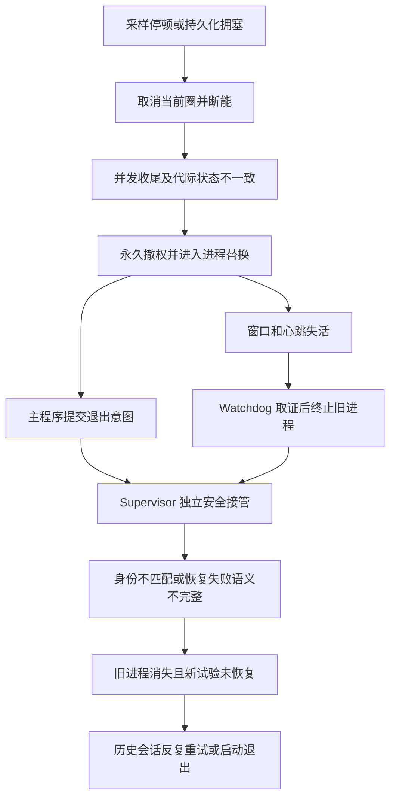
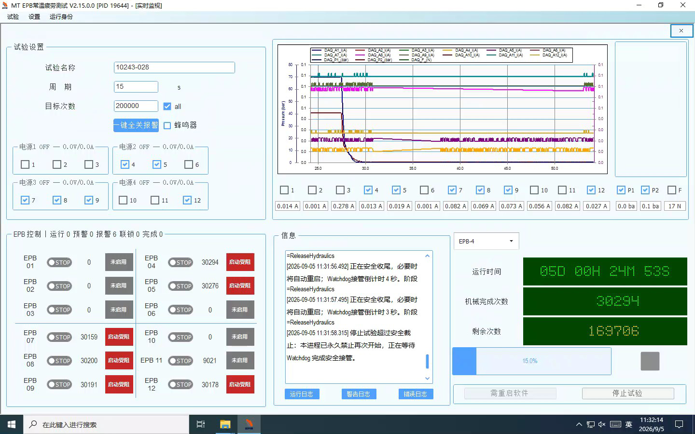

# V2.16 稳定化根因分析与实施方案

日期：2026-09-05  
对象：10243-028；V2.14.2.11 长时运行退出、V2.15.0.0 启动失败及远程部署  
状态：**已完成封盘取证和源码分析；本文是实施方案，不是已修复、已打包或现场放行记录。**

## 1. 决策结论

建议从 `2.14.2.11` 标签建立 V2.16 稳定化分支，保留已在现场运行过的控制流程，按模块移植并修正 V2.15 的恢复改进；使用 R27 的分层快捷部署形式，重新生成适合 V2 架构的安装器。**不要直接合并整个 V2.15/V3 分支，不要只修改版本号、增加重试次数或放宽保护阈值。**

本轮发现的核心问题如下。

| 优先级 | 结论 | 证据强度 |
|---|---|---|
| P0 | V2.14 的“软件消失”包含 Watchdog 强制终止和主程序按恢复协议主动退出两种路径；退出后恢复协议经常不能接续 | 多会话日志、退出意图、接管回执直接证明 |
| P0 | 9 个不同会话反复发生 `SupervisorSafetyHandoffIdentityMismatch`，独立安全接管长期未成功 | 去重后至少 15,129 条该原因事件；不能当成 15,129 次事故 |
| P0 | 多次约 1.1 秒的液压样本过期被放大为正式圈边界失败、全局撤权和进程替换 | I0027、I0031、I0032、I0033、I0034、I0035 的重复故障链 |
| P0 | V2.15 启动重试存在确定的完成顺序错误：worker 返回后先被协调器判成终态，调用方才提交 RetryReady，导致后续执行许可被拒绝 | I0036 日志与生产源码互相对应；该缺陷在 V2.14 基线中也存在 |
| P0 | V2.15 新鲜度拒绝原因不透明，短积压/恢复重入与真正超龄混在一起，放大了启动缺陷的触发面 | 首次失败记录年龄 0.0～0.9ms、另一通道 22.2ms；代码另检查 ReaderLagState 等条件 |
| P0 | 截图中的“等待 Watchdog 接管”与真实协议状态不一致；人工停止后看门狗实际禁止续跑，界面仍显示接管倒计时 | I0036 的 ManualStopIntent、ClosingFenceObserved、RelaunchState=None |
| P1 | Supervisor 对已终结会话持续重新拉起 Sidecar，形成历史会话启动/退出风暴 | 终态事件与 Supervisor 每秒检查、再次启动的代码路径对应 |
| P1 | V2.15 新增正式圈收尾事务缓存只在整轮结束清理，不能直接作为长稳实现移植 | 每个 run/epoch/slot/channel 一个条目；源码只在清批次时删除 |

“彻底解决”的交付定义是：**修复已证实的因果链，补齐首发诊断，真实生产路径故障注入通过，实际安装包通过硬件和连续长稳验证。** 现有证据不足以承诺所有硬件、驱动和远程机环境下永不故障；但足以确定需要修改的生产路径和验收条件。

## 2. 取证范围、版本和限制

### 2.1 本轮实际检查

- 用户指定的 13 个目录均存在，逐一检查 `backup-manifest.json`、现有运行/警告/错误日志、检查点、Watchdog 会话和退出/恢复记录。
- 对这 13 份 `index.db` 使用 SQLite `mode=ro&immutable=1` 只读打开，全部 `PRAGMA integrity_check` 返回 `ok`。
- 按 `SessionId + EventId` 合并指定目录下 `WatchdogSessions/*.sidecar-events.jsonl`，得到 **19 个会话、65,261 条不同事件**。未把 `WatchdogSessions.LegacySealed-*` 再计一次。
- 核对标签差异、当前生产源码，以及 R27 安装器和包身份。
- 在本机 **Windows PowerShell 5.1.26100.9168** 下静态解析 R27 内 4 个 `.ps1`：无语法错误；核对外层清单 128 项 SHA-256：全部一致。没有执行安装器的部署、卸载或杀进程功能。
- 未改动生产控制代码，未操作 NI/CAN/程控电源，未安装或启动候选程序，未运行现场故障注入。

### 2.2 版本基准

| 对象 | 固定身份 | 用途 |
|---|---|---|
| V2.14.2.11 | 标签 `2.14.2.11` → `6ed4d47bc201d95757fdf790ab9282ff9f57cb08` | V2.16 实现基线 |
| V2.15.0.0 | 标签 `2.15.0.0` → `4f0739dfc3baa807ec2ccd2567e62d071f1a456b` | 模块改进来源；也包含本次启动故障 |
| 当前工作区 | `feature/safety-margin-freezeA-20260101`，HEAD `84a1b941933b0938e69493ef6c404ceae21885ef` | 已包含 V2.15 和后续部署改动，**不等于 V2.14 基线** |
| R27 内层程序 | `86797b165db694e7faf19703e20187486b7154ca` | V3 现场候选程序，不移植其架构作为本次默认方案 |
| R27 外层工具 | `a5d290ccf99d9a98602a6dc90e3062ad813da6bb` | 快捷安装和进程清理能力参考 |

V2.14 现场 EXE 的 SHA-256 为 `9158a6cf57cfd6329d3f8dc3dd254f5e35a0d8c8b9fe48cd43b9a3919837a8ba`，运行身份中的 GitCommit、GitDirty、BuildUtc 为 `unknown`。因此源码能解释设计缺陷，但不能直接替代该 EXE 的匹配符号与线程栈。

I0036 的 EXE SHA-256 为 `dc858fc10633975f39237ed8fc5a20c4b8b12fedcd2a05b33aa050c61ae78db3`，运行身份明确记录 V2.15 标签提交、`gitDirty=false`、构建时间 `2026-09-03T06:18:50.7864099Z`，源码对应关系更明确。

### 2.3 不能误用封盘数据

这些是**增量备份**。备份时刻、日志最后时刻和故障时刻不同；一个包可以同时包含正在运行的新会话和仍在重试的旧会话。文件还会滚动，同一会话在后一个包中的事件文件不一定保留全部早期记录。

本轮不将“13 个包”解释为“13 次崩溃”，也不将某个增量包内没有某文件解释为该文件在现场不存在。用户列出的序列跳过 I0026，且包含更早会话；本轮没有重建完整基准备份及全部增量链，所以原始波形文件完整性、删除清单应用结果和每圈业务计数不作全量通过结论。

本文所有现场时间均为 **UTC+8**。JSON 中的 `Z` 时间已换算；文件名中的时间只用于识别备份。

## 3. 13 份封盘逐份结论

根目录均为 `D:\EPB_Data\Backups\`；下表列出完整目录名。证据文件的精确路径和关键行号见配套[封盘证据索引](2026-09-05_V2.16_封盘证据索引.md)。

| 封盘目录 | 可确认的事件/状态 | 分析结论 |
|---|---|---|
| `10243-028_V2.14.2.11_I0023_0903_1004` | PID11916 的检查点 09-03 10:04:10 仍为 MechanicalCycleCompleted；同时保留 PID8084 于 04:52:02 被终止的历史会话 | 当前快照仍在运行；旧会话安全接管持续失败 |
| `10243-028_V2.14.2.11_I0024_0903_1246` | 12:20:22 Dev1 持久化队列达到 256 批，后台最老批次 547.3ms；Timer 心跳过期；随后形成退出意图 | 独立的持久化拥塞触发链；旧会话最终 SafeIdleRecoveryBlocked/UnhandledSoftwareStartup，事件滚动限制精确退出时刻判断 |
| `10243-028_V2.14.2.11_I0025_0903_1508` | 新 PID13388 从 12:48 运行，15:08:11 仍更新完成圈；旧终态会话反复启动 | 不是这一时刻又发生了一次退出；可见新运行与旧恢复残留共存 |
| `10243-028_V2.14.2.11_I0027_0903_2039` | PID23088 在 20:38:18 液压样本过期，20:38:20 边界失败，20:39:03 被 Watchdog 终止 | 明确的“短停顿→故障放大→强制退出→身份校验阻断”链；包内另有 17:38 的历史启动失败会话，不能混为同一运行 |
| `10243-028_V2.14.2.11_I0028_0903_2313` | PID23348 于 21:57:39 被终止；此前 Slot=-1 且三个布尔证据都为 true 仍报边界失败；后续 PID11544 于 23:13 人工停止 | 有正式圈/代际收口问题；后来的人工停止不是自动故障 |
| `10243-028_V2.14.2.11_I0029_0904_0931` | 含 03:00 液压样本过期历史；PID7784 于 05:51:35 被终止；PID6288 之后运行至 09:31 | 多个会话混存，新会话运行不能证明旧会话自动恢复成功 |
| `10243-028_V2.14.2.11_I0030_0904_1006` | PID6288 在 10:04:05 发生液压样本过期，10:04:10 记录 ApplicationExitRequested；新 PID11924 的检查点已更新 | 明确存在主动退出路径；旧会话 UnknownRun/UnhandledSoftwareStartup/Blocked |
| `10243-028_V2.14.2.11_I0031_0904_1244` | PID11924 在 12:38:47 故障，12:39:08 请求退出，12:39:38 观察到旧进程退出；12:44 新批次 FormalRunArmed | 再次出现边界失败及身份校验阻断 |
| `10243-028_V2.14.2.11_I0032_0904_1447` | PID15264 在 14:46:47 故障，14:47:09 请求退出，14:47:39 观察到退出 | 同类故障；并非偶发的单个卡钳异常 |
| `10243-028_V2.14.2.11_I0033_0904_1913` | PID21336 在 19:12:48 故障，19:13:10 请求退出，19:13:40 观察到退出 | 同类边界失败；接管继续报身份不匹配 |
| `10243-028_V2.14.2.11_I0034_0905_0726` | 含 PID12120 在 01:04:04 故障、01:04:23 请求退出的历史；PID11872 从 02:22 运行至 07:26 | 封盘时已是新会话；旧恢复仍未收口 |
| `10243-028_V2.14.2.11_I0035_0905_1101` | PID11872 在 10:42:48 故障，10:43:10 请求退出，10:43:40 观察到退出；11:00 新 PID23532 启动 | 运行约 8 小时 20 分钟后复发；长时故障尚未解决 |
| `10243-028_V2.15.0.0_I0036_0905_1132` | PID19644 首次启动定位即触发样本质量拒绝，继而缺执行许可；人工停止后 ReleaseHydraulics 超时、Closing 未终结 | 本次主要是启动/回滚/停止协议问题；未见该会话 OldProcessTerminated 事件 |

补充统计：所选事件片段去重后有 5 条 `OldProcessTerminated`、5 条 `TakeoverReplacementOldProcessExited`、6 条 `ApplicationExitRequested`。这些类别会属于同一条事故链，不能相加作为事故次数。其中一个历史启动失败会话曾成功拉起新 PID，但随后 `RejectedNoWorkEvidenceInvalid`，不构成恢复完成。

## 4. V2.14：为何运行一段时间后整个软件退出

### 4.1 首发输入异常与故障放大

多次液压错误记录的是 **StaleSample**，不是已证实的压力不足。例如：

| 事件时间 | 样本年龄 | 记录压力/最低值 | 后续 |
|---|---:|---|---|
| 09-03 20:38:18.588 | 1110.8ms | 69.176/60bar | Slot698 失败、PID23088 被终止 |
| 09-04 12:38:47.413 | 1113.2ms | 71.118/60bar | Slot613 失败、PID11924 请求退出 |
| 09-04 14:46:47.408 | 1121.6ms | 71.261/60bar | Slot488 失败、PID15264 请求退出 |
| 09-04 19:12:48.040 | 1108.4ms | 70.862/60bar | Slot1054 失败、PID21336 请求退出 |
| 09-05 01:04:04.048 | 1124.7ms | 70.548/60bar | Slot195 失败、PID12120 请求退出 |
| 09-05 10:42:48.489 | 1110.1ms | 69.299/60bar | Slot2001 失败、PID11872 请求退出 |

陈旧的高压力值不能证明当前压力安全；但足以说明此次报警条件是证据超龄，不能据此认定液压硬件压力低。

I0035 随后记录 Dev1 回调空窗 **1173.3ms**，以及 Dev1/Dev2 约 **267.8/267.5ms** 的空窗。采样停顿是事实。故障前后主程序工作集约 229～234MiB、可用内存约 11GiB、磁盘队列为 0，所取时间窗不支持“内存耗尽导致退出”的结论；系统其他进程 CPU 较高，但还不能据此唯一归因到某个后台进程。

关键放大过程是：液压样本异常使多个执行者同时进入清理；正式圈 fallback 立即读取到 `MotorOff=True, HydraulicReleased=False, Persistence=False`，继而发布 `FormalSlotSafetyBoundaryFailed`，永久撤销本进程上电权限。**正在完成的安全收尾，被过早解释成必须替换进程的失败。**

I0028 还出现 `Slot=-1, MotorOff=True, HydraulicReleased=True, Persistence=True` 的失败，以及当前 RunEpoch=2、恢复 ContextEpoch=1 的拒绝。说明另有“没有正式槽/代际已推进，旧回调继续提交边界”的路径。不能只给正常槽加等待就认为全部解决。

### 4.2 进程退出方式有两类



- PID23088：`HeartbeatUnresponsive` → `OldProcessTerminated`，属于 Watchdog 强制终止。
- PID11924、15264、21336、12120、11872：有 `ApplicationExitRequested`、退出意图文件以及 `TakeoverReplacementOldProcessExited`，属于受控进程替换路径。
- PID11916、6288：保留退出意图，但旧事件已部分滚动，且出现 `UnhandledSoftwareStartup/UnknownRun` 与终态阻断；不为缺失的底层退出时刻作推断。

因此“禁止 Watchdog 杀进程”不足以解决问题：另一条主动退出路径仍会发生；而真正失活的硬件控制进程仍需要独立安全处置。

### 4.3 恢复确定失败：安全接管协议及失败语义

9 个会话持续记录 `SupervisorSafetyHandoffIdentityMismatch`。以 I0035 的 `678e449...` 为例，旧进程退出已被观察，relaunch 为 Approved，但安全回执 `WorkerProcessStartUtcTicks=0`、`IsSafetyCompleted=false`，没有独立 SafetyAgent 成功证据。

V2.14 的 `SupervisorServiceHost` 将 receipt 读取、Schema、状态、HandoffId、Nonce、permit、路径和哈希的多个条件合并为同一个错误码；请求和多镜像读取可能不对应同一版数据。**“身份校验阻断恢复”已经确认，具体哪个字段首先不匹配尚未确认。** 本批旧会话缺少足够的服务端逐字段审计，不能把推测的字段当成最终根因。

另有 `UnknownRun / UnknownStage / UnhandledSoftwareStartup / OutcomeUnknown`，以及重复请求被计为 `RelaunchAlreadyPending`。这些记录表明失败上下文和幂等接收结果仍需治理：已受理或重复提交不能等同于一次新的启动失败，故障收尾也不能丢掉被冻结的 RunId 后再生成 `UnknownRun`。

### 4.4 历史会话启动/退出风暴

去重后的事件中有 **17,330 条 Starting、21,571 条 TerminalSessionObservedOnStartup**。这是日志证据，不代表曾同时运行如此多进程，也不能直接当作真实进程创建次数。

生产代码 `SupervisorServiceHost.SupervisorOwnedSession.MonitorLoopAsync` 每秒发现子进程不在，就读取启动记录再 `StartFromRecord`；此路径没有先以持久会话终态判断是否还应监管。Sidecar 读到终态后退出，Supervisor 再拉起它，形成闭环。**这个缺陷在 V2.15 中仍需修复。**

对 DAQ 调度影响的程度还需进程创建事件或 ETW 验证；但仅就无意义的反复创建/退出、日志增长和遗留恢复任务而言，已经足够列为必须解决的问题。

### 4.5 持久化拥塞必须单独治理

I0024 先发生 Dev1 256 批队列硬上限和 547.3ms 最老批次超龄，随后出现 Timer 30 秒心跳超时与恢复失败。这条链不能全部归入液压样本问题。

需要定位持久化 worker 在拥塞时的写盘、SQLite、快照、文件删除/封存和锁等待；持续记录队列年龄、吞吐与 worker 进度。达到上限应在保证已接纳数据有终态的前提下暂停受影响组，并禁止无界内存增长或静默丢数据。

## 5. V2.15：截图故障的完整解释



### 5.1 首发故障不是缺许可，而是样本质量拒绝

| 本地时间 | 事实 |
|---|---|
| 11:31:21.443 | 冷启动安全基线通过 |
| 11:31:22.551 | 两台 DAQ 启动健康检查通过 |
| 11:31:23.464 | 电源组 2/3/4 启动预检通过 |
| 11:31:25.084 | 两台 DAQ 记录约 318.2ms 未带电回调空窗；同期 Watchdog 已进行首发诊断抓取 |
| 11:31:28.120 | EPB4、7 正向 DO 命令成功，随即关闭 |
| 11:31:28.132 | EPB4 第一次重试：`DaqSampleStale Age=0.9ms，要求≤100ms` |
| 11:31:28.141 | EPB7 第一次重试：`FastSampleInvalid Age=22.2ms Quality=SampleStale` |
| 11:31:29.218～29.219 | 恢复 worker 完成后，通道被置为 `StartBlocked/RecoveryWorkerCompletedWithoutTerminal` |
| 11:31:29.223 起 | 下一轮因 `ChannelExecutionPermitMissing` 失败；其他通道重复同样过程 |
| 11:31:38.978～41.278 | 重试耗尽，批量启动回滚；界面提示“正式运行未提交，不杀进程” |
| 11:31:41.346 | 同进程恢复已经开始；后续又尝试冷启动基线 |
| 11:31:43.125 | PSU4 `SOUR:VOLT?` 响应超时 1500ms，关闭输出无法可靠确认 |
| 11:31:45.408 | 操作员停止命令被接受 |
| 11:31:45.672 | Sidecar 观察 ClosingFence，明确禁止自动拉起 |
| 11:31:58.295～58.315 | 恢复因“无人值守续测未授权”拒绝；界面却提示等待 Watchdog 接管 |
| 11:32:04.432 | StopAll 才记录恢复 DAQ 采样以重新确认液压压力 |
| 11:32:10.973、22.024 | 关闭仍因 `TombstoneState=Closing` 等条件阻断，随后出现退出诊断截止 |

318.2ms 空窗与 dump 抓取时间接近，只能列为需要控制诊断开销的线索；本轮不认定 dump 是该空窗的唯一原因。

### 5.2 确定的顺序缺陷：RetryReady 提交晚于 worker 的终态裁决

相关路径：

- `Controller/EpbManager.StartupPositioning.cs:229`：`RunStartupPositioningRetryIncidentAsync`。
- 该 worker 的 body 只有 `Task.Delay`，没有在返回前提交下一状态。
- `Controller/RecoveryIncidentCoordinator.cs:527`：`RunWorkerAsync` 等待 body 返回后立即检查终态；缺少终态时在第 554 行执行 `RecoveryWorkerCompletedWithoutTerminal` 安全收口。
- 调用方等待整个 `WorkerTask` 完成，才在 `finally` 调用 `CompleteAfterTerminal(CommitRecoveryIncidentStateForRetry(...Starting...))`。

实际先后关系为：

```text
Delay 完成
  → 协调器发现尚无终态
  → CommandOff + PublishSafeTerminal(StartBlocked)
  → WorkerTask 完成
  → 调用方 finally 尝试 RetryReady，已失去原恢复状态
  → 下一次 CommandForward 因 StartBlocked 拒绝
```

这段逻辑在 `2.14.2.11` 标签中也存在。V2.15 的采样质量门禁改变让它在此次启动中被稳定触发，不能只回退整个 V2.15 来解决。

正确实现应在 **worker body 返回之前**，由当前 incident owner 验证 RunId/RunEpoch、取消状态、断能证据和通道许可后提交 `Starting/RetryReady`。协调器还需要验证该提交确实成功。`finally` 只负责失败/取消清理；人工停止或全局撤权到来时绝不能重新发放许可。

### 5.3 新鲜度判定需要修正语义并补足证据

`IO.NI/TwoDeviceAiAcquirer.cs:2781` 的 `IsFresh` 不仅看 AgeMs，还看 SampleAgeMs、ReaderLagState=Healthy、连续新鲜批数≥3。启动报错只打印 AgeMs，遗漏真正拒绝的其他条件，所以出现“0.9ms 却超过 100ms”的误导信息。

V2.15 另以 `BufferedSamples > _samplesPerChannel` 判 backlog。本次 N=20、Fs=2000Hz，一块仅为 **10ms**；“缓冲中多于一块”不能自动等价于“控制样本年龄超过 100ms”。代码会据此设置 SampleStale、清零连续新鲜计数，后续还需连续三批恢复，可能频繁拒绝启动。

**高置信问题是门禁尺度和日志语义不一致；尚未逐帧证明本次每一次拒绝都来自该 backlog 条件。** 必须补录原子一致的 sample age、driver backlog、reader state、序列、代际和质量原因，才能区分短暂排队、真实积压与跨线程快照不同步。NI 对 `Available Samples Per Channel` 的说明是缓冲中的可读样本数量，并未将“一块以上”定义为控制失效：[NI 官方说明](https://knowledge.ni.com/KnowledgeArticleDetails?id=kA00Z0000019U45SAE&l=en-US)。

保留真正陈旧数据禁止控制的要求；把驱动积压转换为时间量并与采样时间、读/发布进度共同判断。恢复准入应检查持续健康窗口，不能在整个启动前只检查一次。

### 5.4 截图中的“等接管”不能兑现

I0036 的 Sidecar 最终为 `ClosingFenceObserved`，`ManualStopRequested=true`，`RelaunchState=None`。这是操作员停止后的协议状态。看门狗没有获得此次自动续跑许可。

主程序另一条 UI/恢复路径仍输出“倒计时接管”“必须 Watchdog 重启”。与此同时，`ReleaseHydraulics` 阶段还在等待 DO 完成、电源任务、压力证据等多个条件。截图压力近零并不能证明这些证据和逻辑清理已经成功；也不能看到 ReleaseHydraulics 就断言机械卸压阀卡住。

必须拆开三种意图：**安全断能接管、重建应用进程、自动恢复试验**。人工停止可以禁止自动续跑，但不能把必要的安全断能接管一起取消；界面只有在已持久化并获得接管 ACK 后才显示真实倒计时。

### 5.5 PSU4 超时是后续独立问题

`SOUR:VOLT?` 超时出现在首轮定位失败、回滚和同进程恢复之后，不能倒置为首次失败原因。需要检验遥测和关闭是否串行使用同一连接、超时后是否残留半行响应、取消能否打断 I/O、断电确认是否被不必要的全量遥测拖住。

方案要求每台电源只有一个命令队列和响应配对者；安全 OFF 优先，发出关断与取得关断证据分别记录。通信失效不能伪造 OFF 成功，应转入独立安全路径。

## 6. V2.16 的目标结构与不变量

保留 V2 的 WinForms 主程序、Controller、NI 访问和现有界面；本次不引入 V3 EngineHost/RecoveryKernel 的整套重构。Supervisor 负责进程及恢复权威，Sidecar 负责会话监督，SafetyAgent 负责独立安全动作。**一个现场安装集合使用一个架构代际和一套相容协议。**

| 不变量 | 实现要求 |
|---|---|
| 单一执行权威 | 同一项目最多一个获准控制硬件的主进程；PID、启动时间、路径/哈希、SessionId、RunId、RunEpoch 必须对应 |
| 断能优先 | 诊断、日志、数据库及界面不能阻塞安全 OFF；命令已提交、驱动写成功、电流归零和独立物理证明分开记录 |
| 瞬态不等于终态 | RetryReady 必须在 owner 释放前提交；PendingSafetyClosure 等待现有动作完成，有明确硬截止 |
| 老代际不可复活 | 撤权、人工停止或新 RunEpoch 提交后，旧回调/重试/receipt 只能收尾，不能重新上电 |
| 恢复结果可判定 | 安全接管完成、主进程拉起、检查点接续、首个正式圈提交是四个不同里程碑 |
| 人工停止最高优先 | 停止后不自动恢复试验；必要时安全代理继续断能，软件重建后保持待机 |
| 数据不可伪造成功 | 未完整正式完成的圈不得计作正式通过；已接纳批次必须有持久化或明确中止/缺口终态 |
| 所有长期集合有上限 | 完成的 slot/incident/permit/worker 及时回收，历史审计落盘并按明确保留策略管理 |

进程级恢复建议统一为：

```text
RecoverableIncident
 → Frozen（冻结旧 Run/圈/数据边界）
 → LocalSafetyClosure（同一事务的断能与收尾）
 → InProcessReady，或 ExternalTakeoverAccepted
 → OldProcessExitProven
 → IndependentSafetyConfirmed
 → RelaunchAuthorized
 → MainAttached
 → CheckpointResumed
 → FirstFormalCycleCommitted
```

每一转移携带固定 TransactionId、旧进程身份、冻结运行身份、generation、revision、配置快照哈希及硬截止。重复请求返回原事务结果；不重新分配 permit，不计作失败。永久硬件故障和人工停止进入可说明原因的安全待机。

## 7. 改造任务与移植边界

### P0-A：先修启动重试与停止竞争

目标文件：`EpbManager.StartupPositioning.cs`、`RecoveryIncidentCoordinator.cs`、`EpbManager.cs`、`ChannelExecutionFence.cs`、`EpbCycleRunner.StartupPositioning.cs`。

1. 在真实 worker 内提交 RetryReady；提交失败必须返回明确原因并安全终止。
2. 在 RetryReady 与后续上电之间重新验证取消、RunEpoch、人工停止以及断能状态，避免检查后状态变化的竞争。
3. 软件基础设施修复次数与真正机械定位次数分开计数；不无限重试，不直接把 `StartBlocked` 改回 Starting 绕过证据。
4. 日志保留首次根因和后续派生原因，不能最后只剩 `ChannelExecutionPermitMissing`。
5. 启动失败允许生成“启动事故证据”，不要求已存在正式圈号；修复 I0036 的“报警快照缺少活动圈及冻结圈号”。

### P0-B：移植并修正 DAQ 独立读取和新鲜度

目标文件：`TwoDeviceAiAcquirer.cs`、`ControlBatchRing.cs`、`FastPathTripClassifier.cs`、`EpbManager.DaqLiveness.cs`、`App.config`。

1. 保留每设备独立读取线程的方向，拆分当前仍在 `ReadDeviceLoop→OnAiBatch` 同步执行的计算、状态发布和故障回调；读取边界仅做读入、时间/序列标注及有界发布。
2. 用同一代际、同一批次的不可变快照统一发布 SampleTime、PublishedTime、ReaderState、quality 和 backlog；避免拼出“新样本时间+旧质量状态”。
3. 新增 `DriverBacklogMs = BufferedSamples / ActualSampleRate × 1000`，与 SampleAgeMs 分别记录；禁止仅因超过 N 个样本就认定达到 100ms/250ms。
4. 本次候选保留 V2.15 的 75/100/250ms 分层意图；100ms 准入、250ms 硬保护的实际断能延迟必须实测。V2.14 的独立 liveness 配置是 250/1500/5000ms，不能把两版写成所有保护阈值始终相同。
5. 真正陈旧批次不进入控制判定；仅在独立确认断能、相关旧圈已冻结后排空。对排空序列写明确 discard/suppression 记录，不能产生无法解释的持久化缺口。
6. 读取线程停机、代际替换和 NI 任务 Dispose 有界；无法退出的旧线程不得与新任务共同控制同一设备。
7. 首发轻量诊断与重型 dump 分级、限频；记录抓取耗时，验证其不会成为新的采样停顿来源。

### P0-C：安全收尾、代际和持久化统一收口

目标文件：`EpbManager.BatchStart.cs`、`FormalBatchSlotCoordinator.cs`、DAQ 恢复相关 partial、`StopSafetyTransactionRunner.cs`、`EpbManager.StopSafetyOperations.cs`、`EpbManager.StopSafetyHardening.cs`、持久化协调器。

1. 正常回调、异常 finally 和 coordinator fallback 共用同一个正式圈收尾事务，等待当前断能、液压 lease 和数据持久化完成。
2. 区分 Pending、Failed、Cancelled、NotApplicable。`formalSlot=-1` 不走有效正式槽提交；无活动圈时不要求不存在的圈证据。
3. 收尾事务使用进入时冻结的 RunId/RunEpoch/Slot/AttemptId；不得用稍后变化的 `_activeBatchId/_runEpoch` 为旧回调重新归属。
4. 物理安全确认与旧运行资源清理分开提交。推进新 epoch 后，旧 epoch 的 cleanup receipt 可以关闭原事务，但不能向新 epoch 授权。
5. 禁止“任务自己被自己等待”的 drain；恢复 owner、启动 worker、StopAll 和落盘 worker 的等待依赖画清并注入验证。
6. ReleaseHydraulics 分别显示 DO、电源、压力、采样就绪的等待项；保持必要的压力采样直至确认完成，后台采样重建必须算入统一截止预算。
7. I0024 的 writer 拥塞加入实际生产 writer 的慢盘/锁等待注入；保证冻结边界内数据有结果，恢复后不重放成重复机械动作。
8. V2.15 的 `_formalSafetyClosureTransactions` 不能原样带入：按“所有消费者结束+receipt 已持久化”移除，保留有上限的幂等结果窗口。六通道 200,000 圈可累计约 120 万个键，现有每 run 才清理不适合 x86 长稳。这是新增风险，**不是已证实的 V2.14 退出原因**。

### P0-D：完整移植 Supervisor 权威事务并修正会话退休

目标文件：`SupervisorServiceHost.cs`、`SupervisorSafetyAgentLaunchClient.cs`、`SupervisorMainLaunchClient.cs`、`WatchdogHost.cs`、`SafetyAgentRunner.cs`、`SupervisorSafetyAuthority.cs`、相关 Protocol/Client/SessionAgent。

1. 按成套依赖移植 V2.15 的 Supervisor 单一安全权威、固定 receipt/Revision/Hash、一次性启动 capability、独立 SafetyAgent 和幂等重试；不能只复制服务端或只复制协议 DLL。
2. 任何镜像只能作为副本，恢复执行只能消费权威事务指定的一版。断电证明绑定精确硬件配置、旧身份与有效期。
3. 逐字段诊断 mismatch，记录期望/实际摘要和实际读取路径；普通日志不写原始 nonce/令牌。
4. 新增 Supervisor 的持久状态：Active、Retiring、Retired、Recovering、Blocked。终态 ACK 后停止监控并封存启动记录；服务重启后仍不能恢复旧终态会话。
5. 对可恢复 Sidecar 异常实行有界退避；对 Terminal/Retired 不再重启；新会话激活前完成旧权威退役。不能用只隐藏重复日志代替退休。
6. 保留原故障 RunId、阶段和根因；`AlreadyAccepted/AlreadyRunning/RelaunchAlreadyPending` 返回现有事务，不增加失败次数；确实缺少证明时才计入有界恢复预算。
7. 若必须退出主程序，先确保接管意图已持久化并被 Supervisor 接收。主程序已卡死时，由独立监管路径按冻结配置实施接管。
8. 旧 schema5/6 的活动许可不能直接迁移为 V2.16 有效许可；版本化迁移只保存业务进度和必要证据，由新运行重新取得授权。

### P0-E：统一界面、人工停止及恢复意图

目标文件：`FrmEpbMainMonitor.UnattendedRecovery.cs`、`FrmEpbMainMonitor.WatchdogUi.cs`、`FrmEpbMainMonitor.CloseOverlay.cs`、`WatchdogRuntime*`、`UnattendedRecovery.cs`、Closing 协议。

1. 只有 Supervisor 已 ACK 的事务才显示“已接管/预计剩余时间”。没有许可时明确显示“安全停止，自动续跑已取消”。
2. 人工停止时取消所有待开始/重试/续跑，保持 SafetyOnly 接管能力；必要的进程重建完成后停在待机，不自行继续机械动作。
3. 启动回滚、同进程恢复、人工停止合并至同一停止事务，后到的请求只升级意图，不重复清场。
4. 关闭墓碑终态必须可完成；不能因为传输已经释放便丢失最后 ACK，也不能把 EngineActive=false 当作安全收尾完成。
5. 保留独立心跳和控制/UI 进度维度；诊断进程、控制和 UI 的真实失活。使用 typed stop transaction 给予有界宽限，不仅依赖窗口是否可见。

### P1：数据、资源和可观测性

- 检查点区分累计机械完成数、正式有效圈、学习圈和中止圈。I0036 截图 EPB4 机械计数为 30,294，DB 中最大非负圈号为 29,926、非负记录的 mechanical_completed 合计为 29,869；这是**口径对账项**，不是已证实丢了 368/425 圈。迁移不能用 `max(cycle_number)` 覆盖现场累计计数。
- I0035 有 6 条 running，因为该封盘时新试验仍在运行；I0036 无 running。不能把前者一律修成 aborted。
- 13 份 DB 结构正常只证明 SQLite 结构可读。另验 Raw/BIN 范围、sample_count、最后完整序列、checkpoint、机械计数和状态的一致性。
- 汇总故障根事件，并限频重复诊断。保留 worker 数、句柄、线程、Private Bytes、GC、DAQ 读取/调度、管道延迟、持久化最老年龄及 retired 会话数。
- 备份纳入 Supervisor 权威回执、服务账户审计、SessionAgent 状态、应用/System/WER 事件和匹配 dump/PDB 身份。原始权限令牌按受控证据处理，不进入普通报告。

### 7.1 移植矩阵

| 来源 | 决定 | 必须补的验证 |
|---|---|---|
| V2.14 自适应正反向、错峰、共享液压/电源分组 | 作为基线保留，按上述确定缺陷修改 | 正常曲线、学习、计数和局部隔离回归 |
| V2.15 DAQ 独立读取、样本时刻传播 | 修改后移植 | 驱动读节拍、正常短 backlog、真正超龄、代际切换 |
| V2.15 PendingSafetyClosure 和单事务收尾 | 修改后移植 | Slot=-1、finally/fallback、资源上限及长稳 |
| V2.15 Supervisor/SafetyAgent/Protocol/启动许可 | 整套移植并完善 | LocalSystem 安装态、身份不匹配字段、服务重启、旧会话退休 |
| V2.15 原启动重试与人工停止交互 | 按本文修复后才纳入 | 真实 worker 顺序及停止竞争 |
| V2.15 版本源、构建身份、PDB、E2E 支持 | 移植 | 实际交付包与验证对象哈希一致 |
| R20/R21 PS5.1 任务停止、UTF-8 检查点读取 | 保留 | 中文 JSON、重复修复和不同代码页 |
| R27 分层目录、完整哈希换包、受控进程退出、日志 | 适配 V2 后移植 | 同版本不同包、路径/权限、占用文件、中断重试 |
| R27 的 EngineHost、V3 架构代际、schema7 服务和十组件要求 | 不直接移植 | V2.16 只需其部署形式，不引入该整套架构依赖 |

标签间差异为 75 个文件、约 6,712 行新增/497 行删除，且主要集中在一笔 `f79d9e2` 功能提交；实施应按模块形成小提交，不能整笔 cherry-pick 后就视为稳定融合。各提交使用中文 Conventional Commit 说明。

## 8. 远程安装包方案

### 8.1 目录和身份

```text
V2.16.0.0_现场验证包_<程序提交12位>_QUICKDEPLOY_R28/
├─ 一键安装正式版.cmd
├─ 一键修复.cmd
├─ 一键卸载.cmd
├─ 检查运行状态.cmd
├─ 启动试验.cmd
├─ 一键停止全部相关进程.cmd
├─ 恢复后台服务.cmd
├─ 导出故障证据.cmd
├─ QuickDeploy-Installer.ps1
├─ Stop-RelatedProcesses.ps1
├─ 快捷部署说明.md
├─ 快捷部署包身份.json
├─ 快捷部署包-SHA256.txt
├─ 现场验证候选包-未正式放行.txt
└─ Package/
   ├─ MTTFTest.exe、V2.16 同代际依赖及 PDB
   ├─ Config/（默认配置，安装时不直接覆盖现场校准）
   ├─ 发布与自检脚本
   ├─ build-identity.json
   └─ SHA256SUMS.txt
```

R28 是建议的后续工具修订号，不代表已生成。通过正式放行后包名和身份改为正式状态，文件哈希重新封存。保留熟悉的“安装正式版”入口时，候选包必须醒目标明当前仍是现场验证包，不能由脚本名称推断已放行。

内层程序身份与外层工具身份分别记录。当前 R27 正是程序提交 `86797b1...`、工具提交 `a5d290c...` 的组合；V2.16 也需记录 `packageGitCommit`、`bundleSourceCommit`、产品版本、工具修订、组件/配置哈希、构建时间、架构代际和真实放行状态。

V2.16 的八个原有正式身份组件仍为 Main、Controller、Watchdog、SafetyAgent、SafetyHardware、SessionAgent、Protocol、Client，并校验全部依赖文件。架构标识建议使用明确的 V2 家族标识；若更改持久协议，分配独立契约版本并提供迁移器，不能直接冒用 R27 的 `EPB-RecoveryKernel-V3` 或仅替换版本字符串。

### 8.2 安装事务

1. **只读预检**：识别 OS/位数、Windows PowerShell、.NET Framework 4.8、NI/CAN/SQLite x86 依赖、安装路径、磁盘空间、活动试验、生产账户、已有组件身份和数据位置。对缺少依赖明确说明缺项，不把“文件复制成功”报告为可运行。
2. **进入维护**：持久化 MaintenanceInhibit 并取得 ACK，取消自动续跑；取得安全停机证据。主程序无法响应时先经独立路径确认断能；未知状态不直接覆盖正在控制的程序。
3. **备份和迁移准备**：备份 Current、配置、检查点、权威事务和数据库；配置合并保留 AI/AO 校准、DO 映射、电源地址、阈值、项目和学习配置。先完成解析和校验，再原子提交。
4. **停止重启来源和旧进程**：停计划任务、SessionAgent 和 Supervisor 监管，处理其恢复设置；按精确身份结束遗留进程并等待句柄释放。
5. **验证 staging**：在同一卷上展开程序、校验内层全清单和依赖，更新依据为版本+提交+内容哈希；同版本不同内容必须换包。
6. **原子切换 Current**：保留旧目录至新安装验证通过；中途失败可再次运行或按安装日志回滚，不产生半新半旧文件集合。
7. **安装服务/任务/ACL/快捷方式**：Supervisor 在服务会话，SessionAgent 和 UI 在指定生产登录会话；以生产账户确认启动许可、实际路径和进程位数。
8. **安装健康验收**：同时检查文件身份、服务任务配置、真实进程路径、权限、管道握手、UI 可达和可读配置；不自动开始机械试验。
9. **提交结果**：输出人可读日志和 `last-deployment-result.json`，明确 PASS/FAILED/ROLLED_BACK 及 ExitCode。成功仅解除安装维护状态，不复用旧的运行授权。

Windows 服务运行在 Session 0，不能把服务启动成功等同于生产用户已能看到界面；应通过用户会话代理和 IPC 管理交互启动。[Microsoft 官方说明](https://learn.microsoft.com/en-us/windows/win32/services/interactive-services)

### 8.3 远程机兼容约束

- 以 Windows PowerShell 5.1 为运行基线，避免依赖开发机 PowerShell 7、Visual Studio、Python 或联网下载。开发/分析依赖和远程运行依赖分开。
- `.cmd` 内容保持 ASCII、CRLF；中文提示放到 UTF-8 BOM 的 `.ps1`；读 JSON 明确使用 UTF-8，不依赖当前 ANSI 代码页。
- 所有文件路径完整引用，并用 `-LiteralPath`；中文、空格、括号、`&`、不同盘符均进入安装测试。拒绝从压缩包内部直接执行。
- 不硬编码用户 `mt`、桌面目录或工作目录；保留固定 x86 安装位置的同时，以实际系统目录 API 解析路径。
- 提权后仍使用原始安装来源与明确参数；记录 UAC 取消和子进程退出码。脚本后台辅助进程使用隐藏窗口，操作员交互入口保留可见结果。
- 安装、修复、卸载可重复执行；已停止/已不存在属于幂等成功，访问拒绝、路径不明、文件占用属于明确失败，不能用 SilentlyContinue 吞掉关键错误。
- 自动回滚仅针对同架构、同迁移契约的已验证包。V2.14 仅作为工程回退来源，不因“以前较稳定”自动晋升为无人值守 LastKnownGood；跨 V2/V3 回滚需独立迁移方案。

### 8.4 一键停止全部相关进程

建议提供外层独立入口 `一键停止全部相关进程.cmd`，用于维护清场；实现复用安装器同一套进程识别模块，避免两套规则漂移。**结束进程不等于硬件已经断能**，这是脚本行为边界，不应在 UI 中虚报安全完成。

正常操作顺序：

```text
识别安装及项目
 → 写维护禁止启动标记并等待 ACK
 → 取消续跑并请求有界安全停止
 → 必要时完成独立安全断能
 → 停止计划任务与自动拉起来源
 → 结束主程序及会话后台，等待精确进程退出
 → 最后结束已经完成安全动作的 SafetyAgent
 → 连续复查没有相关进程、服务/任务不会反拉起
 → 输出结果，保持维护状态
```

实现契约：

| 项目 | 要求 |
|---|---|
| 目标集合 | `MTTFTest.exe`、Watchdog（服务/Sidecar 两种角色）、SessionAgent、SafetyAgent；兼容清理曾安装的 V3 EngineHost，但不把它安装到 V2.16 |
| 身份 | 规范化安装根目录+EXE 路径、PID、启动时间、服务/任务配置及会话参数；保留精确进程句柄，防 PID 复用 |
| 多安装/便携包 | 默认只处理已识别安装；另一个合法路径单列为未处理项，不能对全机同名进程盲杀；经明确指定的旧安装才纳入 |
| 安全停止失败 | 进入独立接管；若仍无法证明断能，显示“清场受阻、需现场物理隔离”。强制清场模式必须基于已确认的维护隔离，不把强杀回执当作安全证明 |
| 不再反复拉起 | 停服务/任务前保存其原状态与恢复设置，维护标记持久化；清场后保持禁止自动启动 |
| 返回结果 | 记录已结束、已不存在、身份不明、拒绝访问、仍未退出；任何目标残留或重启来源未抑制，返回非零 |
| 数据 | 不删除 `D:\EPB_Data`、ProgramData、数据库、配置、回执或日志；清场与卸载分开 |
| 再次运行 | 无残留即成功，不报伪错误；`恢复后台服务.cmd` 复核安装后恢复原配置，启动软件待机，不能自动恢复试验 |

PowerShell 主脚本支持 `-WhatIf` 和结构化输出；面向操作员双击入口只显示必要的维护条件、进度及结果。参数名、退出码及报告 schema 在实现时固定，例如 0=成功、10=安全前置未满足、20=身份无法确认、30=无法抑制拉起、40=进程残留、50=安装身份异常。

## 9. 验证与上线门禁

现有 V2.15 文档记载的 `716/716`、`58/58`、`19/19` 及安装态 E2E `9/9` 是历史验证结果，本轮没有重跑或重新认证。该 E2E 使用 TestMain 和无硬件 SafetyAgent，不能证明生产 `EpbManager` 启动定位、NI backlog、真实电源关闭和液压释放可用；文档也明确硬件及长稳未完成。**V2.16 必须把这些生产路径和实际交付包作为门禁。**

### 9.1 软件与协议回归

| 编号 | 必须注入的场景 | 通过标准 |
|---|---|---|
| T01 | 启动定位第一次采样瞬态失败，后续恢复正常 | 真实 worker 内先提交 RetryReady；保持同一 run/epoch，下一次定位可成功，无 StartBlocked 派生故障 |
| T02 | T01 重试等待期间人工停止/取消/全局撤权 | 后续所有上电拒绝，无 permit/runner 复活，最终安全待机 |
| T03 | 六通道并发、三电源组错峰，多通道同时瞬态失败 | 不串代、不互相清掉合法 owner、不全局重启 |
| T04 | 10ms 块、20～40ms 正常缓冲波动与 100/250ms 真超龄分别注入 | 短 backlog 不被伪装为年龄超限；真实过期拒绝准入/保护，所有原因可从快照解释 |
| T05 | 双 DAQ 0.3s、1.1s、2.6s 停顿及重新进入 | 先断能和冻结当前圈，陈旧样本不控制；新鲜后有界恢复；事故相关联但保持设备作用域 |
| T06 | 旧 generation 延迟回调、停止后 driver read 才返回 | 旧回调只释放资源，不更新新快照、不写新任务、不上电 |
| T07 | 正常/finally/fallback 同时完成；Slot=-1；epoch 提前推进 | 一个收尾事务；无槽不提交正式槽；旧 cleanup 不污染新 run |
| T08 | 256 批落盘上限、500ms 老批次、慢 SQLite/文件锁/磁盘满 | 有界安全暂停，数据有终态，解除后可恢复；无静默丢弃或伪完成 |
| T09 | PSU 遥测半行、响应超时、断开、关闭与遥测竞争 | OFF 优先且响应正确配对；无法确认时交独立安全路径 |
| T10 | StopAll 自身 owner 在 drain 集合、压力采样已停、重复人工停止 | 无自等待；等待项与硬截止真实，停止意图不被恢复覆盖 |
| T11 | 旧 receipt、镜像落后、跨账户、重复提交、ACK 丢失、服务重启 | 权威版本唯一；重复不新增 permit/失败数；错误精确到字段 |
| T12 | Terminal Sidecar 退出后等候 60 秒，再重启 Supervisor | 同一旧 session 不再出现新的 Starting/重启尝试 |
| T13 | 主进程/Sidecar/SessionAgent/Supervisor/SafetyAgent 分别故障 | 独立安全动作成功后唯一主进程接续；“进程出现”不能替代首圈提交 |
| T14 | 人工停止后的必要进程重建 | 可以安全收尾/重建，但无任何自动机械续跑 |
| T15 | 200,000 槽加速生命周期测试、反复异常收尾 | 完成事务、线程、句柄和待执行任务数量有界，旧许可不能重放 |
| T16 | 原正常控制、学习、报警隔离、共享电源、数据回放 | 与 V2.14 已确认的业务行为对齐，明确记录有意变化 |

对 T01/T02/T03，必须使用真实 `RunStartupPositioningRetryIncidentAsync`、`RecoveryIncidentCoordinator`、状态存储和执行 fence，只替换硬件 I/O；不能只测手工设置的最终状态。对 T04/T06，要覆盖真实读取/发布桥接，不仅构造一个 `DaqFreshnessSnapshot` 调用分类函数。

共享控制/持久化/看门狗/电源修改后运行仓库要求的三套测试和相应构建；保留详细结果和版本身份：

```powershell
msbuild TfTest.sln /p:Configuration=Debug /p:Platform=x86
.\Tests\AdaptiveControlTests\bin\Debug\AdaptiveControlTests.exe
.\Tests\EpbDiskWriterTests\bin\Debug\EpbDiskWriterTests.exe
dotnet test .\Tests\PowerSupplyDebugger.Tests\PowerSupplyDebugger.Tests.csproj
msbuild TfTest.sln /p:Configuration=Release /p:Platform="Any CPU"
```

安装态 E2E 在独立测试环境执行，不能在正在运行试验的机器上直接套用会安装服务/清理目录的测试脚本。

### 9.2 真实远程安装矩阵

至少覆盖实际现场 OS 和驱动版本，并在 Windows PowerShell 5.1 中测试：

- 干净安装、V2.14→V2.16、V2.15→V2.16、有 V3 遗留时拒绝混装并引导正确维护。
- 同版本不同哈希换包、相同包重跑、安装中断后继续、损坏包、DLL 被占用、UAC 取消、低权限、低磁盘空间。
- 中文/空格/括号/`&` 路径、UTF-8 无 BOM 旧检查点、CP936/CP65001、非默认安装来源盘符。
- 开始菜单/桌面入口、登录自启动、RDP 断开再连、锁屏；注销/重启属于独立恢复场景，不能承诺主进程跨注销持续运行。
- 一键清场时后台正在自动拉起、精确身份无法读取、多个安装目录、无进程、重复运行和恢复后台。
- 卸载后相关程序/任务/服务/快捷方式符合预期，生产数据完整保留；不因残留 SQLite.Interop.dll 占用而误报成功。

安装前后采集 OS build、PS/CLR/驱动版本、账户/session、进程位数和组件哈希。当前 R27 的语法及校验通过只是静态检查，不能取代本矩阵。

### 9.3 硬件与长稳门禁

1. 先在受控台架验证正常冷启动、停止、断能回读和单类故障；先证明执行安全，再扩大并发。
2. 复现现场六通道 `4,5,7,8,9,12`、15 秒周期、现有压力/电源/学习配置，至少进行 100 次正常启停，并执行 T01～T14 对应的硬件可执行场景。
3. 同一候选包连续运行建议至少 **168 小时**，覆盖现有“几小时后退出”的时间尺度和数据备份/文件轮转；15 秒周期无停顿的理论上限约 40,320 槽，实际完成数按记录验收。
4. 无注入时要求：零无解释主进程退出、零恢复死循环、零 Terminal 会话反复拉起、零数据静默缺口、零双控制进程；异常都具有根因和终态。
5. 有注入时要求：达到真实 stale 阈值后由独立测量确认断能响应；可恢复的软件故障建议以 **30 秒内安全证明、180 秒内首个正式圈提交** 为目标，超过即记录失败并安全待机。两项时间是候选验收目标，不是现有版本已达成的事实。
6. 检查 Private Bytes/句柄/线程/事务数的稳定平台和最坏值；为 x86 留足验证过的地址空间余量，不能用“没抛 OOM”代替有界性。
7. 200,000 圈按 15 秒理论需要约 **34.72 天**；168 小时只能作为分阶段放行门禁，不能证明整个目标任务已跑完。正式长期用途还应安排完整目标周期验证和期间故障恢复记录。

门禁失败后修改任一生产二进制、协议或影响控制的配置，重新生成包身份，并重跑受影响门禁。硬件断能证据、正式圈完整性和长期运行可用性不能以无硬件测试 PASS 代替。

## 10. 实施顺序与可交付物

| 阶段 | 交付物 | 进入下一阶段条件 |
|---|---|---|
| S0 已完成 | 本文、13 包证据索引、截图、固定源码身份 | 作为实施基准；现有长稳首发线程原因继续取证 |
| S1 | 从 `2.14.2.11` 创建 `codex/v2.16-stability`；加入真实启动重试回归；修 P0-A | T01～T03 在旧实现可失败、修复后通过 |
| S2 | DAQ 与正式圈/数据收尾修改，完成 P0-B/C | 正常控制回归、T04～T10/T15 通过 |
| S3 | Supervisor 权威、终态退休、UI/停止语义，完成 P0-D/E | T11～T14 及真实生产 seam E2E 通过 |
| S4 | V2.16 外层部署工具、清场/恢复后台/证据导出入口 | 远程安装矩阵通过，维护不会反拉起 |
| S5 | 固定候选包、匹配符号、硬件及 168h 记录 | 所有现场放行门禁通过 |
| S6 | V2.16 正式包、完整清单、回退说明、长期验证记录 | 按实际证据标识正式状态并继续完整周期验证 |

S1 分支名为实施建议，本轮未创建分支。当前工作区已含 V2.15，实施时应从精确标签创建隔离工作区，避免误以为当前分支就是旧基线，也避免覆盖已有开发成果。

最终交付至少包括：V2.16 源码提交、回归测试、干净构建记录、内外层双清单包、远程安装/维护说明、一键清场与恢复后台脚本、真实安装态 E2E、硬件断能与长稳证据、数据迁移对账和回退记录。

## 11. 尚待确定的事项

1. V2.14 首次 DAQ 空窗的线程级起因：NI/系统调度、应用锁、GC、同步调用及旧进程风暴的贡献还需首发 dump/ETW。现有记录足以证明停顿和故障放大，不能唯一归因。
2. 每个 V2.14 handoff mismatch 的实际失败字段：需旧 Supervisor 服务账户审计或下一版字段级诊断；不能通过移除校验解决。
3. V2.15 首次 SampleStale 的完整字段快照：缺逐批 backlog/reader 状态，需真实读取链重放和记录。
4. I0036 ReleaseHydraulics 的最终等待点：阶段同时包含 DO、电源、压力任务，需记录各子任务和等待栈；不能只依据阶段名称判硬件故障。
5. 累计机械计数与数据库正式圈的完整对账、全部 Raw/BIN 文件恢复验证：需完整增量链和各计数口径，不能依靠最大圈号自动修正。
6. 实际远程机 OS/驱动/运行库完整清单及新包现场验证：本轮没有远程登录，也没有证明新脚本已在目标机运行。

上述待定项不阻止先修已证实的 worker 完成顺序、收尾并发、终态会话重启和 UI/协议矛盾；它们是后续取证和验收的明确任务，不应被写成“已彻底解决”。

## 12. 相关历史材料

- [09-03 V2.14 单次退出分析](2026-09-03_10243-028_V2.14.2.11_运行中程序完全退出根因分析与解决方案.md)：适用于早期 PID8084 事件，不能替代后续全部事件的退出方式判断。
- [V2.15 历史实施与软件验收](2026-09-03_V2.15.0.0_无人值守闭环彻底整改实施与软件验收.md)：作为已有改动和历史测试范围依据；本次现场失败说明其生产启动/硬件长稳覆盖仍不足。
- [本轮封盘证据索引](2026-09-05_V2.16_封盘证据索引.md)：便于按日志、会话、源码位置复核本文结论。

历史文档中的执行命令和放行表述仅作为资料；本轮工作范围由用户当前的“先分析、给方案、落到 Markdown”要求决定。
