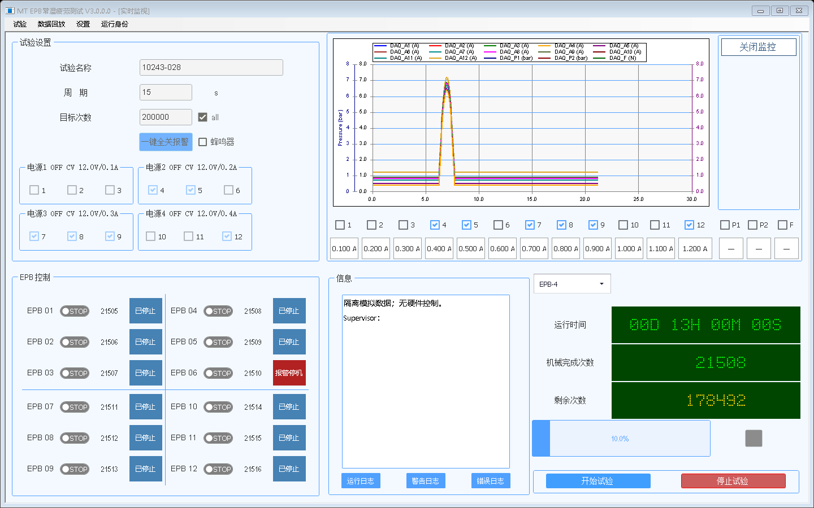

# V3.0.0.0 启动后监控四项问题修复

## 现场证据与结论

用户截图标注了监控关闭按钮缺失、曲线选择不同步、开始按钮禁用和实时曲线空白。本机 `C:\ProgramData\MTTFTest\EngineHost\engine-host.log` 在北京时间 2026-09-05 10:26:59 记录：

```text
EngineHost硬件组合根初始化失败。
System.InvalidOperationException: DaqRuntimeConfigInvalid: DaqFrequency missing or invalid.
```

检查发现后台编译目录中的 `MTTFTest.EngineHost.exe.config` 包含 DaqFrequency=2000、SamplesPerChannel=20，但主程序项目的 `CopyWatchdogSidecar` 只复制了后台 EXE/PDB，没有复制其运行配置。之前生成的 `6ac9099141a6` 完整包和本机 Current 目录均缺少该配置。因此独立后台进程无法读取必要的 appSettings，硬件组合初始化失败，没有实时采集，开始按钮的硬件就绪条件不成立。

这些结论解释本次配置失败；配置补齐后仍需真实硬件确认初始化、安全证明和采集链路正常，不能将模拟测试视为现场通过。

## 修改

| 问题 | 原因 | 修复 |
| --- | --- | --- |
| 监控关闭按钮缺失 | 生成的旧窗体默认 ControlBox=false，V3 没有独立关闭入口 | 在图表右侧恢复“关闭监控”按钮，不编辑 Designer；保留既有停止与安全关闭门禁。避免原生 MDI 按钮在高 DPI 下撑高菜单 |
| 曲线选择不同步 | 首次勾选绑定依赖 CountsValid；初始化失败时一直全选；后续设置变化也不会再绑定 | 有试验配置即可同步，跟踪会话和选中通道变化；普通刷新保留手动显示选择；空数据曲线也更新可见性 |
| 开始按钮禁用 | 后台运行配置遗漏导致 HardwareInitialized=false | 随主程序复制后台 exe.config，不放宽 CanStart 安全条件 |
| 实时曲线空白 | 相同初始化失败使采集没有启动 | 补齐后台配置；没有有效采样时保持无数据显示，不造数据或补零 |

后台初始化异常现在保留在 UI 状态中，避免后续停止命令失败覆盖根因。发布构建、发布包复核和安装器均要求后台配置文件存在；发布检查验证必要采样设置存在。

## 回归验证

- 原界面新增测试：配置已到达但计数无效/硬件未就绪时仍绑定曲线选择；控件关闭入口存在；手动显示选择不被普通刷新覆盖；试验通道变化重新同步；空数据曲线正确隐藏。
- 后台集成新增测试：直接读取主程序发布输出目录内的后台配置，用生产 `DaqRuntimeSettings.Load` 校验采样设置。
- 安装器新增缺少后台配置的拒绝测试。
- 新版 `Verify-Release.ps1` 对旧 `6ac9099141a6` 包执行只读验证，按预期拒绝：`发布包缺少 EngineHost 运行配置`。
- Debug 主程序目录与后台目录的 exe.config SHA-256 一致。
- Debug 编译通过；后台集成 115/115、原界面 97/97、控制与看门狗 750/750、磁盘写入 83/83、电源 24/24；安装器和源码门禁通过。关闭按钮最终布局另行执行原界面渲染测试，检查 1440、1800、2160 宽度下按钮不越界。

## 安装态复核

下图为模拟数据的界面布局验证，不代表硬件采集验证：



部署新完整包后确认 Current 中存在 `MTTFTest.EngineHost.exe.config`；只从安装入口更新，不手工覆盖运行文件。确认日志不再出现 DaqFrequency 缺失，界面可显示有效测量/曲线；若仍禁用开始，按信息区新的初始化或安全证明失败原因处理。关闭按钮恢复可见不代表可以绕过未完成停止事务。

本次不直接修改已安装环境，也不清除旧安全失败、恢复日志或项目数据。
