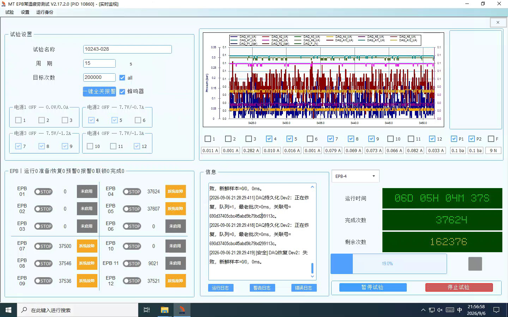
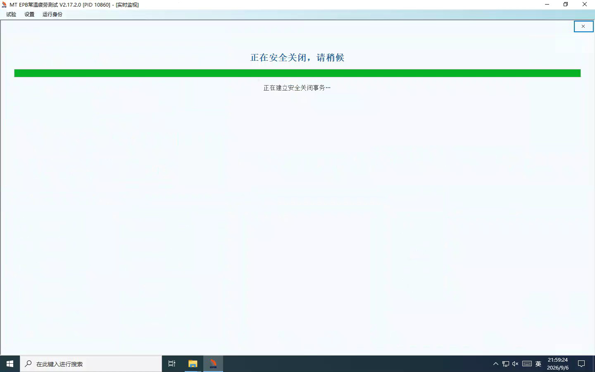
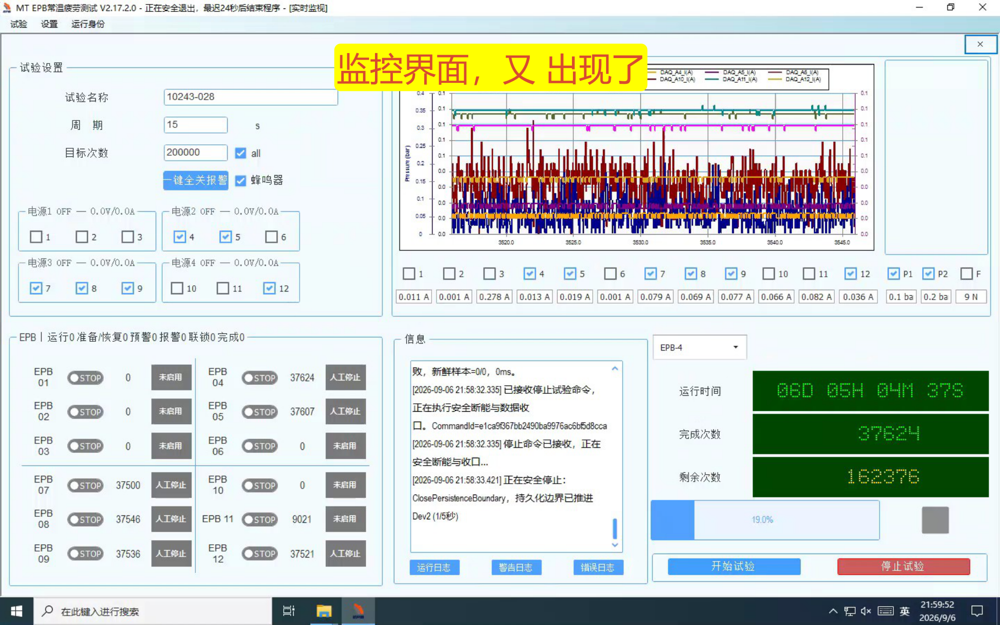
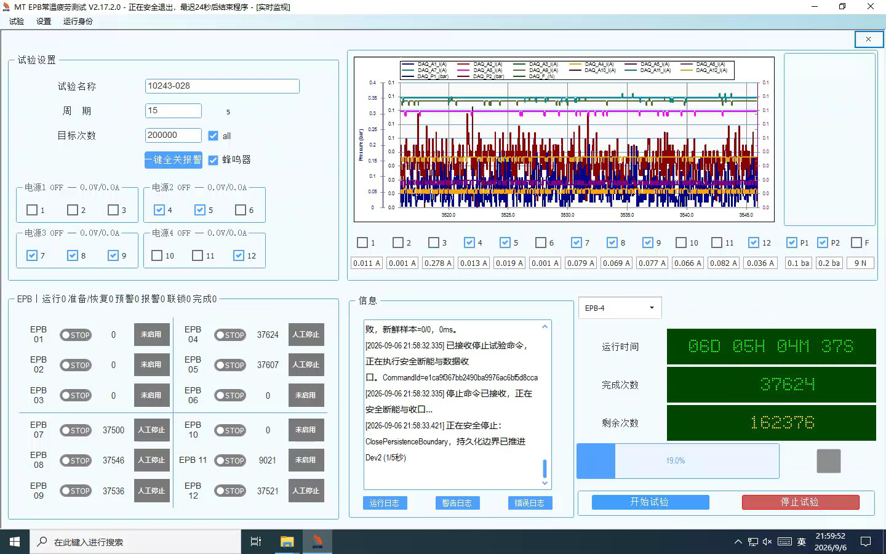
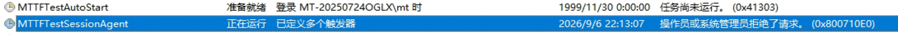
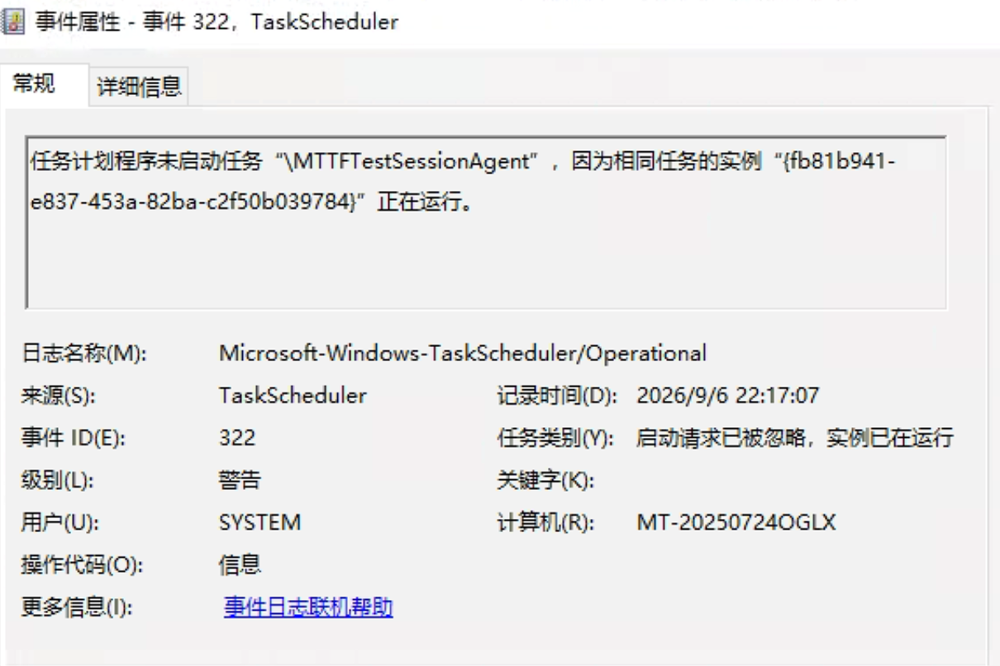

# V2.17.2.0 I0048–I0049：系统故障、退出未恢复及 V2.14.2.11 对照分析

分析日期：2026-09-06。对象：现场项目 `10243-028`。本文为故障分析，不是修复完成或现场验收报告。

## 1. 先回答“为什么”

**本次存在三个关键软件问题：DAQ 临时恢复路径撤销了后续重入仍要使用的执行许可；I0048 的旧交接镜像使 Watchdog 跳过正常监督；I0049 退出后的安全代理启动又被 SHA-256 字符串大小写比较错误挡住。** 它们分别解释了“为什么系统故障”“为什么有时长期不接管”“为什么接管退出后又不起来”。另有停止完成后关闭身份未正确收口的独立缺陷。

完整链路是：

1. 写盘消费短时落后于采集，最老待写批次超过约 1 秒，触发 `DaqPersistenceLag` 安全暂停。**这是持久化积压触发，不是日志证明六个卡钳同时发生硬件故障。**
2. DAQ 截止阶段退出液压/正式批次参与者。V2.17 新增的参与者退场动作同步撤销通道执行许可；原恢复路径却仍沿用“原执行体可直接重入”的假设。
3. 写盘队列很快恢复，但恢复程序先调用电源使能，再在机械释放入口发现 `StaleExecutionPermit`，回滚断电。重新读取许可只能读到“已撤销”，不能自动生成有效许可。
4. 自维护三次未完成后走 `SafeIdleOnly`，将通道标为 `SystemFault`。这条出口没有直接完成整批安全重建；终态仍有 Timer/Runner，随后又出现孤儿暂停与恢复登记失败。
5. I0049 的独立 Watchdog 检测到“系统故障终态仍有运行资源”，触发全批 StopAll 并安排替换进程。因此 Dev2 的四通道故障扩大为全部六个启用通道系统故障。
6. 主程序在 22:18:54 左右正常走完窗口释放并退出；重启许可仍被保留。
7. 安全代理授权中的 SHA-256 是小写，启动请求中的相同摘要是大写，监督服务在这一处使用 `StringComparison.Ordinal`。它将相同摘要误判为不同，连续拒绝安全代理启动。
8. 安全代理未启动，安全前置条件未完成，新的主程序也没有启动。**不是没有尝试恢复，而是恢复已获批、旧进程已退出，却反复卡在安全代理准入。**

前一次 I0048 的“停止后关不掉、界面重新出现、最终倒计时退出”另有明确的关闭身份交接问题，见第 6 节。不能把两次退出都解释为相同的强制杀进程，也不能把所有等待都解释成磁盘未保存。

### 1.1 结论强度

| 问题 | 结论 | 证据强度 |
|---|---|---|
| 为什么触发 DAQ 暂停 | 待写队列年龄超过 1000 ms | 日志直接确认 |
| 为什么队列恢复后仍报系统故障 | 许可撤销与原执行体重入要求冲突，重试最终走 SafeIdle | 日志、现场版本代码、真实许可类隔离复核共同支持 |
| 为什么六个卡钳全部故障 | I0048 两张卡分别故障；I0049 先 Dev2 四通道，后 Watchdog 全批停止覆盖 Dev1 两通道 | 通道状态日志直接确认 |
| 为什么 I0049 退出后不恢复 | 安全代理启动被摘要大小写比较错误拒绝 | 授权文件、事件、请求生成和服务校验代码闭环 |
| 为什么 I0048 长时间故障却未被 Watchdog 接管 | 旧交接镜像非终态、权威已终态，返回值仍让监督循环 continue | 镜像/权威文件差异、持续事件和控制流共同确认 |
| 为什么 I0048 关不干净 | 安全停止已完成，关闭事务身份校验失败；UI 失败分支复原监控；最终 30 秒截止退出 | 新补充 client/sidecar 事件及源码确认；具体冲突字段仍需补日志 |
| 为什么底层写盘会短时变慢 | 已定位到持久化消费阶段，未定位到某一次具体 OS/磁盘/SQLite/CSV 调用 | 尚不能唯一归因 |
| 事件 322 是否表示 SessionAgent 坏了 | 表示已有实例，新的启动请求被忽略 | 截图直接确认；不等于现有实例健康证明 |

## 2. 证据范围、身份及复核方法

### 2.1 输入

| 代号 | 输入 | 用途 |
|---|---|---|
| A | [I0048 封盘](D:/EPB_Data/Backups/10243-028_V2.17.2.0_I0048_0906_2157) | 21:28 双卡故障，PID 10860；主运行日志截止 21:57:09.994 |
| B | [I0049 封盘](D:/EPB_Data/Backups/10243-028_V2.17.2.0_I0049_0906_2221) | PID 17384 的 22:00–22:18 运行日志，以及两次事故会话的 client/sidecar 事件 |
| C | [22:21 导出证据](D:/EPB_Data/Backups/EPB-V217-Evidence-20260906-222129) | 安装构建身份、监督授权、进程清单、本地控制文件及导出完整性 |
| D | [V2.14.2.11 I0034](D:/EPB_Data/Backups/10243-028_V2.14.2.11_I0034_0905_0726) | 旧版跨夜运行记录及进程启动身份对照 |
| S | 用户提供的六张不同截图 | 监控故障、安全关闭遮罩、监控重新出现、主窗倒计时、计划任务和事件 322 |

JSONL 的 `Utc` 和 .NET UTC ticks 在本文统一换算为北京时间 UTC+8。普通 `run.log`、`warning.log` 已是北京时间。不能把 14:18 UTC 当作另一场下午故障。

I0049 清单注明 `backup_kind=incremental`，采集时间 `2026-09-06T14:21:13.2551420Z`。不同文件不是同一瞬间的原子快照：根目录、项目 WatchdogSessions、本地控制目录及 Supervisor 权威文件的版本可能不同，应按会话、事务、revision、事件时间关联，不能只取任意一个 JSON 当作最终事实。

### 2.2 现场代码身份

- V2.17.2.0：`1185a09d62e84b1982c648168b371118d17b9ce4`，x86，现场运行日志与导出的 build-identity 一致。
- 主程序 SHA-256：`8094f890533e0de65eb5fdbb46eef8a4bbab7bcd025eadd2c9a14f926c6201c1`。
- SafetyAgent SHA-256：`485469f428a1d5ef5e55b15ecaae8279dafb89fc9ef9f1c893472217029e5cac`。
- 旧版源码对照标签 `2.14.2.11`：`6ed4d47bc201d95757fdf790ab9282ff9f57cb08`。旧版现场 EXE SHA-256 为 `9158a6cf57cfd6329d3f8dc3dd254f5e35a0d8c8b9fe48cd43b9a3919837a8ba`，日志的 GitCommit 为 `unknown`。因此旧标签是源码参考，不能声称已证明其与旧现场二进制逐字对应。

用户要求暂停时，工作区已有两处未完成的控制器修改，尚未构建、验证或部署。本文使用 `git show 1185a09:<path>` 读取原版源码，并保留[带原行号源码摘录](附件/I0048-I0049/baseline-source.md)，不把工作区中的候选修复当作现场实现。

### 2.3 完整性与实际做过的验证

- 对 C 的 **584 个已复制文件**逐个与导出索引 SHA-256 核对，**0 个不匹配**。
- C 自报 `Complete=false`：唯一遗漏是 `C:\ProgramData\MTTFTest\Supervisor\supervisor-audit.log`，大小 **71,802,618 bytes**，原因 `SizeBudget`。项目目录内 `SupervisorEvidence/supervisor-audit.jsonl` 存在，但不能替代被遗漏的全局日志。
- 提取了 **513 条**故障窗口日志、**423 条**两会话 client/sidecar 事件，保留来源及原行号。
- 用现场提交的真实 `ChannelExecutionFence` 在独立内存环境复核：授权有效 → `RevokeIfCurrent` 成功 → 原许可无效 → 再次 Capture 仍无效。另复核了本次摘要的大小写比较，结果可重复。
- 未运行现场试验、未访问硬件、未修改封盘；未做全量逐圈数据完整性审计。已有 dump 位于 22:00:59 的启动阶段，早于 22:17 的写盘事故，不能拿它证明事故时磁盘线程卡点。

复核附件：[提取脚本](附件/I0048-I0049/Extract-Evidence.ps1)、[输入哈希](附件/I0048-I0049/input-hashes.json)、[导出核验](附件/I0048-I0049/export-validation.json)、[日志摘录](附件/I0048-I0049/log-excerpts.json)、[Watchdog 时间线](附件/I0048-I0049/watchdog-timeline.json)、[关键字段](附件/I0048-I0049/findings.json)、[许可与摘要复核脚本](附件/I0048-I0049/Replay-Predicates.ps1)、[复核结果](附件/I0048-I0049/predicate-replay.json)。隔离复核不是完整硬件回归测试。

## 3. 合并时间线：两次故障不能混成一次

### 3.1 I0048：双卡故障、人工停止及关闭失败

会话 `b9622b65c70b4b2fbbeec07f1ca8500b`，恢复后的主进程 PID **10860**，故障运行 `4b3f046017eb45dcaaa92a60ae981c36`，RunEpoch **3**。

| 北京时间 | 事件 | 解释 |
|---|---|---|
| 20:56:21、20:58:40 | 学习执行体恢复升级；同进程重建失败后转进程重启 | 此前已存在恢复压力，不能以本次 21:28 为整晚首次异常 |
| 20:59:19–26 | Watchdog 启动 PID 10860；SafetyPreflightPassed、RecoveryUiReady | 同版本确实曾成功拉起替换进程 |
| 21:02:12 起 | RecoveryBatchCommitDeferred，Reason=ContextMissing | 控制已启动，但监督侧正式恢复提交延迟 |
| 21:27:58 | RecoveryBatchCommitted，Generation=52 | 延迟提交最终成立，不应写成“一直没有提交” |
| 21:27:58.305 / .350 | Dev1 / Dev2 待写年龄 1003.6 / 1002.4 ms，Depth 均为 100，安全暂停 | 两卡分别越过持久化年龄门槛 |
| 21:27:59.616 / .655 | Dev2 / Dev1 持久化恢复，Depth 1 / 2 | 初始积压已经消退 |
| 21:28:06.794–.795 | 两组 `StaleExecutionPermit`，重入回滚 | 恢复失败发生在软件执行授权阶段 |
| 21:28:29.190–.418 | 六通道分别进入 `DaqRecoverySafeTerminal / SystemFault` | 六个卡钳不是同一时刻发生六个机械故障 |
| 21:28:29.635 起 | 孤儿暂停、恢复登记失败 | 终态与运行资源不一致，后续维护继续受阻 |
| 21:57:09 | A 的运行日志结束，采集仍在输出、持久化已恢复 | “实时曲线在动”不等于试验执行体在运行 |
| 21:58:32.335 | 人工停止；client 报 DurableCloseFenceIdentityChanged | 本条及以后由 B 中同会话事件补齐 |
| 21:58:38 | PhysicalStopConfirmed、StopCompleted，CanClose=True；连接随后断开 | 安全停止已报告完成，不能归因于一直没写完盘 |
| 21:59:17 | 再次关闭身份冲突，再次人工停止记录 | 同一会话无法顺利形成可消费的关闭终态 |
| 21:59:46 | OperatorExit，Relaunch=Forbidden，MainFormClosing | 用户退出与自动恢复明确区分 |
| 22:00:16 | ForcedDeadlineExit | 本次确实触发了本地 30 秒强制截止 |

关键定位：A `warning.log:1772–1785`、`error.log:30–41`；B 的 b962 会话 client `#10–23`、sidecar `#149–150、#242–246`。每条完整时间与行号见附件时间线。

`ContextMissing` 检查要求 RunId、RunEpoch、RecoveryStage 同时存在。其延迟约 26 分钟才结束，是恢复状态投影不一致的另一项证据，但现有材料不足以证明它单独导致了 21:28 的写盘积压。

### 3.2 I0049：单卡局部故障、全批停机、自动替换被阻断

会话 `cb1bfc8241cd4c018975b0c05ad2974f`，PID **17384**，原运行 `a70ae1c5dc0f402a9e253e277e0f7552`，RunEpoch **1**。StopAll 后出现空 RunId、RunEpoch 3，应按原会话及停止/交接事务继续关联，不能把它当成新试验运行。

| 北京时间 | 事件 | 结果 |
|---|---|---|
| 22:00:29.650 | PID 17384 启动，现场身份 V2.17.2.0 | 与前一次 PID 10860 区分 |
| 22:17:51.398 | Dev2 Depth=10，Oldest=108.2 ms | 写盘延迟开始明显增长 |
| 22:17:52.401 | Dev2 Depth=55，Oldest=547.3 ms | 队列继续积压 |
| 22:17:53.386 | Dev2 Depth=101，Oldest=1015.6 ms，触发安全暂停 | 仅 Dev2 对应 7、8、9、12 进入局部恢复 |
| 22:17:54.398–.683 | 命名管道写入超时，随后同会话重连成功 | 不是本次最终未拉起的永久断点 |
| 22:17:55.656 | Dev2 队列恢复，Depth=1、Oldest=13.2 ms | 从暂停至队列恢复约 2.27 秒 |
| 22:18:02.620 | Dev2 重入被 StaleExecutionPermit 拒绝 | 已调用使能路径后再回滚 |
| 22:18:28.406–.413 | Dev2 四通道 SystemFault，Timer=True、Runner=True | 自维护终态仍有执行资源 |
| 22:18:28.575–.612 | 孤儿暂停、恢复登记失败 | 局部恢复未闭环 |
| 22:18:34 | Watchdog 请求 ResponsiveApplicationControlRepair | 原因是 SystemFault 终态仍有 Timer/Runner，持续约 5.1 秒 |
| 22:18:34.867–.871 | Dev1 的 4、5 也因 StopAll 变为 SystemFault | 用户看到全部启用卡钳故障 |
| 22:18:42 | 首次 StopCompleted，CanClose=True；替换许可 Approved | 进入接管退出流程 |
| 22:18:42–53 | 又发生关闭 StopAll，等待新鲜压力、只恢复 DAQ 取压力证据 | 重复收尾延长退出；不是立即关闭 |
| 22:18:53.088 | 两卡最终持久化边界 Closed=True | 当前退出没有永久卡在写盘边界 |
| 22:18:54 | SafetyHandoffAccepted、GracefulCompleted、OldProcessExitProven | 主程序已退出且旧进程死亡已证明 |
| 22:18:55.026 起 | 安全代理启动被 HashMismatch 拒绝 | 新恢复链关键失败点 |
| 22:20:25 | 安全前置等待 90 秒超时，安排重试 | 尚未消耗主程序启动预算 |
| 22:20:46.269 | 第 7 条相同安全代理启动失败事件 | 固定输入重复失败 |
| 22:21 导出时 | 有 SessionAgent 和 Watchdog，无 MTTFTest 主程序、无 SafetyAgent | 与“退出未恢复”一致 |

关键定位：B `run.log:14022、14029、14071、14344–14347、14436–14437`；cb1 会话 sidecar `#24–62`、client 中 `StopAllRequested / GracefulCompleted`。

## 4. 为什么出现“系统故障”：从触发到不可恢复的具体代码链

### 4.1 初始触发是持久化消费落后，不能直接写成“采集卡掉线”

`DaqPersistenceCoordinator.EvaluateLag` 的条件是：

```text
depth >= pauseDepth 或 oldestAge >= pauseAgeMs
→ DaqPersistenceState.Paused / DaqPersistenceLag
```

源码默认容量 256，暂停水位 128，暂停年龄 1000 ms。I0049 Depth=101 未到 128，但年龄 1015.6 ms 已越线，所以 **年龄条件足够触发**。I0048 两卡 Depth=100 也是同样的年龄触发。

I0049 22:17:54.894 的 Dev2 指标尤其有区分力：

| 指标 | 值 | 含义 |
|---|---:|---|
| CallbackAgeMs | 4.099 | 该快照时 DAQ 回调仍新鲜 |
| ControlProcessedAgeMs | 4.009 | 控制消费也在推进 |
| ProcessingDepth / RawDepth | 0 / 0 | 前级队列未堆积 |
| PersistenceDepth / OldestMs | 182 / 1820.538 | 持久化阶段落后 |
| Produced / Processed / Published / RawTransferred | 均 103584 | 数据已到持久化入口 |
| Persisted | 103401 | 持久化进度差约 183 个序号 |
| FirstPermanentGap / Discarded / OverCapacityDropped | 均 0 | 该快照未报告这些类型的永久缺口或丢弃 |

22:17:52.513 时 Dev2 Persisted=103290，2.381 秒后为 103401，约推进 46.6 批/秒；同期 Produced 从 103346 到 103584，约 100 批/秒。**在这个观测窗口，持久化消费速度不足以跟上生产速度，队列增长有量化依据。** 这是两端快照平均值，不能当作单次写调用耗时。

该窗口可用内存约 11 GB、进程 CPU 约 8%–20%、系统 CPU 约 20%–32%，日志所报程序盘剩余约 11.7 GiB。没有 OOM 或磁盘已满的直接证据。机器级 DiskQueue 约 1–2，存在并发读写，但不能仅据此断言“硬盘坏了”“某杀毒软件造成”或“备份正在抢盘”。本次备份采集时间晚于故障，不能反过来把备份本身认作已证实的触发者。

仍未闭环的是更下层原因：SQLite 锁/事务、Raw journal 写入、CSV/快照竞争、文件 flush、调度延迟分别占多少。现有日志没有事故窗口逐调用栈或 ETW，故报告只把根因定位到有证据的层次。扩大年龄门槛可能降低触发率，但不能修复后述许可与重启缺陷。

### 4.2 DAQ 临时暂停被当作正式参与者永久退场

现场提交代码调用关系：

```text
DAQ 截止提交
  → TryUnmarkHydraulicParticipant(..., "DaqCutoff:Dev2:RecoveryEpoch=...")
    → RequestFormalParticipantRetirement(lease, reason)
      → _channelExecutionFence.RevokeIfCurrent(lease.ExecutionPermit)
        → Authorized=false，Generation++，取消 RevocationToken
```

随后恢复路径是：

```text
持久化恢复 / 新鲜样本验证
  → PrepareAndEnableAsync（电源）
  → EnsureMotorReleasedBeforeFormalRejoinAsync
    → Capture 当前许可
    → IsChannelExecutionPermitCurrent == false
    → FormalRejoinRejected StaleExecutionPermit
```

重入前没有在同一恢复事务里完成“旧参与者清理 → 安全准入 → 新许可/新执行体登记”。许可检查原本正确地阻止旧任务运行，但调用方没有提供合法的继续路径。

证据位置：`EpbManager.cs:2006–2040、2075–2089、6830 起、7459–7477`，`EpbManager.PauseResume.cs:2322–2354`，`ChannelExecutionFence.cs:86–109`，均见基线源码附件。隔离运行真实许可类证实：撤销后，重新 Capture 仍无效。

`StaleExecutionPermit` 在原代码同时包含许可状态、RunEpoch、Enabled、RequiresProcessRestart 等条件，所以单看异常文本不能区分所有失败分支。本次“DAQ 退场撤销许可且恢复未重新授权”是已找到、可重复解释该现场链路的确定性缺陷；没有在日志中逐个打印实际许可代际，因此不伪造每个通道的 Generation 数字。

### 4.3 三次重试不会修复被撤销的许可

`ScheduleDaqSelfMaintenance` 在 failureCount 达到 3 时调用 `CompleteCancelledRecovery`，原因写明 `SafeIdleOnly`。它停止局部恢复，将通道发布为系统故障，但并不在这一出口直接启动一次完整的新批次。

I0049 22:18:28 的终态日志仍显示 `Formal=True Timer=True Runner=True Energized=False`。随后孤儿暂停处理尝试登记恢复，状态存储又保护已经锁定的 `SystemFault`：未显式获准复位时，拒绝覆盖成 Recovering。协调器发现完整恢复 owner 状态没有提交，抛出 `Recovering publication did not commit the complete owner contract`。

**这是终态资源清理、终态复位权限与局部重试入口之间的契约不一致。** 当前协调器其实已经有 `StartSignal`，工作体要等显式 Start；不能未经证明就把这次问题归结为“工作线程先于登记启动”。后续修复应优先处理正确的恢复出口，而不是单纯放开终态校验。

### 4.4 为什么变成“全部卡钳”

I0049 中，Dev1 仍在完成正式圈，22:18:05 还有 EPB4 的软预警记录。到 22:18:34 Watchdog 检出 Dev2 终态残留资源，才发出全批 StopAll；4、5 的系统故障原因为 `StopAll`，7、8、9、12 此前原因为 `DaqRecoverySafeTerminal`。

UI 都显示“系统故障”，把“局部基础设施恢复失败”和“被整批安全停止影响”压缩成同一标签。这解释了用户感受上的同时故障。六路软预警、机械故障或永久报警不能与这条全局停机原因混淆。

### 4.5 为什么 I0048 系统故障后长时间没有像 I0049 一样被接管

两次 Watchdog 并非处于同样的前置状态。I0048 的 b962 会话已经经历旧主进程 PID 17204 退出、恢复子进程 PID 10860 启动，并留下同会话的旧安全交接。

封盘中的两份状态：

| 文件位置 | 旧安全交接状态 |
|---|---|
| A `WatchdogSessions/session-b962….safety-handoff.json` | Revision=2，State=Accepted，IsTerminal=false，OldProcessId=17204，Detail=SafetyAgentLaunchIntent |
| A 根目录交接及 C `00013-safety-authority-4a3d….v6.json` 的权威 Receipt | Revision=8，State=Completed，IsTerminal=true |

真实控制流：

```text
WatchdogHost.MonitorAsync，每 250 ms：
  if (ObserveSafetyHandoffProgress()) continue;
  ……后面才处理 ApplicationExit、运行资源/控制健康等监督

ObserveSafetyHandoffProgress：
  读到旧镜像非终态
  BeginSafetyHandoff → 读 Supervisor 权威，发现已经 Completed
    记录 SupervisorSafetyAuthorityTerminalObserved
    返回 true
  返回 started || !旧镜像.IsTerminal → true
```

结果：**“权威已完成”被当成“本轮仍在处理交接”，旧镜像也未在返回判断中被权威终态替换，主监督循环每次提前 continue。** 这不是看门狗进程没运行，而是活着的看门狗一直绕开本应执行的后续监督。

21:28:23、21:28:53 直至 21:56:59，sidecar 持续记录 `SupervisorSafetyAuthorityTerminalObservedSummary State=Completed;Revision=8;Project mirror ignored in favor of Supervisor authority`。这与上述代码路径吻合，也解释了为什么还有心跳/摘要日志，却没有及时发出 I0049 那样的 `ResponsiveApplicationControlRepairRequested`。心跳接收和主监督循环不是同一条进度证明。

源码定位 `WatchdogHost.cs:2390–2407、6757–6779、7093–7144`。修复时应让权威终态终止旧交接占用，并恢复对当前主进程的监督；同时按旧 PID、当前 PID、许可代际区分历史交接与当前事故，不能粗暴删除历史证据。

## 5. 为什么 I0049 不能自动恢复：摘要大小写构成必现拒绝

### 5.1 恢复并未关闭，也未耗尽主程序重启次数

封盘检查点为 `Armed=true`、`RestartPending=true`，保留六个选中通道和剩余圈数。应用退出记录为接管替换退出，`RelaunchDisposition=PreserveApprovedPermit`。

`relaunch.json` 显示许可 Approved、`CircuitOpen=false`、`MaximumProcessRelaunches=8`、`LaunchConsumed=false`、`ProcessId=0`。sidecar `#58` 明确写 `MainLaunchBudgetConsumed=False`。因此不是操作员禁用了本次恢复，也不是八次主程序重启已耗尽。

`UnhandledSoftwareStartup / UnknownRun / UnknownStage` 是退出时丢失细分上下文后的通用失败分类；不能用它替代之前有明确证据的 `DaqPersistenceLag → StaleExecutionPermit` 事故原因。

### 5.2 两条哈希生成路径不一致

| 位置 | 实际实现/取值 |
|---|---|
| 主程序创建安全交接 | `WatchdogRuntime.cs:2730–2733` 使用 `DurableJsonFileStore.ComputeSha256` |
| DurableJsonFileStore | `:755–759` 最终 `ToLowerInvariant()` |
| sidecar 发 SafetyAgent 启动请求 | `SupervisorSafetyAgentLaunchClient.cs:79` 使用 `SupervisorProtocol.ComputeSha256` |
| SupervisorProtocol | `:65–75` 最终 `ToUpperInvariant()` |
| 服务校验 | `SupervisorServiceHost.cs:1234–1239` 对摘要使用 `StringComparison.Ordinal` |

现场授权里的值：

```text
485469f428a1d5ef5e55b15ecaae8279dafb89fc9ef9f1c893472217029e5cac
```

同一摘要按启动请求路径生成的表示：

```text
485469F428A1D5EF5E55B15ECAAE8279DAFB89FC9EF9F1C893472217029E5CAC
```

字节摘要相同，Ordinal 字符串比较为 false。导出的构建身份 SafetyAgent 哈希也与授权值相同。报错分支同时检查可执行路径，但在路径相同情况下，**小写对大写这一项单独就足以导致本次拒绝**。

此次没有导出现场 SafetyAgent EXE 本体重新计算磁盘哈希，不能作超出证据的“整台机器所有文件都未变化”承诺；不过请求的摘要计算是实际读 EXE，且服务此前另有摘要等价检查。现有证据和代码足以确定大小写缺陷，无需假设二进制真的损坏。

### 5.3 为什么同版本此前又能恢复成功

同一导出中，旧会话 b962 的 Supervisor 权威记录保存的是**大写** SafetyAgent 摘要，安全状态已 Completed；新会话 cb1 的权威记录保存的是**小写**摘要，停在 Accepted / SafetyAgentLaunchIntent。

Watchdog 自己创建部分交接时使用大写的 `SupervisorProtocol.ComputeSha256`，主程序创建时使用小写的 `DurableJsonFileStore`。不同入口产生不同文本表示，使问题表现为“有时能恢复，有时退出后再也不起来”，但它不是随机数错误。

### 5.4 阻断到哪一步

22:18:55–22:20:46，记录了 **7 次** `SafetyHandoffWorkerFailed`，原因完全相同。WorkerProcessId=0，State=Accepted，Detail=SafetyAgentLaunchIntent，IsSafetyCompleted=false。90 秒安全前置等待超时后，再次安排重试；相同输入不会靠重试自行修正大小写。

应用可退出凭证与“安全交接已执行完毕”是不同层次：`CanExitApplication=true` 允许旧 UI 在接管被接受后退出，而恢复主程序仍要求安全前置完成。本次恰好暴露了“交接已接受，但 worker 还不能启动”时，桌面已无主程序的可用性缺口。

## 6. 为什么 I0048 监控关不掉、最终 30 秒退出

### 6.1 新证据修正此前“可能一直等持久化”的推断

A 的日志没覆盖 21:58 关闭，所以初步只能从截图看到 `ClosePersistenceBoundary`。B 中 b962 的 client/sidecar 事件补齐了：**21:58:38 已 StopCompleted 且 CanClose=True**。

同时存在：

- 21:58:32 与 21:59:17：`DurableCloseFenceIdentityChanged`。
- 记录中 Session、Generation、Lease 表面一致，ContextStable=true；校验函数还比较 StopSafetyTransactionId、StopRunId、StopRunEpoch、边界 Generation，不能把它简单说成 Session 字符串不同。
- 停止完成后复用 Closing tombstone，Mark=ExactSessionDetached；随后管道 EOF，再重连报 `AttachExistingAuthorityOnly权威进程已退出或PID已复用`。

该日志中的“权威进程已退出或 PID 已复用”是程序的身份拒绝原因，不是独立 OS 证据。22:21 进程清单中旧 sidecar 仍存在，更不能将它直接写成“旧 Watchdog 确实死了”。它提示恢复子进程与旧权威、关闭事务的身份沿用存在冲突。

现有错误日志未把所有期望/实际停止事务字段逐项打印出来，故不能唯一指定冲突是哪个字段、哪次写入覆盖。已确定的问题层次是：安全 StopAll 结果没有被关闭/退出链正确消费，反而重复建立不兼容的关闭事务。

### 6.2 界面为什么重新出现、进度为何看似走完

`BeginMonitorCloseSequence` 在准备关闭返回 false 或抛异常时调用 `HideCloseOverlay()`，清除关闭状态并重新设置 Running/Idle。`AuthorizeApplicationExitAfterPreparationAsync` 未拿到关闭授权也有同样的回退。

遮罩进度直接用 StopSafetyStage.Completed 显示 100%，但之后仍要做窗体资源、Watchdog 授权与交接；所以“停机阶段完成”被显示为“整个窗口关闭完成”。延迟 250 ms 的 `ScheduleCloseOverlay` 又可能把当前阶段文字覆盖为“正在建立安全关闭事务”。截图里的满条与初始化文字并列，与这些代码缺陷一致。

### 6.3 30 秒倒计时为何出现

主窗 `HandleWatchdogMainFormClosing` 先 `ArmApplicationExitDeadlineOnce`，之后才检查 `HasApplicationCloseReceipt`。前次未能形成有效应用关闭凭证，于 21:59:46 进入 OperatorExit，30 秒后 ForcedDeadlineExit。

该退出记录 `ProcessTerminationRequested=true`、`Relaunch=Forbidden`。这次是人工退出，因此之后不自动拉起应保留；不能为了修复 I0049 的自动恢复而让用户点关闭后又被自动打开。

I0049 则记录 `GracefulCompleted / MainProcessExitedBeforeDeadline`，没有证据说明该次是 30 秒强杀。两者必须分别修复、分别验收。

## 7. 计划任务截图能说明什么

事件 322 原文说明：任务 `\MTTFTestSessionAgent` 的一个实例正在运行，因此未启动新的实例。安装脚本配置“登录触发 + 每分钟保活触发”，且 `MultipleInstances IgnoreNew`。截图与该策略一致。

C 的进程清单还有独立印证：SessionAgent PID 13600、监督 Watchdog PID 8316，以及两个 session-host PID 11348、13300；没有主程序和 SafetyAgent。

因此：

- 不能把 `0x800710E0` 和事件 322 直接解释为账户没权限或 SessionAgent 根本没启动。
- 不能通过允许任务并发运行来修复摘要校验；那只可能增加重复实例。
- “正在运行”仅说明实例存在，不保证其 IPC、会话状态、交接消费正常。
- AutoStart 的“尚未运行”不等于故障替换链失效；本次替换已经由 sidecar 申请，明确失败在 Supervisor 的安全代理准入。

## 8. 为什么 V2.14.2.11 能运行更久：有具体回归差异，而非只看版本号

### 8.1 旧版确有较长运行区间，但也发生过重启

D 的启动身份记录：

| 时间 | PID | 可说明的事实 |
|---|---:|---|
| 09-04 19:18:42.736 | 20948 | 旧版启动 |
| 09-05 00:14:47.471 | 12120 | 后续更换进程，距上次启动约 4 小时 56 分钟 |
| 09-05 02:21:45.087 | 11872 | 再次更换进程 |
| 09-05 07:26:16.342 | 最后启动后区间 | 运行指标仍在推进，距 02:21 启动约 5 小时 4 分钟 |

旧版 00:14:03.573 也出现过 Dev2 持久化暂停，Depth=128、Oldest=24.6 ms；16 ms 后队列就报告恢复，随后出现 DAQ 自恢复并在该时段更换进程。**因此“试验持续了很久”不必然等于“同一个进程从未异常或从未重启”。** 这不否定用户观察到旧版更耐运行，而是给稳定性比较建立正确口径。

本报告没有把所有 I0023–I0035 逐次退出重新归因，也不把几段现场运行当作同条件 MTBF 试验。旧版较长区间是实证，新版此次具体回归也有源码证据，两者应同时保留。

### 8.2 最关键的新增回归：退场与重入没有同步改造

旧标签的 `RequestFormalParticipantRetirement` 有参与者退场，但**没有**下面这两行：

```csharp
lock (_channelExecutionGates[lease.Channel - 1])
    _channelExecutionFence.RevokeIfCurrent(lease.ExecutionPermit);
```

这两行及 `RevokeIfCurrent` 由提交 **`fffbbe6d3b76cc6b32df4f87eda3edbaed48a2b5`（09-06 02:52，V2.17 稳定性修复）**引入。旧版原本也有 `StaleExecutionPermit` 检查、DAQ 临时撤销液压参与者，以及自维护三次 SafeIdle 的出口。

也就是说，并不是“旧版完全没有门禁、新版有门禁”这么粗略：**变化的是旧版恢复假设所依赖的许可，在新版新增退场动作里被撤销，而合法重入流程未同步建立。** 以前少见的旧失败出口，现在可以被普通写盘暂停稳定触发。这是旧版更容易继续运行的一个具体软件解释。

同时，旧实现的退场安全凭证可能仍受其他条件约束；不能由“没有撤销这两行”推论旧版所有恢复都必成功。正确修复应设计新许可的安全交接，而不是无条件恢复旧许可或删除所有迟到任务保护。

### 8.3 不能继续沿用“新版门槛更严”的旧结论

对 **2.14.2.11 → 2.17.2.0** 的精确 App.config 对比：存活门槛值都是 250 / 1500 / 5000 ms；写盘暂停水位 128、恢复水位 32、暂停年龄 1000 ms、恢复年龄 100 ms 等相同。此文件只剩一条存活策略注释不同，不能把注释当运行参数。

仓库早先的 V2.17.0.0 参数对照文档记录过中间版本收紧门槛；**V2.17.2.0 的 `1185a09` 已恢复旧版存活判定值**，不能把中间版本结论不加核对地套到 I0048/I0049。

现场检查点另有 `EffectiveRuntimeSafetyParameters` 摘要，Warn/Suspect 为 75/100，说明不同层次参数投影仍须核对，不能据源码模板推定所有运行门槛。无论这些存活参数怎样解释，本次直接触发码和数值均指向 **持久化 1000 ms 年龄**，不是 75/100 ms 的采样存活判断。

### 8.4 新版恢复链的额外可用性负担

V2.17 增加/扩展了 Raw 证据耐久、监督服务权威、独立安全代理、交接、替换许可及关闭凭证。目的在于避免数据丢失和错误重启，但必须满足跨模块一致性。本次大小写比较、重复关闭事务、RunId/恢复阶段丢失，正是新增/扩展链路中已暴露的失配。

源码对照还显示新版不再把 Raw journal 场景的抑制尾段简单作为未写入的排除数据处理。这会改变故障期间的数据保存工作量，但目前没有同负载性能试验证明它就是初始写盘变慢的唯一原因。应测量，不宜直接回退数据耐久保护。

对照附件：[关键源码差异](附件/I0048-I0049/old-version-diff.txt)、[旧版现场启动记录](附件/I0048-I0049/old-version-starts.json)。

## 9. 数据和物理安全结果：哪些已确认、哪些不能承诺

I0049 22:18:53.088 的 STOP_PERSISTENCE：

| 设备 | 冻结前缀 Boundary | 最终接纳 FinalBoundary | Persisted | RawDrained / PersistenceDrained / Closed |
|---|---:|---:|---:|---|
| Dev1 | 108209 | 108209 | 108209 | True / True / True |
| Dev2 | 103438 | 107687 | 107687 | True / True / True |

Dev2 Boundary 与 FinalBoundary 不同，配合 SuppressAfter=103438、SuppressThrough=long.MaxValue；该次固定前缀及后续接纳尾段均被停止流程验证，BoundaryStable=true。两卡 DurabilityBlocked=false、Discarded=0、OverCapacityDropped=0。

这证明**该退出事务报告的批次边界闭合**，不是全历史逐圈无损证明。现场还有“拒绝作废非当前圈，ActualCycle=0”、根运行身份变空、逻辑快照 Leases=1 等记录，应作为后续数据/生命周期复核项，不能用一个 CanClose=true 掩盖所有不一致。

22:18:54 有 AO 归零、DO 全关记录，安全交接声明 MotorsOff、PowerOff、PressureSafe 等为 true。本文没有实际量测电流/压力，不把软件凭证等同于新增现场硬件验收。

## 10. 修复方向与优先级：应修复哪些根因

本节是基于证据的后续实施要求，本轮按用户要求暂停代码实现。

| 优先级 | 修复点 | 验收关键 |
|---|---|---|
| P0 | SHA-256 统一按摘要语义比较；保持合法长度/十六进制及路径校验 | 小写/大写/混合大小写等价；真正改变一个摘要字节仍拒绝；真实 Supervisor→SafetyAgent→主程序替换链闭环 |
| P0 | 修复旧交接镜像与权威终态不一致时的监督循环返回值 | 恢复子进程正常运行后，旧 Accepted 镜像不能使 MonitorAsync 永久 continue；新故障仍能触发监督 |
| P0 | 区分临时 DAQ 退场与永久终止；恢复获得新一代合法执行体/许可 | 供电前验证；旧许可与迟到回调始终不能上电；双卡请求合并为一次合法重建 |
| P0 | 终态必须清理 Timer/Runner，或者明确由恢复 owner 接管 | 不出现 SystemFault + 活动执行资源；禁止靠反复覆盖 UI 状态消除故障 |
| P1 | 停止、监控关闭、主窗退出共享已完成收尾凭证和事务身份 | 停止完成后关闭不重复 StopAll、不重复等待压力；正常关闭不走 30 秒兜底 |
| P1 | 修复关闭遮罩与进度，禁止失败后恢复可启动界面 | 进度只在窗口实际可关闭时到 100%；失败保持明确阶段并自动继续收尾 |
| P1 | 对不可重试的安全代理准入错误发布明确诊断 | 已退出情况下用户能看到“安全代理摘要校验失败”，而非只剩空桌面与持续重试 |
| P1 | 补齐恢复上下文与关闭身份差异日志 | RunId/RunEpoch/StopTransaction/Permit/Authority 一条链可追溯，避免 UnknownRun 及 ContextMissing 长期延迟 |
| P2 | 写盘延迟剖析与证据导出预算 | 区分 Raw/SQLite/CSV/Flush/锁等待；全局 Supervisor 审计超预算时保留时间窗或尾部，不整文件遗漏 |

不采用的“表面修复”：取消全部安全校验、任意重发旧许可、仅把 SystemFault 标签改成正常、允许多个 SessionAgent 并发、简单增大所有超时、停机时丢弃尚未落盘的数据、把人工退出也当自动重启请求。

## 11. 后续验证设计与尚缺证据

1. **确定性恢复回归**：正常正式运行注入约 1–3 秒持久化积压，验证短暂暂停后可续测或一次性安全重建；包含 Dev2 单卡、双卡、暂停期间人工停止、旧回调晚到。记录许可前后代际和每次上电条件。
2. **安装态自动恢复**：分别由主程序及 sidecar 创建交接，覆盖大小写摘要、真实摘要损坏、SafetyAgent 拒绝启动、旧进程已退出、90 秒前置等待超时；另外构造项目镜像 Accepted、Supervisor 权威 Completed，再在恢复子进程制造新故障，验证监督仍执行。要求恢复进度可观测，不能只有 Approved 而没有 worker。
3. **关闭复现**：先经历进程恢复再点停止/关闭，覆盖旧 Session 复用与新 StopTransaction、管道已 detach、重复点击、主窗退出；核对停止结果只执行一次、窗口不重新出现。
4. **旧版对照压测**：同一机器、相同项目/采样参数、相同事件证据开关和数据路径，分别记录旧参考与候选修复版的试验连续时长、同 PID 时长、成功恢复率、数据缺口、写盘 P95/P99、队列年龄。运行时间与故障恢复时间分别统计。
5. **缺失证据**：补取故障时间窗的全局 supervisor-audit.log、计划任务完整 XML/历史、现场 SafetyAgent 与主 EXE 的实际哈希，以及 22:17 窗口的存储调用耗时/线程栈。现有 22:00 启动 dump 不匹配事故时间。缺失项不妨碍确认已发现的摘要大小写与许可生命周期缺陷，但限制更底层 I/O 和精确关闭身份冲突字段的归因。

## 12. 用户截图

### 图 1：I0048 六个启用通道显示系统故障



### 图 2：安全关闭遮罩，满进度仍显示建立事务



### 图 3：监控界面再次出现及退出倒计时



### 图 4：停止后监控仍显示



### 图 5：计划任务状态与上次结果



### 图 6：事件 322，已有实例导致启动请求被忽略



用户后续再次提供的事件 322 截图为同一事件内容，本文保留一份图示，未将重复截图计为两次独立故障。
