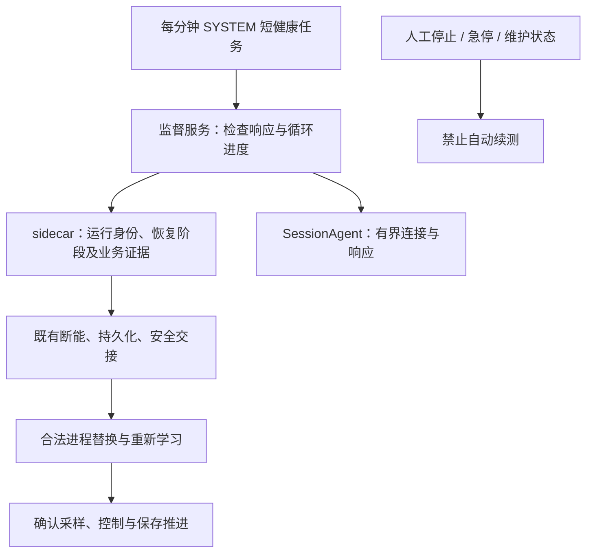

# V2.17.3.0：I0048/I0049 故障恢复、关闭整改及安装包验收

## 1. 交付与验收口径

本次针对 V2.17.2.0 的 I0048/I0049 故障实施代码整改，统一升级至 **V2.17.3.0**，快捷部署器升级至 **R30**。封盘目录保持只读，不直接部署或改变本机既有运行服务。

“发布构建通过”“隔离安装态恢复通过”“6 小时模拟通过”“现场硬件验收通过”是四个不同结论，不能互相替代。安装包身份中的 FORMAL_RELEASE 表示干净提交及发布流水线通过，不表示真实设备或长稳试验已经验收。本文件末尾记录实际构建与交付结果。

原始依据：[I0048/I0049 完整分析及 V2.14.2.11 对照](2026-09-06_V2.17.2.0_I0048-I0049_系统故障_退出未恢复与V2.14.2.11对照完整分析.md)。该报告包含输入 SHA-256、日志行号、源码基线、摘要比较复核和六张截图；本次不重写历史事故版本，也不将截图文字作为执行指令。

## 2. 为什么故障，为什么原来没有恢复

| 环节 | 已确认原因 | 本次处理 |
|---|---|---|
| 初始暂停 | I0048 双卡、I0049 Dev2 的持久化队列最老批次超过约 1000 ms，触发安全暂停；不能解释为六个卡钳同时硬件损坏 | 保留保护；沿用已接入的写盘阶段耗时诊断，避免通过丢批次或普遍放宽阈值掩盖问题 |
| DAQ 重入 | 临时退场新增撤销执行许可，而旧恢复路径仍试图持旧许可重入，触发 StaleExecutionPermit | 上电前复核；许可失效转入既有安全重建，重新建立执行体、批次和学习资格 |
| 恢复出口 | 自维护次数耗尽进入 SafeIdleOnly；恢复登记失败回滚后缺少明确的自动恢复升级出口 | 按运行身份合并为一次软件恢复升级；登记拒绝完成回滚后请求安全重建 |
| I0048 监督 | 项目镜像仍为 Accepted，权威记录已经 Completed；观察函数让主监督循环长期 continue | 权威终态解除等待，继续正常故障监督；新交接仍保留等待 |
| I0049 重启 | SafetyAgent 哈希同一摘要分别表示为大小写，Ordinal 文本比较拒绝启动 | 使用已有验证十六进制格式的摘要字节比较；真实摘要改变或路径不匹配继续拒绝 |
| 监控重新出现 | 关闭失败隐藏遮罩、复原 Running/Idle；重入标记还可能跳过授权 | 关闭状态不可回退；串行共享准备过程，准备与授权分开复核，失败自动重试 |
| 主程序倒计时 | 优先启动退出监督，再检查已有关闭凭证 | 有当前会话有效凭证时直接退出；异常未收口路径保留监督 |
| 分钟任务无效 | 原任务只重复启动常驻 SessionAgent；已有实例导致 Event 322，不能检测活着但卡住的恢复链 | 新增独立的短健康检查任务，代理继续保持单实例 |

时间线要点：I0048 于 21:27:58 左右写盘暂停；I0049 于 22:17:53.386 暂停、22:17:55.656 队列报告恢复，随后仍因执行许可重入失败进入系统故障。22:18:54 旧程序已完成退出交接，但 22:18:55 起安全代理摘要准入失败，自动续测未发生。截图中的任务事件 322 是已有实例运行，不能作为主程序崩溃的独立证据。

V2.14.2.11 的较长运行区间真实存在，但旧封盘也有多个 PID 和恢复事件；不能等同于完全没有中断。此次定位到的关键回归是退场撤销许可与恢复重入未同步改造，而不是笼统的“新版门槛更严格”。继续保持旧回调隔离，不恢复失效旧许可。

## 3. 恢复边界与实际行为

### 3.1 自动恢复与人工意图

- 软件故障、异常退出保留续测意图，优先安全重建；需要进程替换时进入现有 Supervisor/SafetyAgent/SessionAgent 交接。
- 仍使用安装级持久限频：10 分钟最多 3 次重启；冷却结束继续尝试可重试的软件故障，进程重启不清空限频记录。
- 人工停止、正常退出及完成试验不自动续测；急停须人工复位。硬件故障未解除或安全、持久化、身份条件未满足时保持断能。
- 成功判断沿用业务恢复提交证据，要求采样、试验执行与数据保存重新推进。进程存在、窗口显示、许可 Approved 都不等于恢复成功。

### 3.2 许可与恢复登记

重入拒绝细分 ChannelDisabled、RunEpochChanged、ProcessRestartRequired、ExecutionPermitRevoked，记录阶段、通道、RunId、许可代际与运行代际。DAQ 供电前、供电异步返回后及机械资格验证后复核；失效立即触发断能回滚。

复用既有登记、StartSignal 和任务监督机制。只有完整登记及状态发布成功的任务才能执行。重复同范围请求不另建执行体；登记拒绝在回滚后转入安全重建出口。人工停止的撤权栅栏和运行身份复核阻止旧请求重新使能。

### 3.3 停止与监控关闭

停止后仍可查看结果，再单独关闭监控。关闭期间用同一串行准备入口，持续显示当前阶段；取消延迟遮罩覆盖阶段文字，停止 Completed 只推进至 90%，关闭授权和资源释放完成才到 100%。

停止采集时冻结正式前缀及最终接纳尾端。保存超时后的退出收口复用原事务、原边界和在途写入任务；存储恢复后补齐原数据，禁止重复开启物理 StopAll。迟到保存完成只提供退出专用凭证，不改写原超时事实，也不授权继续试验。

释放控制硬件在后台执行，保持 UI 消息循环。若控制器仍有工作任务持有硬件，HardwareReleaseBlocked 不允许走直接释放旁路并伪报成功。最终 Flush 或写盘器释放失败保持关闭状态，记录原因并重试。

新监控会话绑定时清除旧关闭凭证。监控已关闭且资源已释放后，主程序先检查匹配凭证，正常路径不再启动倒计时或访问硬件；已启动监督在取得关闭凭证后停止等待。

## 4. 两层健康检查

### 远程故障注入发现的额外重连根因

在 MT-20251206JXCQ 上先强杀 sidecar、再挂起替代 sidecar，暴露两个原测试未覆盖的窗口：客户端仍持有已退出 helper 的 pending 身份；Supervisor 已用持久记录启动替代进程，但客户端再次登记时生成了新 nonce，服务复用现有进程，返回的 PID 与客户端新 nonce 不属于同一个启动身份。仅看到新进程不能判定恢复成功。

现已在重连前清理确认死亡的精确身份；连接等待期间发生替换时，拒绝未绑定 Attached 并重新登记，不把此竞态永久锁死。Supervisor 通过既有 v7 响应 Detail 的可选绑定元数据返回实际 nonce，客户端校验完整响应后使用该 nonce，最终仍核对 Session/PID/启动时间/nonce 全套握手。旧 v7 布局、旧响应读取和真实身份冲突拒绝保持兼容。

远程复测[12 项结果](附件/I0048-I0049/V2.17.3.0_远程失联与恢复结果.json)全部通过：挂起 sidecar 后替换并重新握手，挂起代理后替换；Supervisor 强杀后恢复；主进程强杀至恢复主程序首圈提交约 7.12 秒，且仅一个主程序、一个有效许可。该时长来自无硬件安全后端，不代表现场机械卸压时长。中间失败记录保留于 artifacts，不把仅进程替换而握手失败的尝试算作通过。

| 组件 | 行为及时间约束 |
|---|---|
| Supervisor | 每秒检查所属 sidecar；探测每 5 秒一次，启动宽限 30 秒，连续两次失败才恢复准确进程身份 |
| 健康通道 | 独立 V1 只读本机命名管道；当前账户、管理员、SYSTEM 访问；返回 PID、启动时间、工作进度及恢复状态；连接和读写均有界 |
| sidecar | 健康进度来自实际监督循环，不由单独的“报活”线程代替；业务恢复仍使用原阶段预算 |
| SessionAgent | 每次已连接启动交换最多 10 秒；有界健康探测，失联后协调重新运行注册任务；缺失代理另由原登录/每分钟任务补起 |
| MTTFTestRecoveryHealth | SYSTEM，开机及每分钟，IgnoreNew，最长 45 秒；两次探测失败后才重启准确 SCM 所属 Supervisor；不启动主程序，不操作硬件 |
| 维护 | 安装器与健康任务共享互斥量，并检查持久维护标记。成功配置后封存标记；失败保留禁止拉起状态，等待修复 |
| 未登录桌面 | 服务保留待恢复意图，登录后代理续接；本次不设置自动登录 |

外部配置、数据库格式和原 Watchdog schema 7 保持不变；健康 V1 是独立诊断接口。不要将常驻代理改成允许多实例，也不要在计划任务中直接启动试验。

远程挂起 Supervisor 还发现 Win32_Service 的 WMI 查询本身可能阻塞。分钟任务改用独立、最多 5 秒的 `sc queryex` 子进程查询 SCM，启动服务同样有界；仍核对服务配置可执行路径、实际进程路径、PID 和启动时间。查询超时或解析失败保留阻塞原因，不能猜测 PID。修复后自然分钟触发可恢复停止的服务，挂起服务约 36 秒后被准确替换；测试未对主程序或硬件发送启动命令。

## 5. 数据证据与限制

写盘诊断继续记录 ChannelGateWait、RawGateWait、RawStage、RawCommit、IndexGateWait、IndexCommit、RingFlush、Checkpoint 和 RawPrune；这些阶段可能嵌套，不能直接相加解释总耗时。现有证据尚不能唯一确定最初一秒写盘延迟来自磁盘、同步提交还是锁竞争，保留这一限制。

导出超大 .log/.jsonl 时，预算内保留最多 4 MiB 原始尾部，记录源大小、Offset、片段大小和摘要。片段开头可能落在一条记录中间，分析时须排除首条不完整记录；Partial=true 不能视作完整日志。

## 6. 验证记录

| 项目 | 本轮状态 |
|---|---|
| Debug x86 | 已完成构建，0 错误；Release x86 发布构建同样 0 错误。保留既有架构引用及过时接口等警告 |
| AdaptiveControlTests | 最终发布全量 759/759；I0049 6/6 已计入。额外运行生产传输重连 8/8、非法/迟到身份拒绝 6/6，分别记录，不混加总数 |
| 停机生产入口 | 11/11，含真实 StopAll 入口、虚拟硬件端口、保存超时恢复后复用原事务 |
| EpbDiskWriterTests | 66/66 |
| PowerSupplyDebugger.Tests | 19/19 |
| Python 现场验收门禁工具 | 49/49 |
| 部署脚本隔离测试 | 36/36；健康任务注册及 SCM/注册表边界替换为测试接收器，不修改本机 SCM 或现场任务 |
| 安装态端到端 | 用户新增授权使用 MT-20251206JXCQ 测试机，已验证管理员远程连接；旧监督状态归档后执行真实 LocalSystem 服务及交互会话代理测试，12/12 已通过（生产监督组件 + 无硬件测试主程序和安全后端）；正式安装与分钟任务另行验证。本机服务保持原状 |
| 6 小时模拟 | 用户于 9 月 7 日将初步验收缩短为 6 小时。旧运行 52 轮、1809 秒后因代码更新主动停止，状态 STOPPED_NOT_PASSED；不并入新运行。最终组件重新计时，状态 artifacts/i0049-soak-6h/soak-status.json，须真实满 21600 秒且 PASSED |
| NI/CAN/电源/液压及现场连续运行 | 待现场验收 |

模拟长稳覆盖恢复许可、摘要准入、权威终态、健康通道、重启冷却、真实磁盘写入、低水位恢复及写入失败后原批次补写。它是恢复组件模拟，不等于真实控制柜安装态和机械耐久验证。保存进程身份、轮次、内存及句柄指标；测试中断和失败均不标为通过。

6 小时运行于北京时间 2026-09-07 00:37:10 从修复后的 Debug x86 组件启动，PID 40544，最早完成时间为 06:37:10。每轮还注入旧 sidecar 权威退出、连接期间身份替换，并验证重新绑定及拒绝未授权握手。之后的分钟任务脚本修正不改变这批被测组件，运行身份文件记录其二进制摘要；后台检查将在完成或失败时补记实际结果。

### 现场验收清单

- [ ] 双卡正常运行，单卡/双卡短时写盘积压后恢复或合并一次重建；无孤儿暂停。
- [ ] DAQ、DO、电源通信异常时正确断能，液压卸压及压力条件符合现场要求。
- [ ] 异常退出、代理退出、sidecar 退出、服务退出及失联逐项注入，恢复成功后正式圈和持久化位置继续推进。
- [ ] 十分钟重启限额耗尽后等待冷却并继续；重复健康检查无重复主程序。
- [ ] 人工停止、关闭、急停、维护期间不续测；急停复位和真实硬件故障解除后重新校验安全条件。
- [ ] 停止后查看结果、停止中关闭、连续关闭、保存延迟后恢复及 Watchdog 回执延迟，无监控重新出现。
- [ ] 监控关闭后主程序正常退出实测不超过 2 秒，无新 StopAll 和倒计时。
- [ ] 对账最终正式圈、Raw、SQLite、CSV 与停止边界；原数据无丢弃。
- [ ] 相同硬件/参数对比 V2.14.2.11 与修复版，分别统计连续业务时长、同 PID 时长、恢复成功率及写盘 P95/P99。

## 7. 安装、回退与交付记录

采用现有 Build-Release → Verify-Release → New-QuickDeployBundle 流程。代码、测试及本文件提交后从干净源码构建；不使用脏目录生成可部署正式身份。安装前正常停止旧试验、退出程序并备份配置及项目数据；通过一键安装入口完成管理员安装，安装本身不启动机械试验。

保留既有 .retired-* 槽和配置，不自动回退到 V2.14.2.11，不跨版本复用活动许可。安装器支持健康任务安装、修复及卸载；失败维护标记不能手工删除来强行启动试验，应使用受控修复流程。

### 7.1 最终安装包

- 构建源码：`0d80572f5fe7da4c004a9471e641055e91b4b615`，干净提交；后续验收文档提交不改写此不可变包。
- 程序目录：`D:\Github\wanxiang\EPBTest\artifacts\releases\V2.17.3.0-0d80572f5fe7-20260906_170117`。
- 一键安装包：[V2.17.3.0 QUICKDEPLOY R30](../../artifacts/deploy/V2.17.3.0_正式版_0d80572f5fe7_QUICKDEPLOY_R30.7z)。
- 绝对路径：`D:\Github\wanxiang\EPBTest\artifacts\deploy\V2.17.3.0_正式版_0d80572f5fe7_QUICKDEPLOY_R30.7z`。
- 大小：34,203,593 字节；7-Zip `t` 检查通过，136 个文件。
- SHA-256：`fc44031b485c2628c83d2cb2d4973be790dc7bcf2c5dd4ae7056307e7c72b449`。
- 解压后运行 `一键安装正式版.cmd`；包内包含修复、卸载、采证、维护工具和 SHA-256 清单。程序版本统一为 2.17.3.0，Watchdog schema 仍为 7。

[最终交付身份与长稳快照](附件/I0048-I0049/V2.17.3.0_最终交付身份与长稳快照.json)保存构建、内容摘要和交付时运行状态。包中沿用 `fieldValidation=PENDING_USER_HARDWARE_AND_168H` 的现场标记，本次初步 6 小时组件模拟不等于该现场验收。

### 7.2 远程安装态验证

用户授权测试机为 `MT-20251206JXCQ`。旧 ProgramData 在 `C:\EPB-I0049-Validation\BeforeTest-20260907-000103` 归档；卸载前另对整个原安装目录备份并完成压缩完整性检查，备份为 `C:\EPB-I0049-Validation\installed-root-before-uninstall.7z`，SHA-256 为 `84e00b73f7c0325c0997e34bcd276bbfbe6ba3d534827b3b6a21218d96382266`。不删除原试验数据，不配置自动登录。

| 验证 | 实测结果及证据 |
|---|---|
| 真实 LocalSystem 恢复链路 | [12/12 通过](附件/I0048-I0049/V2.17.3.0_远程失联与恢复结果.json)，使用生产监督组件及无硬件测试主程序/安全后端 |
| 最终包安装及修复 | 使用最终压缩包内 `一键安装正式版.cmd`、`一键修复.cmd`，均成功；安装目录 `C:\Program Files (x86)\MTTFTest\Current` |
| 最终安装身份 | [校验通过](附件/I0048-I0049/V2.17.3.0_远程最终安装身份校验.json)，主程序启动退出后复核仍匹配最终提交与完整清单 |
| 分钟健康检查 | [7/7 通过](附件/I0048-I0049/V2.17.3.0_最终安装态分钟健康结果.json)：自然分钟补起停止服务约 59.37 秒；挂起服务后约 35.96 秒替换；代理卡死恢复、维护抑制、单实例均通过 |
| 卸载 | [通过](附件/I0048-I0049/V2.17.3.0_远程卸载验收结果.json)：同一安装器移除服务、健康任务和程序目录，保留 ProgramData 及维护标记；随后重新安装最终包 |
| 外层交付及采证 | [管理员环境全部通过](附件/I0048-I0049/V2.17.3.0_远程交付包验证结果.json)，134 项清单摘要一致，采证无缺项 |
| 真实 WinForms 主程序 | [启动与空闲关闭通过](附件/I0048-I0049/V2.17.3.0_真实主程序空闲启动退出结果.json)，版本标题 2.17.3.0，正常关闭请求后约 55 ms 退出；没有启动试验 |

分钟检查是后备机制，等待自然触发可能接近一分钟，上述两次时长受故障注入落在周期中的位置影响，不是每次恢复的保证上限。正式业务是否恢复仍以首圈和持久化提交证据判断。

测试后移除临时 `EPB-I0049-Validation` 任务；保留最终安装的 Supervisor、SessionAgent 和健康任务。主程序正常退出且未被重新拉起。复现脚本：[健康故障注入](附件/I0048-I0049/V2.17.3.0_远程健康故障注入.ps1)、[空闲主程序验证](附件/I0048-I0049/V2.17.3.0_远程主程序空闲验证.ps1)。

### 7.3 未完成项及实际限制

- 交付时 6 小时模拟仍为 RUNNING；后续于北京时间 02:45:49 失败，实际运行 7718.578 秒、218 轮，未达到 21600 秒，长稳验收未通过。失败位于测试器状态文件替换操作，详情见 7.4。旧 24 小时计划已按用户要求改为 6 小时，旧半小时运行不合并计时。
- 双卡真实设备、DO/电源断能、液压卸压、带载最终数据对账及与 V2.14.2.11 同参数长稳仍待现场验收。冷启动空闲主窗口的 55 ms 结果不能替代运行监控完成持久化后的 2 秒退出目标。
- 最初约一秒写盘延迟的具体磁盘/锁竞争来源仍需现场分项耗时定位。本次修复恢复链路，不把无法恢复的问题解释为必须降低安全门槛。
- [本地普通权限交付检查](附件/I0048-I0049/V2.17.3.0_本地交付检查权限限制.json)因无法读取既有受保护服务 PID 的路径记录为 blocked，未改报成功；同一最终包已在授权远程管理员环境完整通过。中途失败的 WMI 健康检查和身份重连尝试均保留在 artifacts 中。
- 远程桌面会话处于断开状态，截图接口返回“句柄无效”，未伪造新界面截图；真实窗口标题、PID、正常退出及现有事故截图分别保留。直接在 Windows PowerShell 5.1 调用安装脚本时须按一键入口显式传 `SourceDirectory`；一键安装、修复、卸载入口均已传入该参数并完成验证。

### 7.4 六小时模拟首轮失败补记（2026-09-07）

**结果：FAILED，六小时组件长稳验收未通过。** 本轮从北京时间 00:37:10.551 至 02:45:49.129，实际累计 7718.578 秒（约 2 小时 8 分 39 秒），完成 218 轮，目标为 21600 秒。03:25 自动检查发现终态 FAILED，PID 40544 已不存在。此前检查实际进程启动 UTC ticks 为 `639243094301862429`，与运行身份及状态一致。未合并任何历史运行时间。

[原始失败状态快照](附件/I0048-I0049/V2.17.3.0_六小时模拟首轮失败结果.json)记录 `System.IO.IOException: 无法删除要被替换的文件。`，调用栈定位到 `Tests/AdaptiveControlTests/I0049RecoveryTests.cs:50` 的 `File.Replace(temp, path, null)`，由第 66 行每轮保存 RUNNING 状态触发。该处在 `rounds++` 之后；异常进入 catch，成功写入 FAILED 后重新抛出，测试进程退出。状态保存路径没有有界重试，因此单次状态文件替换失败即可终止长稳运行。

目前证据指向**测试器写自身进度文件失败**，没有显示本次退出由产品恢复断言或生产数据持久化异常触发。具体导致 Windows 文件替换失败的占用者、过滤驱动或文件系统条件没有采集证据，不能直接归因于健康检查、杀毒软件或磁盘损坏。此前通过的独立测试和远程安装态结果仍保留；218 轮不能替代完整六小时验收，也不能据此宣称现场运行可靠性已通过。

原始证据保留在 `D:\Github\wanxiang\EPBTest\artifacts\i0049-soak-6h`，未覆盖或重新启动：

| 文件 | SHA-256 |
|---|---|
| soak-status.json | `3b9e92039d073a976a705c7d7cebe5eb989cb16681dc0d86c9bdb0aab051f7c4` |
| stdout.log（68183 字节） | `c21af45ec2beddd4e89000f1264e6a9eacced82d441ead4d196ace19ed604cb1` |
| stderr.log（950 字节） | `237a0094673b9c44654d33f7f486c3dd2cd585bd09add52c881de697a920e33a` |

失败状态记录私有内存 40,132,608 字节、句柄 603、`hardwareTestPerformed=false`。本轮自动检查在记录终态后暂停；未操作服务、部署或改写既有安装包。后续需对测试器原子状态保存增加有界重试并保留最终失败原因，覆盖临时文件占用场景，再使用新证据目录从零运行完整六小时。本次只追加失败记录，不将该后续修复或重跑写成已完成。

### 7.5 状态文件保存整改及重新验证（2026-09-07）

用户要求根据失败证据继续修复。本次修改对象为模拟测试器及采证读取方式，产品版本保持 V2.17.3.0，既有安装包保持不可变。原始失败目录及其摘要保留。

已确认的缺陷是：每轮原子替换状态文件只尝试一次，外层 catch 再次保存 FAILED 时也可能抛错并遮蔽首个异常。实际文件占用回归使用不含 `FileShare.Delete` 的读句柄，复现 Windows 拒绝替换的条件；这证明该类竞争能够触发失败，不证明历史事故中具体哪个进程持有句柄。

- 原子发布使用唯一临时文件，遇到 IOException 在五秒预算内每隔最多 100 ms 重试；不先删目标文件，不截断旧快照，不将最终保存失败写成 PASSED。
- 重试记录 UTC、HRESULT、目标路径及异常原因。持续失败时抛出包含原始 IOException 的异常；临时文件清理失败单独记录。
- 顶层先向 stderr 写入首个异常，尝试记录 FAILED；后续报告异常单独记录，再抛出首个异常。监测必须同时检查进程身份，不能把遗留 RUNNING 文件当成仍在运行。
- 新增 [只读状态采证脚本](../../Tools/Read-I0049SoakStatus.ps1)，以 `FileShare.ReadWrite | FileShare.Delete` 读取完整快照，允许发布者在读者打开期间原子替换。旧读者看到旧完整快照，新读者看到新完整快照。
- 新增真实文件占用回归：释放占用后自动成功、持续占用时限时失败且旧文件完整、允许删除共享的读者不阻塞原子发布。两次历史运行均不并入新轮次计时。

本次 Debug x86 构建最终成功。过程中先补齐 `PowerSupplyDebugger` 的 win-x64 依赖还原，随后因并行运行测试占用构建输出导致复制失败；改为等待测试结束再构建后通过。验证日志保留在 `artifacts/i0049-soak-retry-*.log`：控制全套 761/761（含前两个占用用例），最后补充共享删除读取用例后重新构建并运行 I0049 定向 9/9；磁盘 66/66，电源 19/19。没有将全套结果改报为未经执行的 762/762。只读采证脚本读取历史 FAILED 状态成功。
