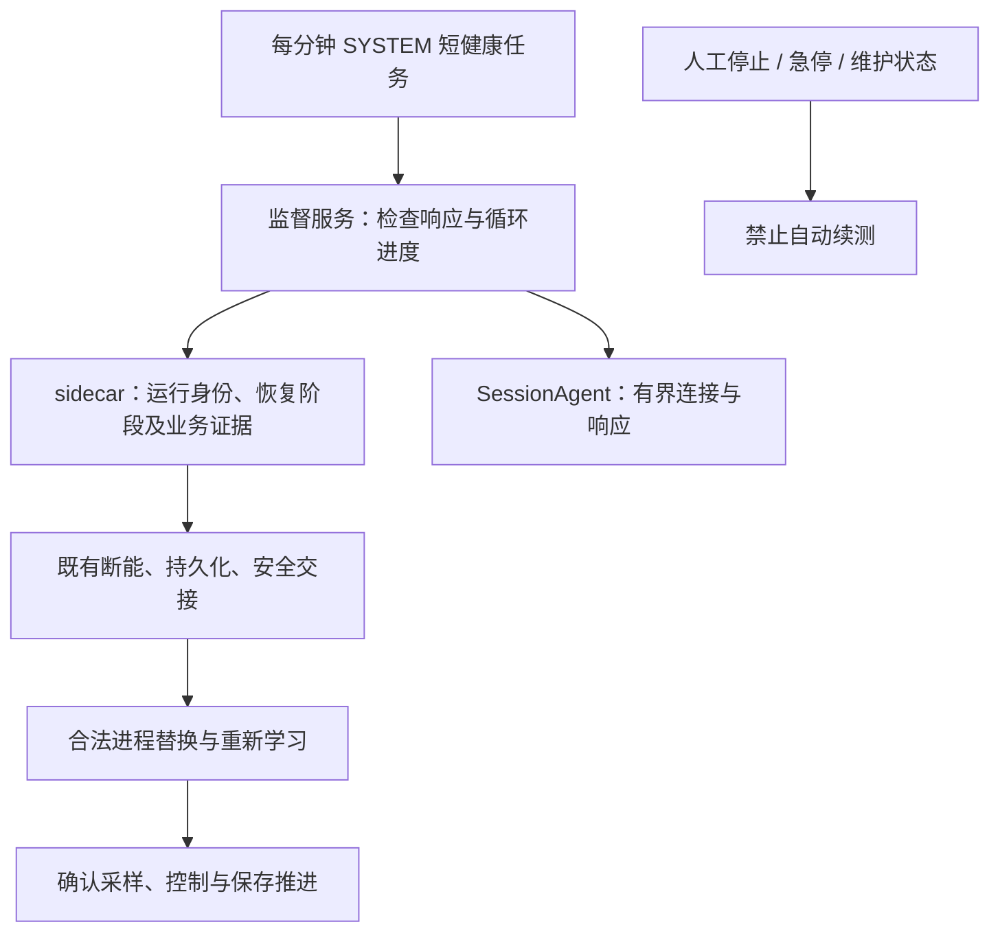

# V2.17.3.0：I0048/I0049 故障恢复、关闭整改及安装包验收

## 1. 交付与验收口径

本次针对 V2.17.2.0 的 I0048/I0049 故障实施代码整改，统一升级至 **V2.17.3.0**，快捷部署器升级至 **R30**。封盘目录保持只读，不直接部署或改变本机既有运行服务。

“发布构建通过”“隔离安装态恢复通过”“24 小时模拟通过”“现场硬件验收通过”是四个不同结论，不能互相替代。安装包身份中的 FORMAL_RELEASE 表示干净提交及发布流水线通过，不表示真实设备或长稳试验已经验收。本文件末尾记录实际构建与交付结果。

原始依据：[I0048/I0049 完整分析及 V2.14.2.11 对照](2026-09-06_V2.17.2.0_I0048-I0049_系统故障_退出未恢复与V2.14.2.11对照完整分析.md)。该报告包含输入 SHA-256、日志行号、源码基线、摘要比较复核和六张截图；本次不重写历史事故版本，也不将截图文字作为执行指令。

## 2. 为什么故障，为什么原来没有恢复

| 环节 | 已确认原因 | 本次处理 |
|---|---|---|
| 初始暂停 | I0048 双卡、I0049 Dev2 的持久化队列最老批次超过约 1000 ms，触发安全暂停；不能解释为六个卡钳同时硬件损坏 | 保留保护；沿用已接入的写盘阶段耗时诊断，避免通过丢批次或普遍放宽阈值掩盖问题 |
| DAQ 重入 | 临时退场新增撤销执行许可，而旧恢复路径仍试图持旧许可重入，触发 StaleExecutionPermit | 上电前复核；许可失效转入既有安全重建，重新建立执行体、批次和学习资格 |
| 恢复出口 | 自维护次数耗尽进入 SafeIdleOnly；恢复登记失败回滚后缺少明确的自动恢复升级出口 | 按运行身份合并为一次软件恢复升级；登记拒绝完成回滚后请求安全重建 |
| I0048 监督 | 项目镜像仍为 Accepted，权威记录已经 Completed；观察函数让主监督循环长期 continue | 权威终态解除等待，继续正常故障监督；新交接仍保留等待 |
| I0049 重启 | SafetyAgent 哈希同一摘要分别表示为大小写，Ordinal 文本比较拒绝启动 | 使用已有验证十六进制格式的摘要字节比较；真实摘要改变或路径不匹配继续拒绝 |
| 监控重新出现 | 关闭失败隐藏遮罩、复原 Running/Idle；重入标记还可能跳过授权 | 关闭状态不可回退；串行共享准备过程，准备与授权分开复核，失败自动重试 |
| 主程序倒计时 | 优先启动退出监督，再检查已有关闭凭证 | 有当前会话有效凭证时直接退出；异常未收口路径保留监督 |
| 分钟任务无效 | 原任务只重复启动常驻 SessionAgent；已有实例导致 Event 322，不能检测活着但卡住的恢复链 | 新增独立的短健康检查任务，代理继续保持单实例 |

时间线要点：I0048 于 21:27:58 左右写盘暂停；I0049 于 22:17:53.386 暂停、22:17:55.656 队列报告恢复，随后仍因执行许可重入失败进入系统故障。22:18:54 旧程序已完成退出交接，但 22:18:55 起安全代理摘要准入失败，自动续测未发生。截图中的任务事件 322 是已有实例运行，不能作为主程序崩溃的独立证据。

V2.14.2.11 的较长运行区间真实存在，但旧封盘也有多个 PID 和恢复事件；不能等同于完全没有中断。此次定位到的关键回归是退场撤销许可与恢复重入未同步改造，而不是笼统的“新版门槛更严格”。继续保持旧回调隔离，不恢复失效旧许可。

## 3. 恢复边界与实际行为

### 3.1 自动恢复与人工意图

- 软件故障、异常退出保留续测意图，优先安全重建；需要进程替换时进入现有 Supervisor/SafetyAgent/SessionAgent 交接。
- 仍使用安装级持久限频：10 分钟最多 3 次重启；冷却结束继续尝试可重试的软件故障，进程重启不清空限频记录。
- 人工停止、正常退出及完成试验不自动续测；急停须人工复位。硬件故障未解除或安全、持久化、身份条件未满足时保持断能。
- 成功判断沿用业务恢复提交证据，要求采样、试验执行与数据保存重新推进。进程存在、窗口显示、许可 Approved 都不等于恢复成功。

### 3.2 许可与恢复登记

重入拒绝细分 ChannelDisabled、RunEpochChanged、ProcessRestartRequired、ExecutionPermitRevoked，记录阶段、通道、RunId、许可代际与运行代际。DAQ 供电前、供电异步返回后及机械资格验证后复核；失效立即触发断能回滚。

复用既有登记、StartSignal 和任务监督机制。只有完整登记及状态发布成功的任务才能执行。重复同范围请求不另建执行体；登记拒绝在回滚后转入安全重建出口。人工停止的撤权栅栏和运行身份复核阻止旧请求重新使能。

### 3.3 停止与监控关闭

停止后仍可查看结果，再单独关闭监控。关闭期间用同一串行准备入口，持续显示当前阶段；取消延迟遮罩覆盖阶段文字，停止 Completed 只推进至 90%，关闭授权和资源释放完成才到 100%。

停止采集时冻结正式前缀及最终接纳尾端。保存超时后的退出收口复用原事务、原边界和在途写入任务；存储恢复后补齐原数据，禁止重复开启物理 StopAll。迟到保存完成只提供退出专用凭证，不改写原超时事实，也不授权继续试验。

释放控制硬件在后台执行，保持 UI 消息循环。若控制器仍有工作任务持有硬件，HardwareReleaseBlocked 不允许走直接释放旁路并伪报成功。最终 Flush 或写盘器释放失败保持关闭状态，记录原因并重试。

新监控会话绑定时清除旧关闭凭证。监控已关闭且资源已释放后，主程序先检查匹配凭证，正常路径不再启动倒计时或访问硬件；已启动监督在取得关闭凭证后停止等待。

## 4. 两层健康检查

| 组件 | 行为及时间约束 |
|---|---|
| Supervisor | 每秒检查所属 sidecar；探测每 5 秒一次，启动宽限 30 秒，连续两次失败才恢复准确进程身份 |
| 健康通道 | 独立 V1 只读本机命名管道；当前账户、管理员、SYSTEM 访问；返回 PID、启动时间、工作进度及恢复状态；连接和读写均有界 |
| sidecar | 健康进度来自实际监督循环，不由单独的“报活”线程代替；业务恢复仍使用原阶段预算 |
| SessionAgent | 每次已连接启动交换最多 10 秒；有界健康探测，失联后协调重新运行注册任务；缺失代理另由原登录/每分钟任务补起 |
| MTTFTestRecoveryHealth | SYSTEM，开机及每分钟，IgnoreNew，最长 45 秒；两次探测失败后才重启准确 SCM 所属 Supervisor；不启动主程序，不操作硬件 |
| 维护 | 安装器与健康任务共享互斥量，并检查持久维护标记。成功配置后封存标记；失败保留禁止拉起状态，等待修复 |
| 未登录桌面 | 服务保留待恢复意图，登录后代理续接；本次不设置自动登录 |

外部配置、数据库格式和原 Watchdog schema 7 保持不变；健康 V1 是独立诊断接口。不要将常驻代理改成允许多实例，也不要在计划任务中直接启动试验。

## 5. 数据证据与限制

写盘诊断继续记录 ChannelGateWait、RawGateWait、RawStage、RawCommit、IndexGateWait、IndexCommit、RingFlush、Checkpoint 和 RawPrune；这些阶段可能嵌套，不能直接相加解释总耗时。现有证据尚不能唯一确定最初一秒写盘延迟来自磁盘、同步提交还是锁竞争，保留这一限制。

导出超大 .log/.jsonl 时，预算内保留最多 4 MiB 原始尾部，记录源大小、Offset、片段大小和摘要。片段开头可能落在一条记录中间，分析时须排除首条不完整记录；Partial=true 不能视作完整日志。

## 6. 验证记录

| 项目 | 本轮状态 |
|---|---|
| Debug x86 | 已完成构建；最终源码与发布流水线复核结果在交付记录补充 |
| AdaptiveControlTests | 修改后全量 758/758；新增 I0049 5/5 已计入总数；最终发布流水线再次核验 |
| 停机生产入口 | 11/11，含真实 StopAll 入口、虚拟硬件端口、保存超时恢复后复用原事务 |
| EpbDiskWriterTests | 66/66 |
| PowerSupplyDebugger.Tests | 19/19 |
| 部署脚本隔离测试 | 32/32；健康任务注册边界替换为测试接收器，不修改 SCM 或现场任务 |
| 安装态端到端 | 用户新增授权使用 MT-20251206JXCQ 测试机，已验证管理员远程连接；旧监督状态归档后执行真实 LocalSystem 服务及交互会话代理测试，结果在交付记录补充。本机服务保持原状 |
| 24 小时模拟 | 已于北京时间 2026-09-06 23:44:37 启动，PID 46424；目标不早于 2026-09-07 23:44:37 完成。状态文件 artifacts/i0049-soak-24h/soak-status.json；未满 86400 秒不得标为通过 |
| NI/CAN/电源/液压及现场连续运行 | 待现场验收 |

模拟长稳覆盖恢复许可、摘要准入、权威终态、健康通道、重启冷却、真实磁盘写入、低水位恢复及写入失败后原批次补写。它是恢复组件模拟，不等于真实控制柜安装态和机械耐久验证。保存进程身份、轮次、内存及句柄指标；测试中断和失败均不标为通过。

### 现场验收清单

- [ ] 双卡正常运行，单卡/双卡短时写盘积压后恢复或合并一次重建；无孤儿暂停。
- [ ] DAQ、DO、电源通信异常时正确断能，液压卸压及压力条件符合现场要求。
- [ ] 异常退出、代理退出、sidecar 退出、服务退出及失联逐项注入，恢复成功后正式圈和持久化位置继续推进。
- [ ] 十分钟重启限额耗尽后等待冷却并继续；重复健康检查无重复主程序。
- [ ] 人工停止、关闭、急停、维护期间不续测；急停复位和真实硬件故障解除后重新校验安全条件。
- [ ] 停止后查看结果、停止中关闭、连续关闭、保存延迟后恢复及 Watchdog 回执延迟，无监控重新出现。
- [ ] 监控关闭后主程序正常退出实测不超过 2 秒，无新 StopAll 和倒计时。
- [ ] 对账最终正式圈、Raw、SQLite、CSV 与停止边界；原数据无丢弃。
- [ ] 相同硬件/参数对比 V2.14.2.11 与修复版，分别统计连续业务时长、同 PID 时长、恢复成功率及写盘 P95/P99。

## 7. 安装、回退与交付记录

采用现有 Build-Release → Verify-Release → New-QuickDeployBundle 流程。代码、测试及本文件提交后从干净源码构建；不使用脏目录生成可部署正式身份。安装前正常停止旧试验、退出程序并备份配置及项目数据；通过一键安装入口完成管理员安装，安装本身不启动机械试验。

保留既有 .retired-* 槽和配置，不自动回退到 V2.14.2.11，不跨版本复用活动许可。安装器支持健康任务安装、修复及卸载；失败维护标记不能手工删除来强行启动试验，应使用受控修复流程。

构建提交、安装包绝对路径、SHA-256、校验结果及长稳进度将在实际产物生成后追加到本节。
