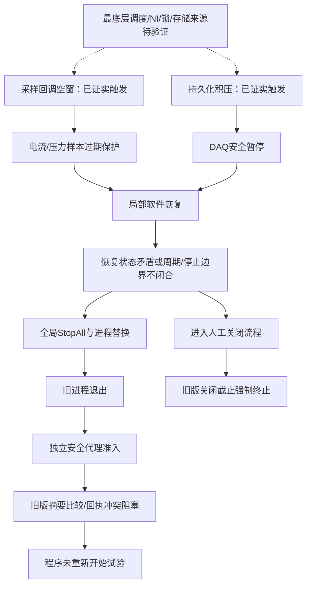

# 2.14.2.11 系统故障与程序退出：全备份复核及 2.14.2.12 无人值守能力评估

分析日期：2026-09-12。项目：WJ-EPB / 10243-028。时间统一为北京时间（UTC+08:00）。本轮只分析既有本地证据、核对源码并执行离线验证，没有改程序、部署现场、停止试验或修改计数。

## 1. 先回答“到底是不是已经确定原因”

**不是所有历史故障的最底层原因都已经确定。但多起故障从触发保护、升级全停、退出主程序到恢复受阻的链条，已有直接证据。不能再把它们笼统称作“软件随机崩溃”，也不能把修好了恢复交接说成采样停顿已经根除。**

本次判断分三层：

1. **首发触发**：有的事件是采样回调没有及时提供新数据，有的是持久化队列积压。这两类不能混用。电流/压力保护因数据过期触发，不等于已证明真实过流、掉压或 NI 硬件损坏。
2. **故障放大和退出机制**：局部恢复状态被监督端判为不一致，或周期/停止收尾不能闭合，进而全局 StopAll、撤销当前执行代并申请进程替换。另一些事件明确进入人工关闭限时终止。这里可以有确定结论。
3. **为什么没恢复试验**：SafetyAgent 的摘要大小写比较缺陷、回执竞争、停止事务代次不能收尾等，是已找到的软件缺陷；但各事故是否还同时有其他拒绝条件，必须分别看证据，不能用一个修复覆盖所有错误码。

**当前 2.14.2.12-rc.1 对恢复断链有针对性修复，但尚不能宣布整条故障链彻底解决。rc.2 主要修人工停止后的关闭体验，不是另一轮采样稳定性修复。**

## 2. 本次证据范围、完整性及边界

### 2.1 路径及输入

用户提供的 `D:\EPB\_Data\Backups` 在本机不存在；实际取回目录为 `D:\EPB_Data\Backups`。本轮以存在的目录为准，未据此改写现场路径。

- 对该目录全部 **79 个 .7z** 建立大小和 SHA-256 清单，总压缩大小 **2,310,447,781 字节**。
- 对其中 **68 个 10243-028 / 附加故障证据包**提取日志、JSON/JSONL、配置、CSV、事件材料与 index.db 等诊断文件；7-Zip 提取均成功。另 **11 个 10358-029a 包**列入输入清单，属于不同项目，未将其故障算作 WJ-EPB 的发生次数。
- 压缩包选取文件与 manifest 核验 **32,870 项**摘要一致；补充原先单独取回的 I0008/I0009/I0010 后，核验合计 **34,497 项**，无摘要不符。
- 共核对 **69 份备份 manifest** 的 ID 关系，未发现前序缺失。I0014 所在链可回溯 **14 层至基包**。这比前次只核验 I0012～I0014 的分析范围更完整。
- 已对该链逐步应用删除清单，产生 I0014 的逻辑文件来源映射：最终 **6,698 项**，其中 **5,549 项**在本次选择性提取/补充证据中有文件实体。没有向现场或原备份目录写回合并结果。
- 对 **31 份标为 2.14.2.11 的 index.db** 使用只读 immutable 连接检查，`integrity_check` 全部为 `ok`。这证明数据库结构可读，不证明每个波形完整、每圈都有效或计数口径相同。

本轮没有逐点重算全部历史 `.bin/.dat` 波形，也没有宣称重建了所有原始数据文件。7-Zip 选择性提取通过和选取文件摘要一致，不等价于每个未提取文件均经过本轮完整性检查。逻辑链连续也不补足封装时就遗漏的文件、已删除日志或未采集的 OS 事件。

### 2.2 不能把包名、会话、版本混为一谈

备份里保留着更早版本的日志及 LegacySealed 会话。同一个事件也可能在多个增量、封存会话和脚本回传目录中重复出现。因此使用：

- `SessionId + PID + ProcessStartUtcTicks` 区分进程会话；
- 启动构建日志、runtime-build-identity、转储中主模块版本共同归属版本；
- EventId 去重事件，文本摘要去重相同日志行；
- UTC 时间转换为北京时间；数据库按日期时间归一化，不用字符串排序混排时区；
- 主 EXE 版本与恢复组件摘要分别记录。

旧版典型主 EXE 摘要为 `9158a6cf57cfd6329d3f8dc3dd254f5e35a0d8c8b9fe48cd43b9a3919837a8ba`，现场旧构建 `GitCommit=unknown`。标签 `2.14.2.11` 对应 `6ed4d47bc201d95757fdf790ab9282ff9f57cb08`，用于源码解释；没有做每个旧 DLL 与标签的反编译一致性证明。

另核验3个EPB附加证据目录：09-06 09:24、09-06 22:21、09-12 10:21，各有507、584、244个已复制文件摘要匹配。前两次封装各因大小预算省略一份约71.8MB的全局Supervisor日志，不能声称这些包包含全部系统侧记录。这些目录分别涉及2.17.0.0、2.17.2.0、V3，作为对照使用，校验项与其他输入可能重叠，未相加冒充独立文件数。

对65份已有转储读取模块及异常流元数据，9份主模块为2.14.2.11；另外从I0006提取的一份转储实际为V3，排除于旧版。没有解析完整托管/原生线程栈；未见异常流不能排除全部原生异常。日志扫描另记录I0009某行一个无效UTF-8字符，其余关键文本由rg复核，避免解码造成漏判。

### 2.3 证据等级

| 标记 | 含义 | 示例 |
| --- | --- | --- |
| A：已证实 | 原始日志/回执/数据直接记录，或确定源码条件并有对应输入 | TakeoverReplacementExit；同摘要大小写会被旧比较拒绝 |
| B：强证据推断 | 时序与实现共同支持，但缺少当时完整线程/字段状态 | 液压自愈登记中间态被心跳采到 |
| C：待验证 | 目前无法唯一确定，必须追加可区分假设的测试/观测 | 秒级停顿究竟来自 NI、调度、锁、GC 还是存储调用 |

“触发条件已证实”不意味着“最底层原因已证实”。本报告后续各节都遵循这一点。

## 3. 历史事件总表

本轮识别到 **44条旧版启动日志身份，另由dump补认PID8084，共45个启动身份**；其中44个监督Session可关联（含一进程多Session和部分启动未匹配的情况）。在这些Session中归并出 **21个退出请求/退出确认窗口**，其中15个在接管前90秒至后10秒日志窗口出现 `HydraulicSampleStale`。该窗口用于定位相邻证据，不代表每次最初故障均发生于这90秒内。

**退出分类：12个主动替换退出请求（其中10个有退出确认）、8个看门狗终止、1个人工关闭截止终止。** 有18个Session记录 `OldProcessExitProven`；人工关闭终止另由退出回执证明。19个Session记录安全worker失败，其中1个是人工停止后的纯安全收尾，不应算作自动续测失败。反复观察同一死PID或重试worker均已去重，不能用来夸大故障频率。

| 证据 | 接管/退出窗口起点 | PID | 首发及升级线索 | 退出机制 | 恢复阻塞/边界 |
| --- | --- | --- | --- | --- | --- |
| [E01](<D:/Github/wanxiang/EPBTest/Codex/baseline-review-20260912/逐起证据索引.md#e01>) | 09-03 04:51:31 | 8084 | 首发原因未定位；心跳失联接管 | 看门狗终止；退出已确认 | 身份拒绝 |
| [E02](<D:/Github/wanxiang/EPBTest/Codex/baseline-review-20260912/逐起证据索引.md#e02>) | 09-03 12:21:02 | 11916 | Dev2样本315/707ms；EPB9无人工owner暂停 | 替换退出请求；缺退出完成证据 | 本窗口未见worker失败，不能判为恢复成功 |
| [E03](<D:/Github/wanxiang/EPBTest/Codex/baseline-review-20260912/逐起证据索引.md#e03>) | 09-03 20:38:32 | 23088 | 液压样本1110.8ms；周期安全边界失败、心跳失联 | 看门狗终止；退出已确认 | 身份拒绝 |
| [E04](<D:/Github/wanxiang/EPBTest/Codex/baseline-review-20260912/逐起证据索引.md#e04>) | 09-03 21:57:09 | 23348 | Dev1持久化1001.6ms；PersistenceBoundaryUnconfirmed | 看门狗终止；退出已确认 | 身份拒绝 |
| [E05](<D:/Github/wanxiang/EPBTest/Codex/baseline-review-20260912/逐起证据索引.md#e05>) | 09-04 05:51:05 | 7784 | 启动不久；停止安全完成但要求重启，首发未定位 | 看门狗终止；退出已确认 | 身份拒绝 |
| [E06](<D:/Github/wanxiang/EPBTest/Codex/baseline-review-20260912/逐起证据索引.md#e06>) | 09-04 10:04:10 | 6288 | 液压样本1111.8ms；InconsistentRecovery | 替换退出请求；缺退出完成证据 | 本窗口未见worker失败，不能判为恢复成功 |
| [E07](<D:/Github/wanxiang/EPBTest/Codex/baseline-review-20260912/逐起证据索引.md#e07>) | 09-04 12:38:55 | 11924 | 液压样本1113.2ms；周期613安全边界失败 | 替换退出；退出已确认 | 回执revision回退及身份拒绝 |
| [E08](<D:/Github/wanxiang/EPBTest/Codex/baseline-review-20260912/逐起证据索引.md#e08>) | 09-04 14:46:56 | 15264 | 液压样本1121.6ms；周期488安全边界失败 | 替换退出；退出已确认 | 身份拒绝 |
| [E09](<D:/Github/wanxiang/EPBTest/Codex/baseline-review-20260912/逐起证据索引.md#e09>) | 09-04 19:12:56 | 21336 | 液压样本1108.4ms；周期1054安全边界失败 | 替换退出；退出已确认 | 回执revision回退及身份拒绝 |
| [E10](<D:/Github/wanxiang/EPBTest/Codex/baseline-review-20260912/逐起证据索引.md#e10>) | 09-05 01:04:12 | 12120 | 液压样本1124.7ms；周期195安全边界失败 | 替换退出；退出已确认 | 身份拒绝 |
| [E11](<D:/Github/wanxiang/EPBTest/Codex/baseline-review-20260912/逐起证据索引.md#e11>) | 09-05 10:42:57 | 11872 | 液压样本1110.1ms；周期2001安全边界失败 | 替换退出；退出已确认 | 身份拒绝 |
| [E12](<D:/Github/wanxiang/EPBTest/Codex/baseline-review-20260912/逐起证据索引.md#e12>) | 09-06 01:47:43 | 2476 | 持久化1002ms、采样611.7ms；断电未确认超时 | 看门狗终止；退出已确认 | 身份拒绝；未确认不等于物理带电已证实 |
| [E13](<D:/Github/wanxiang/EPBTest/Codex/baseline-review-20260912/逐起证据索引.md#e13>) | 09-06 06:16:11 | 13820 | 液压样本1113.1ms；周期1061安全边界失败 | 替换退出；退出已确认 | 身份拒绝 |
| [E14](<D:/Github/wanxiang/EPBTest/Codex/baseline-review-20260912/逐起证据索引.md#e14>) | 09-07 01:10:23 | 17896 | 液压样本1109.3ms；InconsistentRecovery升级全停 | 替换退出；回执确认截止前自行退出 | 身份拒绝；详见4.1 |
| [E15](<D:/Github/wanxiang/EPBTest/Codex/baseline-review-20260912/逐起证据索引.md#e15>) | 09-09 08:34:56 | 19636 | 液压样本1120.2ms；周期315安全边界失败、心跳失联 | 看门狗终止；退出已确认 | 身份拒绝 |
| [E16](<D:/Github/wanxiang/EPBTest/Codex/baseline-review-20260912/逐起证据索引.md#e16>) | 09-10 03:13:08 | 4840 | 液压样本1124.5ms；InconsistentRecovery、局部修复超时 | 看门狗终止；退出已确认 | 身份拒绝 |
| [E17](<D:/Github/wanxiang/EPBTest/Codex/baseline-review-20260912/逐起证据索引.md#e17>) | 09-10 10:53:41 | 8144 | 液压样本1119.9ms；周期525安全边界失败 | 替换退出；退出已确认 | 身份拒绝 |
| [E18](<D:/Github/wanxiang/EPBTest/Codex/baseline-review-20260912/逐起证据索引.md#e18>) | 09-10 23:23:11 | 13972 | 液压样本1117.2ms；周期201安全边界失败、心跳失联 | 看门狗终止；退出已确认 | 身份拒绝；任务异常不是单独的崩溃证明 |
| [E19](<D:/Github/wanxiang/EPBTest/Codex/baseline-review-20260912/逐起证据索引.md#e19>) | 09-11 02:30:42 | 23196 | 液压样本1112.0ms；周期684安全边界失败 | 替换退出；退出已确认 | 身份拒绝 |
| [E20](<D:/Github/wanxiang/EPBTest/Codex/baseline-review-20260912/逐起证据索引.md#e20>) | 09-11 12:43:55 | 1536 | 液压样本1113.6ms；周期1532安全边界失败 | 替换退出；回执确认截止前自行退出 | revision回退及身份拒绝；详见4.2 |
| [E21](<D:/Github/wanxiang/EPBTest/Codex/baseline-review-20260912/逐起证据索引.md#e21>) | 09-12 10:55:51 | 3816 | 双卡持久化/采样延迟；停止Epoch冲突 | 人工关闭路径30秒截止终止 | 停止安全边界未闭合；详见4.3 |

## 4. 已闭环的旧版重点事件

### 4.1 09-07 01:10：采样空窗 → 局部自愈被升级 → 主动替换退出 → 安全代理起不来

会话 `e1e39a252d7a4937bf501091092826b1`，主 PID 17896。09-06 22:25:07 启动，22:28:12 正式运行。

| 时间 | 直接证据 | 判定 |
| --- | --- | --- |
| 00:03:52、00:28:29 | Dev1 回调空窗分别约 1173.8、1169.5ms | 更早已出现同量级空窗，当时继续运行 |
| 01:10:17.295 | 两卡 Produced/Persisted 推进、持久化队列为 0 | 不支持把本次首发说成写盘高水位 |
| 01:10:17.946 | EPB4 CallbackAge 265.1ms，超过带电保护 250ms，DO 断电成功 | 样本陈旧保护真实触发 |
| 01:10:18.636 | EPB5 CallbackAge 954.7ms，断电成功 | 故障影响到同组后续错峰动作 |
| 01:10:18.794 | 液压组1 HydraulicSampleStale；70.835bar、最低60bar、Age1109.3ms | 直接失败是年龄，不是所记录数值低于下限 |
| 01:10:18.800～.851 | 冻结4/5并发布局部自愈；日志明确暂不发布全局SystemFault | 局部恢复确实开始，不是完全没执行 |
| 01:10:18.852 | Dev1 DaqCallbackGap约1171.5ms | 与陈旧样本链吻合；记录时已断电不代表空窗从头到尾都未带电 |
| 01:10:18.910～.993 | Watchdog `InconsistentRecovery`，随后全局StopAll | 健康组被全局收尾牵连停测 |
| 01:10:23.941 | `TakeoverReplacementExit`，保留已批准恢复许可 | 有意替换退出 |
| 01:10:36.912 | 首次 `SupervisorSafetyHandoffIdentityMismatch` | 安全代理准入失败 |
| 01:10:37.023 | `OldProcessExitProven` | 旧进程退出已被确认 |
| 06:09:18 | 相同原因反复拒绝；封存中该会话600次worker失败 | 不是成功重启主程序600次 |

退出回执为 `MainProcessExitedBeforeDeadline`，`ProcessTerminationRequested=false`。**这一次不能写成“30秒强杀”“内存泄漏崩溃”或“系统重启”。**

此时安全交接里摘要为小写，旧 Supervisor 请求生成函数产生大写，比较却区分大小写；即使实际文件相同也足以拒绝。其余 nonce、handoff 等字段未全部导出，不能断言每个拒绝只有这一项，但该缺陷本身确定且足以阻塞。

首次故障发生在正式运行约 **2小时42分** 后。因此今天连续约2.5小时正常，甚至尚不能用时长覆盖这一次旧事故的触发窗口。

### 4.2 09-11 12:43～13:01：相似首发，周期安全边界失败后再次退出

会话 `e3f20abf695345d0ab5fc08ce0eccc46`，旧 PID1536。主证据在 I0012。

- **12:43:47.327**：液压组1 `HydraulicSampleStale`，记录71.241bar，Age1113.6ms。
- **12:43:47.391**：`HydraulicSelfHealingQueuedLeaseAbort` 同源异常；不能把这个任务异常直接当成杀进程原因。
- **12:43:49.285**：EPB8 周期槽1532，`MotorOff=True, HydraulicReleased=False, Persistence=False`，随后 `FormalSlotSafetyBoundaryFailed`，当前进程上电权永久撤销。
- **12:43:55.402**：StopSafetySupervisor 请求接管重启；检查点仍 Armed。
- **12:44:06.001**：`ApplicationExitRequested / TakeoverReplacementExit`。
- **12:44:17.273**：旧 PID 退出被确认；随后安全回执 revision/identity 回退错误，SafetyAgent 持续身份拒绝。
- **12:45:47 起**：每轮90秒安全前置超时，`MainLaunchBudgetConsumed=False`；13:01前退避到300秒。
- **13:01:51～56**：另一个 Session/PID8200 重新建立；不能仅因出现新窗口就算旧许可完成。

本次也有主动替换退出的直接证据。与09-07共用的摘要比较缺陷仍在，但回执版本竞争是额外问题。两者必须分别修复。

### 4.3 09-12 10:55～10:57：写盘/采样共同停顿，停止代次冲突，关闭超时终止

I0014 的旧版 PID3816 运行段，后续 PID15628 是新会话。

- **10:55:10.533**：Dev2 持久化最老批次1014.3ms，安全暂停。
- **10:55:11.478～.506**：双卡回调年龄约960～975ms，Dev1持久化1316.2ms，电源遥测也约1022ms。多系统同时延迟支持共享资源停顿的推断，不能据此直接确定硬盘、网络或GC。
- **10:55:46.718**：StopAll 撤销执行授权，DAQ恢复取消。
- **10:55:51 后**：排空、无丢弃，但 `Paused / RequireRecovered=True / Closed=False`；通道当前Epoch2与旧恢复context Epoch1不一致，owner不能释放。
- **10:55:51**：ClearRecoveryOwners 超过5秒无进展，Watchdog接管。
- **10:56:14**：`ClosingFenceObserved` 取消该接管。
- **10:56:41～46**：关闭诊断、dump、限时终止；退出回执明确 `MainFormClosing / ExactMainProcessTerminatedAt30SecondDeadline`。
- **10:56:50.693**：新PID15628的启动日志；10:57:35～41重新建立检查点/授权，11:00后重新有正式完成数据。新进程存在与恢复业务是不同证据。

**这是关闭限时终止，与前两次替换流程自行退出不同。** MainFormClosing 证明进入了该关闭入口，但不足以重建全部人工操作，不能断言是无人退出。回执未证明物理安全也不能反向证明一定带电；必须保留“安全证据未闭合”的原义。

### 4.4 为什么不把 V3 的所有失败归到 2.14.2.11

09-12 10:17 的 V3 有很明确的持久化积压 → 重建学习 → 内部取消 → StartupRollback撤销Armed → 子进程拒绝续测链。它可提示基线共有代码风险，但不是旧版事件本身。

同样，V2.17 的参与者退场新增执行许可撤销、重入却使用旧许可，是对应版本的回归；不能不检查版本就用于解释旧版全部故障。旧版本恢复链本来已有 Watchdog、Supervisor、SessionAgent、SafetyAgent，不是“旧版没有恢复机制，新增一个进程即可”。

### 4.5 09-09 人工停止后的安全交接：另一条仍需补齐的路径

PID15828、Session `8b48f3b9bc8c47c4a7eb71b4d7882451`，09:13:02.974明确记录人工停止，随后关闭围栏、管道断开；09:18:43进入安全交接，09:18:45记录回执无效及 `SupervisorSafetyRequestInvalid`。交接里恢复许可Generation为0、PermitId为空。详见证据E22。

**这不是“人工停止后应该自动续测却没续测”，而是人工停止后仍需要安全收尾，但请求格式把安全交接和重启许可绑在一起。** 当前客户端直接复制回执许可，协议结构验证仍要求正Generation及有效PermitId；零许可本身足以被拒绝。历史完整请求没有全部保留，不能断言只有这一项不合法。

本轮加载当前候选协议程序集离线验证：其他字段相同，无重启许可时 `IsStructurallyValid=false`，有效许可时为true。只调用结构验证，没有IPC、拉起进程或接触硬件。rc.2的已证实安全后快速关闭能减少进入此路径的机会，但没有改变这项通用协议约束。

建议独立定义“仅安全收尾”的授权模式，仍验证会话、PID启动时间、nonce、二进制摘要、当前停止事务与安全结果；该模式**不得**带来重新上电或续测权。不能靠给人工停止补发恢复许可解决。

## 5. 哪些原因已确定，哪些还不能确定

| 问题 | 当前确定程度 | 不能越界的结论 |
| --- | --- | --- |
| 约1.1～1.2秒无新鲜采样引起电流/压力保护 | A：特定事件的首发触发已证实 | 不能直接指认NI卡坏、驱动bug或Windows调度为唯一原因 |
| 持久化最老批次超过约1秒引起暂停 | A：I0014及部分其他事件有直接记录 | 队列积压是现象；要区分写入慢、锁等待、线程未获调度和消费者逻辑阻塞 |
| 局部恢复被 InconsistentRecovery 升级全停 | A：09-07事件原因码和StopAll时序直接对应 | “发布中间态被采中”仍是B，尚无当时完整线程交错 |
| 周期安全边界失败后撤销上电权并退出 | A：09-11明确 | 安全失败可能发生在收尾，不等于最初硬件故障 |
| 同SHA-256的大小写导致SafetyAgent准入失败 | A：旧源码与证据输入构成充分拒绝条件 | 不代表其他身份字段永远正确 |
| 回执过期副本及非原子读改写竞争 | A：源码风险，历史有revision错误；具体交错为B | 互斥写入改善冲突，不等于已证明所有交接都完成 |
| StopAll新代终态与DAQ旧context冲突 | A：I0014日志与代码对应 | 允许旧owner以Cancelled释放，不能称它恢复成功 |
| 所有退出都是内存泄漏/CLR崩溃 | C：没有这样的统一证据 | 无异常流也不能排除所有原生异常；不能夸大阴性证据 |
| 2.14.2.12已消除首发停顿 | C：尚无证明 | 本次diff中IO.NI、DataOperation核心实现未改；不能说底层问题已根除 |

旧程序 `TaskScheduler.UnobservedTaskException` 处理调用 `SetObserved()`；它会记录异常，但该日志自身不足以证明进程被CLR终止。UI ThreadException / AppDomain UnhandledException 则会请求FatalRestart，必须结合具体事件审查，不能把三类异常混为一谈。

## 6. 当前版本到底覆盖多少

### 6.1 版本必须明确

- 现场17:19～17:22只读检查：**2.14.2.12-rc.1**，产品源码 `06bc55c285136d1dc7afc99067c8d96138ba2f80`。
- 新候选 **rc.2**：产品源码 `f9136bfb5c65eb0e19faea8d98f30627c9cd1d56`，标签文档提交 `64681eb09733a4af4054037afe8e92c5142da30d`。
- 二者程序数字版本都是2.14.2.12，窗口标题不能区分候选，需核对build-identity和组件摘要。

| 旧问题 | rc.1实际改动 | rc.2增量 | 覆盖判断 |
| --- | --- | --- | --- |
| 摘要大小写拒绝 | Supervisor/Watchdog/SafetyAgent统一合法64位十六进制比较 | 沿用 | 对应软件缺陷已修；真实整链恢复未验收 |
| 回执竞争/等待后使用旧revision | 跨进程互斥读校验写、幂等重放、退出后重新读取 | 沿用 | 有并发回归；现场交错仍需验证 |
| 内部启动取消撤销根试验意图 | 绑定RunId/Epoch，区分恢复子链与人工停止 | 沿用 | 对应取消语义已修，不代表所有许可冲突已消除 |
| Running先发布、timer后建立 | 先建执行体，再发布；首回调等待发布 | 沿用 | 修正常见瞬态假运行窗口 |
| DAQ旧owner无法被StopAll收尾 | 同Run停止、冻结和逐通道断能证实后取消释放旧owner | 沿用 | 修收尾，不把Cancelled当Recovered |
| 冻结边界Paused导致关闭不成立 | 仅冻结停止边界允许Paused，其余数据条件不放宽 | 沿用 | 修停止等待，不改运行恢复判据 |
| 人工关闭固定3/30秒终止 | 仍为旧关闭策略 | 安全凭证后隐藏界面，后台保留落盘，人工路径不强杀 | rc.2针对性修复；真实停止后的安全证据仍需台架验收 |
| NI回调/持久化秒级停顿 | 核心实现未改 | 核心实现未改 | 未证明根治 |
| 液压恢复计数与结构化心跳发布窗口 | 相关顺序及判据仍在 | 未改 | **残余高优先级风险** |
| 人工停止后的纯安全交接被要求重启许可 | 协议仍要求有效许可 | 通用协议未改 | **本轮离线验证仍拒绝，需独立安全收尾模式** |
| 真实故障后每路重新动作并连续提交 | 模块回归、模拟落盘、jxcq兼容性 | 关闭专项回归 | 尚缺真实六路整链证据 |

### 6.2 本轮新核验：恢复发布窗口仍可能构成矛盾

当前 `Controller/EpbManager.cs` 的 `BeginHydraulicSoftwareRecovery` 仍先向 `_hydraulicSoftwareRecoveryGroups` 加入组，再冻结/断电/退出参与者，后续才登记 `TryBeginRecoveryIncident`。逻辑计数包含该字典；`WatchdogRecoveryTelemetryPolicy.ShouldPublishRecoveryActive` 对仅有软件计数而缺结构化身份/生命周期的状态返回false。

本轮实际加载候选的协议程序集，离线执行纯策略函数：

| 输入 | RecoveryActive输出 | Watchdog相同矛盾谓词 |
| --- | --- | --- |
| 非人工停止，SoftwareRecoveryCount=1，DAQ/owner=0，结构化身份/生命周期尚未发布 | false | true |
| 同样计数，结构化身份/生命周期已发布 | true | false |

这证明**当前策略组合对该输入确实存在矛盾**，不是只凭函数名猜测。它还没有复现历史线程恰好停在两步之间，也没有证明每次都会引发退出。下一轮应以生产接缝固定该中间态，验证真实心跳采样与Watchdog行为。

对应源码：`Controller/EpbManager.cs:10045`、`:10055`、`:10361`；`Watchdog.Protocol/WatchdogPolicy.cs:983`；`MTTFTest.Watchdog/WatchdogHost.cs:2531`。离线脚本与输出见 `probe-recovery-publication.ps1`、`publication-policy-result.json`。

### 6.3 已有测试的实际价值与局限

rc.1的本地/安装态模块回归、300秒双DAQ模拟SQLite落盘，证明相关实现具备可复核的软件行为；rc.2完整Adaptive709/709、磁盘58/58、电源19/19、jxcq WinForms31/31，证明本轮未发现这些已覆盖路径回归。

它们不等价于：现场NI回调永不中断、磁盘长期无抖动、实际六路每种故障都可自恢复。jxcq测得40ms退出是“未启动试验”的窗口关闭，不是运行2.5小时后人工停止的全硬件安全关闭测试。

17:22的现场状态确有业务进展：六个启用通道均Running、机械计数增长、39秒数据库比较各新增2～3圈、队列为0、无报警通道；同时仍有电流峰值软预警。这是时段内的积极证据，不是无限时长保证。

## 7. 无人值守的下一步：先消除放大，再验证恢复，再定位首发

### 7.1 优先级及具体交付

| 优先级 | 具体工作 | 通过标准 |
| --- | --- | --- |
| P0 | 分离纯安全收尾与恢复许可的请求模式 | 人工停止后无恢复许可也能完成安全收尾；任何该模式请求均不能拉起续测 |
| P0 | 固定液压恢复登记中间态，验证并修一致发布 | 合法登记过渡不升级全停；真正无owner/无进展状态仍在明确期限内被接管 |
| P0 | 把恢复成功绑定每个应恢复通道的动作、计数、正式持久化 | 单通道/组级/全局故障后，所有应恢复通道连续3圈通过；不能只用PID或总计数 |
| P0 | 注入同进程失败，验证旧进程退出、安全代理、许可消费、新进程续测整链 | 精确旧身份释放；安全回执完整；根意图未误撤销；新执行代与首圈提交可追溯 |
| P1 | 记录秒级停顿的阶段分解和低开销前后环形证据 | 可区分DAQ读取、回调调度、入队、消费者等待、SQLite事务/flush、锁、GC/线程池；同一单调时钟关联 |
| P1 | 停止/后台落盘故障注入，包括超过30秒和失败重试 | 不丢尾段、不复活已人工停止批次、不以写盘成功替代物理安全，不争用新会话 |
| P1 | 升级状态工具为逐通道业务监督 | 在规定无进展期限内发现任一路卡住；区分NotEnabled/TargetCompleted/ManualStopped/Recovering/PermanentAlarm |
| P2 | 同配置真实台架长稳及资源趋势 | 24h初验、168h耐久候选；资源、尾延迟、恢复耗时不持续恶化，异常能解释闭环 |

这不是建议直接在WJ-EPB正在运行的试验上注入故障。先在仿真和可控台架验证，保留当前现场有效运行证据；本报告不执行下一轮业务修改。

### 7.2 不应采用的“优化”

- 不应把250ms等采样保护阈值一律放宽来换取少报警；陈旧电流/压力不能保证安全。
- 不应把InconsistentRecovery永久忽略；真正丢失owner仍需要有界接管。应修一致发布，或有明确身份与期限的登记状态。
- 不应把重启次数无限增加；摘要校验失败、配置无效时，多启动次数无助于完成安全前置。
- 不应定时强杀并重启来掩盖泄漏或停顿；进程替换必须服从安全和续测意图。
- 不应清空检查点、删除owner文件、重置计数或绕过联锁来解除表面阻塞。
- 不应在稳定现场为“采证”无限开详细日志、全量dump或连续复制全部波形；采证自身也会增加负载。

### 7.3 故障注入矩阵

| 故障 | 必须覆盖的时点 | 必须检查 |
| --- | --- | --- |
| 单卡采样空窗100/249/250/251/500/1200/1600ms | 未带电、正向带电、反向释放、错峰任务即将启动、学习/正式 | 正确断能；后续任务不使用旧样本上电；故障消失后合法重建并提交 |
| 持久化消费者延迟/数据库锁/磁盘失败 | 小于阈值、越过1秒、达到队列硬上限、超过30秒 | 负载限界、保存义务不消失、恢复与停止的边界分别闭合 |
| 液压恢复登记并发 | TryAdd后、incident发布前、StopAll同时发生 | 心跳快照一致；旧owner只释放自身，不改新代状态 |
| 人工停止和恢复并发 | 新批次建立前后、迟到回调、许可已批准时 | 人工意图立即撤权；新批次不复用旧停止凭证 |
| 主进程失联/异常退出 | 学习、正式、恢复、数据收尾 | 独立安全前置、精确身份、新代续测；不凭窗口恢复计通过 |
| 服务/SessionAgent重连、重复启动 | 会话切换、旧侧车残留、IPC短断 | 单权威、单会话执行；旧许可不影响新批次 |
| 真压力/电流异常 | 超限、样本失效、信号缺失 | 安全停机，不能为了无人值守自动强行通电 |

### 7.4 无人值守验收指标

每起事件记录 `RootRunId / RunEpoch / SessionId / IncidentId / 受影响通道 / 触发时刻 / 安全完成 / 恢复启动 / 每路首个正式提交 / 连续三圈 / 旧事务终态`。

分别报告：有效试验时长、各通道机械动作和有效圈增量、软件故障数、可恢复事件成功率、恢复耗时P50/P95/最大值、无业务进展总时长、无法自动恢复事件数、丢弃批次/未解释数据缺口、资源峰值及长期趋势。硬件永久故障、人为停测、目标完成要单列，不能充当恢复失败，也不能从失败分母中无说明删掉。

恢复期限按阶段制定：断能、安全确认、保存、重建、学习、首圈提交各自有上限。项目自学习10圈本身需要约2分多钟，不能武断承诺“故障后一律30秒恢复”。长期窗口必须跨过多次备份、日志轮转和数据维护周期。

达到168小时也只说明在已测配置/负载下取得相应证据，不是数学意义上的永不出错。目标是软件异常可检测、可安全收敛、可恢复业务，安全条件不成立时可靠停机并明确通知人员。

现有回归成绩引用既有验证记录，本轮没有重新执行完整构建和所有套件；本轮实际新执行的是恢复发布策略和纯安全请求结构两项离线验证。

## 8. 证据索引与复核方式

本轮全部脚本、选取原始证据及中间结果位于主仓库 `Codex/baseline-review-20260912/`。

| 文件 | 用途 |
| --- | --- |
| archive-inventory.json | 全79包大小、SHA-256、提取结果、manifest选取文件校验 |
| supplemental-manifests.json | I0008/I0009/I0010补充核验 |
| chain-audit.json | 69份manifest前序/基包关系 |
| I0014-logical-reconstruction.json | 应用删除清单后的文件来源映射，非完整波形恢复 |
| database-audit.json | 31份旧版SQLite只读结构及提交摘要 |
| events.json / session-summary.json | 去重监督事件及按Session聚合 |
| log-hits.json / starts.json | 关键原始日志与构建启动身份，保留路径和行号 |
| dump-metadata.json | 转储主模块版本、线程数和异常流元数据；非完整托管栈分析 |
| publication-policy-result.json | 本轮实际候选程序集的恢复发布策略反例 |
| scan-errors.json / text-decode-notes.json | 扫描异常与文本解码记录；扫描范围限制以本报告2节为准 |
| baseline-key-events.json | 补充Repair/人工停止事件的权威逐Session汇总，避免仅搜索Recovery漏掉Repair |
| safety-only-request-result.json | 当前候选无重启许可的纯安全请求仍被结构校验拒绝 |
| external-evidence-audit.json | 三份额外证据目录校验及封装时省略项 |

历史文档用于对照，原始证据优先：09-07 I0050分析、09-12 I0012～I0014分析、rc.1实施记录、rc.2关闭实施记录、17:22现场状态记录。历史材料涉及当前不使用硬件的旧措辞不作为本轮分析或验收依据。

## 9. 当前决策建议

继续保留现场正常运行的数据，但暂不宣布“问题已经解决”。先完成恢复发布竞态、纯安全收尾授权和真实整链恢复三项高优先级验证，再决定有边界的下一轮修改；首发停顿用可区分来源的测量定位，不靠猜测提高阈值。

对用户最直接的回答是：**旧版确有已证实的主动替换退出和关闭超时终止，也有已证实的恢复准入软件缺陷；首发秒级停顿的唯一底层来源尚未全部确定。当前版本已修若干关键断链点，但仍有明确的残余代码风险与真实验收缺口，不能只凭2.5小时运行或本地测试全通过判定彻底解决。**

## 附录A：两类故障链，不应混为“随机退出”

图中是已观察到的不同事件路径，不代表每次故障都必经所有节点。某一次是否有人工关闭、旧进程是否被强杀、是否已完成物理安全，仍以该会话证据为准。

## 附录B：直接复核入口

- [逐起证据索引.md](<D:/Github/wanxiang/EPBTest/Codex/baseline-review-20260912/逐起证据索引.md>)
- [旧版会话覆盖清单.md](<D:/Github/wanxiang/EPBTest/Codex/baseline-review-20260912/旧版会话覆盖清单.md>)
- [baseline-fault-windows.json](<D:/Github/wanxiang/EPBTest/Codex/baseline-review-20260912/baseline-fault-windows.json>)
- [baseline-key-events.json](<D:/Github/wanxiang/EPBTest/Codex/baseline-review-20260912/baseline-key-events.json>)
- [archive-inventory.json](<D:/Github/wanxiang/EPBTest/Codex/baseline-review-20260912/archive-inventory.json>)
- [safety-only-request-result.json](<D:/Github/wanxiang/EPBTest/Codex/baseline-review-20260912/safety-only-request-result.json>)
- [publication-policy-result.json](<D:/Github/wanxiang/EPBTest/Codex/baseline-review-20260912/publication-policy-result.json>)

源码复核入口（当前候选；历史差异应同时对照旧标签）：

- [Controller/EpbManager.cs:10045](<D:/Github/wanxiang/EPBTest/Codex/v2.14.2.12-stable-recovery-work/Controller/EpbManager.cs:10045>)
- [Watchdog.Protocol/WatchdogPolicy.cs:983](<D:/Github/wanxiang/EPBTest/Codex/v2.14.2.12-stable-recovery-work/Watchdog.Protocol/WatchdogPolicy.cs:983>)
- [MTTFTest.Watchdog/WatchdogHost.cs:2531](<D:/Github/wanxiang/EPBTest/Codex/v2.14.2.12-stable-recovery-work/MTTFTest.Watchdog/WatchdogHost.cs:2531>)
- [Watchdog.Protocol/SupervisorProtocol.cs:179](<D:/Github/wanxiang/EPBTest/Codex/v2.14.2.12-stable-recovery-work/Watchdog.Protocol/SupervisorProtocol.cs:179>)
- [MTTFTest.Watchdog/SupervisorSafetyAgentLaunchClient.cs:37](<D:/Github/wanxiang/EPBTest/Codex/v2.14.2.12-stable-recovery-work/MTTFTest.Watchdog/SupervisorSafetyAgentLaunchClient.cs:37>)
