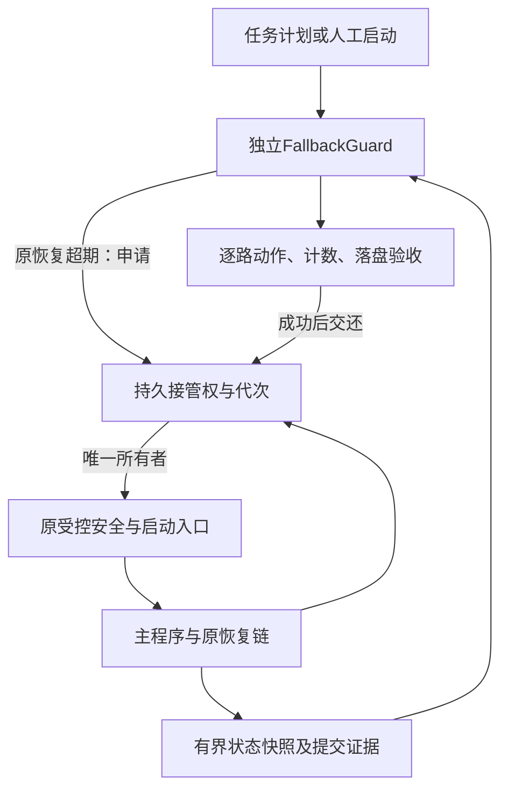

# WJ-EPB 原恢复优先与独立兜底协同设计

日期：2026-09-12。状态：待实施设计。本轮仅交付方案，不修改生产代码、不部署现场、不建立任务计划。

## 1. 本轮确定的方向

保留2.14.2.12主程序及原有恢复链，新增可以单独启动、停止、安装和升级的独立兜底程序。正常故障由原机制优先处理；只有原恢复超期或失效，外部程序取得排他接管权后才实施兜底。

本方案取代此前“把全部恢复决策迁移到Guardian”的方向，并扩展上一份“只观察、只补启动”的方案。**允许最小的状态输出和接管边界适配，不改采集、控制、自愈算法及保护门限。** 最小适配不等于零代码改动，确切改动量须由接口核对和回归结果确定。

核心原则：独立生命周期、有限状态交换、原恢复优先、接管有证据、同一时间一个恢复执行权威。租约或超时本身不能让失联的旧进程停止硬件操作。

## 2. 组件与职责

| 组件 | 原有职责/新增职责 | 明确不做 |
| --- | --- | --- |
| 主程序 | 保持采集、控制、实时保护、原同进程自愈；补必要状态输出和停止意图持久化 | 不维护外部程序生命周期，不引入外部高频控制依赖 |
| 原Watchdog侧车 | 保持现有故障判断、同进程修复及跨进程恢复；在接管边界遵守代次和所有权 | 未持有当前接管权时不得另行拉起主程序 |
| 原Supervisor | 保持启动/身份核验等职责；作为正常情况下唯一启动执行入口 | 不从外部快照直接推断物理安全 |
| 原SessionAgent/SafetyAgent | 保持会话启动、安全处理；验证接管代次或受其受控启动边界约束 | 不独立批准新的试验意图 |
| 新FallbackGuard | 独立读状态、检测无进展、申请接管、驱动既有恢复入口、验收后交还 | 不直接控制NI/液压/电源，不写试验库，不模拟点击开始 |
| 新任务计划入口 | 启动或确保FallbackGuard存在 | 不直接重启主程序、不另建恢复预算 |

FallbackGuard不引用主程序Controller或窗体实现；交互协议可独立测试。现有进程名、路径和正式启动接口以安装清单核对结果为准，不凭EXE名称推断角色。

## 3. 独立开关的行为

| 操作 | 预期结果 |
| --- | --- |
| 只开主程序，不开FallbackGuard | 原恢复正常运行，不等待外部心跳 |
| 运行途中打开FallbackGuard | 先识别安装、批次及历史状态，建立观测基线；不把启动前的静默立即算故障 |
| FallbackGuard仅观察时关闭 | 立即停止外部观察，原试验与恢复不受影响 |
| FallbackGuard正在接管时请求关闭 | 停止新增动作，完成安全交接/交还；界面可隐藏，后台不能丢弃事务 |
| FallbackGuard异常退出 | 原链根据接管账本调和；不能仅因外部心跳消失就重复启动 |
| 用户暂时关闭外部兜底 | 持久记录外部禁用状态，任务计划不得立即把它重新打开 |
| 再次启用 | 清除外部禁用状态，重新调和；不清除原人工停止、熔断或故障记录 |

独立兜底开关与“允许本批次自动续测”是不同设置：开兜底不等于授权开始试验。维护/卸载状态也不同于用户停止试验，分别记录。

## 4. 状态同步：只交换关键事实

采用两类数据：高频但可丢的观察快照；必须持久保存的意图、命令和接管事务。快照不是授权凭证。

### 4.1 观察快照

每个来源单写自己的文件，以临时文件写完再原子替换方式发布。字段包含SchemaVersion、InstallationId、ProjectId、SourceInstanceId、PID、ProcessStart、BootId、Sequence、RunId、RunEpoch。

业务字段：逐路Enabled/TargetCompleted/ManualStopped/Running/Recovering/PermanentFault；动作进展序号、正式提交序号、最近提交身份；原恢复IncidentId、阶段、ProgressSequence、阶段预算及开始标记；后台保存是否占用会话资源。

原恢复与主程序分别发布，外部用RunId/Epoch关联；不要求多文件瞬时一致。遇到身份不符、代次不同、缺字段、部分发布、序号不推进时进入“不确定”，不能拼出一个看似正常的新状态。

建议1秒发布一次、小于64KiB、固定通道上限；Guardian按本机单调时钟计算接收静默，UTC仅审计。数值为初始软件预算，待负载测试确定，不改实时安全阈值。文件修改时间、窗口响应和总圈数不能独立证明各路正常。

### 4.2 持久事实

| 数据 | 单写责任 | 规则 |
| --- | --- | --- |
| 运行意图及人工停止 | 沿用原权威存储，必要时由主程序追加停止记录 | 外部只读，不清Armed、不自行恢复人工停止批次 |
| 接管权账本 | 统一接管存储接口，所有参与者经互斥/CAS事务访问 | 单一串行化写入边界，不允许两边各自维护一份权威副本 |
| 接管命令/结果 | 命令发起者及执行者分别写各自记录 | CommandId幂等，绑定批次、代次、Incident和请求摘要 |
| 业务数据/检查点 | 原数据层 | 外部只读核验，不补圈、不回退计数 |
| 外部开关、诊断 | FallbackGuard | 不覆盖原恢复配置或预算 |

通信采用带ACL的本机管道，命令有总截止，响应丢失后先查询CommandId结果再重试。落盘记录用于重启调和；管道断开不等于原事务取消。协议必须区分Unknown、Rejected、InProgress和Completed。

## 5. 排他接管：优先复用原入口，补统一代次

接管账本建议字段：Revision、RunId、RunEpoch、Owner（Original/Fallback/None）、OwnerInstanceId、FenceGeneration、IncidentId、Phase、LastProgress、CommandId、StopRevisionObserved、OutstandingLaunch及其精确进程身份。所有权变更持久化后才能执行。

账本通过机器范围锁串行读校验写、原子持久替换；读取损坏、锁超时、弃置互斥量均进入调和，不能直接覆盖。持锁范围只含小型元数据操作，绝不能包含硬件调用、管道等待或等待进程退出。

### 5.1 原机制仍可响应时

1. 外部识别原恢复超过批准的阶段/总预算，持久提交接管申请。
2. 原机制冻结新增恢复操作，列出已启动的命令和进程；实时安全保护仍有效。
3. 原机制确认已到可交接点，提交Yielded及未完成保存/安全任务。
4. 外部以期望Revision和RunEpoch取得新FenceGeneration，读取最新人工停止记录。
5. 通过原安全和启动入口继续恢复，所有请求带当前代次。

### 5.2 原机制不响应时

超时只能升级为“需要接管”，不能自动证明排他成立。必须同时满足：原执行身份已被隔离或确切退出；没有尚在执行的旧启动命令；原主程序及SafetyAgent的硬件所有权已调和；安全证据满足既有规则；运行意图仍允许续测。

Supervisor活着但不响应时，外部不能绕开它直接Process.Start主程序。允许尝试的动作限于经验证的原基础设施修复入口；若必须替换Supervisor，应先查清其已创建的侧车、安全代理和启动事务，并证明旧实例不再有执行权。没有这套能力前，该场景只能告警。

FenceGeneration必须在原恢复命令受理、实际启动和首次重新上电的受控边界验证；至少保证旧请求不能穿过新启动入口。正在运行的旧代码不会因为账本更新自动停止，因此失联分支还需实际隔离。**单纯文件锁、租约过期或Kill一个侧车不能证明硬件已安全。**

这些边界若原代码没有现成接口，就是本轮最小适配必须新增的内容；不能通过观察日志猜测替代。

### 5.3 防止重复拉起的崩溃窗口

启动采用PrepareLaunch→执行→绑定PID及启动时间→确认的事务。执行后应答丢失，先查询持久启动结果和实际进程，不能盲目再启动。未绑定进程身份的启动窗口按Unknown处理，通过一次性启动身份/原启动记录调和；调和失败禁启。

外部在接管中崩溃，原机制也不能仅靠时间过去就取回权威。交还和接管同样需要确认未完成启动、安全及保存任务，产生新的FenceGeneration，拒绝旧外部迟到命令。

## 6. 人工停止、关闭及计数规则

人工停止仍即时触发现有安全停机，不等待外部。停止意图须可靠持久化并优先于恢复命令，接管申请、启动前、重新上电前均复核StopRevision。持久化失败时明确显示“续测授权状态未确认”，禁止新的恢复上电。

整机在点击停止与记录持久化之间断电，软件不能保证保留尚未写下的点击；重启出现授权不确定时禁止自动续测。不能声称快照同步解决了这一物理窗口。

人工停止后的安全收尾不要求恢复许可；不能因无恢复许可而拒绝断能任务，也不能因此重新发续测许可。沿用用户认可的快速关闭：运行/启动/恢复中拒绝关闭；人工停止且新鲜安全证据成立后关闭可见窗口，尾部数据后台保存，不新增固定强杀倒计时。

所有恢复以已提交检查点续接。动作完成但未提交的周期按原数据层可核对规则记为不确定，不自动补圈。后台保存持有资源时禁止新旧会话争用。外部不改业务库，文件存在也不等于正式提交完整。

## 7. 接管触发、预算和恢复成功

原恢复有可验证阶段进展时继续等待，但不能无限延长总预算；重复相同ProgressSequence不算进展。业务静默期限按学习、正式周期和保存阶段分别配置，不以固定5秒判断所有通道停滞。

外部使用原跨进程重启预算，或对其设置更严格的外部上限；不得另开一套预算使原熔断失效。配置/身份/永久硬件故障不通过多重启解决。原预算不可读时不自动接管启动。

恢复成功需要所有应恢复通道重新有动作反馈、正式计数和数据提交；建议连续3圈加一段稳定观察后交还，时长按配方确认。禁用、人工停止、目标完成通道单列。不得用PID存在、窗口响应、Running字段或总计数增长代替逐路验收。

共享液压、DAQ和供电资源按原影响范围处理，不承诺所有部分故障都能保持其他路不停。原实时安全判断始终优先。

## 8. 最小代码改动边界

| 模块 | 拟适配内容 | 保留内容 |
| --- | --- | --- |
| 主程序状态出口 | 复用当前心跳聚合，补缺少的提交身份/停止修订 | 不扫描硬件新增高频负载，不改控制算法 |
| 原Watchdog | 接管请求、Yield、状态输出、执行边界代次核验 | 保留原检测、自愈顺序、阶段预算和原因分类 |
| 原Supervisor启动入口 | 排他权校验、启动事务查询、迟到请求拒绝 | 保留身份核验和设备安全前置 |
| 停止/安全协议 | 明确SafetyOnly与恢复许可区分，复用现有凭证 | 不放宽电流、压力、采样有效性 |
| 新FallbackGuard | 独立观察、接管编排、验收和日志 | 不搬运主程序内部状态机 |

当前专项审查中的4项问题要单列处理：交接busy标志未释放、IPC等待缺少总截止、液压恢复发布窗口、纯安全交接许可限制。前两项直接影响协作退出和重试；F3若不处理可能误触发兜底；F4影响人工停止安全收尾。不能在已知交接缺陷未闭环时把新增程序标成完整兜底。

此处提出最小修复需求，不代表本轮已修改。先在隔离回归固定触发条件，再以小提交分别实现，避免一次重写恢复体系。

## 9. 任务计划、权限与资源限制

任务计划只负责外部程序存活；精确任务名、账户、触发与生命周期需在jxcq验证后固化。人工禁用外部兜底时任务入口应退出，不复活用户主动关闭的外部程序。运行中关闭整个产品进入维护状态，禁止兜底误拉起。

观察权限和接管权限分开；权限不够时明确只读模式，不能自动提升为不受控硬件权限。账户未登录导致原WinForms无法进入正确交互会话时等待/告警，不把后台不可见进程当恢复成功；不开启未经用户指定的自动登录。

初始资源目标：快照1秒一次，单份≤64KiB；外部内存目标≤128MiB；诊断worker≤256MiB、单次30秒、返回≤1MiB。指标为待验证预算，超限停止自己的诊断负载。使用纯简单字段及流式有界采证，兼容PS5.1；不深层序列化系统对象、不无限扫描日志/数据库。

所有操作记录安装身份、PID与启动时间；不得按进程名批量结束。任务计划和同机监督都不能保证Windows死机、断电、内核/驱动故障下继续工作，最后安全边界仍依赖已有硬件安全能力。

## 10. 实施分期与验收

| 阶段 | 交付及放行门槛 |
| --- | --- |
| 1 接口核对 | 列出原状态、许可、启动和安全入口；确认缺失字段及实际隔离能力。无法证明的失联场景标为告警模式 |
| 2 独立观察版 | 手动开关、任务计划、只读逐路判断；jxcq验证不影响原试验和恢复 |
| 3 协议模拟 | 两个模拟恢复者竞争、代次、迟到响应、崩溃窗口、账本损坏；证明单权威及人工停止优先 |
| 4 最小适配 | 修复已确认交接问题，接入快照/Yield/启动代次；原业务策略保持，完成Debug x86及相关回归 |
| 5 台架主动兜底 | 单通道、部分、全局故障；同进程失败转原跨进程失败再外部接管；逐路三圈及落盘核验 |
| 6 长稳候选 | 24h初验、168h耐久；升级卸载回退、外部禁用、锁屏/注销、资源趋势全部记录 |

必测并发：原恢复刚成功时外部申请；外部接管时人工停止；原侧车挂起后恢复响应；启动成功但应答丢失；新进程上电前外部崩溃；安全代理未退出时交还；旧Run迟到命令；重复开始；后台保存超过30秒；两套Bootstrap同时启动。

通过标准：任何时刻最多一个有效跨进程启动所有者；禁止的批次绝不自动续测；实际物理安全不明时不启动；所有应恢复通道动作、计数、提交连续推进；每个Unknown都能调和或明确停机告警，不虚报恢复成功。

构建与回归：Debug x86；AdaptiveControl、EpbDiskWriter、PowerSupplyDebugger、RecoveryGuard、停止/Watchdog及新协议故障注入。已有通过数不替代新验证。jxcq不具备相同硬件时只验软件与脚本；真实安全接管需独立台架，不对WJ-EPB当前试验注入故障。

## 11. 交付与回退

保留原一键包结构，新增独立FallbackGuard目录、安装/启停说明、协议兼容矩阵与状态检查入口。每个组件附源码身份及SHA-256，使用7-Zip `.7z`、LZMA2、`-mx=9`归档并解压复验。新候选版本实施时再确定，保留现有rc.1/rc.2标签及原包。

回退先关闭外部主动接管并交还；账本无未完成事务后才切回旧组件。旧组件不认识新账本时不得边运行边回退；保留数据与停止记录，进入人工维护。外部可单独卸载，但不能删除原恢复服务、配置及试验数据。

## 12. 决策摘要

推荐实施“双层恢复、单一时刻单一接管权”：原机制保持日常恢复，独立程序补足原链失效后的观察与受控接管。独立开关不会让主程序依赖其日常在线，但参与主动兜底必须共享最小授权与停止事实。

既不大改主程序，也不采用零协作的强杀重启。工程难点集中在接管边界的排他性、崩溃调和和物理安全证明；这些先验证，再生成主动兜底候选。

关联材料：[恢复专项审查](2026-09-12_2.14.2.12恢复逻辑与线程专项审查.md)、[原有恢复清单](2026-09-12_2.14.2.12原有恢复清单与外部仅兜底边界.md)。
