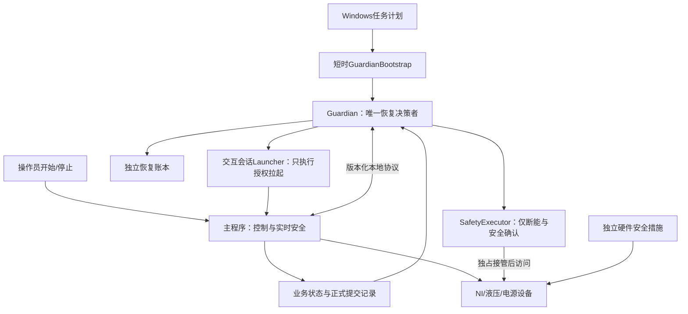

# WJ-EPB 独立监督与主程序解耦实施方案

日期：2026-09-12。状态：架构设计，待实现及验证；不是当前版本已具备的能力。适用项目：10243-028及其同类EPB试验。本文不执行部署、不改变现场试验、计数或安全门限。

## 1. 设计结论

采用独立的 **EpbGuardian监督产品**，由Windows任务计划启动和维持；主程序只承担试验执行、实时保护和数据保存。恢复决策、恢复预算、跨进程接管及恢复验收统一归Guardian。主程序不能安装、关闭、升级或维持Guardian。

解耦目标是：代码可独立构建、进程故障不互相带走、安装升级独立、状态各自单写、通过版本化协议协作。**不承诺零交互，也不承诺任何故障下永不停机。** 无交互就无法可靠区别人工停止、目标完成和异常停测；安全条件不成立时必须停机，而不是为了无人值守强行通电。

本方案保留用户认可的关闭行为：运行、启动或自动恢复期间拒绝关闭；人工停止且当前事务安全确认完成后快速关闭可见界面，后台完成落盘。监控关闭保留主界面；主界面关闭保留外部监督。人工停止后的后台任务不受固定3/30秒强杀限制。

### 1.1 可检验的“彻底解耦”

| 维度 | 设计要求 | 验收方式 |
| --- | --- | --- |
| 构建 | Guardian不引用主程序、Controller、窗体或数据写入实现；协议用文档/schema定义，不共享业务程序集 | 移除主程序源码，Guardian仍可构建并通过协议测试 |
| 生命周期 | Guardian不是主程序子进程，不归主程序退出清理范围 | 主程序退出、卡死、人工关闭均不结束Guardian |
| 安装 | 独立目录、配置、日志、任务名、版本及卸载记录 | 单独升级主程序不重装Guardian；兼容性不符明确拒绝自动续测 |
| 状态 | Guardian单写恢复账本，主程序单写业务状态/提交记录；不互改内部文件 | 并发与崩溃测试证明无双写、无旧记录覆盖新代 |
| 故障 | Guardian不依赖主程序回调执行监督循环；主程序实时安全不依赖Guardian及时响应 | 任一进程挂起，另一方仍执行自身职责 |
| 替换 | 模拟执行器可替代主程序；协议一致的新主程序可接入 | 同一验收套件对模拟器和真实程序验证 |

## 2. 本次设计解决的问题与边界

依据此前全备份复核：旧版归并出21个退出请求/退出确认窗口，15个窗口含液压采样过期；恢复还遭遇身份摘要比较、回执竞争、执行代冲突。当前候选仍需验证恢复发布中间态与纯安全交接许可约束。详见[全备份复核报告](2026-09-12_WJ-EPB_2.14.2.11全备份故障复核与无人值守评估.md)。这些结论不表示所有底层停顿来源已经确定。

| 故障 | 新架构的作用 | 仍需单独解决 |
| --- | --- | --- |
| 主程序退出或卡死 | 外部发现、排他接管、安全确认、从提交检查点续测 | 驱动卡死及无法独立断能不能由重新启动解决 |
| 部分卡钳停滞，进程仍活着 | 逐通道业务监督、有期限的局部恢复与升级 | 真实硬件永久故障必须停机并通知 |
| 主程序自身恢复状态打架 | 单一外部恢复决策者，主程序只执行有身份的命令 | 迁移前旧状态机仍需测试，不能直接保留两套权威 |
| 人工停止后又被拉起 | 持久停止记录、撤销代次、失联默认不续测 | 停止记录无法保存时必须禁止新动作，不能仅弹提示后继续 |
| 采样/写盘秒级停顿 | 有界诊断并安全恢复，提高故障可处置性 | 首发稳定性仍需定位DAQ、锁、调度、GC和存储延迟 |
| Windows死机、断电、内核或同机资源耗尽 | 软件监督本身也可能失效 | 依赖独立硬件安全能力；若要求监督不断线，应另设外部设备，不能声称同机进程能覆盖 |

当前仓库规则还记录了远程诊断对象深层序列化造成资源耗尽的事故。这里将其作为采证工具的资源隔离要求，不用它反推解释此前所有旧版故障。

## 3. 推荐组成：一个恢复权威，有限执行组件



以上是逻辑角色，不要求全部常驻。Guardian与Bootstrap属于一个独立产品；Launcher在指定用户登录后待命；SafetyExecutor仅在需要接管时执行。Launcher和SafetyExecutor都没有自主恢复预算，也不能自行批准续测。

**不建议把硬件驱动、复杂日志解析和数据库扫描加载进Guardian核心进程。** 驱动或诊断调用若挂死，不应拖住监督计时。必要的读取放到有资源限额的短时worker，Guardian只接收有界结果。

### 3.1 主程序保留与移出的职责

- 保留：高频采集、实时联锁、断能、正常控制、学习算法、数据保存、单个设备重建动作，以及用户界面。
- 移出：自动重试次数决策、跨进程恢复授权、主进程替换决策、恢复成功的最终认定、独立监督组件生命周期管理。
- 主程序发现故障立即采取现有安全动作，不等Guardian；随后报告事件。自动恢复动作由Guardian授权，主程序以幂等命令执行并反馈。
- Guardian失联时停止接收新的自动恢复命令；短暂失联是否允许既有正常周期完成，由台架验证后的有界执行许可决定。到期在定义的安全边界停机，实时保护始终有效。
- 该许可约束增加的是监督可用性要求，不能把网络/IPC偶发抖动设为过短的全停触发器。

## 4. Windows启动与兜底安排

### 4.1 任务计划的唯一作用

计划任务只运行短时 `GuardianBootstrap.exe ensure-running`，核验指定Guardian实例并在缺失时启动它；不扫描主程序决定续测，不直接拉起试验。建议开机触发并每60秒检查一次，60秒是待台架验证的监督进程恢复预算，不是电流/压力保护时限。

- 任务设置多实例策略IgnoreNew，Bootstrap另用机器范围互斥量消除并发启动。IgnoreNew只限制同一任务实例，不能代替Guardian本身的单实例约束。[Microsoft任务多实例策略](https://learn.microsoft.com/en-us/windows/win32/api/taskschd/ne-taskschd-task_instances_policy)
- Bootstrap单次建议不超过10秒；Guardian进程身份包括路径、PID、启动时间、机器启动标识和实例ID，不按进程名批量终止。
- 必須验证任务进程退出后Guardian仍存活，且不受任务执行时间限制连带结束；这一点以jxcq安装态测试为准，不能仅凭配置推断。
- Guardian输出独立、有界的进展记录。连续多次过期时，Bootstrap可核验身份后替换失效Guardian；新Guardian先重建权威和现场状态，不能直接恢复试验。
- 任务暂停、维护模式或卸载时，先持久记录禁启，再移除触发器。不能让卸载过程被Bootstrap当成故障修复。

若上述脱离生命周期在目标环境无法可靠验证，采用“任务计划仅确保Guardian Windows服务运行”的宿主方式；恢复协议与核心逻辑不变。两种方式只能选一种激活，不叠加两套启动权威。

### 4.2 无人登录问题必须明确

后台系统上下文不能直接承担WinForms交互桌面。Windows服务与用户桌面存在Session 0隔离，需要明确的用户会话交互路径。[Microsoft交互式服务说明](https://learn.microsoft.com/en-us/windows/win32/services/interactive-services)

近期方案：Guardian在后台独立运行；指定试验账户登录后，由该用户会话中的Launcher启动主程序。锁屏、RDP断开、注销分别测试；**没有合适会话时进入WaitingForSession并告警，不声称恢复成功，也不擅自配置自动登录。**

如果验收要求“机器重启后即使无人登录也自动续测”，终态必须将试验执行引擎从WinForms窗体生命周期中拆出，形成经NI及设备SDK验证的无界面执行器，UI成为可选客户端。这是后续独立阶段，不应在第一轮恢复迁移中同时大改控制引擎。

## 5. 最小交互协议：共享事实，不共享内部状态机

采用带ACL的本机命名管道传输命令和应答；持久化文件用于崩溃重建与审计。禁止靠模拟鼠标点击“开始”续测，禁止读取私有对象或修改主程序内部配置解除故障。

| 记录/命令 | 最小内容 | 写入权威 |
| --- | --- | --- |
| Hello/Capabilities | 协议版本、产品身份、会话、支持的安全/恢复能力 | 各组件自身 |
| RunIntent | RunId、IntentRevision、期望通道、目标、配置摘要、自动续测开关 | Guardian；人工停止另有优先持久记录 |
| ManualStop记录 | RequestId、RunId、ExecutionEpoch、StopRevision、操作时间 | 主程序追加；Guardian消费并确认，不可删除掩盖 |
| RuntimeSnapshot | 实例身份、单调序列、每路状态、动作进展、故障、最后提交ID | 主程序，单一快照发布者 |
| FaultNotice | IncidentId、通道/液压/DAQ影响组、触发类别、安全动作结果 | 主程序 |
| RecoverCommand | CommandId、RunId、Epoch、IncidentId、FenceToken、范围、期限 | Guardian |
| CommandResult | 原命令身份、Accepted/Executing/Completed/Rejected、证据引用 | 执行组件 |
| SafetyReceipt | SafetyOnly或RecoveryPreparation、停止事务、通道/组、当前样本与断能证据 | SafetyExecutor或经验证的当前执行器 |
| CommitProgress | 通道、正式提交序号、检查点、波形清单、校验与持久化状态 | 主程序数据层 |

协议首版即规定：消息大小上限、必填字段、未知字段处理、命令幂等性、乱序拒绝、版本兼容矩阵。建议单消息不超过64KiB、每次快照固定通道数；大日志不走命令通道。摘要按合法SHA-256字节语义比较，不能区分十六进制大小写。

Guardian恢复账本单写，带序号和完整性校验，原子发布快照；重要意图先可靠持久化再应答。主程序不能改Guardian的恢复代次。账本损坏/缺失、配置身份不符、版本不兼容时允许诊断和安全收尾，拒绝自动续测。

不要求消息传输“恰好一次”；使用至少一次投递与命令去重。对硬件动作不能仅靠CommandId宣称恰好一次，重复/不确定动作必须通过实际设备状态和周期检查点调和。

### 5.1 人工停止与崩溃竞态

1. 点击停止立即在当前执行器锁存禁止新动作，并启动安全停机；写停止记录与通知Guardian同时推进，不因IPC故障延误断能。
2. 停止记录持久化成功后才显示“续测授权已撤销”；失败时显示明确故障，并保持本进程禁止新动作。
3. 恢复命令在接受、取得硬件权及首次上电前均重新校验停止记录、RunId和Epoch。
4. 若点击后发生整机断电，且停止记录尚未持久化，单机软件无法保证外部知道该点击。出现未确认停止/授权状态时采用禁止续测策略；如要求跨断电严格保留每次停止，需要独立持久输入或硬件停测锁存。
5. 再次人工开始建立新的执行代，明确确认运行意图，旧停止凭证和旧恢复命令不能作用于新代。

因此不会承诺“只写一个文件就绝无人工停止复活”。必须把写入失败、断电和迟到命令纳入验收。

## 6. 单一恢复状态机

```mermaid
stateDiagram-v2
    [*] --> Reconcile
    Reconcile --> Observing: 已确认唯一现存执行器
    Reconcile --> Inhibited: 意图或安全状态不明
    Observing --> LocalRecovery: 可恢复故障
    LocalRecovery --> Verifying: 执行动作完成
    LocalRecovery --> SafetyTakeover: 超期或进程失效
    SafetyTakeover --> Launching: 断能确认且独占权成立
    Launching --> Verifying: 新执行代完成重建
    Verifying --> Observing: 每路业务恢复验收通过
    Verifying --> Backoff: 业务未恢复
    Backoff --> SafetyTakeover: 预算允许且意图仍有效
    Backoff --> Inhibited: 熔断或不可恢复
    Observing --> ManualStopped: 人工停止
    LocalRecovery --> ManualStopped: 人工停止
    SafetyTakeover --> ManualStopped: 人工停止
    Launching --> ManualStopped: 人工停止
    Verifying --> ManualStopped: 人工停止
    ManualStopped --> Observing: 新的人工开始完成
```



图中简化省略的状态也必须响应人工停止；ManualStopped可继续安全收尾和保存，不能继续恢复上电。Guardian重启总从Reconcile进入，不能把账本中旧的Launching直接当成需要再启动一个进程。

### 6.1 部分故障优先局部处理

按实际共享关系建立影响图：通道→液压组→DAQ设备→供电资源。单路故障仅在资源可隔离且其他通道安全时局部恢复；组级故障覆盖该组；双卡/全局资源异常再全局处理。不能把“保证其他路不停”置于共享安全条件之上。

登记恢复时一次发布IncidentId、范围、阶段和序号，消除“计数已加但身份未发布”的中间态。短时登记必须有已知owner和期限；真正无人负责或无进展仍触发接管。

### 6.2 判定与时间预算

以下是软件验收起始配置，**不是修改现有电流、压力或样本有效性门限**。最终数值根据台架正常P99.9阶段耗时和安全边界确定。

| 项目 | 初始方案 | 超期处理 |
| --- | --- | --- |
| 主程序状态发布 | 1秒一次，Guardian本地单调时钟计龄 | 5秒无新序列进入Suspect；结合进程与业务证据，不立即强杀 |
| 正式逐通道无进展 | 按配方阶段上界+测得余量配置 | 排除禁用、完成、人工停止后生成故障；禁止统一5秒判断一圈超时 |
| 自学习与重建 | 分阶段期限与进展计数 | 有进展可在总期限内继续；同一进展重复不能无限延期 |
| 同进程恢复 | 每Incident初始最多2次，策略按原因分类 | 失败转安全接管，非无条件反复StopAll |
| 跨进程替换 | 初始滚动30分钟最多3次 | 熔断并持久告警；具体预算需仿真及台架批准 |
| 成功清除失败状态 | 所有应恢复通道连续3个正式有效提交，再观察10分钟 | 期间同源复发保留滚动预算，不因进程启动清零 |
| 安全确认 | 沿用当前有效性与安全门限，按设备批准期限 | 不成立就禁止上电；不能以重启预算替代安全许可 |

时钟回拨不延长进程内期限；跨系统重启重新调和，不把旧单调时间戳用于新开机周期。熔断预算和告警跨Guardian重启保留。

## 7. 独立安全接管与硬件所有权

这是可行性验证的第一道门槛。**目前不能假定NI/液压/电源支持两个进程同时访问，也不能假定关闭进程就自动断电。**

执行顺序：撤销旧执行许可→请求正常断能及释放→确认实际输出安全→证明旧进程/设备owner退出→取得独占硬件权→用新鲜样本复核→批准新代重建。每一步有独立证据；进程已死不等于机械系统安全。

如果旧进程卡死并持续持有驱动：只有经台架验证的独立断能路径才能先保证安全，再进行精确进程终止与设备重建。若不存在该路径，本方案的能力上限是“发现故障并告警、等待人工安全处理”，不得标为全自动恢复通过。

FenceToken用于防止合作软件中的旧命令继续执行，但不等于硬件能识别令牌。对无法响应撤权的旧进程，必须依靠设备独占、物理断能或独立安全控制措施；不能仅靠命名互斥量宣称消除了双控。

SafetyExecutor只有断能/泄压/读取安全反馈的能力，不批准试验、不增加计数。其SafetyOnly模式不要求恢复许可；RecoveryPreparation完成也只产生安全证据，Guardian仍须复核意图才能批准启动。主程序保护门限及采样有效性规则不放宽，不使用显示初值或过期零值证明安全。

## 8. 数据保存与真正的恢复成功

恢复检查点以正式持久提交为准，分别记录机械动作序号、有效试验圈、数据提交序号，不能把三者混成一个计数。进程崩溃时可能存在“动作完成但提交未完成”，必须记为不确定周期，执行调和而非悄悄补圈或重置计数。

主程序数据层负责可重放日志/暂存及幂等提交，Guardian只验证，不写业务库。崩溃窗口验证覆盖：动作前、动作后、波形写入后、索引提交前后；业务唯一键至少绑定RunId、通道、周期身份，防止重复提交。若现有数据层不能保证该恢复协议，需要单列数据层改造，不用外部重启掩盖数据缺口。

正常人工关闭的后台保存仍独立于窗体生命周期；收尾完成前禁止新执行器争用旧数据资源。异常进程被终止时，内存尾段不能保证保存，必须依靠事先设计的持久暂存；不能承诺强杀后零丢失。

外部验收同时核对：

1. 每个应恢复通道出现新的实际控制/测量证据，不能只有状态字段；
2. 同一Run下业务计数连续推进，目标已完成通道单列；
3. 对应正式提交及波形文件实际存在，短时只读校验通过；
4. 每路连续3圈，无未解释缺口、重复提交及旧代迟到动作；
5. 旧Incident和资源owner有明确终态。

普通快照用于低成本监测；数据库/文件复核通过有期限的只读worker抽样进行，禁止每秒全库扫描。确需独立证明物理动作，必须有可信采集反馈；软件自报不足以证明传感器本身正确。

## 9. 外部程序自身不能成为新的故障源

- Guardian循环不执行全量备份、压缩、dump或深层对象序列化；证据采集为低优先级短时worker。
- 初始预算：核心Private Bytes目标≤128MiB；诊断worker≤256MiB、单次≤30秒、结果≤1MiB。属于验收目标，超预算先保留小型证据并结束本worker，不凭内存阈值强杀主程序。
- 日志建议固定总预算256MiB并轮转，核心内存队列有界；磁盘满不丢失人工停止语义，无法可靠保存新授权时禁止新启动。
- 使用显式简单字段；兼容Windows PowerShell 5.1，禁止Provider/反射对象深层ConvertTo-Json。脚本不依赖本机PowerShell 7特性。
- 清理核验PID、启动时间、任务归属；远程会话记录ShellId并确认真正释放，不按名称批量结束进程。
- Bootstrap替换Guardian后，旧Guardian的FenceToken不能再发起有效控制；共享账本写锁不能被新进程强行绕过。
- 任务计划失效、OS资源耗尽与本机断电无法由同一主机保证兜底。独立硬件联锁承担最后安全边界；通知通道另做失效提示，不等同于自动修好设备。

## 10. 安装包、升级及回退

保留既有一键包使用方式，包内区分主程序与监督产品，命名示意如下；未确定新产品版本，不改动现有2.14.2.12-rc.1/rc.2标签。

```text
V<主程序版本>_<源码短哈希>_AUTO_RECOVERY_ONECLICK/
  Base/                       # 主程序及设备依赖
  Guardian/                   # Bootstrap、Guardian、Launcher、SafetyExecutor
  Protocol/                   # schema、兼容矩阵
  automatic-bundle.json
  Install-AutomaticRecoveryBundle.ps1
  RecoveryGuard-Acceptance.ps1
  恢复后台服务.cmd
  检查运行状态.cmd
  启动试验.cmd
  一键安装正式版.cmd
  一键故障采证.cmd
  一键停止全部相关进程.cmd
  一键卸载.cmd
  一键修复.cmd
  自动恢复安装说明.md
```

安装manifest分别记录产品源码、组件SHA-256、协议范围和依赖。归档使用 **7-Zip .7z、LZMA2、-mx=9**，对归档及内容清单附SHA-256，交付前解压复验。

常规主程序关闭不会停Guardian。维护脚本“一键停止全部相关进程”先进入维护禁启并完成安全停机/保存，再清理本产品进程；不允许字面理解为无条件强杀。完整卸载才撤销任务和独立组件，必须核实路径与安装身份，保留试验数据和审计记录。

升级先暂禁新恢复、等待无活动试验/收尾，备份配置与兼容账本，再原子切换。回退必须确认旧版能识别数据/协议；不支持时进入人工模式，不能用删除账本强行恢复。运行中不自动更新。

## 11. 从当前架构迁移：分阶段，避免一次大改

| 阶段 | 交付 | 放行条件 |
| --- | --- | --- |
| A：协议与安全可行性 | schema、状态机、影响图、现有硬件独占/断能实验 | 证明失联后安全接管是否可行；不可行则明确硬件改造或能力降级 |
| B：纯观察Guardian | 独立安装、逐路监测、进程失效检测、资源预算 | jxcq及离线数据回放正确；不具备拉起或写控制能力 |
| C：模拟恢复整链 | 模拟执行器、故障注入、账本重建、人工停止/熔断 | 确定性并发与断电窗口全部通过 |
| D：主程序协议适配 | 保留实时控制，外部授权具体恢复动作，完善提交检查点 | Debug x86与模块回归通过；无需真实现场部署 |
| E：独立台架主动恢复 | 唯一权威切换、真实单路/组级/全局接管 | 六路动作/计数/落盘验收，安全无法确认必拒绝 |
| F：长稳候选 | 24h初验、168h耐久、升级卸载回退脚本 | 故障恢复达标、资源无持续增长、无未解释数据缺口 |
| G：无登录执行引擎 | 控制与窗体再分离、SDK后台兼容验证 | 无用户登录的开机恢复完整通过后才宣称具备该能力 |

迁移期间旧Supervisor/SessionAgent/Watchdog先保留为唯一主动机制，新Guardian只观察。进入主动阶段必须一次性明确权威切换：旧进程替换、预算与授权路径禁用，新Guardian获得权威；旧实时保护继续保留。中间态宁可禁止自动恢复，也不能双权威并行。

已有SafetyAgent和Launcher的可靠实现可审查后复用，但不得搬入旧共享回执竞争和“安全收尾必须带重启许可”的协议。每删除一条旧恢复路径都要有对应新验收，不靠改名完成迁移。

## 12. 必做回归与故障注入

| 场景 | 注入内容 | 必须结果 |
| --- | --- | --- |
| 单路/部分/全部故障 | 采样短断、组压力样本过期、通道runner停滞 | 按实际影响范围恢复；健康独立组不被无理由全停 |
| 主程序崩溃/挂起 | 学习、正式、局部恢复、落盘时点 | Guardian仍工作；安全前置后唯一新代执行 |
| Guardian崩溃/挂起 | 命令发送前后、账本提交前后 | Bootstrap有界恢复；不重复硬件动作、不复活人工停止 |
| 人工停止竞态 | IPC断开、磁盘满、许可在途、首次上电前、断电 | 停止优先；不确定状态禁止续测 |
| 并发及身份 | 双Bootstrap、双Guardian、PID复用、旧Epoch、摘要大小写 | 单权威；旧命令拒绝；合法同摘要不误拒绝 |
| 局部恢复升级 | 固定登记中间态、同进程失败 | 不误判合法登记；真实超期转跨进程恢复 |
| 纯安全收尾 | 无恢复许可、已人工停止、SafetyOnly重放 | 可安全收尾，不得拉起试验 |
| 保存 | 延迟超过30秒、锁、磁盘满、崩溃重放 | 不强杀正常后台收尾；重复/缺失周期能核对 |
| 物理安全 | 电流超限、压力未释放、反馈失效、驱动占用 | 拒绝上电，保留原因并告警 |
| 熔断 | 短期反复复发、Guardian/机器重启 | 预算不清零，不无限循环拉起 |
| Windows会话 | 锁屏、RDP断开、注销、无登录、开机 | 能力符合4.2；不在不可见错误会话假报续测 |
| 安装维护 | 双击、中文/空格路径、PS5.1、修复、卸载、回退 | 幂等、身份准确、禁启有效、不动业务数据 |

构建：`msbuild TfTest.sln /p:Configuration=Debug /p:Platform=x86`。回归覆盖AdaptiveControl、EpbDiskWriter、PowerSupplyDebugger、RecoveryGuard、停止/Watchdog及新增协议套件；报告逐项命令、源码、结果和未覆盖项，不沿用旧通过数冒充新结果。

jxcq负责安装态、窗口、后台生命周期、脚本兼容性及模拟设备；没有同型号真实硬件时不认定物理接管通过。WJ-EPB正在运行的试验不作为故障注入对象。

## 13. 最终验收与决策

验收报告按每Incident记录RunId/Epoch、受影响通道、安全证据、旧进程释放、新代身份、每路首个正式提交、连续三圈、恢复耗时及残余数据。统计可恢复故障成功率、最大无业务进展时长、未解释退出、数据缺口和资源趋势；人工停止、目标完成、永久硬件故障单列。

发布门槛：上述矩阵必测项全部通过；无法完成安全接管、人工停止仍可能被已知路径覆盖、存在双权威、数据无法调和任一项未闭环，均不能交付为“无人值守自动恢复版”。168h通过只证明已测条件，不证明永不出错。

**建议先实施A、B、C三个阶段，确认安全可行性和协议正确，再改造主程序接入。** 主程序稳定性定位同步进行；不要先堆加一个定时重启任务，再用现场长期试验寻找授权与安全漏洞。

本轮交付仅为方案文档；未新增任务计划、进程、恢复组件或安装包，未执行远程检查。本方案后续实施的正式文档放修复工作树docs，临时脚本和证据统一放仓库根Codex。
