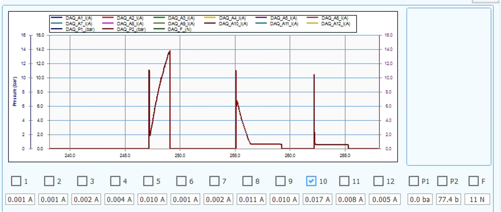

# EPB 卡钳堵转未重复报警及齿轮损坏问题

## Issue 信息

| 项目 | 内容 |
|---|---|
| Issue 日期 | 2026-07-28 |
| 项目/试验名称 | `10364-009` |
| 现场软件版本 | `V1.2_1`（Git 标签 `1.2_1`） |
| 问题级别 | **严重/高风险**：存在样件损坏及保护链路失效风险 |
| 涉及通道 | 试验启用 EPB8、EPB9、EPB10、EPB12；3个损坏样件暂按 **疑似 EPB8、EPB9、EPB12** 跟踪 |
| 当前状态 | **整改后待台架验证** |
| 原始数据 | `\\wj-epb\EPB_Data\10364-009`；本地核查副本：`D:\EPB_Data\260727\10364-009` |
| 原始软件备份 | `\\wj-epb\debug\1.2_1` |
| 客户反馈日期 | 2026-07-27 |

> **结论摘要：** 已确认 `V1.2_1` 的批量启动路径未复位报警停机锁存。通道首次报警后，同一进程内再次批量启动时，后续报警会被旧锁存去重，报警停机、UI/硬件报警和报警快照流程均可能不再执行。现场台架采用4台单输出程控电源分别驱动3个 EPB，配置中的组内错峰 `800 ms` 未被 `V1.2_1` 批量启动代码采用，实际相位间隔为 `350 ms × 组内序号`。同步支路波形显示电源3所带 EPB8、EPB9 曾出现约20 A的合计电流平台，与共享电源进入总电流限制的机理高度一致，但现场 `ISET`、输出电压及 CV/CC 状态未留档，限流只能列为高可信促成因素，不能写成已确认最终根因。“3个样件齿轮损坏”的最终机械因果关系仍需电源回读、通道对应、DO实测和拆检记录闭环。

## 1. 问题现象

客户反馈3个 EPB 卡钳上电后均出现异响、无法夹紧。客户分析意见为：卡钳经历长时间堵转，最终造成样件齿轮损坏，并要求排查设备是否存在“卡钳长时间堵转但未报警”的问题。

现场试验配置启用了 EPB8、EPB9、EPB10、EPB12 四个通道。现有资料尚未提供3个损坏实物与通道号的一一对应关系，因此本 Issue 暂将 EPB8、EPB9、EPB12列为疑似损坏通道，不把该对应关系作为已确认事实。

## 2. 影响与风险

- **样件风险：** 堵转电流低于夹紧断电判据时，单次正向驱动可持续至超时上限；若报警锁存未复位且试验被反复重启，可能形成周期性重复堵转并累积齿轮、传动轴和电机热损伤。
- **设备保护风险：** 后续报警被旧锁存去重后，报警停机、报警输出和报警快照不能形成完整闭环，操作员可能无法及时识别故障。
- **共享供电风险：** 同一单输出程控电源所带通道峰值重叠时，总限流可能引起输出电压下降和支路电流竞争，使多个通道均达不到提前断电阈值，却持续承受较高电流。
- **数据可信度风险：** SQLite 中绝大多数圈次被错误标记为 `alarm`，历史状态不能直接用于统计真实报警次数、成功率或定位首次故障圈。
- **追溯风险：** 旧版 CSV 存在文件名圈号与文件内 `Cycle` 字段不一致的情况，必须结合时间戳、日志和原始波形交叉核对。

## 3. 现场配置与运行规模

现场保存配置 `Config\TestConfig.xml` 的关键参数如下：

| 参数 | 现场值 | 风险含义 |
|---|---:|---|
| 启用通道 | EPB8、EPB9、EPB10、EPB12 | 共4个通道参与耐久试验 |
| 目标圈数 | 100,000 圈/通道 | 长周期耐久试验 |
| 试验周期 | 15 s | 正常情况下每15秒进入下一圈 |
| 正向夹紧阈值 `ForwardA` | 15 A | 正向夹紧判据基准 |
| 安全裕量 `SafetyMarginA` | 2 A | 电流达到约13 A即可提前断电 |
| 正向上电上限 `FwdOnLimitMs` | 3,000 ms | 未达到阈值/平台时的单次等待上限 |
| 保持时间 `HoldMs` | 5,000 ms | 正向结束后的保持阶段 |
| 反向刚性衰减上限 | 3,000 ms | 反向释放阶段保护参数 |
| 反向固定空行程 | 4,000 ms | 反向释放固定时序 |
| 电源分组 | 4组，每组3通道 | 单台单输出电源同时承载最多3个 EPB 支路 |
| 配置组内错峰 | 800 ms | `V1.2_1` 实际未读取，不能视为现场有效相位 |

截至数据副本最后更新时间，各通道数据库圈号约为17,154～17,161圈。由于状态字段已受报警锁存污染，该数字仅用于描述数据规模，不代表有效成功圈数。

## 4. 事件时间线

| 时间 | 事件 | 证据/说明 |
|---|---|---|
| 2026-07-24 13:07:50 | 准备启动 EPB8、9、10、12，自学习10圈 | `log\ui-info.log` |
| 2026-07-24 13:10:27 | 批量启动完成 | 四通道进入运行 |
| 2026-07-24 13:10:33 | EPB9、EPB12 报警 | `ClampTimeout Thr=15.00A` |
| 2026-07-24 13:10:48 | EPB10、EPB8 报警 | `ClampTimeout Thr=15.00A` |
| 2026-07-24 13:25:13 | 再次批量启动四通道 | `V1.2_1` 批量路径未清除上次报警锁存 |
| 2026-07-27 08:55～15:24 | 多次停止、批量重启及单通道尝试 | EPB8、EPB9、EPB12 未形成新的独立报警日志/快照 |
| 2026-07-27 16:54:18 | EPB10 单通道报警 | 生成报警快照 |
| 2026-07-27 16:59:33 | EPB10 再次报警 | 生成报警快照 |
| 2026-07-27 18:26:33 | EPB10 再次报警 | 生成报警快照 |
| 2026-07-27 | 客户反馈3个卡钳异响、无法夹紧 | 客户判断为堵转导致齿轮损坏 |

时间线表明：四通道在首次批量运行时均触发过 `ClampTimeout`，说明系统能够识别首次故障；问题集中在报警后重新批量启动时，旧报警锁存未复位，导致后续同通道报警被抑制。

## 5. 数据证据

### 5.1 SQLite 状态分布

对 `index.db` 中 `epb_cycles` 表进行只读统计：

| 状态 | 记录数 | 占比 |
|---|---:|---:|
| `alarm` | 68,611 | 99.981% |
| `running` | 8 | 0.012% |
| `completed` | 5 | 0.007% |
| **合计** | **68,624** | **100.000%** |

正常耐久试验不可能在仅5条完成记录的情况下继续累计约17,000圈/通道。结合代码可确认：报警锁存一旦残留，后续圈结账持续把通道视为报警状态，造成数据库状态大面积污染。因此：

1. `alarm=68,611` **不代表现场真实发生了68,611次报警**；
2. 数据库状态不能单独用于判断报警首次发生时间、重复次数或成功率；
3. 真实报警必须以 `ui-info.log`、报警快照文件和波形共同确认。

### 5.2 故障窗口波形

对 2026-07-27 多个现场 CSV 进行只读统计，得到以下代表性窗口。三个窗口的文件目录时间集中在15:19～15:20，但 CSV 内部采样时间实际分布于14:34～15:05；目录时间更接近批次导出或停止时间，不能作为波形发生时间。

| 通道 | CSV 内采样时间 | 观测窗口 | 电流特征 | 初步判断 |
|---|---|---:|---:|---|
| EPB8 | 15:05:12.247～15:05:14.993 | 2.746 s | 10.270～10.280 A，均值约10.276 A | 明显平坦的持续高电流平台，低于约13 A提前断电阈值 |
| EPB12 | 15:01:30.994～15:01:35.416 | 4.422 s | 10.373～10.469 A，均值约10.393 A | 明显平坦的持续高电流平台，存在堵转/限流平台特征 |
| EPB9 | 14:34:15.701～14:34:18.813 | 3.112 s | 峰值约14.794 A，均值约7.222 A | 电流已接近或越过有效断电区间，需结合方向和DO时序复核 |

EPB8、EPB12 的电流平台明显高于正常空载电流，但又低于 `15 A - 2 A = 13 A` 的提前断电判据。如果自学习得到的空载基准未正确生效或平台判据未建立，软件会等待到正向3秒超时，形成单次持续堵转风险。

> **重要限制：** 上表“观测窗口”是 CSV 中连续高电流样本的时间跨度，不等同于经过独立测量确认的正向 DO 实际吸合时长。尤其 EPB12 的4.422秒窗口超过配置的3秒正向上限，可能包含学习阶段、相邻控制阶段、导出边界或圈号错配影响。最终结论必须通过 DO 物理通断记录与电流波形同步验证。

### 5.3 共享程控电源与组内电流竞争

台架采用4台程控电源、每台并联控制3个 EPB 支路。现场配置的电气分组及本项目启用情况如下：

| 电源组 | 通道 | 本次启用通道 | 同组并发风险 |
|---|---|---|---|
| 电源1 | EPB1～EPB3 | 无 | 本次事件未启用 |
| 电源2 | EPB4～EPB6 | 无 | 本次事件未启用 |
| 电源3 | EPB7～EPB9 | EPB8、EPB9 | 两个高电流阶段可能重叠 |
| 电源4 | EPB10～EPB12 | EPB10、EPB12 | 两个高电流阶段可能重叠 |

#### 5.3.1 配置值与实际启动相位

现场 `TestConfig.xml` 的每个 `ElectricalGroup` 均配置 `StaggerMs=800`。但 `V1.2_1` 批量启动路径使用硬编码 `StaggerDeltaMs=350`，相位计算为：

```text
phase = IndexInPowerGroup(channel) × 350 ms
```

该路径未读取 `ElectricalGroups/StaggerMs`。因此实际预期相位为：

- 电源3：EPB7=0 ms、EPB8=350 ms、EPB9=700 ms，EPB8与EPB9仅相差350 ms；
- 电源4：EPB10=0 ms、EPB11=350 ms、EPB12=700 ms，EPB10与EPB12相差700 ms。

CSV 中观测到 EPB8→EPB9 主要电流脉冲约错开320～355 ms，EPB10→EPB12约错开680～715 ms，与上述代码相位一致。即使800 ms配置真正生效，当某支路高电流阶段持续数秒时，固定延时仍不能保证峰值完全不重叠。

#### 5.3.2 同组支路同步统计

对同一批次 CSV 按1 ms时间桶对齐，并取每通道桶内绝对电流最大值后求和：

| 电源组 | 对齐通道 | 同时≥5 A | 最大支路电流和 | 约20 A平台 | 证据判断 |
|---|---|---:|---:|---|---|
| 电源3 | EPB8+EPB9 | 4,068 ms桶 | 21.146 A | 14:33:32.255～14:33:32.291，19.970～19.973 A，约37 ms | 与约20 A总限流/恒流平台高度一致 |
| 电源4 | EPB10+EPB12 | 15 ms桶 | 16.294 A | 未观察到 | 当前窗口不支持同等强度的20 A削顶判断 |

电源3所带 EPB8、EPB9 在14:33:32.014的支路电流和达到约21.146 A（EPB8约11.809 A、EPB9约9.337 A）。其后出现约20 A的短时平坦合计电流。由于没有同步记录电源自身输出电流、输出电压及 CV/CC 状态，该结果只能证明“支路波形与总限流机理高度一致”，不能证明电源当时一定设置为20 A或已经进入 CC 模式。

#### 5.3.3 风险机理

PSW 30-72 是单输出电源。若三个负载支路并联在同一输出上，电源限流约束的是支路电流之和，而不是每个 EPB 的独立电流。多个电机峰值重叠且总需求超过 `ISET` 时，电源可能降低输出电压并进入恒流状态；支路电流再由电机反电势、绕组和线束阻抗、触点压降及机械负载共同分配，不保证平均分流。

因此可能出现：多个通道均维持显著高于空载的电流，但单通道都无法稳定达到 `15 A - 2 A = 13 A` 的提前断电判据，最终等待至3秒超时。若现场 `ISET` 确为仓库配置线索所示的20 A，则两个通道同时各需13 A时总需求已达26 A，三个通道为39 A；20 A无法为这种并发需求提供容量保证。该计算是条件性容量说明，不能反推现场实际设定值。

专项分析、现场核验方法及设计原则见：[PSW 30-72 程控电源共享供电与电流竞争分析](../PSW30-72程控电源共享供电与电流竞争分析.md)。

### 5.4 报警快照

`AlarmSnapshots` 在 2026-07-27 仅确认 EPB10 存在3个独立报警目录：

- `20260727_165418-EPB10`
- `20260727_165933-EPB10`
- `20260727_182633-EPB10`

每个目录均包含 `EPB10_ALARM` 下的 CSV/BIN 文件。当天未发现 EPB8、EPB9、EPB12 对应的新报警快照，这与“批量重启后旧报警锁存未复位、重复报警被去重”的代码行为一致。

### 5.5 辅助现场画面



该画面用于说明现场存在持续电流与多次驱动波形，不作为 DO 实际吸合时长、损坏通道或机械根因的唯一证据。

## 6. 代码证据

### 6.1 V1.2_1 的报警去重逻辑

`V1.2_1` 在 `Controller/EpbManager.cs` 中使用 `_alarmStopRequested` 保存通道报警停机状态：

1. `OnRunnerAlarmRaised` 通过 `_alarmStopRequested.TryAdd(channel, 0)` 去重；
2. 如果该通道已存在锁存，方法立即返回；
3. 提前返回后，不再执行 `ChannelAlarmRaised`、`StopChannelOnAlarm`、硬件报警输出和报警快照导出。

普通单通道 `StartChannel` 会执行 `TryRemove` 复位锁存，但当时的批量启动/自学习路径没有等效复位。因此，首次批量报警后再次批量启动，会继承旧锁存。

### 6.2 正向超时并非无限等待

`V1.2_1` 的 `EpbCycleRunner` 使用 `FwdOnLimitMs` 作为正向夹紧等待上限。现场配置为3,000 ms；超时后 Runner 自身会调用高优先级断电并触发 `ClampTimeout`。

因此，当前证据不支持“软件单次指令无限期保持正向上电”的结论。已确认的危险模式是：

1. 单次可在高电流平台持续至约3秒超时；
2. 报警事件因旧锁存被抑制，未形成完整停机/提示闭环；
3. 操作员或批量流程继续重启通道；
4. 多次周期性堵转可能造成累计机械和热损伤。

### 6.3 组内错峰配置未进入批量控制

`V1.2_1` 的 `Controller/EpbManager.BatchStart.cs` 使用硬编码 `StaggerDeltaMs=350` 和 `IndexInPowerGroup(channel)` 生成启动相位，没有读取现场配置中的 `ElectricalGroups/StaggerMs=800`。这会造成：

1. 配置界面或 XML 中的800 ms无法改变实际批量启动间隔；
2. EPB8与EPB9只错开350 ms，高电流阶段容易重叠；
3. 固定相位只控制开始时刻，不能约束前一支路何时真正离开高电流阶段。

共享电源调度应以“同组高电流阶段是否结束”为互斥条件，或以经过最坏工况验证的容量约束控制并发，不能仅依赖固定延时。

### 6.4 整改代码对应关系

后续整改已在提交 `84915f4`（`fix: harden alarm snapshots and disk exports`）中加入：

- 新批次启动时对每个通道执行报警锁存复位；
- 同一次运行仍只处理首次报警，新运行可重新报警；
- 只有当前报警圈 CSV/BIN 文件配对存在时才写为 `alarm`；
- 快照缺失或导出异常时写为 `failed`；
- 增加历史报警状态与文件证据对账工具。

此外，自适应控制整改增加了正反向绝对上电硬时限、堵转/高电流平台、DAQ断流和开路等硬保护。该部分仍需现场台架验证，不能仅凭代码合入视为完成。

## 7. 根因判断

### 7.1 已确认

| 结论 | 置信度 | 依据 |
|---|---|---|
| 批量启动未复位报警停机锁存 | 高/已确认 | `V1.2_1` 代码及后续修复差异 |
| 首次报警后，同通道重复报警可能被直接去重 | 高/已确认 | `OnRunnerAlarmRaised` 控制流 |
| 历史数据库报警状态严重失真 | 高/已确认 | 68,611/68,624 条记录为 `alarm` |
| 现场存在低于有效断电阈值的持续高电流平台 | 高/已确认 | EPB8、EPB12 CSV 波形 |
| 台架按4组共享供电，每组3通道 | 高/已确认 | 台架控制说明及现场 `ElectricalGroups` |
| 800 ms配置未被批量启动采用，实际使用350 ms相位步长 | 高/已确认 | `V1.2_1` 代码、配置与波形相位交叉核对 |

### 7.2 高可信关联

持续约10 A的高电流平台符合堵转或限流平台特征。电源3的 EPB8+EPB9 同步波形还出现约20 A的平坦合计电流，与共享电源总限流造成支路电流竞争的机理高度一致。若该状态在15秒周期内被重复施加数千圈，具有造成齿轮冲击、齿面磨损、电机发热及传动机构失效的充分风险。报警抑制、组内高电流阶段重叠和潜在总限流共同构成高可信促成链路，但后两者尚缺电源侧回读，不能提升为已确认根因。

### 7.3 待验证

- 3个损坏实物是否确实对应 EPB8、EPB9、EPB12；
- 齿轮损坏是重复堵转的直接结果，还是还叠加了装配、负载、供电、液压或样件自身因素；
- 异常窗口内继电器/DO的实际方向、吸合时间和断电响应；
- EPB12 的4.422秒高电流窗口为何超过3秒配置上限；
- 自学习空载电流 `_iEmptyFwdA` 是否为0或异常，导致平台判据没有生效；
- 四台电源的现场序列号、IP和电气分组是否与 XML 完全一致；
- 事件窗口的实际 `VSET`、`ISET`、输出电压、输出总电流及 CV/CC 状态；
- 电源3约20 A支路电流和平台是否由电源限流引起，还是还包含通道标定、时间对齐或负载自身平台影响；
- 报警硬件输出、蜂鸣器配置和现场操作员可见提示是否同时存在其他问题。

## 8. 整改与处置

### 8.1 临时遏制措施

- [ ] 立即停用3个损坏样件并标识、隔离，禁止再次通电。
- [ ] 在整改版本验收前，禁止使用 `V1.2_1` 继续执行 EPB 耐久试验。
- [ ] 对 EPB8、EPB9、EPB12 相关线束、继电器、DO输出和电源回路进行绝缘及粘连检查。
- [ ] 核对四台 PSW 30-72 的型号、序列号、IP、通道分组和实际 `VSET/ISET`，拍照并导出设定/回读作为证据。
- [ ] 在供电容量完成验证前，同一电源组内只允许一个通道处于夹紧或释放高电流阶段。
- [ ] 保全 `index.db`、`index.db-wal`、CSV、BIN、日志、配置和原始软件备份，不直接修改现场原始数据。
- [ ] 建立3个损坏实物序列号与通道号、装配位置、拆检照片的对应表。

### 8.2 软件永久措施

- [x] 新批次和单通道新运行均复位报警锁存。
- [x] 报警快照文件完整后才写 `alarm`，失败写 `failed`。
- [x] 增加报警状态与快照文件证据对账、修复工具。
- [x] 增加正反向绝对上电硬时限及异常高电流平台保护。
- [x] 失败、取消、报警圈不再计为成功圈。
- [ ] 完成报警状态灯/蜂鸣器/弹窗/日志的端到端现场验收。
- [ ] 增加独立 DO 状态或继电器反馈采集，确保“软件发出断电命令”与“负载实际断电”可区分。
- [ ] 将电源分组和错峰参数接入实际调度，启动时校验配置已生效。
- [ ] 增加四台电源的身份、设定值、输出电压/总电流及 CV/CC 状态留档。
- [ ] 同组任一通道发生超时、异常高电流或电源进入异常限流时，执行组级安全停机并形成联动报警证据。

### 8.3 数据处置

- 历史数据修复前必须关闭 EPBTest，并备份 `index.db`；
- 先以只读模式运行 `Tools\repair_alarm_status.py` 和
  `Tools\reconcile_alarm_status_with_files.py`，保存 dry-run JSON 回执；
- 不把68,611条 `alarm` 直接改成 `completed`，应按已审查时间窗口、圈时长及 CSV/BIN 证据逐步修复；
- 不删除或重写原始 `.dat`、CSV、BIN 和报警快照。

## 9. 验收标准

以下项目全部通过后，Issue 才能关闭：

1. **连续重启报警测试**
   - 同一通道连续执行至少3次“启动→注入堵转→报警→重新启动”；
   - 每次均产生新的报警事件、停止动作及独立快照；
   - 不允许旧锁存抑制新运行报警。

2. **堵转与硬时限故障注入**
   - 电流保持在夹紧阈值以下、空载区以上，验证平台堵转保护；
   - 验证正向和反向绝对上电硬时限；
   - 保护触发后不得继续进入下一成功圈。

3. **DO 实际断电验证**
   - 使用示波器、逻辑分析仪或独立 DI 同步记录 DO命令、继电器触点和电流；
   - 每个成功圈仅允许一次正向、一次反向；
   - 故障触发至负载实际断电的延迟满足台架安全要求。

4. **报警联动验证**
   - UI状态、报警日志、硬件报警灯/蜂鸣器和快照同时到位；
   - 当前报警圈必须存在对应 CSV/BIN；
   - 快照失败时数据库状态必须为 `failed`，不得伪记为 `alarm`。

5. **数据一致性验证**
   - CSV 文件名圈号与内部 `Cycle` 字段一致；
   - `completed`、`alarm`、`failed`、`canceled` 与真实执行结果一致；
   - 报警圈不增加成功计数，不遗留无解释的 `running` 圈。

6. **连续运行验证**
   - EPB10 自适应模式单通道连续100圈无异常；
   - 完成后再逐步扩大通道范围；
   - 每次扩大范围前重复堵转、开路、DAQ断流及最长上电故障注入。

7. **机械闭环**
   - 完成3个损坏卡钳拆检报告；
   - 建立损坏形貌与通道波形、运行圈号的对应关系；
   - 由设备、软件、试验和样件责任方共同签署最终根因结论。

8. **共享程控电源验证**
   - 对四台电源分别执行 `*IDN?`、电压/电流设定值与回读、CV/CC状态核验，并保存原始响应；
   - 对每个电源组分别进行单通道、双通道、三通道、强制峰值重叠和组内串行试验；
   - 同步记录电源输出电压、总电流、各支路电流及DO/继电器状态；
   - 不允许任何通道因电流竞争维持高电流至3秒超时；发生供电不足时必须及时识别、组级断电，并完整触发 UI、蜂鸣器、日志和快照；
   - 证明实际调度采用已配置策略，且在最坏工况下不存在未经评估的高电流阶段重叠。

## 10. 证据清单

| 证据 | 路径/标识 | 用途 |
|---|---|---|
| 原始问题记录 | `docs\01_Inboxes\关于3个EPB卡钳损坏的问题-20260728.md` | 客户反馈与任务来源 |
| 现场保存配置 | `D:\EPB_Data\260727\10364-009\Config\TestConfig.xml` | 通道、周期及控制参数 |
| 运行日志 | `D:\EPB_Data\260727\10364-009\log\ui-info.log` | 启停、报警及时间线 |
| 圈次数据库 | `D:\EPB_Data\260727\10364-009\index.db` | 圈次规模和状态质量核查 |
| 报警快照 | `D:\EPB_Data\260727\10364-009\AlarmSnapshots` | 独立报警文件证据 |
| EPB8 代表波形 | `Latest\EPB8\20260727_151951\EPB8_Cycle_017144.csv` | 持续约10.28 A平台 |
| EPB9 代表波形 | `Latest\EPB9\20260727_151951\EPB9_Cycle_017147.csv` | 接近阈值的电流窗口 |
| EPB12 代表波形 | `Latest\EPB12\20260727_151952\EPB12_Cycle_017143.csv` | 持续约10.39 A平台 |
| 同步供电分析批次 | `Latest\EPB8\20260727_143533`；其余通道 `20260727_143534` | 同组相位与支路电流和统计 |
| 台架供电架构 | `epb的控制和数据采集逻辑：.ini` | 12通道、4电源、每电源3通道及错峰要求 |
| 电源 IP 记录 | `开发相关\04_程控电源\2025-6-11 程控电源IP 142804.md` | 四台电源地址线索及重复地址核验 |
| 程控电源专项分析 | `docs\PSW30-72程控电源共享供电与电流竞争分析.md` | 设备能力、竞争机理和验证矩阵 |
| 现场版本代码 | Git 标签 `1.2_1` | 报警锁存和正向超时逻辑 |
| 报警一致性整改 | Git 提交 `84915f4` | 锁存复位、文件证据和状态修复 |
| 整改说明 | `docs\报警与落盘一致性修复说明.md` | 修复范围及验证入口 |
| 自适应控制说明 | `docs\EPB电流自适应闭环控制落地说明.md` | 硬保护、灰度和现场待办 |

---

**关闭原则：** 本 Issue 的软件缺陷可以通过代码、测试和现场联动验收关闭；样件齿轮损坏的最终责任归因必须等待实物通道对应、DO实测和机械拆检三项证据齐全，不以波形相关性代替最终因果结论。
