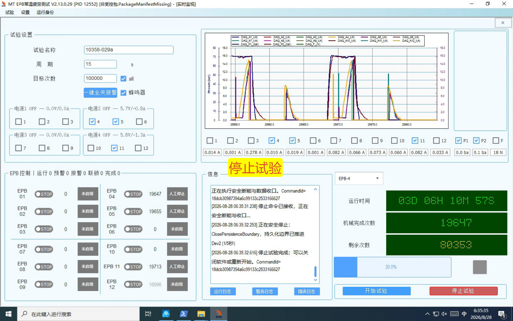
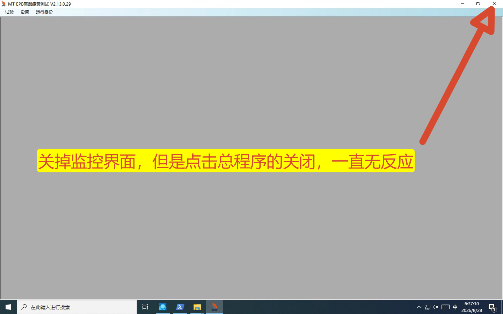
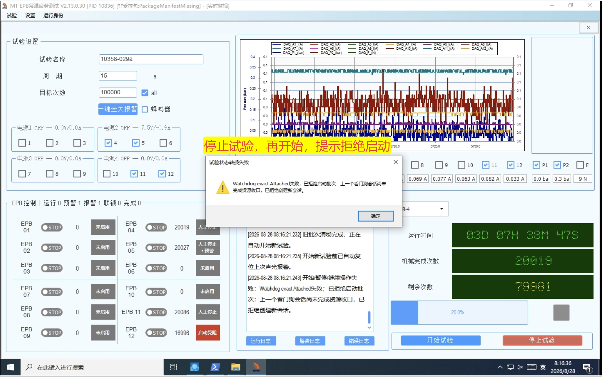
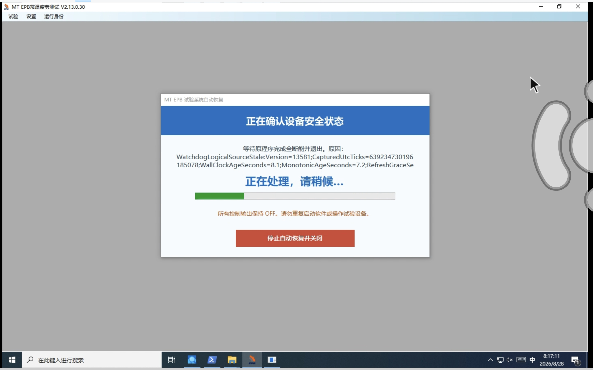
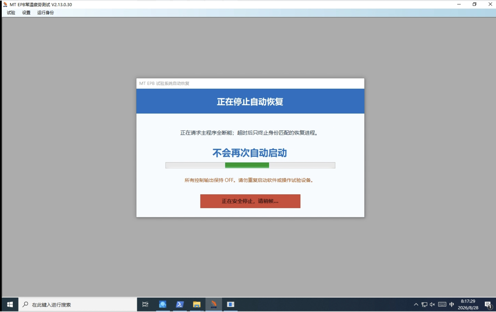
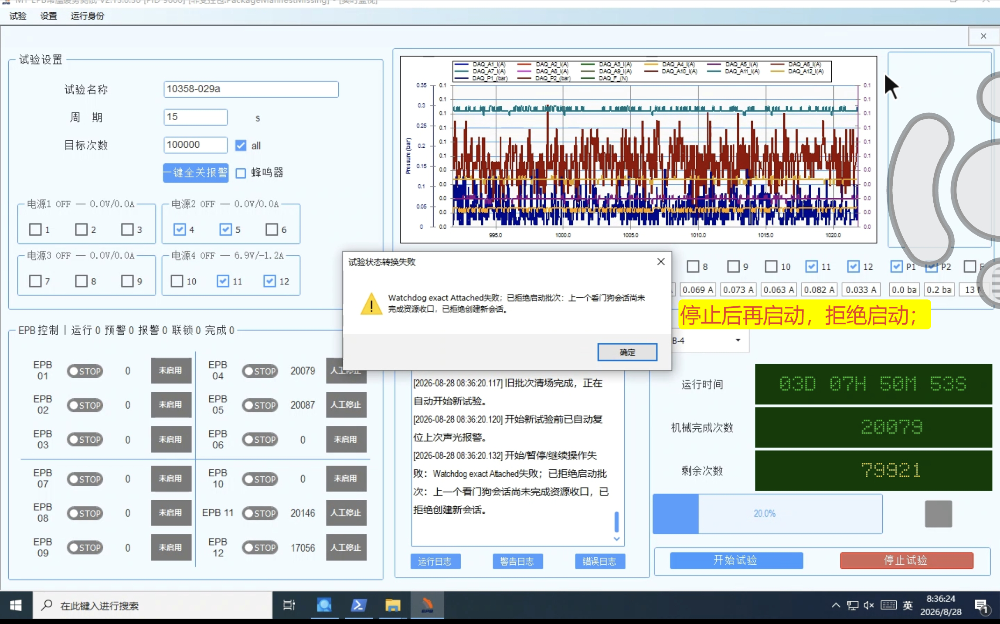
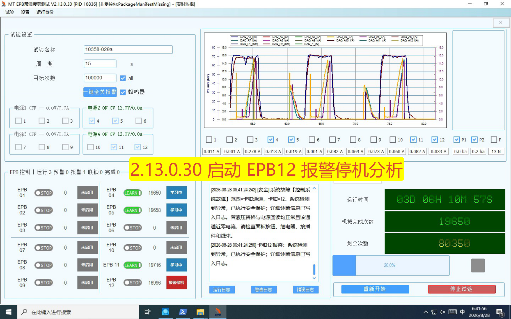
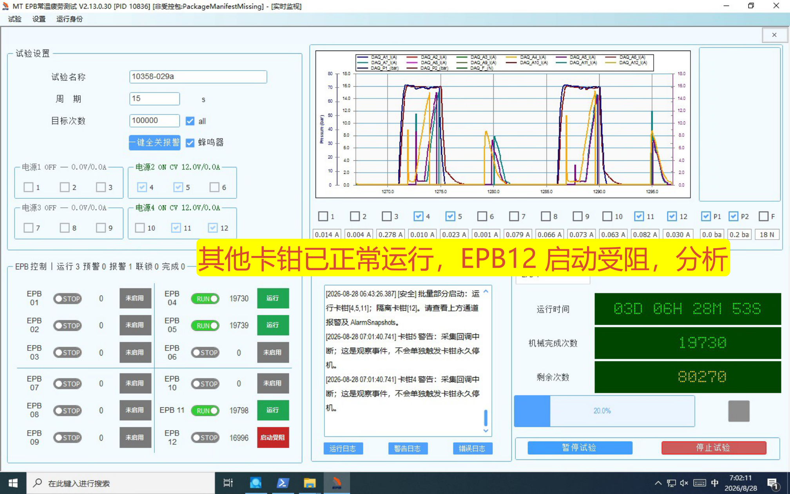
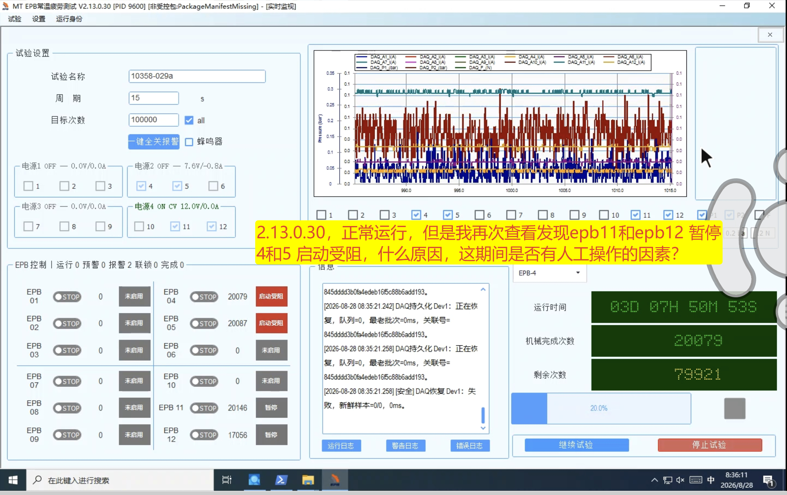

# V2.13.0.32 停止重启与关闭收口、DAQ 暂停恢复及隐藏问题彻底修复实施验证

> 实施日期：2026-08-28（Asia/Shanghai）
> 目标版本：V2.13.0.32
> 基线：未封版 V2.13.0.31 工作区；未回滚、覆盖或清理既有修改
> 原始分析：[2026-08-28 现场问题、根因与整改方案](./2026-08-28_10358-029a_V2.13.0.29-30_停止后拒绝启动_异常报警_关闭无响应与隐藏问题分析.md)

## 1. 实施结论

本轮已把“设备停止”“数据/DAQ 收口”“Watchdog 精确会话终止”和“UI 资源释放”合并为同一个可等待终态。停止完成前不再提前提示可重启；停止过程中点击开始会加入同一任务，终态成功后继续本次请求。主窗口关闭保留监控界面直到安全与 Watchdog 收口完成，失败时保持窗口可见并允许再次关闭重试，不再先销毁子窗形成灰色 MDI 空壳。

Watchdog 发送链改为每个连接一个串行 writer worker，普通消息容量 248、生命周期保留容量 8，生命周期消息优先、同优先级 FIFO。关闭时不可逆地设置 Closing，撤销连接、重连、拉起、心跳和发送所有权，Dispose 管道解除在途 I/O，并把新增的 `SendTerminal` 纳入 `AllWorkersTerminal`。迟到写任务始终被观察，正常应用退出记录为 `ExpectedApplicationExit`，操作员取消恢复记录为 `OperatorCanceledRecovery`，非预期进程退出记录为 `ProcessExitedUnexpectedly`。

DAQ 暂停状态增加单调 `Generation`。恢复在准入、断电/恢复等待和正式重入提交前复核代次；暂停代次发生变化时提交 `DaqRecoveredHeldForManualPause`，不再把已恢复的 Dev1/Dev2 错误转换为 `StartBlocked`。“继续试验”会先等待活动 DAQ 恢复终态，再复核新鲜度、压力、持久化边界和未来公共节律槽。

`ForwardUnderTargetHighLoadStall` 已从无人值守软件瞬态恢复中隔离。EPB12 等通道出现该故障后必须由操作员明确 Yes/No 确认；确认后清除旧自适应模型，执行 `max(5, Test.LearnCycles)` 个完整学习圈和 2 个不计正式目标的资格圈，全部通过才允许按未来公共槽重入。13.5 A 相关保护门槛未降低，软件不会把待排查的物理故障伪装成“已修复”。

版本身份已统一为 `2.13.0.32`：主程序、Watchdog Host、Client、Protocol、ClickOnce 和 strict v4 测试一致。

## 2. 现场截图回放

### 2.1 停止、关闭与拒绝再次启动

对应整改：`StopSessionReceipt` 同时绑定 `RunId/CommandId`、`SessionId/Generation/Lease`、`StopSafetyResult`、Watchdog shutdown 和 UI 释放结果；只有 `CanRestart/CanClose` 成立才放行。人工停止后的 fire-and-forget Watchdog shutdown 已删除。新会话绑定时会撤销上一会话的应用关闭授权，避免旧授权跨会话残留。

### 2.2 EPB12 高负载欠目标停滞

对应整改：禁止 `ForwardUnderTargetHighLoadStall` 进入 `BeginRecoverableChannelRestartLoop` 的无人值守入口；锁存人工完整重学习要求。UI 必须获得操作员确认，旧模型先耐久清空，学习或 2 圈资格复核任何一步失败都维持 `AlarmStopped` 和输出 OFF。

### 2.3 暂停后的 Dev1 DAQ 恢复提交错误

对应整改：`BatchPauseStateChangedEvent` 增加 `Generation`，不可变快照原子发布。Dev1/Dev2 共用完全对称的代次复核路径；暂停期间恢复成功只进入 `DaqRecoveredHeldForManualPause`，继续试验时等待恢复终态并执行二次准入检查。

## 3. 代码变更摘要

| 子系统 | 实施内容 | 关键文件 |
| --- | --- | --- |
| 停止/重启 | 组合终态回执、single-flight 加入、停止后自动继续同次开始请求 | `MTTfTest/EpbMonitorShutdownOwnership.cs`、`FrmEpbMainMonitor.cs`、`FrmEpbMainMonitor.BatchGuard.cs` |
| 主窗口关闭 | 安全准备与可视销毁分离；子窗全部收口后才关闭主窗；人工停止已释放 Watchdog 但 MDI 子窗仍存活时，主窗 X 仍进入统一退出收口 | `MTTfTest/Main_Frm.WatchdogUi.cs`、`WinFormsWatchdogUiCloseCoordinator.cs` |
| Watchdog 传输 | 每连接唯一 writer worker；248+8 有界队列；生命周期优先；在途任务观察；已返回 `AdmissionBusy` 的排队请求原子撤销，禁止随后迟到写出；`SendTerminal` | `Watchdog.Client/WatchdogClientTransportEngine.cs`、`Contracts/WatchdogShutdownContracts.cs` |
| Sidecar 终态 | 正常退出、取消恢复、意外退出使用稳定终态名称 | `MTTFTest.Watchdog/WatchdogHost.cs` |
| DAQ 暂停恢复 | 暂停代次、三段复核、恢复保持暂停、继续前等待 Dev1/Dev2 终态；`DaqRecoveredHeldForManualPause` 终态必须晚于对应电源组 OFF 完成 | `Controller/ChannelRuntimeState.cs`、`EpbManager.PauseResume.cs`、`EpbManager.cs` |
| 电源遥测 | `TelemetryCallTimeoutMs=1500`；SCPI 串行门与传输撤销；限流/低压持续时间使用 `Stopwatch` | `Config/PowerSupplyConfig.cs`、`Controller/PowerSupplyCoordinator.cs`、`MTTfTest/Config/PowerSupplyConfig.xml` |
| EPB12 恢复 | 人工确认、旧模型清除、完整学习、2 圈资格复核、禁止无人值守复跑；重学习门禁写入项目 `TestConfig.xml`，进程重启后仍不能由普通开始绕过 | `Config/EpbTestRecord.cs`、`ConfigLoader.cs`、`Controller/EpbManager.cs`、`EpbManager.PauseResume.cs` |
| 报警取证 | 报警所有权取得后、取消与 OFF 之前冻结 Trigger；后置尾巴完成后另存 Terminal；两相均记录 PSU V/I、DO 命令、最近 10 圈峰值基线差，无传感器字段写 `NotMeasured` | `Controller/EpbManager.cs` |
| DAQ 事故证据 | 根事故不因重型队列容量被拒绝；按设备保存 trigger/terminal；双设备共享事故目录；未齐全不发布完整终态 | `Controller/EpbManager.WarningSnapshots.cs` |
| 液压故障码 | `HydraulicSampleStale`、`HydraulicSampleUnavailable`、`HydraulicPressureBelowMinimum`；保留 `FailureReason` | `Controller/HydraulicGroupCoordinator.cs`、`Alarm/AlarmMessageLocalizer.cs` |
| EPB5 维护提示 | 100 个正式成功圈/窗口，预警率 10%，连续 2 窗口生成维护提示；不改变保护门槛 | `Config/AlarmConfigModels.cs`、`AlarmConfigLoader.cs`、`EpbManager.WarningSnapshots.cs` |
| 增量封存 | 本轮按用户要求不修改备份 PS1，也不把其专项验证并入本轮结论；由独立任务继续完善和验收 | `Tools/`（本轮排除） |

## 4. 接口和兼容性

- `BatchPauseStateChangedEvent.Generation`：新增单调暂停代次。
- `WorkerTerminationState.SendTerminal`：纳入全部 worker 终态；旧构造重载仍保留，旧调用方无须迁移。
- `HydraulicPressureLostException.FaultCode`：新增稳定故障码；原 `FailureReason` 保留。
- `PowerSupplyFleetConfig.TelemetryCallTimeoutMs`：缺失时默认 1500 ms。
- `WarningSnapshotConfig` 新增 EPB5 维护窗口、阈值和连续窗口配置；旧 XML 使用默认值。
- Watchdog 线协议版本不变，没有增加破坏性字段。
- 非受控运行目录继续允许启动，但窗口标题持续显示 `[非受控包:<Code>]`，启动日志保留 `PackageVerified` 和完整构建身份；没有增加启动硬门禁。

## 5. 本轮代码审查缺陷闭环

本轮针对当前未提交更改复核并修复了以下可执行缺陷：

1. 人工停止已释放 Watchdog 后，主窗 X 仍会落入旧 MDI guard，导致关闭无响应；现以“活动 Watchdog 证据或仍存活 MDI 子窗”作为统一退出协调准入。
2. `ForwardUnderTargetHighLoadStall` 的完整重学习要求原先只保存在进程内存；现已随项目配置耐久保存，普通开始、无人值守恢复和进程重启均不能绕过，只有完整学习和 2 圈资格复核成功后原子清除。
3. DAQ 在人工暂停代次变化时可能先发布恢复终态、后执行电源 OFF；现通过同一提交门复核暂停代次，并在终态提交前有界等待对应电源组 OFF。
4. Watchdog 调用方已经收到 `AdmissionBusy` 的请求仍可能留在队列中迟到写出；现以请求状态 CAS 区分 `Pending/Writing/Cancelled`，只对尚未被 writer 取得的请求返回 `AdmissionBusy`。
5. 报警现场诊断原先只在停机后的导出尾段采集；现保存 Trigger/Terminal 两相证据，避免用停机后的零电流、零电压覆盖根故障现场。

备份 PS1 及其测试不属于本轮闭环，未作功能性修改或执行。

## 6. 自动验证结果

| 验证 | 结果 |
| --- | --- |
| `msbuild TfTest.sln /p:Configuration=Debug /p:Platform=x86` | 通过，0 错误 |
| `msbuild TfTest.sln /p:Configuration=Release /p:Platform="Any CPU"` | 通过，0 错误 |
| `Tests/AdaptiveControlTests/bin/Debug/AdaptiveControlTests.exe` | **632/632 通过** |
| `AdaptiveControlTests --watchdog-winforms-ui` | **26/26 通过** |
| `AdaptiveControlTests --watchdog-client-send-hardening` | **22/22 通过** |
| `AdaptiveControlTests --epb-record-normalization` | **9/9 通过** |
| `AdaptiveControlTests --daq-pause-policy` | **1/1 通过** |
| `AdaptiveControlTests --alarm-policy` | **10/10 通过** |
| `AdaptiveControlTests --stop-watchdog-hardening` | **43/43 通过** |
| `AdaptiveControlTests --recovery-coordination` | **43/43 通过** |
| `AdaptiveControlTests --watchdog-host-strict-v4` | **19/19 通过** |
| `AdaptiveControlTests --watchdog-transport-hardening`（第二轮完整复跑） | **49/49 通过** |
| `AdaptiveControlTests --recovery-lifecycle` | **14/14 通过** |
| `AdaptiveControlTests --incident-10358-029` | **79/79 通过** |
| `Tests/EpbDiskWriterTests/bin/Debug/EpbDiskWriterTests.exe` | **55/55 通过** |
| `dotnet test Tests/PowerSupplyDebugger.Tests/PowerSupplyDebugger.Tests.csproj --no-build` | **17/17 通过** |

`AdaptiveControlTests --watchdog-transport-hardening` 首轮长组合压力在完成大量真实 Sidecar/句柄循环后，曾在 `WrongSessionId` 分类断言上出现 1 次 `SessionRevoked`/`IdentityRejected` 竞态失败；随后隔离执行 `--watchdog-client-failclosed-attached` 为 **6/6 通过**，再完整执行长组合组为 **49/49 通过**，并已越过原失败点。该现象未稳定复现，且两种分类均为 fail-closed，未出现错误附着或权限放行；仍在现场长稳测试中观察日志分类一致性。

全量 632 项与上述定向回归已实际覆盖 strict v4 身份、停止与 UI 收口、Watchdog 发送队列、DAQ 暂停恢复门禁、EPB12 人工重学习分类与跨重启锁存、恢复生命周期、现场事故组合、十万圈仿真以及落盘边界。GC/写超时相关定向用例未产生未观察任务异常。备份/封存专项测试按用户要求由另一任务负责，本轮未运行、未引用其结果。

## 7. 本地构建身份

| 项 | 值 |
| --- | --- |
| Git 分支 | `feature/safety-margin-freezeA-20260101` |
| 基线提交 | `9d9a1754c503` |
| 构建时工作区 | Dirty，100 个状态项；包含用户既有修改、并行任务产物与本轮实现 |
| Debug 主程序版本 | `2.13.0.32` |
| Watchdog Host 版本 | `2.13.0.32` |
| Debug 主程序 SHA-256 | `89305ee6c6d451f8e16a3b73893029445b8264a42e6d4cd809cc84666cb3e9cf` |
| Release 主程序 SHA-256 | `8b69440e63b24681fbd8e0b79496b071e69dd8883079785879a169918b8e4e32` |
| `PackageVerified` | 本地脏工作区构建，**不得宣称正式包**；应为 `False`/非受控告警语义 |

本轮没有执行 Git 提交，也没有调用受控 Release 封包脚本。以上哈希只用于复核本次本地验证产物，不可替代正式现场包 manifest。

## 8. 现场验收表

| 验收项 | 要求 | 当前状态 | 现场记录 |
| --- | --- | --- | --- |
| 停止后 100 ms 内开始 | 连续 100 次，不拒绝、不重复点击；自动加入旧收口 | 待现场 |  |
| 停止后 1 s/5 s 内开始 | 各连续 100 次，无旧 Sidecar 复活 | 待现场 |  |
| 主窗体 X | 运行/暂停/停止中/管道断开/拉起中各至少 100 次；无灰色空壳 | 待现场 |  |
| 监控窗 X、重复 X | 同一收口任务；超时窗口保持可见，可再次重试 | 待现场 |  |
| Dev1 暂停态故障注入 | 终态为 `DaqRecoveredHeldForManualPause`，继续后按未来公共槽重入 | 待现场 |  |
| Dev2 暂停态故障注入 | 与 Dev1 完全对称 | 待现场 |  |
| EPB12 故障恢复 | 无人值守不得复跑；人工确认后完整学习 + 2 圈资格复核 | 待现场 |  |
| 正式包身份 | 受控脚本生成，运行标题/日志显示 `PackageVerified=True` | 待封包 |  |

## 9. 未关闭的物理与主机排查项

下列项目不是软件构建能够替代的现场闭环，本轮明确保留为未关闭项：

1. EPB11/EPB12 A/B 换位，判断故障是否随卡钳、线束或电源支路迁移。
2. 在动作过程中测量 EPB12 负载端动态电压、继电器/端子压降与温升；现有软件取证中这些传感器字段为 `NotMeasured`。
3. 检查 EPB12 机械阻滞、丝杠/齿轮、夹紧机构和连接器接触状态。
4. 复核 Windows 主机在 08:14 一类事件中的 CPU、内存、句柄、线程、磁盘等待、杀毒扫描和校时记录；软件已改用单调时钟避免安全期限受校时影响，但不能消除外部调度抖动。
5. 现场正式验收前必须在干净、受控工作区运行 Release 封包，确认逐文件哈希和 `PackageVerified=True`。

## 10. 放行判断

代码级整改和自动化验证已完成，具备进入现场回归条件；本地构建不能作为正式验收包。只有第 8 节现场重复矩阵通过、EPB12 第 9 节物理检查闭环、受控 Release 包身份校验为真后，才能宣称 V2.13.0.32 现场正式放行。
