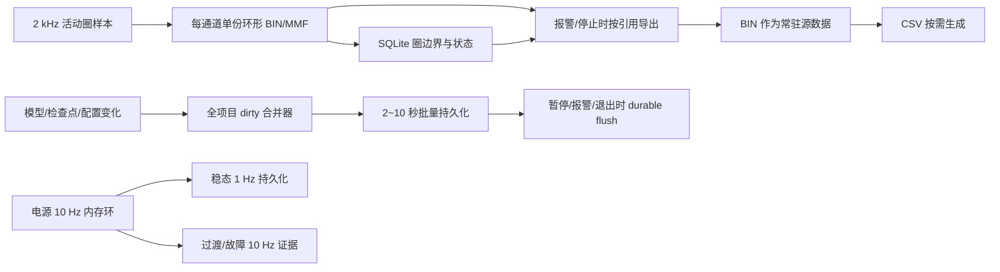

# 当前数据存储模式对硬盘寿命影响与可取消数据分析

> 分析日期：2026-08-09  
> 代码基线：MTTFTest `2.12.0.25`  
> 采样基线：每通道 2,000 Hz，每批 20 点，每条圈记录 32 B  
> 文档性质：现状分析和后续改造建议；本轮不直接删除现场数据、不修改程序代码  
> 关联文档：[项目数据存储路径与文件规则详细字典](./2026-08-09_项目数据存储路径与文件规则详细字典.md)

## 1. 直接结论

### 1.1 对硬盘的伤害到底大不大

不能简单回答“很大”或“不大”，需要区分磁盘类型、运行通道数、通道实际带圈时间和数据所在磁盘。

综合当前代码，结论如下：

1. **对机械硬盘，当前平均吞吐不高，通常不会因为写入带宽直接损坏硬盘。** 12 路全部处于活动圈时，主环形文件合计约 `0.768 MB/s`；机械盘更需要关注长时间通电、频繁创建/删除小文件、网络目录遍历和碎片，而不是这点连续写带宽。
2. **对消费级 SSD，属于需要治理的中等、极端工况下偏高的长期写入负载。** 12 路全天 100% 处于正式圈时，仅主环形写入约 `66.4 GB/天`；每圈再生成 Historical BIN，会再写约相同的数据量，二者合计约 `132.7 GB/天`。真实负载应再乘“活动占空比”。
3. **当前最不合理的并不是 100 MiB 环形文件，而是大量小文件的重复、强制持久写。** 自适应模型每通道每成功圈可能整文件保存 1～2 次；无人值守检查点每通道每正式圈 `WriteThrough + Flush(true) + Replace`；项目 TestConfig 即使没有变化也每 30 秒整文件替换一次。这些操作数据量不大，却会产生大量文件系统元数据和同步刷新。
4. **项目容量和硬盘磨损不是同一个指标。** `HistoricalSnapshots` 只保留 12 圈，目录体积很小，但每完成一圈都重新生成一份 BIN，所以它的长期写入量很大；反过来，12 个 `.dat` 预分配共 1.2 GB，看起来很大，但未启用通道不会持续写。
5. **现版本已经消除了旧版本最严重的快照放大。** Warning 默认仅写轻量 JSONL，Incident 默认不复制最近圈，Alarm 默认只复制报警通道，Latest 默认每通道保留 10 包。因此旧项目曾出现的 13 GiB 快照膨胀不能直接等同于 V2.12.0.25 的正常新增速度。
6. **没有现场硬盘型号和 SMART/NVMe 健康数据，不能断言还能使用多少年。** 本文给出逻辑写入量和优化优先级；最终寿命判断仍需读取目标盘累计主机写入量、额定 TBW、健康百分比、介质错误及使用时间。

### 1.2 哪些数据或写入可以取消

按安全性分为三档：

| 结论 | 对象 | 建议 |
|---|---|---|
| **可以直接停止生成** | `W\DataStore\yyyy-MM-dd_HH-mm-ss` 中只有四份配置副本的空壳运行目录 | 当前连续 DAQ Raw 定时器已注释，这些目录没有被回放、报警或恢复逻辑引用；建议取消每次主界面初始化时创建 |
| **可以取消重复写，但不能取消数据语义** | 无变化的 `P\Config\TestConfig.xml` 30 秒保存 | 改为 dirty/hash 判定；只有进度或配置改变才保存，停止/暂停/关闭时强制保存 |
| **可以取消每圈强制写** | `%LOCALAPPDATA%\MTTFTest\unattended-run-checkpoint.json` 每通道每圈保存 | 保留授权、RunId、故障和暂停检查点；剩余圈数由 `index.db`/项目进度恢复，正常运行中合并为 5～10 秒一次心跳 |
| **可以取消同圈重复保存** | `EpbAdaptiveProfiles.xml` 一圈内基础样本和截止观测分别整文件持久化 | 内存模型继续逐观测更新；全项目合并 2～5 秒保存一次，圈终态、暂停、报警和退出时强制保存 |
| **有条件可以取消** | 每个正式圈都生成 `HistoricalSnapshots` BIN | 它是环形数据读取失败时的第二副本；验证 100 MiB 环形容量始终覆盖最近 10 圈后，可默认关闭或改为可配置 |
| **有条件可以取消** | Latest、Learning、Alarm 中长期常驻 CSV | BIN 已含完整样本，CSV 可再生成；必须先补齐 BIN→CSV 工具并修改 manifest/checksum/现场流程，不能直接删现有 CSV |
| **只减少容量，不明显改善寿命** | 为未启用通道预创建的 100 MiB `.dat` | 改为通道首次启用时延迟创建；主要节省约 100 MiB/未启用通道，未启用文件本来就不持续写 |
| **不建议取消** | 活动通道 `.dat`、`index.db`、Alarm、Incident、故障 Warning、当前模型、项目配置、关键日志 | 它们承担控制恢复、报警取证、数据回放或安全审计职责 |

最优先的方向不是“删掉报警证据”，而是**停止无变化整文件替换、合并模型/检查点持久化、取消没有运行数据的空壳目录，再评估 Historical 的第二副本是否值得长期逐圈写入**。

## 2. 分析边界和证据可信度

### 2.1 已核对内容

本次直接检查了最新代码中的：

- 2 kHz DAQ 批次到环形文件和 SQLite 的持久化链；
- 12 路固定大小 `.dat` 和 8 MiB 短视图的内存映射写入；
- 每秒 SQLite 圈进度检查点；
- Historical、Latest、Learning、Warning、Alarm 和 Incident 导出；
- 自适应模型原子保存和 `.bak` 生成；
- 无人值守检查点的 `WriteThrough`/耐久刷新；
- 30 秒项目配置自动保存；
- 10 Hz 程控电源遥测；
- 主日志和 `ui-info.log` 的追加、轮转和保留；
- 已有六通道 2 kHz 持续写盘测试及现场封存分析。

### 2.2 本次无法直接证明的内容

- 用户早期示例 `\\wj-epb\EPB_Data\10358-029_V2.11.0.3_0807_1111` 在本次检查时不可访问，因此没有重新读取该共享目录。
- 当前本机选中的 `D:\EPB_Data\10358-029` 只有约 174 KiB 配置、索引和日志，没有真实长跑数据，不可作为容量样本。
- 未取得现场系统盘、数据盘或 NAS 的型号、介质类型、额定 TBW、SMART/NVMe 健康信息。
- 操作系统缓存、SSD 固件磨损均衡、文件系统簇大小和 NAS RAID 会影响“逻辑写入量 → 物理 NAND 写入量”的换算，代码无法给出唯一写放大系数。

因此，本文对“程序逻辑写入量和相对风险”的判断为高置信度；对“某一块硬盘还能使用多少年”不做无依据承诺。

### 2.3 旧项目真实容量样本及其适用范围

2026-08-07 对用户示例旧项目做过只读盘点，估算总量约 `12.5～13.5 GiB`：

| 旧项目目录 | 当时估算占用 | 当时的主要原因 |
|---|---:|---|
| AlarmSnapshots | 约 7.3 GiB | 86 次报警，每次会复制多路最近 10 圈 CSV+BIN |
| Latest | 约 1.9 GiB | 121 个停止包，只增不清；EPB8 单通道曾有 81 包 |
| WarningSnapshots | 约 1.6 GiB | 1,055 次软预警，每次保存一圈 CSV+BIN |
| IncidentSnapshots | 约 0.7～1.3 GiB | 终态事故再次复制受影响通道最近 10 圈 |
| LearningCycles | 约 0.8 GiB | 11 次学习运行、548 个学习圈 CSV+BIN |
| PowerSupplyTelemetry | 约 230 MiB | 10 Hz 连续遥测 |
| log | 约 55 MiB | 当时日志尚未完成当前轮转治理 |
| HistoricalSnapshots | 约 40 MiB | 每通道只保留约 12 圈，因此表面容量不大 |
| index.db | 约 10.6 MiB | 约 68,814 条圈索引，不是当时容量主因 |

这份样本证明“同一圈跨目录重复 + CSV/BIN 双份常驻”确实会形成大容量，但不能直接代表 V2.12.0.25 的新增速度，因为当前代码已经：

- Alarm 默认只导出报警通道；
- Latest 默认每通道保留 10 个停止包；
- Warning 默认只写每日轻量 JSONL，完整证据默认关闭；
- Incident 默认不复制最近 10 圈；
- 日志已轮转并按 7/30 天保留。

另一方面，旧盘点只统计“最终还留在目录里的字节”，没有统计被滚动覆盖/删除前已经发生的累计写入。因此 Historical 虽然最终只有约 40 MiB，长期写盘量仍可能很高；这正是容量和硬盘寿命必须分开分析的原因。

## 3. 数据实际写到哪块盘

程序并非把全部数据写在项目目录：

| 根路径 | 主要持续写入 | 对应设备 |
|---|---|---|
| `W = Environment.CurrentDirectory` | `DataStore\EPB1..12_sliding.dat`、主界面初始化配置副本目录 | 由程序快捷方式“起始位置”决定，通常是程序所在本地盘，也可能被配置到其他盘 |
| `P = StoreDir\TestName` | `index.db`、Historical、Latest、Learning、Warning、Alarm、Incident、Telemetry、日志和项目配置 | 如果 StoreDir 是 UNC，则落在 NAS/文件服务器；如果是盘符，则落在该本地盘 |
| `%LOCALAPPDATA%\MTTFTest` | 无人值守恢复检查点 | Windows 系统盘/用户配置盘 |
| `%LOCALAPPDATA%\Wanxiang\EPBTest` | 最近项目选择 | Windows 系统盘，只有项目切换时少量写入 |
| `%TEMP%` / EXE 目录 | Incident 主目录写入失败时的回退证据 | 系统临时盘或程序盘，仅异常时产生 |

这意味着使用 `\\wj-epb\EPB_Data` 时：

- 环形原始数据可能仍写本机程序盘；
- Historical、Telemetry、快照和日志写 NAS；
- 无人值守检查点仍高频写本机系统盘。

因此不能只观察 NAS 容量判断本机 SSD 是否有写入压力，也不能只看本机任务管理器判断 NAS 的实际持久化延迟。

## 4. 主环形数据的精确写入模型

### 4.1 单通道写入速率

每条记录固定 32 B：

```text
8 B 时间戳 + 4 B 圈号 + 4 B 样本号 + 8 B 电流 + 8 B 压力 = 32 B
```

每通道 2,000 Hz，所以通道处于正式圈、学习圈或显式 Free-Run 时：

```text
2,000 × 32 = 64,000 B/s = 0.064 MB/s
```

未开圈且 Free-Run 关闭时，`WriteBatch` 直接返回，不写该通道 `.dat`。

### 4.2 多通道连续活动时

| 同时活动通道 | 环形逻辑写入 | 每活动小时 | 24 小时连续活动 |
|---:|---:|---:|---:|
| 1 | 0.064 MB/s | 0.230 GB | 5.53 GB |
| 6 | 0.384 MB/s | 1.382 GB | 33.18 GB |
| 12 | 0.768 MB/s | 2.765 GB | 66.36 GB |

这里使用十进制 GB。实际每天写入量应乘活动占空比：

```text
活动占空比 D = 每圈实际处于 BeginCycle～CompleteCycle 的秒数 / 试验周期秒数
```

例如周期 15 秒、实际圈写入窗口为 5 秒，则 `D≈33.3%`。

### 4.3 逐圈 Historical 带来的第二次写入

每个正式圈完成后，程序把同一批 32 B 记录再次写成 Historical BIN。忽略文件系统元数据时，它的字节量约等于正式圈对应的环形写入量。

因此“环形 + Historical”估算为：

| 工况 | 8 小时合计 | 24 小时合计 |
|---|---:|---:|
| 6 通道、100% 活动 | 22.12 GB | 66.36 GB |
| 12 通道、25% 活动 | 11.06 GB | 33.18 GB |
| 12 通道、50% 活动 | 22.12 GB | 66.36 GB |
| 12 通道、100% 活动 | 44.24 GB | 132.71 GB |

虽然 Historical 最终仅保留 12 圈，但旧圈删除并不能撤销已经发生的 NAND/磁盘写入。

### 4.4 100,000 圈项目的数量级

设每圈实际记录 `A` 秒，则每个通道仅“环形 + Historical”的逻辑写入约为：

```text
100,000 × 2,000 × 32 × A × 2
= 12.8 GB × A
```

| 每圈记录时长 A | 每通道 100,000 圈 | 12 通道 100,000 圈 |
|---:|---:|---:|
| 3 秒 | 38.4 GB | 460.8 GB |
| 5 秒 | 64.0 GB | 768.0 GB |
| 10 秒 | 128.0 GB | 1.536 TB |
| 15 秒 | 192.0 GB | 2.304 TB |

这些数字尚未计入 CSV、Telemetry、模型文件、检查点、日志和文件系统写放大，但也没有减去暂停、故障、通道未启用和圈间空闲时间。

## 5. 每条写入链路的硬盘影响

| 写入链路 | 当前触发频率 | 当前写法 | 容量影响 | 寿命/IOPS影响 | 判断 |
|---|---|---|---:|---:|---|
| 环形 `.dat` | 仅活动圈，2 kHz/通道，10 ms 批 | MMF `WriteArray`，不逐批 `Flush(true)` | 中～高 | 中，顺序批写、OS 可合并 | 必须保留 |
| SQLite 圈索引 | 圈开始/终态；活动圈约每秒检查点 | WAL、`Synchronous=Normal`，当前双设备约 2 次事务/秒 | 低 | 低～中 | 必须保留，现粒度合理 |
| Historical BIN | 每个正式圈一次 | 从环形读出再写一份 BIN，保留 12 圈 | 表面低 | **高，长期字节量约等于正式圈环形写入** | 最大的可选重复数据 |
| 自适应模型 XML | 成功圈通常 1～2 次；异常连续数更新分支还可能追加保存 | 整个 XML 写 `.tmp`、`Flush(true)`、Replace 并更新 `.bak` | 低 | **高，小文件耐久刷新和元数据极频繁** | 必须保留模型，但必须合并写 |
| 无人值守检查点 JSON | 每个选中通道每个正式圈 | 新临时文件、WriteThrough、`Flush(true)`、Replace | 极低 | **高，系统盘高频强制持久化** | 每圈写入可取消 |
| 项目 TestConfig | 固定每 30 秒，即使无变化 | 整个 XML `.tmp` + Replace | 低 | 中，不必要的周期替换 | 改 dirty 保存 |
| 电源 Telemetry | 每活动电源组 100 ms 一行 | 20 行或 1 秒 Flush，单 RunId 单 CSV | 中 | 中，持续顺序追加 | 保留安全事件，稳态可降采样 |
| `run/warning/error` | 每条日志 | 长期打开 StreamWriter，AutoFlush 到 OS；关键终态才 durable flush | 低～中 | 低～中 | 保留并继续限频 |
| `ui-info.log` | 每条 UI 信息 | 当前每行打开、写入、关闭文件 | 低 | 中等小 I/O 开销 | 可批量追加；不能直接删掉唯一 UI 消息 |
| Warning JSONL | 只有软预警 | 有界队列、批量最多 128 条 | 通常低 | 低 | 保留 |
| Warning 完整证据 | 默认关闭；启用后限频 600 秒/通道/代码 | CSV+BIN+metadata+checksum | 低～中 | 事件型 | 默认策略合理 |
| Latest | 停止/暂停/报警等停止触发 | 每次最多最近 10 圈 CSV+BIN；每通道保留 10 包 | 中 | 事件型；频繁暂停时放大 | 保留，但可改 BIN 主存 |
| Alarm | 硬报警 | 默认只复制报警通道 10 圈及诊断证据 | 故障时中～高 | 事件型 | 安全证据，不能取消 |
| Incident | DAQ/系统事故阶段 | 默认不复制最近 10 圈 | 通常低 | 事件型 | 保留 |
| Learning | 清空重学或首次学习 | 每个学习/资格圈 CSV+BIN | 低～中 | 阶段型 | 保留最近运行，CSV可按需 |
| `DataStore\时间目录` | 每次主监控初始化 | 只复制 AI/DO/AO/Test 四个配置 | 低但无限累积 | 低 | 当前模式下可以取消 |

## 6. 高频小文件写入为什么值得优先处理

### 6.1 自适应模型

当前正式自适应圈中和结束时：

1. `PersistSuccessfulAdaptiveSample` 更新模型并立即保存整个 `EpbAdaptiveProfiles.xml`；
2. 如果本圈形成有效控流截止观测，`PersistAdaptiveCutoffObservation` 又更新并再次保存整个 XML；
3. 峰值证据不一致连续数等状态发生变化时，其他分支也会立即保存模型；
4. 每次保存都序列化全项目最多 12 个 Profile；
5. 写临时文件后执行 `Flush(true)`；
6. 再 Replace 正式文件并产生/覆盖 `.bak`。

按 12 通道、15 秒周期、连续 8 小时计算：

```text
12 × (8×3600/15) = 23,040 个通道圈
```

因此仅按正常成功路径，模型就可能产生约 `23,040～46,080` 次整文件保存；异常连续数变化较多时还会更高。即使每份 XML 只有几十 KiB，这种强制刷新和原子替换也会产生明显的元数据、杀毒扫描、NAS 往返和 SSD 写放大。

建议：

- 模型仍在内存中逐观测更新；
- 全项目共用一个 dirty generation；
- 后台最多每 2～5 秒合并保存一次；
- 每个通道完整圈结束后不重复保存两次；
- 暂停、停止、报警、正常关闭和生成无人值守暂停点前执行一次 durable flush；
- 保存失败只影响恢复模型，不得阻塞控制断电。

### 6.2 无人值守检查点

`RecordFormalCycleCommitted(channel)` 每个通道每完成一个正式圈都会重新读取、修改、强制落盘并 Replace 同一个 JSON。12 通道、15 秒周期下：

- 每分钟约 48 次；
- 每小时约 2,880 次；
- 8 小时约 23,040 次；
- 24 小时约 69,120 次。

它记录的 `RemainingFormalCycles` 与 `index.db` 正式完成圈和项目 RunCount 重复。授权、RunId、配置哈希、优雅暂停和恢复 nonce 必须耐久保存，但每个通道每圈单独强制落盘没有必要。

建议：

- 开始授权、撤销授权、优雅暂停、故障升级、重启意图继续立即 durable 保存；
- 正常圈完成仅更新内存计数；
- 5～10 秒合并心跳一次，或者只更新 UpdatedUtc 和最近已知 DB 边界；
- 启动恢复时以 `index.db` 为完成圈权威，检查点只决定是否有权自动续测；
- 停止/退出前排空检查点写入。

### 6.3 项目 TestConfig

主界面 `_autoSaveTimer` 固定 30 秒调用 `SaveEpbRecordsToTestConfigSafe()`，没有比较内存内容是否改变。即使项目处于停止状态，窗口打开 24 小时仍会产生：

```text
24×60×60/30 = 2,880 次整 XML 替换
```

而正式圈数已经逐圈写入 `index.db`，程序启动也会从 DB 回填 RunCount。因此建议：

- EpbRecord/项目设置变化时标记 dirty；
- 只有 dirty 才写；
- 多次圈完成在 30 秒窗口内合并；
- 可增加 5 分钟兜底心跳，但内容哈希相同仍跳过；
- 暂停、停止、报警终态和关闭时强制保存。

### 6.4 日志

主日志已经不再对每条 Warn/Error 执行磁盘 durable flush，只有停止、报警、关闭等关键边界强制刷新，方向正确。但还有两点可优化：

- `ProjectLogStore` 的 StreamWriter 为 `AutoFlush=true`，每行会推到 FileStream/OS 缓存；可在保持异常前上下文的前提下按 100～500 ms 或固定条数批量写。
- `UiInfoLogStore` 当前每条 UI 信息都打开文件、追加一行、关闭文件。数据量不大，但文件句柄和元数据操作不经济；建议同 UI 150 ms 批次一起批量追加。

不建议简单关闭日志。此前现场故障分析依赖 `run.log`、`warning.log`、`error.log` 和 `ui-info.log` 的互相印证；应减少重复成功日志和批量写，而不是删除错误与安全终态。

## 7. HistoricalSnapshots 是否属于无用数据

### 7.1 它为什么存在

Historical 不是完全无用。`EpbDiskWriter.ReadValidatedCycleRecords()` 首先从共享环形 `.dat` 读取；发现环形数据已被覆盖、圈号/样本号不匹配或数据不完整时，会尝试从 `HistoricalSnapshots` 中恢复相同圈号的 BIN。因此它是最近圈的第二份物理副本。

### 7.2 为什么它又是最大的可选重复写

当前每个正式圈都写一次 BIN，然后只保留最近：

```text
max(3, HardAlarmLastNCycles + 2) = 12 圈/通道
```

100 MiB 环形文件可容纳约 3,276,800 条记录。在 2,000 Hz 下，相当于约 1,638 秒、即 27.3 分钟的活动样本。当前报警和停止通常只需要最近 10 圈；15 秒周期的 10 圈时间跨度约 150 秒，明显小于 27.3 分钟。

在当前典型参数下，Historical 更像“额外抗环形损坏副本”，而不是防止正常容量覆盖所必需的副本。

### 7.3 建议决策

不建议在没有回归验证时直接删掉这段逻辑。建议增加：

```xml
<HistoricalSnapshots Enabled="false" RetainCyclesPerChannel="12" />
```

默认关闭前必须自动验证：

1. `MaxActiveCycleRecords < ring capacity`；
2. 最坏周期和最近 10 圈跨度具有至少 2 倍环形容量余量；
3. Alarm/Latest 在环形回绕边界仍能导出完整 CSV+BIN；
4. 程序重启后仍能从现有 `.dat + index.db` 导出最近圈；
5. 模拟环形记录损坏时能明确报证据缺失，而不是生成错误文件；
6. 现场是否把“两份物理副本”作为取证或质量体系硬要求。

如果质量体系明确要求最近圈双副本，则保留 Historical；如果没有该要求，它是当前最值得取消的高字节重复写。

## 8. 电源遥测是否可以取消

不能完全取消。10 Hz 电源遥测用于证明：

- 电源是否真的连接和输出；
- VSet/ISet/OVP/OCP 与实测值；
- CV/CC、限流、限功率和保护跳闸；
- 卡钳异常是支路电流问题还是组电源问题；
- 报警前后的电源状态链。

但稳态 10 Hz 全字段长期写入并非全部有同等价值。按每行约 150～300 B 估算：

```text
单活动电源组：10 行/s ≈ 0.13～0.26 GB/天
四个活动电源组：约 0.52～1.04 GB/天
```

建议采用分级采样：

- 输出切换、启动、关断、接近限流、异常前后：保持 10 Hz；
- 稳态且数值变化小：降到 1 Hz；
- 每 10 秒额外保留 min/max/avg 或变化摘要；
- 出现异常时，把内存中最近 60 秒 10 Hz 环写入 Alarm/Incident；
- 运行时直接执行 3 天保留，不再只依赖离线 BAT；
- 单文件按日或 100 MiB 轮转。

这样保留安全价值，同时可减少约 80%～90% 的稳态遥测写入。

## 9. CSV 与 BIN 是否都需要常驻

### 9.1 两者的关系

BIN 每样本固定 32 B，是完整、紧凑、可回放的源数据。CSV 保存同样的数据，但包含文本时间戳和小数格式，抽样旧项目中 CSV 通常是 BIN 的约 1.8～2 倍。

因此同一圈长期保存 CSV+BIN，逻辑写入和容量通常约为只保存 BIN 的 2.8～3 倍。

### 9.2 可以改为 BIN 主存的对象

- Latest 的非故障圈；
- Learning 的成功圈；
- Warning 完整证据的普通链路；
- Alarm 中报警前的历史圈。

### 9.3 不能直接删除现有 CSV 的原因

- 当前 Latest 有效包校验要求 CSV/BIN stem 成对；
- Alarm/Warning manifest 和 checksum 可能已经记录 CSV；
- 现场人员可能直接用 Excel 打开 CSV；
- 直接删除会让一份原本完整的证据变成“不完整包”。

落地顺序必须是：

1. 提供经过测试的 BIN→CSV 按需导出工具；
2. 为 manifest 增加 `CsvMaterialization=OnDemand`；
3. 更新 Latest/Alarm/Warning 完整性校验；
4. 抽样从 BIN 重建 CSV，对时间戳、圈号、样本号、电流和压力逐行比对；
5. 新版本先采用 BIN 主存；旧项目只能在备份和校验后处理 CSV。

## 10. 可以立即取消、可以条件取消、必须保留

### 10.1 P0：建议立即停止或合并

| 对象 | 当前问题 | 落地动作 | 数据损失 |
|---|---|---|---|
| `W\DataStore\时间目录` 四份配置 | 主监控每次初始化均创建；旧 Raw 定时器已禁用 | 删除 `PrepareDataStoreDirectory()` 无数据模式调用；只在真实 Raw 开启或正式运行开始且配置变化时留一次 | 无运行样本损失 |
| TestConfig 无变化保存 | 30 秒固定整文件替换 | dirty/hash 保存 | 无 |
| 无人值守每通道每圈 checkpoint | 与 DB 完成圈重复，且强制 durable | 5～10 秒合并；转换状态立即 durable | 最多丢失几秒缓存计数，但启动从 DB 校正后无圈数据损失 |
| 同圈 1～2 次模型整文件保存 | 12 通道放大到数万次 | 全项目 dirty 合并；圈/停止边界强制保存 | 正常关闭无；异常断电最多丢失合并窗口内模型增量 |
| UI 日志逐行开关文件 | 小 I/O 过多 | 150 ms/50 行批量追加 | 无，队列满策略保持 |

### 10.2 P1：验证后可以取消或降级

| 对象 | 当前价值 | 建议 |
|---|---|---|
| Historical 每圈 BIN | 最近圈第二物理副本 | 无双副本质量要求时默认关闭；保留配置开关 |
| Latest/Alarm/Learning 的非故障 CSV | 人工直读方便 | BIN 常驻，CSV 按需生成 |
| 稳态 10 Hz 电源遥测 | 完整连续曲线 | 稳态 1 Hz，事件/过渡 10 Hz，异常保存前 60 秒 |
| 未启用通道 `.dat` | 未来启用可立即使用 | 延迟到首次启用/首次 BeginCycle 创建；主要节省空间 |
| `ui-info.log` 独立持久化 | 保存操作者视角消息 | 只有当全部 `LogInfo` 同时进入结构化主日志后，才可取消独立文件；当前不能直接停 |

### 10.3 必须保留

- 活动通道环形 `.dat`；
- `index.db` 及运行中的 WAL/SHM；
- 当前项目 `Config\TestConfig.xml`；
- 当前自适应模型和程序安全参数；
- 报警通道的报警圈及公共诊断；
- Incident 的触发、恢复和终态 JSON/诊断；
- 软预警轻量 JSONL；
- 关键电源异常/过渡遥测；
- Latest 最近停止包；
- Warning/Alarm/Incident 的 metadata、manifest 和 checksum；
- `run/warning/error` 和必要的 UI 操作记录；
- 重置、清理和配置变更审计。

## 11. 现有存量中哪些可以清理

以下只针对**程序已关闭、项目已外部备份**的情况。

### 11.1 高置信度可清理

- `W\DataStore\yyyy-MM-dd_HH-mm-ss` 中确认只含 AI/DO/AO/Test 四个配置副本、没有 `Raw/Stat.bin` 的旧目录；
- 明确属于遗留发布包的 `Config\TestConfig - 复制*.xml` 人工副本；
- 已完成版本迁移且另有项目备份的 `EpbAdaptiveProfiles.xml.pre-v5.*`、过量 `.corrupt.*`；
- 程序关闭后确认不被正式包引用的 `.tmp-*`、`.zip.tmp`；
- 现有 BAT 规则认定超出数量/天数的标准 Latest、Incident、Learning、Telemetry、Historical 和日志归档。

### 11.2 只能经工具和校验后清理

- CSV/BIN 成对证据中的 CSV；
- Warning 根级 Archive ZIP；
- 旧 `warning-events-*.jsonl`；
- 超过 12 圈但名称异常的 Historical；
- `.reset-staging-*`：必须先查看 reset audit，确认不是等待回滚的隔离区；
- 项目外 `%TEMP%\EPBTest\IncidentSnapshots` 和 EXE 回退证据。

### 11.3 不能因为“看起来旧”就删除

- `EPB*_sliding.dat`：多个项目索引可能仍引用其最近数据；程序下次启动还会重新创建；
- `index.db`、`index.db-wal`、`index.db-shm`；
- 当前模型 `.xml/.bak`；
- 当前或最近故障的 Alarm/Incident；
- manifest/checksum 引用的文件；
- 活动日志和审计日志；
- 未知目录和无法解析的文件。

## 12. 对 HDD、SSD 和 NAS 的不同影响

### 12.1 机械硬盘 HDD

- 0.384～0.768 MB/s 连续写对带宽压力很小；
- 环形写接近顺序写，模式相对友好；
- 大量快照目录、XML Replace、日志逐行开关文件会造成寻道和元数据更新；
- 频繁递归扫描、杀毒、压缩和同步备份更容易带来延迟，而不是把盘片“写坏”；
- 主要寿命因素仍包括通电时间、温度、振动、启停和机械故障。

### 12.2 SSD/NVMe

- 总写入字节和物理写放大直接影响 NAND 消耗；
- 100 MiB 热环持续覆盖由控制器做磨损均衡，不等于永远磨同一物理单元，但仍计入主机写入量；
- 小文件 `Flush(true)`、Replace 和备份会放大 4 KiB 页面、目录、日志和 FTL 元数据写；
- 12 通道长期 24×7、Historical 开启且使用消费级低 TBW SSD 时，应视为真实寿命风险；
- 企业级 SSD、较大容量盘和高 TBW 型号承受能力更高，但仍应消除无意义同步写。

### 12.3 NAS/网络共享

- NAS 端介质承担项目目录写入，本机盘仍承担环形文件和检查点；
- 小文件 Replace/Flush 会产生网络往返和服务器元数据事务，性能影响可能大于字节量；
- 大量目录和小文件会拖慢扫描、备份、快照、杀毒和人工取证；
- 网络抖动会反向影响持久化尾延迟，程序虽然有队列和安全暂停，但不能用队列掩盖长期不可写；
- 现场长跑时不得同时压缩或完整复制活动项目目录。

## 13. 建议的目标存储模式



目标原则：

1. 每个原始样本正常只持续写一份主源；
2. 故障、停止和人工导出才物化重复证据；
3. CSV 作为展示格式，不作为所有场景的第二份源数据；
4. 高频状态先更新内存，跨通道合并后持久化；
5. durable flush 只用于授权变化、圈/会话终态、安全故障、暂停和退出；
6. 所有容量策略不得进入控制热路径；
7. 删除失败只告警，不能阻断断电和试验控制。

## 14. 推荐实施顺序

### P0：先减少同步小写入

1. 新增 `AdaptiveProfilePersistenceCoordinator`，合并模型写入；
2. 无人值守检查点改为状态转换立即保存、正常运行 5～10 秒心跳；
3. TestConfig 增加 dirty/hash 判定；
4. UI 日志按批追加；
5. 为上述保存增加计数和耗时日志，证明写入次数真实下降。

这是风险最低、对控制功能影响最小、同时改善 SSD 寿命和 NAS 延迟的一组改动。

### P1：停止明显无用产物

1. 当前 Raw 记录未启用时不调用 `PrepareDataStoreDirectory()`；
2. `.dat` 改为首次启用/首次写入时延迟创建；
3. 为 `.corrupt/.pre-v` 模型备份增加数量上限；
4. Warning JSONL、Archive 和 Telemetry 增加运行时天数/容量保留，不只依赖 BAT。

### P2：用试验决定 Historical

1. 加 Historical 开关，默认先保持 true；
2. 在测试环境关闭，执行环形回绕、重启、暂停、报警、Latest 和导出故障注入；
3. 一个完整班次对比有无 Historical 的证据完整性和磁盘写入量；
4. 质量/现场签字确认后再决定新项目默认 false 或继续 true。

### P3：BIN 主存、CSV 按需

1. 实现 BIN→CSV 命令或 UI 导出；
2. 更新 manifest 和完整性规则；
3. 新项目先切换 Latest/Learning 非故障圈；
4. Alarm 故障圈继续保留 CSV+BIN，历史圈仅 BIN；
5. 旧数据只在外部备份和抽样重建校验后处理。

## 15. 验收指标

### 15.1 功能和安全

- 圈样本数、圈号、时间戳和 SQLite 状态与当前版本一致；
- 自适应控制每圈仍使用最新内存模型；
- 异常退出后模型最多回退一个约定合并窗口，不出现文件损坏；
- 无人值守恢复从 DB 重新核对剩余圈，不能多跑或少跑；
- Alarm/Latest 任取 20 份均能导出并校验完整；
- 配置、模型和检查点保存失败不阻断安全断电；
- 关闭前所有 dirty 持久化任务有界排空。

### 15.2 写入次数

以 12 通道、15 秒周期为压力工况：

| 对象 | 当前理论值 | 改造目标 |
|---|---:|---:|
| 自适应模型 | 正常成功路径约 48～96 次/分钟；异常分支可能更高 | 全项目不超过 12～30 次/分钟，且同一 dirty generation 只保存一次 |
| 无人值守检查点 | 约 48 次/分钟 | 正常运行不超过 6～12 次/分钟；状态转换除外 |
| TestConfig | 固定 2 次/分钟 | 内容无变化时 0 次；变化合并后不超过 2 次/分钟 |
| UI 日志文件打开 | 每 UI 消息一次 | 每 100～200 ms 或 50 行一次 |
| DataStore 配置目录 | 每次主界面初始化 1 个 | Raw 禁用时 0 个 |
| Historical BIN | 每通道每正式圈 1 个 | 若现场批准关闭，则 0；若保留则现状不变 |

### 15.3 字节和磁盘健康

现场至少记录：

- 进程 `IO Write Bytes/sec` 和 `IO Other Operations/sec`；
- 数据盘 `Disk Write Bytes/sec`、平均/最大响应时间和队列长度；
- NAS SMB 延迟、服务器卷写入量和快照/备份时间；
- SSD/NVMe：累计 Host Writes/Data Units Written、Percentage Used、Media Errors、Unsafe Shutdowns；
- HDD：Power-On Hours、温度、重映射扇区、待定扇区、不可校正错误；
- 项目每小时新增字节和文件数；
- `AdaptiveProfiles/checkpoint/TestConfig/Historical/Telemetry/log` 分类型写入计数。

验收至少覆盖 2/8/24 小时，正式无人值守放行仍按既有 72 小时门禁。不能只看平均 MB/s，必须检查 P95/P99/最大写入延迟和是否触发 DAQ 持久化积压。

## 16. 最终建议

### 16.1 现在可以确定的事项

- 当前环形写入的平均带宽不大，机械盘不会因为 `0.768 MB/s` 就被快速“写坏”；
- 12 通道长时间运行时，SSD 累计写入量不可忽略；
- Historical 逐圈复制会把正式圈样本写入量近似翻倍；
- 自适应模型、无人值守检查点和 TestConfig 存在明确的高频整文件/强制刷新优化空间；
- 空壳 `DataStore\时间目录` 在当前 Raw 禁用模式下可以取消；
- 报警、Incident、索引和活动环形数据不能为了省盘直接关闭。

### 16.2 推荐决策

1. **立即实施小文件写入合并和 dirty 保存。** 这是收益最大、证据风险最低的改动。
2. **立即停止生成无 Raw 数据的时间配置目录。** 如需要配置追溯，改为正式 RunId 一份且配置未变化不重复。
3. **Telemetry 改稳态 1 Hz、事件 10 Hz，并把 3 天保留做进运行时。**
4. **把 Historical 设为可配置，在台架关闭验证后再决定默认值。** 如果没有双副本硬要求，建议默认关闭。
5. **中期实施 BIN 主存、CSV 按需。** 不能直接批量删除现有 CSV。
6. **上线前读取现场硬盘健康信息。** 如果是消费级 SSD 且 12 路 24×7，应优先更换/迁移到高 TBW 数据盘或企业级存储，并将程序盘、项目盘和 NAS 的写入分开监控。

## 17. 代码和历史证据依据

- 环形文件、SQLite、Historical/Latest 和 CSV/BIN：[EpbDiskWriter.cs](../../../DataOperation/EpbDiskWriter.cs)
- 2 kHz 持久化批次：[DaqPersistenceCoordinator.cs](../../../Controller/DaqPersistenceCoordinator.cs)
- Historical 和 Warning 规则：[EpbManager.WarningSnapshots.cs](../../../Controller/EpbManager.WarningSnapshots.cs)
- 自适应样本保存入口：[EpbCycleRunner.Adaptive.cs](../../../Controller/EpbCycleRunner.Adaptive.cs)
- 自适应模型原子耐久写：[EpbAdaptiveProfiles.cs](../../../Config/EpbAdaptiveProfiles.cs)
- 无人值守每圈检查点：[UnattendedRecovery.cs](../../../MTTfTest/UnattendedRecovery.cs)
- 30 秒项目配置保存和 DataStore 时间目录：[FrmEpbMainMonitor.cs](../../../MTTfTest/FrmEpbMainMonitor.cs)
- 程控电源 10 Hz 遥测：[PowerSupplyTelemetryCsvRecorder.cs](../../../Controller/PowerSupplyTelemetryCsvRecorder.cs)、[PowerSupplyCoordinator.cs](../../../Controller/PowerSupplyCoordinator.cs)
- 主日志写入和轮转：[ProjectLogStore.cs](../../../Config/ProjectLogStore.cs)
- UI 日志写入和轮转：[UiInfoLogStore.cs](../../../Config/UiInfoLogStore.cs)
- 六通道 2 kHz 写盘实测：[V2.12.0.17 六通道 2 kHz 离线持续写盘压力验证](../../02_Issues/2026-08-09_V2.12.0.17_六通道2kHz离线持续写盘压力验证.md)
- 旧项目容量样本：[EPB 数据存储量分析与编号目录规划](./2026-08-07_EPB数据存储量分析与编号目录规划.md)
- 最新长期运行封存和写盘边界：[V2.12.0.24 已接收批次全链路耐久整改](../../02_Issues/2026-08-09_V2.12.0.24_已接收批次全链路耐久与退出收口完成性整改.md)

## 18. 2026-08-12 用户最终决策与 V2.13.0.1 对齐说明

本节为归档源文档的追加决策记录，保留前文分析和历史建议不变。用户最终批准的程序级默认值为：

- `Latest` 默认保留 CSV（`LatestStorageLevel=CsvOnly`）；
- `Alarm` 默认保留 CSV（`AlarmStorageLevel=CsvOnly`）。报警公共诊断、报警判断、断电、圈封存和同组策略不因该格式选择改变；
- `Learning` 默认保留 BIN（`LearningStorageLevel=BinOnly`），用于学习/资格圈封存及环形覆盖后的恢复读取；
- 三个级别严格只允许 `CsvOnly`、`BinOnly`、`CsvAndBin`，不存在 `None`。缺失或非法配置回退上述默认并记录启动警告；
- 旧 CSV+BIN 包继续有效，单格式包按实际存在的文件校验；manifest/checksum 记录实际生成文件；
- 未启用通道预创建的 12×100 MiB `.dat` 保持现状，不能借本次治理变更；
- Raw 禁用时不再创建 `DataStore\\时间戳` 空配置目录；显式启用 Raw 时仍保留未来路径和原始数据格式；
- Historical 为程序级 `Enabled/RetainCyclesPerChannel`，默认 `true/12`；禁用只停止新导出，不删除旧数据，也不改变 ring/index/alarm/latest；
- AlarmConfig 中 `WarningSnapshots.SaveCsv/SaveBin` 仍是预警证据配置，与程序级 `AlarmStorageLevel` 独立。

以上决策已在 V2.13.0.1 的 `StorageFormatPolicy`、`EpbDiskWriter`、启动配置和验收测试中落地。本文前文关于“Alarm/Latest 必须 CSV+BIN”属于当时的安全建议；在新决策下，旧包仍兼容，新生成包以本节程序级配置为准。自适应模型合并写、无人值守 heartbeat、Telemetry 等其他低写入项目若未完成充分崩溃/并发验证，不因本节而改变控制或恢复逻辑。

